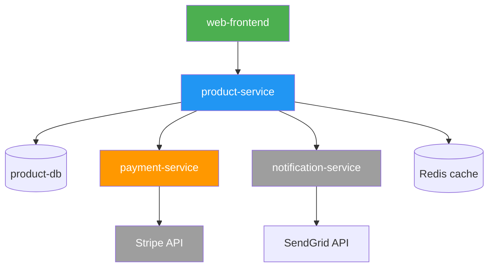

---


contentType: docs
slug: service-dependency-map-template
title: "Plantilla de Mapa de Dependencias de Servicios"
description: "Una plantilla para documentar y visualizar dependencias de servicios en sistemas distribuidos."
metaDescription: "Usa esta plantilla de mapa de dependencias de servicios para documentar dependencias upstream y downstream, rutas críticas y análisis de impacto de fallas."
difficulty: intermediate
topics:
  - architecture
tags:
  - architecture
  - microservices
  - dependencies
  - visualization
  - template
relatedResources:
  - /docs/microservice-contract-template
  - /docs/adr-template
  - /docs/database-schema-documentation-template
  - /docs/engineering-handbook-template
  - /guides/microservices-architecture-guide
  - /docs/api-lifecycle-management-template
  - /docs/api-monitoring-alerting-template
lastUpdated: "2026-06-21"
author: "StackPractices"
seo:
  metaDescription: "Usa esta plantilla de mapa de dependencias de servicios para documentar dependencias upstream y downstream, rutas críticas y análisis de impacto de fallas."
  keywords:
    - arquitectura
    - microservicios
    - dependencias
    - visualización
    - plantilla


---

## Visión General

En sistemas distribuidos, una falla en un servicio puede propagarse de forma impredecible. Un mapa de dependencias documenta qué servicios llaman a cuáles, la naturaleza de esas llamadas y el radio de impacto si una dependencia falla. Esta plantilla proporciona tanto un registro textual como guía para crear diagramas visuales.

## Cuándo Usar


- For alternatives, see [Microservice Contract Template](/es/docs/microservice-contract-template/).

Usa este recurso cuando:
- Integras un nuevo servicio y documentas sus relaciones upstream y downstream
- Planeas una migración, deprecación o cambio de infraestructura
- Realizas un análisis de modos y efectos de falla (FMEA)

## Solución

```markdown
# Mapa de Dependencias de Servicios: `<Nombre del Servicio>`

## 1. Metadatos del Servicio

| Campo | Valor |
|-------|-------|
| Servicio | `nombre` |
| Equipo Responsable | `@equipo-nombre` |
| Repositorio | `github.com/org/repo` |
| Runtime | `Kubernetes / ECS / Lambda / VM` |
| Última Actualización | `YYYY-MM-DD` |

## 2. Dependencias Upstream (Este Servicio Consume)

| Servicio | Protocolo | Endpoint / Tema | Propósito | Crítico? | Fallback |
|----------|-----------|-----------------|-----------|----------|----------|
| user-service | HTTP | GET /users/{id} | Validación de auth | Sí | Cache por 5 min |
| payment-service | gRPC | Charge() | Procesar pago | Sí | Cola para retry |
| notification-service | Evento | `notify.send` | Enviar email | No | Omitir silenciosamente |
| analytics-service | HTTP | POST /events | Métricas | No | Descartar (best effort) |

## 3. Dependencias Downstream (Servicios que Consumen Este)

| Servicio | Protocolo | Endpoint / Tema | Propósito | Rate Limit |
|----------|-----------|-----------------|-----------|------------|
| web-frontend | HTTP | GET /api/products | Catálogo | 1,000/min |
| mobile-app | HTTP | GET /api/products | Catálogo | 500/min |
| inventory-service | Evento | `inventory.update` | Cambios de stock | 10,000/hr |

## 4. Dependencias Externas

| Proveedor | Servicio | Propósito | SLA | Escalamiento |
|-----------|----------|-----------|-----|--------------|
| Stripe | Payment API | Procesar tarjetas | 99.9% | support@stripe.com |
| SendGrid | Email API | Email transaccional | 99.9% | status.sendgrid.com |
| AWS S3 | Object storage | Cargas de archivos | 99.99% | AWS Support |

## 5. Análisis de Ruta Crítica

| Flujo | Servicios Involucrados | Latencia Máxima Aceptable | Riesgo si Falla |
|-------|------------------------|---------------------------|-----------------|
| Checkout | web → cart → payment → user | 2s | Pérdida de ingresos |
| Login | web → user → session-cache | 500ms | Bloqueo de usuarios |
| Search | web → search → product-db | 1s | UX degradada |

## 6. Matriz de Impacto de Fallas

| Dependencia Falla | Impacto Directo | Impacto en Cascada | Mitigación |
|-------------------|-----------------|--------------------|------------|
| payment-service | No puede checkout | Sin ingresos | Cola + retry + alerta |
| user-service | No puede autenticar | Todos los flujos se detienen | JWT cacheado + modo degradado |
| notification-service | Emails retrasados | Sin cascada | Omitir + log de auditoría |

## 7. Representación del Diagrama

```
[web-frontend] ──→ [product-service] ──→ [product-db]
                        │
                        ↓
              [payment-service] ←── [Stripe]
                        │
                        ↓
           [notification-service] ──→ [SendGrid]
```

- Usar diagramas C4 o gráficos de dependencias (Graphviz, Mermaid, Lucidchart)
- Código de color: verde (saludable), amarillo (degradado), rojo (interrupción), gris (eliminación planeada)
```

## Explicación

El mapa separa **upstream** (lo que el servicio necesita) de **downstream** (lo que necesita el servicio). Las banderas de criticidad destacan qué fallas requieren atención inmediata. La matriz de impacto de fallas responde "¿qué se rompe y qué tan grave es?" antes de que ocurran incidentes. Las dependencias externas tienen su propia sección porque los SLAs de proveedores están fuera de tu control. El diagrama proporciona un resumen visual para revisiones de arquitectura.

## Ejemplo de Diagrama Mermaid

Usa Mermaid.js para renderizar mapas de dependencias directamente en Markdown o wikis:



Codigo de color: verde (punto de entrada), azul (servicio principal), naranja (dependencia critica), gris (externa/no critica).

## Configuracion de Circuit Breaker

Para cada dependencia upstream critica, configura un circuit breaker para prevenir fallas en cascada:

```yaml
circuit_breakers:
  payment-service:
    failure_threshold: 5          # Abrir despues de 5 fallos consecutivos
    failure_rate_threshold: 0.5   # O 50% tasa de fallo en ventana
    window_duration: 60s          # Ventana rodante de 60 segundos
    open_state_duration: 30s      # Permanecer abierto 30s antes de half-open
    max_calls_in_half_open: 3     # Probar con 3 llamadas antes de cerrar
    fallback: queue_for_retry     # Enviar a cola de retry asincrono

  user-service:
    failure_threshold: 10
    failure_rate_threshold: 0.3
    window_duration: 30s
    open_state_duration: 10s
    max_calls_in_half_open: 5
    fallback: cached_jwt          # Usar JWT cacheado por 5 minutos

  notification-service:
    failure_threshold: 20
    failure_rate_threshold: 0.8
    window_duration: 120s
    open_state_duration: 60s
    max_calls_in_half_open: 10
    fallback: skip_silently       # Descartar notificacion, log de auditoria
```

## Diseno de Endpoint de Health Check

Expón la salud de dependencias a traves de un endpoint estructurado para que los servicios downstream puedan verificar tu estado:

```json
{
  "status": "degraded",
  "timestamp": "2026-06-26T10:00:00Z",
  "dependencies": {
    "postgres": {
      "status": "healthy",
      "latency_ms": 3
    },
    "redis": {
      "status": "healthy",
      "latency_ms": 1
    },
    "payment-service": {
      "status": "unhealthy",
      "latency_ms": null,
      "error": "connection_timeout",
      "circuit_breaker": "open"
    }
  }
}
```

Devuelve `200 OK` cuando esta saludable, `503 Service Unavailable` cuando esta degradado o no saludable. Esto permite que los load balancers drenen trafico de instancias no saludables automaticamente.

## Automatizacion de Descubrimiento de Dependencias

Los mapas manuales se desactualizan. Automatiza el descubrimiento con estos enfoques:

### Graficos de Servicios con OpenTelemetry

Habilita tracing de OpenTelemetry en todos los servicios. El collector exporta un span de grafo de servicios que mapea relaciones llamador-llamado en tiempo real:

```yaml
receivers:
  otlp:
    protocols:
      grpc:
        endpoint: 0.0.0.0:4317

processors:
  servicegraph:
    latency_bucket: [10, 50, 100, 200, 500, 1000, 2000]
    store:
      ttl: 30s

exporters:
  prometheus:
    endpoint: 0.0.0.0:9090
```

### Descubrimiento por DNS

Para servicios internos, consulta registros DNS SRV para descubrir dependencias en tiempo de ejecucion:

```bash
dig SRV _payment._tcp.service.consul
dig SRV _notification._tcp.service.consul
```

### Analisis de Codigo

Analiza sentencias import y archivos de configuracion para construir un grafo de dependencias estatico:

```python
import ast
import os

def find_dependencies(project_dir):
    deps = set()
    for root, _, files in os.walk(project_dir):
        for f in files:
            if f.endswith(".py"):
                with open(os.path.join(root, f)) as fh:
                    tree = ast.parse(fh.read())
                    for node in ast.walk(tree):
                        if isinstance(node, ast.Import):
                            for alias in node.names:
                                deps.add(alias.name)
                        elif isinstance(node, ast.ImportFrom):
                            deps.add(node.module)
    return deps
```

Esto detecta dependencias en tiempo de compilacion pero pierde las de tiempo de ejecucion como llamadas HTTP a servicios externos. Combina con datos de tracing para una imagen completa.

## Variantes

| Contexto | Enfoque | Notas |
|----------|---------|-------|
| Startup | Tabla simple + diagrama Mermaid | Mantenerlo en el README del servicio |
| Enterprise | Diagramas C4 + integracion CMDB | Usar herramientas como ServiceNow o Backstage |
| Serverless | Granularidad a nivel de funcion | Mapear Lambdas individuales a triggers y destinos |
| Event-driven | Mapear topicos y suscripciones, no solo HTTP | Incluir topicos Kafka, colas SQS y esquemas de eventos |

## Lo que funciona

1. Actualizar el mapa despues de cada cambio arquitectonico, no solo trimestralmente
2. Almacenar mapas en control de versiones junto al codigo del servicio
3. Marcar dependencias como deprecadas antes de eliminarlas, con fechas objetivo de remocion
4. Incluir limites de tasa y cuotas para servicios downstream para prevenir sobrecarga accidental
5. Enlazar cada dependencia a su contrato de microservicio o runbook para referencia rapida
6. Etiquetar cada dependencia con su nivel de SLA para que on-call sepa que arreglar primero
7. Incluir direccion del flujo de datos para dependencias bidireccionales (request/response vs evento)

## Errores Comunes

1. Documentar solo llamadas HTTP sincronas e ignorar dependencias de eventos asincronos
2. Tratar todas las dependencias como igualmente criticas, ocultando el verdadero radio de impacto
3. Crear diagramas demasiado detallados para leer en una sola pantalla
4. No actualizar mapas despues de refactorizaciones, haciendolos poco confiables
5. Omitir servicios de terceros porque "son problema de alguien mas"
6. Olvidar documentar configuraciones de timeout y retry para cada dependencia
7. No mapear la topologia de replicacion de base de datos, causando confusion durante failover

## Preguntas Frecuentes

### ¿Que herramienta deberia usar para dibujar mapas de dependencias?

Mermaid.js funciona bien en Markdown y wikis. Lucidchart y draw.io son mejores para presentaciones. Para descubrimiento automatizado, usa Datadog Service Map, AWS X-Ray o graficos de servicios de OpenTelemetry.

### ¿Como mantengo los mapas actualizados sin actualizaciones manuales?

Usa tracing distribuido (Jaeger, Zipkin) para descubrir automaticamente graficos de llamadas. Exporta la topologia de traces a un diagrama vivo que se actualiza con cada despliegue.

### ¿Debo incluir bases de datos y caches como dependencias?

Si. Las bases de datos y caches son dependencias criticas de infraestructura. Incluyelas con su tipo (PostgreSQL, Redis, DynamoDB) y cualquier detalle de pool de conexiones o replicacion que afecte la conmutacion por error.

### ¿Como documento dependencias circulares?

Marcalas explicitamente con una etiqueta "CIRCULAR" y documenta el plan para romper el ciclo. Las dependencias circulares entre servicios indican una abstraccion faltante o un limite de servicio que necesita repensarse.

### ¿Cual es la diferencia entre un mapa de dependencias y un service mesh?

Un mapa de dependencias es documentacion. Un service mesh (Istio, Linkerd) es infraestructura que hace cumplir politicas en tiempo de ejecucion. Usa el mapa para diseno que el mesh deberia aplicar: timeouts, retries, circuit breakers.

### ¿Deberia incluir librerias internas y paquetes compartidos?

Si, si se versionan y despliegan independientemente. Las librerias compartidas que se compilan dentro del binario del servicio no necesitan estar en el mapa de dependencias, pero su version debe rastrearse en los metadatos del servicio.

### ¿Como manejo dependencias especificas por entorno?

Algunos servicios dependen de diferente infraestructura en staging vs produccion (ej. SQS en prod, RabbitMQ en staging). Documenta ambos en el mapa con una columna de entorno, o mantén mapas separados por entorno si las diferencias son significativas.

### ¿Con que frecuencia debo actualizar el mapa de dependencias?

Actualiza despues de cada despliegue que agregue, elimine o cambie una dependencia. Revisa el mapa completo durante revisiones de arquitectura (al menos trimestralmente). Los mapas desactualizados son peores que no tener mapa porque crean falsa confianza.

### ¿Deberia documentar configuraciones de timeout y retry para cada dependencia?

Si. Incluye el timeout configurado, numero de retries y estrategia de backoff para cada dependencia upstream. Esta informacion es critica durante incidentes cuando necesitas entender cuanto tiempo una dependencia fallida bloqueara la solicitud antes de que el circuit breaker se abra.

### ¿Que es el analisis de radio de impacto?

El analisis de radio de impacto identifica el efecto downstream de una falla de servicio. Para cada dependencia, documenta que flujos orientados al usuario se rompen, que servicios se degradan y cuales fallan silenciosamente. Esto ayuda a los ingenieros on-call a priorizar esfuerzos de recuperacion durante incidentes.

### ¿Como mapeo dependencias event-driven?

Para cada topico de eventos que tu servicio publica o consume, documenta el nombre del topico, esquema, grupo de consumidor y que pasa ante fallos (DLQ, retry, descartar). Las dependencias de eventos son faciles de pasar por alto porque no hay llamada HTTP directa, pero son igual de criticas.
