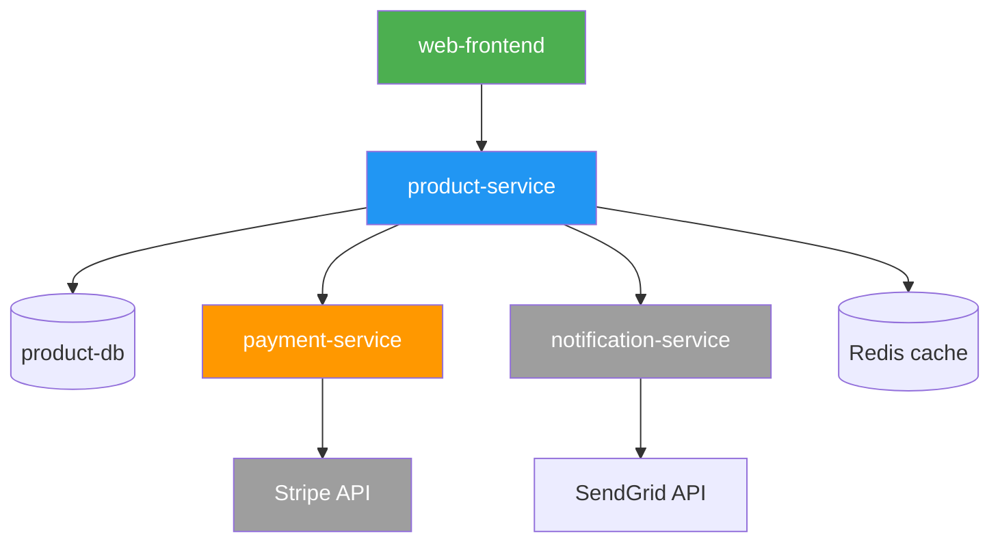

---


contentType: docs
slug: service-dependency-map-template
title: "Service Dependency Map Template"
description: "A template for documenting and visualizing service dependencies in distributed systems."
metaDescription: "Use this service dependency map template to document upstream and downstream dependencies, critical paths, and failure impact analysis."
difficulty: intermediate
topics:
  - architecture
tags:
  - architecture
  - microservices
  - dependencies
  - visualization
  - template
relatedResources:
  - /docs/microservice-contract-template
  - /docs/adr-template
  - /docs/database-schema-documentation-template
  - /docs/engineering-handbook-template
  - /guides/microservices-architecture-guide
  - /docs/api-lifecycle-management-template
  - /docs/api-monitoring-alerting-template
lastUpdated: "2026-06-21"
author: "StackPractices"
seo:
  metaDescription: "Use this service dependency map template to document upstream and downstream dependencies, critical paths, and failure impact analysis."
  keywords:
    - architecture
    - microservices
    - dependencies
    - visualization
    - template


---
## Overview

In distributed systems, a failure in one service can cascade unpredictably. A dependency map documents which services call which, the nature of those calls, and the blast radius if a dependency fails. This template provides both a textual registry and guidance for creating visual diagrams.

## When to Use


- For alternatives, see [Microservice Contract Template](/docs/microservice-contract-template/).

Use this resource when:
- Onboarding a new service and documenting its upstream and downstream relationships
- Planning a migration, deprecation, or infrastructure change
- Conducting failure mode and effects analysis (FMEA)

## Solution

```markdown
# Service Dependency Map: `<Service Name>`

## 1. Service Metadata

| Field | Value |
|-------|-------|
| Service | `name` |
| Owner Team | `@team-name` |
| Repository | `github.com/org/repo` |
| Runtime | `Kubernetes / ECS / Lambda / VM` |
| Last Updated | `YYYY-MM-DD` |

## 2. Upstream Dependencies (This Service Consumes)

| Service | Protocol | Endpoint / Topic | Purpose | Critical? | Fallback |
|---------|----------|------------------|---------|-----------|----------|
| user-service | HTTP | GET /users/{id} | Auth validation | Yes | Cache for 5 min |
| payment-service | gRPC | Charge() | Process payment | Yes | Queue for retry |
| notification-service | Event | `notify.send` | Send email | No | Skip silently |
| analytics-service | HTTP | POST /events | Track metrics | No | Drop (best effort) |

## 3. Downstream Dependencies (Services Consuming This)

| Service | Protocol | Endpoint / Topic | Purpose | Rate Limit |
|---------|----------|------------------|---------|------------|
| web-frontend | HTTP | GET /api/products | Product catalog | 1,000/min |
| mobile-app | HTTP | GET /api/products | Product catalog | 500/min |
| inventory-service | Event | `inventory.update` | Stock changes | 10,000/hr |

## 4. External Dependencies

| Vendor | Service | Purpose | SLA | Escalation |
|--------|---------|---------|-----|------------|
| Stripe | Payment API | Process cards | 99.9% | support@stripe.com |
| SendGrid | Email API | Transactional email | 99.9% | status.sendgrid.com |
| AWS S3 | Object storage | File uploads | 99.99% | AWS Support |

## 5. Critical Path Analysis

| Flow | Services Involved | Max Acceptable Latency | Risk if Broken |
|------|-------------------|------------------------|----------------|
| Checkout | web → cart → payment → user | 2s | Revenue loss |
| Login | web → user → session-cache | 500ms | User lockout |
| Search | web → search → product-db | 1s | Degraded UX |

## 6. Failure Impact Matrix

| Dependency Fails | Direct Impact | Cascading Impact | Mitigation |
|------------------|---------------|------------------|------------|
| payment-service | Cannot checkout | No revenue | Queue + retry + alert |
| user-service | Cannot authenticate | All flows stop | Cached JWT + degraded mode |
| notification-service | Emails delayed | No cascading | Skip + audit log |

## 7. Diagram Representation

```
[web-frontend] ──→ [product-service] ──→ [product-db]
                        │
                        ↓
              [payment-service] ←── [Stripe]
                        │
                        ↓
           [notification-service] ──→ [SendGrid]
```

- Use C4 diagrams or dependency graphs (Graphviz, Mermaid, Lucidchart)
- Color code: green (healthy), yellow (degraded), red (outage), gray (planned removal)
```

## Explanation

The map separates **upstream** (what the service needs) from **downstream** (what needs the service). Criticality flags highlight which failures require immediate attention. The failure impact matrix answers "what breaks and how badly?" before incidents happen. External dependencies get their own section because vendor SLAs are outside your control. The diagram provides a visual summary for architecture reviews.

## Mermaid Diagram Example

Use Mermaid.js to render dependency maps directly in Markdown or wikis:



Color coding: green (entry point), blue (core service), orange (critical dependency), gray (external/non-critical).

## Circuit Breaker Configuration

For each critical upstream dependency, configure a circuit breaker to prevent cascading failures:

```yaml
circuit_breakers:
  payment-service:
    failure_threshold: 5          # Open after 5 consecutive failures
    failure_rate_threshold: 0.5   # Or 50% failure rate in window
    window_duration: 60s          # Rolling 60-second window
    open_state_duration: 30s      # Stay open for 30s before half-open
    max_calls_in_half_open: 3     # Test with 3 calls before closing
    fallback: queue_for_retry     # Send to async retry queue

  user-service:
    failure_threshold: 10
    failure_rate_threshold: 0.3
    window_duration: 30s
    open_state_duration: 10s
    max_calls_in_half_open: 5
    fallback: cached_jwt          # Use cached JWT for 5 minutes

  notification-service:
    failure_threshold: 20
    failure_rate_threshold: 0.8
    window_duration: 120s
    open_state_duration: 60s
    max_calls_in_half_open: 10
    fallback: skip_silently       # Drop notification, log audit entry
```

## Health Check Endpoint Design

Expose dependency health through a structured endpoint so downstream services can check your status:

```json
{
  "status": "degraded",
  "timestamp": "2026-06-26T10:00:00Z",
  "dependencies": {
    "postgres": {
      "status": "healthy",
      "latency_ms": 3
    },
    "redis": {
      "status": "healthy",
      "latency_ms": 1
    },
    "payment-service": {
      "status": "unhealthy",
      "latency_ms": null,
      "error": "connection_timeout",
      "circuit_breaker": "open"
    }
  }
}
```

Return `200 OK` when healthy, `503 Service Unavailable` when degraded or unhealthy. This lets load balancers drain traffic to unhealthy instances automatically.

## Dependency Discovery Automation

Manual maps drift from reality. Automate discovery with these approaches:

### OpenTelemetry Service Graphs

Enable OpenTelemetry tracing in all services. The collector exports a service graph span that maps caller-callee relationships in real time:

```yaml
receivers:
  otlp:
    protocols:
      grpc:
        endpoint: 0.0.0.0:4317

processors:
  servicegraph:
    latency_bucket: [10, 50, 100, 200, 500, 1000, 2000]
    store:
      ttl: 30s

exporters:
  prometheus:
    endpoint: 0.0.0.0:9090
```

### DNS-Based Discovery

For internal services, query DNS SRV records to discover dependencies at runtime:

```bash
dig SRV _payment._tcp.service.consul
dig SRV _notification._tcp.service.consul
```

### Code Analysis

Parse import statements and configuration files to build a static dependency graph:

```python
import ast
import os

def find_dependencies(project_dir):
    deps = set()
    for root, _, files in os.walk(project_dir):
        for f in files:
            if f.endswith(".py"):
                with open(os.path.join(root, f)) as fh:
                    tree = ast.parse(fh.read())
                    for node in ast.walk(tree):
                        if isinstance(node, ast.Import):
                            for alias in node.names:
                                deps.add(alias.name)
                        elif isinstance(node, ast.ImportFrom):
                            deps.add(node.module)
    return deps
```

This catches compile-time dependencies but misses runtime ones like HTTP calls to external services. Combine with tracing data for a complete picture.

## Variants

| Context | Approach | Notes |
|---------|----------|-------|
| Startup | Simple table + Mermaid diagram | Keep it in the service README |
| Enterprise | C4 diagrams + CMDB integration | Use tools like ServiceNow or Backstage |
| Serverless | Add function-level granularity | Map individual Lambdas to triggers and destinations |
| Event-driven | Map topics and subscriptions, not just HTTP | Include Kafka topics, SQS queues, and event schemas |

## What Works

1. Update the map after every architectural change, not just quarterly
2. Store maps in version control alongside service code
3. Mark dependencies as deprecated before removing them, with target removal dates
4. Include rate limits and quotas for downstream services to prevent accidental overload
5. Link each dependency to its microservice contract or runbook for fast reference
6. Tag each dependency with its SLA tier so on-call knows what to fix first
7. Include data flow direction for bidirectional dependencies (request/response vs event)

## Common Mistakes

1. Documenting only synchronous HTTP calls and ignoring async event dependencies
2. Treating all dependencies as equally critical, masking the real blast radius
3. Creating diagrams that are too detailed to read in a single screen
4. Not updating maps after refactors, making them untrusted
5. Omitting third-party services because "they are someone else's problem"
6. Forgetting to document retry and timeout settings for each dependency
7. Not mapping database replication topology, causing confusion during failover

## Frequently Asked Questions

### What tool should I use to draw dependency maps?

Mermaid.js works well in Markdown and wikis. Lucidchart and draw.io are better for presentations. For automated discovery, use Datadog Service Map, AWS X-Ray, or OpenTelemetry service graphs.

### How do I keep maps current without manual updates?

Use distributed tracing (Jaeger, Zipkin) to auto-discover call graphs. Export trace topology into a living diagram that updates with each deployment.

### Should I include databases and caches as dependencies?

Yes. Databases and caches are critical infrastructure dependencies. Include them with their type (PostgreSQL, Redis, DynamoDB) and any connection pool or replication details that affect failover.

### How do I document circular dependencies?

Mark them explicitly with a "CIRCULAR" tag and document the plan to break the cycle. Circular dependencies between services indicate a missing abstraction or a service boundary that needs rethinking.

### What is the difference between a dependency map and a service mesh?

A dependency map is documentation. A service mesh (Istio, Linkerd) is infrastructure that enforces policies at runtime. Use the map to design what the mesh should enforce: timeouts, retries, circuit breakers.

### Should I include internal libraries and shared packages?

Yes, if they are versioned and deployed independently. Shared libraries that are compiled into the service binary do not need to be in the dependency map, but their version should be tracked in the service metadata.

### How do I handle environment-specific dependencies?

Some services depend on different infrastructure in staging vs production (e.g., SQS in prod, RabbitMQ in staging). Document both in the map with an environment column, or maintain separate maps per environment if the differences are significant.

### How often should I update the dependency map?

Update after every deployment that adds, removes, or changes a dependency. Review the full map during architecture reviews (at least quarterly). Stale maps are worse than no map because they create false confidence.

### Should I document timeout and retry settings for each dependency?

Yes. Include the configured timeout, retry count, and backoff strategy for each upstream dependency. This information is critical during incidents when you need to understand how long a failing dependency will block the request before the circuit breaker opens.

### What is blast radius analysis?

Blast radius analysis identifies the downstream impact of a service failure. For each dependency, document which user-facing flows break, which services degrade, and which fail silently. This helps on-call engineers prioritize recovery efforts during incidents.

### How do I map event-driven dependencies?

For each event topic your service publishes or consumes, document the topic name, schema, consumer group, and what happens on failure (DLQ, retry, drop). Event dependencies are easy to miss because there is no direct HTTP call, but they are just as critical.
