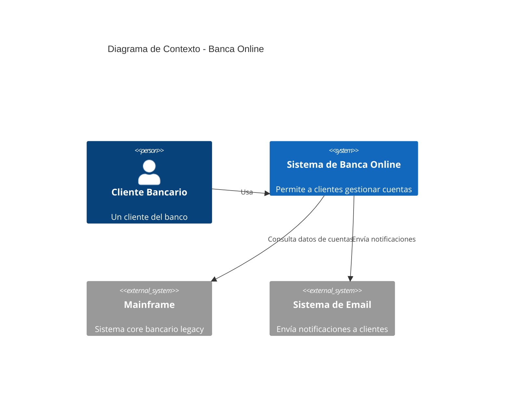
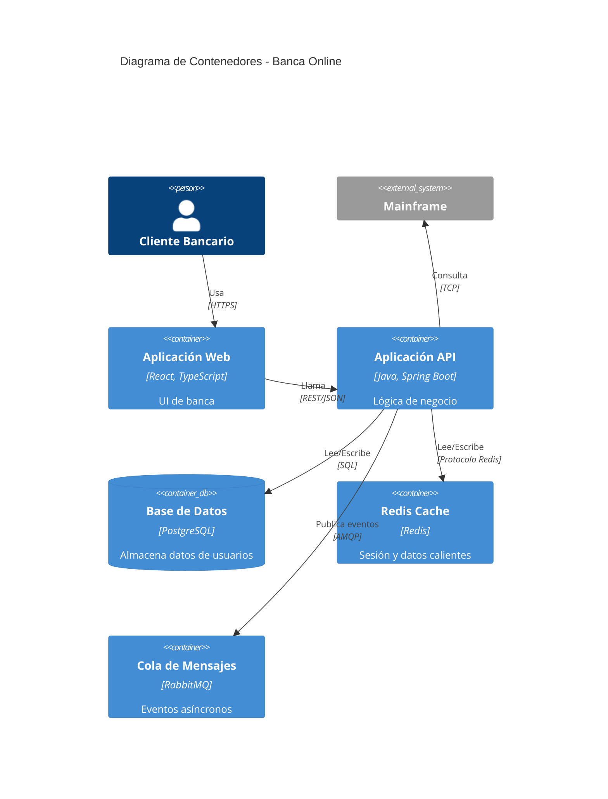

---


contentType: docs
slug: system-diagram-template
title: "Plantilla de Diagramas de Sistema"
description: "Una plantilla para crear diagramas de arquitectura siguiendo el modelo C4."
metaDescription: "Usa esta plantilla de diagramas de sistema para documentar arquitectura con diagramas de contexto, contenedores, componentes y código del modelo C4."
difficulty: beginner
topics:
  - architecture
tags:
  - architecture
  - c4-model
  - diagram
  - visualization
  - template
  - standards
relatedResources:
  - /docs/service-dependency-map-template
  - /docs/microservice-contract-template
  - /docs/adr-template
  - /docs/database-schema-documentation-template
  - /docs/engineering-handbook-template
  - /docs/api-lifecycle-management-template
  - /docs/api-monitoring-alerting-template
lastUpdated: "2026-06-21"
author: "StackPractices"
seo:
  metaDescription: "Usa esta plantilla de diagramas de sistema para documentar arquitectura con diagramas de contexto, contenedores, componentes y código del modelo C4."
  keywords:
    - arquitectura
    - c4-model
    - diagrama
    - visualización
    - plantilla
    - estándares


---
## Visión General

Los diagramas de arquitectura comunican la estructura del sistema a stakeholders técnicos y no técnicos. Sin estándares consistentes, los equipos producen diagramas con niveles de abstracción inconsistentes que confunden más que aclaran. Esta plantilla utiliza el modelo C4 para crear diagramas en cuatro niveles de detalle bien definidos.

## Cuándo Usar


- For alternatives, see [Service Dependency Map Template](/es/docs/service-dependency-map-template/).

Usa este recurso cuando:
- Integras nuevos ingenieros que necesitan entender el espacio del sistema
- Presentas arquitectura a directivos o auditores externos
- Planeas una migración, integración o refactorización que abarca múltiples sistemas

## Solución

```markdown
# Diagrama de Sistema: `<Nombre del Sistema>`

## Nivel 1: Diagrama de Contexto del Sistema

Muestra el sistema como una caja en el centro, rodeado por usuarios y sistemas externos.

| Elemento | Notación | Descripción |
|----------|----------|-------------|
| Persona | Figura humana con etiqueta | Usuario externo o rol |
| Sistema | Caja con etiqueta y tecnología | Sistema bajo diseño |
| Sistema Externo | Caja con relleno gris | Sistema existente fuera de alcance |

**Ejemplo**:
```
[Cliente] → (Sistema de Banca Online) → [Mainframe]
                ↓
            [Sistema de Email]
```

- **Alcance**: El sistema completo como una caja negra
- **Audiencia**: Stakeholders no técnicos, product managers
- **Pregunta clave**: ¿Qué es este sistema y quién lo usa?

## Nivel 2: Diagrama de Contenedores

Muestra las decisiones tecnológicas de alto nivel y cómo se distribuyen las responsabilidades.

| Elemento | Notación | Descripción |
|----------|----------|-------------|
| Web App | Cilindro con icono de navegador | Aplicación de página única o UI server-rendered |
| API | Caja con etiqueta API | Servicio REST/gRPC/GraphQL |
| Base de Datos | Cilindro con etiqueta DB | Almacén de datos |
| Cola | Caja con etiqueta de cola | Broker de mensajes |
| Cache | Caja con icono de rayo | Almacén en memoria |

**Ejemplo**:
```
[Web App] → [Load Balancer] → [Aplicación API] → [Base de Datos]
                                ↓
                            [Redis Cache]
                                ↓
                            [Cola de Mensajes]
```

- **Alcance**: Aplicaciones y almacenes de datos dentro del sistema
- **Audiencia**: Tech leads, arquitectos
- **Pregunta clave**: ¿Cuáles son los bloques principales y cómo interactúan?

## Nivel 3: Diagrama de Componentes

Muestra la estructura interna de un único contenedor (típicamente una aplicación).

| Elemento | Notación | Descripción |
|----------|----------|-------------|
| Componente | Caja con etiqueta de componente | Agrupación lógica de funcionalidad relacionada |
| Interfaz | Piruleta | API expuesta o publicador de eventos |
| Base de Datos | Cilindro | Dependencia directa |

**Ejemplo**:
```
[Auth Controller] → [User Service] → [User Repository] → [Users DB]
      ↓
[Token Manager] → [Redis Cache]
```

- **Alcance**: Componentes dentro de una aplicación
- **Audiencia**: Ingenieros senior trabajando en la aplicación
- **Pregunta clave**: ¿Cómo se descompone la aplicación en responsabilidades?

## Nivel 4: Diagrama de Código

Muestra los detalles de implementación de un único componente.

- **Formato**: Diagramas de clases, secuencia o entidad-relación
- **Herramienta**: IDE, PlantUML o Mermaid
- **Alcance**: Clases, interfaces y funciones dentro de un componente
- **Audiencia**: Ingenieros implementando la funcionalidad
- **Pregunta clave**: ¿Cómo funciona esta funcionalidad específica en código?

## Estándares de Diagramas

| Regla | Descripción |
|-------|-------------|
| Notación consistente | Usar las mismas formas y colores en todos los diagramas |
| Etiquetar todo | Cada caja y línea debe tener una etiqueta |
| Una dirección | Leer de izquierda a derecha o de arriba a abajo |
| Sin huérfanos | Cada elemento debe conectarse al menos con otro |
| Control de versiones | Almacenar diagramas como código (Mermaid, PlantUML, Structurizr) |
```

## Explicación

El modelo C4 resuelve el **"problema del zoom"** en la documentación de arquitectura. Un único diagrama que intenta mostrar todo se vuelve ilegible. Separando en cuatro niveles, cada diagrama tiene una única audiencia y propósito. Los diagramas de contexto venden la idea. Los de contenedores guían decisiones tecnológicas. Los de componentes integran nuevos desarrolladores. Los de código documentan lógica compleja.

## Ejemplo de Diagrama de Contexto C4 con Mermaid

Usa Mermaid.js para diagramas C4 versionados que renderizan en GitHub y la mayoría de visores Markdown:



## Ejemplo de Diagrama de Contenedores con Mermaid



## Ejemplo de DSL Structurizr

Para equipos que necesitan una única fuente de verdad en los cuatro niveles C4:

```text
workspace "Banca Online" {
    model {
        customer = person "Cliente Bancario"
        banking = softwareSystem "Sistema de Banca Online"
        mainframe = softwareSystem "Mainframe" "Externo"
        email = softwareSystem "Sistema de Email" "Externo"

        customer -> banking "Usa"
        banking -> mainframe "Consulta datos de cuentas"
        banking -> email "Envía notificaciones"

        spa = banking container "Aplicación Web" "React, TypeScript"
        api = banking container "Aplicación API" "Java, Spring Boot"
        db = banking container "Base de Datos" "PostgreSQL"
        cache = banking container "Redis Cache" "Redis"

        customer -> spa "Usa" "HTTPS"
        spa -> api "Llama" "REST/JSON"
        api -> db "Lee/Escribe" "SQL"
        api -> cache "Lee/Escribe"
    }

    views {
        context banking "Contexto" "Vista general del sistema bancario"
        container banking "Contenedores" "Vista de contenedores"
        theme default
    }
}
```

## Estándares de Color e Iconos

Un lenguaje visual consistente reduce la carga cognitiva al cambiar entre diagramas:

| Tipo de Elemento | Color de Relleno | Color de Borde | Icono |
|------------------|-----------------|----------------|-------|
| Persona | #08427B | #052E3F | Usuario |
| Sistema (interno) | #1168BD | #0B4884 | Caja |
| Sistema (externo) | #999999 | #666666 | Caja |
| Contenedor | #438DD5 | #2E6299 | Componente |
| Base de Datos | #F5DA81 | #D6B656 | Cilindro |
| Cola | #B5A3D4 | #8262A8 | Caja |

## Checklist de Revisión de Diagramas

Antes de publicar un diagrama, verifica:

- [ ] Cada caja tiene etiqueta con nombre y tecnología
- [ ] Cada línea tiene etiqueta con protocolo o tipo de dato
- [ ] Ningún elemento está desconectado (sin huérfanos)
- [ ] La dirección de lectura es consistente (izquierda-derecha o arriba-abajo)
- [ ] La codificación de color coincide con la guía de estilo del equipo
- [ ] No más de 15 elementos por diagrama (dividir si excede)
- [ ] El diagrama está almacenado como código en el repositorio
- [ ] El diagrama renderiza correctamente en el pipeline CI

## Variantes

| Contexto | Enfoque | Notas |
|----------|---------|-------|
| Startup | Solo Contexto + Contenedores | Omitir Componentes y Código hasta que el equipo crezca |
| Sistema legacy | Contexto + Contenedores + Componentes dirigidos | Enfocarse en las partes que se cambian |
| Event-driven | Agregar flujos de eventos a diagramas de Contenedores | Mostrar productores, consumidores y topics |
| SaaS multi-tenant | Aislar tenants en diagrama de Contenedores | Mostrar recursos compartidos vs dedicados |
| Microservicios | Diagrama de Contenedores por grupo de servicios | Agrupar servicios relacionados para evitar saturación |

## Lo que funciona

1. Almacenar diagramas como código (Mermaid, PlantUML, DSL de Structurizr) para versionarlos con el código
2. Generar diagramas desde el mismo modelo para asegurar consistencia entre niveles
3. Revisar diagramas en registros de decisiones arquitectónicas (ADRs) para mantenerlos actualizados
4. Usar una guía de estilo del equipo para colores, fuentes y conjuntos de iconos
5. Enlazar cada diagrama al siguiente nivel de detalle para navegación por drill-down
6. Mantener diagramas bajo 15 elementos; dividir en sub-diagramas cuando crezcan
7. Agregar fecha de "última actualización" a cada diagrama para que los lectores sepan frescura

## Errores Comunes

1. Mezclar niveles de abstracción en un único diagrama
2. Usar estilos de notación diferentes entre diagramas del mismo repositorio
3. Crear diagramas solo una vez y nunca actualizarlos después de refactorizaciones
4. Incluir demasiado detalle en diagramas de Contexto o Contenedores
5. Omitir los usuarios humanos y sistemas externos que proporcionan contexto
6. Agregar más de 15 elementos a un único diagrama, volviéndolo ilegible
7. Usar iconos personalizados que no renderizan en todos los visores (GitHub, IDE, wiki)

## Preguntas Frecuentes

### ¿Necesito crear los cuatro niveles?

No. La mayoría de equipos se beneficia de diagramas de Contexto y Contenedores. Los de Componentes son útiles para aplicaciones complejas. Los de Código deberían generarse desde el código, no dibujarse a mano.

### ¿Qué herramienta debería usar?

Structurizr está diseñado específicamente para C4. Mermaid y PlantUML funcionan bien para diagramas simples. Lucidchart y draw.io son mejores para presentaciones pero más difíciles de versionar.

### ¿Cómo mantengo los diagramas sincronizados con el código?

Usa el DSL de Structurizr o generadores de diagramas basados en código que extraigan dependencias del codebase. Los diagramas manuales deberían revisarse durante code review cuando cambien los archivos relacionados.

### ¿Cuál es la diferencia entre C4 y UML?

C4 se enfoca en la estructura del sistema en múltiples niveles de zoom. UML se enfoca en el diseño detallado de software (diagramas de clases, secuencia). C4 es mejor para comunicación de arquitectura; UML es mejor para detalle de implementación. Se complementan.

### ¿Cuántos elementos debería tener un diagrama?

Mantén cada diagrama bajo 15 elementos. Si necesitas más, divide en sub-diagramas. El cerebro humano puede rastrear 7 más o menos 2 elementos de un vistazo; 15 es el límite práctico con agrupación.

### ¿Debería usar C4 para diagramas de flujo de datos?

C4 muestra estructura, no flujo de datos. Para flujo de datos, usa un DFD separado o diagrama de secuencia junto al modelo C4. El diagrama de secuencia en la plantilla de especificación técnica combina bien con el diagrama de contenedores.

### ¿Puedo usar C4 con un service mesh?

Sí. Muestra el service mesh como un contenedor en el diagrama de Contenedores. Los servicios individuales se vuelven componentes en el diagrama de Componentes. El mesh maneja preocupaciones transversales (mTLS, reintentos, observabilidad) para que no necesites dibujar esas líneas para cada par de servicios.
