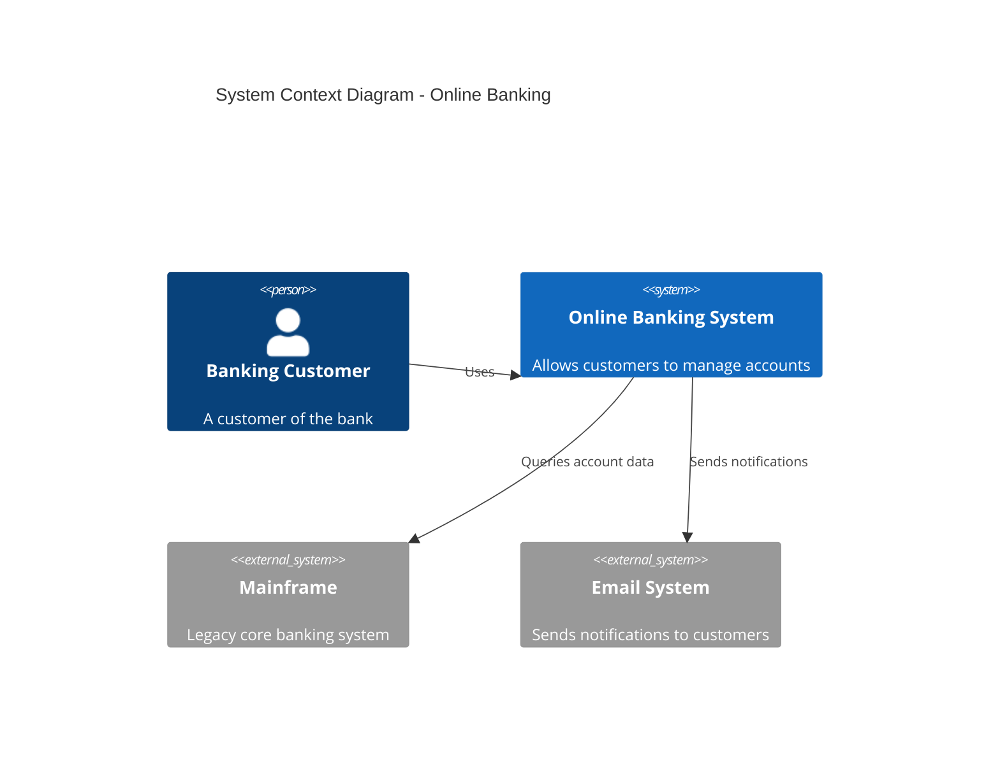
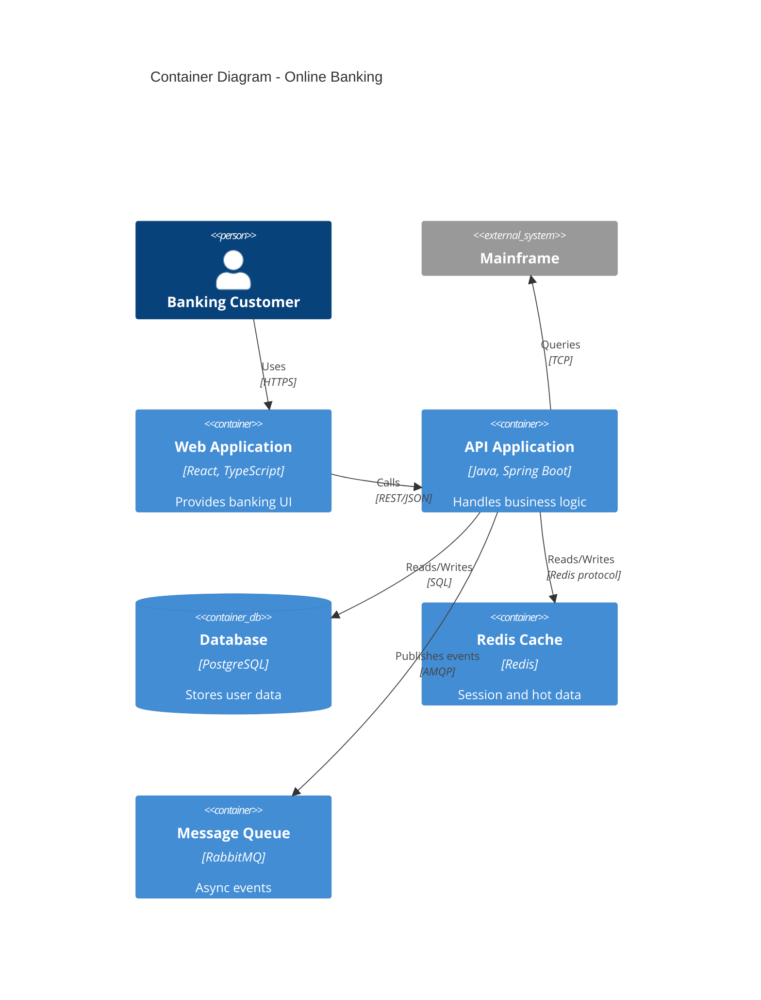

---


contentType: docs
slug: system-diagram-template
title: "System Diagram Template"
description: "A template for creating C4 model and architecture diagram standards."
metaDescription: "Use this system diagram template to document architecture with C4 model context, container, component, and code diagrams."
difficulty: beginner
topics:
  - architecture
tags:
  - architecture
  - c4-model
  - diagram
  - visualization
  - template
  - standards
relatedResources:
  - /docs/service-dependency-map-template
  - /docs/microservice-contract-template
  - /docs/adr-template
  - /docs/database-schema-documentation-template
  - /docs/engineering-handbook-template
  - /docs/api-lifecycle-management-template
  - /docs/api-monitoring-alerting-template
lastUpdated: "2026-06-21"
author: "StackPractices"
seo:
  metaDescription: "Use this system diagram template to document architecture with C4 model context, container, component, and code diagrams."
  keywords:
    - architecture
    - c4-model
    - diagram
    - visualization
    - template
    - standards


---
## Overview

Architecture diagrams communicate system structure to technical and non-technical stakeholders. Without consistent standards, teams produce diagrams at inconsistent abstraction levels that confuse more than clarify. This template uses the C4 model to create diagrams at four well-defined levels of detail.

## When to Use


- For alternatives, see [Service Dependency Map Template](/docs/service-dependency-map-template/).

Use this resource when:
- Onboarding new engineers who need to understand the system space
- Presenting architecture to leadership or external auditors
- Planning a migration, integration, or refactoring that spans multiple systems

## Solution

```markdown
# System Diagram: `<System Name>`

## Level 1: System Context Diagram

Shows the system as a box in the center, surrounded by users and external systems.

| Element | Notation | Description |
|---------|----------|-------------|
| Person | Stick figure with label | External user or role |
| System | Box with label and tech | System under design |
| External System | Box with gray fill | Existing system outside scope |

**Example**:
```
[Customer] → (Online Banking System) → [Mainframe]
                ↓
            [Email System]
```

- **Scope**: The entire system as a black box
- **Audience**: Non-technical stakeholders, product managers
- **Key question**: What is this system and who uses it?

## Level 2: Container Diagram

Shows the high-level technology choices and how responsibilities are distributed.

| Element | Notation | Description |
|---------|----------|-------------|
| Web App | Cylinder with browser icon | Single-page application or server-rendered UI |
| API | Box with API label | REST/gRPC/GraphQL service |
| Database | Cylinder with DB label | Data store |
| Queue | Box with queue label | Message broker |
| Cache | Box with lightning icon | In-memory store |

**Example**:
```
[Web App] → [Load Balancer] → [API Application] → [Database]
                                ↓
                            [Redis Cache]
                                ↓
                            [Message Queue]
```

- **Scope**: Applications and data stores inside the system
- **Audience**: Technical leads, architects
- **Key question**: What are the major building blocks and how do they interact?

## Level 3: Component Diagram

Shows the internal structure of a single container (typically an application).

| Element | Notation | Description |
|---------|----------|-------------|
| Component | Box with component label | Logical grouping of related functionality |
| Interface | Lollipop | Exposed API or event publisher |
| Database | Cylinder | Direct dependency |

**Example**:
```
[Auth Controller] → [User Service] → [User Repository] → [Users DB]
      ↓
[Token Manager] → [Redis Cache]
```

- **Scope**: Components inside one application
- **Audience**: Senior engineers working on the application
- **Key question**: How is the application decomposed into responsibilities?

## Level 4: Code Diagram

Shows the implementation details of a single component.

- **Format**: Class diagrams, sequence diagrams, or ER diagrams
- **Tool**: IDE, PlantUML, or Mermaid
- **Scope**: Classes, interfaces, and functions within one component
- **Audience**: Engineers implementing the feature
- **Key question**: How does this specific feature work in code?

## Diagram Standards

| Rule | Description |
|------|-------------|
| Consistent notation | Use the same shapes and colors across all diagrams |
| Label everything | Every box and line must have a label |
| One direction | Read left-to-right or top-to-bottom |
| No orphans | Every element must connect to at least one other element |
| Version control | Store diagrams as code (Mermaid, PlantUML, Structurizr) |
```

## Explanation

The C4 model solves the **"zoom problem"** in architecture documentation. A single diagram that tries to show everything becomes unreadable. By separating into four levels, each diagram has a single audience and purpose. Context diagrams sell the idea. Container diagrams guide technology decisions. Component diagrams onboard new developers. Code diagrams document tricky logic.

## Mermaid C4 Context Diagram Example

Use Mermaid.js for version-controlled C4 diagrams that render in GitHub and most Markdown viewers:



## Mermaid Container Diagram Example



## Structurizr DSL Example

For teams that need a single source of truth across all four C4 levels:

```text
workspace "Online Banking" {
    model {
        customer = person "Banking Customer"
        banking = softwareSystem "Online Banking System"
        mainframe = softwareSystem "Mainframe" "External"
        email = softwareSystem "Email System" "External"

        customer -> banking "Uses"
        banking -> mainframe "Queries account data"
        banking -> email "Sends notifications"

        spa = banking container "Web Application" "React, TypeScript"
        api = banking container "API Application" "Java, Spring Boot"
        db = banking container "Database" "PostgreSQL"
        cache = banking container "Redis Cache" "Redis"

        customer -> spa "Uses" "HTTPS"
        spa -> api "Calls" "REST/JSON"
        api -> db "Reads/Writes" "SQL"
        api -> cache "Reads/Writes"
    }

    views {
        context banking "Context" "An overview of the banking system"
        container banking "Containers" "Container view"
        theme default
    }
}
```

## Color and Icon Standards

Consistent visual language reduces cognitive load when switching between diagrams:

| Element Type | Fill Color | Border Color | Icon |
|--------------|-----------|--------------|------|
| Person | #08427B | #052E3F | User |
| System (internal) | #1168BD | #0B4884 | Box |
| System (external) | #999999 | #666666 | Box |
| Container | #438DD5 | #2E6299 | Component |
| Database | #F5DA81 | #D6B656 | Cylinder |
| Queue | #B5A3D4 | #8262A8 | Box |

## Diagram Review Checklist

Before publishing a diagram, verify:

- [ ] Every box has a label with name and technology
- [ ] Every line has a label with protocol or data type
- [ ] No element is disconnected (no orphans)
- [ ] Reading direction is consistent (left-to-right or top-to-bottom)
- [ ] Color coding matches the team style guide
- [ ] No more than 15 elements per diagram (split if more)
- [ ] Diagram is stored as code in the repository
- [ ] Diagram renders correctly in CI pipeline

## Variants

| Context | Approach | Notes |
|---------|----------|-------|
| Startup | Context + Container only | Skip Component and Code until the team grows |
| Legacy system | Context + Container + targeted Components | Focus on the parts being changed |
| Event-driven | Add event flows to Container diagrams | Show producers, consumers, and topics |
| Multi-tenant SaaS | Add tenant isolation to Container diagram | Show shared vs dedicated resources |
| Microservices | Container diagram per service group | Group related services to avoid clutter |

## What Works

1. Store diagrams as code (Mermaid, PlantUML, Structurizr DSL) so they version with the codebase
2. Generate diagrams from the same model to ensure consistency across levels
3. Review diagrams in architecture decision records (ADRs) so they stay current
4. Use a team style guide for colors, fonts, and icon sets
5. Link each diagram to the next level of detail for drill-down navigation
6. Keep diagrams under 15 elements; split into sub-diagrams when they grow
7. Add a "last updated" date to every diagram so readers know freshness

## Common Mistakes

1. Mixing abstraction levels in a single diagram
2. Using different notation styles across diagrams in the same repository
3. Creating diagrams only once and never updating them after refactors
4. Including too much detail in Context or Container diagrams
5. Omitting the human users and external systems that provide context
6. Adding more than 15 elements to a single diagram, making it unreadable
7. Using custom icons that do not render in all viewers (GitHub, IDE, wiki)

## Frequently Asked Questions

### Do I need to create all four levels?

No. Most teams benefit from Context and Container diagrams. Component diagrams are useful for complex applications. Code diagrams should be generated from the codebase, not drawn by hand.

### What tool should I use?

Structurizr is purpose-built for C4. Mermaid and PlantUML work well for simple diagrams. Lucidchart and draw.io are better for presentations but harder to version.

### How do I keep diagrams in sync with code?

Use Structurizr DSL or code-based diagram generators that extract dependencies from the codebase. Manual diagrams should be reviewed during code review when related files change.

### What is the difference between C4 and UML?

C4 focuses on system structure at multiple zoom levels. UML focuses on detailed software design (class diagrams, sequence diagrams). C4 is better for architecture communication; UML is better for implementation detail. They complement each other.

### How many elements should a diagram have?

Keep each diagram under 15 elements. If you need more, split into sub-diagrams. The human brain can track 7 plus or minus 2 elements at a glance; 15 is the practical upper limit with grouping.

### Should I use C4 for data flow diagrams?

C4 shows structure, not data flow. For data flow, use a separate DFD or sequence diagram alongside the C4 model. The sequence diagram in the technical spec template pairs well with the container diagram.

### Can I use C4 with a service mesh?

Yes. Show the service mesh as a container in the Container diagram. Individual services become components in the Component diagram. The mesh handles cross-cutting concerns (mTLS, retries, observability) so you do not need to draw those lines for every service pair.
