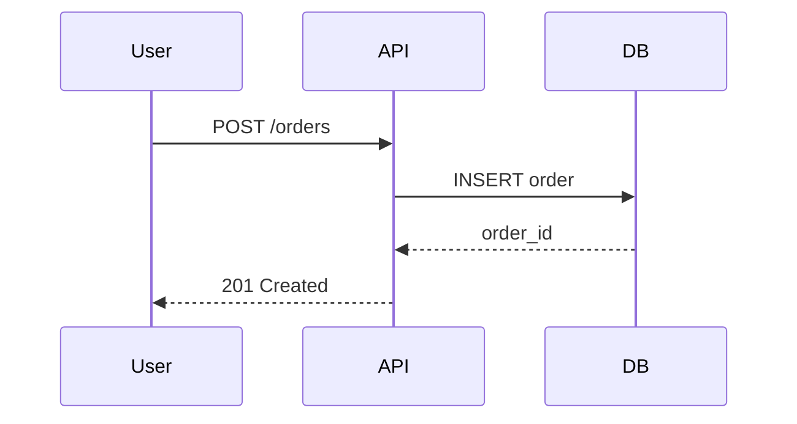

## Visión General

Las especificaciones técnicas traducen requisitos de producto en un plan implementable. Sin una especificación, los ingenieros hacen suposiciones que llevan a expectativas desalineadas, casos extremos omitidos y retrabajo. Esta plantilla proporciona una estructura estándar para documentar objetivos, restricciones, decisiones de diseño y pasos de implementación.

## Cuándo Usar

Usa este recurso cuando:
- Inicias una capacidad que afecta múltiples sistemas o equipos
- Propones un nuevo servicio, API o cambio arquitectónico importante
- Transfieres la implementación a otro ingeniero o equipo

## Solución

```markdown
# Especificación Técnica: `<Nombre de la Capacidad / Sistema>`

## 1. Objetivo

Un párrafo describiendo qué busca lograr esta especificación y por qué importa.

## 2. Contexto

- Estado actual del sistema
- ¿Qué problema estamos resolviendo?
- ¿Quiénes son los usuarios y stakeholders?
- Enlaces a requisitos de producto, historias de usuario o investigación de mercado

## 3. Objetivos y No-Objetivos

**Objetivos** (deben lograrse):
- [Objetivo 1]
- [Objetivo 2]

**No-Objetivos** (explícitamente fuera de alcance):
- [No-objetivo 1]
- [No-objetivo 2]

## 4. Requisitos

### Requisitos Funcionales

| ID | Requisito | Prioridad |
|----|-------------|----------|
| FR-1 | El sistema debe... | P0 |
| FR-2 | El sistema debería... | P1 |

### Requisitos No Funcionales

| ID | Requisito | Objetivo |
|----|-------------|--------|
| NFR-1 | Latencia p95 | < 200ms |
| NFR-2 | Disponibilidad | 99.9% |
| NFR-3 | Throughput | 1,000 req/s |

## 5. Diseño

### Arquitectura

- Enlaces a diagramas C4 (Contexto, Contenedor, Componente)
- Enlace al mapa de dependencias de servicios
- Enlace al ADR para decisiones mayores

### Modelo de Datos

```sql
CREATE TABLE users (
  id UUID PRIMARY KEY,
  email VARCHAR(255) UNIQUE NOT NULL,
  created_at TIMESTAMP DEFAULT NOW()
);
```

### Contrato de API

- Enlace a la especificación OpenAPI o contrato de microservicio
- Endpoints clave, ejemplos de request/response

### Diagrama de Secuencia



## 6. Plan de Implementación

| Fase | Tarea | Responsable | ETA |
|-------|------|-------|-----|
| 1 | Migración de esquema | @backend | Semana 1 |
| 2 | Implementación de API | @backend | Semana 2 |
| 3 | Integración frontend | @frontend | Semana 3 |
| 4 | Pruebas de carga | @qa | Semana 4 |

## 7. Estrategia de Pruebas

- Tests unitarios: objetivo de cobertura, estrategia de mocking
- Tests de integración: entornos, configuración de datos
- Tests E2E: flujos críticos de usuario
- Tests de rendimiento: perfil de carga, umbrales aceptables

## 8. Plan de Rollout

- Feature flags: qué flag, estado por defecto
- Período de estabilización en staging: duración, criterios de éxito
- Porcentaje de canary: 5% → 25% → 100%
- Criterios de rollback: tasa de error > X%, latencia > Yms

## 9. Riesgos y Mitigaciones

| Riesgo | Impacto | Probabilidad | Mitigación |
|------|--------|------------|------------|
| La migración de datos toma más tiempo de lo esperado | Alto | Media | Ejecutar migración por lotes, probar en copia de prod |
| Caída de API de terceros | Medio | Baja | Cachear respuestas, implementar circuit breaker |

## 10. Métricas de Éxito

- **Adopción**: X% de usuarios usan la capacidad en 30 días
- **Rendimiento**: latencia p95 < objetivo
- **Fiabilidad**: < 0.1% tasa de error
- **Negocio**: impacto en ingresos, ahorro de costes
```

## Explicación

La especificación separa el **qué** (requisitos) del **cómo** (diseño) y del **cuándo** (plan de implementación). Los objetivos y no-objetivos previenen el crecimiento del alcance. Los requisitos tienen IDs trazables para vincularlos con casos de prueba. La sección de diseño enlaza a documentos vivos (diagramas, contratos) en lugar de duplicarlos. El plan de rollout obliga a los equipos a pensar en la preparación para producción antes de empezar a codear.

## Variantes

| Contexto | Enfoque | Notas |
|----------|---------|-------|
| Startup | Ligero (1-2 páginas) | Enfocarse en objetivos, boceto de diseño y rollout |
| Enterprise | Plantilla completa con aprobaciones | Requerir sign-off del comité de revisión arquitectónica |
| Open source | Formato RFC | Publicar para comentarios de la comunidad antes de implementar |

## Lo que funciona

1. Mantener la especificación bajo 10 páginas; enlazar a documentos detallados para profundizaciones
2. Asignar un ID trazable a cada requisito para mapeo de cobertura de tests
3. Revisar la especificación con stakeholders antes de comenzar la implementación
4. Actualizar la especificación a medida que los descubrimientos de la implementación cambian el plan
5. Almacenar especificaciones en control de versiones junto al código que describen

## Errores Comunes

1. Escribir especificaciones después de completar la implementación (justificación a posteriori)
2. Incluir detalles de implementación (nombres de variables, rutas de archivos) en la sección de diseño
3. Omitir requisitos no funcionales hasta que surjan problemas en producción
4. No definir criterios de rollback, llevando al pánico durante incidentes
5. Tratar la especificación como inmutable después del primer borrador

## Preguntas Frecuentes

### ¿Qué longitud debería tener una especificación técnica?

La mayoría de especificaciones son de 3-5 páginas. Las capacidades complejas multi-sistema pueden necesitar 8-10. Si excede 10 páginas, divídela en múltiples especificaciones o mueve apéndices a documentos enlazados.

### ¿Quién debería escribir la especificación?

El ingeniero liderando la implementación escribe el primer borrador. Los product managers aportan requisitos. Los arquitectos revisan decisiones de diseño. QA aporta la estrategia de pruebas.

### ¿Debería incluir código en una especificación técnica?

Solo pseudo-código o esquemas SQL para ilustrar el diseño. El código real pertenece a los pull requests. La especificación debe describir intención y estructura, no detalles de implementación.
