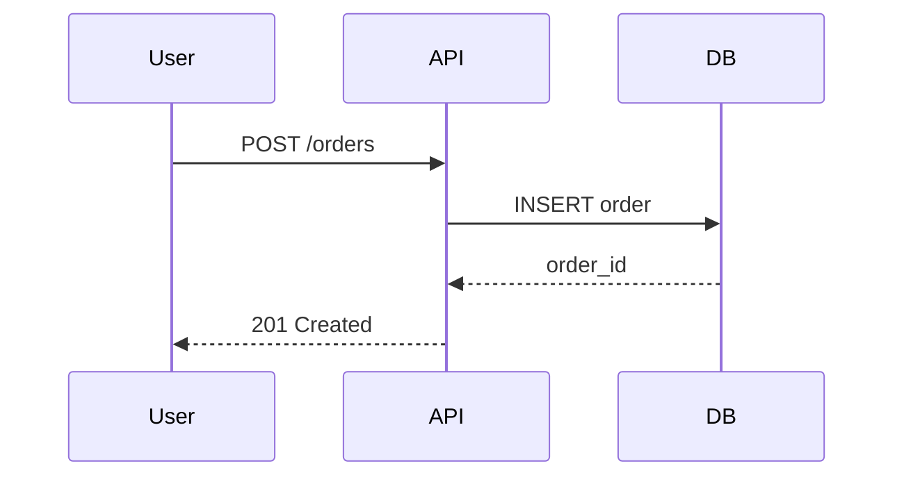

## Visión General

Las especificaciones técnicas traducen requisitos de producto en un plan implementable. Sin una especificación, los ingenieros hacen suposiciones que llevan a expectativas desalineadas, casos extremos omitidos y retrabajo. Esta plantilla proporciona una estructura estándar para documentar objetivos, restricciones, decisiones de diseño y pasos de implementación. Documentos relacionados: [Diseñar un API Gateway Escalable para Microservicios](/recipes/api-gateway), [Construir Sistemas Resilientes con el Circuit Breaker](/patterns/circuit-breaker-pattern) y [Inyección de Dependencias](/recipes/dependency-injection).

## Cuándo Usar


- For alternatives, see [ADR Template](/es/docs/adr-template/).

Usa este recurso cuando:
- Inicias una capacidad que afecta múltiples sistemas o equipos
- Propones un nuevo servicio, API o cambio arquitectónico importante
- Transfieres la implementación a otro ingeniero o equipo

## Solución

```markdown
# Especificación Técnica: `<Nombre de la Capacidad / Sistema>`

## 1. Objetivo

Un párrafo describiendo qué busca lograr esta especificación y por qué importa.

## 2. Contexto

- Estado actual del sistema
- ¿Qué problema estamos resolviendo?
- ¿Quiénes son los usuarios y stakeholders?
- Enlaces a requisitos de producto, historias de usuario o investigación de mercado

## 3. Objetivos y No-Objetivos

**Objetivos** (deben lograrse):
- [Objetivo 1]
- [Objetivo 2]

**No-Objetivos** (explícitamente fuera de alcance):
- [No-objetivo 1]
- [No-objetivo 2]

## 4. Requisitos

### Requisitos Funcionales

| ID | Requisito | Prioridad |
|----|-------------|----------|
| FR-1 | El sistema debe... | P0 |
| FR-2 | El sistema debería... | P1 |

### Requisitos No Funcionales

| ID | Requisito | Objetivo |
|----|-------------|--------|
| NFR-1 | Latencia p95 | < 200ms |
| NFR-2 | Disponibilidad | 99.9% |
| NFR-3 | Throughput | 1,000 req/s |

## 5. Diseño

### Arquitectura

- Enlaces a diagramas C4 (Contexto, Contenedor, Componente)
- Enlace al mapa de dependencias de servicios
- Enlace al ADR para decisiones mayores

### Modelo de Datos

```sql
CREATE TABLE users (
  id UUID PRIMARY KEY,
  email VARCHAR(255) UNIQUE NOT NULL,
  created_at TIMESTAMP DEFAULT NOW()
);
```

### Contrato de API

- Enlace a la especificación OpenAPI o contrato de microservicio
- Endpoints clave, ejemplos de request/response

### Diagrama de Secuencia


```mermaid
sequenceDiagram
  participant User
  participant API
  participant DB
  User->>API: POST /orders
  API->>DB: INSERT order
  DB-->>API: order_id
  API-->>User: 201 Created
```

## 6. Plan de Implementación

| Fase | Tarea | Responsable | ETA |
|-------|------|-------|-----|
| 1 | Migración de esquema | @backend | Semana 1 |
| 2 | Implementación de API | @backend | Semana 2 |
| 3 | Integración frontend | @frontend | Semana 3 |
| 4 | Pruebas de carga | @qa | Semana 4 |

## 7. Estrategia de Pruebas

- Tests unitarios: objetivo de cobertura, estrategia de mocking
- Tests de integración: entornos, configuración de datos
- Tests E2E: flujos críticos de usuario
- Tests de rendimiento: perfil de carga, umbrales aceptables

## 8. Plan de Rollout

- Feature flags: qué flag, estado por defecto
- Período de estabilización en staging: duración, criterios de éxito
- Porcentaje de canary: 5% → 25% → 100%
- Criterios de rollback: tasa de error > X%, latencia > Yms

## 9. Riesgos y Mitigaciones

| Riesgo | Impacto | Probabilidad | Mitigación |
|------|--------|------------|------------|
| La migración de datos toma más tiempo de lo esperado | Alto | Media | Ejecutar migración por lotes, probar en copia de prod |
| Caída de API de terceros | Medio | Baja | Cachear respuestas, implementar circuit breaker |

## 10. Métricas de Éxito

- **Adopción**: X% de usuarios usan la capacidad en 30 días
- **Rendimiento**: latencia p95 < objetivo
- **Fiabilidad**: < 0.
- **Negocio**: impacto en ingresos, ahorro de costes
```

## Explicación

La especificación separa el **qué** (requisitos) del **cómo** (diseño) y del **cuándo** (plan de implementación). Los objetivos y no-objetivos previenen el crecimiento del alcance. Los requisitos tienen IDs trazables para vincularlos con casos de prueba. La sección de diseño enlaza a documentos vivos (diagramas, contratos) en lugar de duplicarlos. El plan de rollout obliga a los equipos a pensar en la preparación para producción antes de empezar a codear.

## Ejemplo: Sección de Requisitos Completa

```markdown
## 4. Requisitos

### Requisitos Funcionales

| ID | Requisito | Prioridad |
|----|-------------|----------|
| FR-1 | El sistema debe permitir a usuarios crear, leer, actualizar y eliminar órdenes | P0 |
| FR-2 | El sistema debe enviar confirmación por email al crear una orden | P1 |
| FR-3 | El sistema debería soportar importación masiva de órdenes vía CSV | P2 |
| FR-4 | El sistema debe aplicar control de acceso por roles (admin, manager, user) | P0 |

### Requisitos No Funcionales

| ID | Requisito | Objetivo |
|----|-------------|--------|
| NFR-1 | Latencia p95 para creación de órdenes | < 200ms |
| NFR-2 | Disponibilidad durante horario laboral | 99.9% |
| NFR-3 | Throughput pico | 1,000 req/s |
| NFR-4 | Durabilidad de datos | 99.999999% (11 nueves) |
| NFR-5 | Retención de logs de auditoría | 7 años |
```

## Ejemplo: Configuración de Rollout con Feature Flags

```yaml
feature_flags:
  - name: orders_v2_api
    description: "Nuevo pipeline de procesamiento de órdenes con validación asíncrona"
    default_state: off
    rollout_strategy: percentage
    rollout_steps:
      - percentage: 5
        duration: 24h
        success_criteria:
          error_rate: < 0.5%
          p95_latency: < 200ms
      - percentage: 25
        duration: 48h
        success_criteria:
          error_rate: < 0.5%
          p95_latency: < 200ms
      - percentage: 100
        duration: indefinite
    rollback_criteria:
      error_rate: > 1%
      p95_latency: > 500ms
    target_rules:
      - attribute: user_id
        operator: in
        values: [12345, 67890]  # Testers internos primero
```

## Ejemplo: Plantilla de Evaluación de Riesgos

```markdown
## 9. Riesgos y Mitigaciones

| Riesgo | Impacto | Probabilidad | Mitigación | Responsable |
|------|--------|------------|------------|-------|
| La migración de datos toma más tiempo de lo esperado | Alto | Media | Ejecutar migración en lotes de 10k filas, probar en copia de prod | @dba |
| Caída de API de pagos de terceros | Alto | Baja | Cachear respuestas, implementar circuit breaker, encolar reintentos | @backend |
| Regresión de rendimiento en frontend | Medio | Media | Ejecutar Lighthouse CI en cada PR, bloquear merge si score baja > 5 puntos | @frontend |
| Cambio de esquema bloquea la tabla | Alto | Baja | Usar herramienta de cambio online (gh-ost, pt-online-schema-change) | @dba |
| Nuevo contrato de API rompe clientes móviles | Alto | Media | Mantener shim de compatibilidad v1 por 90 días, publicar actualización de SDK | @mobile |
```

## Checklist de Revisión de Especificación

Antes de circular la especificación para aprobación:

- [ ] Cada requisito funcional tiene un ID trazable (FR-x)
- [ ] Cada requisito no funcional tiene un objetivo medible
- [ ] Objetivos y no-objetivos están listados explícitamente
- [ ] La sección de diseño enlaza a diagramas, no a imágenes inline
- [ ] El plan de implementación tiene responsable y ETA para cada fase
- [ ] El plan de rollout incluye configuración de feature flags y criterios de rollback
- [ ] La tabla de riesgos incluye impacto, probabilidad y mitigación para cada riesgo
- [ ] Las métricas de éxito son cuantitativas y medibles
- [ ] La especificación tiene menos de 10 páginas (excluyendo apéndices)

## Variantes

| Contexto | Enfoque | Notas |
|----------|---------|-------|
| Startup | Ligero (1-2 páginas) | Enfocarse en objetivos, boceto de diseño y rollout |
| Enterprise | Plantilla completa con aprobaciones | Requerir sign-off del comité de revisión arquitectónica |
| Open source | Formato RFC | Publicar para comentarios de la comunidad antes de implementar |
| Industria regulada | Agregar sección de compliance | Mapear requisitos a HIPAA, PCI-DSS o SOX |
| Cross-team | Agregar cronograma de dependencias | Mostrar qué equipos deben entregar qué y cuándo |

## Lo que funciona

1. Mantener la especificación bajo 10 páginas; enlazar a documentos detallados para profundizaciones
2. Asignar un ID trazable a cada requisito para mapeo de cobertura de tests
3. Revisar la especificación con stakeholders antes de comenzar la implementación
4. Actualizar la especificación a medida que los descubrimientos de la implementación cambian el plan
5. Almacenar especificaciones en control de versiones junto al código que describen
6. Incluir un header de "estado de la especificación" (borrador, en revisión, aprobado, implementado) para que los lectores sepan dónde está
7. Enlazar la especificación en la descripción del PR cuando comience la implementación para que los revisores tengan contexto

## Errores Comunes

1. Escribir especificaciones después de completar la implementación (justificación a posteriori)
2. Incluir detalles de implementación (nombres de variables, rutas de archivos) en la sección de diseño
3. Omitir requisitos no funcionales hasta que surjan problemas en producción
4. No definir criterios de rollback, llevando al pánico durante incidentes
5. Tratar la especificación como inmutable después del primer borrador
6. Escribir NFRs vagos como "debería ser rápido" en lugar de objetivos medibles como "p95 < 200ms"
7. No asignar responsables a las fases de implementación, llevando a difusión de responsabilidad


## Notas de Producción

- **Despliega gradualmente** usando canary o blue-green para detectar regresiones temprano.
- **Configura alertas** para errores, latencia p99 y tasa de fallos antes de habilitar en producción.
- **Documenta el rollback** en el runbook; prueba el procedimiento en staging al menos una vez por trimestre.
- **Revisa logs estructurados** con correlation IDs para trazar requests end-to-end en incidentes.

## Puntos Clave

- **Aplica plantilla de especificación técnica** cuando necesites una solución práctica para tu caso de uso.
- **Monitorea el rendimiento** después de implementar; mide latencia, errores y uso de recursos antes y después.
- **Revisa la sección de Troubleshooting** ante errores comunes; la mayoría tienen causa raíz documentada con solución.
- **Mantén dependencias actualizadas** y ejecuta tests en CI para prevenir regresiones en producción.

## Preguntas Frecuentes

### ¿Qué longitud debería tener una especificación técnica?

La mayoría de especificaciones son de 3-5 páginas. Las capacidades complejas multi-sistema pueden necesitar 8-10. Si excede 10 páginas, divídela en múltiples especificaciones o mueve apéndices a documentos enlazados.

### ¿Quién debería escribir la especificación?

El ingeniero liderando la implementación escribe el primer borrador. Los product managers aportan requisitos. Los arquitectos revisan decisiones de diseño. QA aporta la estrategia de pruebas.

### ¿Debería incluir código en una especificación técnica?

Solo pseudo-código o esquemas SQL para ilustrar el diseño. El código real pertenece a los pull requests. La especificación debe describir intención y estructura, no detalles de implementación.

### ¿Cuál es la diferencia entre una especificación y un ADR?

Una especificación técnica cubre una funcionalidad completa: requisitos, diseño, plan, riesgos. Un ADR cubre una única decisión: qué se decidió, por qué y qué alternativas se rechazaron. Las especificaciones enlazan a ADRs para decisiones de diseño individuales.

### ¿Cómo manejo cambios en la especificación durante la implementación?

Actualiza la especificación en el mismo PR que el cambio de código que la motivó. Agrega una sección de "Cambios" al inicio listando qué se modificó y por qué. Nunca cambies la especificación silenciosamente sin un version bump o entrada de changelog.

### ¿Debería usar un motor de plantillas o Markdown plano?

Markdown plano en control de versiones es el enfoque más común. Herramientas como Notion o Confluence funcionan para colaboración pero pierden historial de versiones. Si necesitas campos estructurados, usa YAML frontmatter con un cuerpo en Markdown.

### ¿Cómo logro que los stakeholders realmente lean la especificación?

Mantenla corta. Usa una sección TL;DR al inicio con 3 puntos clave. Agenda una reunión de revisión de 30 minutos con los tomadores de decisiones. Envía la especificación 48 horas antes de la reunión para que puedan leerla asincrónicamente.

## Troubleshooting

- **High latency between services**: trace the request path.   Look for synchronous chains, missing caching, and oversized payloads that cross network boundaries.
- **Single point of failure**: identify components without redundancy.   Add replicas, failover, or circuit breakers before scaling traffic.
- **Unexpected coupling between services**: review shared databases, libraries, and schemas.   Bound contexts should own their data and expose stable interfaces.
- **Cost spikes after scaling**: Reserved capacity or spot instances can reduce steady-state spend.
- **Difficult to reason about the system**: maintain architecture decision records and service dependency maps.

## Errores Comunes en Producción

- Dejar campos requeridos vacíos o usar respuestas vagas de una palabra.
- Llenar el documento una vez y nunca actualizarlo cuando cambia el alcance o las decisiones.
- Guardar el documento donde el equipo no lo busque durante incidentes o revisiones.
- No asignar un responsable, fecha límite o cadencia de revisión.
- Copiar texto base sin eliminar secciones que no aplican.
- Saltar el control de versiones, lo que impide rollback y responsabilidad.
- No vincular el documento con decisiones relacionadas o acciones de seguimiento.
- Evitar revisiones trimestrales que retirarían secciones obsoletas o sin uso.
