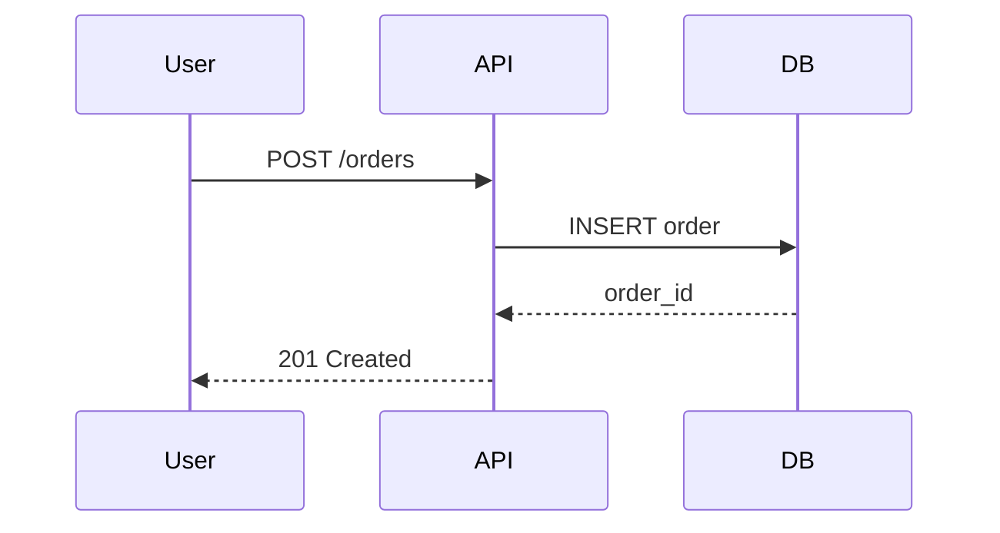

## Overview

Technical specifications translate product requirements into an implementable plan. Without a spec, engineers make assumptions that lead to mismatched expectations, missed edge cases, and rework. This template provides a standard structure for documenting goals, constraints, design decisions, and implementation steps.

## When to Use

Use this resource when:
- Starting a capability that affects multiple systems or teams
- Proposing a new service, API, or major architectural change
- Handing off implementation to another engineer or team

## Solution

```markdown
# Technical Specification: `<Capability / System Name>`

## 1. Objective

One paragraph describing what this spec aims to achieve and why it matters.

## 2. Background

- Current state of the system
- What problem are we solving?
- Who are the users and stakeholders?
- Links to product requirements, user stories, or market research

## 3. Goals & Non-Goals

**Goals** (must achieve):
- [Goal 1]
- [Goal 2]

**Non-Goals** (explicitly out of scope):
- [Non-goal 1]
- [Non-goal 2]

## 4. Requirements

### Functional Requirements

| ID | Requirement | Priority |
|----|-------------|----------|
| FR-1 | The system must... | P0 |
| FR-2 | The system should... | P1 |

### Non-Functional Requirements

| ID | Requirement | Target |
|----|-------------|--------|
| NFR-1 | Latency p95 | < 200ms |
| NFR-2 | Availability | 99.9% |
| NFR-3 | Throughput | 1,000 req/s |

## 5. Design

### Architecture

- Link to C4 diagrams (Context, Container, Component)
- Link to service dependency map
- Link to ADR for major decisions

### Data Model

```sql
CREATE TABLE users (
  id UUID PRIMARY KEY,
  email VARCHAR(255) UNIQUE NOT NULL,
  created_at TIMESTAMP DEFAULT NOW()
);
```

### API Contract

- Link to OpenAPI spec or microservice contract
- Key endpoints, request/response examples

### Sequence Diagram



## 6. Implementation Plan

| Phase | Task | Owner | ETA |
|-------|------|-------|-----|
| 1 | Schema migration | @backend | Week 1 |
| 2 | API implementation | @backend | Week 2 |
| 3 | Frontend integration | @frontend | Week 3 |
| 4 | Load testing | @qa | Week 4 |

## 7. Testing Strategy

- Unit tests: coverage target, mocking approach
- Integration tests: environments, data setup
- E2E tests: critical user flows
- Performance tests: load profile, acceptable thresholds

## 8. Rollout Plan

- Feature flags: which flag, default state
- Staging soak period: duration, success criteria
- Canary percentage: 5% → 25% → 100%
- Rollback criteria: error rate > X%, latency > Yms

## 9. Risks & Mitigations

| Risk | Impact | Likelihood | Mitigation |
|------|--------|------------|------------|
| Data migration takes longer than expected | High | Medium | Run migration in batches, test on copy of prod |
| Third-party API downtime | Medium | Low | Cache responses, implement circuit breaker |

## 10. Success Metrics

- **Adoption**: X% of users use the capability within 30 days
- **Performance**: p95 latency < target
- **Reliability**: < 0.1% error rate
- **Business**: Revenue impact, cost savings
```

## Explanation

The spec separates **what** (requirements) from **how** (design) and **when** (implementation plan). Goals and non-goals prevent scope creep. Requirements are traceable IDs for test case linkage. The design section links to living documents (diagrams, contracts) rather than duplicating them. The rollout plan forces teams to think about production readiness before coding starts.

## Variants

| Context | Approach | Notes |
|---------|----------|-------|
| Startup | Lightweight (1-2 pages) | Focus on goals, design sketch, and rollout |
| Enterprise | Full template with approvals | Require sign-off from architecture review board |
| Open source | RFC format | Publish for community comment before implementation |

## What Works

1. Keep the spec under 10 pages; link to detailed docs for deep dives
2. Assign every requirement a traceable ID for test coverage mapping
3. Review the spec with stakeholders before implementation begins
4. Update the spec as implementation discoveries change the plan
5. Store specs in version control alongside the code they describe

## Common Mistakes

1. Writing specs after implementation is complete (post-hoc justification)
2. Including implementation details (variable names, file paths) in the design section
3. Skipping non-functional requirements until production issues surface
4. Not defining rollback criteria, leading to panic during incidents
5. Treating the spec as immutable after the first draft

## Frequently Asked Questions

### How long should a technical spec be?

Most specs are 3-5 pages. Complex multi-system capabilities may need 8-10. If it exceeds 10 pages, split it into multiple specs or move appendices to linked documents.

### Who should write the spec?

The engineer leading the implementation writes the first draft. Product managers contribute requirements. Architects review design decisions. QA contributes test strategy.

### Should I include code in a technical spec?

Only pseudo-code or SQL schemas to illustrate the design. Real code belongs in pull requests. The spec should describe intent and structure, not implementation details.
