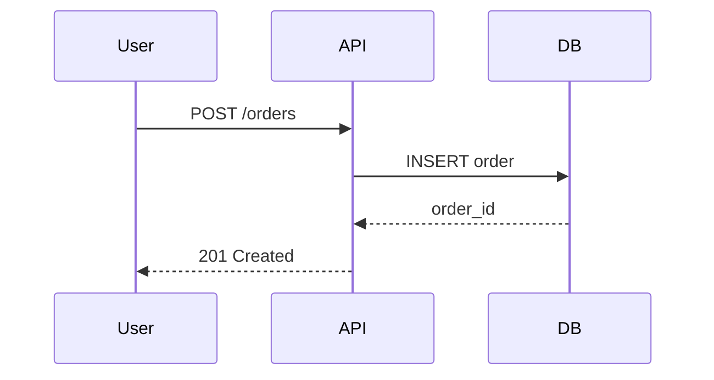

---


contentType: docs
slug: technical-spec-template
title: "Technical Specification Template"
description: "A template for writing technical specification documents for software projects."
metaDescription: "Use this technical specification template to define requirements, design decisions, API contracts, and implementation plans."
difficulty: intermediate
topics:
  - architecture
tags:
  - architecture
  - specification
  - design
  - requirements
  - template
relatedResources:
  - /docs/microservice-contract-template
  - /docs/service-dependency-map-template
  - /docs/system-diagram-template
  - /docs/adr-template
  - /docs/database-schema-documentation-template
  - /docs/api-changelog-template
  - /docs/api-deprecation-notice-template
lastUpdated: "2026-06-21"
author: "StackPractices"
seo:
  metaDescription: "Use this technical specification template to define requirements, design decisions, API contracts, and implementation plans."
  keywords:
    - architecture
    - specification
    - design
    - requirements
    - template


---
## Overview

Technical specifications translate product requirements into an implementable plan. Without a spec, engineers make assumptions that lead to mismatched expectations, missed edge cases, and rework. This template provides a standard structure for documenting goals, constraints, design decisions, and implementation steps.

## When to Use


- For alternatives, see [ADR Template](/docs/adr-template/).

Use this resource when:
- Starting a capability that affects multiple systems or teams
- Proposing a new service, API, or major architectural change
- Handing off implementation to another engineer or team

## Solution

```markdown
# Technical Specification: `<Capability / System Name>`

## 1. Objective

One paragraph describing what this spec aims to achieve and why it matters.

## 2. Background

- Current state of the system
- What problem are we solving?
- Who are the users and stakeholders?
- Links to product requirements, user stories, or market research

## 3. Goals & Non-Goals

**Goals** (must achieve):
- [Goal 1]
- [Goal 2]

**Non-Goals** (explicitly out of scope):
- [Non-goal 1]
- [Non-goal 2]

## 4. Requirements

### Functional Requirements

| ID | Requirement | Priority |
|----|-------------|----------|
| FR-1 | The system must... | P0 |
| FR-2 | The system should... | P1 |

### Non-Functional Requirements

| ID | Requirement | Target |
|----|-------------|--------|
| NFR-1 | Latency p95 | < 200ms |
| NFR-2 | Availability | 99.9% |
| NFR-3 | Throughput | 1,000 req/s |

## 5. Design

### Architecture

- Link to C4 diagrams (Context, Container, Component)
- Link to service dependency map
- Link to ADR for major decisions

### Data Model

```sql
CREATE TABLE users (
  id UUID PRIMARY KEY,
  email VARCHAR(255) UNIQUE NOT NULL,
  created_at TIMESTAMP DEFAULT NOW()
);
```

### API Contract

- Link to OpenAPI spec or microservice contract
- Key endpoints, request/response examples

### Sequence Diagram



## 6. Implementation Plan

| Phase | Task | Owner | ETA |
|-------|------|-------|-----|
| 1 | Schema migration | @backend | Week 1 |
| 2 | API implementation | @backend | Week 2 |
| 3 | Frontend integration | @frontend | Week 3 |
| 4 | Load testing | @qa | Week 4 |

## 7. Testing Strategy

- Unit tests: coverage target, mocking approach
- Integration tests: environments, data setup
- E2E tests: critical user flows
- Performance tests: load profile, acceptable thresholds

## 8. Rollout Plan

- Feature flags: which flag, default state
- Staging soak period: duration, success criteria
- Canary percentage: 5% → 25% → 100%
- Rollback criteria: error rate > X%, latency > Yms

## 9. Risks & Mitigations

| Risk | Impact | Likelihood | Mitigation |
|------|--------|------------|------------|
| Data migration takes longer than expected | High | Medium | Run migration in batches, test on copy of prod |
| Third-party API downtime | Medium | Low | Cache responses, implement circuit breaker |

## 10. Success Metrics

- **Adoption**: X% of users use the capability within 30 days
- **Performance**: p95 latency < target
- **Reliability**: < 0.1% error rate
- **Business**: Revenue impact, cost savings
```

## Explanation

The spec separates **what** (requirements) from **how** (design) and **when** (implementation plan). Goals and non-goals prevent scope creep. Requirements are traceable IDs for test case linkage. The design section links to living documents (diagrams, contracts) rather than duplicating them. The rollout plan forces teams to think about production readiness before coding starts.

## Example: Filled-Out Requirements Section

```markdown
## 4. Requirements

### Functional Requirements

| ID | Requirement | Priority |
|----|-------------|----------|
| FR-1 | The system must allow users to create, read, update, and delete orders | P0 |
| FR-2 | The system must send an email confirmation when an order is placed | P1 |
| FR-3 | The system should support bulk order import via CSV | P2 |
| FR-4 | The system must enforce role-based access control (admin, manager, user) | P0 |

### Non-Functional Requirements

| ID | Requirement | Target |
|----|-------------|--------|
| NFR-1 | Latency p95 for order creation | < 200ms |
| NFR-2 | Availability during business hours | 99.9% |
| NFR-3 | Throughput peak | 1,000 req/s |
| NFR-4 | Data durability | 99.999999% (11 nines) |
| NFR-5 | Audit log retention | 7 years |
```

## Example: Feature Flag Rollout Config

```yaml
feature_flags:
  - name: orders_v2_api
    description: "New order processing pipeline with async validation"
    default_state: off
    rollout_strategy: percentage
    rollout_steps:
      - percentage: 5
        duration: 24h
        success_criteria:
          error_rate: < 0.5%
          p95_latency: < 200ms
      - percentage: 25
        duration: 48h
        success_criteria:
          error_rate: < 0.5%
          p95_latency: < 200ms
      - percentage: 100
        duration: indefinite
    rollback_criteria:
      error_rate: > 1%
      p95_latency: > 500ms
    target_rules:
      - attribute: user_id
        operator: in
        values: [12345, 67890]  # Internal testers first
```

## Example: Risk Assessment Template

```markdown
## 9. Risks & Mitigations

| Risk | Impact | Likelihood | Mitigation | Owner |
|------|--------|------------|------------|-------|
| Data migration takes longer than expected | High | Medium | Run migration in batches of 10k rows, test on copy of prod | @dba |
| Third-party payment API downtime | High | Low | Cache responses, implement circuit breaker, queue retries | @backend |
| Frontend performance regression | Medium | Medium | Run Lighthouse CI on every PR, block merge if score drops > 5 points | @frontend |
| Schema change locks the table | High | Low | Use online schema change tool (gh-ost, pt-online-schema-change) | @dba |
| New API contract breaks mobile clients | High | Medium | Maintain v1 compatibility shim for 90 days, ship SDK update | @mobile |
```

## Spec Review Checklist

Before circulating the spec for approval:

- [ ] Every functional requirement has a traceable ID (FR-x)
- [ ] Every non-functional requirement has a measurable target
- [ ] Goals and non-goals are explicitly listed
- [ ] Design section links to diagrams, not inline images
- [ ] Implementation plan has owner and ETA for each phase
- [ ] Rollout plan includes feature flag config and rollback criteria
- [ ] Risk table includes impact, likelihood, and mitigation for each risk
- [ ] Success metrics are quantitative and measurable
- [ ] Spec is under 10 pages (excluding appendices)

## Variants

| Context | Approach | Notes |
|---------|----------|-------|
| Startup | Lightweight (1-2 pages) | Focus on goals, design sketch, and rollout |
| Enterprise | Full template with approvals | Require sign-off from architecture review board |
| Open source | RFC format | Publish for community comment before implementation |
| Regulated industry | Add compliance section | Map requirements to HIPAA, PCI-DSS, or SOX controls |
| Cross-team | Add dependency timeline | Show which teams need to deliver what and when |

## What Works

1. Keep the spec under 10 pages; link to detailed docs for further reading
2. Assign every requirement a traceable ID for test coverage mapping
3. Review the spec with stakeholders before implementation begins
4. Update the spec as implementation discoveries change the plan
5. Store specs in version control alongside the code they describe
6. Include a "spec status" header (draft, in-review, approved, implemented) so readers know where it stands
7. Link the spec in the PR description when implementation starts so reviewers have context

## Common Mistakes

1. Writing specs after implementation is complete (post-hoc justification)
2. Including implementation details (variable names, file paths) in the design section
3. Skipping non-functional requirements until production issues surface
4. Not defining rollback criteria, leading to panic during incidents
5. Treating the spec as immutable after the first draft
6. Writing vague NFRs like "should be fast" instead of measurable targets like "p95 < 200ms"
7. Not assigning owners to implementation phases, leading to diffusion of responsibility

## Frequently Asked Questions

### How long should a technical spec be?

Most specs are 3-5 pages. Complex multi-system capabilities may need 8-10. If it exceeds 10 pages, split it into multiple specs or move appendices to linked documents.

### Who should write the spec?

The engineer leading the implementation writes the first draft. Product managers contribute requirements. Architects review design decisions. QA contributes test strategy.

### Should I include code in a technical spec?

Only pseudo-code or SQL schemas to illustrate the design. Real code belongs in pull requests. The spec should describe intent and structure, not implementation details.

### What is the difference between a spec and an ADR?

A technical spec covers a full feature: requirements, design, plan, risks. An ADR covers a single decision: what was decided, why, and what alternatives were rejected. Specs link to ADRs for individual design decisions.

### How do I handle spec changes during implementation?

Update the spec in the same PR as the code change that prompted it. Add a "Changes" section at the top listing what was modified and why. Never silently change the spec without a version bump or changelog entry.

### Should I use a template engine or plain Markdown?

Plain Markdown in version control is the most common approach. Tools like Notion or Confluence work for collaboration but lose version history. If you need structured fields, use YAML frontmatter with a Markdown body.

### How do I get stakeholders to actually read the spec?

Keep it short. Use a TL;DR section at the top with 3 bullet points. Schedule a 30-minute review meeting with decision-makers. Send the spec 48 hours before the meeting so they can read it asynchronously.
