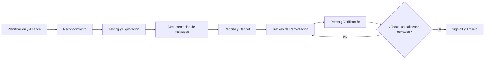

Usa esta plantilla para documentar hallazgos de auditorías de seguridad de forma clara y accionable. Te da una estructura para el informe, una matriz de calificación repetible y un trackeo de remediación. Yo he usado este formato en decenas de engagements, y me ahorra tiempo tanto en el reporte como en el seguimiento. Consulta la [Guía de Seguridad de Aplicaciones Web](/guides/web-application-security-guide/) para prácticas de seguridad más amplias.

## Descripción General



Esta plantilla ayuda a equipos de seguridad y líderes de ingeniería a producir informes de pruebas de penetración consistentes y útiles. Cubre el resumen ejecutivo, el alcance, los hallazgos, las calificaciones de riesgo, el trackeo de remediación y los entregables. Úsala antes, durante y después de una auditoría de seguridad para que no se pierda nada.

## Cuándo Usar

- Planificar una prueba de penetración próxima con equipos internos o un vendor. Yo uso esta plantilla desde la llamada inicial de scoping.
- Documentar hallazgos de una auditoría de seguridad.
- Trackear remediación entre equipos de ingeniería.
- Preparar un resumen ejecutivo para el liderazgo.
- Programar una nueva prueba después de aplicar correcciones.

## Plantilla

````markdown
# Reporte de Prueba de Penetración

## Resumen Ejecutivo

| Campo | Valor |
|-------|-------|
| **Target** | [aplicación / red / API] |
| **Alcance** | [URLs / IPs in-scope y out-of-scope] |
| **Período de test** | [AAAA-MM-DD a AAAA-MM-DD] |
| **Tester** | [equipo interno / vendor] |
| **Riesgo general** | [Crítico / Alto / Medio / Bajo] |

## Resumen de Riesgo

| Severidad | Cantidad | Estado |
|-----------|----------|--------|
| Crítico | [N] | [abierto / remediado] |
| Alto | [N] | [abierto / remediado] |
| Medio | [N] | [abierto / remediado] |
| Bajo | [N] | [abierto / remediado] |
| Informativo | [N] | [abierto / remediado] |

## Plantilla de Hallazgo

### [FINDING-001] [Título]

| Campo | Valor |
|-------|-------|
| **Severidad** | [Crítico / Alto / Medio / Bajo / Info] |
| **CVSS** | [score] |
| **Categoría** | [categoría OWASP] |
| **Estado** | [abierto / remediado / riesgo aceptado] |

#### Descripción
Qué es la vulnerabilidad y por qué importa.

#### Recursos Afectados
- URL: `https://example.com/api/v1/users`
- Parámetro: `id`
- Componente: User controller

#### Proof of Concept
```bash
curl "https://example.com/api/v1/users?id=1 OR 1=1"
## Retorna todos los usuarios — SQL injection confirmado
```

#### Impacto
Qué podría hacer un atacante con esta vulnerabilidad.

#### Remediación
Pasos específicos para arreglar. Incluye ejemplos de código si aplica.

#### Referencias
- OWASP: [link]
- CVE: [si aplica]
````

## Trackeo de Remediación

| ID | Hallazgo | Owner | Fecha Límite | Estado |
|----|----------|-------|--------------|--------|
| 001 | SQL Injection | Backend team | +7 días | En progreso |
| 002 | XSS | Frontend team | +14 días | Abierto |

## Matriz de Calificación de Riesgo

| Probabilidad \ Impacto | Bajo | Medio | Alto |
|------------------------|------|-------|------|
| Alta | Medio | Alto | Crítico |
| Media | Bajo | Medio | Alto |
| Baja | Info | Bajo | Medio |

## Mejores Prácticas

- **Incluye una prueba de concepto.** Sin pasos de reproducción, los desarrolladores no pueden arreglar el problema. Yo siempre adjunto un screenshot o un comando curl a cada hallazgo.
- **Califica el riesgo en contexto de negocio.** Un bug teóricamente crítico en una página admin interna puede ser riesgo medio. He visto equipos sobre-reaccionar a hallazgos CVSS 9.0 en endpoints que requieren VPN y no tienen datos sensibles.
- **Proporciona remediación a nivel de código.** "Arregla la inyección" no es suficiente; muestra la sintaxis de consultas parametrizadas. Consulta la [Guía de Seguridad de Aplicaciones Web](/guides/web-application-security-guide/) para ejemplos de código.
- **Trackea la remediación como un sprint.** Asigna owners, fechas límite y una ventana de retest. Yo trato el tracker de remediación igual que un sprint backlog: standups diarios, blockers visibles, y nada se cierra sin verificación.

## Errores Comunes

- Hallazgos vagos: "la app tiene XSS" sin URL o parámetro. Yo rechazo hallazgos así durante la revisión y le pido al tester que especifique el endpoint exacto.
- Sin screenshots o prueba de concepto: los desarrolladores pierden tiempo reproduciendo. Un screenshot de 30 segundos ahorra una hora de ida y vuelta.
- Fecha de retest faltante: la remediación sin verificación está incompleta. Traquea seguimientos con la [Plantilla de Respuesta a Incidentes de Seguridad](/docs/security-incident-response-template/).
- Scoring solo por CVSS: el contexto de negocio importa más que la fórmula. Un CVSS 7.5 en una API pública es más urgente que un CVSS 9.0 en una herramienta interna detrás de VPN.
- Dejar que las cuentas de test alcancen endpoints de producción durante el engagement. Una vez vi a un tester crear transacciones reales en un payment gateway porque la cuenta de test tenía acceso a producción.
- Confiar en la salida del scanner sin validación manual. Burp Suite y OWASP ZAP producen falsos positivos; siempre verifica antes de reportar.
- Registrar tokens, contraseñas o claves durante el test. Usa un paso de redacción de secrets antes de compartir el reporte.

## Variantes

| Contexto | Enfoque | Notas |
|----------|---------|-------|
| Web app | OWASP Top 10 + ASVS | Enfocarse en input validation y auth |
| API REST | OWASP API Security Top 10 | Enfocarse en rate limiting y auth |
| Mobile app | OWASP MASVS | Incluir análisis de APK/IPA |
| Infraestructura cloud | CIS Benchmarks + pentest de red | Incluir IAM y network policies |
| Internal red team | Sin notificación previa | Simular un atacante real |

Yo ajusto el enfoque según el contexto. Para web apps, suelo priorizar input validation y auth. Para APIs, me centro en rate limiting y BOLA. Para cloud, IAM y network policies son lo primero.

## Ejemplo de Plan de Pruebas de Penetración

```text
=== Plan de Pruebas de Penetración: payment-service ===

Objetivo: Evaluar la postura de seguridad del servicio de pagos
Fecha: 2026-08-15 a 2026-08-19
Tester: Security Firm XYZ
Contacto SPOC: alice@company.com

Alcance:
  URLs en alcance:
    - https://api.company.com/payments/*
    - https://api.company.com/orders/*
  URLs fuera de alcance:
    - https://api.company.com/auth/* (testeado en pentest anterior)
    - https://admin.company.com (fuera de alcance este engagement)

  Cuentas de test:
    - test-user-1@company.com (rol: customer)
    - test-user-2@company.com (rol: merchant)
    - test-admin@company.com (rol: admin)

  Datos permitidos:
    - Datos de test sintéticos únicamente
    - No acceder a datos de producción reales
    - No modificar datos persistentes

Reglas de Engagement:
  - Horario de testing: 09:00-18:00 UTC-5
  - Rate limit: max 100 requests/segundo
  - No usar exploits que causen DoS
  - No usar social engineering
  - No testing físico
  - Notificar inmediatamente si se encuentra un hallazgo Crítico

Metodología:
  - OWASP Testing Guide v4.2
  - OWASP API Security Top 10
  - PTES (Penetration Testing Execution Standard)

Entregables:
  - Reporte ejecutivo (para liderazgo)
  - Reporte técnico (para ingeniería)
  - Hallazgos en formato CSV (para importar al tracker)
  - Presentación de debrief (sesión de 2 horas)

Cronograma:
  Día 1: Reconocimiento y mapeo de superficie de ataque
  Día 2: Testing de autenticación y autorización
  Día 3: Testing de lógica de negocio y flujo de pagos
  Día 4: Testing de infraestructura y configuración
  Día 5: Reporte y debrief
```

## Catálogo de Hallazgos del Mundo Real

En los últimos años, he visto las mismas categorías de hallazgos repetirse en pentests de web apps, APIs e infraestructura. Este catálogo ayuda a los testers a saber qué buscar y a los equipos de ingeniería a entender lo que probablemente enfrenten.

### Hallazgos de Aplicaciones Web

| Hallazgo | Categoría OWASP | Severidad típica | Cómo lo encuentro |
|----------|----------------|-----------------|-------------------|
| SQL Injection | A03:2021 Injection | Crítico | Testing manual de payloads en Burp Repeater |
| XSS reflejado | A03:2021 Injection | Alto | Payload en parámetros URL, verificar reflejo en la respuesta |
| XSS almacenado | A03:2021 Injection | Alto | Payload en campos de formulario, verificar persistencia entre páginas |
| Broken access control | A01:2021 Broken Access Control | Alto | Testing IDOR: intercambiar IDs de usuario en URLs y llamadas API |
| CSRF en endpoints que cambian estado | A01:2021 Broken Access Control | Medio | Verificar tokens anti-CSRF en POST/PUT/DELETE |
| Subida de archivos insegura | A04:2021 Insecure Design | Alto | Subir archivos polyglot, verificar si extensiones ejecutables están bloqueadas |
| Session fixation | A07:2021 Identification & Auth | Medio | Verificar si el session ID cambia después del login |

### Hallazgos de APIs

| Hallazgo | Categoría OWASP API | Severidad típica | Cómo lo encuentro |
|----------|---------------------|-----------------|-------------------|
| Broken object level authorization (BOLA) | API1:2023 | Crítico | Intercambiar IDs de objetos en llamadas API entre usuarios |
| Broken authentication | API2:2023 | Alto | Testear manipulación de JWT, políticas de contraseñas débiles, sin lockout |
| Excessive data exposure | API3:2023 | Medio | Comparar campos de respuesta API con lo que la UI realmente muestra |
| Sin rate limiting | API4:2023 | Alto | Enviar 1000+ requests, verificar respuestas 429 |
| Broken function level authorization | API5:2023 | Alto | Llamar endpoints admin con tokens de usuario regular |
| Mass assignment | API6:2023 | Medio | Añadir `role: admin` a payloads PUT/PATCH |
| Improper asset management | API9:2023 | Medio | Verificar versiones antiguas de API todavía accesibles |

### Hallazgos de Infraestructura

| Hallazgo | Estándar | Severidad típica | Cómo lo encuentro |
|----------|----------|-----------------|-------------------|
| Versiones TLS desactualizadas | PCI DSS 4.0 | Medio | `nmap --script ssl-enum-ciphers -p 443` |
| Puertos innecesarios abiertos | CIS Benchmarks | Medio | `nmap -sS -p- target` |
| Credenciales por defecto en servicios | CIS Benchmarks | Crítico | Probar defaults de vendor en SSH, bases de datos, paneles admin |
| Security headers faltantes | OWASP Secure Headers | Bajo | Verificar headers de respuesta con `curl -I` |
| Endpoints de debug en producción | OWASP A05:2021 | Alto | Sondear `/actuator`, `/debug`, `/health`, `/metrics` |
| Directorio `.git` expuesto | CWE-538 | Alto | Verificar `/.git/config` en web roots |
| DNS zone transfer | CWE-200 | Medio | `dig axfr @ns target.com` |

Yo mantengo este catálogo como checklist durante el testing. No es exhaustivo, pero cubre los hallazgos que encuentro en aproximadamente el 80% de los engagements. El 20% restante son bugs de lógica de negocio específicos de la aplicación, que ningún catálogo puede predecir. Cuando encuentro un bug de lógica, lo documento con detalle extra porque suele ser el más difícil de reproducir.

## Cuándo No Usar Esta Plantilla

Esta plantilla no encaja en todos los engagements de seguridad. Yo la evito en estos casos:

- **Bug bounties.** Plataformas como HackerOne y Bugcrowd tienen sus propios formatos de reporte. Usa la plantilla integrada de la plataforma.
- **Testing de seguridad continuo.** Si ejecutas scans DAST automatizados semanalmente, usa los reportes exportados de [OWASP ZAP](https://www.zaproxy.org/) o [Burp Suite](https://portswigger.net/burp) en vez de una plantilla manual.
- **Auditorías de compliance.** PCI DSS, SOC 2 e ISO 27001 requieren formatos de reporte específicos del framework. Esta plantilla no satisface esos requisitos por sí sola.
- **Revisiones de código fuente.** Herramientas SAST como [Semgrep](https://semgrep.dev/) y [CodeQL](https://codeql.github.com/) producen hallazgos estructurados que no mapean limpiamente al formato de esta plantilla.
- **Sesiones de threat modeling.** Usa [OWASP Threat Dragon](https://owasp.org/www-project-threat-dragon/) o worksheets STRIDE en su lugar.

## Herramientas y Ecosistema

| Herramienta | Tipo | Cuándo usarla |
| --- | --- | --- |
| [Burp Suite](https://portswigger.net/burp) | Proxy web + scanner | Pentest de web apps, testing manual, intercepción |
| [OWASP ZAP](https://www.zaproxy.org/) | Scanner web open-source | DAST automatizado, integración CI/CD, presupuestos ajustados |
| [Nmap](https://nmap.org/) | Scanner de red | Pentest de red, descubrimiento de servicios, fingerprinting de OS |
| [Nessus](https://www.tenable.com/products/nessus) | Scanner de vulnerabilidades | Scanning de infraestructura, checks de compliance |
| [Metasploit](https://www.metasploit.com/) | Framework de explotación | Validación de exploits, testing post-explotación |
| [Semgrep](https://semgrep.dev/) | Scanner SAST | Revisión de código fuente, gates de seguridad en CI/CD |
| [CVSS Calculator](https://www.first.org/cvss/calculator/3.1) | Scoring de riesgo | Asignar scores CVSS a hallazgos |

Yo típicamente combino Burp Suite con Nmap para pentests de web apps, y añado Nessus cuando hay infraestructura en alcance. Para testing de APIs, las herramientas Repeater e Intruder de Burp cubren la mayor parte de lo que necesito. Semgrep corre en CI/CD para capturar issues entre engagements.

## Compliance Regulatorio

Las pruebas de penetración suelen ser obligatorias por frameworks de compliance. Así mapea esta plantilla a los requisitos comunes:

| Framework | Requisito | Sección de la plantilla |
| --- | --- | --- |
| [PCI DSS 4.0](https://www.pcisecuritystandards.org/) | 11.4: Pentest anual + remediación | Resumen Ejecutivo, Hallazgos, Trackeo de Remediación |
| [SOC 2](https://www.aicpa-cima.com/topic/audit-assurance/audit-and-assurance-greater-than-soc-2) | CC4.1: Monitoreo de seguridad | Resumen de Riesgo, Trackeo de Remediación |
| [ISO 27001](https://www.iso.org/standard/27001) | A.12.6: Gestión de vulnerabilidades técnicas | Hallazgos, Matriz de Calificación de Riesgo |
| [NIST 800-115](https://csrc.nist.gov/publications/detail/sp/800-115/final) | Guía técnica de testing de seguridad | La plantilla completa se alinea con la metodología NIST |
| [HIPAA](https://www.hhs.gov/hipaa/) | Security Rule: Evaluación | Resumen Ejecutivo, Alcance, Hallazgos |

Yo siempre reviso qué framework impulsa el engagement antes de empezar. Los pentests de PCI DSS tienen requisitos específicos de scoping (cardholder data environment), y el reporte necesita declarar explícitamente los límites del alcance.

## Estándares de Reporte

Un buen reporte de pentest cuenta una historia. Yo estructuro los míos así:

1. **Resumen Ejecutivo** (1 página): impacto de negocio en lenguaje claro, riesgo general, top 3 hallazgos.
2. **Alcance y Metodología** (1-2 páginas): qué se testeó, qué no, herramientas usadas, período de testing.
3. **Resumen de Riesgo** (1 página): conteos por severidad, overview de estado, tendencia vs. pentest anterior.
4. **Hallazgos Detallados** (1-2 páginas por hallazgo): descripción, recursos afectados, PoC, impacto, remediación, referencias.
5. **Tracker de Remediación** (1 página): owner, fecha límite, estado de cada hallazgo.
6. **Anexos** (opcional): output crudo de scanners, cuentas de test, referencias de metodología.

El resumen ejecutivo es la sección más importante. El liderazgo rara vez pasa de ahí, así que invierto tiempo desproporcionado en dejarla clara. Si el CEO puede entender los top 3 riesgos y qué se está haciendo al respecto, el reporte cumplió su función.

Algo que aprendí por las malas: no entierres el rating de riesgo general. Ponlo al principio del resumen ejecutivo en negrita. Una vez tuve un CTO que leyó un reporte de 40 páginas y no vio el rating de riesgo porque estaba en la página 3. Ahora lo pongo en la primera oración. Lo mismo aplica para la fecha límite de remediación: el liderazgo necesita saber cuándo se deben los fixes, no solo que existen.

## Puntos Clave

- Un reporte de pentest es tan bueno como su tracker de remediación. Los hallazgos sin owner ni fecha límite acumulan polvo. He visto demasiados reportes archivados con "lo arreglamos el próximo sprint" y nunca pasa nada.
- Califica el riesgo en contexto de negocio, no solo por CVSS. Un CVSS 9.0 en una herramienta interna detrás de VPN es menos urgente que un CVSS 7.5 en una API pública. Yo siempre incluyo una línea de impacto de negocio en cada hallazgo para que el liderazgo entienda lo que está en juego.
- Siempre incluye una prueba de concepto. Los desarrolladores no pueden arreglar lo que no pueden reproducir. Un comando curl de 30 segundos o un screenshot ahorra horas de ida y vuelta.
- Trackea la remediación como un sprint: standups diarios, blockers, nada se cierra sin verificación. Yo corro revisiones de remediación semanales hasta que todos los hallazgos Críticos y Altos están cerrados.
- Comparte hallazgos sanitizados con el resto de ingeniería. Los patrones de seguridad se repiten entre servicios. Una SQL injection en la API de orders probablemente existe en la API de payments también.
- Programa el retest antes de que termine el engagement. Un retest a 90 días es el mínimo; 30 días es mejor para hallazgos críticos. Yo bloqueo la fecha de retest en el calendario antes de que el tester se vaya.

## Ver También

- [OWASP Testing Guide v4.2](https://owasp.org/www-project-web-security-testing-guide/) — metodología completa de testing de web apps
- [OWASP API Security Top 10](https://owasp.org/API-Security/editions/2023/en/0x11-t10/) — riesgos de seguridad específicos de APIs
- [PTES (Penetration Testing Execution Standard)](http://www.pentest-standard.org/index.php/Main_Page) — metodología estándar de pentest
- [NIST SP 800-115](https://csrc.nist.gov/publications/detail/sp/800-115/final) — guía técnica de testing de seguridad de la información
- [CVSS Calculator v3.1](https://www.first.org/cvss/calculator/3.1) — common vulnerability scoring system
- [FIRST.org](https://www.first.org/) — forum of incident response and security teams
- [Guía de Seguridad de Aplicaciones Web](/guides/web-application-security-guide/) — prácticas de seguridad más amplias
- [Seguridad de Contenedores](/recipes/container-security/) — aseguramiento de despliegues containerizados
- [Security Headers](/recipes/security-headers/) — configuración de headers HTTP de seguridad

## Preguntas Frecuentes

### ¿Cómo priorizo hallazgos cuando todo parece crítico?

Usa la matriz de riesgo: probabilidad × impacto. Consulta la [Guía de Seguridad de Aplicaciones Web](/guides/web-application-security-guide/) para contexto de threat modeling. Una SQL injection en un form de login público es crítica. El mismo bug en un reporte interno read-only puede ser medio. Yo considero explotabilidad y sensibilidad de datos. Cuando dudo entre dos severidades, voy con la más alta y dejo que el negocio decida si acepta el riesgo.

### ¿Cada hallazgo debería ser arreglado?

No. Algunos riesgos pueden ser aceptados si el costo de arreglar excede el impacto y existen controles compensatorios. Cuando acepto un riesgo, documento la decisión, consigo sign-off ejecutivo y fijo una fecha de revisión. Los riesgos aceptados no son "ignorados": son decisiones documentadas que alguien tomó deliberadamente.

### ¿Quién debería recibir el reporte completo?

Equipo de seguridad, leads de ingeniería y liderazgo ejecutivo (solo resumen ejecutivo). Comparte hallazgos detallados on a need-to-know basis para prevenir weaponización. He visto reportes filtrarse por canales de Slack y reenvíos de email, así que tengo cuidado con las listas de distribución.

### ¿Cómo elegimos una firma de penetration testing?

Evalúa firmas por certificaciones (OSCP, CEH, CISSP), experiencia en tu industria, referencias de clientes anteriores, metodología (OWASP, PTES) y calidad de reportes anteriores. Pide un reporte de muestra anonimizado. La calidad del reporte es tan importante como la calidad del testing. Verifica que la firma tenga seguro de responsabilidad profesional. Asegúrate de que la firma firme un NDA antes de compartir cualquier información. Compara precios pero no elijas solo por precio. Yo mantengo una relación continua con la firma en la que confío. Los testers que conocen tu sistema encuentran issues más profundos.

### ¿Cómo preparamos al equipo para un pen-test?

Notifica al equipo con 2 semanas de anticipación: fechas, alcance y SPOC. Asegúrate de que el SPOC tenga disponibilidad dedicada durante el pen-test (no esté on-call para otra cosa). Prepara cuentas de test con datos sintéticos. Prepara acceso a staging y producción si aplica. Documenta la arquitectura actual y compártela con el tester. Configura monitoring extra durante el pen-test para detectar si el testing causa impacto. Programa una llamada de kickoff el día 1 y una llamada de debrief el último día. Yo me aseguro de que el equipo sepa que no debe bloquear el tráfico del tester a menos que cause impacto real.

### ¿Qué hacemos después de recibir el reporte de pen-test?

Importa todos los hallazgos al tracker de remediación dentro de 48 horas. Clasifica cada hallazgo por severidad (Crítico/Alto/Medio/Bajo/Informativo). Asigna un owner a cada hallazgo. Programa la remediación según SLAs: Crítico 24-48h, Alto 1 semana, Medio 30 días, Bajo 90 días. Programa la ventana de retest con la firma (30-90 días). Comparte hallazgos sanitizados con el resto de ingeniería. Los patrones se repiten. Conduce un postmortem del proceso de pen-test: qué funcionó, qué no y qué mejorar. Actualiza el threat model con los hallazgos nuevos. Agrega tests de regresión al CI/CD para prevenir recurrencia.
