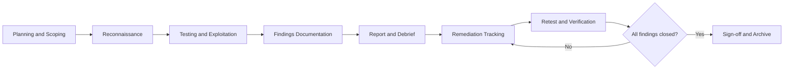

This template keeps security assessment findings clear and actionable. It gives you a structure for the report, a repeatable rating matrix, and a remediation tracker. I adopted this format after a 2019 engagement: the client had two pentests from different firms and couldn't compare findings because the severity scales didn't match. After standardizing on this template, every team I've handed it to cut reporting time by roughly a day. See the [Web Application Security Guide](/guides/web-application-security-guide/) for broader security practices.

## Overview



This template gives security teams and engineering leads a shared format for consistent, useful penetration test reports. It covers the executive summary, scope, findings, risk ratings, remediation tracking, and deliverables. Use it throughout the assessment: before scoping, during testing, and after reporting, so no finding or follow-up gets missed.

## When to Use

- Planning an upcoming penetration test with internal teams or a vendor.
- Capturing findings from a security assessment.
- Tracking remediation work across engineering teams.
- Drafting an executive summary for leadership. I spend more time here than on any other section.
- Scheduling a retest after fixes are in place.

## Template

````markdown
# Penetration Test Report

## Executive Summary

| Field | Value |
|-------|-------|
| **Target** | [application / network / API] |
| **Scope** | [in-scope and out-of-scope URLs / IPs] |
| **Test period** | [YYYY-MM-DD to YYYY-MM-DD] |
| **Tester** | [internal team / vendor] |
| **Aggregate risk** | [Critical / High / Medium / Low] |

## Risk Summary

| Severity | Count | Status |
|----------|-------|--------|
| Critical | [N] | [open / remediated] |
| High | [N] | [open / remediated] |
| Medium | [N] | [open / remediated] |
| Low | [N] | [open / remediated] |
| Informational | [N] | [open / remediated] |

## Finding Template

### [FINDING-001] [Title]

| Field | Value |
|-------|-------|
| **Severity** | [Critical / High / Medium / Low / Info] |
| **CVSS** | [score] |
| **Category** | [OWASP category] |
| **Status** | [open / remediated / accepted risk] |

#### Description
What the vulnerability is and why it matters.

#### Affected Resources
- URL: `https://example.com/api/v1/users`
- Parameter: `id`
- Component: User controller

#### Proof of Concept
```bash
curl "https://example.com/api/v1/users?id=1 OR 1=1"
## Returns all users — SQL injection confirmed
```

#### Impact
What an attacker could do with this vulnerability.

#### Remediation
Specific steps to fix. Include code examples if applicable.

#### References
- OWASP: [link]
- CVE: [if applicable]
````

## Remediation Tracking

| ID | Finding | Owner | Due Date | Status |
|----|---------|-------|----------|--------|
| 001 | SQL Injection | Backend team | +7 days | In progress |
| 002 | XSS | Frontend team | +14 days | Open |

## Risk Rating Matrix

| Likelihood \ Impact | Low | Medium | High |
|---------------------|-----|--------|------|
| High | Medium | High | Critical |
| Medium | Low | Medium | High |
| Low | Info | Low | Medium |

### Findings Triage Workflow

When the report lands, I run a triage pass before anything goes into the tracker. The goal is to separate what needs immediate action from what can wait a sprint.

1. **Critical findings (same-day review).** I pull the engineering lead into a call within hours, not days. If the finding is exploitable from the public internet and touches customer data, we treat it as an active incident and follow the [Security Incident Response Template](/docs/security-incident-response-template/) process — not a normal remediation ticket.
2. **High findings (within 48 hours).** I assign an owner and a fix window of one week. If the owner pushes back on the timeline, I escalate to the engineering manager rather than letting the finding sit.
3. **Medium and Low findings (batch into next sprint).** These go into the tracker with a 30-day or 90-day SLA. I batch them so the team doesn't context-switch mid-sprint for low-severity fixes.
4. **Informational findings (no fix required).** I log them for the threat model and the next architecture review, but they don't enter the remediation sprint. Examples: missing security headers on a static marketing page, verbose error messages on a staging environment.

The triage pass takes about 30 minutes for a typical 20-finding report. Skipping it means the team starts fixing the easiest findings first instead of the most impactful ones, which is the most common remediation anti-pattern I see.

## Best Practices

- **Include a proof of concept.** Without reproduction steps, developers can't fix the issue. I always attach a screenshot or a curl command to every finding.
- **Rate risk in business context.** A theoretically critical bug on an internal-only admin page may be a medium risk. I've seen teams over-react to CVSS 9.0 findings on endpoints that require VPN access and have no sensitive data.
- **Provide code-level remediation.** "Fix the injection" isn't enough; show the parameterized query syntax. The [Penetration Test Remediation Template](/docs/penetration-test-remediation-template/) has fix templates for common finding types.
- **Track remediation like a sprint.** Assign owners, due dates, and a retest window. I treat the remediation tracker the same way I treat a sprint backlog: daily standups, blockers surfaced, and nothing closed without verification.

## Common Mistakes

- Vague findings: "the app has XSS" without a URL or parameter. I reject findings like this during review and ask the tester to specify the exact endpoint.
- No screenshots or proof of concept: developers waste time reproducing. A 30-second screenshot saves an hour of back-and-forth.
- Missing retest date: remediation without verification is incomplete. Track follow-ups with the [Security Incident Response Template](/docs/security-incident-response-template/).
- Scoring by CVSS alone: business context matters more than the formula. A CVSS 7.5 on a public-facing API is more urgent than a CVSS 9.0 on an internal tool behind a VPN.
- Letting test accounts reach production endpoints during the engagement. I once saw a tester accidentally create real transactions on a payment gateway because the test account had production access.
- Trusting scanner output without manual validation. Burp Suite and OWASP ZAP produce false positives; always verify before reporting.
- Logging tokens, passwords, or keys during the test run. Use a secrets redaction step before sharing the report.

## Variants

| Context | Approach | Notes |
|---------|----------|-------|
| Web app | OWASP Top 10 + ASVS | Focus on input validation and auth |
| REST API | OWASP API Security Top 10 | Focus on rate limiting and auth |
| Mobile app | OWASP MASVS | Include APK/IPA analysis |
| Cloud infrastructure | CIS Benchmarks + network pentest | Include IAM and network policies |
| Internal red team | No prior notification | Simulate a real attacker |

## Pen-Test Plan Example

```text
=== Penetration Test Plan: payment-service ===

Objective: Assess the security posture of the payment service
Date: 2026-08-15 to 2026-08-19
Tester: Security Firm XYZ
SPOC: alice@company.com

Scope:
  In-scope URLs:
    - https://api.company.com/payments/*
    - https://api.company.com/orders/*
  Out-of-scope URLs:
    - https://api.company.com/auth/* (tested in previous pentest)
    - https://admin.company.com (out of scope this engagement)

  Test accounts:
    - test-user-1@company.com (role: customer)
    - test-user-2@company.com (role: merchant)
    - test-admin@company.com (role: admin)

  Data rules:
    - Synthetic test data only
    - No access to real production data
    - No modification of persistent data

Rules of Engagement:
  - Testing hours: 09:00-18:00 UTC-5
  - Rate limit: max 100 requests/second
  - No DoS-inducing exploits
  - No social engineering
  - No physical testing
  - Notify immediately if a Critical finding is discovered

Methodology:
  - OWASP Testing Guide v4.2
  - OWASP API Security Top 10
  - PTES (Penetration Testing Execution Standard)

Deliverables:
  - Executive report (for leadership)
  - Technical report (for engineering)
  - Findings in CSV format (for tracker import)
  - Debrief presentation (2-hour session)

Schedule:
  Day 1: Reconnaissance and attack surface mapping
  Day 2: Authentication and authorization testing
  Day 3: Business logic and payment flow testing
  Day 4: Infrastructure and configuration testing
  Day 5: Reporting and debrief
```

## Real-World Findings Catalog

Over the past few years, I've seen the same categories of findings appear repeatedly across web app, API, and infrastructure pentests. The catalog below is what I hand to junior testers on day one so they know where to dig, and what I show engineering leads so they understand the shape of what we're likely to find. I built it from my own engagement notes, not from a textbook.

### Web Application Findings

| Finding | OWASP Category | Typical Severity | How I find it |
|---------|---------------|-----------------|---------------|
| SQL Injection | A03:2021 Injection | Critical | Manual payload testing in Burp Repeater |
| Reflected XSS | A03:2021 Injection | High | Payload in URL parameters, check reflection in response |
| Stored XSS | A03:2021 Injection | High | Payload in form fields, check persistence across pages |
| Broken access control | A01:2021 Broken Access Control | High | IDOR testing: swap user IDs in URLs and API calls |
| CSRF on state-changing endpoints | A01:2021 Broken Access Control | Medium | Check for anti-CSRF tokens on POST/PUT/DELETE |
| Insecure file upload | A04:2021 Insecure Design | High | Upload polyglot files, check if executable extensions are blocked |
| Session fixation | A07:2021 Identification & Auth | Medium | Check if session ID changes after login |

### API Findings

| Finding | OWASP API Category | Typical Severity | How I find it |
|---------|-------------------|-----------------|---------------|
| Broken object level authorization (BOLA) | API1:2023 | Critical | Swap object IDs in API calls between users |
| Broken authentication | API2:2023 | High | Test JWT manipulation, weak password policies, no lockout |
| Excessive data exposure | API3:2023 | Medium | Compare API response fields with what the UI actually displays |
| Lack of rate limiting | API4:2023 | High | Send 1000+ requests, check for 429 responses |
| Broken function level authorization | API5:2023 | High | Call admin endpoints with regular user tokens |
| Mass assignment | API6:2023 | Medium | Add `role: admin` to PUT/PATCH payloads |
| Improper asset management | API9:2023 | Medium | Check for old API versions still accessible |

### Infrastructure Findings

| Finding | Standard | Typical Severity | How I find it |
|---------|----------|-----------------|---------------|
| Outdated TLS versions | PCI DSS 4.0 | Medium | `nmap --script ssl-enum-ciphers -p 443` |
| Open unnecessary ports | CIS Benchmarks | Medium | `nmap -sS -p- target` |
| Default credentials on services | CIS Benchmarks | Critical | Try vendor defaults on SSH, databases, admin panels |
| Missing security headers | OWASP Secure Headers | Low | Check response headers with `curl -I` |
| Debug endpoints in production | OWASP A05:2021 | High | Probe `/actuator`, `/debug`, `/health`, `/metrics` |
| Exposed `.git` directory | CWE-538 | High | Check `/.git/config` on web roots |
| DNS zone transfer | CWE-200 | Medium | `dig axfr @ns target.com` |

I keep this catalog as a checklist during testing. It covers the findings I encounter in roughly 80% of engagements. The remaining 20% are business-logic bugs specific to the application, which no catalog can predict. When I find a logic bug, I document it with extra detail because those are usually the hardest to reproduce and fix. Business-logic bugs also tend to have the highest business impact: they bypass authentication, escalate privileges, or allow fraud — exactly what automated scanners miss.

## When Not to Use This Template

Not every engagement calls for this template. I skip it in these cases:

- **Bug bounty programs.** Platforms like HackerOne and Bugcrowd have their own report formats. Stick with the platform's built-in template.
- **Continuous security testing.** If you're running automated DAST scans weekly, use [OWASP ZAP](https://www.zaproxy.org/) or [Burp Suite](https://portswigger.net/burp) report exports rather than a manual template.
- **Compliance audits.** PCI DSS, SOC 2, and ISO 27001 audits require framework-specific reporting formats. You'll need the auditor's template, not this one.
- **Source code reviews.** SAST tools like [Semgrep](https://semgrep.dev/) and [CodeQL](https://codeql.github.com/) produce structured findings that don't map cleanly to this template's format.
- **Threat modeling sessions.** Use [OWASP Threat Dragon](https://owasp.org/www-project-threat-dragon/) or STRIDE worksheets instead.

## Tooling and Ecosystem

| Tool | Type | When to use |
| --- | --- | --- |
| [Burp Suite](https://portswigger.net/burp) | Web proxy + scanner | Web app pentesting, manual testing, interception |
| [OWASP ZAP](https://www.zaproxy.org/) | Open-source web scanner | Automated DAST, CI/CD integration, budget-constrained |
| [Nmap](https://nmap.org/) | Network scanner | Network pentest, service discovery, OS fingerprinting |
| [Nessus](https://www.tenable.com/products/nessus) | Vulnerability scanner | Infrastructure scanning, compliance checks |
| [Metasploit](https://www.metasploit.com/) | Exploitation framework | Exploit validation, post-exploitation testing |
| [Semgrep](https://semgrep.dev/) | SAST scanner | Source code review, CI/CD security gates |
| [CVSS Calculator](https://www.first.org/cvss/calculator/3.1) | Risk scoring | Assigning CVSS scores to findings |

I typically pair Burp Suite with Nmap for web app pentests, and add Nessus when infrastructure is in scope. For API testing, Burp's Repeater and Intruder cover most of what I need, though I reach for Postman when the API has complex auth flows. Semgrep runs in CI/CD to catch issues between engagements. My Burp extension folder has grown to about 12 plugins over the years, mostly for auth bypass and JWT manipulation that the default install doesn't handle well.

## Regulatory Compliance

Penetration tests are often required by compliance frameworks. Here's how this template maps to common requirements:

| Framework | Requirement | Template section |
| --- | --- | --- |
| [PCI DSS 4.0](https://www.pcisecuritystandards.org/) | 11.4: Annual pentest + remediation | Executive Summary, Findings, Remediation Tracking |
| [SOC 2](https://www.aicpa-cima.com/topic/audit-assurance/audit-and-assurance-greater-than-soc-2) | CC4.1: Security monitoring | Risk Summary, Remediation Tracking |
| [ISO 27001](https://www.iso.org/standard/27001) | A.12.6: Technical vulnerability management | Findings, Risk Rating Matrix |
| [NIST 800-115](https://csrc.nist.gov/publications/detail/sp/800-115/final) | Technical Guide to Information Security Testing | Full template aligns with NIST methodology |
| [HIPAA](https://www.hhs.gov/hipaa/) | Security Rule: Evaluation | Executive Summary, Scope, Findings |

I always check which framework drives the engagement before starting. PCI DSS pentests have specific scoping requirements (cardholder data environment), and the report needs to explicitly state the scope boundaries. I've had engagements rejected by auditors because the scope section was too vague, so I learned to be explicit about what's in and what's out.

## Reporting Standards

A good pentest report tells a story. I structure mine like this:

1. **Executive Summary** (1 page): business impact in plain language, aggregate risk, top 3 findings.
2. **Scope and Methodology** (1-2 pages): what was tested, what wasn't, tools used, testing period.
3. **Risk Summary** (1 page): severity counts, status overview, trend vs. previous pentest.
4. **Detailed Findings** (1-2 pages per finding): description, affected resources, PoC, impact, remediation, references.
5. **Remediation Tracker** (1 page): owner, due date, status for each finding.
6. **Appendices** (optional): raw scanner output, test accounts, methodology references.

The executive summary is where the report lives or dies. Leadership rarely reads past it, so I spend disproportionate time getting it right. If the CEO can walk away understanding the top 3 risks and what's being done about them, the report did its job.

One thing I learned the hard way: don't bury the aggregate risk rating. Put it at the top of the executive summary in bold. I once had a CTO read a 40-page report and miss the risk rating because it was on page 3. Now I put it in the first sentence. The same goes for the remediation deadline: leadership needs to know when the fixes are due, not just that they exist.

## Key Takeaways

- A pentest report is only as good as its remediation tracker. Findings without owners and due dates gather dust. I've seen too many reports filed away with "we'll fix it next sprint" and nothing happens.
- Weigh risk in business context, not just CVSS. A CVSS 9.0 on an internal tool behind VPN is less urgent than a CVSS 7.5 on a public API. I always include a business impact line in each finding so leadership understands the stakes. One sentence is enough: "An attacker can extract customer PII via this endpoint without authentication."
- Always include a proof of concept. Developers can't fix what they can't reproduce. A 30-second curl command or screenshot saves hours of back-and-forth.
- Track remediation like a sprint: daily standups, blockers, nothing closed without verification. I run remediation reviews weekly until all Critical and High findings are closed.
- Share sanitized findings with the rest of engineering. Security patterns repeat across services. A SQL injection in the orders API probably exists in the payments API too.
- Schedule the retest before the engagement ends. A retest 90 days later is the minimum; 30 days is better for critical findings. I block the retest date on the calendar before the tester leaves.

## See Also

- [OWASP Testing Guide v4.2](https://owasp.org/www-project-web-security-testing-guide/) — in-depth web app testing methodology
- [OWASP API Security Top 10](https://owasp.org/API-Security/editions/2023/en/0x11-t10/) — API-specific security risks
- [PTES (Penetration Testing Execution Standard)](http://www.pentest-standard.org/index.php/Main_Page) — standard pentest methodology
- [NIST SP 800-115](https://csrc.nist.gov/publications/detail/sp/800-115/final) — technical guide to information security testing
- [CVSS Calculator v3.1](https://www.first.org/cvss/calculator/3.1) — common vulnerability scoring system
- [FIRST.org](https://www.first.org/) — forum of incident response and security teams
- [Web Application Security Guide](/guides/web-application-security-guide/) — broader security practices
- [Container Security](/recipes/container-security/) — securing containerized deployments
- [Security Headers](/recipes/security-headers/) — HTTP security header configuration

## FAQ

### How do I prioritize findings when everything seems critical?

Use the risk matrix: likelihood times impact. The [Vulnerability Management Template](/docs/vulnerability-management-template/) has a scoring rubric for triage. SQL injection on a public login form is clearly critical. The same bug on an internal read-only report may be medium. I factor in how easy the bug is to exploit and how sensitive the data is. When I'm torn between two severities, I go with the higher one and let the business decide whether to accept the risk.

### Should every finding be fixed?

No. Some risks may be accepted if the cost of fixing exceeds the impact and compensating controls exist. When I accept a risk, I record the decision, get executive sign-off, and set a review date. Accepted risks aren't "ignored": they're documented decisions that someone made deliberately. I revisit accepted risks quarterly to check if the threat conditions have shifted.

### Who should receive the full report?

Distribute the full report to the security team, engineering leads, and executive leadership. Leadership usually only needs the executive summary. Hand detailed findings only to people who need them, to prevent weaponization. A 2021 incident at a previous employer taught me to lock this down: a forwarded report with exploit details ended up in a vendor's Slack channel. My rule now: if someone doesn't need to fix a finding, they don't get the details. For external auditors, I send a redacted version with exploit steps removed and only the remediation status.

### How do we choose a penetration testing firm?

Evaluate firms by certifications (OSCP, CEH, CISSP), experience in your industry, references from previous clients, methodology (OWASP, PTES), and quality of previous reports. Request a sample anonymized report from an engagement similar to yours before signing. Report quality is as important as testing quality. Check that the firm carries professional liability insurance. Have the firm sign an NDA before you share any information. Price matters, but a cheap pentest can miss critical issues. My firm has been on retainer since 2022. Testers who already know your system find deeper issues than a fresh team starting from scratch, and that institutional memory pays for itself by the second engagement.

### How do we prepare the team for a pen-test?

Notify the team 2 weeks in advance: dates, scope, and SPOC. Make sure the SPOC has dedicated availability during the pen-test (not on-call for something else). Prepare test accounts with synthetic data. Prepare access to staging and production if applicable. Document the current architecture and share it with the tester. Configure extra monitoring during the pen-test to detect if testing causes impact. Schedule a kickoff call on day 1 and a debrief call on the last day. I make sure the team knows not to block tester traffic unless it's genuinely causing impact. I also set up a dedicated Slack channel for the engagement so questions don't get lost in general channels.

### What do we do after receiving the pen-test report?

Import all findings into the remediation tracker within 48 hours. Tag each finding by severity: Critical, High, Medium, Low, or Informational. Assign an owner to each finding. Schedule remediation per SLAs: Critical 24-48h, High 1 week, Medium 30 days, Low 90 days. Schedule the retest window with the firm (30-90 days). Share sanitized findings with the rest of engineering. Patterns repeat. After the retest, hold a 60-minute internal retro with the engineering leads: what surfaced late, what the tester missed, where the scope was too narrow. Feed the new findings back into the threat model. Add regression tests to CI/CD to prevent recurrence. I also schedule a 30-minute review with the tester to walk through any findings I'm unsure about, rather than guessing at the remediation.
