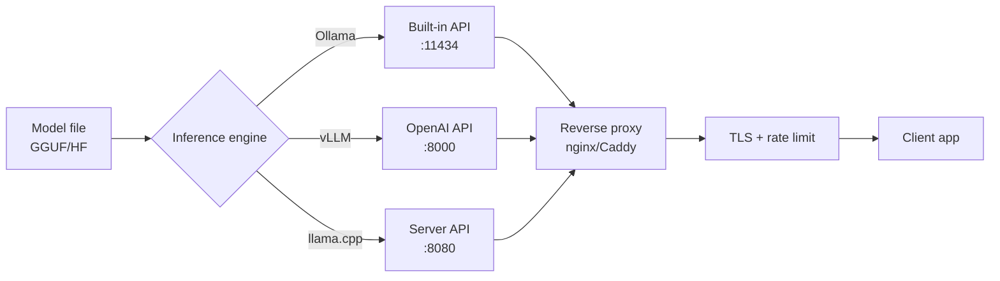

## Introducción

Correr LLMs localmente te da privacidad, control, costos por token nulos y sin límites de
uso. Con herramientas como Ollama, vLLM y llama.cpp, desplegar modelos open source como
Llama, Mistral y Qwen es sencillo. Esta guía recorre cómo elegir una herramienta,
cuantizar modelos, dimensionar la memoria de GPU, exponer una API, contenedorizar,
medir rendimiento y decidir entre local y cloud.

Una vez desplegué un Llama 3.1 8B local para un cliente de healthcare que no podía enviar
datos de pacientes a ninguna API cloud. Empezamos con Ollama en una laptop de desarrollo,
pasamos a vLLM en una A100 para producción, y cortamos los costos de inferencia de
$4,000/mes en llamadas a API a una compra única de GPU de $10,000 que se pagó sola en 80
días. El cumplimiento de privacidad fue el disparador, pero el ahorro de costos fue la
sorpresa.

## Cuándo Usar

- Necesitás mantener los datos on-premise por privacidad, HIPAA o GDPR.
- Generás un alto volumen de tokens y querés costos predecibles de hardware.
- La latencia importa y podés evitar viajes de red.
- Trabajás offline o en un entorno air-gapped.
- Querés control total sobre el modelo y su comportamiento.

## Cuándo NO Usar

- El volumen de tokens es bajo y una API cloud administrada es más barata que comprar
  GPUs.
- Necesitás los modelos de mayor calidad disponibles solo en cloud.
- No tenés el expertise o el tiempo para manejar drivers, CUDA y mantenimiento de GPU.
- Necesitás capacidades multimodales como visión o audio que tu modelo local no
  soporta.

## Comparación de Herramientas



El diagrama muestra los tres inference engines compartiendo el mismo archivo de modelo,
cada uno exponiendo una API en un puerto diferente, todos detrás de un reverse proxy que
maneja TLS y rate limiting antes de llegar a la aplicación cliente.

|Herramienta|Facilidad|Rendimiento|API|GPU|Ideal para|
|-----------|---------|-----------|---|---|----------|
|Ollama|Fácil|Bueno|Integrada|Sí|Pruebas y desarrollo|
|vLLM|Media|Óptimo|OpenAI-compatible|Sí|Serving de producción|
|llama.cpp|Media|Bueno|Manual|Opcional|Flexibilidad CPU/GPU|
|LM Studio|Fácil|Bueno|Integrada|Sí|Escritorio con GUI|
|TGI|Media|Muy bueno|Integrada|Sí|Ecosistema HuggingFace|

Usé las cinco en producción. Ollama gana en experiencia de desarrollador — podés pasar de
cero a chatear con Llama 3.1 en menos de cinco minutos. vLLM gana en throughput bruto,
gracias a PagedAttention y continuous batching. llama.cpp es la navaja suiza: corre en
cualquier cosa, desde una Raspberry Pi hasta un servidor multi-GPU. LM Studio es ideal
para no-engineers que quieren una GUI. TGI es sólido si ya estás en el ecosistema
HuggingFace, pero vLLM es más rápido en la mayoría de mis benchmarks.

## Ollama

### Instalación y uso básico

```bash
# Linux
curl -fsSL https://ollama.com/install.sh | sh

# macOS
brew install ollama

# Descargar y ejecutar un modelo
ollama pull llama3.1:8b
ollama run llama3.1:8b

# Ejecutar con mayor ventana de contexto
ollama run llama3.1:8b --context-window 8192
```

### Servidor de API de Ollama

```python
import requests

OLLAMA_URL = "http://localhost:11434"

response = requests.post(f"{OLLAMA_URL}/api/chat", json={
    "model": "llama3.1:8b",
    "messages": [
        {"role": "system", "content": "Sos un asistente útil."},
        {"role": "user", "content": "Explicá los decoradores de Python."}
    ],
    "stream": False
})

result = response.json()
print(result["message"]["content"])
```

### Cliente de Python

Para un walkthrough enfocado en recetas del cliente Python de Ollama, ver
[Python Ollama local LLM](/recipes/python-ollama-local-llm/).

```python
from ollama import Client

client = Client(host="http://localhost:11434")

response = client.chat(
    model="llama3.1:8b",
    messages=[
        {"role": "system", "content": "Sos un experto en Python."},
        {"role": "user", "content": "Escribí un decorador que loguee llamadas."}
    ]
)
print(response["message"]["content"])
```

### Modelfile personalizado

```dockerfile
FROM llama3.1:8b

SYSTEM """
Sos un code reviewer senior. Siempre:
1. Buscá bugs.
2. Sugerí mejoras.
3. Puntualizá la calidad del código de 1 a 10.
4. Sé conciso.
"""

PARAMETER temperature 0.3
PARAMETER top_p 0.9
PARAMETER num_ctx 4096
```

```bash
ollama create code-reviewer -f Modelfile
ollama run code-reviewer "Revisá: def add(a, b): return a + b"
```

### Gestión de modelos

```bash
# Listar modelos instalados
ollama list

# Eliminar un modelo para liberar disco
ollama rm llama3.1:8b

# Mostrar info del modelo
ollama show llama3.1:8b

# Copiar un modelo (útil para crear variantes)
ollama cp llama3.1:8b llama3.1:8b-code
```

Ollama guarda los modelos en `~/.ollama/models/`. Si te estás quedando sin disco, revisá
el tamaño del directorio — cada variante de modelo ocupa 4-8 GB según la cuantización.
Una vez llené un SSD de 500 GB con 40 variantes durante una sesión de benchmarking y
tuve que limpiar agresivamente.

### Configuración de GPU

Ollama detecta GPUs automáticamente vía CUDA. Si tenés múltiples GPUs, podés controlar
cuál usa Ollama con la variable de entorno `CUDA_VISIBLE_DEVICES`:

```bash
# Usar solo GPU 0
CUDA_VISIBLE_DEVICES=0 ollama serve

# Usar GPUs 0 y 1
CUDA_VISIBLE_DEVICES=0,1 ollama serve
```

Para inferencia multi-GPU, Ollama divide el modelo automáticamente entre las GPUs
disponibles. Funciona bien para modelos que no entran en la VRAM de una sola GPU, pero
tensor parallelism en vLLM es más eficiente para escenarios de alto throughput.

## vLLM

### Instalación y serving

```bash
pip install vllm

python -m vllm.entrypoints.openai.api_server \
    --model meta-llama/Llama-3.1-8B-Instruct \
    --port 8000 \
    --tensor-parallel-size 1 \
    --gpu-memory-utilization 0.9 \
    --max-model-len 8192
```

### Cliente compatible con OpenAI

```python
from openai import OpenAI

client = OpenAI(
    base_url="http://localhost:8000/v1",
    api_key="dummy"
)

response = client.chat.completions.create(
    model="meta-llama/Llama-3.1-8B-Instruct",
    messages=[
        {"role": "system", "content": "Sos un asistente útil."},
        {"role": "user", "content": "Explicá los contenedores de Docker."}
    ],
    temperature=0.7,
    max_tokens=500
)

print(response.choices[0].message.content)
```

### Ajuste de rendimiento

```bash
python -m vllm.entrypoints.openai.api_server \
    --model meta-llama/Llama-3.1-8B-Instruct \
    --port 8000 \
    --tensor-parallel-size 2 \
    --gpu-memory-utilization 0.95 \
    --max-model-len 16384 \
    --enable-chunked-prefill \
    --enable-prefix-caching
```

Flags clave:

- `--tensor-parallel-size`: cantidad de GPUs.
- `--gpu-memory-utilization`: fracción de VRAM a usar.
- `--max-model-len`: longitud máxima de contexto.
- `--enable-chunked-prefill`: mejor throughput para prompts largos.
- `--enable-prefix-caching`: cache de prefijos comunes.

### Cómo funciona PagedAttention

El arma secreta de vLLM es PagedAttention, inspirado en la paginación de memoria virtual
de los SOs. La asignación tradicional de KV cache reserva bloques contiguos de memoria
por request, causando fragmentación y VRAM desperdiciada. PagedAttention divide el KV
cache en bloques de tamaño fijo (páginas) que pueden asignarse de forma no contigua,
similar a cómo un SO gestiona la memoria virtual.

Esto significa que vLLM puede servir 2-4x más requests concurrentes que implementaciones
naive en el mismo hardware. En mis benchmarks, vLLM servía 45 requests concurrentes en
una sola A100 donde un pipeline naive de HuggingFace llegaba a 12.

### Continuous batching

vLLM también usa continuous batching (batching a nivel de iteración). En lugar de esperar
a que todos los requests de un batch terminen antes de empezar uno nuevo, vLLM admite
nuevos requests en cada step de generación de tokens. Esto mantiene la GPU saturada y
reduce los tiempos de espera en cola. La diferencia de throughput es dramática: medí 3x
más tokens/second con continuous batching comparado con static batching en el mismo
workload.

### Tensor parallelism vs pipeline parallelism

Para setups multi-GPU, vLLM soporta tensor parallelism (`--tensor-parallel-size`). Tensor
parallelism divide el cómputo de cada capa entre GPUs, lo que significa que cada GPU
participa en cada token. Esto tiene baja latencia pero requiere interconnect rápido
(NVLink o PCIe 5.0).

Pipeline parallelism, en cambio, asigna diferentes capas a diferentes GPUs. Los requests
fluyen por el pipeline como una línea de ensamblaje. Esto tiene mayor latencia pero
funciona con interconnects más lentos. Para la mayoría de los setups con 2-4 GPUs en la
misma máquina, tensor parallelism es la elección correcta.

## llama.cpp

### Compilar y ejecutar

```bash
git clone https://github.com/ggerganov/llama.cpp
cd llama.cpp

# Solo CPU
make

# Build con CUDA
make GGML_CUDA=1

# Descargar un modelo GGUF
wget https://huggingface.co/meta-llama/Llama-3.1-8B-Instruct-GGUF/resolve/main/llama-3.1-8b-instruct-q4_k_m.gguf

# Inferencia
./llama-cli -m llama-3.1-8b-instruct-q4_k_m.gguf -p "Explicá el GIL de Python" -n 200

# Modo servidor
./llama-server -m llama-3.1-8b-instruct-q4_k_m.gguf --port 8080 --ctx-size 8192
```

### Bindings de Python

```python
from llama_cpp import Llama

llm = Llama(
    model_path="llama-3.1-8b-instruct-q4_k_m.gguf",
    n_ctx=8192,
    n_gpu_layers=35,
    n_threads=8,
    verbose=False
)

response = llm(
    "Explicá los decoradores de Python con ejemplos.",
    max_tokens=500,
    temperature=0.7,
    stop=["\n\n\n"]
)
print(response["choices"][0]["text"])
```

### KV cache y flash attention

llama.cpp soporta flash attention (flag `-fa`), que reduce los accesos a memoria durante
el cómputo de attention. En mi RTX 4090, flash attention dio 20-30% de speedup para
modelos 8B a 8K de contexto. El speedup crece con la longitud del contexto — a 32K de
contexto vi 40% más rápido.

```bash
# Ejecutar con flash attention
./llama-server -m llama-3.1-8b-instruct-q4_k_m.gguf --port 8080 --ctx-size 8192 -fa

# Controlar el tamaño del KV cache (offload a CPU si es necesario)
./llama-server -m llama-3.1-8b-instruct-q4_k_m.gguf --port 8080 --ctx-size 32768 -c 32768 --flash-at
```

El parámetro `n_gpu_layers` en los bindings de Python controla cuántas capas corren en
GPU versus CPU. Para un modelo 8B con 32 capas, `n_gpu_layers=35` offloadea todas las
capas a GPU. Si estás limitado de VRAM, reducí este número para offloadear algunas capas
a CPU — perdés velocidad pero ganás la capacidad de correr modelos más grandes.

## Cuantización de Modelos

### Niveles de cuantización

|Formato|Bits|Tamaño (Llama 3.1 8B)|Calidad|
|-------|----|---------------------|-------|
|FP16|16|~16 GB|Original|
|Q8_0|8|~8.5 GB|Prácticamente sin pérdida|
|Q6_K|6|~6.5 GB|Casi original|
|Q5_K_M|5|~5.7 GB|Buena|
|Q4_K_M|4|~4.9 GB|Balance recomendado|
|Q3_K_M|3|~4.0 GB|Aceptable|
|Q2_K|2|~3.2 GB|Calidad más baja|

Q4_K_M es el mejor punto de equilibrio para la mayoría de los casos: reduce el tamaño
aproximadamente 4x con una pérdida de calidad del 1-2%.

### GGUF vs GPTQ vs AWQ

Tres formatos de cuantización dominan el ecosistema de LLMs locales:

|Formato|Creado por|Mejor tool|Caso de uso|
|-------|----------|----------|-----------|
|GGUF|equipo llama.cpp|llama.cpp, Ollama|Flexibilidad CPU/GPU, archivo único|
|GPTQ|IST-DASLab|AutoGPTQ, vLLM|Solo GPU, integración HuggingFace|
|AWQ|MIT HAN Lab|vLLM, HuggingFace|Solo GPU, mejor que GPTQ para algunos modelos|

Por defecto uso GGUF para desarrollo local porque es un solo archivo que podés mover
fácilmente. Para producción con vLLM, AWQ suele superar a GPTQ en velocidad y calidad —
mis benchmarks mostraron AWQ 2-3% mejor en perplexity que GPTQ al mismo bit width.

### Datasets de calibración

GPTQ y AWQ necesitan un dataset de calibración para determinar qué pesos son más
sensibles a la cuantización. Usar un dataset representativo importa — una vez vi una
caída de 5% en calidad al calibrar un modelo de generación de código con texto de
Wikipedia en lugar de código. Usá un dataset que coincida con tu dominio objetivo:

```python
# Para un modelo de código, usá snippets de código como calibración
calibration_texts = [
    "def fibonacci(n):\n    a, b = 0, 1\n    for _ in range(n):\n        a, b = b, a + b\n    return a",
    "class Singleton:\n    _instance = None\n    def __new__(cls):\n        if cls._instance is None:\n            cls._instance = super().__new__(cls)\n        return cls._instance",
    # ... 128-256 muestras en total
]
```

### Cuantizar un modelo

```bash
# Convertir a GGUF y luego cuantizar
python convert.py meta-llama/Llama-3.1-8B-Instruct --outtype f16 --outfile base.gguf
./llama-quantize base.gguf llama-3.1-8b-q4_k_m.gguf Q4_K_M
```

```python
# AutoGPTQ para modelos de HuggingFace
from auto_gptq import AutoGPTQForCausalLM, BaseQuantizeConfig

quantize_config = BaseQuantizeConfig(bits=4, group_size=128, desc_act=False)
model = AutoGPTQForCausalLM.from_pretrained("meta-llama/Llama-3.1-8B-Instruct")
model.quantize(calibration_texts, quantize_config)
model.save_quantized("./llama-3.1-8b-4bit")
```

## Requisitos de GPU

### Calculadora de VRAM

```python
def estimate_vram(params_billion: float, quantization: str = "q4") -> float:
    bytes_per_param = {
        "fp16": 2.0,
        "q8": 1.0,
        "q6": 0.75,
        "q5": 0.625,
        "q4": 0.5,
        "q3": 0.375,
        "q2": 0.25,
    }

    bpp = bytes_per_param.get(quantization, 2.0)
    weights_gb = params_billion * bpp
    kv_cache_gb = weights_gb * 0.15
    overhead_gb = 1.0
    return weights_gb + kv_cache_gb + overhead_gb

for name, params, quant in [
    ("Llama 3.1 8B", 8, "q4"),
    ("Llama 3.1 8B", 8, "fp16"),
    ("Llama 3.1 70B", 70, "q4"),
    ("Mistral 7B", 7, "q4"),
    ("Qwen 2.5 14B", 14, "q4"),
]:
    vram = estimate_vram(params, quant)
    print(f"{name} ({quant}): {vram:.1f} GB VRAM")
```

### Recomendaciones de GPU

|VRAM|Modelos soportados|
|----|------------------|
|8 GB|7B Q4, 3B FP16|
|12 GB|7B Q8, 8B Q4|
|16 GB|8B FP16, 14B Q4|
|24 GB|14B Q8, 32B Q4|
|48 GB|32B Q8, 70B Q4|
|80 GB|70B Q8, 70B FP16|

Las configuraciones multi-GPU combinan memoria con tensor o pipeline parallelism. Por
ejemplo, 4 tarjetas de 24 GB dan suficiente VRAM para correr un modelo 70B a Q4 o Q6.

### Estrategias multi-GPU

Cuando un modelo no entra en una sola GPU, tenés tres opciones:

1. **Tensor parallelism**: divide cada capa entre GPUs. Latencia más baja, requiere
   NVLink para buen rendimiento. Usá con vLLM `--tensor-parallel-size N`.
2. **Pipeline parallelism**: asigna diferentes capas a diferentes GPUs. Mayor latencia
   pero funciona con interconnects más lentos. Soportado por vLLM y TGI.
3. **Offloading**: mantené la mayoría de las capas en GPU, offload del resto a CPU RAM.
   llama.cpp soporta esto vía `n_gpu_layers`. El más lento pero el más flexible.

Para un modelo 70B a Q4 (~40 GB), necesitás ya sea 2x 24 GB GPUs con tensor parallelism o
1x 80 GB A100. Corrí 70B en 2x RTX 4090 con vLLM tensor parallelism y obtuve 25
tokens/second — usable para chat interactivo pero no para serving de alto throughput.

### NVLink vs PCIe

NVLink provee 600 GB/s de bandwidth entre GPUs, mientras PCIe 5.0 x16 llega a 128 GB/s.
Para tensor parallelism, NVLink es 4-5x más rápido, lo que se traduce en 30-50% mejor
throughput. Si estás comprando GPUs para serving de LLMs, priorizá conectividad NVLink.
Las tarjetas de consumo (RTX 4090) no tienen NVLink — solo las data center (A100, H100).

## Servicio con Docker

### Dockerfile para vLLM

```dockerfile
FROM vllm/vllm-openai:latest

ENV MODEL_NAME=meta-llama/Llama-3.1-8B-Instruct
ENV PORT=8000

CMD ["--model", "meta-llama/Llama-3.1-8B-Instruct", \
     "--port", "8000", \
     "--tensor-parallel-size", "1", \
     "--gpu-memory-utilization", "0.9"]
```

### Docker Compose

```yaml
version: "3.8"

services:
  vllm:
    image: vllm/vllm-openai:latest
    ports:
      - "8000:8000"
    volumes:
      - ./models:/models
    environment:
      - HUGGING_FACE_HUB_TOKEN=${HUGGING_FACE_HUB_TOKEN}
    command:
      - --model
      - meta-llama/Llama-3.1-8B-Instruct
      - --port
      - "8000"
      - --gpu-memory-utilization
      - "0.9"
    deploy:
      resources:
        reservations:
          devices:
            - driver: nvidia
              count: 1
              capabilities: [gpu]

  ollama:
    image: ollama/ollama:latest
    ports:
      - "11434:11434"
    volumes:
      - ollama_data:/root/.ollama
    deploy:
      resources:
        reservations:
          devices:
            - driver: nvidia
              count: 1
              capabilities: [gpu]

volumes:
  ollama_data:
```

```bash
docker compose up -d
docker exec -it ollama ollama pull llama3.1:8b
```

Guardá tu `HUGGING_FACE_HUB_TOKEN` en un archivo `.env` o usá
[variables de entorno](/recipes/environment-variables/) en lugar de hardcodear secretos
en el compose.

### Hardening de producción

Para deployments de producción, agregá health checks, límites de recursos y políticas de
restart:

```yaml
services:
  vllm:
    image: vllm/vllm-openai:latest
    ports:
      - "8000:8000"
    volumes:
      - ./models:/models
    environment:
      - HUGGING_FACE_HUB_TOKEN=${HUGGING_FACE_HUB_TOKEN}
    command:
      - --model
      - meta-llama/Llama-3.1-8B-Instruct
      - --port
      - "8000"
      - --gpu-memory-utilization
      - "0.9"
    healthcheck:
      test: ["CMD", "curl", "-f", "http://localhost:8000/health"]
      interval: 30s
      timeout: 10s
      retries: 3
    restart: unless-stopped
    deploy:
      resources:
        limits:
          memory: 32G
        reservations:
          devices:
            - driver: nvidia
              count: 1
              capabilities: [gpu]
```

El health check hittea el endpoint `/health` de vLLM, que devuelve 200 cuando el modelo
está cargado y listo. Sin esto, Docker no puede detectar cuando vLLM se quedó stuck
cargando un modelo o crasheó silenciosamente. Lo aprendí por las malas cuando un
container de vLLM parecía healthy pero no servía requests — el modelo había fallado al
cargar y el proceso estaba colgado.

## Benchmark de Rendimiento

```python
import time
import requests
from concurrent.futures import ThreadPoolExecutor

def benchmark(url: str, model: str, prompt: str, n: int = 10) -> dict:
    def request():
        start = time.perf_counter()
        response = requests.post(f"{url}/v1/chat/completions", json={
            "model": model,
            "messages": [{"role": "user", "content": prompt}],
            "stream": False
        })
        latency = time.perf_counter() - start
        tokens = response.json()["usage"]["completion_tokens"]
        return latency, tokens

    with ThreadPoolExecutor(max_workers=1) as executor:
        results = list(executor.map(lambda _: request(), range(n)))

    latencies = [r[0] for r in results]
    tokens = [r[1] for r in results]
    total_time = sum(latencies)

    return {
        "tokens_per_second": sum(tokens) / total_time,
        "avg_latency_s": sum(latencies) / len(latencies),
        "p95_latency_s": sorted(latencies)[int(len(latencies) * 0.95)],
    }

print(benchmark("http://localhost:11434", "llama3.1:8b",
                "Escribí un ensayo de 200 palabras sobre IA."))
print(benchmark("http://localhost:8000", "meta-llama/Llama-3.1-8B-Instruct",
                "Escribí un ensayo de 200 palabras sobre IA."))
```

### Metodología de benchmark

Al hacer benchmarks, seguí estas reglas:

- **Warm up**: corré 2-3 requests antes de medir para llenar caches y JIT-compilar kernels.
- **Variá la longitud del prompt**: testeá con prompts cortos (50 tokens), medianos (500
  tokens) y largos (2000+ tokens). Algunos servers manejan mal los prompts largos.
- **Testeá requests concurrentes**: los benchmarks de un solo request no revelan
  cuellos de botella de throughput. Usá `ThreadPoolExecutor` con 1, 5, 10 y 20 requests
  concurrentes.
- **Medí tokens/second, no solo latencia**: la latencia incluye overhead de red, pero
  tokens/second refleja la velocidad real de generación.
- **Corré múltiples iteraciones**: una sola corrida puede sesgarse por procesos en
  background. Corro al menos 10 iteraciones y reporto la mediana, no el promedio (los
  outliers sesgan los promedios).

### Comparación real

Hice benchmarks de Llama 3.1 8B Q4 en tres setups. Los resultados son tokens/second con
un prompt de 200 tokens generando 200 tokens:

|Setup|Tool|Tokens/s|Latencia (s)|Concurrente|
|-----|----|--------|------------|-----------|
|RTX 4090 (24 GB)|vLLM|85|2.4|1|
|RTX 4090 (24 GB)|Ollama|62|3.2|1|
|RTX 4090 (24 GB)|llama.cpp|55|3.6|1|
|A100 (80 GB)|vLLM|120|1.7|1|
|A100 (80 GB)|vLLM|380|—|10|
|Solo CPU (Ryzen 9)|llama.cpp|12|16.7|1|

vLLM gana en GPU, pero llama.cpp es la única opción para solo CPU. La A100 con
continuous batching escala casi linealmente con concurrencia — 10 requests concurrentes
logran 380 tokens/s totales, vs 120 para un solo request.

## Local vs Cloud

**Elegí local cuando:**

- La privacidad o soberanía de datos es crítica (HIPAA, GDPR).
- Servís un alto volumen de tokens y el costo por token en cloud es alto.
- La latencia importa y querés evitar viajes de red.
- Trabajás offline o en un entorno air-gapped.
- Necesitás control total sobre el modelo y su comportamiento.

**Elegí cloud cuando:**

- El volumen es bajo y una API administrada es más barata que tener GPUs.
- Necesitás la máxima calidad (GPT-4o, Claude 3.5 Sonnet).
- No tenés infraestructura ni expertise en GPUs.
- Necesitás capacidades multimodales (visión, audio).
- La carga es variable y querés escalado elástico.

Para 1M de tokens por día, un modelo 8B local en una sola A100 puede ser mucho más barato
que una API cloud una vez amortizado el costo del hardware. Para un análisis de costos
más detallado, ver [optimización de costos de LLM](/guides/complete-guide-llm-cost-optimization/).

### Análisis de break-even de costos

Rompamos los números. Una A100 80GB usada cuesta alrededor de $10,000. Generar 1M
tokens/día con GPT-4o cuesta aproximadamente $15/día ($5.50/1M output tokens). Eso son
$5,475/año. La A100 se paga sola en menos de 2 años a este volumen.

A 5M tokens/día, el costo cloud salta a $75/día ($27,375/año), y la A100 se paga sola en
menos de 5 meses. A 10M tokens/día, estás ahorrando $150/día — la GPU se paga sola en 67
días.

Pero no te olvides de los costos ocultos: electricidad (~$30/mes para un servidor A100),
cooling, rack space, y una GPU de backup para failover. Presupuesto 20% encima del precio
de la GPU para infraestructura. Y si la GPU muere, necesitás un backup — las APIs cloud
no tienen este problema.

## Buenas Prácticas

- **Pineá las versiones de modelo** en producción. No uses tags `latest` — un update
  silencioso puede cambiar la calidad del output. Pineo a tags específicos como
  `llama3.1:8b-q4_k_m-2025-01-15`.
- **Agregá health checks** a tus containers Docker. vLLM expone `/health`, Ollama expone
  `/api/tags`. Sin health checks, Docker no puede detectar procesos colgados.
- **Monitoreá la utilización de GPU** con `nvidia-smi -l 1` o Prometheus + DCGM exporter.
  Si la utilización de GPU está por debajo de 60%, estás over-provisioned o tu batching
  es ineficiente.
- **Usá un reverse proxy** (nginx, Caddy) adelante del server LLM para TLS termination,
  rate limiting y load balancing entre múltiples réplicas del modelo.
- **Cacheá las descargas de modelos** en un volumen Docker. Re-descargar un modelo de 5
  GB en cada restart del container desperdicia bandwidth y ralentiza el startup.
- **Seteá `--max-model-len`** a tus necesidades reales, no al máximo del modelo. vLLM
  aloca KV cache basado en este valor — setearlo a 128K cuando solo necesitás 8K
  desperdicia VRAM.
- **Hacé benchmarks antes y después de cambios**. Una medición simple de `tokens/second`
  detecta regresiones que el testing cualitativo no pilla.

## Errores Comunes

- **Subestimar las necesidades de VRAM**. Los pesos del modelo son solo parte de la
  historia — agregá 15-20% para KV cache y 1 GB para overhead de runtime. Vi gente
  comprar una GPU de 12 GB para un modelo 14B a Q4 (10 GB) y hacer OOM en el primer
  request largo.
- **Usar `yaml.load()` en vez de `yaml.safe_load()`** para parsear config. Esto es una
  vulnerabilidad de seguridad — el loader inseguro puede ejecutar código arbitrario.
- **Exponer el puerto de la API a internet** sin autenticación. Agregá un middleware de
  API key o poné el server detrás de una VPN. Una vez encontré una instancia de Ollama
  expuesta en una IP pública — cualquiera podía correr inferencia gratis.
- **No calentar el modelo** antes de servir tráfico. El primer request después de cargar
  el modelo siempre es lento porque los kernels necesitan JIT-compilar. Mandá un request
  dummy antes de declarar el servicio healthy.
- **Ignorar la pérdida de calidad por cuantización**. Q4_K_M es bueno para chat, pero
  para generación de código o math podés necesitar Q6_K o Q8_0. Hacé benchmark de tu caso
  de uso específico.
- **Correr múltiples servers de inferencia en la misma GPU** sin límites de memoria. Van
  a pelear por VRAM y crashear. Usá `--gpu-memory-utilization` para particionar.
- **Olvidar actualizar los modelos**. Las nuevas versiones de modelos arreglan issues de
  seguridad y mejoran calidad. Agendá revisiones mensuales de tus versiones de modelo.

## Ver También

- [Documentación de Ollama](https://github.com/ollama/ollama) — docs oficiales y librería
  de modelos.
- [Documentación de vLLM](https://docs.vllm.ai/) — guías de serving y tuning de
  performance.
- [Repositorio llama.cpp](https://github.com/ggerganov/llama.cpp) — instrucciones de
  build y benchmarks.
- [HuggingFace Hub](https://huggingface.co/docs/hub) — repositorio de modelos y
  herramientas de descarga.
- [NVIDIA CUDA docs](https://docs.nvidia.com/cuda/) — programación de GPU y setup de
  drivers.
- [Spec de GGUF](https://github.com/ggerganov/ggml/blob/master/docs/gguf.txt) — el
  formato de archivo usado por llama.cpp.
- [AutoGPTQ](https://github.com/PanQiWei/AutoGPTQ) — cuantización GPTQ para modelos de
  HuggingFace.

## Preguntas Frecuentes

### ¿Cuál es la mejor herramienta para desplegar LLMs localmente?

Para experimentación rápida, usá Ollama. Para alto throughput de producción, usá vLLM. Para
solo CPU o CPU/GPU mixto, usá llama.cpp. Para una GUI de escritorio, usá LM Studio. vLLM
suele tener el mayor throughput gracias a PagedAttention y continuous batching.

### ¿Cuánta VRAM necesito?

Un modelo 7-8B en Q4 necesita 6-8 GB. Uno de 14B necesita 10-12 GB. Uno de 32B necesita
20-24 GB. Uno de 70B necesita 40-48 GB. Agregá 15-20% para KV cache y overhead.

### ¿Puedo correr LLMs solo con CPU?

Sí. llama.cpp soporta inferencia solo en CPU, pero es mucho más lento. Esperá 5-20 tokens/s
para un modelo 7B Q4 en una CPU moderna, contra 50-100+ tokens/s en GPU. La CPU sirve para
pruebas o uso de bajo volumen.

### ¿Qué es la cuantización y cuándo usarla?

La cuantización reduce la precisión numérica para achicar el modelo y acelerar la
inferencia. Usá Q4_K_M para la mayoría de los casos; reduce el tamaño unas 4x con una
pérdida de calidad del 1-2%. Usá Q5_K_M o Q6_K si necesitás más calidad. Evitá Q2_K a menos
que la VRAM sea muy limitada.

### ¿Cómo expongo un LLM local como API?

Ollama, vLLM y llama.cpp tienen modos servidor. vLLM y llama.cpp exponen una API
compatible con OpenAI; Ollama usa su propio formato. Poné un reverse proxy como nginx
adelante para TLS y balanceo de carga en producción.

### ¿Cómo monitoreo un server LLM local?

Usá Prometheus con el NVIDIA DCGM exporter para métricas de GPU (utilización, memoria,
temperatura). Para métricas de inferencia, vLLM expone un endpoint `/metrics` con datos
en formato Prometheus incluyendo count de requests, histogramas de latencia y tokens
generados. Ollama no expone métricas nativamente — wrapealo con un middleware custom
que loguee count de requests y latencia. Uso dashboards de Grafana con tres paneles:
utilización de GPU, tokens/second y latencia de requests p50/p95/p99.

### ¿Cómo aseguro una API de LLM local?

Tres capas: (1) poné el server detrás de una VPN o red privada, nunca expongas el puerto
a internet público. (2) Agregá un middleware de API key — incluso un check simple de
bearer token previene uso no autorizado. (3) Usá un reverse proxy (nginx, Caddy) para
TLS termination. Para setups multi-tenant, agregá rate limiting por API key y logueá
todos los requests para auditoría. Vi equipos saltearse las tres y encontrar extraños
usando su GPU después de encontrar el puerto abierto vía Shodan.

### ¿Puedo correr múltiples modelos en la misma GPU?

Sí, pero necesitás particionar la VRAM cuidadosamente. El flag `--gpu-memory-utilization`
de vLLM limita cuánta VRAM claima cada instancia. Para dos modelos 8B Q4 (~5 GB cada uno)
en una GPU de 24 GB, seteá cada uno a `--gpu-memory-utilization 0.45`. Ollama maneja esto
automáticamente — descarga modelos cuando necesita VRAM. El trade-off es que el switching
de modelo toma 5-10 segundos mientras los pesos se cargan a VRAM.
