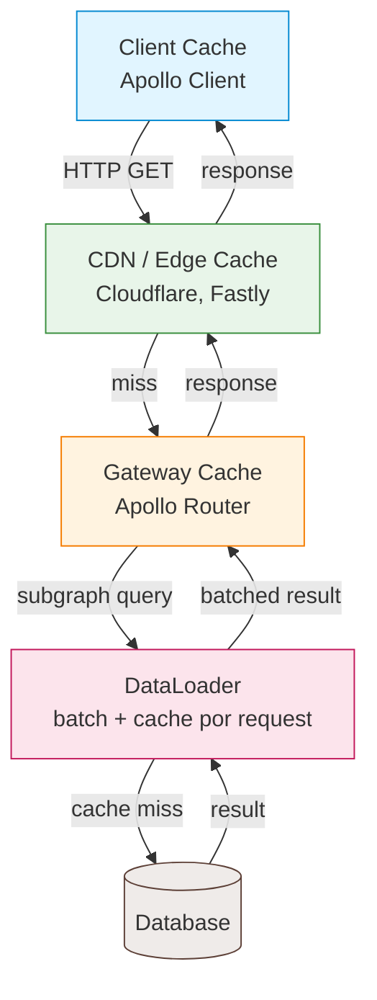

## Introducción

El caching en GraphQL es más difícil que en REST porque cada request va a la
misma URL (`/graphql`) con un body POST diferente. REST puede cachear a nivel de
URL; GraphQL necesita cache keys basadas en el contenido de la query. A pesar de
esto, hay varias capas donde podés cachear datos de GraphQL de forma efectiva.
Esta guía recorre cada capa desde el CDN hasta el cliente, con ejemplos de código
y tradeoffs.

Aprendí casi todo por las malas. Hace unos años shippeé una API GraphQL para un
catálogo de e-commerce. La primera versión no tenía caching: cada page load
pegaba a la base de datos por datos de productos, árboles de categorías y
pricing. Los tiempos de respuesta eran 300-500ms para queries simples. Después
de añadir DataLoader, CDN caching con persisted queries y una capa de Redis, las
mismas queries bajaron a 20-40ms para cache hits. La parte difícil no fue
implementar ninguna capa individual. Fue entender cómo interactúan y dónde los
datos pueden quedar stale.

Esta guía recorre cada capa de caching en orden, desde el cliente hasta la base
de datos. Vas a ver dónde cachear, qué cachear, qué evitar y cómo manejar
invalidación cuando los datos cambian. Al final vas a tener un checklist de
producción para cachear cualquier API GraphQL.

## Capas de Caching



Cada capa cumple un propósito diferente:

- **Client cache**: evita requests de red redundantes para los mismos datos.
- **CDN/edge cache**: sirve respuestas cerca de los usuarios geográficamente.
- **Gateway cache**: cachea respuestas de subgrafos para reducir la carga.
- **DataLoader**: agrupa y cachea dentro de una sola request para prevenir N+1.
- **Database cache**: cachea resultados de queries a nivel de ORM o base de datos.

## HTTP Caching con GET Requests

### Cambiar de POST a GET

Por defecto, los clientes GraphQL envían POST requests. Las respuestas POST no
son cacheables por CDNs ni navegadores. Cambiá a GET para queries cacheables.

```javascript
// Apollo Client: usar GET para queries
import { ApolloClient, InMemoryCache, HttpLink } from "@apollo/client";

const client = new ApolloClient({
  link: new HttpLink({
    uri: "/graphql",
    useGETForQueries: true,
  }),
  cache: new InMemoryCache(),
});
```

El servidor debe soportar GET requests con la query en la URL:

```javascript
// Express server
app.get("/graphql", (req, res) => {
  const { query, variables, operationName } = req.query;
  // Ejecutar y retornar
});
```

### Directivas Cache-Control

Usá la directiva `@cacheControl` para definir `max-age` y `scope` en tipos y
campos.

```graphql
type Query {
  product(id: ID!): Product @cacheControl(maxAge: 3600)
  products: [Product!]! @cacheControl(maxAge: 600)
  currentUser: User @cacheControl(maxAge: 0, scope: PRIVATE)
}

type Product @cacheControl(maxAge: 3600) {
  id: ID!
  name: String!
  price: Float!
}

type User @cacheControl(maxAge: 0, scope: PRIVATE) {
  id: ID!
  email: String!
}
```

El servidor calcula la política de cache para cada query en base a los campos
solicitados. Si una query incluye algún campo `PRIVATE`, toda la respuesta es
privada. El `max-age` final resulta del valor más chico entre todos los campos que la
query solicita.

```javascript
import { ApolloServerPluginCacheControl } from "@apollo/server/plugin/cacheControl";

const server = new ApolloServer({
  typeDefs,
  resolvers,
  plugins: [ApolloServerPluginCacheControl({ defaultMaxAge: 0 })],
});
```

El plugin setea headers `Cache-Control: max-age=3600, public` o
`Cache-Control: max-age=0, private` en las respuestas.

## CDN Caching

Para un vistazo más amplio a estrategias de edge caching, ver la
[guía de estrategias de CDN caching](/guides/complete-guide-cdn-caching-strategy/).

### Cómo funciona el CDN Caching para GraphQL

Cuando usás GET requests con headers `cache-control`, los CDNs (Cloudflare,
Fastly, CloudFront) cachean respuestas en base a la URL completa, incluyendo el
query string.

```text
GET /graphql?query={product(id:1){id name price}}&variables={}
```

El CDN almacena la respuesta y la sirve directamente para URLs idénticas. Esto
funciona bien para datos públicos y no específicos de usuario.

### Consideraciones de Cache Key

La cache key es la URL completa. Dos queries que difieren solo en whitespace
producen cache keys diferentes. Usá persisted queries para normalizarlas.

### Persisted Queries para CDN Caching

Con persisted queries, el cliente envía un hash en lugar de la query completa:

```text
GET /graphql?extensions={"persistedQuery":{"sha256Hash":"abc123","version":1}}
```

Todos los clientes que usan la misma query producen la misma URL, maximizando
los hits de cache del CDN.

```javascript
import { createPersistedQueryLink } from "@apollo/client/link/persisted-queries";
import { ApolloClient, InMemoryCache, HttpLink } from "@apollo/client";
import { sha256 } from "crypto-hash";

const persistedQueryLink = createPersistedQueryLink({ sha256 });
const httpLink = new HttpLink({ uri: "/graphql", useGETForQueries: true });

const client = new ApolloClient({
  link: persistedQueryLink.concat(httpLink),
  cache: new InMemoryCache(),
});
```

### Purge del CDN en Cambios de Datos

Cuando los datos cambian, purgá el cache del CDN. Usá webhooks o llamadas API al
proveedor de CDN.

```javascript
// Después de actualizar un producto
async function purgeProductCache(productId) {
  await fetch("https://api.fastly.com/purge/abc123", {
    method: "POST",
    headers: { "Fastly-Key": process.env.FASTLY_KEY },
    body: JSON.stringify({ surrogates: [`product-${productId}`] }),
  });
}
```

Usá surrogate keys en el header de respuesta `Surrogate-Key` para etiquetar
respuestas y hacer purging dirigido:

```javascript
res.setHeader("Surrogate-Key", `product-${productId} products`);
```

## Caching a Nivel de Gateway

### Apollo Router Cache

Apollo Router puede cachear respuestas de subgrafos. Esto reduce la carga en
subgrafos para queries repetidas.

```yaml
# router.yaml
supergraph:
  cache:
    enabled: true
    ttl: 300s
```

### Entity Cache

Cacheá los resultados de resolver entidades. De esta forma, las referencias
repetidas no vuelven a pegarle al subgrafo.

```yaml
# router.yaml
apq:
  router:
    cache:
      in_memory:
        limit: 1000
```

## DataLoader: Caching Por-Request

DataLoader agrupa y cachea dentro de una sola request GraphQL. Previene queries
N+1 al juntar cargas individuales en un solo batch. Para un análisis más
profundo, ver el [patrón DataLoader](/patterns/graphql-dataloader-pattern/).

```javascript
import DataLoader from "dataloader";

const resolvers = {
  Query: {
    products: async (_root, { ids }, ctx) => {
      const products = await ctx.db.products.findMany({ where: { id: { in: ids } } });
      return products;
    },
  },
  Product: {
    category: (product, _args, ctx) => ctx.loaders.categoryLoader.load(product.categoryId),
  },
};

// Fábrica de contexto: crear DataLoaders nuevos por request
function createContext(db) {
  return {
    db,
    loaders: {
      categoryLoader: new DataLoader(async (categoryIds) => {
        const categories = await db.categories.findMany({ where: { id: { in: categoryIds } } });
        const map = new Map(categories.map((c) => [c.id, c]));
        return categoryIds.map((id) => map.get(id));
      }),
    },
  };
}
```

### Caching de DataLoader Dentro de una Request

DataLoader cachea por key dentro de una sola request. Si dos resolvers llaman
`load(42)`, la base de datos se consulta una sola vez. La segunda llamada
retorna el resultado cacheado. Este cache es por-request: una nueva request
obtiene DataLoaders nuevos.

### DataLoader vs Redis Cache

DataLoader es un cache por-request. Redis es un cache cross-request. Usá ambos:
DataLoader previene N+1 dentro de una request; Redis previene consultas
redundantes a la base de datos entre requests. Para patrones de Redis, ver la
[guía de estrategias de Redis caching](/guides/complete-guide-redis-caching-strategies/).

```javascript
const categoryLoader = new DataLoader(async (categoryIds) => {
  // Verificar Redis primero
  const cached = await ctx.redis.mget(categoryIds.map((id) => `category:${id}`));
  const missing = categoryIds.filter((id, i) => !cached[i]);

  // Consultar faltantes en la base de datos
  if (missing.length > 0) {
    const fromDb = await db.categories.findMany({ where: { id: { in: missing } } });
    await Promise.all(fromDb.map((c) => ctx.redis.set(`category:${c.id}`, JSON.stringify(c), "EX", 3600)));
  }

  // Combinar cacheados y frescos
  return categoryIds.map((id, i) => cached[i] ? JSON.parse(cached[i]) : fromDb.find((c) => c.id === id));
});
```

## Caching del Lado del Cliente con Apollo Client

### Cache Normalizado

Apollo Client almacena datos en un cache normalizado por `__typename:id`. Esto
significa que actualizar un producto en una query lo actualiza en todos lados.

```javascript
import { ApolloClient, InMemoryCache } from "@apollo/client";

const client = new ApolloClient({
  cache: new InMemoryCache({
    typePolicies: {
      Product: {
        keyFields: ["id"],
      },
      Query: {
        fields: {
          products: {
            merge(existing = [], incoming) {
              return incoming;
            },
          },
        },
      },
    },
  }),
});
```

### Actualizaciones de Cache Después de Mutaciones

Después de una mutación, actualizá el cache para reflejar el cambio sin volver a
consultar.

```javascript
const CREATE_PRODUCT = gql`
  mutation CreateProduct($input: CreateProductInput!) {
    createProduct(input: $input) {
      product { id name price }
    }
  }
`;

const GET_PRODUCTS = gql`
  query GetProducts {
    products { id name price }
  }
`;

function CreateProduct() {
  const [createProduct] = useMutation(CREATE_PRODUCT, {
    update(cache, { data }) {
      const newProduct = data.createProduct.product;
      cache.modify({
        fields: {
          products(existing = []) {
            cache.writeFragment({
              data: newProduct,
              fragment: gql`fragment NewProduct on Product { id name price }`,
            });
            return [...existing, newProduct];
          },
        },
      });
    },
  });
  // ...
}
```

### Persistencia de Cache

Persistí el cache a `localStorage` o `sessionStorage` para que sobreviva
recargas de página.

```javascript
import { ApolloClient, InMemoryCache } from "@apollo/client";
import { LocalStorageWrapper, persistCache } from "apollo3-cache-persist";

const cache = new InMemoryCache();

await persistCache({
  cache,
  storage: new LocalStorageWrapper(window.localStorage),
  maxSize: 1048576, // 1MB
});
```

## Estrategias de Invalidación de Cache

### Expiración Basada en TTL

Seteá un time-to-live en los datos cacheados. Cuando el TTL expira, la
siguiente request pide datos frescos al origen. Es simple, pero puede servir
datos obsoletos durante el TTL.

```javascript
// Redis SET con TTL
await redis.set("product:42", JSON.stringify(product), "EX", 3600); // 1 hora
```

### Invalidación Event-Driven

Publicá eventos de invalidación cuando los datos cambian. Los suscriptores
eliminan la entrada de cache.

```javascript
// Después de actualizar un producto
async function updateProduct(id, data) {
  const product = await db.products.update({ where: { id }, data });
  await redis.del(`product:${id}`);
  await redis.publish("cache-invalidation", JSON.stringify({ type: "product", id }));
  return product;
}

// Suscriptor
redis.subscribe("cache-invalidation", (message) => {
  const { type, id } = JSON.parse(message);
  redis.del(`${type}:${id}`);
});
```

### Cache Keys Versionadas

Incluí un número de versión en la cache key. Incrementá la versión cuando los
datos cambian. Las entradas viejas expiran naturalmente.

```javascript
const version = await redis.get("product:version") || "1";
const cacheKey = `product:${id}:v${version}`;
const cached = await redis.get(cacheKey);
```

### Invalidación Basada en Tags

Etiquetá entradas de cache con entidades relacionadas. Purgá por tag.

```javascript
// Set con tags
await redis.set("product:42", JSON.stringify(product), "EX", 3600);
await redis.sadd("tag:category:5", "product:42");

// Purgar por tag
async function purgeCategory(categoryId) {
  const keys = await redis.smembers(`tag:category:${categoryId}`);
  if (keys.length > 0) {
    await redis.del(...keys);
    await redis.del(`tag:category:${categoryId}`);
  }
}
```

## Monitoreo de Performance del Cache

No podés optimizar lo que no medís. Seteé dashboards para cada capa de caching
desde el principio, y me pagó cada vez.

### Métricas Clave

- **Hit rate por capa**: CDN, gateway, DataLoader, Redis. Si cualquier capa baja
  del 50%, investigá por qué.
- **Tasa de evicción**: evicciones altas significan que tu cache es chico o los
  TTLs son muy cortos.
- **Incidentes de datos stale**: trackeá cuán seguido los usuarios reportan ver
  datos desactualizados. Esta es tu métrica de efectividad de invalidación.
- **Load del origen**: queries por segundo a la base de datos. Si el caching
  funciona, el load del origen se mantiene plano aunque el tráfico crezca.
- **TTL vs frecuencia real de cambio**: si tu TTL es 1 hora pero los datos
  cambian cada 5 minutos, estás sirviendo datos stale 55 minutos de cada 60.

### Herramientas

La mayoría de los CDNs exponen hit rates en su dashboard. Para Redis, usá
`INFO stats` para verificar `keyspace_hits` y `keyspace_misses`. Para DataLoader,
añadir logging simple en la batch function para contar cache hits vs database
calls. Para Apollo Client, `client.cache.extract()` te deja inspeccionar el
cache normalizado en dev tools.

Una vez atrapé un issue en producción donde el hit rate del CDN cayó de 80% a
20% de la noche a la mañana. Resulta que un developer había añadido un header
custom a todas las requests GraphQL, lo que cambió la cache key de cada
respuesta. El monitoreo lo atrapó antes de que los usuarios lo notaran.

## Qué Cachear vs Qué No Cachear

### Cachear

- Datos públicos y de mucha lectura (catálogos, posts, categorías).
- Datos que cambian poco (configuraciones, datos de referencia).
- Datos agregados (conteos, resúmenes, reportes).
- Datos específicos de usuario con TTL corto (perfil, preferencias).

### No Cachear

- Datos en tiempo real (precios de acciones, resultados en vivo).
- Datos sensibles que requieren lecturas frescas (saldo, registros médicos).
- Datos detrás de mutaciones que deben ser inmediatamente consistentes.
- Tokens de autenticación y datos de sesión.

## Checklist de Producción

- [ ] GET requests habilitados para queries cacheables.
- [ ] Directivas `@cacheControl` en tipos y campos públicos.
- [ ] Persisted queries habilitadas para cache keys consistentes en CDN.
- [ ] CDN configurado para cachear respuestas `public`.
- [ ] Mecanismo de purge de CDN para cambios de datos.
- [ ] DataLoader para todos los resolvers de lista y relación.
- [ ] Redis cache para entidades frecuentemente accedidas.
- [ ] Apollo Client normalized cache configurado.
- [ ] Actualizaciones de cache después de mutaciones (sin datos obsoletos).
- [ ] Persistencia de cache para soporte offline (si se necesita).
- [ ] Monitoreo de cache hit rate en cada capa.
- [ ] TTLs seteados apropiadamente por tipo de dato.

## Mejores Prácticas

Llevo varios años shippeando APIs GraphQL en producción y estas son las
prácticas que realmente valieron la pena:

- **Empezá con DataLoader, añadí Redis después.** DataLoader te da el mayor
  beneficio con el menor esfuerzo. Una vez vi una query de lista de productos
  bajar de 200ms a 40ms solo por batchear cargas de categorías. Redis vino
  después cuando notamos que las mismas categorías se cargaban entre requests.
- **Usá `@cacheControl` en tipos, no solo en campos.** Setear `maxAge` en el
  tipo `Product` hace que cada campo lo herede. Si no, te olvidás de anotar
  campos. Lo aprendí por las malas debuggeando por qué un catálogo no se
  cacheaba: tres campos no tenían la directiva.
- **Seteá `scope: PRIVATE` en todo lo específico de usuario.** Cachear
  públicamente datos de usuario es un bug de seguridad. Vi equipos que
  cacheaban respuestas de `currentUser` accidentalmente y le servían a un
  usuario los datos de otro. Auditá tu schema por esto.
- **Monitoreá el hit rate por capa.** Si el hit rate del CDN está abajo del
  50% para datos públicos, tus cache keys son demasiado variadas. Revisá
  diferencias de whitespace, persisted queries faltantes o headers
  específicos de usuario filtrándose en la cache key.
- **Purgá en writes, no en un schedule.** Invalidación event-driven le gana al
  TTL para datos que cambian por acción del usuario. Trabajé en un sistema que
  purgaba cada 5 minutos. Los usuarios veían precios stale hasta 5 minutos
  después de que un admin los actualizaba. Cambiar a purging event-driven lo
  resolvió.

## Errores Comunes

- **Cachear mutaciones.** Vi equipos que añadían `@cacheControl` a respuestas
  de mutaciones pensando que aceleraría las cosas. Las mutaciones escriben
  datos; cachearlas significa que el write podría no llegar al servidor. Solo
  cacheá queries.
- **Olvidar crear DataLoaders nuevos por request.** Si reusás DataLoaders entre
  requests, servís datos stale del request anterior. Siempre crealos en la
  context factory, no a nivel módulo.
- **Usar POST para queries cacheables.** Las respuestas POST no son cacheadas
  por CDNs ni navegadores. Cambiá a GET con persisted queries para datos
  públicos.
- **Cachear demasiado agresivamente.** Un TTL de 24 horas en perfiles de
  usuario significa que los usuarios no pueden ver sus propias actualizaciones
  por un día. Usá TTLs cortos (1-5 minutos) para datos específicos de usuario
  y TTLs largos (1 hora+) para datos públicos.
- **No manejar cache stampede.** Cuando una entrada popular expira, todas las
  requests pegan a la base de datos al mismo tiempo. Usá un lock o el patrón
  `stale-while-revalidate` para prevenir thundering herd.
- **Ignorar los headers `Surrogate-Key`.** Sin surrogate keys, no podés hacer
  purges dirigidos. Vas a terminar purgando todo el cache del CDN en cada
  cambio de datos, lo que derrota el propósito.

## See Also

- [Apollo Server Caching Guide](https://www.apollographql.com/docs/apollo-server/performance/caching/):
  documentación oficial sobre plugins y directivas de caching de Apollo Server.
- [DataLoader](https://github.com/graphql/dataloader):
  la librería original de DataLoader por Facebook, con patrones de batch caching.
- [GraphQL Persisted Queries](https://www.apollographql.com/docs/react/networking/advanced-http-networking/#persisted-queries):
  el link de persisted queries de Apollo Client para cache keys consistentes en CDN.
- [Redis Caching Patterns](https://redis.io/docs/manual/patterns/):
  documentación de Redis sobre patrones de caching, TTLs y pub/sub para invalidación.
- [Patrón DataLoader](/patterns/graphql-dataloader-pattern/):
  un análisis más profundo de DataLoader batching y caching por request.
- [Guía de estrategias de CDN caching](/guides/complete-guide-cdn-caching-strategy/):
  una guía más amplia de estrategias de CDN caching más allá de GraphQL.

## Preguntas Frecuentes

### ¿Por qué no puedo cachear GraphQL como REST?

REST cachea por URL. Cada recurso tiene una URL única, entonces el CDN o
navegador puede cachearlo. GraphQL envía todas las requests a `/graphql`, por lo
que la URL es la misma para cada query. Para cachear GraphQL, necesitás GET
requests con la query en la URL, o persisted queries que produzcan cache keys
consistentes.

### ¿Debería cachear mutaciones?

No. No. Las mutaciones escriben datos y tienen que llegar al servidor. Solo cacheá queries
(operaciones de lectura). La directiva `@cacheControl` solo aplica a respuestas
de query.

### ¿Por cuánto tiempo debería cachear datos?

Depende de cuán obsoletos pueden estar los datos. Catálogos: 1 hora. Perfiles:
5 minutos. Configuraciones: 24 horas. Datos en tiempo real: 0 (sin
cache). Seteá el TTL al máximo staleness aceptable para cada tipo de dato.

### ¿Cuál es la diferencia entre Apollo Client cache y server cache?

Apollo Client cache está en el browser. Previene requests de red redundantes y
permite actualizaciones instantáneas de UI después de mutaciones. Server cache
(CDN, Redis, DataLoader) previene consultas redundantes a la base de datos y
computación. Ambas capas son necesarias para una aplicación rápida.

### ¿Cómo testeo el comportamiento del cache?

Verificá que queries repetidas retornen resultados cacheados (revisá headers de
respuesta como `Age` y `X-Cache: HIT`). Probá que las mutaciones invaliden el
cache. Asegurate de que no se sirvan datos obsoletos después de actualizaciones.
Usá `client.cache.extract()` de Apollo Client para inspeccionar el cache del
cliente.

### ¿Debería usar Redis o Memcached para caching GraphQL?

Redis soporta datos estructurados (hashes, sets, sorted sets), TTLs y pub/sub
para invalidación de cache. Memcached es más simple y rápido para caching
key-value. Usá Redis si necesitás invalidación por tags o pub/sub. Usá
Memcached si solo necesitás caching TTL básico.
