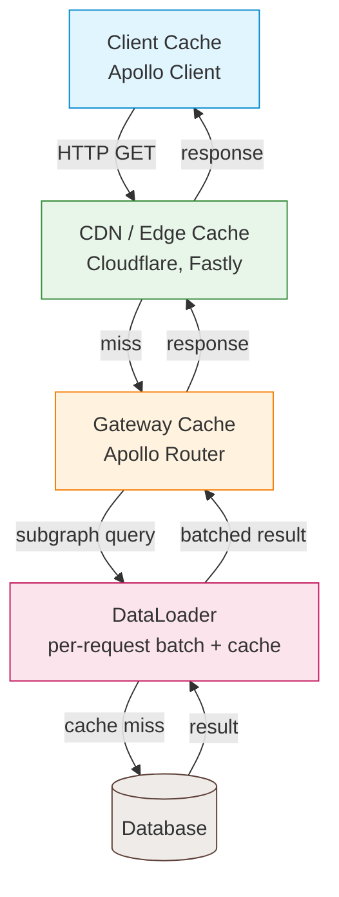

## Introduction

GraphQL caching is harder than REST caching because every request goes to the same
URL (`/graphql`) with a different POST body. REST can cache at the URL level;
GraphQL needs cache keys based on the query content. Despite this, there are
several layers where you can cache GraphQL data. This guide covers
each layer from CDN to client, with code examples and the tradeoffs you'll face.

I learned most of this the hard way. A few years ago I shipped a GraphQL API for
an e-commerce catalog. The first version had zero caching: every page load hit
the database for product data, category trees, and pricing. Response times were
300-500ms for simple queries. After adding DataLoader, CDN caching with persisted
queries, and a Redis layer, the same queries dropped to 20-40ms for cache hits.
The tricky part wasn't implementing any single layer. It was understanding how
they interact and where data can go stale.

This guide walks through each caching layer, from the client down to the
database. You'll see where to cache, what to cache, what to skip, and how to
handle invalidation when data changes. By the end you'll have a production
checklist for caching any GraphQL API.

## Caching Layers



Each layer serves a different purpose:

- **Client cache**: avoids redundant network requests for the same data.
- **CDN/edge cache**: serves responses close to users geographically.
- **Gateway cache**: caches subgraph responses to reduce subgraph load.
- **DataLoader**: batches and caches within a single request to prevent N+1.
- **Database cache**: caches query results at the ORM or database level.

## HTTP Caching with GET Requests

### Switch from POST to GET

By default, GraphQL clients send POST requests. POST responses aren't cacheable by
CDNs or browsers. Switch to GET for cacheable queries.

```javascript
// Apollo Client: use GET for queries
import { ApolloClient, InMemoryCache, HttpLink } from "@apollo/client";

const client = new ApolloClient({
  link: new HttpLink({
    uri: "/graphql",
    useGETForQueries: true,
  }),
  cache: new InMemoryCache(),
});
```

The server must support GET requests with the query in the URL:

```javascript
// Express server
app.get("/graphql", (req, res) => {
  const { query, variables, operationName } = req.query;
  // Execute and return
});
```

### Cache-Control Directives

Use the `@cacheControl` directive to set max-age and scope on types and fields.

```graphql
type Query {
  product(id: ID!): Product @cacheControl(maxAge: 3600)
  products: [Product!]! @cacheControl(maxAge: 600)
  currentUser: User @cacheControl(maxAge: 0, scope: PRIVATE)
}

type Product @cacheControl(maxAge: 3600) {
  id: ID!
  name: String!
  price: Float!
}

type User @cacheControl(maxAge: 0, scope: PRIVATE) {
  id: ID!
  email: String!
}
```

The server calculates the cache policy for each query based on the fields requested.
If a query includes any `PRIVATE` field, the entire response is private. The
max-age is the minimum of all fields' max-age values.

```javascript
import { ApolloServerPluginCacheControl } from "@apollo/server/plugin/cacheControl";

const server = new ApolloServer({
  typeDefs,
  resolvers,
  plugins: [ApolloServerPluginCacheControl({ defaultMaxAge: 0 })],
});
```

The plugin sets `Cache-Control: max-age=3600, public` or
`Cache-Control: max-age=0, private` headers on responses.

## CDN Caching

For a broader look at edge caching strategies, see the
[CDN caching strategy guide](/guides/complete-guide-cdn-caching-strategy/).

### How CDN Caching Works for GraphQL

When using GET requests with cache-control headers, CDNs (Cloudflare, Fastly,
CloudFront) cache responses based on the full URL including query string.

```text
GET /graphql?query={product(id:1){id name price}}&variables={}
```

The CDN stores the response and serves it directly for identical URLs. This
approach fits public, non-user-specific data well.

### Cache Key Considerations

The cache key is the full URL. Two queries that differ only in whitespace produce
different cache keys. Use persisted queries to normalize them.

### Persisted Queries for CDN Caching

With persisted queries, the client sends a hash instead of the full query:

```text
GET /graphql?extensions={"persistedQuery":{"sha256Hash":"abc123","version":1}}
```

All clients using the same query produce the same URL, maximizing CDN cache hits.

```javascript
import { createPersistedQueryLink } from "@apollo/client/link/persisted-queries";
import { ApolloClient, InMemoryCache, HttpLink } from "@apollo/client";
import { sha256 } from "crypto-hash";

const persistedQueryLink = createPersistedQueryLink({ sha256 });
const httpLink = new HttpLink({ uri: "/graphql", useGETForQueries: true });

const client = new ApolloClient({
  link: persistedQueryLink.concat(httpLink),
  cache: new InMemoryCache(),
});
```

### CDN Purge on Data Changes

When data changes, purge the CDN cache. Use webhooks or API calls to the CDN
provider.

```javascript
// After updating a product
async function purgeProductCache(productId) {
  await fetch("https://api.fastly.com/purge/abc123", {
    method: "POST",
    headers: { "Fastly-Key": process.env.FASTLY_KEY },
    body: JSON.stringify({ surrogates: [`product-${productId}`] }),
  });
}
```

Use surrogate keys in the `Surrogate-Key` response header to tag responses for
targeted purging:

```javascript
res.setHeader("Surrogate-Key", `product-${productId} products`);
```

## Gateway-Level Caching

### Apollo Router Cache

Apollo Router can cache subgraph responses. This reduces load on subgraphs for
repeated queries.

```yaml
# router.yaml
supergraph:
  cache:
    enabled: true
    ttl: 300s
```

### Entity Cache

Cache entity resolution results so repeated entity references don't hit the
subgraph.

```yaml
# router.yaml
apq:
  router:
    cache:
      in_memory:
        limit: 1000
```

## DataLoader: Per-Request Caching

DataLoader batches and caches within a single GraphQL request. It prevents N+1
queries by grouping individual loads into one batch. For a deeper dive, see the
[DataLoader pattern](/patterns/graphql-dataloader-pattern/).

```javascript
import DataLoader from "dataloader";

const resolvers = {
  Query: {
    products: async (_root, { ids }, ctx) => {
      const products = await ctx.db.products.findMany({ where: { id: { in: ids } } });
      return products;
    },
  },
  Product: {
    category: (product, _args, ctx) => ctx.loaders.categoryLoader.load(product.categoryId),
  },
};

// Context factory: create fresh DataLoaders per request
function createContext(db) {
  return {
    db,
    loaders: {
      categoryLoader: new DataLoader(async (categoryIds) => {
        const categories = await db.categories.findMany({ where: { id: { in: categoryIds } } });
        const map = new Map(categories.map((c) => [c.id, c]));
        return categoryIds.map((id) => map.get(id));
      }),
    },
  };
}
```

### DataLoader Caching Within a Request

DataLoader caches by key within a single request. If two resolvers call `load(42)`,
the database gets queried once. The second call returns the cached result. This cache
is per-request: a new request builds fresh DataLoaders.

### DataLoader vs Redis Cache

DataLoader is a per-request cache. Redis is a cross-request cache. Use both:
DataLoader prevents N+1 within a request; Redis prevents redundant database queries
across requests. For Redis patterns, see the
[Redis caching strategies guide](/guides/complete-guide-redis-caching-strategies/).

```javascript
const categoryLoader = new DataLoader(async (categoryIds) => {
  // Check Redis first
  const cached = await ctx.redis.mget(categoryIds.map((id) => `category:${id}`));
  const missing = categoryIds.filter((id, i) => !cached[i]);

  // Fetch missing from database
  if (missing.length > 0) {
    const fromDb = await db.categories.findMany({ where: { id: { in: missing } } });
    await Promise.all(fromDb.map((c) => ctx.redis.set(
      `category:${c.id}`,
      JSON.stringify(c),
      "EX",
      3600
    )));
  }

  // Merge cached and fresh
  return categoryIds.map((id, i) => cached[i]
    ? JSON.parse(cached[i])
    : fromDb.find((c) => c.id === id));
});
```

## Client-Side Caching with Apollo Client

### Normalized Cache

Apollo Client stores data in a normalized cache by `__typename:id`. This means
updating a product in one query updates it everywhere.

```javascript
import { ApolloClient, InMemoryCache } from "@apollo/client";

const client = new ApolloClient({
  cache: new InMemoryCache({
    typePolicies: {
      Product: {
        keyFields: ["id"],
      },
      Query: {
        fields: {
          products: {
            merge(existing = [], incoming) {
              return incoming;
            },
          },
        },
      },
    },
  }),
});
```

### Cache Updates After Mutations

After a mutation, update the cache to reflect the change without refetching.

```javascript
const CREATE_PRODUCT = gql`
  mutation CreateProduct($input: CreateProductInput!) {
    createProduct(input: $input) {
      product { id name price }
    }
  }
`;

const GET_PRODUCTS = gql`
  query GetProducts {
    products { id name price }
  }
`;

function CreateProduct() {
  const [createProduct] = useMutation(CREATE_PRODUCT, {
    update(cache, { data }) {
      const newProduct = data.createProduct.product;
      cache.modify({
        fields: {
          products(existing = []) {
            cache.writeFragment({
              data: newProduct,
              fragment: gql`fragment NewProduct on Product { id name price }`,
            });
            return [...existing, newProduct];
          },
        },
      });
    },
  });
  // ...
}
```

### Cache Persistence

Persist the cache to localStorage or sessionStorage so it survives page reloads.

```javascript
import { ApolloClient, InMemoryCache } from "@apollo/client";
import { LocalStorageWrapper, persistCache } from "apollo3-cache-persist";

const cache = new InMemoryCache();

await persistCache({
  cache,
  storage: new LocalStorageWrapper(window.localStorage),
  maxSize: 1048576, // 1MB
});
```

## Cache Invalidation Strategies

### TTL-Based Expiration

Set a time-to-live on cached data. After the TTL expires, the next request fetches
fresh data. Simple but can serve stale data for up to the TTL duration.

TTL is the easiest invalidation strategy to implement. You set it once and forget
about it. The tradeoff is that users might see stale data between the last update
and the TTL expiry. For product catalogs that change a few times per day, a
1-hour TTL is fine. For user profiles, 5 minutes is safer. For real-time data,
skip TTL entirely and use event-driven invalidation.

```javascript
// Redis SET with TTL
await redis.set("product:42", JSON.stringify(product), "EX", 3600); // 1 hour
```

### Event-Driven Invalidation

Publish invalidation events when data changes. Subscribers delete the cache entry.
This is more complex than TTL but gives you near-instant invalidation. I prefer
this for data that changes on user action (orders, profile updates, settings).

```javascript
// After updating a product
async function updateProduct(id, data) {
  const product = await db.products.update({ where: { id }, data });
  await redis.del(`product:${id}`);
  await redis.publish("cache-invalidation", JSON.stringify({ type: "product", id }));
  return product;
}

// Subscriber
redis.subscribe("cache-invalidation", (message) => {
  const { type, id } = JSON.parse(message);
  redis.del(`${type}:${id}`);
});
```

### Versioned Cache Keys

Include a version number in the cache key. Bump the version when data changes. Old
cache entries expire naturally. This is a simple way to invalidate an entire
entity type at once, without tracking individual keys.

```javascript
const version = await redis.get("product:version") || "1";
const cacheKey = `product:${id}:v${version}`;
const cached = await redis.get(cacheKey);
```

### Tag-Based Invalidation

Tag cache entries with related entities. Purge by tag.

```javascript
// Set with tags
await redis.set("product:42", JSON.stringify(product), "EX", 3600);
await redis.sadd("tag:category:5", "product:42");

// Purge by tag
async function purgeCategory(categoryId) {
  const keys = await redis.smembers(`tag:category:${categoryId}`);
  if (keys.length > 0) {
    await redis.del(...keys);
    await redis.del(`tag:category:${categoryId}`);
  }
}
```

## Monitoring Cache Performance

You can't optimize what you don't measure. I set up dashboards for each caching
layer early on, and it paid off every time.

### Key Metrics

- **Cache hit rate per layer**: CDN, gateway, DataLoader, Redis. If any layer
  drops below 50%, investigate why.
- **Cache eviction rate**: high evictions mean your cache is too small or TTLs
  are too short.
- **Stale data incidents**: track how often users report seeing outdated data.
  This is your invalidation effectiveness metric.
- **Origin load**: how many queries per second hit your database. If caching
  works, this number stays flat even as traffic grows.
- **TTL vs actual data change frequency**: if your TTL is 1 hour but data
  changes every 5 minutes, you're serving stale data 55 minutes out of 60.

### Tools

Most CDNs expose hit rates in their dashboard. For Redis, use `INFO stats` to
check `keyspace_hits` and `keyspace_misses`. For DataLoader, add simple logging
in the batch function to count cache hits vs database calls. For Apollo Client,
`client.cache.extract()` lets you inspect the normalized cache in dev tools.

I once caught a production issue where the CDN hit rate dropped from 80% to 20%
overnight. Turns out a developer had added a custom header to all GraphQL
requests, which changed the cache key for every response. Monitoring caught it
before users noticed.

## What to Cache vs What Not to Cache

### Cache

- Public, read-heavy data (product catalogs, blog posts, categories).
- Data that changes infrequently (configurations, reference data).
- Aggregated data (counts, summaries, reports).
- User-specific data with short TTL (profile, preferences).

A good rule of thumb: if the data changes less often than it's read, cache it.
If it changes more often than it's read, don't bother. Product catalogs get
read thousands of times per hour but change a few times per day. That's a
perfect caching candidate. A live auction price gets updated every second and
read by one bidder. Don't cache that.

### Do Not Cache

- Real-time data (stock prices, live scores).
- Sensitive data requiring fresh reads (account balance, medical records).
- Data behind mutations that must be immediately consistent.
- Authentication tokens and session data.

I once saw a team cache a user's account balance with a 5-minute TTL. Users
would transfer money, see their old balance for 5 minutes, and panic. The fix
was simple: don't cache financial data. Use `@cacheControl(maxAge: 0, scope:
PRIVATE)` on any field that must be fresh on every read.

## Production Checklist

- [ ] GET requests enabled for cacheable queries.
- [ ] `@cacheControl` directives on public types and fields.
- [ ] Persisted queries enabled for consistent CDN cache keys.
- [ ] CDN configured to cache `public` responses.
- [ ] CDN purge mechanism for data changes.
- [ ] DataLoader for all list and relationship resolvers.
- [ ] Redis cache for frequently accessed entities.
- [ ] Apollo Client normalized cache configured.
- [ ] Cache updates after mutations (no stale data).
- [ ] Cache persistence for offline support (if needed).
- [ ] Monitoring for cache hit rate at each layer.
- [ ] TTLs set appropriately per data type.

## Best Practices

I've shipped GraphQL APIs in production for a few years now, and these are the
practices that actually paid off:

- **Start with DataLoader, add Redis later.** DataLoader gives you the biggest
  win for the least effort. I once saw a product list query drop from 200ms to
  40ms just by batching category loads. Redis came later when we noticed the
  same categories were loaded across requests.
- **Use `@cacheControl` on types, not just fields.** Setting `maxAge` on the
  `Product` type means every field inherits it. You'll forget to annotate
  fields otherwise. I learned this the hard way after debugging why a catalog
  wasn't caching: three fields were missing the directive.
- **Set `scope: PRIVATE` on anything user-specific.** Public caching of
  user-specific data is a security bug. I've seen teams accidentally cache
  `currentUser` responses and serve one user's data to another. Audit your
  schema for this.
- **Monitor cache hit rates per layer.** If your CDN hit rate is below 50% for
  public data, your cache keys are probably too varied. Check for whitespace
  differences, missing persisted queries, or user-specific headers leaking
  into the cache key.
- **Purge on writes, not on a schedule.** Event-driven invalidation beats TTL
  for data that changes on user action. I once worked on a system that purged
  every 5 minutes. Users saw stale product prices for up to 5 minutes after
  an admin updated them. Switching to event-driven purging fixed it.

## Common Mistakes

- **Caching mutations.** I've seen teams add `@cacheControl` to mutation
  responses thinking it would speed things up. Mutations write data; caching
  them means the write might not reach the server. Only cache queries.
- **Forgetting to create fresh DataLoaders per request.** Reusing DataLoaders
  across requests serves stale data from the previous request. Always create
  them in the context factory, not at module level.
- **Using POST for cacheable queries.** CDNs and browsers don't cache POST
  responses. Switch to GET with persisted queries for public data.
- **Caching too aggressively.** A 24-hour TTL on user profiles means users
  can't see their own updates for a day. Use short TTLs (1-5 minutes) for
  user-specific data and longer TTLs (1 hour+) for public data.
- **Not handling cache stampede.** When a popular cache entry expires, all
  requests hit the database at once. Use a lock or `stale-while-revalidate`
  pattern to prevent thundering herd.
- **Ignoring `Surrogate-Key` headers.** Without surrogate keys, you can't do
  targeted purges. You'll end up purging the entire CDN cache on every data
  change, which defeats the purpose.

## See Also

- [Apollo Server Caching Guide](https://www.apollographql.com/docs/apollo-server/performance/caching/):
  official documentation on Apollo Server's caching plugins and directives.
- [DataLoader](https://github.com/graphql/dataloader):
  the original DataLoader library by Facebook, with batch caching patterns.
- [GraphQL Persisted Queries](https://www.apollographql.com/docs/react/networking/advanced-http-networking/#persisted-queries):
  Apollo Client's persisted query link for consistent CDN cache keys.
- [Redis Caching Patterns](https://redis.io/docs/manual/patterns/):
  Redis documentation on caching patterns, TTLs, and pub/sub for invalidation.
- [DataLoader Pattern](/patterns/graphql-dataloader-pattern/):
  a deeper look at DataLoader batching and per-request caching.
- [CDN Caching Strategy Guide](/guides/complete-guide-cdn-caching-strategy/):
  a broader guide to CDN caching strategies beyond GraphQL.

## FAQ

### Why can't I cache GraphQL like REST?

REST caches by URL. Each resource has a unique URL, so CDNs and browsers cache it
naturally. GraphQL sends all requests to `/graphql`, so the URL is the same for every
query. To cache GraphQL, you need GET requests with the query in the URL, or
persisted queries that produce consistent cache keys.

### Should I cache mutations?

No. Mutations change data and must reach the server. Only cache queries (read
operations). The `@cacheControl` directive only applies to query responses.

### How long should I cache data?

Depends on how stale the data can be. Product catalogs: 1 hour. User profiles:
5 minutes. Configurations: 24 hours. Real-time data: 0 (no cache). Set the TTL to
the longest acceptable staleness for each data type.

### What is the difference between Apollo Client cache and server cache?

Apollo Client cache is in the browser. It prevents redundant network requests and
lets you update the UI instantly after mutations. Server cache (CDN, Redis, DataLoader)
prevents redundant database queries and computation. Both layers are needed for a
fast application.

### How do I test cache behavior?

Test that repeated queries return cached results (check response headers for `Age`
and `X-Cache: HIT`). Test that mutations invalidate the cache. Test that stale data
isn't served after updates. Use Apollo Client's `client.cache.extract()` to inspect
the client cache.

### Should I use Redis or Memcached for GraphQL caching?

Redis supports structured data (hashes, sets, sorted sets), TTLs, and pub/sub for
cache invalidation. Memcached is simpler and faster for key-value caching. Use Redis
if you need tag-based invalidation or pub/sub. Use Memcached for simple TTL-based
caching.
