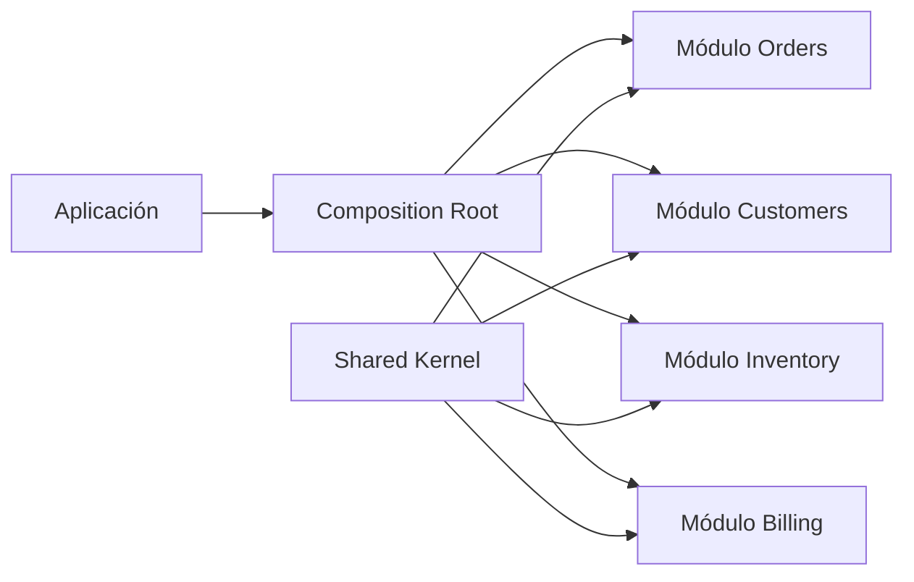
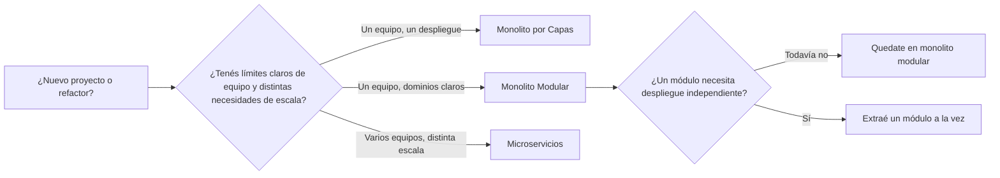

## Visión General

Una vez me sumé a un equipo que estaba paralizado por su propio código. Pedidos, inventario, facturación y lógica de
clientes estaban enredados en los mismos controladores, y un cambio en una funcionalidad tenía efectos secundarios tres
pantallas más allá. La gerencia quería microservicios porque era la solución obvia que habían leído en los blogs. No
teníamos el headcount, el equipo de SRE ni el presupuesto de red para correr un cluster distribuido. Así que dimos un
paso atrás y nos hicimos una pregunta más simple: ¿podemos tener límites limpios dentro de una única unidad desplegable?
Ese es exactamente el punto fuerte del monolito modular.

Un monolito modular es un único repositorio, una única base de datos y un único despliegue, pero el código interno se
divide en módulos que son dueños de su propia lógica de dominio, sus datos y sus contratos públicos. Mantenés la
simplicidad operativa de un monolito mientras construís la separación que vas a necesitar si algún día dividís
servicios. Es el camino del medio entre la gran bola de lodo por capas y la locura operativa de los microservicios.

Si querés una referencia de patrón más compacta, la página del
[patrón Modular Monolith](/patterns/modular-monolith-pattern/) es una buena compañía. En esta guía vamos a ver la
estructura de módulos, las APIs públicas, el shared kernel, las reglas de dependencias, la comunicación entre módulos,
las capas anticorrupción, el testing de arquitectura y un camino concreto de migración.

## Cuándo Usar y Cuándo No Usar

El monolito modular me sirve cuando se dan algunas condiciones. Funciona bien cuando mi equipo quiere módulos
independientes pero no quiere la latencia, los reintentos ni la carga operativa de un sistema distribuido. Encaja cuando
algunas partes del sistema podrían necesitar escalar o desplegarse por separado más adelante, pero todavía no. También
lo uso cuando quiero una única base de datos y un único repositorio, pero también me asusta la gran bola de lodo que
puede llegar a ser un monolito clásico. Y es una elección sensata cuando todavía no estoy seguro de que los
microservicios justifiquen su costo en infraestructura, observabilidad y coordinación de equipos.

### Cuándo NO usar

Esta no es una cura universal. Si sos un desarrollador solo haciendo un proyecto de fin de semana, la estructura extra
puede frenarte más de lo que ayuda. Si el sistema tiene una vida útil corta, la pista de migración podría no importar
nunca. Cuando tu dominio ya está limpiamente dividido por equipo, y cada equipo realmente necesita despliegues
independientes con distinta escala, entonces los microservicios o incluso las funciones pueden ser la mejor opción. Y si
tu organización no tiene la disciplina de revisar los imports cruzados en cada pull request, los límites se erosionarán
en cuestión de semanas.

## Comparativa con Otras Arquitecturas

Elegir la forma correcta del sistema tiene menos que ver con etiquetas y más que ver con las fuerzas reales que estás
enfrentando. La tabla de abajo pone un monolito modular al lado de un monolito por capas, microservicios y una
arquitectura orientada a servicios más tradicional.

| Característica         | Monolito por Capas                            | Monolito Modular                                                      | Microservicios                                              | SOA                                                        |
| ---------------------- | --------------------------------------------- | --------------------------------------------------------------------- | ----------------------------------------------------------- | ---------------------------------------------------------- |
| Unidad de despliegue   | Un desplegable                                | Un desplegable                                                        | Muchos desplegables                                         | Muchos desplegables, a menudo vía un ESB                   |
| Acoplamiento de código | Capas horizontales compartidas en toda la app | Módulos verticales de negocio con capas internas                      | Bajo acoplamiento, pero el acoplamiento de red lo reemplaza | Bajo acoplamiento, middleware de integración pesado        |
| Propiedad de datos     | Una base compartida, esquemas compartidos     | Una base, esquemas por módulo                                         | Cada servicio es dueño de su base                           | Modelos de datos empresariales compartidos                 |
| Escalabilidad          | Escalar todo junto                            | Escalar todo junto, pero planificar extracción futura                 | Escalar cada servicio por separado                          | Escalar servicios, pero el ESB puede ser cuello de botella |
| Autonomía del equipo   | Baja; los equipos pisan el mismo código       | Media; los módulos pueden tener dueño, el despliegue sigue compartido | Alta; los equipos despliegan de forma independiente         | Media; gobernada por contratos compartidos                 |
| Sobrecarga operativa   | Baja                                          | Baja a media                                                          | Alta                                                        | Alta                                                       |
| Cadencia de cambio     | Un solo tren de release                       | Un solo tren de release, pero las APIs de módulo pueden versionarse   | Release independiente por servicio                          | Más lenta, ciclos pesados de contratos                     |
| Mejor para             | Equipos chicos con dominios simples           | Productos medianos con subdominios claros                             | Productos grandes con límites fuertes de equipo y escala    | Integración empresarial con sistemas legacy                |

La [guía de arquitectura por capas](/guides/layered-architecture-guide/) organiza el código por preocupaciones técnicas.
Eso es distinto del monolito modular, que organiza el código por dominio de negocio. La
[guía de arquitectura de microservicios](/guides/microservices-architecture-guide/) cubre el paso siguiente, donde la
red se convierte en el límite. Yo suelo tratar el monolito modular como un área de preparación deliberada: te deja
probar los límites antes de pagar el precio de la distribución.

## Estructura del Módulo

La forma física del monolito modular importa más de lo que muchos creen. He visto equipos meter toda la lógica de
dominio en una carpeta `services` y después preguntarse por qué los límites no ayudaron. Los módulos reales no son
namespaces; son unidades de negocio con su propio dominio, aplicación, infraestructura y API pública.

```text
src/
├── modules/
│   ├── orders/
│   │   ├── domain/           # Entidades, value objects, eventos de dominio
│   │   │   ├── Order.ts
│   │   │   ├── OrderItem.ts
│   │   │   └── events/
│   │   │       ├── OrderPlaced.ts
│   │   │       └── OrderCancelled.ts
│   │   ├── application/      # Casos de uso, handlers de comandos y consultas
│   │   │   ├── PlaceOrder.ts
│   │   │   ├── CancelOrder.ts
│   │   │   └── GetOrderDetails.ts
│   │   ├── infrastructure/   # Base de datos, servicios externos
│   │   │   ├── OrderRepository.ts
│   │   │   └── OrderSchema.ts
│   │   ├── api/              # API pública del módulo
│   │   │   ├── OrdersModule.ts
│   │   │   └── types.ts
│   │   └── presentation/     # Controladores, DTOs
│   │       ├── OrdersController.ts
│   │       └── dto/
│   ├── customers/
│   ├── inventory/
│   └── billing/
├── shared/                   # Shared kernel usado por todos los módulos
│   ├── events/
│   │   ├── EventBus.ts
│   │   └── DomainEvent.ts
│   ├── types/
│   │   ├── Money.ts
│   │   └── Address.ts
│   └── utils/
└── kernel/                   # Composition root
    ├── AppModule.ts
    └── bootstrap.ts
```

El diagrama de abajo muestra la relación de alto nivel entre los módulos y el shared kernel:



Cada módulo es una rebanada vertical: `domain` guarda los invariantes y eventos, `application` los casos de uso,
`infrastructure` la persistencia y terceros, `api` es la única puerta que otros módulos pueden usar, y `presentation` se
encarga de HTTP o CLI. La carpeta `shared` es el shared kernel, mientras que `kernel` es el composition root donde todo
se conecta.

## API Pública del Módulo

La API pública de un módulo es un contrato, y la mantengo lo más chica posible. Si expongo cada repositorio y cada
servicio, no creé un límite; solo creé un path de import más largo. La API debería exponer comandos, consultas y eventos
que tengan sentido desde afuera, y esconder los detalles desordenados de la implementación.

```typescript
// modules/orders/api/OrdersModule.ts
// Interfaz pública del módulo Orders
export interface OrdersModule {
  placeOrder(command: PlaceOrderCommand): Promise<OrderId>;
  cancelOrder(command: CancelOrderCommand): Promise<void>;
  getOrderDetails(query: GetOrderDetailsQuery): Promise<OrderDetails>;
  getOrderHistory(query: GetOrderHistoryQuery): Promise<OrderSummary[]>;
}

export interface PlaceOrderCommand {
  customerId: string;
  items: { productId: string; quantity: number; price: number }[];
  shippingAddress: Address;
}

export interface OrderDetails {
  id: string;
  status: "pending" | "processing" | "shipped" | "completed" | "cancelled";
  items: { productId: string; quantity: number; price: number }[];
  totalAmount: number;
  createdAt: Date;
}

// La implementación es interna; los otros módulos solo ven la interfaz
class OrdersModuleImpl implements OrdersModule {
  constructor(
    private readonly orderRepo: OrderRepository,
    private readonly eventBus: EventBus,
    private readonly inventoryModule: InventoryModule,
  ) {}

  async placeOrder(command: PlaceOrderCommand): Promise<OrderId> {
    // Verificá disponibilidad en inventario
    for (const item of command.items) {
      const available = await this.inventoryModule.checkAvailability({
        productId: item.productId,
        quantity: item.quantity,
      });
      if (!available) {
        throw new Error(`Product ${item.productId} not available`);
      }
    }

    // Creá la orden
    const order = Order.create(command.customerId, command.items, command.shippingAddress);
    await this.orderRepo.save(order);

    // Publicá el evento de dominio
    await this.eventBus.publish(new OrderPlaced(order.id, order.customerId, order.totalAmount));

    return order.id;
  }

  async cancelOrder(command: CancelOrderCommand): Promise<void> {
    const order = await this.orderRepo.findById(command.orderId);
    if (!order) throw new Error("Order not found");

    order.cancel(command.reason);
    await this.orderRepo.save(order);

    await this.eventBus.publish(new OrderCancelled(order.id, order.customerId, command.reason));
  }

  async getOrderDetails(query: GetOrderDetailsQuery): Promise<OrderDetails> {
    const order = await this.orderRepo.findById(query.orderId);
    if (!order) throw new Error("Order not found");

    return {
      id: order.id.value,
      status: order.status,
      items: order.items.map((i) => ({
        productId: i.productId,
        quantity: i.quantity,
        price: i.price,
      })),
      totalAmount: order.totalAmount.value,
      createdAt: order.createdAt,
    };
  }

  async getOrderHistory(query: GetOrderHistoryQuery): Promise<OrderSummary[]> {
    const orders = await this.orderRepo.findByCustomerId(query.customerId);
    return orders.map((o) => ({
      id: o.id.value,
      status: o.status,
      totalAmount: o.totalAmount.value,
      createdAt: o.createdAt,
    }));
  }
}
```

La interfaz `OrdersModule` es lo único que los otros módulos pueden importar. La implementación concreta
`OrdersModuleImpl` vive en la capa de aplicación o infraestructura y se conecta en el composition root. Si alguna vez
extraés el módulo Orders, creás una implementación `OrdersModuleHttp` y la cambiás en el mismo lugar.

## Shared Kernel

El shared kernel es el conjunto más chico posible de conceptos que cada módulo necesita. Lo trato como la cocina
compartida en una casa compartida: es útil, pero si dejás platos sucios, todos sufren. Guarda value objects como `Money`
y `Address`, los contratos del bus de eventos y tipos de error comunes. Si empezás a agregar reglas de negocio al shared
kernel, frenate. La lógica de negocio pertenece a un módulo.

```typescript
// shared/events/EventBus.ts
// Bus de eventos en proceso para comunicación entre módulos
export interface DomainEvent {
  readonly eventId: string;
  readonly occurredAt: Date;
  readonly aggregateId: string;
}

export interface EventHandler<T extends DomainEvent> {
  handle(event: T): Promise<void>;
}

export class EventBus {
  private handlers = new Map<string, EventHandler<any>[]>();

  register<T extends DomainEvent>(eventType: string, handler: EventHandler<T>): void {
    const existing = this.handlers.get(eventType) || [];
    this.handlers.set(eventType, [...existing, handler]);
  }

  async publish(event: DomainEvent): Promise<void> {
    const handlers = this.handlers.get(event.constructor.name) || [];
    for (const handler of handlers) {
      try {
        await handler.handle(event);
      } catch (error) {
        console.error(`Handler failed for ${event.constructor.name}:`, error);
        // No relances el error; un handler no debería bloquear a los otros
      }
    }
  }
}

// shared/types/Money.ts
// Value object compartido
export class Money {
  private constructor(
    public readonly amount: number,
    public readonly currency: string,
  ) {
    if (amount < 0) throw new Error("Money cannot be negative");
  }

  static create(amount: number, currency = "USD"): Money {
    return new Money(Math.round(amount * 100) / 100, currency);
  }

  add(other: Money): Money {
    if (this.currency !== other.currency) {
      throw new Error("Cannot add different currencies");
    }
    return Money.create(this.amount + other.amount, this.currency);
  }

  multiply(quantity: number): Money {
    return Money.create(this.amount * quantity, this.currency);
  }
}
```

Fijate que el contrato de `EventBus` no dice nada sobre HTTP, RabbitMQ ni Kafka. Es una abstracción en proceso. Cuando
extraés un módulo, cambiás la implementación sin tocar el código del módulo. Ese es el tipo de costura que hace la
extracción barata.

## Reglas de Dependencias

Un árbol de carpetas solo no alcanza. Sin reglas de dependencias automatizadas, un compañero va a terminar importando
`../billing/infrastructure/BillingRepository` porque es más rápido que agregar un comando nuevo. Necesitás una compuerta
que corra en CI y falle el build.

```typescript
// .dependency-cruiser.js
module.exports = {
  forbidden: [
    {
      name: "no-cross-module-internal-access",
      comment: "Los módulos no deben acceder a los internos de otros módulos",
      severity: "error",
      from: { path: "src/modules/([^/]+)/" },
      to: { path: "src/modules/(?!$1)([^/]+)/((?!api/).*)" },
    },
    {
      name: "no-domain-to-infrastructure",
      comment: "El dominio no debe depender de la infraestructura",
      severity: "error",
      from: { path: "src/modules/([^/]+)/domain/" },
      to: { path: "src/modules/$1/infrastructure/" },
    },
    {
      name: "no-domain-to-presentation",
      comment: "El dominio no debe depender de la presentación",
      severity: "error",
      from: { path: "src/modules/([^/]+)/domain/" },
      to: { path: "src/modules/$1/presentation/" },
    },
    {
      name: "modules-must-not-share-database-tables",
      comment: "Cada módulo posee sus tablas",
      severity: "error",
      from: { path: "src/modules/([^/]+)/infrastructure/" },
      to: { path: "src/modules/(?!$1)([^/]+)/infrastructure/.*Schema" },
    },
  ],
};
```

La primera regla es la más importante: un módulo solo puede ver la carpeta `api` de otro módulo. La segunda y tercera
protegen la arquitectura interna por capas. La cuarta se asegura de que un módulo no meta una clave foránea en el
esquema de otro. Yo corro esto con `npx dependency-cruiser --validate .dependency-cruiser.js src` en CI antes de cada
merge.

## Testing de Arquitectura

Las reglas de dependencias solo sirven si se hacen cumplir. No confío en las revisiones de arquitectura para atrapar
cada mal import; confío en CI. Para TypeScript, mi primera línea de defensa es dependency-cruiser. Para Java, uso
ArchUnit. Para un monorepo de Nx, la regla `@nx/enforce-module-boundaries` hace el mismo trabajo. Y cuando ninguna
encaja, escribo un pequeño script con ts-morph.

### ArchUnit para Java

Los tests de ArchUnit corren como parte de la suite normal de JUnit, así que fallan el build igual que un test unitario.
Las dos primeras reglas que escribo son un chequeo de ciclos y un guardián de dominio a infraestructura.

```java
// src/test/java/com/shop/ArchitectureTest.java
import com.tngtech.archunit.junit.AnalyzeClasses;
import com.tngtech.archunit.junit.ArchTest;
import com.tngtech.archunit.lang.ArchRule;
import com.tngtech.archunit.library.dependencies.SlicesRuleDefinition;

import static com.tngtech.archunit.lang.syntax.ArchRuleDefinition.noClasses;

@AnalyzeClasses(packages = "com.shop")
public class ArchitectureTest {

  @ArchTest
  static final ArchRule modules_should_be_free_of_cycles =
      SlicesRuleDefinition.slices()
          .matching("..shop.modules.(*)..")
          .should()
          .beFreeOfCycles();

  @ArchTest
  static final ArchRule domain_should_not_depend_on_infrastructure =
      noClasses()
          .that()
          .resideInAPackage("..modules..domain..")
          .should()
          .dependOnClassesThat()
          .resideInAPackage("..modules..infrastructure..")
          .because("la lógica de dominio no debe filtrarse en detalles de persistencia");
}
```

Estas dos reglas atrapan dos olores distintos. Los ciclos entre módulos hacen imposible la extracción, porque el primer
módulo que sacás todavía necesita al segundo en el mismo proceso. Que el dominio dependa de infraestructura hace que el
dominio sea difícil de testear y fácil de acoplar a detalles del framework.

### Límites de módulos con Nx

Si usás Nx, podés expresar los mismos límites con tags. Cada proyecto recibe un tag `scope:<módulo>`, y una regla de
ESLint controla quién puede depender de quién. El shared kernel recibe su propio tag; los módulos solo dependen de él
cuando realmente necesitan algo.

```json
// .eslintrc.json
{
  "overrides": [
    {
      "files": ["*.ts", "*.tsx"],
      "rules": {
        "@nx/enforce-module-boundaries": [
          "error",
          {
            "allow": [],
            "depConstraints": [
              {
                "sourceTag": "scope:orders",
                "onlyDependOnLibsWithTags": ["scope:orders", "scope:shared"]
              },
              {
                "sourceTag": "scope:customers",
                "onlyDependOnLibsWithTags": ["scope:customers", "scope:shared"]
              },
              {
                "sourceTag": "scope:inventory",
                "onlyDependOnLibsWithTags": ["scope:inventory", "scope:orders", "scope:shared"]
              },
              {
                "sourceTag": "scope:shared",
                "onlyDependOnLibsWithTags": ["scope:shared"]
              }
            ]
          }
        ]
      }
    }
  ]
}
```

La regla es sencilla: un módulo puede hablar consigo mismo o con el shared kernel. Si necesita otro módulo, ese otro
módulo debe exponer un proyecto público con su propio tag, y la regla debe permitir explícitamente la dependencia.
Prefiero esto antes que un script casero porque vive en el paso de lint normal.

### Un script custom con ts-morph

Cuando ni dependency-cruiser ni ArchUnit encajan en la forma exacta del proyecto, escribo un pequeño script con ts-morph
que recorre cada import dentro de `src/modules`, averigua a qué módulo pertenece y falla el build si el destino no está
en la carpeta pública `api`.

```typescript
// scripts/check-module-boundaries.ts
import { Project } from "ts-morph";

const project = new Project({ tsConfigFilePath: "tsconfig.json" });

function moduleName(filePath: string): string | null {
  const match = filePath.match(/src\/modules\/([^/]+)\//);
  return match ? match[1] : null;
}

for (const file of project.getSourceFiles("src/modules/**/*.ts")) {
  const fromModule = moduleName(file.getFilePath());
  if (!fromModule) continue;

  for (const imp of file.getImportDeclarations()) {
    const resolved = imp.getModuleSpecifierSourceFile();
    if (!resolved) continue;

    const importPath = resolved.getFilePath();
    const toModule = moduleName(importPath);

    if (toModule && toModule !== fromModule) {
      const isPublicApi = importPath.includes(`/modules/${toModule}/api/`);
      if (!isPublicApi) {
        console.error(`Import prohibido: ${file.getFilePath()} -> ${importPath}`);
        process.exit(1);
      }
    }
  }
}

console.log("Los límites de módulos están limpios");
```

El script no es tan rápido como dependency-cruiser, pero es explícito y fácil de adaptar. Lo corro con
`npx tsx scripts/check-module-boundaries.ts` antes del build.

## Comunicación Entre Módulos

Los módulos necesitan hablar, pero la forma en que hablan decide cuán acoplados están. Suelo elegir uno de dos modos:
una llamada síncrona a través de la API pública cuando el llamador necesita una respuesta inmediata, o un evento de
dominio asíncrono cuando el resultado puede esperar.

### Vía API pública (síncrona)

```typescript
// modules/billing/application/GenerateInvoice.ts
class GenerateInvoice {
  constructor(
    private readonly ordersModule: OrdersModule,
    private readonly invoiceRepo: InvoiceRepository,
  ) {}

  async execute(orderId: string): Promise<InvoiceId> {
    const order = await this.ordersModule.getOrderDetails({ orderId });
    if (order.status !== "completed") {
      throw new Error("Cannot invoice non-completed orders");
    }

    const invoice = Invoice.create(order.id, order.totalAmount, order.items);
    await this.invoiceRepo.save(invoice);
    return invoice.id;
  }
}
```

Esta es una llamada directa y síncrona. Billing le pide detalles a Orders y espera. Está bien cuando el flujo no puede
continuar sin la respuesta, pero significa que Billing queda temporalmente acoplado a la API pública de Orders en tiempo
de ejecución.

### Vía eventos de dominio (asíncrona)

```typescript
// modules/inventory/application/OnOrderPlaced.ts
// Reaccioná a eventos del módulo Orders
class OnOrderPlaced implements EventHandler<OrderPlaced> {
  constructor(private readonly inventoryRepo: InventoryRepository) {}

  async handle(event: OrderPlaced): Promise<void> {
    // Reservá inventario cuando se crea una orden
    for (const item of event.items) {
      await this.inventoryRepo.reserve(item.productId, item.quantity, event.aggregateId);
    }
  }
}

// modules/billing/application/OnOrderCompleted.ts
class OnOrderCompleted implements EventHandler<OrderCompleted> {
  constructor(private readonly invoiceGenerator: GenerateInvoice) {}

  async handle(event: OrderCompleted): Promise<void> {
    await this.invoiceGenerator.execute(event.aggregateId);
  }
}

// Conectá todo en el composition root
eventBus.register("OrderPlaced", new OnOrderPlaced(inventoryRepo));
eventBus.register("OrderCompleted", new OnOrderCompleted(invoiceGenerator));
```

Los eventos desacoplan al publicador del suscriptor. Orders no sabe que Inventory existe. Solo publica `OrderPlaced`. Es
el patrón que uso para efectos secundarios como reservas de inventario, notificaciones por mail y actualizaciones de
índices de búsqueda.

## Base de Datos por Módulo

Mantengo una única base de datos en un monolito modular, pero no comparto tablas entre módulos. Cada módulo es dueño de
su propio esquema y de sus migraciones. La regla que sigo es contundente: el código de un módulo nunca escribe en las
tablas de otro. Cuando necesita datos de otro módulo, llama a la API pública.

```typescript
// modules/orders/infrastructure/OrderSchema.ts
// Cada módulo tiene su propio esquema/tablas; sin acceso cruzado
const OrderSchema = {
  tableName: "orders",
  columns: {
    id: "uuid PRIMARY KEY",
    customer_id: "uuid NOT NULL",
    status: "varchar(20) NOT NULL",
    total_amount: "decimal(10,2) NOT NULL",
    created_at: "timestamp NOT NULL",
    updated_at: "timestamp",
  },
};

// modules/customers/infrastructure/CustomerSchema.ts
const CustomerSchema = {
  tableName: "customers",
  columns: {
    id: "uuid PRIMARY KEY",
    email: "varchar(255) UNIQUE NOT NULL",
    name: "varchar(255) NOT NULL",
    created_at: "timestamp NOT NULL",
  },
};

// MAL: el módulo Orders consulta directamente la tabla customers
// class OrderRepository {
//   async findWithCustomer(orderId: string) {
//     return db.query('SELECT o.*, c.name FROM orders o JOIN customers c ON o.customer_id = c.id');
//   }
// }

// BIEN: usá la API pública del módulo Customers
class OrderService {
  constructor(private customersModule: CustomersModule) {}

  async getOrderWithCustomer(orderId: string) {
    const order = await this.ordersModule.getOrderDetails({ orderId });
    const customer = await this.customersModule.getCustomer({ id: order.customerId });
    return { order, customer };
  }
}
```

La base única mantiene la operación simple: un pool de conexiones, un backup, un administrador de transacciones. El
esquema por módulo hace que la extracción sea más fácil después, porque los datos ya están aislados. Si no hacés esto,
el primer módulo que extraigas se va a llevar la mitad del esquema con él.

## Capas Anticorrupción

Tarde o temprano, todo sistema tiene que hablar con algo más viejo, más desprolijo o simplemente fuera de su propio
lenguaje. No dejo que ese desorden externo se filtre en mi modelo de dominio. En cambio, agrego una capa anticorrupción:
un pequeño adaptador que traduce el modelo externo al mío y viceversa.

```typescript
// modules/payments/infrastructure/LegacyPaymentAdapter.ts
// Adaptador entre el proveedor de pagos legacy y el dominio Payments
export interface PaymentProvider {
  charge(amount: Money, token: string): Promise<string>;
}

export class LegacyPaymentAdapter implements PaymentProvider {
  constructor(private readonly client: LegacyPaymentClient) {}

  async charge(amount: Money, token: string): Promise<string> {
    const legacyRequest = {
      amount_cents: amount.amount * 100,
      currency_code: amount.currency,
      payment_token: token,
    };

    const raw = await this.client.processPayment(legacyRequest);

    if (raw.status !== "approved") {
      throw new PaymentRejectedError(raw.error_code);
    }

    return raw.transaction_id as string;
  }
}
```

El resto del módulo Payments usa `PaymentProvider`, no `LegacyPaymentClient`. Si el proveedor legacy cambia la forma del
request, cambio el adaptador. El dominio se mantiene limpio. Es el tipo de costura que hace que un monolito modular
sobreviva a integraciones reales.

## Trade-offs en Profundidad

Cada elección tiene su lado oscuro, y el monolito modular no es la excepción. El primer trade-off es la base de datos
compartida. Es la forma más simple de mantener todo andando, pero también es un punto único de falla. Cuando la base de
datos se cae, todos los módulos se caen. Podés mitigarlo con réplicas de lectura y buenos backups, pero no lo podés
eliminar hasta que dividás los datos.

El segundo trade-off es el shared kernel. Es una forma pequeña y controlada de acoplamiento, pero acoplamiento es
acoplamiento. Si le metés demasiado, creás un monolito oculto dentro de tu monolito. Lo defiendo con fuerza. Prefiero
duplicar un DTO chico a compartir uno que cambia cada mes.

El tercer trade-off es el mapa de equipos. Un monolito modular funciona mejor cuando los equipos están alineados con los
módulos. Si tres equipos siguen editando el dominio del mismo módulo, el límite es organizativo, no técnico. Team
Topologies llama a esto equipos alineados al flujo. En esta guía me enfoco en el código, pero te lo digo de una: el
código se rompe si el mapa de equipos no coincide.

## Árbol de Decisión

El diagrama de abajo muestra el proceso de decisión que uso con los equipos cuando elegimos una arquitectura inicial:



La mayoría de los equipos empieza entre Monolito por Capas y Monolito Modular. El momento correcto de moverse hacia
Microservicios aparece cuando surge un límite real: un módulo necesita una cadencia de despliegue distinta, un perfil de
escala distinto o un equipo dueño distinto. No hagas el salto solo porque un blog post lo hizo sonar inevitable.

## Hoja de Ruta de Migración

Extraer un módulo no es una reescritura Big Bang. El camino más seguro que conozco es una secuencia de pasos chicos y
reversibles. Cada paso deja al sistema en un estado mejor, incluso si el siguiente nunca llega.

1. Baseline y tests de arquitectura. Antes de mover nada, mapeá el grafo de dependencias. Necesitás saber qué módulos
   llaman a cuáles, qué tablas comparten y dónde ya existen límites de API pública. Después agregá dependency-cruiser,
   ArchUnit o una regla de límites de Nx, y hacé fallar el build apenas alguien cruce un límite.

2. Identificá la costura. Elegí el módulo con menos dependencias cruzadas y el límite de negocio más fuerte. Inventario,
   facturación y pagos son candidatos comunes para empezar. Dibujá el grafo de dependencias actual y listá cada llamada
   a la API pública.

3. Mové la propiedad de datos y esquema. Asegurate de que el módulo objetivo sea dueño de sus tablas, sus migraciones y
   sus índices. No permito claves foráneas que crucen hacia el esquema de otro módulo. Si encuentro una, la reemplazo
   con una búsqueda a través de la API pública o con un evento, dependiendo del flujo.

4. Introducí el adaptador remoto. Construí una nueva implementación de la API pública del módulo que hable por HTTP o
   gRPC, mientras mantenés la versión en proceso funcionando. Después usá un feature flag o el composition root para
   cambiar el tráfico entre las dos.

5. Mové los eventos en proceso a un broker. Una vez que el módulo corre en su propio proceso, el `EventBus` en proceso
   ya no puede alcanzarlo. Empezá a publicar y suscribirte a través de RabbitMQ, Kafka u otro broker, y mantené los
   nombres y esquemas de los eventos iguales para que los suscriptores no necesiten reescribirse.

6. Desmantelá y observá. Sacá el código en proceso solo después de que el módulo remoto haya estado funcionando en
   producción el tiempo suficiente como para confiar en él. Observá latencia, tasas de error y deriva de esquema. Si el
   nuevo servicio falla, podés volver al adaptador en proceso porque la API pública nunca cambió.

```typescript
// Antes: llamada en proceso
const order = await ordersModule.getOrderDetails({ orderId });

// Después: llamada HTTP al servicio extraído
const order = await ordersClient.getOrderDetails(orderId);

// Misma interfaz, distinta implementación
interface OrdersModule {
  getOrderDetails(query: GetOrderDetailsQuery): Promise<OrderDetails>;
}

class OrdersModuleHttp implements OrdersModule {
  constructor(private readonly httpClient: HttpClient) {}

  async getOrderDetails(query: GetOrderDetailsQuery): Promise<OrderDetails> {
    const response = await this.httpClient.get(`/api/orders/${query.orderId}`);
    return response.data;
  }
}

// Intercambialo en el composition root
const ordersModule = isMicroservice
  ? new OrdersModuleHttp(httpClient)
  : new OrdersModuleImpl(orderRepo, eventBus, inventoryModule);
```

```typescript
// Antes: bus de eventos en proceso
eventBus.publish(new OrderPlaced(orderId, customerId, total));

// Después: publicá en RabbitMQ/Kafka
messageBroker.publish("order.events", new OrderPlaced(orderId, customerId, total));

// Suscriptor en el servicio extraído
messageBroker.subscribe("order.events", async (event) => {
  if (event.type === "OrderPlaced") {
    await inventoryService.reserveItems(event.items);
  }
});
```

He usado el patrón Strangler Fig más de una vez para mantener el camino viejo vivo mientras el nuevo servicio toma el
control. La idea es simple: mandá un pequeño porcentaje de tráfico al nuevo servicio, verificá, y aumentá. Es la forma
de menor riesgo de extraer un módulo de un sistema en producción.

## Lo que Funciona

### Empezá por el dominio, no por la estructura de carpetas

He visto equipos crear `modules/orders` y `modules/customers` y después perder semanas en discusiones circulares sobre
quién es dueño de cada subcarpeta. El mejor punto de partida es el modelo de dominio. Dibujá los bounded contexts
primero, y dejá que las carpetas sigan. Si dos conceptos comparten el mismo lenguaje y el mismo invariante,
probablemente pertenezcan al mismo módulo. Si no comparten el mismo lenguaje, separalos.

### Mantené el shared kernel chico

Quiero que el shared kernel duela un poco de extender. Si agregar un tipo nuevo es demasiado fácil, va a crecer. Reviso
cada adición con la pregunta: ¿cada módulo realmente necesita esto para hacer su trabajo? Si la respuesta honesta es no,
muevo el tipo de vuelta al módulo que realmente lo posee.

### Hacé como si la extracción ya estuviera pasando

Incluso si estás a años de los microservicios, escribí tus APIs públicas como si el otro módulo ya fuera un servicio
remoto. Eso significa no cadenas de llamadas que crucen cinco módulos, no tablas compartidas, y no suposiciones sobre el
estado en memoria. Ese hábito solo hace que la extracción sea casi gratis después.

### Probá la arquitectura en CI, no en una revisión de arquitectura

Las revisiones de arquitectura atrapan problemas demasiado tarde. Quiero que el build falle antes de que un mal import
llegue a un pull request. Corré dependency-cruiser, ArchUnit o tu regla de Nx en cada commit. El costo de un build roto
es mucho menor que el costo de una extracción enredada.

### Versioná las APIs públicas desde antes del primer consumidor

Se siente tonto versionar una API en proceso, pero no lo es. Una API versionada te obliga a pensar los cambios roturos y
a comunicarlos. Cuando el módulo se convierte en un servicio, el número de versión ya es parte del trato.

## Lo que Conviene Evitar

### Tratar al módulo como un namespace

Un módulo es más que una carpeta. Si cada archivo dentro de él puede llamar a cualquier otro archivo de cualquier otro
módulo, acabás de dibujar cajas alrededor de una bola de lodo. La caja misma no importa; las flechas son las que te
traicionan.

### Compartir tablas entre módulos

Una tabla compartida es la forma más rápida de crear un acoplamiento oculto. Un cambio de esquema en un módulo se
convierte en un incidente de producción en otro. Si necesitás datos de otro módulo, llamá a la API o escuchá un evento.
No hagas joins.

### Llamar todo de forma síncrona

Las llamadas síncronas son el camino fácil de escribir y el camino difícil de escalar. Cuando llamás a otro módulo y
esperás, creás una dependencia en tiempo de ejecución. Usá eventos para efectos secundarios, notificaciones o cualquier
trabajo que no necesite una respuesta inmediata.

### Dejar crecer el shared kernel

El shared kernel empieza como una buena idea y termina como un monolito en miniatura. Cada vez que agregás un tipo
compartido nuevo, preguntate quién paga el impuesto del acoplamiento. Si la respuesta es todos, pensalo dos veces.

### Extraer demasiado temprano

El monolito modular no es una plataforma de lanzamiento que tenés que encender el día uno. Espero hasta que un módulo
tenga una necesidad de escala distinta, una cadencia de despliegue distinta o un equipo dueño distinto. La distribución
es una factura que sigue llegando. Solo la pago cuando el negocio no me deja una buena alternativa.

## Preguntas Frecuentes

### ¿Qué diferencia hay entre un monolito modular y un monolito por capas?

Un monolito por capas organiza el código por rol técnico: controladores, servicios, repositorios. Un monolito modular
organiza el código por dominio de negocio: pedidos, clientes, inventario. Ambos se despliegan como una unidad, pero la
versión modular tiene límites de dominio claros que hacen mucho más fácil una futura extracción.

### ¿Cómo decido cuándo extraer un módulo a un microservicio?

Busco tres señales: que el módulo necesite escalar de forma distinta, que necesite una cadencia de release distinta, o
que un equipo distinto necesite ser su dueño. Si ninguna de esas es cierta, lo dejo en el monolito y mantengo el límite
limpio.

### ¿Por qué mantenemos un shared kernel en lugar de copiar los tipos comunes?

Un shared kernel diminuto es más barato que duplicar `Money`, `Address` o los contratos de eventos en todos los módulos.
La palabra clave es diminuto. Si un tipo cambia mucho o pertenece a un solo módulo, no debería estar compartido.

### ¿Puede un monolito modular usar la misma base de datos para todos los módulos?

Sí. Una base única es lo normal en un monolito modular. La regla es que cada módulo sea dueño de su propio esquema y
tablas. Mantenés la simplicidad operativa de una base única mientras mantenés los datos lo suficientemente aislados para
una futura extracción.

### ¿Cuándo debería evitar un monolito modular?

Evitalo para proyectos muy chicos o de vida corta, y evitalo cuando ya necesitás despliegues independientes reales y
aislamiento de red. Si tu equipo no puede hacer cumplir los límites de imports en el code review o en CI, la
arquitectura se pudrirá sin importar la forma que elijas.

## Referencias

Suelo mandar equipos al [MonolithFirst de Martin Fowler](https://martinfowler.com/bliki/MonolithFirst.html) cuando me
preguntan por dónde empezar. La
[introducción de la DDD Community](https://dddcommunity.org/learning-resources/what-is-domain-driven-design/) es mi
referencia de cabecera para bounded contexts y shared kernels. Cuando necesito hacer cumplir reglas de arquitectura,
reviso primero la [guía de ArchUnit](https://www.archunit.org/userguide/html/000_Index.html) y la
[documentación de Dependency Cruiser](https://dependency-cruiser.js.org/). Para el lado de mensajería en la extracción,
tengo abiertos los docs de [RabbitMQ](https://www.rabbitmq.com/docs), [Kafka](https://kafka.apache.org/documentation/) y
[gRPC](https://grpc.io/docs/). Y cuando tengo que pensar en límites de equipo, vuelvo a
[Team Topologies](https://teamtopologies.com/).
