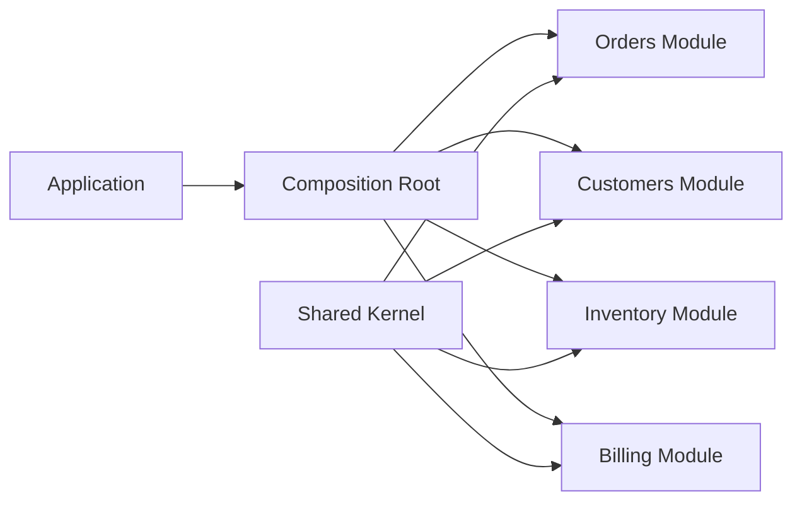
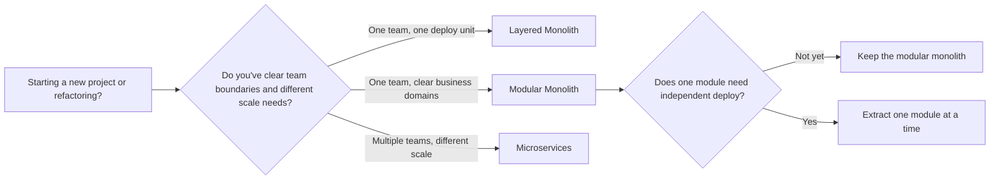

## Overview

I once joined a team that was paralyzed by its own codebase. Orders, inventory, billing, and customer logic were tangled
in the same controllers, and a change in one feature had side effects three screens away. Management wanted
microservices because that was the obvious fix in the blog posts they had read. We didn't have the headcount, the SRE
muscle, or the network budget to run a distributed cluster. So we stepped back and asked a simpler question: can we get
clean boundaries inside a single deployable unit? That's exactly the sweet spot a modular monolith is built for.

A modular monolith is a single codebase, a single database, and a single deployment, but the code inside is split into
modules that own their own domain logic, data, and public contracts. You keep the operational simplicity of a monolith
while you build the separation you will need if you ever split services out. It's the middle path between the layered
ball of mud and the operational thunderdome of microservices.

If you want a tighter pattern reference, the [Modular Monolith pattern](/patterns/modular-monolith-pattern/) page is a
good companion. In this guide, we will look at module structure, public APIs, the shared kernel, dependency rules,
inter-module communication, anti-corruption layers, architecture testing, and a concrete migration path.

## When to Use and When Not to Use

I reach for a modular monolith when a few conditions line up. It works well when my team wants independent modules but
doesn't want the latency, retries, and operational load of a distributed system. It fits when pieces of the system might
need separate scaling or their own deploy cadence later, even if today they don't. I also use it when I want a single
database and a single codebase, but I'm also scared of the big ball of mud that a classic monolith can become. And it's
a sane choice when I'm not yet sure that microservices justify their cost in infrastructure, observability, and team
coordination.

### When NOT to use

This isn't a cure-all; I reach for it when the conditions line up, not for every project. If you're a solo dev hacking a
weekend project, the extra ceremony will probably slow you down. If the system has a short expected life, the migration
runway might never matter. When your domain is already cleanly split by team, and each team truly needs independent
deploys with different scale, then microservices or even functions can be the better call. And if your organization
doesn't have the discipline to review cross-module imports in every pull request, the boundaries will erode in a matter
of weeks.

## Comparison with Other Architectures

Picking the right shape has less to do with labels and more to do with the real forces the system faces. The table below
puts a modular monolith next to a layered monolith, microservices, and a more traditional service-oriented architecture.

| Characteristic       | Layered Monolith                                  | Modular Monolith                                           | Microservices                                        | SOA                                          |
| -------------------- | ------------------------------------------------- | ---------------------------------------------------------- | ---------------------------------------------------- | -------------------------------------------- |
| Deployment unit      | One deployable                                    | One deployable                                             | Many deployables                                     | Many deployables, often via an ESB           |
| Code coupling        | Horizontal layers are shared across the whole app | Vertical business modules with internal layers             | Loose coupling, but network coupling replaces it     | Loose coupling, heavy integration middleware |
| Data ownership       | One shared database, shared schemas               | One database, module-owned schemas                         | Each service owns its own database                   | Shared enterprise data models                |
| Scalability          | Scale the whole unit                              | Scale the whole unit, but future extraction is planned     | Scale each service independently                     | Scale services, but ESB can bottleneck       |
| Team autonomy        | Low; teams step on the same code                  | Medium; modules can be owned by teams, deploy stays shared | High; teams deploy independently                     | Medium; governed by shared contracts         |
| Operational overhead | Low                                               | Low to medium                                              | High                                                 | High                                         |
| Change cadence       | Single release train                              | Single release train, but module APIs can version          | Independent release per service                      | Slower, contract-heavy release cycles        |
| Best for             | Small teams with simple domains                   | Mid-size products with clear subdomains                    | Large products with strong team and scale boundaries | Enterprise integration across legacy systems |

A [layered architecture guide](/guides/layered-architecture-guide/) organizes code by technical concerns. That's
different from a modular monolith, which organizes code by business domain. The
[microservices architecture guide](/guides/microservices-architecture-guide/) covers the next step, where the network
becomes the boundary. I often treat the modular monolith as a deliberate staging area: it lets you prove the boundaries
before you pay the price of distribution.

## Module Structure

I've seen the physical shape of a modular monolith make or break the whole idea. Teams dump all domain logic into a
`services` folder and then wonder why the boundaries never helped. Real modules aren't namespaces; they're business
units with their own domain, application, infrastructure, and public API.

```text
src/
├── modules/
│   ├── orders/
│   │   ├── domain/           # Entities, value objects, domain events
│   │   │   ├── Order.ts
│   │   │   ├── OrderItem.ts
│   │   │   └── events/
│   │   │       ├── OrderPlaced.ts
│   │   │       └── OrderCancelled.ts
│   │   ├── application/      # Use cases, command and query handlers
│   │   │   ├── PlaceOrder.ts
│   │   │   ├── CancelOrder.ts
│   │   │   └── GetOrderDetails.ts
│   │   ├── infrastructure/   # Database, external services
│   │   │   ├── OrderRepository.ts
│   │   │   └── OrderSchema.ts
│   │   ├── api/              # Public API of the module
│   │   │   ├── OrdersModule.ts
│   │   │   └── types.ts
│   │   └── presentation/     # Controllers, DTOs
│   │       ├── OrdersController.ts
│   │       └── dto/
│   ├── customers/
│   ├── inventory/
│   └── billing/
├── shared/                   # Shared kernel used by all modules
│   ├── events/
│   │   ├── EventBus.ts
│   │   └── DomainEvent.ts
│   ├── types/
│   │   ├── Money.ts
│   │   └── Address.ts
│   └── utils/
└── kernel/                   # Composition root
    ├── AppModule.ts
    └── bootstrap.ts
```

The diagram below gives a high-level view of how the modules sit next to the shared kernel:



Each module is a vertical slice: `domain` holds the invariants and events, `application` holds the use cases,
`infrastructure` handles persistence and third parties, `api` is the only door other modules may use, and `presentation`
handles HTTP or CLI concerns. The `shared` folder is the shared kernel, and `kernel` is the composition root where the
pieces get wired together.

## Module Public API

The public API of a module is a contract, and I keep it as small as I can, sometimes painfully so. If I expose every
repository and every service, I haven't created a boundary; I've just created a longer import path. The API should
expose commands, queries, and events that make sense from the outside, and it should hide the messy details of the
implementation.

```typescript
// modules/orders/api/OrdersModule.ts
// Public interface of the Orders module
export interface OrdersModule {
  placeOrder(command: PlaceOrderCommand): Promise<OrderId>;
  cancelOrder(command: CancelOrderCommand): Promise<void>;
  getOrderDetails(query: GetOrderDetailsQuery): Promise<OrderDetails>;
  getOrderHistory(query: GetOrderHistoryQuery): Promise<OrderSummary[]>;
}

export interface PlaceOrderCommand {
  customerId: string;
  items: { productId: string; quantity: number; price: number }[];
  shippingAddress: Address;
}

export interface OrderDetails {
  id: string;
  status: "pending" | "processing" | "shipped" | "completed" | "cancelled";
  items: { productId: string; quantity: number; price: number }[];
  totalAmount: number;
  createdAt: Date;
}

// Implementation is internal; other modules only see the interface
class OrdersModuleImpl implements OrdersModule {
  constructor(
    private readonly orderRepo: OrderRepository,
    private readonly eventBus: EventBus,
    private readonly inventoryModule: InventoryModule,
  ) {}

  async placeOrder(command: PlaceOrderCommand): Promise<OrderId> {
    // Check inventory availability
    for (const item of command.items) {
      const available = await this.inventoryModule.checkAvailability({
        productId: item.productId,
        quantity: item.quantity,
      });
      if (!available) {
        throw new Error(`Product ${item.productId} not available`);
      }
    }

    // Create order
    const order = Order.create(command.customerId, command.items, command.shippingAddress);
    await this.orderRepo.save(order);

    // Publish domain event
    await this.eventBus.publish(new OrderPlaced(order.id, order.customerId, order.totalAmount));

    return order.id;
  }

  async cancelOrder(command: CancelOrderCommand): Promise<void> {
    const order = await this.orderRepo.findById(command.orderId);
    if (!order) throw new Error("Order not found");

    order.cancel(command.reason);
    await this.orderRepo.save(order);

    await this.eventBus.publish(new OrderCancelled(order.id, order.customerId, command.reason));
  }

  async getOrderDetails(query: GetOrderDetailsQuery): Promise<OrderDetails> {
    const order = await this.orderRepo.findById(query.orderId);
    if (!order) throw new Error("Order not found");

    return {
      id: order.id.value,
      status: order.status,
      items: order.items.map((i) => ({
        productId: i.productId,
        quantity: i.quantity,
        price: i.price,
      })),
      totalAmount: order.totalAmount.value,
      createdAt: order.createdAt,
    };
  }

  async getOrderHistory(query: GetOrderHistoryQuery): Promise<OrderSummary[]> {
    const orders = await this.orderRepo.findByCustomerId(query.customerId);
    return orders.map((o) => ({
      id: o.id.value,
      status: o.status,
      totalAmount: o.totalAmount.value,
      createdAt: o.createdAt,
    }));
  }
}
```

The `OrdersModule` interface is the only thing that other modules may import. The concrete `OrdersModuleImpl` lives in
the application or infrastructure layer and is bound in the composition root. If you ever extract the Orders module, you
create an `OrdersModuleHttp` implementation and swap it in the same place.

## Shared Kernel

The shared kernel is the smallest possible set of concepts that every module needs. I treat it like the shared kitchen
in a co-living space: it's useful, but if you leave dirty dishes in it, everyone suffers. It holds value objects like
`Money` and `Address`, the event bus contracts, and common error types. If you start adding business rules to the shared
kernel, push back. Business logic belongs inside a module.

```typescript
// shared/events/EventBus.ts
// In-process event bus for module communication
export interface DomainEvent {
  readonly eventId: string;
  readonly occurredAt: Date;
  readonly aggregateId: string;
}

export interface EventHandler<T extends DomainEvent> {
  handle(event: T): Promise<void>;
}

export class EventBus {
  private handlers = new Map<string, EventHandler<any>[]>();

  register<T extends DomainEvent>(eventType: string, handler: EventHandler<T>): void {
    const existing = this.handlers.get(eventType) || [];
    this.handlers.set(eventType, [...existing, handler]);
  }

  async publish(event: DomainEvent): Promise<void> {
    const handlers = this.handlers.get(event.constructor.name) || [];
    for (const handler of handlers) {
      try {
        await handler.handle(event);
      } catch (error) {
        console.error(`Handler failed for ${event.constructor.name}:`, error);
        // Do not rethrow; one handler failure should not block others
      }
    }
  }
}

// shared/types/Money.ts
// Shared value object
export class Money {
  private constructor(
    public readonly amount: number,
    public readonly currency: string,
  ) {
    if (amount < 0) throw new Error("Money cannot be negative");
  }

  static create(amount: number, currency = "USD"): Money {
    return new Money(Math.round(amount * 100) / 100, currency);
  }

  add(other: Money): Money {
    if (this.currency !== other.currency) {
      throw new Error("Cannot add different currencies");
    }
    return Money.create(this.amount + other.amount, this.currency);
  }

  multiply(quantity: number): Money {
    return Money.create(this.amount * quantity, this.currency);
  }
}
```

Notice that the `EventBus` contract doesn't say anything about HTTP, RabbitMQ, or Kafka. It's an in-process abstraction.
When the time comes to extract a module, you swap the implementation without touching the module's own code. That's the
kind of seam that makes extraction cheap.

## Dependency Rules

A clean folder tree on its own won't stop a teammate from reaching across a boundary; you need a rule that fails the
build. Without that, someone will eventually import `../billing/infrastructure/BillingRepository` because it's faster
than adding a new command.

```typescript
// .dependency-cruiser.js
module.exports = {
  forbidden: [
    {
      name: "no-cross-module-internal-access",
      comment: "Modules must not access other modules internals",
      severity: "error",
      from: { path: "src/modules/([^/]+)/" },
      to: { path: "src/modules/(?!$1)([^/]+)/((?!api/).*)" },
    },
    {
      name: "no-domain-to-infrastructure",
      comment: "Domain must not depend on infrastructure",
      severity: "error",
      from: { path: "src/modules/([^/]+)/domain/" },
      to: { path: "src/modules/$1/infrastructure/" },
    },
    {
      name: "no-domain-to-presentation",
      comment: "Domain must not depend on presentation",
      severity: "error",
      from: { path: "src/modules/([^/]+)/domain/" },
      to: { path: "src/modules/$1/presentation/" },
    },
    {
      name: "modules-must-not-share-database-tables",
      comment: "Each module owns its tables",
      severity: "error",
      from: { path: "src/modules/([^/]+)/infrastructure/" },
      to: { path: "src/modules/(?!$1)([^/]+)/infrastructure/.*Schema" },
    },
  ],
};
```

The first rule matters most: a module can import from another module's `api` folder and nothing else. The second and
third rules protect the internal layered architecture. The fourth rule makes sure that one module doesn't sneak a
foreign key into another module's schema. I run this with `npx dependency-cruiser --validate .dependency-cruiser.js src`
in CI before every merge.

## Architecture Testing

A dependency rule nobody enforces is just a suggestion. I don't trust architecture reviews to catch every bad import; I
trust CI. For TypeScript, I reach for dependency-cruiser first. For Java, I use ArchUnit. For an Nx monorepo, the
`@nx/enforce-module-boundaries` rule does the same job. And when neither fits, I write a small ts-morph script.

### ArchUnit for Java

ArchUnit tests live in the normal JUnit suite, so they fail the build the same way a unit test does. The two rules I
write first are a cycle check and a domain-to-infrastructure guard.

```java
// src/test/java/com/shop/ArchitectureTest.java
import com.tngtech.archunit.junit.AnalyzeClasses;
import com.tngtech.archunit.junit.ArchTest;
import com.tngtech.archunit.lang.ArchRule;
import com.tngtech.archunit.library.dependencies.SlicesRuleDefinition;

import static com.tngtech.archunit.lang.syntax.ArchRuleDefinition.noClasses;

@AnalyzeClasses(packages = "com.shop")
public class ArchitectureTest {

  @ArchTest
  static final ArchRule modules_should_be_free_of_cycles =
      SlicesRuleDefinition.slices()
          .matching("..shop.modules.(*)..")
          .should()
          .beFreeOfCycles();

  @ArchTest
  static final ArchRule domain_should_not_depend_on_infrastructure =
      noClasses()
          .that()
          .resideInAPackage("..modules..domain..")
          .should()
          .dependOnClassesThat()
          .resideInAPackage("..modules..infrastructure..")
          .because("domain logic must not leak into persistence details");
}
```

These two rules catch two different smells. Cycles between modules make extraction impossible, because the first module
you pull out still needs the second one in the same process. Domain logic depending on infrastructure makes the domain
hard to test and easy to couple to framework details.

### Nx module boundaries

If you use Nx, you can express the same boundaries with tags. Each project gets a `scope:<module>` tag, and an ESLint
rule enforces who can depend on whom. The shared kernel gets its own tag; the modules only depend on it when they
actually need something from it.

```json
// .eslintrc.json
{
  "overrides": [
    {
      "files": ["*.ts", "*.tsx"],
      "rules": {
        "@nx/enforce-module-boundaries": [
          "error",
          {
            "allow": [],
            "depConstraints": [
              {
                "sourceTag": "scope:orders",
                "onlyDependOnLibsWithTags": ["scope:orders", "scope:shared"]
              },
              {
                "sourceTag": "scope:customers",
                "onlyDependOnLibsWithTags": ["scope:customers", "scope:shared"]
              },
              {
                "sourceTag": "scope:inventory",
                "onlyDependOnLibsWithTags": ["scope:inventory", "scope:orders", "scope:shared"]
              },
              {
                "sourceTag": "scope:shared",
                "onlyDependOnLibsWithTags": ["scope:shared"]
              }
            ]
          }
        ]
      }
    }
  ]
}
```

The rule is dead simple: a module can talk to its own files and to the shared kernel, and that's mostly it. If it needs
another module, that other module must expose a public project with its own tag, and the rule must explicitly allow the
dependency. I prefer this over a hand-rolled script because it lives in the normal lint step.

### A custom ts-morph script

Sometimes neither dependency-cruiser nor ArchUnit fits the exact shape of the project. When neither dependency-cruiser
nor ArchUnit fits, I write a small ts-morph script that walks every import inside `src/modules`, figures out which
module it belongs to, and fails the build if the target isn't in the public `api` folder.

```typescript
// scripts/check-module-boundaries.ts
import { Project } from "ts-morph";

const project = new Project({ tsConfigFilePath: "tsconfig.json" });

function moduleName(filePath: string): string | null {
  const match = filePath.match(/src\/modules\/([^/]+)\//);
  return match ? match[1] : null;
}

for (const file of project.getSourceFiles("src/modules/**/*.ts")) {
  const fromModule = moduleName(file.getFilePath());
  if (!fromModule) continue;

  for (const imp of file.getImportDeclarations()) {
    const resolved = imp.getModuleSpecifierSourceFile();
    if (!resolved) continue;

    const importPath = resolved.getFilePath();
    const toModule = moduleName(importPath);

    if (toModule && toModule !== fromModule) {
      const isPublicApi = importPath.includes(`/modules/${toModule}/api/`);
      if (!isPublicApi) {
        console.error(`Forbidden import: ${file.getFilePath()} -> ${importPath}`);
        process.exit(1);
      }
    }
  }
}

console.log("Module boundaries are clean");
```

The script isn't as fast as dependency-cruiser, but it's explicit and easy to adapt. I run it with
`npx tsx scripts/check-module-boundaries.ts` before the build.

## Inter-Module Communication

Modules need to talk, but the way they talk decides how coupled they end up. I usually pick one of two modes: a
synchronous call through the public API when the caller needs an answer right away, or a domain event when the result
can wait.

### Via public API (synchronous)

```typescript
// modules/billing/application/GenerateInvoice.ts
class GenerateInvoice {
  constructor(
    private readonly ordersModule: OrdersModule,
    private readonly invoiceRepo: InvoiceRepository,
  ) {}

  async execute(orderId: string): Promise<InvoiceId> {
    const order = await this.ordersModule.getOrderDetails({ orderId });
    if (order.status !== "completed") {
      throw new Error("Cannot invoice non-completed orders");
    }

    const invoice = Invoice.create(order.id, order.totalAmount, order.items);
    await this.invoiceRepo.save(invoice);
    return invoice.id;
  }
}
```

This is a straight, synchronous call: Billing asks Orders for details and waits. That's fine when the workflow can't
move forward without the answer, but it does mean Billing is temporarily coupled to the Orders public API at runtime.

### Via domain events (asynchronous)

```typescript
// modules/inventory/application/OnOrderPlaced.ts
// React to Orders module events
class OnOrderPlaced implements EventHandler<OrderPlaced> {
  constructor(private readonly inventoryRepo: InventoryRepository) {}

  async handle(event: OrderPlaced): Promise<void> {
    // Reserve inventory when an order is placed
    for (const item of event.items) {
      await this.inventoryRepo.reserve(item.productId, item.quantity, event.aggregateId);
    }
  }
}

// modules/billing/application/OnOrderCompleted.ts
class OnOrderCompleted implements EventHandler<OrderCompleted> {
  constructor(private readonly invoiceGenerator: GenerateInvoice) {}

  async handle(event: OrderCompleted): Promise<void> {
    await this.invoiceGenerator.execute(event.aggregateId);
  }
}

// Wire up in composition root
eventBus.register("OrderPlaced", new OnOrderPlaced(inventoryRepo));
eventBus.register("OrderCompleted", new OnOrderCompleted(invoiceGenerator));
```

Events decouple the publisher from the subscriber. Orders doesn't know that Inventory exists. It just publishes
`OrderPlaced`. This is the pattern I use for side effects like inventory reservation, email notifications, and search
index updates.

## Database Per Module

I keep a single database in a modular monolith, but I don't share tables between modules. Each module owns its own
schema and its own migrations. The rule I follow is blunt: one module's code never writes to another module's tables.
When a module needs another module's data, it calls that module's public API instead of running a join or peeking at the
table.

```typescript
// modules/orders/infrastructure/OrderSchema.ts
// Each module has its own schema/tables; no cross-module table access
const OrderSchema = {
  tableName: "orders",
  columns: {
    id: "uuid PRIMARY KEY",
    customer_id: "uuid NOT NULL",
    status: "varchar(20) NOT NULL",
    total_amount: "decimal(10,2) NOT NULL",
    created_at: "timestamp NOT NULL",
    updated_at: "timestamp",
  },
};

// modules/customers/infrastructure/CustomerSchema.ts
const CustomerSchema = {
  tableName: "customers",
  columns: {
    id: "uuid PRIMARY KEY",
    email: "varchar(255) UNIQUE NOT NULL",
    name: "varchar(255) NOT NULL",
    created_at: "timestamp NOT NULL",
  },
};

// WRONG: Orders module querying customers table directly
// class OrderRepository {
//   async findWithCustomer(orderId: string) {
//     return db.query('SELECT o.*, c.name FROM orders o JOIN customers c ON o.customer_id = c.id');
//   }
// }

// CORRECT: Use the Customers module public API
class OrderService {
  constructor(private customersModule: CustomersModule) {}

  async getOrderWithCustomer(orderId: string) {
    const order = await this.ordersModule.getOrderDetails({ orderId });
    const customer = await this.customersModule.getCustomer({ id: order.customerId });
    return { order, customer };
  }
}
```

The single database keeps operations simple: one connection pool, one backup, one transaction manager. The per-module
schema makes extraction easier later, because the data is already isolated. If you don't do this, the first module you
extract will drag half the schema with it.

## Anti-Corruption Layers

Sooner or later, every system has to talk to something older, messier, or just outside its own language. I don't let
that outside mess bleed into my domain model. Instead, I add an anti-corruption layer: a small adapter that translates
the external model into mine and back again.

```typescript
// modules/payments/infrastructure/LegacyPaymentAdapter.ts
// Adapter between legacy payment provider and the Payments domain
export interface PaymentProvider {
  charge(amount: Money, token: string): Promise<string>;
}

export class LegacyPaymentAdapter implements PaymentProvider {
  constructor(private readonly client: LegacyPaymentClient) {}

  async charge(amount: Money, token: string): Promise<string> {
    const legacyRequest = {
      amount_cents: amount.amount * 100,
      currency_code: amount.currency,
      payment_token: token,
    };

    const raw = await this.client.processPayment(legacyRequest);

    if (raw.status !== "approved") {
      throw new PaymentRejectedError(raw.error_code);
    }

    return raw.transaction_id as string;
  }
}
```

The rest of the Payments module uses `PaymentProvider`, not `LegacyPaymentClient`. If the legacy provider changes its
request shape, I change the adapter. The domain stays clean. This is the kind of seam that makes a modular monolith
survive real-world integration.

## Deeper Trade-offs

Every choice has a shadow side, and a modular monolith is no exception. The first trade-off is the shared database. One
database is the easiest way to keep the lights on, yet it also means that when it coughs, every module coughs with it.
You can mitigate that with read replicas and good backups, but you can't eliminate it until you split the data.

The second trade-off is the shared kernel itself. It's a small, controlled form of coupling, but coupling is coupling.
If you put too much into it, you create a hidden monolith inside your monolith. I guard it aggressively. I would rather
duplicate a small DTO than share one that changes every month.

The third trade-off is the team map. A modular monolith works best when teams are aligned to modules. If three teams
still edit the same module's domain, the boundary is organizational, not technical. Team Topologies calls this
stream-aligned teams. In this guide I'm sticking to the code, but I'll be blunt: the code falls apart if the team map
doesn't line up.

## Decision Tree

The diagram below is the decision process I run with teams when we're picking a starting architecture:



Most teams start between Layered and Modular. The right time to move toward Microservices is when a real boundary
appears: a module needs a different deploy cadence, a different scale profile, or a different owning team. Make the jump
because your deployment or scale boundaries demand it, not because a blog post made it sound inevitable.

## Migration Roadmap

Extracting a module isn't a Big Bang rewrite. The safest path I know is a sequence of small, reversible steps. Each step
puts the system in a better state even if the next step never happens.

1. Baseline and add architecture tests. Before you move anything, map the dependency graph. You need to know which
   modules call which, which tables they share, and where the public API boundaries already are. Then add
   dependency-cruiser, ArchUnit, or an Nx boundary rule, and make the build fail as soon as someone crosses a boundary.

2. Identify the seam. Pick the module with the fewest cross-module dependencies and the strongest business boundary.
   Inventory, billing, and payments are common first candidates. Draw the current dependency graph and list every public
   API call.

3. Move data and schema ownership. Make sure the target module owns its tables, its migrations, and its indexes. I treat
   a foreign key that crosses into another module's schema as a bug. I replace them as soon as I find them, using a
   lookup through the public API when I need the data right away, or an event when I can wait.

4. Introduce the remote adapter. Build a new implementation of the module's public API that talks over HTTP or gRPC,
   while you keep the in-process version running. Then use a feature flag or the composition root to switch traffic
   between the two.

5. Move in-process events to a message broker. Once the module is running in its own process, the in-process `EventBus`
   can no longer reach it. Start publishing and subscribing through RabbitMQ, Kafka, or another broker, and keep the
   event names and schemas the same so you don't have to rework subscribers.

6. Decommission and observe. Only pull the in-process code once the remote module has been humming in production long
   enough to trust it. Watch latency, error rates, and schema drift. If the new service fails, you can roll back to the
   in-process adapter because the public API never changed.

```typescript
// Before: in-process call
const order = await ordersModule.getOrderDetails({ orderId });

// After: HTTP call to extracted service
const order = await ordersClient.getOrderDetails(orderId);

// Same interface, different implementation
interface OrdersModule {
  getOrderDetails(query: GetOrderDetailsQuery): Promise<OrderDetails>;
}

class OrdersModuleHttp implements OrdersModule {
  constructor(private readonly httpClient: HttpClient) {}

  async getOrderDetails(query: GetOrderDetailsQuery): Promise<OrderDetails> {
    const response = await this.httpClient.get(`/api/orders/${query.orderId}`);
    return response.data;
  }
}

// Swap in composition root
const ordersModule = isMicroservice
  ? new OrdersModuleHttp(httpClient)
  : new OrdersModuleImpl(orderRepo, eventBus, inventoryModule);
```

```typescript
// Before: in-process event bus
eventBus.publish(new OrderPlaced(orderId, customerId, total));

// After: publish to RabbitMQ/Kafka
messageBroker.publish("order.events", new OrderPlaced(orderId, customerId, total));

// Subscriber in extracted service
messageBroker.subscribe("order.events", async (event) => {
  if (event.type === "OrderPlaced") {
    await inventoryService.reserveItems(event.items);
  }
});
```

I've leaned on the Strangler Fig pattern a few times in live systems. The idea is to keep the old module running while
you gradually shift traffic to the new service, verify it, and then increase the slice. It's the lowest-risk way I know
to pull a module out of a working monolith.

## What Works

### Start with the domain, not the folder structure

I've watched teams create `modules/orders` and `modules/customers` and then waste weeks in circular arguments about who
owns which subfolder. The better starting point is the domain model. Draw the bounded contexts first, then let the
folders follow. If two concepts share the same language and the same invariant, they probably belong in the same module.
If they don't share the same language, split them.

### Keep the shared kernel tiny

I want the shared kernel to feel a little painful to extend. If dropping a new type in feels too easy, the shared kernel
is probably growing. I review every addition with the question: does every module actually need this to do its job? If
the honest answer is no, I move the type back into the module that actually owns it.

### Pretend extraction is already happening

Even if you're years away from microservices, write your public APIs as if the other module is already a remote service.
That means no call chains that cross five modules, no shared tables, and no assumptions about in-memory state. This one
habit makes extraction almost free later.

### Test the architecture in CI, not in architecture review

Architecture reviews catch problems too late. I want the build to fail before a bad import reaches a pull request. Run
dependency-cruiser, ArchUnit, or your Nx rule on every commit. The cost of a broken build is much lower than the cost of
a tangled extraction.

### Version public APIs before the first consumer

It feels silly to version an in-process API, but it isn't. A versioned API forces you to think through breaking changes
and tell the consumer what to expect. By the time the module becomes a service, the version number has already settled
into the contract.

## What to Avoid

### Treating the module like a namespace

A module is more than a folder name; it's a boundary with a public contract. If every file inside it can call every
other file inside any other module, you've just drawn boxes around a ball of mud. The box itself doesn't matter; the
arrows are what betray you.

### Sharing database tables across modules

A shared table is the fastest way to create a hidden coupling. One module's schema change becomes another module's
production incident. If you need data from another module, ask the API or listen to an event. Do not join.

### Synchronous calls for everything

Synchronous calls are the easy path to write and the painful path to scale. When you call another module and wait,
you've created a runtime dependency. Reach for events when you're dealing with side effects, notifications, or any work
where the caller doesn't need an instant reply.

### Letting the shared kernel grow

The shared kernel starts as a good idea and ends as a miniature monolith. Every time you add a new shared type, ask who
pays the coupling tax. When every module has to care about a new shared type, that's my signal to pause and reconsider.

### Extracting too early

The modular monolith isn't a launchpad you must ignite on day one. I wait until a module has a different scale need, a
different deploy cadence, or a different owning team. Distribution is a bill that keeps arriving. I only pay it when the
business leaves me no good alternative.

## FAQ

### What is the difference between a modular monolith and a layered monolith?

A layered monolith organizes code by technical role: controllers, services, repositories. A modular monolith organizes
code by business domain: orders, customers, inventory. Both deploy as one unit, but the modular version has clear domain
boundaries that make future extraction much easier.

### How do I decide when to extract a module to a microservice?

I look for three signals: the module needs to scale differently, the module needs a different release cadence, or a
different team needs to own it. If none of those are true, I leave it in the monolith and keep the boundary clean.

### Why do we keep a shared kernel instead of copying common types?

A tiny shared kernel is cheaper than duplicating `Money`, `Address`, or event contracts in every module. The key word is
tiny, and a new type should feel hard to justify. If a type changes a lot or belongs to a single module, keep it in that
module and out of the shared kernel.

### Can a modular monolith use the same database for all modules?

Yes. A single database is normal in a modular monolith. The rule is that each module owns its own schema and tables. You
keep the operational simplicity of one database while you keep the data isolated enough for future extraction.

### When should I avoid a modular monolith?

Skip it for very small or short-lived projects, and skip it when you already need true independent deploys and network
isolation. If your team can't enforce import boundaries in code review or CI, the architecture will rot no matter what
shape you choose.

## See Also

I usually send teams to Martin Fowler's [MonolithFirst](https://martinfowler.com/bliki/MonolithFirst.html) when they ask
where to start. The
[DDD Community's introduction](https://dddcommunity.org/learning-resources/what-is-domain-driven-design/) is my go-to
reference for bounded contexts and shared kernels. When I need to enforce architecture rules, the
[ArchUnit User Guide](https://www.archunit.org/userguide/html/000_Index.html) and the
[Dependency Cruiser docs](https://dependency-cruiser.js.org/) are the first places I check. For the messaging side of
extraction, I keep the [RabbitMQ](https://www.rabbitmq.com/docs), [Kafka](https://kafka.apache.org/documentation/), and
[gRPC](https://grpc.io/docs/) docs open. And whenever I need to reason about team boundaries, I come back to
[Team Topologies](https://teamtopologies.com/).
