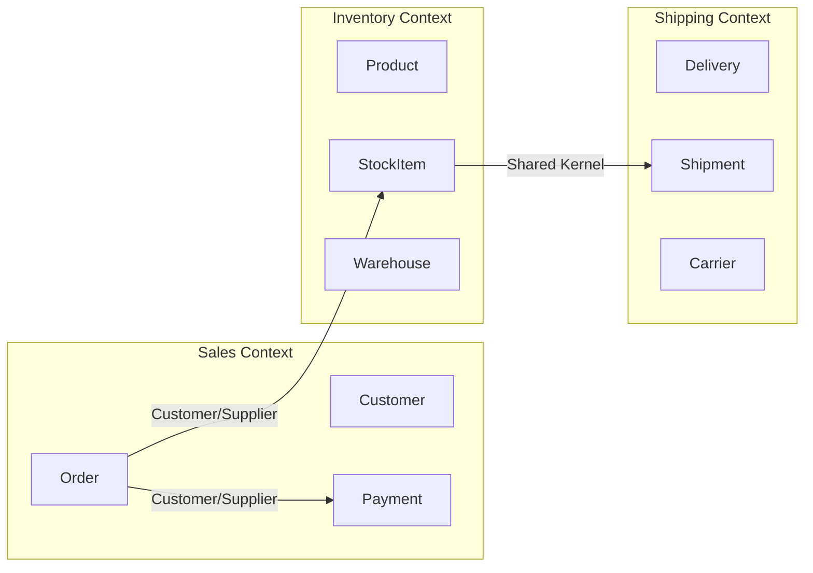

## Visión General

Domain-Driven Design (DDD) es un enfoque de desarrollo de software donde la
estructura y el lenguaje del código coinciden con el dominio de negocio. Eric Evans
lo introdujo en su [libro de 2003](https://www.domainlanguage.com/ddd/), y
[Martin Fowler](https://martinfowler.com/bliki/DomainDrivenDesign.html) ha
escrito extensivamente sobre sus patrones. Es más valioso para dominios complejos
donde la lógica de negocio es la principal fuente de complejidad.

He usado DDD en procesamiento de pagos, registros de salud y sistemas de logística.
En cada caso, el lenguaje ubicuo resultó ser el artefacto más valioso — más que
cualquier patrón o estructura de código.

## Cuándo Usar

- El dominio es complejo y cambia frecuentemente.
- Las reglas de negocio son centrales para la aplicación.
- Los expertos de dominio están disponibles para colaborar con desarrolladores.
- El proyecto es lo suficientemente grande como para justificar el overhead de
  modelado.

### Cuándo evitarlo

- El dominio es CRUD simple con pocas reglas de negocio.
- El equipo no tiene acceso a expertos de dominio.
- El proyecto es pequeño y de corta duración.

## Conceptos Core

### Lenguaje ubicuo

El equipo (desarrolladores, expertos de dominio, product managers) acuerda un
vocabulario compartido que se usa en conversaciones, documentación y código.

**Ejemplos:**

- ❌ `createUser()`: genérico
- ✅ `onboardCustomer()`: específico del dominio
- ❌ `orderStatus = 1`: sin significado
- ✅ `orderStatus = PaymentPending`: autodocumentado

### Bounded context

Un bounded context es un límite lógico dentro del cual aplica un modelo de dominio
particular. Los términos y reglas son consistentes dentro del contexto pero pueden
diferir entre contextos. [Vaughn Vernon](https://www.dddcommunity.org/library/vernon_2011/)
los describe como "límites lingüísticos" — la misma palabra significa cosas
distintas para distintos equipos.



El context map de arriba muestra tres bounded contexts con sus relaciones.
`Customer/Supplier` significa que Sales depende del contrato de API de Inventory.
`Shared Kernel` significa que Inventory y Shipping comparten un modelo pequeño.

```text
┌──────────────────┐  ┌──────────────────┐  ┌──────────────────┐
│  Sales Context   │  │ Inventory Context│  │ Shipping Context │
│  ─────────────   │  │ ───────────────  │  │ ───────────────  │
│  Customer        │  │ Product          │  │ Delivery         │
│  Order           │  │ StockItem        │  │ Shipment         │
│  Payment         │  │ Warehouse        │  │ Carrier          │
└──────────────────┘  └──────────────────┘  └──────────────────┘
```

**Mismo término, diferente significado:**

- En Sales, `Customer` es quien realiza pedidos.
- En Support, `Customer` es quien abre tickets.
- Son modelos diferentes en contextos diferentes.

### Entities

Una entidad tiene una identidad distinta que persiste a través del tiempo y los
cambios de estado. Dos objetos `Order` con el mismo `order_id` son la misma
entidad, incluso si sus contenidos difieren. Vi a equipos sobreusar entidades
cuando un value object alcanzaría — si no necesitás identidad, no la agregues.

```python
class Order:
    def __init__(self, order_id: str):
        self.order_id = order_id
        self.items = []
        self.status = "pending"

    def add_item(self, product, qty):
        self.items.append(OrderLine(product, qty))

    def confirm(self):
        self.status = "confirmed"
```

**Rasgo clave:** la identidad persiste incluso cuando los atributos cambian.

### Value objects

Un value object se define por sus atributos, no por ninguna identidad. Cinco
pesos son cinco pesos — no te importa qué billete de cinco pesos tenés. Esa es
toda la idea.

```python
from dataclasses import dataclass
from decimal import Decimal

@dataclass(frozen=True)
class Money:
    amount: Decimal
    currency: str

@dataclass(frozen=True)
class Address:
    street: str
    city: str
    postal_code: str
```

**Rasgos clave:**

- Inmutables; cambiar atributos crea un nuevo value object.
- Intercambiables si los atributos coinciden (`$5 == $5`).
- Sin lifecycle; pueden crearse y descartarse libremente.

### Aggregates

Un aggregate es un cluster de entidades y value objects que tratás como una
unidad para cambios de datos. El aggregate root es la única entidad que el código
externo puede referenciar directamente. Pensalo como un boundary de consistencia
— una transacción actualiza un aggregate, no más.

```python
class Order:
    def __init__(self, order_id: str):
        self.order_id = order_id
        self._lines = []
        self._status = OrderStatus.PENDING

    def add_line(self, product_id: str, qty: int, unit_price: Money):
        if self._status != OrderStatus.PENDING:
            raise InvalidOperation("Cannot modify a confirmed order")
        self._lines.append(OrderLine(product_id, qty, unit_price))

    def total(self) -> Money:
        return sum((line.total() for line in self._lines), Money("0", "USD"))
```

**Reglas:**

- Todas las modificaciones pasan por el aggregate root.
- El aggregate root controla los invariantes.
- Una transacción = una actualización de aggregate.

### Repositories

Un repository media entre el dominio y la capa de persistencia. Pensalo como
una colección en memoria de aggregates — hacés `get` por ID, guardás cambios con
`save`, y query por criterios que tengan sentido para el dominio.

```python
class OrderRepository:
    def get(self, order_id: str) -> Order:
        ...

    def save(self, order: Order):
        ...

    def find_by_customer(self, customer_id: str) -> List[Order]:
        ...
```

### Domain events

Un domain event captura algo significativo que ocurrió en el dominio — una orden
fue confirmada, un pago falló, un envío salió del depósito. Otros contexts pueden
reaccionar a estos eventos sin que el emisor sepa quién está escuchando.

```python
from dataclasses import dataclass
from datetime import datetime

@dataclass
class OrderConfirmed:
    order_id: str
    customer_id: str
    total: Money
    confirmed_at: datetime
```

Los domain events permiten acoplamiento flexible entre bounded contexts. Consultá
la [guía de arquitectura event-driven](/guides/event-driven-architecture-guide/).

## Estratégico vs Táctico

Vi a equipos saltar directo a repositories y aggregates sin hacer el trabajo
estratégico primero. Eso está al revés. DDD estratégico — mapear bounded contexts,
definir context maps, alinear equipos — va primero. Los patrones tácticos siguen.

| | DDD estratégico | DDD táctico |
| --- | --- | --- |
| Enfoque | Panorama general, organización de equipos | Patrones de implementación |
| Output | Bounded contexts, context maps | Entidades, aggregates, repositorios |
| Cuándo | Al inicio del proyecto, durante discovery | Durante la implementación |
| Quién | Arquitectos, tech leads, expertos de dominio | Equipos de desarrollo |

## Mejores Prácticas

- Empezar por el lenguaje ubicuo, no por el esquema de base de datos. Vi a
  equipos diseñar tablas primero y después intentar enchufar DDD encima — nunca
  funciona.
- Mantener los aggregates pequeños. Los aggregates grandes lastran concurrencia
  porque cada transacción lockea todo el cluster.
- Preferir value objects sobre entidades donde puedas. Son más simples, más
  seguros, y no tenés que preocuparte por la identidad.
- Actualizar un solo aggregate por transacción. Si necesitás actualizar dos,
  probablemente estés mirando dos aggregates.
- Usar domain events para comunicación cross-aggregate. No llames métodos de
  otro aggregate directamente.
- No sobre-ingenieriar. No todo proyecto necesita DDD completo. Una app CRUD con
  tres tablas no necesita bounded contexts.

## Errores Comunes

- Diseñar el esquema de base de datos primero y forzar DDD encima. Vi esto
  fallar más veces de las que puedo contar.
- Convertir todo objeto en entidad en vez de usar value objects. Si no necesita
  identidad, no le des identidad.
- Crear aggregates gigantes que abarcan medio dominio. Vas a tener lock
  contention y conflictos de merge.
- Usar DDD para aplicaciones CRUD simples. Una app CRUD con tres tablas no
  necesita aggregates ni domain events.
- Ignorar los límites del bounded context, creando una "big ball of mud".
- Confundir application services con domain services. Los application services
  orquestan; los domain services contienen lógica de dominio que no pertenece
  a una entidad.

## Estrategia de Testing

DDD demanda un enfoque de testing distinto al de apps CRUD. El aggregate root es
tu unit boundary — testéá sus invariantes, no su estado interno. Vi a equipos
escribir tests que acceden a campos privados con reflection; eso es un smell, no
un test.

### Tests de invariantes del aggregate

Testeá que el aggregate respete sus reglas:

```python
def test_cannot_add_item_to_confirmed_order():
    order = Order("order-1")
    order.add_line("prod-1", 2, Money("10", "USD"))
    order.confirm()
    with pytest.raises(InvalidOperation):
        order.add_line("prod-2", 1, Money("5", "USD"))

def test_cannot_confirm_empty_order():
    order = Order("order-1")
    with pytest.raises(DomainException):
        order.confirm()
```

### Igualdad de value objects

Testeá que los value objects comparen por valor, no por identidad:

```python
def test_money_equality():
    assert Money("10", "USD") == Money("10", "USD")
    assert Money("10", "USD") != Money("10", "EUR")
    assert Money("10", "USD") != Money("5", "USD")
```

### Publicación de domain events

Testeá que los eventos se registren cuando corresponde:

```python
def test_order_confirmed_publishes_event():
    order = Order("order-1")
    order.add_line("prod-1", 2, Money("10", "USD"))
    order.confirm()
    events = order.pull_events()
    assert len(events) == 1
    assert isinstance(events[0], OrderConfirmed)
```

## Consideraciones de Seguridad

- **Validar en el aggregate root**: el root es tu boundary de seguridad para
  reglas de dominio. No dejes que los application services lo bypassen. Una vez
  tracé un bug de doble cobro a un servicio que llamaba `order.confirm()` sin
  chequear el status — el aggregate lo habría prevenido.
- **Anti-Corruption Layer como boundary de seguridad**: los ACLs no solo
  protegen tu modelo de cambios externos; también limitan qué pueden hacer los
  sistemas externos a tu dominio. Whitelisté métodos, validá inputs y logeá
  todas las llamadas.
- **Autorización en repositories**: no dependas de los application services
  para autorización. Empujá los auth checks a las queries del repository para
  que un bug en la capa de servicio no filtre datos entre tenants.
- **Auditar domain events**: los domain events son tu audit trail. Persistilos
  y logealos. Si un cliente disputa una orden, el event log te dice qué pasó
  y cuándo.
- **Encriptar value objects con PII**: `Address`, `PhoneNumber` y `Email` son
  value objects que pueden contener PII. Encriptalos at rest y masquealos en
  logs.

## See Also

- [Domain-Driven Design por Eric Evans](https://www.domainlanguage.com/ddd/)
- [Martin Fowler sobre DDD](https://martinfowler.com/bliki/DomainDrivenDesign.html)
- [Implementing Domain-Driven Design por Vaughn Vernon](https://www.dddcommunity.org/library/vernon_2011/)
- [Docs de DDD de Microsoft](https://learn.microsoft.com/en-us/dotnet/architecture/microservices/microservice-domain-layer/)
- [DDD Community](https://www.dddcommunity.org/)
- [repository-pattern](/patterns/repository-pattern/)
- [event-driven-architecture-guide](/guides/event-driven-architecture-guide/)

## FAQ

### ¿Qué diferencia hay entre una entidad y un aggregate root?

Un aggregate root es una entidad especial que sirve como punto de entrada a un
aggregate. Todas las referencias externas pasan por la root, y todas las
modificaciones se hacen a través de sus métodos.

### ¿Puedo usar DDD con microservicios?

Sí. Cada microservicio suele alinearse con un bounded context. El límite del
servicio refuerza el límite del contexto, y los servicios se comunican con domain
events o APIs. Consultá la
[guía de arquitectura de microservicios](/guides/microservices-architecture-guide/).

### ¿Cómo identifico bounded contexts?

Buscá áreas donde la terminología cambia, diferentes equipos tienen ownership, o
las capabilities de negocio son independientes. Los talleres de Event Storming
son una técnica común. Consultá la
[guía de arquitectura event-driven](/guides/event-driven-architecture-guide/).

### ¿Cómo manejo la consistencia entre bounded contexts?

Usá eventual consistency con domain events. Dentro de un contexto, usá
transacciones ACID para mantener invariantes del aggregate. Entre contextos,
publicá domain events y dejá que cada contexto reaccione. Si necesitás
consistencia fuerte entre contextos, reconsiderá los límites: quizás pertenecen
al mismo contexto.

### ¿Cómo empiezo con DDD en un proyecto existente?

Empezá con un módulo o servicio pequeño e aislado. Aplicá los conceptos, medí el
impacto y expandí. Consultá la
[guía de migración de monolito a microservicios](/guides/monolith-to-microservices-migration-guide/).

### ¿Qué herramientas necesito para DDD?

No se requiere ninguna herramienta específica. Usá tu lenguaje de programación,
unit tests y colaboración con expertos de dominio. Consultá la
[guía de design patterns](/guides/design-patterns-guide/) y el
[patrón repository](/patterns/repository-pattern/).

## Ejemplo de Dominio E-Commerce

```text
Proyecto: plataforma de e-commerce (Java + Spring Boot)
Dominio: Sales, Inventory, Shipping, Support
Equipo: 12 desarrolladores divididos por bounded context

Paso 1: Event Storming
  Output: 340 eventos, 47 comandos, 12 aggregates

Paso 2: Bounded contexts
  | Context | Responsabilidad | Equipo |
  |---------|----------------|--------|
  | Sales | Carrito, órdenes, checkout | 4 devs |
  | Payments | Procesamiento, reembolsos | 2 devs |
  | Inventory | Stock, reservas | 3 devs |
  | Shipping | Logística, carriers | 3 devs |

  Context map:
    Sales -> Payments: Customer/Supplier
    Sales -> Inventory: Customer/Supplier
    Inventory -> Shipping: Shared Kernel
    Support -> Sales: Conformist

Paso 3: Aggregate (Sales)
  public class Order {
      private OrderId id;
      private CustomerId customerId;
      private List<OrderLine> lines = new ArrayList<>();
      private OrderStatus status = OrderStatus.PENDING;
      private Money total = Money.ZERO;

      public void addLine(ProductId productId, int quantity, Money unitPrice) {
          if (status != OrderStatus.PENDING)
              throw new DomainException("Cannot modify confirmed order");
          if (lines.size() >= 50)
              throw new DomainException("Max 50 items per order");
          if (quantity <= 0)
              throw new DomainException("Quantity must be positive");
          lines.add(new OrderLine(productId, quantity, unitPrice));
          total = total.add(unitPrice.multiply(quantity));
      }

      public void confirm() {
          if (lines.isEmpty())
              throw new DomainException("Cannot confirm empty order");
          if (total.isZero())
              throw new DomainException("Total must be positive");
          status = OrderStatus.CONFIRMED;
          registerEvent(new OrderConfirmed(id, customerId, total));
      }
  }

Paso 4: Anti-Corruption Layer (ACL)
  public interface InventoryService {
      boolean isAvailable(ProductId productId, int quantity);
  }

  public class InventoryServiceACL implements InventoryService {
      private InventoryApiClient client;

      public boolean isAvailable(ProductId productId, int quantity) {
          var request = new CheckStockRequest(productId.value(), quantity);
          var response = client.checkStock(request);
          return response.available();
      }
  }

Lecciones:
  - Event Storming reveló eventos que el equipo no había considerado.
  - Los bounded contexts se alinearon con la estructura del equipo.
  - Aggregates pequeños habilitaron concurrencia sin conflictos.
  - Domain events desacoplaron Sales de Payments e Inventory.
  - El ACL protegió a Sales de cambios en el modelo de Inventory.
```
