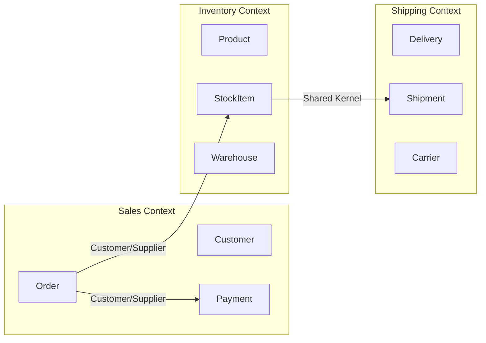

## Overview

Domain-Driven Design (DDD) is an approach to software development where the
structure and language of the code closely match the business domain. Eric Evans
introduced it in his [2003 book](https://www.domainlanguage.com/ddd/), and
[Martin Fowler](https://martinfowler.com/bliki/DomainDrivenDesign.html) has
written extensively about its patterns. It's most valuable for complex domains
where business logic is the main source of complexity.

I've used DDD on payment processing, healthcare records, and logistics systems.
In each case, the ubiquitous language turned out to be the single most valuable
artefact — more than any pattern or code structure.

## When to Use

- The domain is complex and changes frequently.
- Business rules are central to the application.
- Domain experts are available to collaborate with developers.
- The project is large enough to justify the modeling overhead.

### When to avoid

- The domain is simple CRUD with few business rules.
- The team has no access to domain experts.
- The project is small and short-lived.

## Core Concepts

### Ubiquitous language

The team (developers, domain experts, product managers) agrees on a shared
vocabulary used in conversations, documentation, and code.

**Examples:**

- ❌ `createUser()`: generic
- ✅ `onboardCustomer()`: domain-specific
- ❌ `orderStatus = 1`: meaningless
- ✅ `orderStatus = PaymentPending`: self-documenting

### Bounded context

A bounded context is a logical boundary within which a particular domain model
applies. Terms and rules are consistent inside the context but may differ across
contexts. [Vaughn Vernon](https://www.dddcommunity.org/library/vernon_2011/)
describes them as "linguistic boundaries" — the same word means different thing
to different teams.



The context map above shows three bounded contexts with their relationships.
`Customer/Supplier` means Sales depends on Inventory's API contract. `Shared
Kernel` means Inventory and Shipping share a small model.

```text
┌──────────────────┐  ┌──────────────────┐  ┌──────────────────┐
│  Sales Context   │  │ Inventory Context│  │ Shipping Context │
│  ─────────────   │  │ ───────────────  │  │ ───────────────  │
│  Customer        │  │ Product          │  │ Delivery         │
│  Order           │  │ StockItem        │  │ Shipment         │
│  Payment         │  │ Warehouse        │  │ Carrier          │
└──────────────────┘  └──────────────────┘  └──────────────────┘
```

**Same term, different meaning:**

- In Sales, a `Customer` is someone who places orders.
- In Support, a `Customer` is someone who opens tickets.
- They're different models in different contexts.

### Entities

An entity has a distinct identity that persists over time and across state
changes. Two `Order` objects with the same `order_id` are the same entity, even
if their contents differ. I've seen teams overuse entities when a value object
would do — if you don't need identity, don't add it.

```python
class Order:
    def __init__(self, order_id: str):
        self.order_id = order_id
        self.items = []
        self.status = "pending"

    def add_item(self, product, qty):
        self.items.append(OrderLine(product, qty))

    def confirm(self):
        self.status = "confirmed"
```

**Key trait:** identity persists even when attributes change.

### Value objects

A value object is defined by its attributes, not by any identity. Five dollars
is five dollars — you don't care which five-dollar bill you hold. That's the
whole idea.

```python
from dataclasses import dataclass
from decimal import Decimal

@dataclass(frozen=True)
class Money:
    amount: Decimal
    currency: str

@dataclass(frozen=True)
class Address:
    street: str
    city: str
    postal_code: str
```

**Key traits:**

- Immutable; changing attributes creates a new value object.
- Interchangeable if attributes match (`$5 == $5`).
- No lifecycle; can be freely created and discarded.

### Aggregates

An aggregate is a cluster of entities and value objects you treat as a single
unit for data changes. The aggregate root is the only entity outside code can
reference directly. Think of it as a consistency boundary — one transaction
updates one aggregate, no more.

```python
class Order:
    def __init__(self, order_id: str):
        self.order_id = order_id
        self._lines = []
        self._status = OrderStatus.PENDING

    def add_line(self, product_id: str, qty: int, unit_price: Money):
        if self._status != OrderStatus.PENDING:
            raise InvalidOperation("Cannot modify a confirmed order")
        self._lines.append(OrderLine(product_id, qty, unit_price))

    def total(self) -> Money:
        return sum((line.total() for line in self._lines), Money("0", "USD"))
```

**Rules:**

- All modifications go through the aggregate root.
- The aggregate root controls invariants.
- One transaction = one aggregate update.

### Repositories

A repository mediates between the domain and data mapping layers. Think of it as
an in-memory collection of aggregates — you `get` by ID, you `save` changes, and
you query by criteria that makes sense to the domain.

```python
class OrderRepository:
    def get(self, order_id: str) -> Order:
        ...

    def save(self, order: Order):
        ...

    def find_by_customer(self, customer_id: str) -> List[Order]:
        ...
```

### Domain events

A domain event captures something meaningful that happened in the domain — an
order was confirmed, a payment failed, a shipment left the warehouse. Other
contexts can react to these events without the sender knowing who's listening.

```python
from dataclasses import dataclass
from datetime import datetime

@dataclass
class OrderConfirmed:
    order_id: str
    customer_id: str
    total: Money
    confirmed_at: datetime
```

Domain events enable loose coupling between bounded contexts. See the
[event-driven architecture guide](/guides/event-driven-architecture-guide/).

## Strategic vs Tactical DDD

I've seen teams jump straight to repositories and aggregates without doing the
strategic work first. That's backwards. Strategic DDD — mapping bounded contexts,
defining context maps, aligning teams — comes first. Tactical patterns follow.

| | High-level DDD | Implementation-level DDD |
| --- | --- | --- |
| Focus | Big picture, team organization | Implementation patterns |
| Output | Bounded contexts, context maps | Entities, aggregates, repositories |
| When | Early in the project, during discovery | During implementation |
| Who | Architects, tech leads, domain experts | Development teams |

## Best Practices

- Start with the ubiquitous language, not the database schema. I've watched
  teams design tables first and then try to bolt DDD on top — it never works.
- Keep aggregates small. Large aggregates hurt concurrency because every
  transaction locks the whole cluster.
- Prefer value objects over entities where you can. They're simpler, safer, and
  you don't have to worry about identity.
- Update only one aggregate per transaction. If you need to update two, you're
  probably looking at two aggregates.
- Use domain events for cross-aggregate communication. Don't call another
  aggregate's methods directly.
- Don't over-engineer. Not every project needs full DDD. A CRUD app with three
  tables doesn't need bounded contexts.

## Common Mistakes

- Designing the database schema first and forcing DDD patterns on top. I've
  watched this fail more times than I can count.
- Making every object an entity instead of using value objects. If it doesn't
  need identity, don't give it identity.
- Creating giant aggregates that span half the domain. You'll get lock
  contention and merge conflicts.
- Using DDD for simple CRUD applications. A CRUD app with three tables doesn't
  need aggregates or domain events.
- Ignoring bounded context boundaries, creating a "big ball of mud".
- Confusing application services with domain services. Application services
  orchestrate; domain services contain domain logic that doesn't belong to an
  entity.

## Testing Strategy

DDD demands a different testing approach from CRUD apps. The aggregate root is
your unit boundary — test its invariants, not its internal state. I've seen teams
write tests that poke at private fields through reflection; that's a smell, not
a test.

### Aggregate invariant tests

Test that the aggregate enforces its rules:

```python
def test_cannot_add_item_to_confirmed_order():
    order = Order("order-1")
    order.add_line("prod-1", 2, Money("10", "USD"))
    order.confirm()
    with pytest.raises(InvalidOperation):
        order.add_line("prod-2", 1, Money("5", "USD"))

def test_cannot_confirm_empty_order():
    order = Order("order-1")
    with pytest.raises(DomainException):
        order.confirm()
```

### Value object equality

Test that value objects compare by value, not identity:

```python
def test_money_equality():
    assert Money("10", "USD") == Money("10", "USD")
    assert Money("10", "USD") != Money("10", "EUR")
    assert Money("10", "USD") != Money("5", "USD")
```

### Domain event publishing

Test that events are registered when expected:

```python
def test_order_confirmed_publishes_event():
    order = Order("order-1")
    order.add_line("prod-1", 2, Money("10", "USD"))
    order.confirm()
    events = order.pull_events()
    assert len(events) == 1
    assert isinstance(events[0], OrderConfirmed)
```

## Security Considerations

- **Validate at the aggregate root**: the root is your security boundary for
  domain rules. Don't let application services bypass it. I once traced a
  double-charge bug to a service that called `order.confirm()` without checking
  the status — the aggregate would have prevented it.
- **Anti-Corruption Layer as security boundary**: ACLs don't just protect your
  model from external changes; they also limit what external systems can do to
  your domain. Whitelist methods, validate inputs, and log all calls.
- **Authorization in repositories**: don't rely on application services for
  authorization. Push auth checks into repository queries so a bug in the
  service layer can't leak data across tenants.
- **Audit domain events**: domain events are your audit trail. Persist them and
  log them. If a customer disputes an order, the event log tells you what
  happened and when.
- **Encrypt value objects with PII**: `Address`, `PhoneNumber`, and `Email`
  are value objects that may contain PII. Encrypt them at rest and mask them
  in logs.

## See Also

- [Domain-Driven Design by Eric Evans](https://www.domainlanguage.com/ddd/)
- [Martin Fowler on DDD](https://martinfowler.com/bliki/DomainDrivenDesign.html)
- [Implementing Domain-Driven Design by Vaughn Vernon](https://www.dddcommunity.org/library/vernon_2011/)
- [Microsoft DDD docs](https://learn.microsoft.com/en-us/dotnet/architecture/microservices/microservice-domain-layer/)
- [DDD Community](https://www.dddcommunity.org/)
- [repository-pattern](/patterns/repository-pattern/)
- [event-driven-architecture-guide](/guides/event-driven-architecture-guide/)

## FAQ

### What is the difference between an entity and an aggregate root?

An aggregate root is a special entity that serves as the entry point to an
aggregate. All external references go through the root, and all modifications are
done via its methods.

### Can I use DDD with microservices?

Yes. Each microservice usually aligns with a bounded context. The service
boundary enforces the context boundary, and services communicate via domain
events or APIs. See the
[microservices architecture guide](/guides/microservices-architecture-guide/).

### How do I identify bounded contexts?

Look for areas where terminology changes, different teams have ownership, or
business capabilities are independent. Event Storming workshops are a common
technique. See the
[event-driven architecture guide](/guides/event-driven-architecture-guide/).

### How do I handle consistency across bounded contexts?

Use eventual consistency with domain events. Within a context, use ACID
transactions to maintain aggregate invariants. Across contexts, publish domain
events and let each context react. If you need strong cross-context consistency,
reconsider the boundaries: they may belong in the same context.

### How do I get started with DDD in an existing project?

Start with a small, isolated module or service. Apply the concepts, measure the
impact, then expand. See the
[monolith-to-microservices migration guide](/guides/monolith-to-microservices-migration-guide/).

### What tools do I need for DDD?

No specific tool is required. Use your programming language, unit tests, and
collaboration with domain experts. See the
[design patterns guide](/guides/design-patterns-guide/) and
[repository pattern](/patterns/repository-pattern/).

## E-Commerce Domain Example

```text
Project: E-commerce platform (Java + Spring Boot)
Domain: Sales, Inventory, Shipping, Support
Team: 12 developers split by bounded context

Step 1: Event Storming
  Output: 340 events, 47 commands, 12 aggregates

Step 2: Bounded contexts
  | Context | Responsibility | Team |
  |---------|--------------|------|
  | Sales | Cart, orders, checkout | 4 devs |
  | Payments | Processing, refunds | 2 devs |
  | Inventory | Stock, reservations | 3 devs |
  | Shipping | Logistics, carriers | 3 devs |

  Context map:
    Sales -> Payments: Customer/Supplier
    Sales -> Inventory: Customer/Supplier
    Inventory -> Shipping: Shared Kernel
    Support -> Sales: Conformist

Step 3: Aggregate (Sales)
  public class Order {
      private OrderId id;
      private CustomerId customerId;
      private List<OrderLine> lines = new ArrayList<>();
      private OrderStatus status = OrderStatus.PENDING;
      private Money total = Money.ZERO;

      public void addLine(ProductId productId, int quantity, Money unitPrice) {
          if (status != OrderStatus.PENDING)
              throw new DomainException("Cannot modify confirmed order");
          if (lines.size() >= 50)
              throw new DomainException("Max 50 items per order");
          if (quantity <= 0)
              throw new DomainException("Quantity must be positive");
          lines.add(new OrderLine(productId, quantity, unitPrice));
          total = total.add(unitPrice.multiply(quantity));
      }

      public void confirm() {
          if (lines.isEmpty())
              throw new DomainException("Cannot confirm empty order");
          if (total.isZero())
              throw new DomainException("Total must be positive");
          status = OrderStatus.CONFIRMED;
          registerEvent(new OrderConfirmed(id, customerId, total));
      }
  }

Step 4: Anti-Corruption Layer (ACL)
  public interface InventoryService {
      boolean isAvailable(ProductId productId, int quantity);
  }

  public class InventoryServiceACL implements InventoryService {
      private InventoryApiClient client;

      public boolean isAvailable(ProductId productId, int quantity) {
          var request = new CheckStockRequest(productId.value(), quantity);
          var response = client.checkStock(request);
          return response.available();
      }
  }

Lessons:
  - Event Storming revealed events the team had not considered.
  - Bounded contexts aligned with team structure.
  - Small aggregates enabled concurrency without conflicts.
  - Domain events decoupled Sales from Payments and Inventory.
  - The ACL protected Sales from changes in the Inventory model.
```
