## Visión General

La Arquitectura por Slices Verticales es un estilo de organización de código
centrado en features que agrupa todo el código de una funcionalidad — comando,
handler, validador y endpoint — en una sola carpeta. Fue popularizada por
[Jimmy Bogard](https://www.jimmybogard.com/) en su
[charla sobre Vertical Slice Architecture](https://www.youtube.com/watch?v=5OtZ1e2lNc0), invierte el
enfoque tradicional por capas. En lugar de organizar código por preocupación
técnica (Controladores, Servicios, Repositorios), organizás por feature. Todo el
código de una feature (comando, handler, validador y endpoint) vive junto en
una carpeta. Cuando necesitás cambiar "Crear Orden", todos los archivos
relevantes están ahí. Eso reduce la carga cognitiva de recorrer la base de código y
baja los conflictos de merge entre equipos.

La primera vez que probé este enfoque fue en una API .NET que había crecido a
40+ controladores repartidos en tres proyectos por capas. Un cambio simple como
"agregar un campo de descuento a las órdenes" tocaba ocho archivos en cuatro
directorios. Después de migrar a slices verticales, el mismo cambio tocaba tres
archivos en una sola carpeta. La diferencia fue inmediata. Las revisiones de
código fueron más rápidas, el onboarding de nuevos desarrolladores tomó menos
tiempo, y los conflictos de merge cayeron bruscamente porque dos equipos rara vez
editaban la misma carpeta.

Lo que importa es la cohesión, no la organización por capas.
Una carpeta de feature tiene alta cohesión: todo lo relacionado con "Crear Orden"
está en un solo lugar. Una arquitectura tradicional por capas tiene baja cohesión
a nivel de feature: la lógica de órdenes está dispersa entre Controladores,
Servicios y Repositorios. Cuando optimizás para la cohesión de features,
optimizás para lo que realmente cambia: la feature en sí.

### Cómo se diferencia de Clean Architecture

[Clean Architecture](/es/guides/clean-architecture-guide/) trata sobre la dirección
de dependencias: las capas internas no deben conocer a las externas. Vertical
Slice trata sobre la organización de carpetas: el código se agrupa por feature,
no por capa técnica.

Los dos no están en conflicto. Podés tener slices organizados verticalmente
donde cada slice sigue las reglas de dependencia de Clean Architecture
internamente. El handler del slice depende de una abstracción, no de un
repositoritorio concreto. Pero esa abstracción, su implementación, y el handler
viven todos en la misma carpeta.

En la práctica, encuentro que los equipos que adoptan Vertical Slice primero
tienden a preocuparse menos por el layering estricto de Clean Architecture porque
los slices ya son lo suficientemente chicos como para que la dirección de
dependencias sea obvia. Los equipos que adoptan Clean Architecture primero
tienden a tener un layering más rígido que Vertical Slice puede aflojar.

## Cuándo Usar

- Tu aplicación tiene muchas funcionalidades que evolucionan independientemente.
- Los miembros del equipo preguntan seguido "¿dónde está el código de X?"
- Cambios entre capas requieren tocar varios archivos en varios directorios.
- Querés minimizar conflictos de merge entre equipos de funcionalidades.
- Algunas funcionalidades son CRUD simples, otras son flujos complejos.
- Tenés un equipo mediano a grande donde múltiples desarrolladores trabajan en
  features diferentes simultáneamente.

Para alternativas, consultá [Clean Architecture](/es/guides/clean-architecture-guide/)
y [Onion Architecture](/es/guides/onion-architecture-guide/).

### Cuándo evitarlo

- La base de código es pequeña. Una carpeta de feature por endpoint no va a ayudar a
  un proyecto que ya entra en un puñado de archivos. Si tu API completa tiene
  tres endpoints, las capas están bien.
- Cada feature reusa el mismo modelo de dominio masivo. Acoplamiento profundo
  entre slices significa que el dominio no está bien dividido. Puede que
  necesites extraer bounded contexts primero y luego organizar cada context en
  slices.
- La organización no está lista para que un equipo se haga cargo de un slice de
  punta a punta. Vertical Slice funciona mejor cuando un equipo puede cambiar una
  feature sin coordinar con tres equipos más.
- Estás trabajando con un framework que pelea con la organización por features.
  Algunos frameworks viejos (como ASP.NET MVC temprano) dificultan co-ubicar
  controladores y vistas. Frameworks modernos como ASP.NET Core Minimal APIs,
  FastAPI y Spring Boot lo soportan bien.

## Organización Horizontal vs Vertical

```text
Horizontal (Capas)            Vertical (Slices)
├── Controladores             ├── Features
│   ├── OrderController.cs    │   ├── CreateOrder
│   └── ProductController.cs  │   │   ├── CreateOrderCommand.cs
├── Servicios                 │   │   ├── CreateOrderHandler.cs
│   ├── OrderService.cs       │   │   ├── CreateOrderValidator.cs
│   └── ProductService.cs     │   │   └── CreateOrderEndpoint.cs
├── Repositorios              │   ├── GetOrderById
│   ├── OrderRepository.cs    │   │   ├── GetOrderByIdQuery.cs
│   └── ProductRepository.cs  │   │   └── GetOrderByIdHandler.cs
                              │   └── UpdateOrderStatus
```

## Estructura de una Feature

Cada feature es autocontenida y típicamente incluye:

| Componente | Propósito |
| --- | --- |
| **Command/Query** | Modelo de entrada (DTO) |
| **Handler** | Lógica de negocio de la feature |
| **Validator** | Reglas de validación de entrada |
| **Endpoint/Controller** | Punto de entrada HTTP o de mensajería |
| **Response** | Modelo de salida (DTO) |

No todas las features necesitan los cinco componentes. Una query simple como
"obtener producto por ID" puede saltear el validador y tener un handler de una
línea. Un comando complejo como "procesar reembolso" puede agregar un evento de
dominio, una saga y un outbox. La estructura escala hacia arriba y hacia abajo
según la complejidad de la feature. Ese es el punto. No forzás una operación
CRUD simple a través de la misma ceremonia que un workflow multi-paso.

Encontré que el naming importa mucho. Una carpeta nombrada `CreateOrder` no
deja ambigüedad sobre su contenido. Una carpeta nombrada `Orders` podría contener
cualquier cosa. Prefiero nombres verbo-sustantivo para operaciones
(`CreateOrder`, `GetOrderById`, `CancelOrder`) y reservar nombres
sustantivo-plural (`Orders`, `Products`) para aggregate roots o modelos de
dominio compartidos.

## Ejemplo: Feature Crear Orden

Los snippets de abajo muestran los archivos clave. El proyecto completo runnable
(incluyendo `AppDbContext`, entidades de dominio, `Program.cs` y un proyecto de
tests) está en el
[repositorio companion](https://mathiaspaulenko.github.io/stack-practices-resources/resources/guides/architecture/vertical-slice-architecture-guide/).

```csharp
// Features/Orders/CreateOrder/CreateOrderCommand.cs
public record CreateOrderCommand(
    int ProductId,
    int Quantity,
    string CustomerEmail
) : IRequest<OrderDto>;
```

```csharp
// Features/Orders/CreateOrder/CreateOrderHandler.cs
public class CreateOrderHandler : IRequestHandler<CreateOrderCommand, OrderDto>
{
    private readonly AppDbContext _dbContext;

    public CreateOrderHandler(AppDbContext dbContext) => _dbContext = dbContext;

    public async Task<OrderDto> Handle(CreateOrderCommand request, CancellationToken ct)
    {
        var product = await _dbContext.Products.FindAsync(request.ProductId);
        if (product == null) throw new NotFoundException("Producto no encontrado");
        if (product.Stock < request.Quantity)
            throw new ValidationException("Stock insuficiente");

        var order = new Order
        {
            ProductId = request.ProductId,
            Quantity = request.Quantity,
            CustomerEmail = request.CustomerEmail,
            Total = product.Price * request.Quantity,
            CreatedAt = DateTime.UtcNow
        };

        _dbContext.Orders.Add(order);
        product.Stock -= request.Quantity;
        await _dbContext.SaveChangesAsync(ct);

        return new OrderDto(order);
    }
}
```

```csharp
// Features/Orders/CreateOrder/CreateOrderValidator.cs
public class CreateOrderValidator : AbstractValidator<CreateOrderCommand>
{
    public CreateOrderValidator()
    {
        RuleFor(x => x.ProductId).GreaterThan(0);
        RuleFor(x => x.Quantity).GreaterThan(0).LessThanOrEqualTo(100);
        RuleFor(x => x.CustomerEmail).NotEmpty().EmailAddress();
    }
}
```

```csharp
// Features/Orders/CreateOrder/CreateOrderEndpoint.cs
public class CreateOrderEndpoint : ICarterModule
{
    public void AddRoutes(IEndpointRouteBuilder app)
    {
        app.MapPost("/orders", async (CreateOrderCommand command, ISender sender) =>
        {
            var result = await sender.Send(command);
            return Results.Created($"/orders/{result.Id}", result);
        });
    }
}
```

El endpoint es deliberadamente liviano. Recibe el comando, lo envía a través del
mediator y devuelve el resultado. Toda la lógica de negocio vive en el handler.
Esto mantiene los endpoints intercambiables. Podrías disparar el mismo
`CreateOrderCommand` desde un job en segundo plano, un webhook o un test sin
cambiar el handler.

## Flujo de Request a través de un Slice

Un request que entra a la API pasa por varias capas antes de alcanzar el
handler. Entender este flujo te ayuda a debuguear issues y diseñar nuevos slices
correctamente.

```mermaid
%% alt: Flujo de un request a través de un Vertical Slice — endpoint, pipeline MediatR, handler, DbContext
flowchart LR
    A[Request HTTP] --> B[Endpoint mapea a Command]
    B --> C[Pipeline MediatR: Logging]
    C --> D[Pipeline MediatR: Validación]
    D --> E[Pipeline MediatR: Transacción]
    E --> F[Handler ejecuta lógica de negocio]
    F --> G[DbContext guarda cambios]
    G --> H[Response devuelto al caller]
```



Los pipeline behaviors (logging, validación, transacción) viven en `Common/` y
se aplican a cada request automáticamente. El handler se enfoca solo en la
lógica de negocio. Esta separación es lo que mantiene los slices livianos y
consistentes. No repetís boilerplate en cada handler.

Configuro el orden del pipeline con cuidado. Logging va primero para capturar
cada request incluso si la validación falla. La validación corre segunda, rechazando
input malo antes de abrir una transacción. El behavior de transacción envuelve
el handler para que o todo se commitee o nada. Si te equivocás en este orden,
aparecen bugs sutiles. Por ejemplo, si la validación corre dentro de la
transacción, un fallo de validación hace rollback de trabajo que no debería
haber empezado todavía.

## Compartiendo Preocupaciones Transversales

No todo pertenece a un slice vertical. La infraestructura compartida vive en una
carpeta común:

```text
├── Features/           # Slices verticales
├── Common/
│   ├── Behaviors/      # Pipelines de MediatR (logging, validación, transacciones)
│   ├── Exceptions/     # Excepciones de dominio y aplicación
│   ├── Interfaces/     # Abstracciones compartidas
│   └── Infrastructure/ # DbContext, configuración de DI
```

Usá esta carpeta para código reutilizado entre slices: logging, pipelines de
validación, transacciones y excepciones compartidas. Mantené la lógica de
negocio dentro del slice.

Una carpeta típica de `Common/Behaviors/` se ve así:

```csharp
// Common/Behaviors/LoggingBehavior.cs
public class LoggingBehavior<TRequest, TResponse> : IPipelineBehavior<TRequest, TResponse>
    where TRequest : notnull
{
    private readonly ILogger<LoggingBehavior<TRequest, TResponse>> _logger;

    public LoggingBehavior(ILogger<LoggingBehavior<TRequest, TResponse>> logger) => _logger = logger;

    public async Task<TResponse> Handle(TRequest request, RequestHandlerDelegate<TResponse> next, CancellationToken ct)
    {
        _logger.LogInformation("Handling {RequestType}", typeof(TRequest).Name);
        var response = await next();
        _logger.LogInformation("Handled {RequestType}", typeof(TRequest).Name);
        return response;
    }
}
```

```csharp
// Common/Behaviors/ValidationBehavior.cs
public class ValidationBehavior<TRequest, TResponse> : IPipelineBehavior<TRequest, TResponse>
    where TRequest : notnull
{
    private readonly IEnumerable<IValidator<TRequest>> _validators;

    public ValidationBehavior(IEnumerable<IValidator<TRequest>> validators) => _validators = validators;

    public async Task<TResponse> Handle(TRequest request, RequestHandlerDelegate<TResponse> next, CancellationToken ct)
    {
        if (!_validators.Any()) return await next();

        var context = new ValidationContext<TRequest>(request);
        var results = await Task.WhenAll(_validators.Select(v => v.ValidateAsync(context, ct)));
        var failures = results.SelectMany(r => r.Errors).Where(f => f != null).ToList();

        if (failures.Count != 0)
            throw new ValidationException(failures);

        return await next();
    }
}
```

Estos behaviors se registran una vez en el contenedor de DI y se aplican a cada
request de MediatR automáticamente. Escribís la lógica de validación y logging
exactamente una vez, no en cada handler.

## Estrategia de Migración: De Capas a Vertical

Migrar una base de código existente por capas a slices verticales es la parte que más
intimida a los equipos. Lo hice tres veces, y el enfoque que funciona es
incremental. Nunca migres todo de golpe.

### Paso 1: Elegí la feature más simple

Empezá con una feature que tenga límites claros y dependencias mínimas. "Obtener
producto por ID" es un buen candidato: una query, un handler, un endpoint. No
empieces con "procesar orden". Toca inventario, pagos, notificaciones y envío.

### Paso 2: Creá la carpeta del slice

Creá `Features/Products/GetProductById/` y mové el código relevante de la
estructura por capas a la nueva carpeta. La query pasa de
`Queries/GetProductByIdQuery.cs` a
`Features/Products/GetProductById/GetProductByIdQuery.cs`. El handler se mueve
similarmente.

### Paso 3: Conectá el mediator

Si no estabas usando MediatR antes, introducilo ahora. El endpoint que
previamente llamaba al servicio directamente ahora envía un comando a través del
mediator. Esto desacopla el endpoint del servicio y hace el slice
autocontenido.

### Paso 4: Verificá que los tests pasen

Corré los tests existentes contra la nueva estructura. Si los tests rompen,
usualmente es porque estaban testeando la clase de servicio directamente en
lugar del comportamiento. Reescribilos para testear el handler a través del
mediator — esto es más resiliente a cambios estructurales.

### Paso 5: Eliminá los archivos viejos

Una vez que el slice funciona y los tests pasan, borrá el método del controller
viejo, la clase de servicio y el método del repositorio de la estructura por
capas. No dejes código muerto — confunde al próximo desarrollador que mira la
base de código.

### Paso 6: Repetí

Pasá a la siguiente feature. Típicamente migro una feature por día en una
base de código mediana. Después de dos semanas, vas a haber migrado 10-15 features y
la estructura por capas va a estar mayormente vacía. En ese punto, podés
eliminar los proyectos de capas vacíos.

## Testing de Slices Verticales

Uno de los mayores beneficios de los slices verticales es que el testing se
vuelve más fácil. En lugar de mockear una capa de servicio y una capa de
repositorio por separado, testeás el slice end to end a través del mediator.

```csharp
[Fact]
public async Task CreateOrder_WithValidCommand_ReturnsOrderDto()
{
    // Arrange
    var dbContext = TestDbContextFactory.Create();
    dbContext.Products.Add(new Product { Id = 1, Price = 10m, Stock = 100 });
    await dbContext.SaveChangesAsync();

    var handler = new CreateOrderHandler(dbContext);
    var command = new CreateOrderCommand(1, 5, "test@example.com");

    // Act
    var result = await handler.Handle(command, CancellationToken.None);

    // Assert
    Assert.Equal(5, result.Quantity);
    Assert.Equal(50m, result.Total);
    Assert.Equal(95, dbContext.Products.First().Stock);
}
```

Prefiero testear handlers directamente en lugar de ir por el pipeline HTTP
completo para la mayoría de los tests. Los tests de integración HTTP son
valiosos pero lentos — los reservo para smoke tests y testeo la lógica del
handler con un DbContext real (in-memory). Esto me da feedback rápido y pilla
bugs de lógica de negocio sin el overhead de levantar un web server.

Para tests de integración a nivel de slice, uso `WebApplicationFactory` para
bootear la API in-memory y pegarle al endpoint real:

```csharp
[Fact]
public async Task PostOrders_WithValidPayload_Returns201()
{
    var factory = new WebApplicationFactory<Program>();
    var client = factory.CreateClient();

    var response = await client.PostAsJsonAsync("/orders", new
    {
        ProductId = 1,
        Quantity = 5,
        CustomerEmail = "test@example.com"
    });

    Assert.Equal(HttpStatusCode.Created, response.StatusCode);
}
```

Estos tests viven al lado del código de la feature o en una carpeta de tests
con la misma estructura. El principio clave es: testear el slice como una
unidad, no las capas por separado.

## Mejores Prácticas

- Agrupá operaciones relacionadas en un slice. No crees un slice para cada acción
  CRUD si comparten los mismos datos y reglas. Yo agrupo `CreateOrder`,
  `GetOrderById` y `CancelOrder` bajo `Features/Orders/` porque comparten el
  mismo aggregate root.
- Dejá los handlers con la lógica y los endpoints livianos. Los endpoints
  delegan; los handlers contienen la lógica de negocio. Si me encuentro
  escribiendo lógica en un endpoint, es una señal de que pertenece al handler.
- Extraé lógica compartida a `Common/` o servicios de dominio, pero solo cuando
  al menos dos slices la necesiten. Espero a la tercera ocurrencia antes de
  extraer — la segunda vez puede ser coincidencia.
- Organizá tests por feature. Poné `CreateOrderTests.cs` al lado del código de la
  feature o en una carpeta de tests con la misma estructura. En mi experiencia,
  los desarrolladores corren los tests cuando viven al lado del código que cubren.
- Usá una librería mediator ([MediatR](https://github.com/jbogard/MediatR),
  [Mediator](https://github.com/martinothamar/Mediator)) para rutear requests a
  handlers sin acoplar slices entre sí. El
  [patrón mediator](/es/patterns/mediator-pattern/) es lo que hace que esto
  funcione.
- Elegí una organización principal por aplicación. Mezclar horizontal y vertical
  en el mismo proyecto genera confusión. Vi equipos intentar mantener la carpeta
  vieja de `Controllers/` junto con `Features/` — nunca termina bien.
- Usá [CQRS](/es/patterns/cqrs-pattern/) cuando lecturas y escrituras tengan
  complejidad diferente. Un slice puede tener handlers separados de query y
  command sin forzar infraestructura full CQRS en todo el proyecto.

## Errores Comunes

- Duplicar acceso a `DbContext` o pipelines de validación en cada feature en
  lugar de usar comportamientos compartidos. Vi equipos copy pastear la misma
  lógica de validación en cinco handlers porque no setearon un
  `ValidationBehavior` en `Common/`. El fix es siempre el mismo: extraerlo una
  vez, registrarlo globalmente.
- Hacer slices demasiado granulares. Una carpeta por cada operación CRUD pequeña
  agrega ruido, no claridad. Si `GetProductById` y `GetProductList` comparten la
  misma lógica de handler, no necesitan carpetas separadas.
- Poner lógica de negocio en endpoints o controladores. Eso saca la lógica del
  slice y la vuelve a una capa horizontal. Lo pillo en code reviews cuando veo
  `if` statements o bloques `try/catch` en un endpoint — esa lógica pertenece al
  handler.
- Ignorar preocupaciones transversales. Logging, caching y transacciones todavía
  necesitan un lugar central. La carpeta `Common/Behaviors/` existe por esta
  razón — usala.
- Forzar aislamiento absoluto. Las entidades de dominio compartidas pueden vivir
  en `Common/Domain` y seguir manteniendo cohesión en cada slice. Vi equipos
  duplicar la entidad `Order` across tres slices porque pensaban que compartir
  estaba prohibido. No lo está — compartir modelos de dominio está bien, lo que
  querés evitar es compartir lógica de negocio.
- Saltearse el mediator y llamar handlers directamente. Esto acopla el caller al
  tipo concreto del handler y derrota el propósito del patrón. Siempre andá por
  `ISender.Send()` para que los pipeline behaviors corran.

## Comparación con Otras Arquitecturas

Vertical Slice es una de varias formas de organizar el código de una aplicación.
La comparación que sigue es lo que ojalá hubiera tenido al decidir cuál encajaba
en cada proyecto en el que trabajé.

| Arquitectura | Organiza por | Fortalezas | Debilidades | Ideal para |
| --- | --- | --- | --- | --- |
| **Vertical Slice** | Feature | Alta cohesión, pocos conflictos de merge, navegación fácil | Puede duplicar infraestructura si no tenés cuidado | APIs medianas a grandes con features independientes |
| **[Layered](/es/guides/layered-architecture-guide/)** | Preocupación técnica | Separación clara, familiar para la mayoría de los equipos | Baja cohesión de feature, navegación cross-layer | Apps chicas a medianas con dominio compartido |
| **[Clean Architecture](/es/guides/clean-architecture-guide/)** | Dirección de dependencias | Núcleo testeable, independencia del framework | Puede ser ceremonioso, muchas interfaces | Dominios complejos donde la dirección de dependencias importa |
| **[Onion Architecture](/es/guides/onion-architecture-guide/)** | Dirección de dependencias (concéntrica) | Similar a Clean, enfatiza interfaces | Mismas preocupaciones de ceremonia que Clean | Aplicaciones domain-heavy |
| **Hexagonal** | Ports y adapters | Infraestructura intercambiable, núcleo testeable | Puede sobre-abstraer apps simples | Apps con múltiples canales de entrega (web, CLI, mensajería) |

Trabajé en proyectos que usaron cada una de estas. El patrón que veo
consistentemente es que la arquitectura importa menos que la disciplina del
equipo al seguirla. Un equipo que entiende Vertical Slice y lo aplica de forma
consistente produce mejor código que un equipo que aplica Clean Architecture a
medias. Elegí una, aprendela bien y no cambies de una a otra.

### Vertical Slice vs Layered

La comparación más común es Vertical Slice vs layering tradicional. En una
arquitectura por capas, tenés una carpeta de Controladores, una de Servicios y
una de Repositorios. Agregar una feature nueva significa tocar las tres capas.
En Vertical Slice, agregás una carpeta bajo `Features/` y todo para esa feature
vive ahí.

El trade-off: la arquitectura por capas hace fácil intercambiar una capa (ej:
reemplazar Entity Framework con Dapper) porque todo el acceso a datos está en un
solo lugar. Vertical Slice simplifica agregar o cambiar una feature porque todo
el código está en un solo lugar. Para la mayoría de las aplicaciones de negocio,
las features cambian más seguido que las estrategias de acceso a datos, así que
Vertical Slice gana en el eje que más importa.

### Vertical Slice vs Clean Architecture

Clean Architecture se enfoca en la dirección de dependencias: la capa de dominio
no conoce a la capa de aplicación, que no conoce a la capa de infraestructura.
Esto se enforcea a través de interfaces e inversión de control.

Vertical Slice no enforcea la dirección de dependencias explícitamente. El
handler de un slice puede referenciar `AppDbContext` directamente sin una
interface. Esta es una crítica común de los defensores de Clean Architecture. En
la práctica, veo que los slices son lo suficientemente chicos como para
que las dependencias directas estén bien — el handler tiene 30 líneas de código,
no 300. Si un slice crece lo suficiente como para que la dirección de
dependencias sea una preocupación, es una señal de que el slice debería dividirse,
no de que necesitás más interfaces.

Podés combinar ambos enfoques: usar Vertical Slice para la organización de
carpetas y aplicar las reglas de dependencia de Clean Architecture dentro de cada
slice. El handler depende de una interface `IOrderRepository`, y la
implementación vive en el mismo slice. Esto te da cohesión de feature e inversión
de dependencias. Lo hice en dos proyectos y funciona bien, aunque agrega algo de
ceremonia.

## Ejemplos Reales

### API de e-commerce

Una API de e-commerce en la que trabajé tenía 14 slices en 5 dominios y 40+
endpoints. Antes de la migración, agregar un método de pago nuevo tocaba 6
archivos en 4 proyectos por capas. Después de migrar a slices verticales, el
mismo cambio tocaba 2 archivos en una sola carpeta. La estructura era así:

```text
Features/
├── Orders/
│   ├── CreateOrder/
│   ├── GetOrderById/
│   ├── CancelOrder/
│   └── ListOrders/
├── Products/
│   ├── CreateProduct/
│   ├── GetProductById/
│   ├── UpdateProductPrice/
│   └── SearchProducts/
├── Cart/
│   ├── AddToCart/
│   ├── RemoveFromCart/
│   └── Checkout/
├── Payments/
│   ├── ProcessPayment/
│   └── RefundPayment/
└── Notifications/
    ├── SendOrderConfirmation/
    └── SendShippingUpdate/
```

Cada slice era propiedad de un equipo chico. El equipo de Orders podía cambiar
`CreateOrder` sin tocar el código de Payments. La única coordinación necesaria
era alrededor de las entidades de dominio compartidas (`Order`, `Product`) que
vivían en `Common/Domain/`.

### Sistema de billing SaaS

Un sistema de billing que migré de capas a vertical tenía un desafío diferente:
el aggregate `Invoice` era usado por `CreateInvoice`, `SendInvoice`,
`RecordPayment` y `GenerateReport`. Las cuatro operaciones necesitaban el mismo
modelo de dominio. En la estructura por capas, esto significaba cuatro servicios
todos dependiendo del mismo repositorio. En la estructura vertical, cada slice
tiene su propio handler que carga la invoice a través de una interface
compartida `IInvoiceRepository`. La interface vive en `Common/Interfaces/` y la
implementación en `Common/Infrastructure/`.

La migración tomó tres semanas para un equipo de cuatro. Movimos una feature por
día, corrimos la suite de tests después de cada movimiento y arreglamos
breakages inmediatamente. La mayor sorpresa fue cuánto código muerto encontramos:
38 métodos de servicio que ningún controller llamaba, 22 métodos de repositorio
que ningún servicio usaba. Mover a slices nos forzó a confrontar esto porque
teníamos que decidir qué mover y qué dejar atrás.

### Tool admin interno

Un tool admin chico con cinco endpoints y 800 líneas de código no se benefició de
Vertical Slice en absoluto. El overhead de crear una carpeta, un comando, un
handler y un endpoint para cada operación fue más ceremonia de la que el
proyecto justificaba. Lo mantuve por capas y fue la decisión correcta. Vertical
Slice brilla cuando tenés suficientes features como para que la organización
realmente importe. Para una app CRUD con cinco endpoints, las capas son más
simples.

## Organización del Equipo

Vertical Slice Architecture cambia cómo estructurás tu equipo, no solo tu
código.
La arquitectura funciona mejor cuando los equipos se organizan alrededor de
features, no de capas.

### Equipos por feature

Un equipo por feature es dueño de uno o más slices de punta a punta. El equipo
tiene skills de frontend, backend y QA y puede entregar una feature sin
coordinar con otros equipos. Este es el match ideal para Vertical Slice — la
estructura de carpetas espeja la estructura del equipo.

En el ejemplo de e-commerce de arriba, el equipo de Orders era dueño de
`Features/Orders/`, el equipo de Products era dueño de `Features/Products/`, y
así. Cada equipo podía desplegar independientemente porque su código estaba
aislado. La única dependencia compartida era el modelo de dominio en
`Common/Domain/`, y los cambios a eso se coordinaban a través de un sync de
arquitectura semanal.

### Equipos por capa (anti-patrón)

Algunas organizaciones organizan equipos por capa: un equipo de frontend, un
equipo de backend, un equipo de base de datos. Esto pelea con Vertical Slice
porque cada feature requiere coordinación entre tres equipos. El equipo de
backend escribe el handler, el equipo de frontend escribe la UI, y el equipo de
base de datos maneja el schema. La estructura de carpetas dice "esto es una
feature" pero la estructura del equipo dice "esto requiere tres equipos".

Si tu organización está estructurada así, Vertical Slice va a sentirse como
overhead extra sin los beneficios. Vas a seguir teniendo coordinación
cross-team para cada feature, solo que con más carpetas. En este caso, o
reorganizás los equipos alrededor de features o te quedás con arquitectura por
capas que matchea tu estructura de equipo.

### Ley de Conway

La Ley de Conway dice que los sistemas diseñados por una organización van a
espejar la estructura de comunicación de esa organización. Vertical Slice
Architecture es un intento deliberado de usar la Ley de Conway a tu favor: al
organizar código por feature, alentás a los equipos a organizarse por feature
también. La arquitectura no fuerza la estructura del equipo, pero hace que la
estructura basada en features sea natural y la basada en capas sea incómoda.

Lo vi funcionar en la práctica. Cuando una empresa pasó de equipos por capa a
equipos por feature, la base de código gradualmente migró de capas a vertical sin
una migración formal. Los desarrolladores naturalmente empezaron a co-ubicar
código porque la estructura del equipo lo premiaba. La arquitectura siguió a la
organización.

## FAQ

### ¿Reemplaza Vertical Slice a Clean Architecture?

No. Vertical Slice es sobre organización de carpetas. Clean Architecture es sobre
dirección de dependencias. Podés combinarlos: slices organizados verticalmente
con dependencias que apuntan hacia adentro. Lo hice en dos proyectos y funciona
bien, aunque agrega algo de ceremonia. El handler depende de una abstracción, no
de un repositorio concreto, pero tanto la abstracción como la implementación viven
en la misma carpeta del slice.

### ¿Qué framework funciona mejor con Vertical Slice?

Cualquier framework que soporte un patrón mediator. ASP.NET Core con MediatR es
el pairing más común, pero FastAPI con inyección de dependencias funciona bien
también. Spring Boot con librerías CQRS es otra opción. El requisito clave es que
el framework te permita co-ubicar el endpoint, el handler y la lógica de dominio
en una carpeta. Los frameworks que te fuerzan a poner controladores en un
directorio `Controllers/` (como ASP.NET MVC temprano) dificultan Vertical Slice,
aunque no lo hacen imposible.

### ¿Cómo manejo features que comparten lógica?

Extraé la lógica compartida en servicios de dominio o comportamientos comunes. El
objetivo es cohesión dentro de una feature, no aislamiento a toda costa. Uso la
regla de tres: si dos slices comparten lógica, dejo la duplicación. Si tres
slices comparten la misma lógica, la extraigo a `Common/`. Dos instancias pueden
ser coincidencia; tres es un patrón.

### ¿Cómo migro de capas a slices verticales?

Migrá una feature a la vez. Empezá por la más simple — usualmente una query de
solo lectura como "obtener producto por ID." Mové su código a la nueva carpeta
del slice, conectá el mediator, verificá que los tests pasen y eliminá los
archivos viejos. Repetí con la siguiente feature. Típicamente migro una feature
por día. No migres todo de golpe — es una receta para una semana de builds rotos
y teammates frustrados.

### ¿Cómo manejo entidades de dominio compartidas?

Entidades como `Order` o `Product` viven en `Common/Domain/` o en un proyecto
compartido. Los slices las referencian pero mantienen su propia lógica. Si dos
slices necesitan la misma lógica de dominio, extraé un método en la entidad o
creá un servicio de dominio en `Common/`. Mantengo las entidades lean — solo
datos e invariantes — y pongo la lógica de negocio en los handlers de los
slices. Esto evita la trampa de un modelo de dominio fat del que cada slice
depende.

### ¿Cuándo un slice es demasiado grande?

Cuando la carpeta empieza a parecer su propia aplicación — múltiples procesos de
negocio, datos no relacionados y muchas subcarpetas — probablemente es un bounded
context que merece su propio servicio o módulo. Me pasó con un slice de `Orders`
que creció hasta incluir creación de órdenes, procesamiento de pagos, envío,
devoluciones y reembolsos. Con 25 archivos, claramente era demasiado grande. Lo
dividimos en `Orders`, `Payments`, `Shipping` y `Returns`, cada uno con 5-8
archivos. La división fue dolorosa pero necesaria — el slice original era
demasiado grande para que un equipo lo posea.

### ¿Puedo usar Vertical Slice con Python o Java?

Sí. El patrón es agnóstico al lenguaje. En Python, lo usé con FastAPI: cada
feature es un módulo con su propio router, servicio y schema. En Java, Spring
Boot lo soporta con feature packages y clases `@RestController` co-ubicadas con
sus servicios. El patrón mediator es menos común en Python y Java que en .NET,
pero podés lograr el mismo desacoplamiento con inyección de dependencias y
servicios basados en interfaces.

### ¿Cómo afecta Vertical Slice al testing?

Lo hace más fácil. En lugar de mockear una capa de servicio y una capa de
repositorio por separado, testeo el slice a través del mediator o del handler
directamente. Los tests de integración bootean la API y le pegan al endpoint, lo
que ejercita el slice completo. Mantengo unit tests para la lógica del handler
(rápidos, DbContext in-memory) y tests de integración para el endpoint (más
lentos, pero pillian issues de wiring). Los tests viven al lado del código de la
feature, lo que hace que los desarrolladores sean más propensos a correrlos.

### ¿Debería usar CQRS con Vertical Slice?

Es un fit natural pero no requerido. CQRS separa lecturas de escrituras, y
Vertical Slice separa features naturalmente. Combinarlos significa que cada
feature es sea un command (escritura) o una query (lectura), con su propio
handler y validador. Uso CQRS cuando lecturas y escrituras tienen complejidad
diferente — por ejemplo, una query de reporting que joinea cinco tablas vs un
comando simple de create. Para features CRUD simples, CQRS agrega ceremonia sin
valor.

## Ver También

- [Guía de Clean Architecture](/es/guides/clean-architecture-guide/)
- [Guía de Onion Architecture](/es/guides/onion-architecture-guide/)
- [Guía de Layered Architecture](/es/guides/layered-architecture-guide/)
- [Patrón CQRS](/es/patterns/cqrs-pattern/)
- [Patrón Mediator](/es/patterns/mediator-pattern/)
- [Patrón Repository](/es/patterns/repository-pattern/)
- [Charla de Jimmy Bogard sobre Vertical Slice Architecture](https://www.youtube.com/watch?v=5OtZ1e2lNc0)
- [Documentación de MediatR](https://github.com/jbogard/MediatR)
- [Docs de ASP.NET Core Minimal APIs](https://learn.microsoft.com/en-us/aspnet/core/fundamentals/minimal-apis)
- [Companion repo con ejemplo runnable en .NET](https://mathiaspaulenko.github.io/stack-practices-resources/resources/guides/architecture/vertical-slice-architecture-guide/)
