## Overview

Vertical Slice Architecture is a feature-first code organization style that groups
all code for a single feature — command, handler, validator and endpoint — in one
folder. It was popularized by [Jimmy Bogard](https://www.jimmybogard.com/) in his
[Vertical Slice Architecture talk](https://www.youtube.com/watch?v=5OtZ1e2lNc0), flips the traditional
layered approach. Instead of organizing code by technical concern (Controllers,
Services, Repositories), you organize by feature. All code for a single feature
(command, handler, validator and endpoint) lives together in one place. When
you need to change "Create Order", all the relevant files sit in one folder. That
cuts the cognitive load of moving through a codebase and reduces merge conflicts
between teams.

I first tried this approach on a .NET API that had grown to 40+ controllers
spread across three layer projects. A single change like "add a discount field
to orders" touched eight files in four directories. After moving to vertical
slices, the same change touched three files in one folder. The difference was
immediate. Code reviews got faster, onboarding new developers took less time,
and merge conflicts dropped sharply because two teams rarely edited the same
folder.

What matters most is cohesion, not layering. A feature folder
has high cohesion: everything related to "Create Order" is in one place. A
traditional layered architecture has low cohesion at the feature level: the
order logic is scattered across Controllers, Services, and Repositories. When
you optimize for feature cohesion, you optimize for the thing that actually
changes: the feature itself.

### How it differs from Clean Architecture

[Clean Architecture](/guides/clean-architecture-guide/) is about dependency
direction: inner layers shouldn't know about outer layers. Vertical Slice is
about folder organization: code is grouped by feature, not by technical layer.

The two aren't at odds with each other. You can have vertically organized slices
where each slice follows Clean Architecture's dependency rules internally. The
slice's handler depends on an abstraction, not on a concrete repository. But
that abstraction, its implementation, and the handler all live in the same
folder.

In practice, I find that teams that adopt Vertical Slice first tend to worry
less about strict Clean Architecture layering because the slices are already
small enough that the dependency direction is obvious. Teams that adopt Clean
Architecture first tend to have more rigid layering that Vertical Slice can
loosen up.

## When to Use

- Your application has many capabilities that evolve independently.
- Team members keep asking "where is the code for X?"
- Cross-layer changes require touching several files in several directories.
- You want to minimize merge conflicts between feature teams.
- Some capabilities are simple CRUD, others are complex workflows.
- Your team is big enough that several developers work on different features at
  the same time.

For alternatives, see [Clean Architecture](/guides/clean-architecture-guide/)
and [Onion Architecture](/guides/onion-architecture-guide/).

### When to avoid

- The codebase is tiny. One feature folder per endpoint won't help a project
  that already fits in a handful of files. If your entire API has three
  endpoints, layers are fine.
- Every feature reuses the same massive domain model. Deep coupling across slices
  is a sign the domain isn't split well. You may need to extract bounded contexts
  first, then organize each context into slices.
- Your organization isn't ready to let one team own one slice end to end. Vertical
  Slice works best when a team can change a feature without coordinating with
  three other teams.
- You're working with a framework that fights feature-based organization. Some
  older frameworks (like early ASP.NET MVC) make it hard to co-locate
  controllers and views. Modern frameworks like ASP.NET Core Minimal APIs,
  FastAPI, and Spring Boot all support it well.

## Horizontal vs Vertical Organization

```text
Horizontal (Layered)          Vertical (Feature Slices)
├── Controllers               ├── Features
│   ├── OrderController.cs    │   ├── CreateOrder
│   └── ProductController.cs  │   │   ├── CreateOrderCommand.cs
├── Services                  │   │   ├── CreateOrderHandler.cs
│   ├── OrderService.cs       │   │   ├── CreateOrderValidator.cs
│   └── ProductService.cs     │   │   └── CreateOrderEndpoint.cs
├── Repositories              │   ├── GetOrderById
│   ├── OrderRepository.cs    │   │   ├── GetOrderByIdQuery.cs
│   └── ProductRepository.cs  │   │   └── GetOrderByIdHandler.cs
                              │   └── UpdateOrderStatus
```

## Feature Structure

Each feature is self-contained and typically includes:

| Component | Purpose |
| --- | --- |
| **Command/Query** | Input model (DTO) |
| **Handler** | Business logic for the feature |
| **Validator** | Input validation rules |
| **Endpoint/Controller** | HTTP or messaging entry point |
| **Response** | Output model (DTO) |

Not every feature needs all five. A simple "get product by ID" query might skip
the validator and have a one-line handler. A complex "process refund" command
might add a domain event, a saga, and an outbox. The structure scales up and
down with the complexity of the feature. That's the point. You don't force a
simple CRUD operation through the same ceremony as a multi-step workflow.

I've found that naming matters a lot. A folder named `CreateOrder` leaves no
ambiguity about its contents. A folder named `Orders` could hold anything. I prefer
verb-noun names for operations (`CreateOrder`, `GetOrderById`, `CancelOrder`)
and reserve plural-noun names (`Orders`, `Products`) for aggregate roots or
shared domain models.

## Example: Create Order Feature

The snippets below show the key files. The full runnable project (including
`AppDbContext`, domain entities, `Program.cs` and a test project) is in the
[companion repository](https://mathiaspaulenko.github.io/stack-practices-resources/resources/guides/architecture/vertical-slice-architecture-guide/).

```csharp
// Features/Orders/CreateOrder/CreateOrderCommand.cs
public record CreateOrderCommand(
    int ProductId,
    int Quantity,
    string CustomerEmail
) : IRequest<OrderDto>;
```

```csharp
// Features/Orders/CreateOrder/CreateOrderHandler.cs
public class CreateOrderHandler : IRequestHandler<CreateOrderCommand, OrderDto>
{
    private readonly AppDbContext _dbContext;

    public CreateOrderHandler(AppDbContext dbContext) => _dbContext = dbContext;

    public async Task<OrderDto> Handle(CreateOrderCommand request, CancellationToken ct)
    {
        var product = await _dbContext.Products.FindAsync(request.ProductId);
        if (product == null) throw new NotFoundException("Product not found");
        if (product.Stock < request.Quantity)
            throw new ValidationException("Insufficient stock");

        var order = new Order
        {
            ProductId = request.ProductId,
            Quantity = request.Quantity,
            CustomerEmail = request.CustomerEmail,
            Total = product.Price * request.Quantity,
            CreatedAt = DateTime.UtcNow
        };

        _dbContext.Orders.Add(order);
        product.Stock -= request.Quantity;
        await _dbContext.SaveChangesAsync(ct);

        return new OrderDto(order);
    }
}
```

```csharp
// Features/Orders/CreateOrder/CreateOrderValidator.cs
public class CreateOrderValidator : AbstractValidator<CreateOrderCommand>
{
    public CreateOrderValidator()
    {
        RuleFor(x => x.ProductId).GreaterThan(0);
        RuleFor(x => x.Quantity).GreaterThan(0).LessThanOrEqualTo(100);
        RuleFor(x => x.CustomerEmail).NotEmpty().EmailAddress();
    }
}
```

```csharp
// Features/Orders/CreateOrder/CreateOrderEndpoint.cs
public class CreateOrderEndpoint : ICarterModule
{
    public void AddRoutes(IEndpointRouteBuilder app)
    {
        app.MapPost("/orders", async (CreateOrderCommand command, ISender sender) =>
        {
            var result = await sender.Send(command);
            return Results.Created($"/orders/{result.Id}", result);
        });
    }
}
```

The endpoint is deliberately thin. It receives the command, sends it through the
mediator, and returns the result. All business logic lives in the handler. This
keeps endpoints interchangeable. You could trigger the same `CreateOrderCommand`
from a background job, a webhook, or a test without changing the handler.

## Request Flow Through a Slice

A request entering the API passes through several layers before it reaches
the handler. Understanding this flow helps you debug issues and design new
slices correctly.

```mermaid
%% alt: Request flow through a Vertical Slice — endpoint, MediatR pipeline, handler, DbContext
flowchart LR
    A[HTTP Request] --> B[Endpoint maps to Command]
    B --> C[MediatR pipeline: Logging]
    C --> D[MediatR pipeline: Validation]
    D --> E[MediatR pipeline: Transaction]
    E --> F[Handler executes business logic]
    F --> G[DbContext saves changes]
    G --> H[Response returned to caller]
```



The pipeline behaviors (logging, validation, transaction) live in `Common/` and
apply to every request automatically. The handler focuses on business logic
only. This separation is what keeps slices thin and consistent. You don't
repeat boilerplate in every handler.

I configure the pipeline order carefully. Logging comes first so you capture
every request even if validation fails. Validation runs second, rejecting
bad input before opening a transaction. The transaction behavior wraps the
handler so that either everything commits or nothing does. Getting this order
wrong leads to subtle bugs. For example, if validation runs inside the
transaction, a validation failure rolls back work that shouldn't have started
yet.

## Sharing Cross-Cutting Concerns

Not everything belongs in a feature slice. Shared infrastructure lives in a
common folder:

```text
├── Features/           # Vertical slices
├── Common/
│   ├── Behaviors/      # MediatR pipelines (logging, validation, transactions)
│   ├── Exceptions/     # Domain and application exceptions
│   ├── Interfaces/     # Shared abstractions
│   └── Infrastructure/ # DbContext, DI configuration
```

Use this folder for code that's reused across slices: logging, validation
pipelines, transactions and shared exceptions. Keep the business logic inside
the slice.

A typical `Common/Behaviors/` folder looks like this:

```csharp
// Common/Behaviors/LoggingBehavior.cs
public class LoggingBehavior<TRequest, TResponse> : IPipelineBehavior<TRequest, TResponse>
    where TRequest : notnull
{
    private readonly ILogger<LoggingBehavior<TRequest, TResponse>> _logger;

    public LoggingBehavior(ILogger<LoggingBehavior<TRequest, TResponse>> logger) => _logger = logger;

    public async Task<TResponse> Handle(TRequest request, RequestHandlerDelegate<TResponse> next, CancellationToken ct)
    {
        _logger.LogInformation("Handling {RequestType}", typeof(TRequest).Name);
        var response = await next();
        _logger.LogInformation("Handled {RequestType}", typeof(TRequest).Name);
        return response;
    }
}
```

```csharp
// Common/Behaviors/ValidationBehavior.cs
public class ValidationBehavior<TRequest, TResponse> : IPipelineBehavior<TRequest, TResponse>
    where TRequest : notnull
{
    private readonly IEnumerable<IValidator<TRequest>> _validators;

    public ValidationBehavior(IEnumerable<IValidator<TRequest>> validators) => _validators = validators;

    public async Task<TResponse> Handle(TRequest request, RequestHandlerDelegate<TResponse> next, CancellationToken ct)
    {
        if (!_validators.Any()) return await next();

        var context = new ValidationContext<TRequest>(request);
        var results = await Task.WhenAll(_validators.Select(v => v.ValidateAsync(context, ct)));
        var failures = results.SelectMany(r => r.Errors).Where(f => f != null).ToList();

        if (failures.Count != 0)
            throw new ValidationException(failures);

        return await next();
    }
}
```

These behaviors register once in the DI container and apply to every MediatR
request automatically. You write the validation and logging logic exactly once,
not in every handler.

## Migration Strategy: From Layered to Vertical

Migrating an existing layered codebase to vertical slices is the part that
intimidates teams the most. I've done it three times, and the approach that
works is incremental. Never migrate everything at once.

### Step 1: Pick the simplest feature

Start with a feature that's got clear boundaries and minimal dependencies. "Get
product by ID" is a good candidate: one query, one handler, one endpoint. Don't
start with "process order". It touches inventory, payments, notifications, and
shipping.

### Step 2: Create the slice folder

Create `Features/Products/GetProductById/` and move the relevant code from the
layered structure into the new folder. The query file moves from `Queries/GetProductByIdQuery.cs` over to
`Features/Products/GetProductById/GetProductByIdQuery.cs`. Same for the handler.

### Step 3: Wire up the mediator

If you weren't using MediatR before, introduce it now. The endpoint that
previously called the service directly now sends a command through the
mediator. This decouples the endpoint from the service and makes the slice
self-contained.

### Step 4: Verify tests pass

Run the existing tests against the new structure. If tests break, it's usually
because they were testing the service class directly rather than the behavior.
Rewrite them to test the handler through the mediator — this is more resilient
to structural changes.

### Step 5: Remove the old files

Once the slice works and tests pass, delete the old controller method, service
class, and repository method from the layered structure. Don't leave dead code
around — it confuses the next developer who looks at the codebase.

### Step 6: Repeat

Move to the next feature. I typically migrate one feature per day in a
medium-sized codebase. After two weeks, you'll have migrated 10-15 features and
the layered structure will be mostly empty. At that point, you can remove the
empty layer projects entirely.

## Testing Vertical Slices

One of the biggest wins of vertical slices is that testing gets easier. Instead
of mocking a service layer and a repository layer separately, you test the
slice end to end through the mediator.

```csharp
[Fact]
public async Task CreateOrder_WithValidCommand_ReturnsOrderDto()
{
    // Arrange
    var dbContext = TestDbContextFactory.Create();
    dbContext.Products.Add(new Product { Id = 1, Price = 10m, Stock = 100 });
    await dbContext.SaveChangesAsync();

    var handler = new CreateOrderHandler(dbContext);
    var command = new CreateOrderCommand(1, 5, "test@example.com");

    // Act
    var result = await handler.Handle(command, CancellationToken.None);

    // Assert
    Assert.Equal(5, result.Quantity);
    Assert.Equal(50m, result.Total);
    Assert.Equal(95, dbContext.Products.First().Stock);
}
```

I prefer to test handlers directly rather than going through the full HTTP
pipeline for most tests. HTTP integration tests are valuable but slow — I keep
them for smoke tests and test the handler logic with a real (in-memory)
DbContext. This gives me fast feedback and catches business logic bugs without
the overhead of spinning up a web server.

For slice-level integration tests, I use `WebApplicationFactory` to boot the
API in-memory and hit the actual endpoint:

```csharp
[Fact]
public async Task PostOrders_WithValidPayload_Returns201()
{
    var factory = new WebApplicationFactory<Program>();
    var client = factory.CreateClient();

    var response = await client.PostAsJsonAsync("/orders", new
    {
        ProductId = 1,
        Quantity = 5,
        CustomerEmail = "test@example.com"
    });

    Assert.Equal(HttpStatusCode.Created, response.StatusCode);
}
```

These tests live next to the feature code or in a matching test folder. The
key principle is: test the slice as a unit, not the layers separately.

## Best Practices

- Group related operations in one slice. Don't create a slice for every CRUD
  action if they share the same data and rules. I group `CreateOrder`,
  `GetOrderById`, and `CancelOrder` under `Features/Orders/` because they share
  the same aggregate root.
- Keep handlers fat and endpoints thin. Endpoints should delegate; handlers
  should contain the business logic. If I find myself writing logic in an
  endpoint, that's a sign it belongs in the handler.
- Extract shared logic into `Common/` or domain services, but only when at least
  two slices need it. I wait for the third occurrence before extracting — the
  second time might be a coincidence.
- Organize tests by feature. Put `CreateOrderTests.cs` next to the feature code
  or in a matching test folder. In my experience, developers actually run tests
  when they live next to the code they cover.
- Use a mediator library ([MediatR](https://github.com/jbogard/MediatR),
  [Mediator](https://github.com/martinothamar/Mediator)) to route requests to
  handlers without coupling slices to each other. The
  [mediator pattern](/patterns/mediator-pattern/) is what makes this work.
- Pick one primary organization per application. Mixing horizontal and vertical
  in the same project creates confusion. I've seen teams try to keep the old
  `Controllers/` folder alongside `Features/` — it never ends well.
- Use [CQRS](/patterns/cqrs-pattern/) when reads and writes have different
  complexity. A slice can have separate query and command handlers without
  forcing full CQRS infrastructure on the whole project.

## Common Mistakes

- Duplicating `DbContext` access or validation pipelines in every feature instead
  of using shared behaviors. I've seen teams copy-paste the same validation logic
  into five handlers because they didn't set up a `ValidationBehavior` in
  `Common/`. The fix is always the same: extract it once, register it globally.
- Making slices too granular. A folder per tiny CRUD operation adds noise, not
  clarity. If `GetProductById` and `GetProductList` share the same handler logic,
  they don't need separate folders.
- Putting business logic in endpoints or controllers. That pulls logic out of the
  slice and back into a horizontal layer. I catch this in code reviews when I see
  `if` statements or `try/catch` blocks in an endpoint — that logic belongs in
  the handler.
- Ignoring cross-cutting concerns. Logging, caching and transactions still need a
  central place. The `Common/Behaviors/` folder exists for this reason — use it.
- Forcing absolute isolation. Shared domain entities can live in `Common/Domain`
  and still keep each slice cohesive. I've seen teams duplicate the `Order`
  entity across three slices because they thought sharing was forbidden. It
  isn't — sharing domain models is fine, sharing business logic is what you
  want to avoid.
- Skipping the mediator and calling handlers directly. This couples the caller
  to the handler's concrete type and defeats the purpose of the pattern. Always
  go through `ISender.Send()` so the pipeline behaviors run.

## Comparison with Other Architectures

Vertical Slice is one of several ways to organize application code. The
comparison below is what I wish I'd had when deciding which one fit each
project I worked on.

| Architecture | Organizes by | Strengths | Weaknesses | Best for |
| --- | --- | --- | --- | --- |
| **Vertical Slice** | Feature | High cohesion, low merge conflicts, easy navigation | Can duplicate infrastructure if not careful | Medium-to-large APIs with independent features |
| **[Layered](/guides/layered-architecture-guide/)** | Technical concern | Clear separation, familiar to most teams | Low feature cohesion, cross-layer navigation | Small-to-medium apps with shared domain |
| **[Clean Architecture](/guides/clean-architecture-guide/)** | Dependency direction | Testable core, framework independence | Can be ceremony-heavy, lots of interfaces | Complex domains where dependency direction matters |
| **[Onion Architecture](/guides/onion-architecture-guide/)** | Dependency direction (concentric) | Similar to Clean, emphasizes interfaces | Same ceremony concerns as Clean | Domain-heavy applications |
| **Hexagonal** | Ports and adapters | Swappable infrastructure, testable core | Can over-abstract simple apps | Apps with multiple delivery channels (web, CLI, messaging) |

I've worked on projects that used each of these. The pattern I keep seeing is
that the architecture matters less than the team's discipline in following it.
A team that understands Vertical Slice and applies it consistently will produce
better code than a team that half-applies Clean Architecture. Choose one, learn
it properly, and don't switch back and forth.

### Vertical Slice vs Layered

The most common comparison is Vertical Slice vs traditional layering. In a
layered architecture, you've got a Controllers folder, a Services folder, and a
Repositories folder. Adding a new feature means touching all three layers. In
Vertical Slice, you add one folder under `Features/` and everything for that
feature lives there.

The trade-off: layered architecture makes it easy to swap out a layer (e.g.,
replace Entity Framework with Dapper) because all data access is in one place.
Vertical Slice simplifies adding or changing a feature because all the code is
in one place. For most business applications, features change more often than
data access strategies, so Vertical Slice wins on the axis that matters most.

### Vertical Slice vs Clean Architecture

Clean Architecture focuses on dependency direction: the domain layer doesn't
know about the application layer, which doesn't know about the infrastructure
layer. This is enforced through interfaces and inversion of control.

Vertical Slice doesn't enforce dependency direction explicitly. A slice's
handler can directly reference `AppDbContext` without an interface. This is a
common criticism from Clean Architecture advocates. From what I've seen,
slices are small enough that direct dependencies are fine — the handler is 30
lines of code, not 300. If a slice grows large enough that dependency direction
becomes a concern, that's a sign the slice should be split, not that you need
more interfaces.

You can combine both approaches: use Vertical Slice for folder organization and
apply Clean Architecture's dependency rules within each slice. The handler
depends on an `IOrderRepository` interface, and the implementation lives in the
same slice. This gives you feature cohesion and dependency inversion. I've done
this on two projects and it works well, though it adds some ceremony.

## Real-world Examples

### E-commerce API

An e-commerce API I worked on had 14 slices across 5 domains and 40+
endpoints. Before the migration, adding a new payment method touched 6 files
across 4 layer projects. After moving to vertical slices, the same change
touched 2 files in one folder. The structure looked like this:

```text
Features/
├── Orders/
│   ├── CreateOrder/
│   ├── GetOrderById/
│   ├── CancelOrder/
│   └── ListOrders/
├── Products/
│   ├── CreateProduct/
│   ├── GetProductById/
│   ├── UpdateProductPrice/
│   └── SearchProducts/
├── Cart/
│   ├── AddToCart/
│   ├── RemoveFromCart/
│   └── Checkout/
├── Payments/
│   ├── ProcessPayment/
│   └── RefundPayment/
└── Notifications/
    ├── SendOrderConfirmation/
    └── SendShippingUpdate/
```

Each slice was owned by a small team. The Orders team could change
`CreateOrder` without touching the Payments code. The only coordination needed
was around shared domain entities (`Order`, `Product`) which lived in
`Common/Domain/`.

### SaaS billing system

A billing system I migrated from layered to vertical had a different challenge:
the `Invoice` aggregate was used by `CreateInvoice`, `SendInvoice`,
`RecordPayment`, and `GenerateReport`. All four operations needed the same
domain model. In the layered structure, this meant four services all depending
on the same repository. In the vertical structure, each slice has its own
handler that loads the invoice through a shared `IInvoiceRepository` interface.
The interface lives in `Common/Interfaces/` and the implementation in
`Common/Infrastructure/`.

The migration took three weeks for a team of four. We moved one feature per day,
ran the test suite after each move, and fixed breakages immediately. The biggest
surprise was how much dead code we found: 38 service methods that no controller
called, 22 repository methods that no service used. Moving to slices forced us to
confront this because we had to decide what to move and what to leave behind.

### Internal admin tool

A small admin tool with five endpoints and 800 lines of code didn't benefit from
Vertical Slice at all. The overhead of creating a folder, a command, a handler,
and an endpoint for each operation was more ceremony than the project warranted.
I kept it layered and it was the right call. Vertical Slice shines when you've
got enough features that the organization actually matters. For a CRUD app with
five endpoints, layers are simpler.

## Team Organization

Vertical Slice Architecture changes how you structure your team, not just your
code.
The architecture works best when teams are organized around features, not
layers.

### Feature teams

A feature team owns one or more slices end to end. The team has frontend,
backend, and QA skills and can ship a feature without coordinating with other
teams. This is the ideal match for Vertical Slice — the folder structure mirrors
the team structure.

In the e-commerce example above, the Orders team owned `Features/Orders/`, the
Products team owned `Features/Products/`, and so on. Each team could deploy
independently because their code was isolated. The only shared dependency was
the domain model in `Common/Domain/`, and changes to that were coordinated
through a weekly architecture sync.

### Layer teams (anti-pattern)

Some organizations organize teams by layer: a frontend team, a backend team, a
database team. This fights Vertical Slice because every feature requires
coordination across three teams. The backend team writes the handler, the
frontend team writes the UI, and the database team manages the schema. The
folder structure says "this is one feature" but the team structure says "this
requires three teams."

If your organization is structured this way, Vertical Slice will feel like extra
overhead without the benefits. You'll still have cross-team coordination for
every feature, just with more folders. In this case, either reorganize teams
around features or stick with layered architecture that matches your team
structure.

### Conway's Law

Conway's Law says that systems designed by an organization will mirror the
communication structure of that organization. Vertical Slice Architecture is a
deliberate attempt to use Conway's Law in your favor: by organizing code by
feature, you encourage teams to organize by feature too. The architecture
doesn't force the team structure, but it makes the feature-based structure
natural and the layer-based structure awkward.

I've watched this play out on real projects. When a company moved from layer teams to
feature teams, the codebase gradually shifted from layered to vertical without
a formal migration. Developers naturally started co-locating code because the
team structure rewarded it. The architecture followed the organization.

## FAQ

### Does Vertical Slice replace Clean Architecture?

No. Vertical Slice is about folder organization. Clean Architecture is about
dependency direction. You can combine them: vertically organized slices with
inward-pointing dependencies. I've done this on two projects and it works well,
though it adds some ceremony. The handler depends on an abstraction, not on a
concrete repository, but both the abstraction and the implementation live in the
same slice folder.

### What framework works best with Vertical Slice?

Any framework that supports a mediator pattern. ASP.NET Core with MediatR is the
most common pairing, but FastAPI with dependency injection works well too.
Spring Boot with CQRS libraries is another option. The key requirement is that
the framework lets you co-locate the endpoint, the handler, and the domain logic
in one folder. Frameworks that force you to put controllers in a
`Controllers/` directory (like early ASP.NET MVC) make Vertical Slice harder,
though not impossible.

### How do I handle features that share logic?

Extract shared logic into domain services or common behaviors. The goal is
cohesion within a feature, not isolation at all costs. I use the rule of three:
if two slices share logic, I leave the duplication. If three slices share the
same logic, I extract it to `Common/`. Two instances might be coincidence; three
is a pattern.

### How do I migrate from layered to vertical slices?

Migrate one feature at a time. Start with the simplest one — usually a read-only
query like "get product by ID." Move its code into the new slice folder, wire up
the mediator, verify the tests pass, then remove the old files. Repeat with the
next feature. I typically migrate one feature per day. Don't migrate everything
at once — that's a recipe for a week of broken builds and frustrated teammates.

### How do I handle shared domain entities?

Shared entities like `Order` or `Product` live in `Common/Domain/` or a shared
project. Slices reference them but keep their own business logic. If two slices
need the same domain logic, extract a method on the entity or create a domain
service in `Common/`. I keep the entities lean — just data and invariants — and
put the business logic in the slice handlers. This avoids the trap of a fat
domain model that every slice depends on.

### When is a slice too big?

When the folder starts to feel like its own application — several business
processes, unrelated data and many sub-folders — it's probably a bounded context
that deserves its own service or module. I ran into this with an `Orders` slice
that grew to include order creation, payment processing, shipping, returns, and
refunds. At 25 files, it was clearly too big. We split it into `Orders`,
`Payments`, `Shipping`, and `Returns` slices, each with 5-8 files. The split was
painful but necessary — the original slice was too big for one team to own.

### Can I use Vertical Slice with Python or Java?

Yes. The pattern is language-agnostic. In Python, I've used it with FastAPI:
each feature is a module with its own router, service, and schema. In Java,
Spring Boot supports it with feature packages and `@RestController` classes
co-located with their services. The mediator pattern is less common in Python
and Java than in .NET, but you can achieve the same decoupling with dependency
injection and interface-based services.

### How does Vertical Slice affect testing?

It makes testing easier. Instead of mocking a service layer and a repository
layer separately, you test the slice through the mediator or the handler
directly. Integration tests boot the API and hit the endpoint, which exercises
the full slice. I keep unit tests for the handler logic (fast, in-memory
DbContext) and integration tests for the endpoint (slower, but catches wiring
issues). Tests live next to the feature code, which makes developers more likely
to run them.

### Should I use CQRS with Vertical Slice?

They pair well, but you don't have to use both. CQRS separates reads from writes, and
Vertical Slice naturally separates features. Combining them means each feature
is either a command (write) or a query (read), with its own handler and
validator. I use CQRS when reads and writes have different complexity — for
example, a reporting query that joins five tables vs a simple create command.
For simple CRUD features, CQRS adds ceremony without value.

## See Also

- [Clean Architecture guide](/guides/clean-architecture-guide/)
- [Onion Architecture guide](/guides/onion-architecture-guide/)
- [Layered Architecture guide](/guides/layered-architecture-guide/)
- [CQRS pattern](/patterns/cqrs-pattern/)
- [Mediator pattern](/patterns/mediator-pattern/)
- [Repository pattern](/patterns/repository-pattern/)
- [Jimmy Bogard's Vertical Slice Architecture talk](https://www.youtube.com/watch?v=5OtZ1e2lNc0)
- [MediatR documentation](https://github.com/jbogard/MediatR)
- [ASP.NET Core Minimal APIs docs](https://learn.microsoft.com/en-us/aspnet/core/fundamentals/minimal-apis)
- [Companion repo with runnable .NET example](https://mathiaspaulenko.github.io/stack-practices-resources/resources/guides/architecture/vertical-slice-architecture-guide/)
