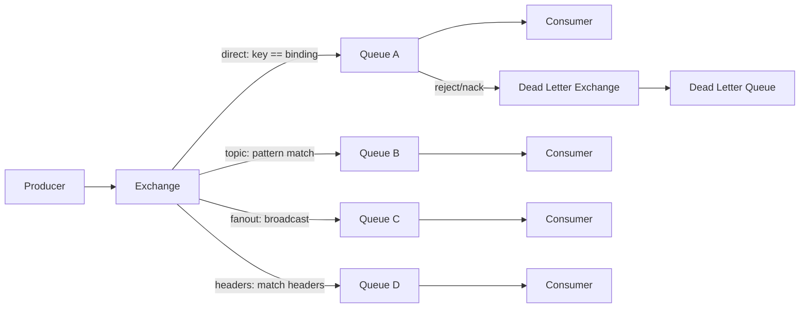

## Visión General

RabbitMQ es un message broker open-source que usa AMQP (Advanced Message
Queuing Protocol). Rutea mensajes entre producers y consumers con tipos de
exchange flexibles, entrega confiable y un montón de opciones de queue. Acá
cubrimos la arquitectura core, tipos de exchange, patrones de routing,
capacidades de queue, clustering y mejores prácticas de producción.

Para patrones relacionados, consultá [rabbitmq-dead-letter-queue](/recipes/rabbitmq-dead-letter-queue/)
para manejo de poison messages, [circuit-breaker-pattern](/patterns/circuit-breaker-pattern/)
para resiliencia de consumers, y nuestra [complete-guide-kafka-production](/guides/complete-guide-kafka-production/)
cuando necesites streaming en vez de routing de mensajes.
queue, clustering y mejores prácticas de producción.

## Cuándo Usar

- Necesitás routing flexible de mensajes: direct, topic, fanout o headers
  matching.
- Requests y replies entre servicios vía un message broker.
- Work queues que distribuyen tareas entre múltiples consumers competidores.
- Microservicios event-driven con producers y consumers desacoplados.
- Requerís acknowledgments por mensaje y manejo de dead letter.

### Cuándo evitarlo

- Agregación de logs o event sourcing de alto throughput donde necesitás replay
  por offset. Kafka es mejor para streaming y retención larga.
- Payloads de mensajes muy grandes. RabbitMQ funciona mejor con mensajes chicos.
- Replicación multi-región active-active no es nativa; usá streams o quorum
  queues mirroradas con cuidado.

## Arquitectura



### Componentes clave

```text
Producer → Exchange → (Binding + Routing Key) → Queue → Consumer
              ↑
         Tipos de Exchange:
         - Direct:  routing key == binding key
         - Topic:   routing key matchea patrón
         - Fanout:  broadcast a todas las queues bound
         - Headers: matchea headers del mensaje
```

- **Exchange**: recibe mensajes de producers y los rutea a queues.
- **Queue**: un buffer que almacena mensajes hasta que los consumers los
  procesen.
- **Binding**: un link entre un exchange y una queue con una regla de routing.
- **Routing key**: un string que el exchange revisa para decidir qué queue recibe el
  mensaje.
- **Connection**: el link TCP que tu cliente abre con el broker.
- **Channel**: una conexión virtual dentro de una conexión TCP. Los channels son baratos, así que una conexión TCP lleva todos los channels que
  un proceso necesita.

## Tipos de Exchange

### Direct exchange

Rutea mensajes a queues donde el routing key matchea exactamente el binding key.

```python
import pika

connection = pika.BlockingConnection(pika.ConnectionParameters("localhost"))
channel = connection.channel()

channel.exchange_declare(exchange="orders_direct", exchange_type="direct")

channel.queue_declare(queue="orders_created")
channel.queue_declare(queue="orders_cancelled")

channel.queue_bind(exchange="orders_direct", queue="orders_created", routing_key="created")
channel.queue_bind(exchange="orders_direct", queue="orders_cancelled", routing_key="cancelled")

channel.basic_publish(
    exchange="orders_direct",
    routing_key="created",
    body='{"order_id": 123, "total": 49.99}'
)

channel.basic_publish(
    exchange="orders_direct",
    routing_key="cancelled",
    body='{"order_id": 124, "reason": "customer_request"}'
)
```

### Topic exchange

Rutea mensajes matcheando patrones de routing key. `*` matchea una palabra; `#`
matchea cero o más palabras.

```python
channel.exchange_declare(exchange="logs_topic", exchange_type="topic")

channel.queue_bind(exchange="logs_topic", queue="all_errors", routing_key="*.error")
channel.queue_bind(exchange="logs_topic", queue="app_errors", routing_key="app.*")
channel.queue_bind(exchange="logs_topic", queue="all_logs", routing_key="#")

channel.basic_publish(exchange="logs_topic", routing_key="app.error", body="App error")
# → all_errors, app_errors, all_logs

channel.basic_publish(exchange="logs_topic", routing_key="db.warning", body="DB warning")
# → all_logs

channel.basic_publish(exchange="logs_topic", routing_key="api.error.critical", body="API critical")
# → all_errors, all_logs
```

### Fanout exchange

Broadcast a todas las queues bound, ignorando el routing key.

```python
channel.exchange_declare(exchange="notifications_fanout", exchange_type="fanout")

channel.queue_bind(exchange="notifications_fanout", queue="email_queue")
channel.queue_bind(exchange="notifications_fanout", queue="sms_queue")
channel.queue_bind(exchange="notifications_fanout", queue="push_queue")

channel.basic_publish(
    exchange="notifications_fanout",
    routing_key="",  # ignorado para fanout
    body='{"user_id": 123, "message": "Order shipped"}'
)
```

### Headers exchange

Rutea basado en headers del mensaje en vez del routing key.

```python
channel.exchange_declare(exchange="headers_exchange", exchange_type="headers")

channel.queue_bind(
    exchange="headers_exchange",
    queue="priority_orders",
    routing_key="",
    arguments={"x-match": "all", "priority": "high", "type": "order"}
)

channel.queue_bind(
    exchange="headers_exchange",
    queue="all_orders",
    routing_key="",
    arguments={"x-match": "any", "type": "order"}
)

channel.basic_publish(
    exchange="headers_exchange",
    routing_key="",
    body='{"order_id": 123}',
    properties=pika.BasicProperties(headers={"priority": "high", "type": "order"})
)
```

## Features de Queue

### Durable queues y persistent messages

Las durable queues sobreviven reinicios del broker. Los persistent messages se
escriben a disco.

```python
channel.queue_declare(queue="orders", durable=True)

channel.basic_publish(
    exchange="",
    routing_key="orders",
    body="order data",
    properties=pika.BasicProperties(delivery_mode=2)  # persistent
)
```

### Exclusive y auto-delete queues

```python
# solo accesible por la conexión declarante, borrada al desconectar
channel.queue_declare(queue="temp_queue", exclusive=True)

# borrada cuando el último consumer se desconecta
channel.queue_declare(queue="task_queue", auto_delete=True)
```

### Dead letter exchange

Mensajes que expiran, reciben rechazo o exceden límites de largo van a un dead
letter exchange.

```python
channel.exchange_declare(exchange="orders_dlx", exchange_type="direct")

channel.queue_declare(queue="orders_dead_letter")
channel.queue_bind(exchange="orders_dlx", queue="orders_dead_letter", routing_key="orders")

args = {
    "x-dead-letter-exchange": "orders_dlx",
    "x-dead-letter-routing-key": "orders",
    "x-message-ttl": 60000,
}
channel.queue_declare(queue="orders", arguments=args)

def process_message(ch, method, properties, body):
    try:
        process_order(json.loads(body))
        ch.basic_ack(delivery_tag=method.delivery_tag)
    except Exception:
        ch.basic_nack(delivery_tag=method.delivery_tag, requeue=False)
```

### Priority queues

```python
channel.queue_declare(queue="priority_orders", arguments={"x-max-priority": 10})

channel.basic_publish(
    exchange="",
    routing_key="priority_orders",
    body="urgent order",
    properties=pika.BasicProperties(priority=9)
)
```

## Patrones de Consumer

### Work queue (competing consumers)

Múltiples consumers comparten una queue. Cada mensaje va a exactamente
un consumer.

```python
def consume_tasks():
    channel.basic_qos(prefetch_count=1)
    channel.basic_consume(queue="tasks", on_message_callback=process_task)
    channel.start_consuming()

def process_task(ch, method, properties, body):
    try:
        do_work(json.loads(body))
        ch.basic_ack(delivery_tag=method.delivery_tag)
    except Exception:
        ch.basic_nack(delivery_tag=method.delivery_tag, requeue=True)
```

### Publish/subscribe

```python
def publish_notification(message):
    channel.basic_publish(exchange="notifications", routing_key="", body=json.dumps(message))

def email_consumer():
    channel.queue_declare(queue="email_notifications", exclusive=True)
    channel.queue_bind(exchange="notifications", queue="email_notifications")
    channel.basic_consume(queue="email_notifications", on_message_callback=send_email)
    channel.start_consuming()
```

### RPC (request/reply)

```python
import uuid

class RPCClient:
    def __init__(self):
        self.connection = pika.BlockingConnection(pika.ConnectionParameters("localhost"))
        self.channel = self.connection.channel()
        result = self.channel.queue_declare(queue="", exclusive=True)
        self.callback_queue = result.method.queue
        self.channel.basic_consume(queue=self.callback_queue, on_message_callback=self.on_response, auto_ack=True)

    def on_response(self, ch, method, props, body):
        if self.corr_id == props.correlation_id:
            self.response = body

    def call(self, message):
        self.response = None
        self.corr_id = str(uuid.uuid4())
        self.channel.basic_publish(
            exchange="",
            routing_key="rpc_queue",
            properties=pika.BasicProperties(
                reply_to=self.callback_queue,
                correlation_id=self.corr_id
            ),
            body=json.dumps(message)
        )
        while self.response is None:
            self.connection.process_data_events()
        return json.loads(self.response)

def on_request(ch, method, props, body):
    response = process_request(json.loads(body))
    ch.basic_publish(
        exchange="",
        routing_key=props.reply_to,
        properties=pika.BasicProperties(correlation_id=props.correlation_id),
        body=json.dumps(response)
    )
    ch.basic_ack(delivery_tag=method.delivery_tag)

channel.basic_qos(prefetch_count=1)
channel.basic_consume(queue="rpc_queue", on_message_callback=on_request)
channel.start_consuming()
```

## Clustering y Alta Disponibilidad

### Cluster setup

```bash
rabbitmqctl stop_app
rabbitmqctl join_cluster rabbit@rabbit1
rabbitmqctl start_app

rabbitmqctl cluster_status
```

### Quorum queues

Las quorum queues proveen queues replicadas y durables con consenso Raft.
Reemplazan a las classic mirrored queues.

```python
channel.queue_declare(queue="orders", durable=True, arguments={"x-queue-type": "quorum"})
```

### Mirrored queues (classic, deprecadas)

```bash
rabbitmqctl set_policy ha-orders "orders" \
  '{"ha-mode":"all","ha-sync-mode":"automatic"}'
```

Usá quorum queues para deployments nuevos.

## Performance Tuning

### Publisher confirms

```python
channel.confirm_delivery()

try:
    channel.basic_publish(
        exchange="orders",
        routing_key="created",
        body="order data",
        properties=pika.BasicProperties(delivery_mode=2),
        mandatory=True
    )
    print("Message confirmed")
except pika.exceptions.UnroutableError:
    print("Message was not routed to any queue")
```

### Prefetch optimization

```python
channel.basic_qos(prefetch_count=10)
```

Muy bajo y subutilizás el consumer. Muy alto y obtenés distribución injusta. La mayoría
de workloads funciona bien entre 10 y 100, dependiendo del tiempo de procesamiento.

### Connection y channel management

```python
connection = pika.BlockingConnection(pika.ConnectionParameters(
    host="rabbitmq",
    port=5672,
    virtual_host="/",
    credentials=pika.PlainCredentials("user", "password"),
    heartbeat=60,
    blocked_connection_timeout=300
))

# Los channels son livianos; multiplexá sobre una conexión
channel1 = connection.channel()
channel2 = connection.channel()
```

## Monitoreo

### Métricas clave

| Métrica | Descripción | Umbral de alerta |
| --- | --- | --- |
| Queue depth | Mensajes listos en queue | > 10.000 sostenido |
| Consumer count | Consumers activos por queue | < 1 para queues críticas |
| Publish rate | Mensajes publicados por segundo | Línea base + 200% |
| Deliver rate | Mensajes entregados por segundo | < publish rate sostenido |
| Unacked messages | Mensajes esperando ack | > 5.000 |
| Connection count | Conexiones abiertas | > 1.000 |
| Memory usage | Uso de RAM del broker | > 80% del watermark |

### Management API

```python
import requests

response = requests.get("http://rabbitmq:15672/api/queues", auth=("admin", "password"))

for queue in response.json():
    print(f"Queue: {queue['name']}")
    print(f"  Messages: {queue['messages']}")
    print(f"  Consumers: {queue['consumers']}")
    print(f"  Unacked: {queue['messages_unacknowledged']}")
```

## Mejores Prácticas

- Usá durable queues y persistent messages para datos críticos.
- Configurá un dead letter exchange para reintentos y poison messages.
- Habilitá publisher confirms para producers que no deben perder mensajes.
- Ajustá `prefetch_count` para la carga del consumer.
- Preferí quorum queues para alta disponibilidad en deployments nuevos.
- Ejecutá un cluster de 3+ nodos en producción.
- Reusá conexiones de larga vida y abrí un channel por cada publisher o consumer.
- Seteá heartbeats y blocked connection timeouts.
- Usá TLS para tráfico de clients e inter-broker.
- Scopeá permisos de usuarios por virtual host.
- Monitoreá queue depth, consumer count y uso de memoria.
- Programá `VACUUM` o mantenimiento equivalente y vigilá el espacio en disco.

## Errores Comunes

- Crear una conexión nueva por mensaje. Las conexiones son caras; los channels
  baratos.
- Dejar `prefetch_count` muy alto para que un consumer acapare mensajes.
- No configurar publisher confirms y perder mensajes ante fallas del broker.
- Enviar mensajes muy grandes por RabbitMQ. Usá un object store para payloads.
- Usar queues auto-delete o exclusive para consumers stateful.
- Olvidar ack o nack, dejando crecer el conteo de unacked.
- Usar classic mirrored queues en vez de quorum queues en clusters nuevos.
- No dimensionar el cluster en memoria y disco, causando pausas por flow control.

## Estrategia de Testing

Los consumers de RabbitMQ necesitan tres categorías de tests: correctitud del
procesamiento de mensajes, comportamiento de retry y dead-letter, e
idempotencia. En mi experiencia, los equipos testean el happy path pero saltan
los flujos de retry y DLX — y ahí es donde se esconden los bugs de producción.

### Acknowledgment del consumer

Testeá que tu consumer ackee en éxito y nackee en fallo:

```python
def test_consumer_acks_on_success(mock_channel):
    method = type('Method', (), {'delivery_tag': 1})()
    process_message(mock_channel, method, None, '{"order_id": 123}')
    mock_channel.basic_ack.assert_called_once_with(delivery_tag=1)

def test_consumer_nacks_on_failure(mock_channel):
    method = type('Method', (), {'delivery_tag': 1})()
    process_message(mock_channel, method, None, 'invalid json')
    mock_channel.basic_nack.assert_called_once_with(delivery_tag=1, requeue=False)
```

### Flujo de dead letter

Testeá que los mensajes rechazados terminen en la cola DLX:

```python
def test_poison_message_goes_to_dlx(rabbitmq_connection):
    channel = rabbitmq_connection.channel()
    channel.queue_declare(queue="test_dlx", arguments={
        "x-dead-letter-exchange": "test_dlx_exchange",
        "x-dead-letter-routing-key": "dead"
    })
    channel.basic_publish(exchange="", routing_key="test_dlx", body="poison")
    # Trigger rejection
    # Assert message appears in dead letter queue
    method, _, body = channel.basic_get(queue="dead", auto_ack=True)
    assert body == b"poison"
```

### Idempotencia

Los consumers deben manejar mensajes duplicados gracefulmente. Trackeá los IDs
procesados:

```python
def test_idempotent_consumer(redis_client):
    processor = IdempotentConsumer(redis_client)
    message = {"id": "msg-123", "payload": "data"}

    result1 = processor.process(message)
    result2 = processor.process(message)  # duplicado

    assert result1 is True
    assert result2 is True  # sin side effects, retorna success
    assert redis_client.exists("processed:msg-123")
```

## Consideraciones de Seguridad

- **TLS para todo el tráfico**: habilitá TLS para conexiones de clientes y
  tráfico inter-broker. RabbitMQ puede terminar TLS en el puerto 5671.
  Nunca corras producción con AMQP plaintext en el puerto 5672.
- **Autenticación**: usá SASL PLAIN o EXTERNAL (certificados x509) para auth
  de clientes. Evitá el usuario guest por defecto en producción — deshabilitalo
  completamente.
- **Permisos por virtual host**: scopeá los permisos de usuario por vhost. Un
  usuario con acceso a `orders-vhost` no debería ver `payments-vhost`. Usá
  `rabbitmqctl set_permissions` para restringir acceso de configure, write y
  read.
- **Seguridad de red**: poné RabbitMQ detrás de una red privada. Solo exponé
  el management plugin (puerto 15672) a través de una VPN o bastion host. Vi
  a equipos exponer la UI de management a internet "por conveniencia" — no lo
  hagas.
- **Gestión de credenciales**: guardá las credenciales de conexión en un secret
  manager (Vault, AWS Secrets Manager), no en variables de entorno o archivos
  de config commiteados a git. Rotá las credenciales regularmente.
- **Rate limiting**: capá `channel_max` y límites de conexión por usuario para
  que clientes mal comportados no agoten los recursos.

## See Also

- [Documentación de RabbitMQ](https://www.rabbitmq.com/documentation.html)
- [Especificación AMQP 0-9-1](https://www.rabbitmq.com/amqp-0-9-1-quickref.html)
- [Cliente Python pika](https://pypi.org/project/pika/)
- [Guía de Quorum Queues](https://www.rabbitmq.com/quorum-queues.html)
- [Guía de Clustering RabbitMQ](https://www.rabbitmq.com/clustering.html)
- [rabbitmq-dead-letter-queue](/recipes/rabbitmq-dead-letter-queue/)
- [retry-pattern](/patterns/retry-pattern/)

## FAQ

### ¿Cuándo usar RabbitMQ vs Kafka?

Usá RabbitMQ para routing complejo, RPC request/reply y acknowledgments por
mensaje. Usá Kafka para streaming de alto throughput, event sourcing y agregación
de logs, donde el orden dentro de particiones y retención larga importan más que
routing complejo.

### ¿Qué diferencia hay entre quorum queues y mirrored queues?

Las quorum queues usan consenso Raft para replicación y mayor consistencia. Las
mirrored queues usan un modelo master-slave. Recomendamos quorum queues para
deployments nuevos; las classic mirrored quedaron deprecadas.

### ¿Cómo manejo poison messages?

Usá un dead letter exchange. Configurá la queue con `x-dead-letter-exchange`.
Cuando un mensaje se rechaza sin requeue, expira o excede el max delivery count,
va al DLX. Monitoreá la dead letter queue e investigá la causa.

### ¿Qué es prefetch count y cómo setearlo?

El prefetch count limita la cantidad de mensajes unacknowledged que un consumer
puede tener. Empezá con 10. Incrementá para consumers rápidos, reducí para
lentos o cuando el orden importe.

### ¿Puede RabbitMQ garantizar exactly-once delivery?

No. RabbitMQ provee at-least-once delivery. Los consumers deben ser idempotentes
rastreando IDs de mensajes procesados o usando deduplicación.

### ¿Cuántas conexiones y channels debería usar?

Usá una conexión de larga vida por proceso y abrí un channel por cada publisher o
consumer. Evitá una conexión por request. Limitá los channels a algunas decenas por conexión.
Monitoreá el conteo de conexiones.
