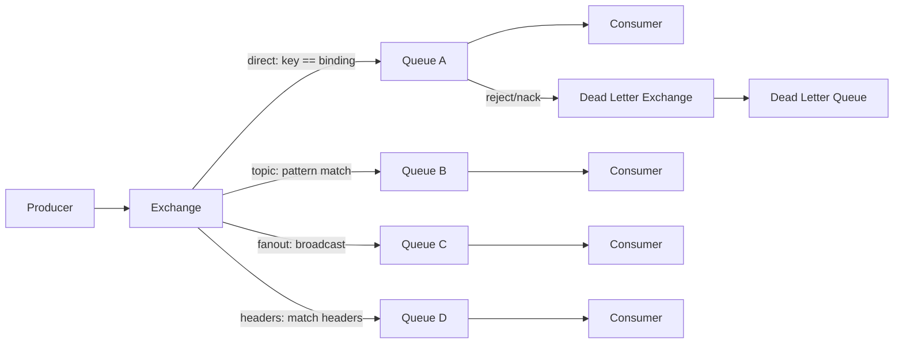

## Overview

RabbitMQ is an open-source message broker that speaks AMQP (Advanced Message
Queuing Protocol). It routes messages between producers and consumers with
flexible exchange types, reliable delivery, and a rich set of queue options. This guide
covers the core architecture, exchange types, routing patterns, queue
capabilities, clustering, and production best practices.

For related patterns, see [rabbitmq-dead-letter-queue](/recipes/rabbitmq-dead-letter-queue/)
for poison message handling, [circuit-breaker-pattern](/patterns/circuit-breaker-pattern/)
for consumer resilience, and our [complete-guide-kafka-production](/guides/complete-guide-kafka-production/)
when you need streaming instead of message routing.

## When to Use

- You need flexible message routing: direct, topic, fanout, or headers matching.
- Requests and replies between services via a message broker.
- Work queues that distribute tasks among several competing consumers.
- Event-driven microservices with decoupled producers and consumers.
- You require per-message acknowledgments and dead-letter handling.

### When to avoid

- High-throughput log aggregation or event sourcing where you need replay by
  offset. Kafka is a better fit for streaming and long retention.
- Very large message payloads. RabbitMQ performs best with small messages.
- Multi-region active-active replication isn't native; use streams or mirrored
  quorum queues carefully.

## Architecture



### Core components

```text
Producer → Exchange → (Binding + Routing Key) → Queue → Consumer
              ↑
         Exchange Types:
         - Direct:  routing key == binding key
         - Topic:   routing key matches pattern
         - Fanout:  broadcast to all bound queues
         - Headers: match message headers
```

- **Exchange**: receives messages from producers and routes them to queues.
- **Queue**: a FIFO buffer that holds messages until a consumer picks them up.
- **Binding**: a link between an exchange and a queue with a routing rule.
- **Routing key**: a string the exchange checks to decide which queue gets the
  message.
- **Connection**: the TCP link your client opens to the broker.
- **Channel**: a virtual connection inside a TCP connection. Channels are cheap, so one TCP connection carries all the channels a process
  needs.

## Exchange Types

### Direct exchange

Routes messages to queues where the routing key exactly matches the binding key.

```python
import pika

connection = pika.BlockingConnection(pika.ConnectionParameters("localhost"))
channel = connection.channel()

channel.exchange_declare(exchange="orders_direct", exchange_type="direct")

channel.queue_declare(queue="orders_created")
channel.queue_declare(queue="orders_cancelled")

channel.queue_bind(exchange="orders_direct", queue="orders_created", routing_key="created")
channel.queue_bind(exchange="orders_direct", queue="orders_cancelled", routing_key="cancelled")

channel.basic_publish(
    exchange="orders_direct",
    routing_key="created",
    body='{"order_id": 123, "total": 49.99}'
)

channel.basic_publish(
    exchange="orders_direct",
    routing_key="cancelled",
    body='{"order_id": 124, "reason": "customer_request"}'
)
```

### Topic exchange

Routes messages based on routing key patterns. `*` matches one word; `#` matches
zero or more words.

```python
channel.exchange_declare(exchange="logs_topic", exchange_type="topic")

channel.queue_bind(exchange="logs_topic", queue="all_errors", routing_key="*.error")
channel.queue_bind(exchange="logs_topic", queue="app_errors", routing_key="app.*")
channel.queue_bind(exchange="logs_topic", queue="all_logs", routing_key="#")

channel.basic_publish(exchange="logs_topic", routing_key="app.error", body="App error")
# → all_errors, app_errors, all_logs

channel.basic_publish(exchange="logs_topic", routing_key="db.warning", body="DB warning")
# → all_logs

channel.basic_publish(exchange="logs_topic", routing_key="api.error.critical", body="API critical")
# → all_errors, all_logs
```

### Fanout exchange

Broadcasts messages to all bound queues, ignoring the routing key.

```python
channel.exchange_declare(exchange="notifications_fanout", exchange_type="fanout")

channel.queue_bind(exchange="notifications_fanout", queue="email_queue")
channel.queue_bind(exchange="notifications_fanout", queue="sms_queue")
channel.queue_bind(exchange="notifications_fanout", queue="push_queue")

channel.basic_publish(
    exchange="notifications_fanout",
    routing_key="",  # ignored for fanout
    body='{"user_id": 123, "message": "Order shipped"}'
)
```

### Headers exchange

Routes based on message headers instead of routing keys.

```python
channel.exchange_declare(exchange="headers_exchange", exchange_type="headers")

channel.queue_bind(
    exchange="headers_exchange",
    queue="priority_orders",
    routing_key="",
    arguments={"x-match": "all", "priority": "high", "type": "order"}
)

channel.queue_bind(
    exchange="headers_exchange",
    queue="all_orders",
    routing_key="",
    arguments={"x-match": "any", "type": "order"}
)

channel.basic_publish(
    exchange="headers_exchange",
    routing_key="",
    body='{"order_id": 123}',
    properties=pika.BasicProperties(headers={"priority": "high", "type": "order"})
)
```

## Queue Features

### Durable queues and persistent messages

Durable queues survive broker restarts. Persistent messages are written to disk.

```python
channel.queue_declare(queue="orders", durable=True)

channel.basic_publish(
    exchange="",
    routing_key="orders",
    body="order data",
    properties=pika.BasicProperties(delivery_mode=2)  # persistent
)
```

### Exclusive and auto-delete queues

```python
# only accessible by the declaring connection, deleted on disconnect
channel.queue_declare(queue="temp_queue", exclusive=True)

# deleted when the last consumer disconnects
channel.queue_declare(queue="task_queue", auto_delete=True)
```

### Dead letter exchange

Messages that expire, are rejected, or exceed queue length limits go to a dead
letter exchange.

```python
channel.exchange_declare(exchange="orders_dlx", exchange_type="direct")

channel.queue_declare(queue="orders_dead_letter")
channel.queue_bind(exchange="orders_dlx", queue="orders_dead_letter", routing_key="orders")

args = {
    "x-dead-letter-exchange": "orders_dlx",
    "x-dead-letter-routing-key": "orders",
    "x-message-ttl": 60000,
}
channel.queue_declare(queue="orders", arguments=args)

def process_message(ch, method, properties, body):
    try:
        process_order(json.loads(body))
        ch.basic_ack(delivery_tag=method.delivery_tag)
    except Exception:
        ch.basic_nack(delivery_tag=method.delivery_tag, requeue=False)
```

### Priority queues

```python
channel.queue_declare(queue="priority_orders", arguments={"x-max-priority": 10})

channel.basic_publish(
    exchange="",
    routing_key="priority_orders",
    body="urgent order",
    properties=pika.BasicProperties(priority=9)
)
```

## Consumer Patterns

### Work queue (competing consumers)

Several consumers share a queue. Each message is processed by exactly one
consumer.

```python
def consume_tasks():
    channel.basic_qos(prefetch_count=1)
    channel.basic_consume(queue="tasks", on_message_callback=process_task)
    channel.start_consuming()

def process_task(ch, method, properties, body):
    try:
        do_work(json.loads(body))
        ch.basic_ack(delivery_tag=method.delivery_tag)
    except Exception:
        ch.basic_nack(delivery_tag=method.delivery_tag, requeue=True)
```

### Publish/subscribe

```python
def publish_notification(message):
    channel.basic_publish(exchange="notifications", routing_key="", body=json.dumps(message))

def email_consumer():
    channel.queue_declare(queue="email_notifications", exclusive=True)
    channel.queue_bind(exchange="notifications", queue="email_notifications")
    channel.basic_consume(queue="email_notifications", on_message_callback=send_email)
    channel.start_consuming()
```

### RPC (request/reply)

```python
import uuid

class RPCClient:
    def __init__(self):
        self.connection = pika.BlockingConnection(pika.ConnectionParameters("localhost"))
        self.channel = self.connection.channel()
        result = self.channel.queue_declare(queue="", exclusive=True)
        self.callback_queue = result.method.queue
        self.channel.basic_consume(queue=self.callback_queue, on_message_callback=self.on_response, auto_ack=True)

    def on_response(self, ch, method, props, body):
        if self.corr_id == props.correlation_id:
            self.response = body

    def call(self, message):
        self.response = None
        self.corr_id = str(uuid.uuid4())
        self.channel.basic_publish(
            exchange="",
            routing_key="rpc_queue",
            properties=pika.BasicProperties(
                reply_to=self.callback_queue,
                correlation_id=self.corr_id
            ),
            body=json.dumps(message)
        )
        while self.response is None:
            self.connection.process_data_events()
        return json.loads(self.response)

def on_request(ch, method, props, body):
    response = process_request(json.loads(body))
    ch.basic_publish(
        exchange="",
        routing_key=props.reply_to,
        properties=pika.BasicProperties(correlation_id=props.correlation_id),
        body=json.dumps(response)
    )
    ch.basic_ack(delivery_tag=method.delivery_tag)

channel.basic_qos(prefetch_count=1)
channel.basic_consume(queue="rpc_queue", on_message_callback=on_request)
channel.start_consuming()
```

## Clustering and High Availability

### Cluster setup

```bash
rabbitmqctl stop_app
rabbitmqctl join_cluster rabbit@rabbit1
rabbitmqctl start_app

rabbitmqctl cluster_status
```

### Quorum queues

Quorum queues give you replicated, durable queues with Raft consensus. They
replace classic mirrored queues.

```python
channel.queue_declare(queue="orders", durable=True, arguments={"x-queue-type": "quorum"})
```

### Mirrored queues (classic, deprecated)

```bash
rabbitmqctl set_policy ha-orders "orders" \
  '{"ha-mode":"all","ha-sync-mode":"automatic"}'
```

Use quorum queues for new deployments.

## Performance Tuning

### Publisher confirms

```python
channel.confirm_delivery()

try:
    channel.basic_publish(
        exchange="orders",
        routing_key="created",
        body="order data",
        properties=pika.BasicProperties(delivery_mode=2),
        mandatory=True
    )
    print("Message confirmed")
except pika.exceptions.UnroutableError:
    print("Message was not routed to any queue")
```

### Prefetch optimization

```python
channel.basic_qos(prefetch_count=10)
```

Too low underutilizes the consumer. Too high causes unfair distribution. I find
that most workloads land between 10 and 100, depending on processing time.

### Connection and channel management

```python
connection = pika.BlockingConnection(pika.ConnectionParameters(
    host="rabbitmq",
    port=5672,
    virtual_host="/",
    credentials=pika.PlainCredentials("user", "password"),
    heartbeat=60,
    blocked_connection_timeout=300
))

# Channels are lightweight; multiplex over one connection
channel1 = connection.channel()
channel2 = connection.channel()
```

## Monitoring

### Key metrics

| Metric | Description | Alert threshold |
| --- | --- | --- |
| Queue depth | Messages ready in queue | > 10,000 sustained |
| Consumer count | Active consumers per queue | < 1 for critical queues |
| Publish rate | Messages published per second | Baseline + 200% |
| Deliver rate | Messages delivered per second | < publish rate sustained |
| Unacked messages | Messages awaiting acknowledgment | > 5,000 |
| Connection count | Open connections | > 1,000 |
| Memory usage | Broker RAM usage | > 80% of watermark |

### Management API

```python
import requests

response = requests.get("http://rabbitmq:15672/api/queues", auth=("admin", "password"))

for queue in response.json():
    print(f"Queue: {queue['name']}")
    print(f"  Messages: {queue['messages']}")
    print(f"  Consumers: {queue['consumers']}")
    print(f"  Unacked: {queue['messages_unacknowledged']}")
```

## Best Practices

- Use durable queues and persistent messages for critical data.
- Configure a dead letter exchange for retries and poison messages.
- Enable publisher confirms for producers that must not lose messages.
- Tune `prefetch_count` for the consumer workload.
- Prefer quorum queues for high availability in new deployments.
- For production, run a cluster of at least 3 nodes.
- Reuse long-lived connections and open a channel for each publisher or consumer.
- Set heartbeats and blocked connection timeouts.
- Use TLS for client and inter-broker traffic.
- Scope user permissions per virtual host.
- Monitor queue depth, consumer count, and memory usage.
- Schedule `VACUUM` or equivalent maintenance and watch disk space.

## Common Mistakes

- Opening a new connection for every message. Connections are expensive; channels aren't.
- Leaving `prefetch_count` too high, causing one consumer to hoard messages.
- Not configuring publisher confirms and losing messages on broker failure.
- Sending very large messages through RabbitMQ. Use an object store for payloads.
- Using auto-delete or exclusive queues for stateful consumers.
- Forgetting to ack or nack messages, causing unacked counts to grow.
- Running classic mirrored queues instead of quorum queues in new clusters.
- Not sizing the cluster for memory and disk, leading to flow control pauses.

## Testing Strategy

RabbitMQ consumers need three categories of tests: message processing
correctness, retry and dead-letter behavior, and idempotency. In my experience,
teams test the happy path but skip the retry and DLX flows — and that's where
production bugs hide.

### Consumer acknowledgment

Test that your consumer acks on success and nacks on failure:

```python
def test_consumer_acks_on_success(mock_channel):
    method = type('Method', (), {'delivery_tag': 1})()
    process_message(mock_channel, method, None, '{"order_id": 123}')
    mock_channel.basic_ack.assert_called_once_with(delivery_tag=1)

def test_consumer_nacks_on_failure(mock_channel):
    method = type('Method', (), {'delivery_tag': 1})()
    process_message(mock_channel, method, None, 'invalid json')
    mock_channel.basic_nack.assert_called_once_with(delivery_tag=1, requeue=False)
```

### Dead letter flow

Test that rejected messages land in the DLX queue:

```python
def test_poison_message_goes_to_dlx(rabbitmq_connection):
    channel = rabbitmq_connection.channel()
    channel.queue_declare(queue="test_dlx", arguments={
        "x-dead-letter-exchange": "test_dlx_exchange",
        "x-dead-letter-routing-key": "dead"
    })
    channel.basic_publish(exchange="", routing_key="test_dlx", body="poison")
    # Trigger rejection
    # Assert message appears in dead letter queue
    method, _, body = channel.basic_get(queue="dead", auto_ack=True)
    assert body == b"poison"
```

### Idempotency

Consumers must handle duplicate messages gracefully. Track processed IDs:

```python
def test_idempotent_consumer(redis_client):
    processor = IdempotentConsumer(redis_client)
    message = {"id": "msg-123", "payload": "data"}

    result1 = processor.process(message)
    result2 = processor.process(message)  # duplicate

    assert result1 is True
    assert result2 is True  # no side effects, returns success
    assert redis_client.exists("processed:msg-123")
```

## Security Considerations

- **TLS for all traffic**: enable TLS for client connections and inter-broker
  traffic. RabbitMQ supports TLS termination on port 5671. Never run production
  with plaintext AMQP on port 5672.
- **Authentication**: use SASL PLAIN or EXTERNAL (x509 certificates) for client
  auth. Avoid the default guest user in production — disable it entirely.
- **Virtual host permissions**: scope user permissions per vhost. A user with
  access to `orders-vhost` should not see `payments-vhost`. Use
  `rabbitmqctl set_permissions` to restrict configure, write, and read access.
- **Network security**: keep RabbitMQ on a private network. Only expose
  the management plugin (port 15672) through a VPN or bastion host. I've seen
  teams expose the management UI to the internet "for convenience" — don't.
- **Credential management**: store connection credentials in a secret manager
  (Vault, AWS Secrets Manager), not in environment variables or config files
  committed to git. Rotate credentials regularly.
- **Rate limiting**: set `channel_max` and connection limits per user to
  stop misbehaving clients from exhausting resources.

## See Also

- [RabbitMQ Documentation](https://www.rabbitmq.com/documentation.html)
- [AMQP 0-9-1 Protocol Specification](https://www.rabbitmq.com/amqp-0-9-1-quickref.html)
- [pika Python client](https://pypi.org/project/pika/)
- [Quorum Queues Guide](https://www.rabbitmq.com/quorum-queues.html)
- [RabbitMQ Clustering Guide](https://www.rabbitmq.com/clustering.html)
- [rabbitmq-dead-letter-queue](/recipes/rabbitmq-dead-letter-queue/)
- [retry-pattern](/patterns/retry-pattern/)

## FAQ

### When should I use RabbitMQ vs Kafka?

Use RabbitMQ for complex routing, request/reply RPC, and per-message
acknowledgment. Use Kafka for high-throughput streaming, event sourcing, and log
aggregation where ordering within partitions and long retention matter more than
complex routing.

### What is the difference between quorum queues and mirrored queues?

Quorum queues use Raft consensus for replication and stronger consistency.
Mirrored queues use a master-slave model. Quorum queues are recommended for new
RabbitMQ deployments; classic mirrored queues are deprecated.

### How do I handle poison messages?

Set up a dead letter exchange. Configure the queue with `x-dead-letter-exchange`.
When a message is rejected without requeue, expires, or exceeds the max delivery
count, it goes to the DLX. Monitor the dead letter queue and investigate.

### What is prefetch count and how should I set it?

Prefetch count limits the number of unacknowledged messages a consumer can hold.
Start with 10. Increase for fast consumers, decrease for slow consumers or when
strict ordering matters.

### Can RabbitMQ guarantee exactly-once delivery?

No. RabbitMQ provides at-least-once delivery. Consumers must be idempotent by
tracking processed message IDs or using deduplication logic.

### How many connections and channels should I use?

Use one long-lived connection per process and open a channel for each publisher or consumer. Don't spin up a
connection per request. Limit channels to a few dozen per connection. Monitor
connection count.
