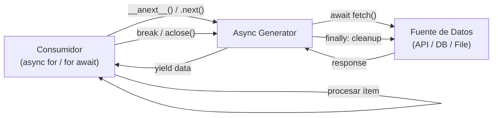

## Descripción General

Cargar un dataset completo en memoria causa errores de out-of-memory y alta
latencia. El patrón Async Generator produce valores de forma perezosa: el
consumidor pide el siguiente valor y el generador lo produce solo cuando está
listo. Esto permite procesar secuencias infinitas, archivos grandes o fuentes I/O
lentas con uso constante de memoria.

Para alternativas push-based, consultá
[reactive-streams-pattern](/patterns/reactive-streams-pattern/). Si necesitás
procesamiento paralelo, el [producer-consumer-pattern](/patterns/producer-consumer-pattern/)
es mejor opción.

## Cuándo Usar

- Procesar archivos o datasets que no caben en memoria.
- Consumir streams continuos, como mensajes WebSocket, eventos SSE o tail de
  logs.
- Fetch de APIs paginadas a través de una interfaz de iteración limpia.
- Necesitás backpressure: el consumidor controla el ritmo del productor.
- Stream de resultados de base de datos sin cargar el result set completo.

### Cuándo evitarlo

- Procesamiento CPU-bound. Los async generators corren en un solo event loop, así
  que trabajo pesado lo bloquea. Usá worker threads o procesos.
- Composición compleja de streams. Filtrar, mapear, mergear y splitear es más
  fácil con reactive streams como RxJS o Project Reactor.
- La fuente de datos ya está en memoria. Usá un generador regular o un `for`.
- El consumidor necesita acceso aleatorio. Los generadores son secuenciales.

## Solución

### Python

```python
import asyncio
import aiohttp

async def fetch_pages(base_url, total_pages, page_size=100):
    async with aiohttp.ClientSession() as session:
        for offset in range(0, total_pages, page_size):
            url = f"{base_url}?offset={offset}&limit={page_size}"
            async with session.get(url) as response:
                data = await response.json()
                if not data:
                    break
                yield data

async def process_all():
    total = 0
    async for page in fetch_pages("https://api.example.com/items", 10000):
        for item in page:
            total += item["price"]
        print(f"Processed page, running total: {total}")

    print(f"Final total: {total}")

asyncio.run(process_all())
```

### JavaScript

```javascript
async function* fetchPages(baseUrl, totalPages, pageSize = 100) {
  for (let offset = 0; offset < totalPages; offset += pageSize) {
    const url = `${baseUrl}?offset=${offset}&limit=${pageSize}`;
    const response = await fetch(url);
    const data = await response.json();
    if (data.length === 0) break;
    yield data;
  }
}

async function processAll() {
  let total = 0;
  for await (const page of fetchPages("https://api.example.com/items", 10000)) {
    for (const item of page) {
      total += item.price;
    }
    console.log(`Processed page, running total: ${total}`);
  }
  console.log(`Final total: ${total}`);
}

processAll();
```

### Java (Stream perezoso)

```java
import java.net.http.HttpClient;
import java.net.http.HttpRequest;
import java.net.http.HttpResponse;
import java.net.URI;
import java.util.stream.Stream;
import com.fasterxml.jackson.databind.ObjectMapper;

public class LazyStream {

    private static final HttpClient client = HttpClient.newHttpClient();
    private static final ObjectMapper mapper = new ObjectMapper();

    public static Stream<Item[]> fetchPages(String baseUrl, int totalPages, int pageSize) {
        return Stream.iterate(0, offset -> offset < totalPages, offset -> offset + pageSize)
            .map(offset -> {
                try {
                    String url = baseUrl + "?offset=" + offset + "&limit=" + pageSize;
                    HttpRequest request = HttpRequest.newBuilder().uri(URI.create(url)).build();
                    HttpResponse<String> response = client.send(request, HttpResponse.BodyHandlers.ofString());
                    return mapper.readValue(response.body(), Item[].class);
                } catch (Exception e) {
                    throw new RuntimeException(e);
                }
            })
            .takeWhile(items -> items.length > 0);
    }
}
```

Los Java Streams son perezosos pero no verdaderamente async. Para iteración no
bloqueante async, usá `Flux` de [Project Reactor](https://projectreactor.io/).

## Explicación

Un async generator pausa la ejecución en cada `yield` y se reanuda cuando el
consumidor pide el siguiente valor. El consumidor impulsa el flujo con `async
for` en Python o `for await` en JavaScript. Esto crea un **modelo pull-based**:
los datos se producen solo cuando se piden.



El beneficio principal es **uso constante de memoria**. Ya sean 100 ítems o 10
millones, el generador mantiene solo el valor o batch actual. También te da
**backpressure** natural: si el consumidor es lento, el generador simplemente
espera. Para profundizar en el runtime async de Python, consultá la
[guía completa de asyncio en producción](/guides/complete-guide-python-asyncio-production/).

## Variantes

| Variante | Lenguaje | Caso de uso | Tradeoff |
| --- | --- | --- | --- |
| Async generator | Python `async def` + `yield` | Iteración I/O async nativa | Single event loop |
| Async generator | JavaScript `async function*` | Streams en browser/Node.js | Single event loop |
| `Stream` perezoso | Java `Stream` | I/O secuencial perezosa | Bloqueante por defecto |
| `Flux` | Project Reactor | Streams async con backpressure | Extra dependency |
| Batches | Python/JS `yield` lists | Reducir overhead por ítem | Mayor latencia por batch |

## Mejores Prácticas

- Producí batches en vez de ítems individuales para reducir el overhead de
  context switch.
- Limpiá recursos en bloques `finally` o context managers para que sesiones y
  cursores se cierren aunque el consumidor salga temprano.
- Seteá timeouts en cada I/O `await` para evitar que una llamada colgada bloquee
  el generador.
- Manejá cancelación explícitamente. En Python, llamá `await gen.aclose()` para
  cerrar el generador; en JavaScript, usá `gen.return()`. Ambos disparan
  bloques `finally` para cleanup.
- Preferí `async for` sobre llamadas manuales a `__anext__` o `.next()`.
- Logueá progreso en generadores de larga duración, pero no en cada yield.
- Usá colas acotadas o producer-consumer cuando necesités procesamiento
  paralelo, porque `asyncio.gather` sobre valores yield rompe el backpressure.

## Errores Comunes

- Juntar todos los valores en una lista con `list(async_generator())`. Vi esto
  en código de producción más veces de las que me gustaría admitir. Carga todo
  en memoria y anula el propósito.
- No cerrar el generador al salir del loop temprano, lo que puede filtrar sesiones
  o conexiones.
- Usar I/O bloqueante dentro del generador, como `requests.get()` en vez de
  `aiohttp`.
- Mezclar iteración sync y async. Usá `async for` / `for await`, no un `for`
  común.
- Ignorar el backpressure pre-fetchando páginas adelante del consumidor.
- Ejecutar trabajo CPU-intensivo dentro del generador y bloquear el event loop.

## Estrategia de Testing

Los async generators necesitan tres capas de tests: correctitud, limpieza de
recursos y propagación de errores. En mi experiencia, la mayoría de los equipos
omite los tests de limpieza, que es donde están los bugs reales.

### Correctitud

Consumí una cantidad pequeña de ítems y verificá que los valores coincidan:

```python
import pytest

@pytest.mark.asyncio
async def test_fetch_pages_yields_data():
    pages = []
    async for page in fetch_pages("https://api.example.com/items", 100, page_size=10):
        pages.append(page)
        if len(pages) >= 3:
            break
    assert len(pages) == 3
    assert all(isinstance(p, list) for p in pages)
```

```javascript
test('fetchPages yields data', async () => {
  const pages = [];
  for await (const page of fetchPages("https://api.example.com/items", 100, 10)) {
    pages.push(page);
    if (pages.length >= 3) break;
  }
  expect(pages).toHaveLength(3);
  expect(pages.every(p => Array.isArray(p))).toBe(true);
});
```

### Limpieza de recursos

El test crítico: ¿el generador cierra sesiones y conexiones cuando el consumidor
sale temprano? Mockeá la sesión y verificá que se llamó `close()`:

```python
@pytest.mark.asyncio
async def test_session_closed_on_break():
    async with mock_session() as session:
        gen = fetch_pages("https://api.example.com/items", 1000)
        async for _ in gen:
            break
        await gen.aclose()
    assert session.closed
```

### Propagación de errores

Verificá que las excepciones dentro del generador lleguen al consumidor y
disparen cleanup:

```python
@pytest.mark.asyncio
async def test_error_propagates_and_cleans_up():
    with pytest.raises(RuntimeError):
        async for page in failing_generator():
            pass
    # Verificar que se hizo cleanup
    assert mock_resource.closed
```

## Consideraciones de Seguridad

- **Resource leaks**: los generadores que no limpian sesiones, cursores o
  conexiones al salir temprano filtran recursos. Una vez rastreé un incidente
  de producción donde un `async for` roto filtró 200+ cursores de DB en una
  hora. Siempre usá bloques `finally` o context managers.
- **Generadores sin límite**: un generador que produce infinitamente sin timeout
  puede explotarse como vector de DoS. Seteá un max de iteraciones o un timeout
  de wall-clock del lado del consumidor.
- **Datos sensibles en logs**: si logueás progreso dentro del generador,
  asegurate de no loguear request bodies, auth headers o PII. Logueá solo
  metadata como page count y elapsed time.
- **Validación de input**: validá `base_url`, `page_size` y `total_pages` antes
  del primer yield. Un caller malicioso o mal configurado puede inyectar URLs
  malas o causar integer overflow en el cálculo de offset.
- **Rate limiting**: cuando fetchás de APIs de terceros, agregá rate limiting
  del lado cliente. Aprendí esto por las malas cuando un async generator sin
  throttling martilló una API y nos banearon la IP temporalmente.

## Monitoreo

Trackeá estas métricas para cualquier async generator de larga duración:

| Métrica | Qué te dice | Threshold de alerta |
| --- | --- | --- |
| items_yielded_total | Throughput del generador | Caída súbita a 0 |
| yield_duration_p99 | Latencia por yield | > 5s (depende de la fuente) |
| active_generators | Generadores concurrentes corriendo | > 100 (tuneá para tu runtime) |
| generator_errors_total | Tasa de errores | > 1% de items_yielded |
| resource_leaks | Sesiones/conexiones no cerradas | > 0 |

En Python, instrumentá con `prometheus_client`:

```python
from prometheus_client import Counter, Histogram

items_yielded = Counter('generator_items_yielded_total', 'Total items yielded')
yield_duration = Histogram('generator_yield_duration_seconds', 'Yield latency')

async def monitored_fetch_pages(base_url, total_pages, page_size=100):
    async with aiohttp.ClientSession() as session:
        for offset in range(0, total_pages, page_size):
            with yield_duration.time():
                # ... fetch logic ...
                items_yielded.inc(len(data))
                yield data
```

## See Also

- [Documentación de Python asyncio](https://docs.python.org/3/library/asyncio.html)
- [MDN: Async iteration](https://developer.mozilla.org/en-US/docs/Web/JavaScript/Reference/Statements/for-await...of)
- [Project Reactor Flux](https://projectreactor.io/docs/core/release/reference/#flux)
- [Documentación de Java Stream](https://docs.oracle.com/en/java/javase/21/docs/api/java.base/java/util/stream/Stream.html)
- [Documentación de aiohttp](https://docs.aiohttp.org/en/stable/)
- [Documentación de RxJS](https://rxjs.dev/guide/overview)
- [PEP 525: Asynchronous Generators](https://peps.python.org/pep-0525/)
- [reactive-streams-pattern](/patterns/reactive-streams-pattern/)

## FAQ

### ¿En qué se diferencia un async generator de un generador regular?

Un generador regular usa `yield` de forma síncrona. Un async generator usa
`async def` y `yield` y puede hacer `await` de I/O, lo que lo hace adecuado para
APIs, bases de datos y archivos.

### ¿Los async generators pueden ser infinitos?

Sí. Un generador que nunca retorna sigue produciendo. El consumidor controla
cuándo parar con `break` o cerrando el generador. Lo usé para streams de
mensajes WebSocket y datos de sensores, donde querés procesar eventos al llegar
sin bufferizar.

### ¿Cómo cancelo un async generator a mitad de iteración?

En Python, `await gen.aclose()`. En JavaScript, `await gen.return()`. Ambos
ejecutan código de limpieza en bloques `finally`.

### ¿Cuál es la diferencia entre async generators y reactive streams?

Los async generators son pull-based: el consumidor pide cada valor. Los reactive
streams son push-based: el productor empuja valores y el consumidor aplica
backpressure. Los generadores son más simples; los reactive streams ofrecen mayor
composición y buffering.

### ¿Cómo manejo errores dentro del generador?

Las excepciones levantadas en el generador se propagan al consumidor. Envolver el
`async for` en `try/except` o `try/catch`. El generador se cierra automáticamente
al propagarse una excepción.

### ¿Cómo compongo múltiples generadores?

En Python, `yield from another_async_gen()`. En JavaScript,
`yield* anotherAsyncGen()`. Ambos encadenan generadores preservando el
modelo pull-based.

### ¿Cómo testeo async generators?

Consumí el generador con `async for` o `for await` y recolectá una cantidad
pequeña de resultados. Testeá la terminación temprana saliendo del loop y
verificando que los recursos se liberen.
