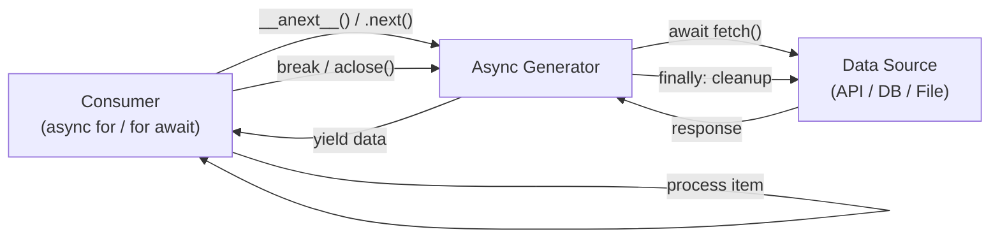

## Overview

Loading an entire dataset into memory causes out-of-memory errors and high
latency. The Async Generator pattern produces values lazily: the consumer asks
for the next value and the generator yields it only when it's ready. This makes
it possible to process infinite sequences, large files, or slow I/O sources with
constant memory usage.

For push-based alternatives, see
[reactive-streams-pattern](/patterns/reactive-streams-pattern/). If you need
parallel processing, the [producer-consumer-pattern](/patterns/producer-consumer-pattern/)
is a better fit.

## When to Use

- Processing files or datasets that don't fit in memory.
- Consuming continuous data streams, such as WebSocket messages, SSE events, or
  log tails.
- Fetching paginated APIs through a clean iteration interface.
- You need backpressure: the consumer controls the producer's pace.
- Streaming database results without loading the full result set.

### When to avoid

- CPU-bound processing. Async generators run on a single event loop, so heavy
  computation blocks it. Use worker threads or processes instead.
- Complex stream composition. Filtering, mapping, merging, and splitting are
  easier with reactive streams like RxJS or Project Reactor.
- If your data source already fits in memory, skip the generator and use a
  regular `for` loop.
- If you need to jump around and access elements by index, generators won't
  help — they only go forward.

## Solution

### Python

```python
import asyncio
import aiohttp

async def fetch_pages(base_url, total_pages, page_size=100):
    async with aiohttp.ClientSession() as session:
        for offset in range(0, total_pages, page_size):
            url = f"{base_url}?offset={offset}&limit={page_size}"
            async with session.get(url) as response:
                data = await response.json()
                if not data:
                    break
                yield data

async def process_all():
    total = 0
    async for page in fetch_pages("https://api.example.com/items", 10000):
        for item in page:
            total += item["price"]
        print(f"Processed page, running total: {total}")

    print(f"Final total: {total}")

asyncio.run(process_all())
```

### JavaScript

```javascript
async function* fetchPages(baseUrl, totalPages, pageSize = 100) {
  for (let offset = 0; offset < totalPages; offset += pageSize) {
    const url = `${baseUrl}?offset=${offset}&limit=${pageSize}`;
    const response = await fetch(url);
    const data = await response.json();
    if (data.length === 0) break;
    yield data;
  }
}

async function processAll() {
  let total = 0;
  for await (const page of fetchPages("https://api.example.com/items", 10000)) {
    for (const item of page) {
      total += item.price;
    }
    console.log(`Processed page, running total: ${total}`);
  }
  console.log(`Final total: ${total}`);
}

processAll();
```

### Java (lazy Stream)

```java
import java.net.http.HttpClient;
import java.net.http.HttpRequest;
import java.net.http.HttpResponse;
import java.net.URI;
import java.util.stream.Stream;
import com.fasterxml.jackson.databind.ObjectMapper;

public class LazyStream {

    private static final HttpClient client = HttpClient.newHttpClient();
    private static final ObjectMapper mapper = new ObjectMapper();

    public static Stream<Item[]> fetchPages(String baseUrl, int totalPages, int pageSize) {
        return Stream.iterate(0, offset -> offset < totalPages, offset -> offset + pageSize)
            .map(offset -> {
                try {
                    String url = baseUrl + "?offset=" + offset + "&limit=" + pageSize;
                    HttpRequest request = HttpRequest.newBuilder().uri(URI.create(url)).build();
                    HttpResponse<String> response = client.send(request, HttpResponse.BodyHandlers.ofString());
                    return mapper.readValue(response.body(), Item[].class);
                } catch (Exception e) {
                    throw new RuntimeException(e);
                }
            })
            .takeWhile(items -> items.length > 0);
    }
}
```

Java Streams are lazy but not truly async. For non-blocking async iteration, use
[Project Reactor](https://projectreactor.io/) `Flux`.

## Explanation

An async generator pauses execution at each `yield` and resumes when the consumer
asks for the next value. The consumer drives the flow with `async for` in Python
or `for await` in JavaScript. This creates a **pull-based model**: the generator
only produces data when someone asks for it.



The core benefit is **constant memory usage**. Whether you process 100 items
or 10 million, the generator holds only the current value or batch. You also
get natural **backpressure**: if the consumer is slow, the generator just
waits. For more on Python's async runtime, see the
[complete-guide-python-asyncio-production](/guides/complete-guide-python-asyncio-production/).

## Variants

| Variant | Language | Use case | Tradeoff |
| --- | --- | --- | --- |
| Async generator | Python `async def` + `yield` | Native async I/O iteration | Single event loop |
| Async generator | JavaScript `async function*` | Browser/Node.js streams | Single event loop |
| Lazy `Stream` | Java `Stream` | Lazy sequential I/O | Blocking by default |
| `Flux` | Project Reactor | Backpressure-aware async streams | Extra dependency |
| Batches | Python/JS `yield` lists | Reduce per-item overhead | Higher latency per batch |

## Best Practices

- Yield batches instead of individual items to reduce context-switching overhead.
- Clean up resources in `finally` blocks or context managers so sessions and
  cursors close even if the consumer breaks early.
- Set timeouts on every I/O `await` to avoid a hung call blocking the generator.
- Handle cancellation explicitly. In Python, call `await gen.aclose()` to close
  the generator; in JavaScript, use `gen.return()`. Both trigger `finally`
  blocks for cleanup.
- Prefer `async for` over manual `__anext__` or `.next()` calls.
- Log progress for long-running generators, but not on every yield.
- Use bounded queues or a producer-consumer setup when you need parallel
  processing, because `asyncio.gather` on yielded values breaks backpressure.

## Common Mistakes

- Collecting all values into a list with `list(async_generator())`. This loads
  everything into memory and defeats the purpose.
- Not closing the generator when breaking out of the loop early, which can leak
  sessions or connections.
- Using blocking I/O inside the generator, such as Python `requests.get()`
  instead of `aiohttp`.
- Mixing sync and async iteration. Use `async for` / `for await`, not a regular
  `for`.
- Ignoring backpressure by pre-fetching pages ahead of the consumer.
- Running CPU-heavy work inside the generator and blocking the event loop.

## Testing Strategy

Async generators need three layers of tests: correctness, resource cleanup, and
error propagation. Most teams skip the cleanup tests — that's where the real
bugs hide. Don't be that team.

### Correctness

Consume a small number of items and verify the values match expectations:

```python
import pytest

@pytest.mark.asyncio
async def test_fetch_pages_yields_data():
    pages = []
    async for page in fetch_pages("https://api.example.com/items", 100, page_size=10):
        pages.append(page)
        if len(pages) >= 3:
            break
    assert len(pages) == 3
    assert all(isinstance(p, list) for p in pages)
```

```javascript
test('fetchPages yields data', async () => {
  const pages = [];
  for await (const page of fetchPages("https://api.example.com/items", 100, 10)) {
    pages.push(page);
    if (pages.length >= 3) break;
  }
  expect(pages).toHaveLength(3);
  expect(pages.every(p => Array.isArray(p))).toBe(true);
});
```

### Resource cleanup

The critical test: does the generator close sessions and connections when the
consumer breaks early? Mock the session and verify `close()` was called:

```python
@pytest.mark.asyncio
async def test_session_closed_on_break():
    async with mock_session() as session:
        gen = fetch_pages("https://api.example.com/items", 1000)
        async for _ in gen:
            break
        await gen.aclose()
    assert session.closed
```

### Error propagation

Verify that exceptions inside the generator reach the consumer and trigger
cleanup:

```python
@pytest.mark.asyncio
async def test_error_propagates_and_cleans_up():
    with pytest.raises(RuntimeError):
        async for page in failing_generator():
            pass
    # Verify cleanup happened
    assert mock_resource.closed
```

## Security Considerations

- **Resource leaks**: generators that don't clean up sessions, cursors, or
  connections on early exit leak resources. I once tracked a production incident
  where a broken `async for` loop leaked 200+ database cursors in an hour.
  Always use `finally` blocks or context managers.
- **Unbounded generators**: a generator that yields infinitely without timeout
  becomes a DoS vector. Set a max iteration count or a wall-clock timeout on
  the consumer side.
- **Sensitive data in logs**: if you log progress inside the generator, make
  sure you're not logging request bodies, auth headers, or PII. Log only
  metadata like page count and elapsed time.
- **Input validation**: always check `base_url`, `page_size`, and `total_pages`
  before the first yield. A malicious or misconfigured caller can inject bad
  URLs or cause integer overflow in the offset calculation.
- **Rate limiting**: when fetching from third-party APIs, add client-side rate
  limiting. I learned this the hard way when an async generator without
  throttling hammered an API and got our IP temporarily banned.

## Monitoring

Track these metrics for any long-running async generator:

| Metric | What it tells you | Alert threshold |
| --- | --- | --- |
| items_yielded_total | Throughput of the generator | Sudden drop to 0 |
| yield_duration_p99 | Latency per yield | > 5s (depends on source) |
| active_generators | Concurrent generators running | > 100 (tune for your runtime) |
| generator_errors_total | Error rate | > 1% of items_yielded |
| resource_leaks | Sessions/connections not closed | > 0 |

In Python, instrument with `prometheus_client`:

```python
from prometheus_client import Counter, Histogram

items_yielded = Counter('generator_items_yielded_total', 'Total items yielded')
yield_duration = Histogram('generator_yield_duration_seconds', 'Yield latency')

async def monitored_fetch_pages(base_url, total_pages, page_size=100):
    async with aiohttp.ClientSession() as session:
        for offset in range(0, total_pages, page_size):
            with yield_duration.time():
                # ... fetch logic ...
                items_yielded.inc(len(data))
                yield data
```

## See Also

- [Python asyncio documentation](https://docs.python.org/3/library/asyncio.html)
- [MDN: Async iteration](https://developer.mozilla.org/en-US/docs/Web/JavaScript/Reference/Statements/for-await...of)
- [Project Reactor Flux](https://projectreactor.io/docs/core/release/reference/#flux)
- [Java Stream documentation](https://docs.oracle.com/en/java/javase/21/docs/api/java.base/java/util/stream/Stream.html)
- [aiohttp documentation](https://docs.aiohttp.org/en/stable/)
- [RxJS documentation](https://rxjs.dev/guide/overview)
- [PEP 525: Asynchronous Generators](https://peps.python.org/pep-0525/)
- [reactive-streams-pattern](/patterns/reactive-streams-pattern/)

## FAQ

### How is an async generator different from a regular generator?

A regular generator uses `yield` synchronously. An async generator uses `async
def` and `yield` and can `await` I/O, making it suitable for APIs, databases,
and files.

### Can async generators be infinite?

Yes. A generator that never returns keeps yielding. The consumer controls when
to stop with `break` or by closing the generator. Useful for WebSocket messages
or sensor streams.

### How do I cancel an async generator mid-iteration?

In Python, use `await gen.aclose()`. In JavaScript, call `await gen.return()`.
Both run cleanup code in `finally` blocks.

### What is the difference between async generators and reactive streams?

Async generators are pull-based: the consumer requests each value. Reactive
streams are push-based: the producer pushes values and the consumer applies
backpressure. Generators are simpler; reactive streams offer richer composition
and buffering.

### How do I handle errors inside the generator?

Exceptions raised inside the generator propagate to the consumer. Wrap the
`async for` loop in `try/except` or `try/catch`. The generator closes
automatically when an exception propagates.

### How do I compose multiple generators?

In Python, use `yield from another_async_gen()`. In JavaScript, use
`yield* anotherAsyncGen()`. Both chain generators while preserving the
pull-based model.

### How do I test async generators?

Consume the generator with `async for` or `for await` and collect a small number
of results. Test early termination by breaking out of the loop and verifying that
resources are released.
