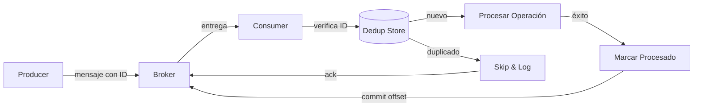

## Resumen

El Patrón de Consumidor Idempotente garantiza que los mensajes de una cola o
flujo de eventos se procesen exactamente una vez, incluso si se entregan varias
veces. Reintentos de red, fallas del consumidor y garantías de entrega
al-menos-una-vez generan duplicados. [Kafka](https://kafka.apache.org/documentation/#semantics)
usa at-least-once por defecto; [SQS](https://docs.aws.amazon.com/AWSSimpleQueueService/latest/SQSDeveloperGuide/sqs-message-lifecycle.html)
puede redeliverar si el consumidor no borra el mensaje a tiempo.

En lugar de depender del broker para una semántica exactamente-una-vez, el
consumidor se diseña para ser idempotente: procesar el mismo mensaje dos veces
produce el mismo resultado que procesarlo una sola vez. [Martin Fowler](https://martinfowler.com/articles/patterns-of-distributed-systems/idempotent-receiver.html)
lo describe como el patrón "Idempotent Receiver", donde el receptor deduplica
basándose en un identificador de mensaje.

## Cuándo Usar

- Consumir mensajes de una cola o stream donde los duplicados son posibles.
- Procesamiento de pagos, cumplimiento de pedidos o actualizaciones de inventario
  donde duplicados causarían cobros extra, envíos dobles o inconsistencias de
  stock. Una vez rastreé un bug de billing hasta un consumidor que cobró la misma
  orden tres veces porque la tabla de dedup no tenía unique constraint.
- Integración con webhooks o callbacks de terceros que reintentan automáticamente.
- Usar Kafka, SQS, RabbitMQ o brokers similares con entrega al-menos-una-vez.
- Implementar microservicios event-driven donde cada evento debe manejarse
  exactamente una vez. Consultá el [Inbox Pattern](/es/patterns/inbox-pattern/)
  como alternativa.

### Cuándo evitarlo

- El broker ya te da semántica exactamente-una-vez (transacciones Kafka + EOS,
  SQS FIFO con deduplicación). No reinventes lo que el broker ya provee.
- Operaciones de solo lectura donde los duplicados no causan daño.
- El overhead de deduplicación es más caro que manejar duplicados ocasionales.
  Para una cola de notificaciones de bajo tráfico, la dedup puede no valer la pena.
- Notificaciones simples fire-and-forget donde la entrega duplicada es aceptable.

## Solución

### Python (consumidor Kafka con deduplicación)

```python
import json
import sqlite3
from datetime import datetime
from kafka import KafkaConsumer

class IdempotentConsumer:
    def __init__(self, bootstrap_servers, topic, db_path="processed.db"):
        self.consumer = KafkaConsumer(
            topic,
            bootstrap_servers=bootstrap_servers,
            auto_offset_reset="earliest",
            enable_auto_commit=False,
            group_id="idempotent-group",
        )
        self.db = sqlite3.connect(db_path)
        self._init_table()

    def _init_table(self):
        self.db.execute("""
            CREATE TABLE IF NOT EXISTS processed (
                message_id TEXT PRIMARY KEY,
                processed_at TIMESTAMP DEFAULT CURRENT_TIMESTAMP
            )
        """)
        self.db.commit()

    def is_processed(self, message_id: str) -> bool:
        cursor = self.db.execute(
            "SELECT 1 FROM processed WHERE message_id = ?",
            (message_id,)
        )
        return cursor.fetchone() is not None

    def mark_processed(self, message_id: str):
        self.db.execute(
            "INSERT INTO processed (message_id) VALUES (?)",
            (message_id,)
        )
        self.db.commit()

    def process_message(self, message):
        event = json.loads(message.value)
        message_id = event["id"]

        if self.is_processed(message_id):
            print(f"Skipping duplicate: {message_id}")
            return

        self._upsert_order(
            order_id=event["order_id"],
            amount=event["amount"],
            status=event["status"],
        )

        self.mark_processed(message_id)

    def _upsert_order(self, order_id: str, amount: float, status: str):
        print(f"Upserting order {order_id}: ${amount} ({status})")

    def run(self):
        for message in self.consumer:
            try:
                self.process_message(message)
                self.consumer.commit()
            except Exception as e:
                print(f"Error processing {message.offset}: {e}")

if __name__ == "__main__":
    consumer = IdempotentConsumer(
        bootstrap_servers=["localhost:9092"],
        topic="orders",
    )
    consumer.run()
```

### Java (Spring Kafka)

```java
import org.springframework.kafka.annotation.KafkaListener;
import org.springframework.stereotype.Service;
import org.springframework.transaction.annotation.Transactional;

import java.time.Instant;
import java.util.Set;
import java.util.concurrent.ConcurrentHashMap;

@Service
public class IdempotentOrderConsumer {

    private final ProcessedMessageRepository repository;
    private final OrderService orderService;
    private final Set<String> processedIds = ConcurrentHashMap.newKeySet();

    public IdempotentOrderConsumer(ProcessedMessageRepository repository,
                                   OrderService orderService) {
        this.repository = repository;
        this.orderService = orderService;
        processedIds.addAll(repository.findRecentIds());
    }

    @KafkaListener(topics = "orders", groupId = "order-group")
    @Transactional
    public void consumeOrderEvent(OrderEvent event) {
        String eventId = event.getEventId();

        if (processedIds.contains(eventId) || repository.existsByEventId(eventId)) {
            processedIds.add(eventId);
            return;
        }

        orderService.upsertOrder(
            event.getOrderId(),
            event.getAmount(),
            event.getStatus()
        );

        repository.save(new ProcessedMessage(eventId));
        processedIds.add(eventId);
    }
}

@Entity
public class ProcessedMessage {
    @Id
    private String eventId;
    private Instant processedAt = Instant.now();

    // constructor, getters, setters
}
```

### JavaScript (Node.js con Redis)

```javascript
const { Kafka } = require("kafkajs");
const Redis = require("ioredis");

class IdempotentConsumer {
    constructor() {
        this.kafka = new Kafka({ brokers: ["localhost:9092"] });
        this.consumer = this.kafka.consumer({ groupId: "order-group" });
        this.redis = new Redis();
    }

    async start() {
        await this.consumer.connect();
        await this.consumer.subscribe({ topic: "orders", fromBeginning: false });

        await this.consumer.run({
            eachMessage: async ({ message }) => {
                const event = JSON.parse(message.value.toString());
                const eventId = event.id;

                const isProcessed = await this.redis.get(`processed:${eventId}`);
                if (isProcessed) {
                    console.log(`Skipping duplicate: ${eventId}`);
                    return;
                }

                await this.upsertOrder(event);
                await this.redis.setex(`processed:${eventId}`, 604800, "1");
            },
        });
    }

    async upsertOrder(event) {
        await db.query(
            `
            INSERT INTO orders (id, amount, status, updated_at)
            VALUES ($1, $2, $3, NOW())
            ON CONFLICT (id) DO UPDATE SET
                amount = EXCLUDED.amount,
                status = EXCLUDED.status,
                updated_at = NOW()
            `,
            [event.order_id, event.amount, event.status]
        );
    }
}
```

### Claves de idempotencia para APIs

```javascript
class IdempotentAPIClient {
    constructor(apiClient, idempotencyStore) {
        this.api = apiClient;
        this.store = idempotencyStore;
    }

    async chargePayment(paymentRequest) {
        const idempotencyKey = paymentRequest.orderId;

        const cached = await this.store.get(idempotencyKey);
        if (cached) {
            return JSON.parse(cached);
        }

        const result = await this.api.post("/charges", paymentRequest, {
            headers: { "Idempotency-Key": idempotencyKey },
        });

        await this.store.setex(idempotencyKey, 86400, JSON.stringify(result));
        return result;
    }
}
```

## Explicación

Los consumidores idempotentes usan una ventana de deduplicación para trackear
qué mensajes ya procesaron. La ventana debe exceder la ventana máxima de redelivery del
broker. Si tu broker redelivera dentro de 24 horas, una ventana de dedup de 7
días te da bastante margen.



El diagrama muestra el flujo de deduplicación: el consumidor verifica la tienda
de dedup antes de procesar, salta duplicados, y solo marca el mensaje como
procesado después de que la operación tiene éxito.

1. **Extraer un identificador único** de cada mensaje (event ID, message key o
   hash determinístico).
2. **Verificar la tienda de deduplicación** antes de procesar (base de datos,
   Redis o Bloom filter).
3. **Realizar una operación idempotente** (upsert, actualización condicional o
   transición de state machine segura para repetir).
4. **Registrar el mensaje como procesado** solo después de que la operación tenga éxito.
5. **Comiteá el offset** después de registrar el éxito.

Si el consumidor falla entre el paso 3 y 4, el broker redelivera el mensaje. Como el paso
3 es idempotente, reprocesarlo no causa daño. Para un enfoque relacionado que
guarda los mensajes entrantes antes de procesarlos, consultá el [Inbox Pattern](/es/patterns/inbox-pattern/).

## Variantes

| Variante | Estrategia | Ideal para |
| --- | --- | --- |
| Deduplicación con base de datos | Tabla `processed_messages` con constraint único | Consistencia fuerte, throughput moderado |
| Deduplicación con Redis | `SETEX` con TTL sobre IDs procesados | Alto throughput, ventanas cortas |
| Bloom filter | Chequeo probabilístico de membresía | Muy alto throughput, falsos positivos aceptables |
| Claves de idempotencia | Clave generada por el client para APIs | Integraciones de terceros, APIs de pago |
| Idempotencia natural | Operaciones inherentemente seguras de repetir | Update-if-newer, agregaciones `max()` |

## Mejores Prácticas

- Usar IDs de mensaje determinísticos asignados por el producer. Debugueé
  sistemas donde cada reintento generaba un UUID nuevo. La dedup era inútil.
- Hacer que la operación de negocio misma sea idempotente. La deduplicación es un
  safety net, no un sustituto de operaciones idempotentes.
- Seteá el TTL de la tienda de deduplicación a la ventana máxima de redelivery que esperás.
  Guardarla para siempre te deja una tabla que crece sin límite.
- Mantener la lógica de deduplicación separada de la lógica de negocio para
  facilitar tests.
- Logueá los duplicados que salteás para detectar misconfiguración del producer o
  del broker. Un pico repentino suele significar que algo está mal upstream.
- Manejar mensajes fuera de orden con timestamps o sequence numbers. Vi esto
  morder a equipos que usaban consumidores paralelos sin garantías de orden.

## Errores Comunes

- Marcar un mensaje como procesado antes de completar la operación. Si el
  consumidor crashea a mitad de operación, el mensaje se pierde.
- Usar IDs de mensaje no determinísticos, como un nuevo UUID en cada reintento.
  Vi esto más veces de las que me gustaría admitir.
- Ignorar el orden con las particiones de Kafka. Las particiones preservan orden;
  los consumidores paralelos no.
- Ejecutar deduplicación en base de datos sin aislamiento adecuado, causando race
  conditions. Usá `SELECT ... FOR UPDATE` o unique constraints.
- Guardar todos los IDs procesados para siempre, creando una tabla sin límites.
  Agregá un TTL o una estrategia de archival.
- Depender de deduplicación cuando la operación no es naturalmente idempotente.
  Si `charge(amount)` no es idempotente, la dedup no te salva.

## Ejemplos Reales

**Stripe** usa claves de idempotencia para todas las mutaciones. Enviás una
clave única con tu request; Stripe almacena el par request/response y devuelve la
respuesta en cache para duplicados dentro de 24 horas. Esto es lo que popularizó
`Idempotency-Key` como header HTTP.

**SQS FIFO** te da procesamiento exactamente-una-vez con IDs de deduplicación. Un
intervalo de 5 minutos descarta envíos duplicados con el mismo ID a nivel de
queue. Lo usé para procesamiento de órdenes donde el costo de duplicados era alto.

**Uber** usa un dual-write pattern: los consumidores guardan offsets procesados en
Kafka y una tabla de deduplicación de Cassandra. Al reiniciar, consultan Cassandra
para evitar reprocesar durante rebalancing. Esto maneja el gap entre el commit de
offset de Kafka y la escritura a Cassandra.

## Estrategia de Testing

### Tests de lógica de deduplicación

Testeá la tienda de dedup de forma aislada. Insertá un message ID, después
verificá que el mismo ID se rechace en la segunda llamada. Vi a equipos saltarse
esto y descubrir race conditions en producción.

```python
def test_dedup_rejects_duplicate():
    store = DedupStore()
    assert store.is_new("msg-1") is True
    assert store.is_new("msg-1") is False
```

### Tests de operación idempotente

Verificá que la operación de negocio produzca el mismo resultado al llamarse dos
veces con el mismo input. Para upserts, el estado de la fila debe ser igual
después de una o dos llamadas.

### Tests de recuperación de crash

Simulá un crash a mitad de camino, justo entre la operación y la marca de dedup. El mensaje debe
redeliverarse y reprocesarse sin side effects. Usá un script de test que mate el
consumidor a mitad de procesamiento.

## Consideraciones de Seguridad

- **Validar integridad del mensaje**: chequeá HMAC o firmas antes de procesar
  para que los mensajes forjados no pasen.
- **Isolar acceso a la tienda de dedup**: usá credenciales separadas para la
  tabla de dedup para que un servicio comprometido no pueda leer los IDs
  procesados de otros consumidores.
- **Encriptar payloads sensibles**: si los mensajes contienen PII, encriptalos
  at rest en la tienda de dedup.
- **Auditar picos de duplicados**: un pico repentino de duplicados puede indicar
  un producer mal configurado o un replay attack. Logueá y alertá sobre el hit rate de la dedup.
- **TTL en la tienda de dedup**: limitá el storage para que un atacante no pueda
  agotarlo flooding IDs únicos.

## See Also

- [Idempotency-Key Header](https://developer.mozilla.org/en-US/docs/Glossary/Idempotency_key):
  referencia MDN del header HTTP.
- [Stripe Idempotency](https://stripe.com/docs/api/idempotent_requests):
  ejemplo de producción de claves de idempotencia en una API de pagos.
- [Kafka Consumer Groups](https://kafka.apache.org/documentation/#consumerconfigs):
  referencia de configuración de consumidores Kafka.
- [AWS SQS FIFO](https://docs.aws.amazon.com/AWSSimpleQueueService/latest/SQSDeveloperGuide/FIFO-queues.html):
  procesamiento exactamente-una-vez a nivel de queue.
- [Inbox Pattern](/es/patterns/inbox-pattern/): patrón relacionado para
  procesamiento confiable de mensajes.
- [Retry Pattern](/es/patterns/retry-pattern/): manejo de fallas transientes
  con reintentos.

## FAQ

### ¿En qué se diferencia de los exactly-once semantics de Kafka (EOS)?

EOS te da procesamiento exactamente-una-vez entre topics de Kafka cuando
usás Kafka Streams. El Patrón de Consumidor Idempotente funciona para cualquier consumidor
que escriba en cualquier sistema externo (base de datos, API, archivo) y no
requiere transacciones de Kafka.

### ¿Qué ventana de deduplicación debería usar?

Como mínimo, mayor que la ventana máxima de redelivery. Valores típicos: 7 días
para eventos de negocio, 24 horas para webhooks, 5 minutos para métricas de alta
frecuencia.

### ¿Debería usar base de datos o Redis para deduplicación?

Redis para alto throughput y ventanas cortas. Base de datos para consistencia
fuerte, audit trails y ventanas largas. Muchos sistemas usan Redis como hot cache
y la base de datos como source of truth.

### ¿Qué pasa si el producer no puede agregar IDs de mensaje?

Generá un ID determinístico a partir del contenido, como
`hash(topic + partition + offset)`. Cuidado: cualquier cambio de payload entre
reintentos rompe la deduplicación.

### ¿Cómo manejo mensajes fuera de orden?

Incluí un timestamp o sequence number en la lógica de deduplicación. Procesá el
mensaje solo si es más nuevo que el último procesado para la misma entidad.

### ¿Es adecuado para proyectos pequeños?

Para sistemas pequeños con pocos componentes, el patrón puede agregar
complejidad que no necesitás. Empezá simple e introducilo cuando tengas el problema que
resuelve.

### ¿Cómo se compara con el Inbox Pattern?

El Inbox Pattern guarda los mensajes entrantes en una tabla local antes de
procesarlos, lo que ayuda con deduplicación y reintentos. El Patrón de Consumidor
Idempotente se enfoca en que el consumidor sea seguro ante redeliveries. Pueden
combinarse.
