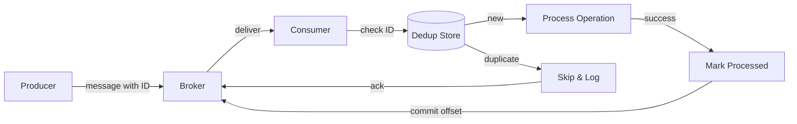

## Overview

The Idempotent Consumer Pattern makes sure messages from a queue or event stream
are processed exactly once, even when they're delivered more than once. Network
retries, consumer failures, and at-least-once delivery guarantees all create
duplicates. [Kafka](https://kafka.apache.org/documentation/#semantics) defaults
to at-least-once; [SQS](https://docs.aws.amazon.com/AWSSimpleQueueService/latest/SQSDeveloperGuide/sqs-message-lifecycle.html)
may redeliver if a consumer doesn't delete in time.

Instead of relying on the broker for exactly-once semantics, the consumer itself
is designed to be idempotent: processing the same message twice produces the
same end result as processing it once. [Martin Fowler](https://martinfowler.com/articles/patterns-of-distributed-systems/idempotent-receiver.html)
describes this as the "Idempotent Receiver" pattern, where the receiver deduplicates
based on a message identifier.

## When to Use

- Consuming messages from a queue or stream where duplicates are possible.
- Payment processing, order fulfillment, or inventory updates where duplicates
  would overcharge, ship twice, or mess up stock. I once
  traced a billing bug to a consumer that charged the same order three times
  because the dedup table was missing a unique constraint.
- Integrating with third-party webhooks or callbacks that retry automatically.
- Using Kafka, SQS, RabbitMQ, or similar brokers with at-least-once delivery.
- Building event-driven microservices where each event must be handled
  exactly once. See the [Inbox Pattern](/patterns/inbox-pattern/) for an
  alternative.

### When to avoid

- The broker already gives you exactly-once semantics (Kafka transactions + EOS,
  SQS FIFO with deduplication). Don't reinvent what the broker already gives you.
- Read-only operations where duplicates cause no harm.
- The deduplication overhead is more expensive than handling occasional
  duplicates. For a low-traffic notification queue, dedup may not be worth it.
- Simple fire-and-forget notifications where duplicate delivery is acceptable.

## Solution

### Python (Kafka consumer with deduplication)

```python
import json
import sqlite3
from datetime import datetime
from kafka import KafkaConsumer

class IdempotentConsumer:
    def __init__(self, bootstrap_servers, topic, db_path="processed.db"):
        self.consumer = KafkaConsumer(
            topic,
            bootstrap_servers=bootstrap_servers,
            auto_offset_reset="earliest",
            enable_auto_commit=False,
            group_id="idempotent-group",
        )
        self.db = sqlite3.connect(db_path)
        self._init_table()

    def _init_table(self):
        self.db.execute("""
            CREATE TABLE IF NOT EXISTS processed (
                message_id TEXT PRIMARY KEY,
                processed_at TIMESTAMP DEFAULT CURRENT_TIMESTAMP
            )
        """)
        self.db.commit()

    def is_processed(self, message_id: str) -> bool:
        cursor = self.db.execute(
            "SELECT 1 FROM processed WHERE message_id = ?",
            (message_id,)
        )
        return cursor.fetchone() is not None

    def mark_processed(self, message_id: str):
        self.db.execute(
            "INSERT INTO processed (message_id) VALUES (?)",
            (message_id,)
        )
        self.db.commit()

    def process_message(self, message):
        event = json.loads(message.value)
        message_id = event["id"]

        if self.is_processed(message_id):
            print(f"Skipping duplicate: {message_id}")
            return

        self._upsert_order(
            order_id=event["order_id"],
            amount=event["amount"],
            status=event["status"],
        )

        self.mark_processed(message_id)

    def _upsert_order(self, order_id: str, amount: float, status: str):
        print(f"Upserting order {order_id}: ${amount} ({status})")

    def run(self):
        for message in self.consumer:
            try:
                self.process_message(message)
                self.consumer.commit()
            except Exception as e:
                print(f"Error processing {message.offset}: {e}")

if __name__ == "__main__":
    consumer = IdempotentConsumer(
        bootstrap_servers=["localhost:9092"],
        topic="orders",
    )
    consumer.run()
```

### Java (Spring Kafka)

```java
import org.springframework.kafka.annotation.KafkaListener;
import org.springframework.stereotype.Service;
import org.springframework.transaction.annotation.Transactional;

import java.time.Instant;
import java.util.Set;
import java.util.concurrent.ConcurrentHashMap;

@Service
public class IdempotentOrderConsumer {

    private final ProcessedMessageRepository repository;
    private final OrderService orderService;
    private final Set<String> processedIds = ConcurrentHashMap.newKeySet();

    public IdempotentOrderConsumer(ProcessedMessageRepository repository,
                                   OrderService orderService) {
        this.repository = repository;
        this.orderService = orderService;
        processedIds.addAll(repository.findRecentIds());
    }

    @KafkaListener(topics = "orders", groupId = "order-group")
    @Transactional
    public void consumeOrderEvent(OrderEvent event) {
        String eventId = event.getEventId();

        if (processedIds.contains(eventId) || repository.existsByEventId(eventId)) {
            processedIds.add(eventId);
            return;
        }

        orderService.upsertOrder(
            event.getOrderId(),
            event.getAmount(),
            event.getStatus()
        );

        repository.save(new ProcessedMessage(eventId));
        processedIds.add(eventId);
    }
}

@Entity
public class ProcessedMessage {
    @Id
    private String eventId;
    private Instant processedAt = Instant.now();

    // constructor, getters, setters
}
```

### JavaScript (Node.js with Redis)

```javascript
const { Kafka } = require("kafkajs");
const Redis = require("ioredis");

class IdempotentConsumer {
    constructor() {
        this.kafka = new Kafka({ brokers: ["localhost:9092"] });
        this.consumer = this.kafka.consumer({ groupId: "order-group" });
        this.redis = new Redis();
    }

    async start() {
        await this.consumer.connect();
        await this.consumer.subscribe({ topic: "orders", fromBeginning: false });

        await this.consumer.run({
            eachMessage: async ({ message }) => {
                const event = JSON.parse(message.value.toString());
                const eventId = event.id;

                const isProcessed = await this.redis.get(`processed:${eventId}`);
                if (isProcessed) {
                    console.log(`Skipping duplicate: ${eventId}`);
                    return;
                }

                await this.upsertOrder(event);
                await this.redis.setex(`processed:${eventId}`, 604800, "1");
            },
        });
    }

    async upsertOrder(event) {
        await db.query(
            `
            INSERT INTO orders (id, amount, status, updated_at)
            VALUES ($1, $2, $3, NOW())
            ON CONFLICT (id) DO UPDATE SET
                amount = EXCLUDED.amount,
                status = EXCLUDED.status,
                updated_at = NOW()
            `,
            [event.order_id, event.amount, event.status]
        );
    }
}
```

### Idempotency keys for API calls

```javascript
class IdempotentAPIClient {
    constructor(apiClient, idempotencyStore) {
        this.api = apiClient;
        this.store = idempotencyStore;
    }

    async chargePayment(paymentRequest) {
        const idempotencyKey = paymentRequest.orderId;

        const cached = await this.store.get(idempotencyKey);
        if (cached) {
            return JSON.parse(cached);
        }

        const result = await this.api.post("/charges", paymentRequest, {
            headers: { "Idempotency-Key": idempotencyKey },
        });

        await this.store.setex(idempotencyKey, 86400, JSON.stringify(result));
        return result;
    }
}
```

## Explanation

Idempotent consumers use a deduplication window to track processed messages. The
window must exceed the maximum redelivery window of the broker. If your broker
redelivers within 24 hours, a 7-day dedup window gives you plenty of margin.



The diagram shows the deduplication flow: the consumer checks the dedup store
before processing, skips duplicates, and only marks the message as processed
after the operation succeeds.

1. **Extract a unique identifier** from each message (event ID, message key, or
   deterministic hash).
2. **Check the deduplication store** before processing (database, Redis, or Bloom
   filter).
3. **Perform an idempotent operation** (upsert, conditional update, or state
   machine transition that's safe to repeat).
4. **Record the message as processed** only after the operation succeeds.
5. **Commit the offset** after recording success.

If the consumer crashes between step 3 and 4, the broker redelivers the message. Because
step 3 is idempotent, reprocessing causes no harm. For a related approach that
stores incoming messages before processing, see the [Inbox Pattern](/patterns/inbox-pattern/).

## Variants

| Variant | Strategy | Best for |
| --- | --- | --- |
| Database deduplication | `processed_messages` table with unique constraint | Strong consistency, moderate throughput |
| Redis deduplication | `SETEX` with TTL on processed IDs | High throughput, short windows |
| Bloom filter | Probabilistic membership check | Very high throughput, acceptable false positives |
| Idempotency keys | Client-generated key for API calls | Third-party integrations, payment APIs |
| Natural idempotency | Operations safe to repeat by design | Update-if-newer, `max()` aggregations |

## Best Practices

- Use deterministic message IDs assigned by the producer. I've debugged systems
  where each retry generated a new UUID. Dedup was useless.
- Make the business operation itself idempotent. Deduplication is a safety net,
  not a substitute for idempotent operations.
- TTL the deduplication store to the maximum redelivery window. Keeping it
  forever creates an unbounded table.
- Keep deduplication logic separate from business logic for easier testing.
- Log skipped duplicates to detect producer or broker misconfiguration. A sudden
  spike usually means something's wrong upstream.
- Handle out-of-order messages with timestamps or sequence numbers. I've watched
  this bite teams that run parallel consumers without ordering guarantees.

## Common Mistakes

- Marking a message as processed before the operation completes. If the consumer
  crashes mid-operation, the message is lost.
- Using non-deterministic message IDs, like a fresh UUID on each retry. I've
  watched this happen more times than I'd like to admit.
- Ignoring ordering with Kafka partition semantics. Partitions preserve order;
  parallel consumers don't.
- Running database deduplication without proper isolation, causing race
  conditions. Use `SELECT ... FOR UPDATE` or unique constraints.
- Storing every processed ID forever, creating an unbounded table. Add a TTL or
  archival strategy.
- Relying on deduplication when the operation isn't naturally idempotent. If
  `charge(amount)` isn't idempotent, dedup won't save you.

## Real-World Examples

**Stripe** uses idempotency keys for all mutation requests. You send a unique
key with your request; Stripe keeps the request/response pair and returns the
cached response for any duplicate within 24 hours. That's what popularized
`Idempotency-Key` as an HTTP header.

**SQS FIFO** gives you exactly-once processing with deduplication IDs. A 5-minute
interval drops duplicate sends with the same ID at the queue level. I've used
this for order processing where the cost of duplicates was high.

**Uber** uses a dual-write pattern: consumers store processed offsets in both
Kafka and a Cassandra deduplication table. On restart, they query Cassandra to
avoid reprocessing during rebalancing. This handles the gap between Kafka offset
commit and Cassandra write.

## Testing Strategy

### Deduplication logic tests

Test the dedup store in isolation. Insert a message ID, then confirm that the same ID
gets rejected on the second call. I've seen teams skip this and discover race
conditions in production.

```python
def test_dedup_rejects_duplicate():
    store = DedupStore()
    assert store.is_new("msg-1") is True
    assert store.is_new("msg-1") is False
```

### Idempotent operation tests

Verify the business operation produces the same result when called twice with
the same input. For upserts, this means the row state matches after one or two
calls.

### Crash recovery tests

Simulate a crash between the operation and the dedup mark. The message should get
redelivered and reprocessed without side effects. Use a test script that kills
the consumer mid-processing.

## Security Considerations

- **Validate message integrity**: check HMAC or signatures before you process, so
  forged messages don't get through.
- **Isolate dedup store access**: use separate credentials for the dedup table so
  a compromised service can't read other consumers' IDs.
- **Encrypt sensitive payloads**: if messages contain PII, encrypt them at rest
  in the dedup store.
- **Audit duplicate spikes**: a sudden spike in duplicates may indicate a
  misconfigured producer or a replay attack. Log and alert on dedup hit rate.
- **TTL the dedup store**: bound the storage so an attacker can't exhaust it by
  flooding unique IDs.

## See Also

- [Idempotency-Key Header](https://developer.mozilla.org/en-US/docs/Glossary/Idempotency_key):
  MDN reference for the HTTP header.
- [Stripe Idempotency](https://stripe.com/docs/api/idempotent_requests):
  production example of idempotency keys in a payments API.
- [Kafka Consumer Groups](https://kafka.apache.org/documentation/#consumerconfigs):
  Kafka consumer configuration reference.
- [AWS SQS FIFO](https://docs.aws.amazon.com/AWSSimpleQueueService/latest/SQSDeveloperGuide/FIFO-queues.html):
  exactly-once processing at the queue level.
- [Inbox Pattern](/patterns/inbox-pattern/): related pattern for reliable
  message processing.
- [Retry Pattern](/patterns/retry-pattern/): handling transient failures with
  retries.

## FAQ

### How is this different from Kafka exactly-once semantics (EOS)?

EOS gives you exactly-once processing between Kafka topics in Kafka Streams. The
Idempotent Consumer Pattern works for any consumer writing to any external system
(database, API, file) and doesn't require Kafka transactions.

### What deduplication window should I use?

At minimum, longer than the maximum redelivery window. Typical values: 7 days for
business events, 24 hours for webhooks, 5 minutes for high-frequency metrics.

### Should I use a database or Redis for deduplication?

Redis for high throughput and short windows. A database for strong consistency,
audit trails, and longer windows. Many systems use Redis as a hot cache with the
database as the source of truth.

### What if the producer cannot add message IDs?

Generate a deterministic ID from the message content, such as
`hash(topic + partition + offset)`. Be careful: any payload change between retries
breaks deduplication.

### How do I handle out-of-order messages?

Include a timestamp or sequence number in the deduplication logic. Only process a
message if it's newer than the last processed one for the same entity.

### Is this pattern suitable for small projects?

For small systems with few components, the pattern may add complexity you don't
need. Start simple and introduce it when you hit the problems it solves.

### How does this pattern compare to the Inbox Pattern?

The Inbox Pattern stores incoming messages in a local table before processing,
which also helps with deduplication and retries. The Idempotent Consumer Pattern
focuses on making the consumer itself safe to redeliver. They can be combined.
