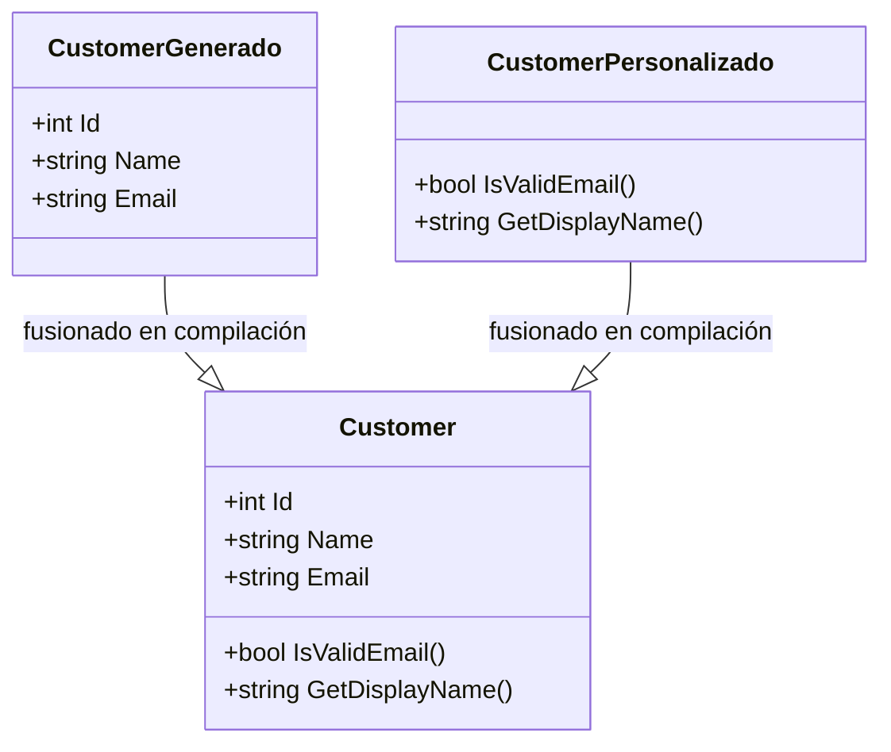

## Descripción General

El Patrón Partial Class divide la definición de una única clase en dos o más
archivos fuente. En tiempo de compilación, los fragmentos se fusionan en un
único tipo. Esta separación permite que el código generado automáticamente viva
en un archivo mientras que las personalizaciones escritas a mano vivan en otro,
así los generadores no sobrescriben tus cambios.

C# tiene soporte nativo con `partial class`, pero otros lenguajes pueden
aproximar el mismo objetivo. Ruby reabre clases, Python puede hacer
monkey-patching, y Java usa métodos default de interfaces o herencia. La ganancia
es una organización del código más limpia, y el binario compilado no paga nada
extra.

Imaginate un equipo que usa Entity Framework Core para hacer scaffolding de
entidades de base de datos. La herramienta regenera `Customer.cs` cada vez que el
esquema cambia, pero el equipo también necesita validaciones personalizadas y
propiedades computadas. Con partial classes mantienen el archivo generado intacto
y escriben su lógica en `Customer.Custom.cs`. El compilador
fusiona ambos archivos, así el runtime ve una única clase `Customer` con todos
los miembros.

## Cuándo Usar

Usá el Patrón Partial Class cuando:

- Un generador de código genera boilerplate repetitivo que se va a sobrescribir en la próxima ejecución.
- Querés que la lógica de negocio escrita a mano no se mezcle con el código
  scaffolded.
- Dos o más desarrolladores necesitan modificar partes distintas de la misma
  clase sin merge conflicts constantes.
- Una clase grande se vuelve legible si la dividís por responsabilidades reales:
  validación en un archivo, serialización en otro, persistencia en un tercero.
- Usás un source generator o un code-behind de Razor que produce la mitad de la
  clase y escribís la otra mitad a mano.

### Cuándo evitar

- Si la clase entra en una sola pantalla sin scrollear, no la partas.
- Las divisiones generan dependencias circulares o navegación confusa.
- El lenguaje no soporta tipos parciales nativamente y los workarounds agregan
  complejidad.
- Usás el patrón principalmente porque la clase creció demasiado; ahí conviene
  extraer clases más chicas. En ese caso, mirá el
  [Patrón Strategy](/patterns/strategy-pattern/) o el
  [Patrón Decorator](/patterns/decorator-pattern/) para dividir comportamiento
  sin partir el tipo.

## Solución

### C# (`partial` nativo)

```csharp
// AutoGenerated.cs — generado por herramienta, no editar
public partial class Customer
{
    public int Id { get; set; }
    public string Name { get; set; }
    public string Email { get; set; }
}

// Customer.Custom.cs — lógica de negocio escrita a mano
public partial class Customer
{
    public bool IsValidEmail()
    {
        return Email?.Contains("@") ?? false;
    }

    public string GetDisplayName()
    {
        return $"{Name} <{Email}>";
    }
}
```

### Python

Python no tiene partial classes, pero podés reabrir y hacer monkey-patching de
una clase:

```python
from dataclasses import dataclass

# customer_base.py (auto-generado)
@dataclass
class Customer:
    id: int
    name: str
    email: str

# customer_custom.py (escrito a mano)
def is_valid_email(self) -> bool:
    return "@" in self.email if self.email else False

def get_display_name(self) -> str:
    return f"{self.name} <{self.email}>"

# Reabrir la clase adjuntando métodos
Customer.is_valid_email = is_valid_email
Customer.get_display_name = get_display_name

# Uso
customer = Customer(id=1, name="Alice", email="alice@example.com")
print(customer.is_valid_email())        # True
print(customer.get_display_name())      # Alice <alice@example.com>
```

### Java

Java no tiene partial classes, pero nested classes, métodos default de interfaces
y herencia pueden lograr una separación similar:

```java
// Base auto-generado
public class CustomerBase {
    private final int id;
    private final String name;
    private final String email;

    public CustomerBase(int id, String name, String email) {
        this.id = id;
        this.name = name;
        this.email = email;
    }

    public int getId() { return id; }
    public String getName() { return name; }
    public String getEmail() { return email; }
}

// Extensión escrita a mano vía herencia
public class Customer extends CustomerBase {
    public Customer(int id, String name, String email) {
        super(id, name, email);
    }

    public boolean isValidEmail() {
        return getEmail() != null && getEmail().contains("@");
    }

    public String getDisplayName() {
        return getName() + " <" + getEmail() + ">";
    }
}
```

### JavaScript

JavaScript permite extender prototypes en cualquier momento:

```javascript
// customerBase.js (auto-generado)
class Customer {
  constructor(id, name, email) {
    this.id = id;
    this.name = name;
    this.email = email;
  }
}

// customerCustom.js (escrito a mano)
Customer.prototype.isValidEmail = function () {
  return this.email?.includes('@') ?? false;
};

Customer.prototype.getDisplayName = function () {
  return `${this.name} <${this.email}>`;
};

// Uso
const customer = new Customer(1, 'Alice', 'alice@example.com');
console.log(customer.isValidEmail());      // true
console.log(customer.getDisplayName());    // Alice <alice@example.com>
```

### C#: separación de responsabilidades

El ejemplo siguiente mantiene las responsabilidades de modelo, validación,
precios y serialización en archivos separados que el compilador fusiona en una
única clase `Order`:

```csharp
// Order.cs — modelo principal
public partial class Order
{
    public Guid Id { get; set; }
    public string CustomerEmail { get; set; }
    public List<OrderItem> Items { get; set; }
    public decimal Total { get; set; }
    public DateTime CreatedAt { get; set; }
}

// Order.Validation.cs
public partial class Order
{
    public bool IsValid()
    {
        return Items.Count > 0 && Total > 0
            && !string.IsNullOrEmpty(CustomerEmail);
    }

    public List<string> GetValidationErrors()
    {
        var errors = new List<string>();
        if (Items.Count == 0) errors.Add("Order must have items");
        if (Total <= 0) errors.Add("Total must be positive");
        if (string.IsNullOrEmpty(CustomerEmail))
            errors.Add("Email required");
        return errors;
    }
}

// Order.Pricing.cs
public partial class Order
{
    public void ApplyDiscount(decimal percentage)
    {
        Total = Total * (1 - percentage / 100);
    }

    public void ApplyCoupon(string code)
    {
        var coupon = CouponService.Validate(code);
        if (coupon.IsValid) Total -= coupon.Amount;
    }

    public decimal CalculateTax(decimal rate)
    {
        return Total * rate;
    }
}

// Order.Serialization.cs
public partial class Order
{
    public string ToJson()
    {
        return JsonSerializer.Serialize(this);
    }

    public static Order FromJson(string json)
    {
        return JsonSerializer.Deserialize<Order>(json);
    }
}
```

## Explicación

El Patrón Partial Class resuelve un problema de tooling y mantenimiento. Antes,
los generadores de código sobrescribían los cambios escritos a mano cada vez que
corrían. Después, el código generado vive en un archivo y el código custom en
otro, y ambos compilan a un único tipo.

El compilador produce el mismo IL ya sea que la clase viva en un archivo o esté
repartida en diez; solo cambian la organización del fuente y la seguridad de
regenerarlo.



### Qué hace realmente el compilador

Cuando el compilador de C# ve dos o más declaraciones `partial` de la misma
clase, combina sus listas de miembros, atributos e interfaces en una única
definición de metadata. El IL resultante tiene un solo nombre de tipo y un solo
conjunto de métodos, propiedades y campos. No hay costo en runtime ni
indirección extra; una llamada a `customer.IsValidEmail()` es la misma instrucción
ya sea que el método esté escrito en `Customer.cs` o en `Customer.Validation.cs`.

Esto también significa que el orden de los archivos fuente solo importa para los
inicializadores de campos. Si dos parciales declaran campos con inicializadores,
el compilador los aplica en el orden en que procesa los archivos dentro del mismo
proyecto, así que depender del orden entre parciales es frágil y conviene evitarlo.

### Trade-offs

El beneficio principal es la separación de preocupaciones: el código generado y
el escrito a mano tienen distintos dueños, procesos de revisión y ciclos de vida.
Podés regenerar la mitad scaffolded sin conflictos de merge, y podés probar la
mitad custom de forma independiente mockeando los miembros generados.

El riesgo es que partir pueda ocultar una clase que creció demasiado. Si la razón
del split es "el archivo es muy largo para scrollear" en lugar de "estas
responsabilidades cambian a distinta velocidad", las parciales son un parche. En
ese caso, extraer clases más chicas suele ser la mejor solución. Las parciales
también añaden carga cognitiva: el lector debe abrir varios archivos para
entender el tipo completo, así que convenciones de nombres como
`Customer.generated.cs` y `Customer.Validation.cs` son esenciales.

### Edge cases y limitaciones

Los partial methods son una feature relacionada: el generador puede declarar
`partial void OnSaving()` y el archivo custom puede implementarlo. Si no hay
implementación, el compilador elimina el sitio de llamada por completo, así que el
código generado no paga nada en runtime. Funciona bien para hooks livianos, pero
el método debe retornar `void` y no puede usar parámetros `out` en los partial
methods clásicos. C# moderno permite partial methods con tipo de retorno no void
y modificadores de acceso si tienen implementación, pero no todos los generadores
usan esa forma.

Una partial class no puede agregar campos de los que otra partial dependa durante
la inicialización del objeto, porque el orden de inicialización lo determina el
compilador. Si necesitás un orden garantizado, usá un constructor definido en un
archivo o refactorizá a una clase inicializadora separada.

Los source generators de .NET dependen fuertemente de partial classes. Un
generador corre durante la compilación y puede producir un archivo partial que el
desarrollador completa con lógica custom. Es el mismo modelo mental que una
plantilla T4 o el diseñador de WinForms, pero integrado en el build.

### Ejemplos del mundo real

#### Diseñadores de WinForms / WPF

En Visual Studio, el diseñador de Windows Forms pone la inicialización de
controles en `Form1.Designer.cs`, mientras que `Form1.cs` contiene los handlers
de eventos y la lógica de negocio.

#### Entity Framework

El scaffolding de EF genera partial entity classes, así podés agregar validación,
propiedades computadas y lógica de negocio en archivos partial separados que
sobreviven al re-scaffolding.

#### ASP.NET Core Razor

Razor compila el markup `.cshtml` y el code-behind `.cshtml.cs` en una única
partial class, separando presentación de lógica.

## Variantes

| Variante | Lenguaje | Mecanismo |
| --- | --- | --- |
| Partial class | C#, VB.NET | Keyword `partial` nativo |
| Reopen class | Ruby, Python | Monkey-patch o reabrir en runtime |
| Mixin modules | Ruby, Python | Incluir módulos en una clase |
| Default interface methods | Java | Métodos de interface con cuerpo |
| Partial method | C# | Stub generado, implementación opcional |

Si tu lenguaje depende de mixins en lugar de tipos parciales, el
[Patrón Mixin](/patterns/mixin-pattern/) muestra cómo componer comportamiento
sin herencia.

## Mejores Prácticas

- Nunca edites archivos generados. Poné un encabezado `// <auto-generated>` al
  principio para que nadie más intente editarlos.
- Usá naming consistente, como `Customer.generated.cs` y `Customer.custom.cs`.
- Mantené las partials coherentes. Separá en torno a responsabilidades reales,
  no solo para crear más archivos.
- Añadí un comentario breve a nivel de clase indicando qué partial maneja
  persistencia, validación o serialización.
- Corré el generador en CI para que los archivos generados estén actualizados y
  nadie se sienta tentado a editarlos a mano.

## Errores Comunes

- Separar arbitrariamente. Cinco archivos partial para una clase de 100 líneas es
  excesivo.
- Crear dependencias circulares entre partials.
- Mezclar código generado y escrito a mano en el mismo archivo.
- Usar partials para evitar refactorizar una clase que creció demasiado.
- Asumir que las partial classes cambian la semántica de thread-safety.

## Preguntas Frecuentes

### ¿Cuál es la diferencia entre partial class e herencia?

Las partial classes se fusionan en tiempo de compilación en un solo tipo. La
herencia crea una relación en runtime entre dos tipos distintos. Las partial
classes tampoco pueden agregar campos de los que otros partials dependan cuando se
inicializa el objeto.

### ¿Las partial classes pueden tener diferentes modificadores de acceso?

No. Cada declaración partial debe usar el mismo modificador de acceso y vivir
en el mismo assembly y namespace.

### ¿Cómo consigo el comportamiento de partial classes en Java o Python?

Java usa composición o herencia; Python usa monkey-patching o mixins. Ninguno
tiene partials en tiempo de compilación como C#.

### ¿Pueden existir métodos partial sin implementación?

En C#, sí. Una declaración de método partial puede existir en el archivo generado
sin implementación en el archivo custom. Si no proveés una implementación, el
compilador elimina el sitio de llamada por completo, así que el código generado
no paga nada.

### ¿Es este patrón adecuado para proyectos pequeños?

Los proyectos chicos con pocas clases no lo necesitan; puede agregar más carpetas
y archivos que valor. Empezá simple e introducí la separación cuando sientas el
problema que resuelve.

### ¿Cómo se compara este patrón con alternativas?

Compará la tabla de variantes con tus restricciones reales: cuántas personas
tocan la clase, tu presupuesto de rendimiento y cuánto esperás que crezca.

### ¿Puedo aplicar este patrón de a poco?

Sí. Muchos equipos adoptan patrones de a poco. Empezá con la separación más
simple y añadí archivos solo cuando aparezca una necesidad concreta.

### ¿Está disponible partial class en TypeScript?

No. TypeScript no tiene el keyword `partial class`. Usá composición (OrderModel,
OrderValidator, OrderPricer), mixins, declaration merging para
interfaces/namespaces, o prototype/module augmentation. La composición suele ser
la salida más limpia.

## Referencias

- [Ejemplos companion en GitHub][companion] — proyecto C# ejecutable con parciales de `Customer` y `Order`.
- [Patrón Mixin](/patterns/mixin-pattern/) — componé comportamiento sin herencia.
- [Patrón Decorator](/patterns/decorator-pattern/) — agregá responsabilidades envolviendo objetos.
- [Patrón Strategy](/patterns/strategy-pattern/) — extraé algoritmos intercambiables.
- [Microsoft Learn: Partial Classes and Methods](https://learn.microsoft.com/es-es/dotnet/csharp/programming-guide/classes-and-structs/partial-classes-and-methods)
- [Especificación de C# — Partial types](https://learn.microsoft.com/en-us/dotnet/csharp/language-reference/language-specification/classes#1516-partial-types)
- [Java Nested Classes](https://docs.oracle.com/javase/tutorial/java/javaOO/nested.html)
- [Python dataclasses](https://docs.python.org/es/3/library/dataclasses.html)
- [MDN: Classes en JavaScript](https://developer.mozilla.org/es/docs/Web/JavaScript/Reference/Classes)
- [TypeScript Handbook: Classes](https://www.typescriptlang.org/docs/handbook/2/classes.html)

[companion]: https://github.com/MathiasPaulenko/stack-practices-resources/tree/main/resources/patterns/design/partial-class-pattern
