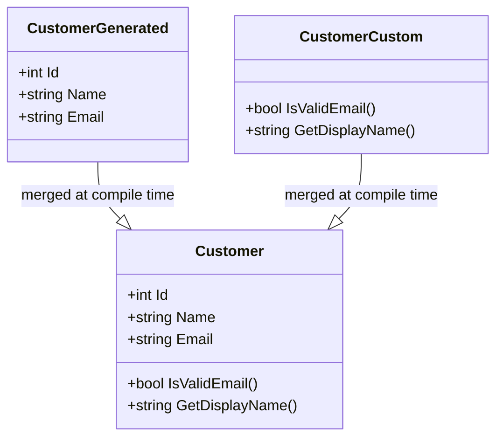

## Overview

The Partial Class Pattern splits a single class definition across two or more
source files. At compile time, the fragments merge into one type. This separation
lets auto-generated code live in one file while hand-written customizations live
in another, so generators don't overwrite your changes.

C# has native `partial class` support, but other languages can approximate the same
goal. Ruby reopens classes, Python can monkey-patch, and Java uses default
interface methods or inheritance. The payoff is cleaner source organization,
and the compiled output pays nothing extra for it.

Picture a team using Entity Framework Core to scaffold database entities. The
tool regenerates `Customer.cs` every time the schema changes, but the team also
needs custom validation and computed properties. With partial classes they keep
the generated file untouched and write their logic in `Customer.Custom.cs`. The
compiler merges both files, so the runtime sees a single `Customer` class with
all the members.

## When to Use

Use the Partial Class Pattern when:

- A code generator spits out repetitive boilerplate that will be overwritten on the next run.
- You want to keep hand-written business logic separate from scaffolded code.
- Two or more developers need to change different parts of the same class without constant merge conflicts.
- A big class can become readable if you split it by real responsibilities:
  validation in one file, serialization in another, persistence in a third.
- You're using a source generator or Razor code-behind that produces one half
  of the class and you write the other half by hand.

### When to avoid

- If the whole class fits on one screen without scrolling, don't split it.
- The splits create circular dependencies or confusing navigation.
- The language doesn't support partial types natively and workarounds add
  complexity.
- You're splitting mainly because the class is too big to read; it's probably
  time to extract smaller classes instead. In that case, look at the
  [Strategy Pattern](/patterns/strategy-pattern/) or
  [Decorator Pattern](/patterns/decorator-pattern/) for ways to split behavior
  without splitting the type.

## Solution

### C# (native `partial`)

```csharp
// AutoGenerated.cs — generated by a tool, don't edit
public partial class Customer
{
    public int Id { get; set; }
    public string Name { get; set; }
    public string Email { get; set; }
}

// Customer.Custom.cs — hand-written business logic
public partial class Customer
{
    public bool IsValidEmail()
    {
        return Email?.Contains("@") ?? false;
    }

    public string GetDisplayName()
    {
        return $"{Name} <{Email}>";
    }
}
```

### Python

Python doesn't have partial classes, but you can reopen and monkey-patch a
class:

```python
from dataclasses import dataclass

# customer_base.py (auto-generated)
@dataclass
class Customer:
    id: int
    name: str
    email: str

# customer_custom.py (hand-written)
def is_valid_email(self) -> bool:
    return "@" in self.email if self.email else False

def get_display_name(self) -> str:
    return f"{self.name} <{self.email}>"

# Reopen the class by attaching methods
Customer.is_valid_email = is_valid_email
Customer.get_display_name = get_display_name

# Usage
customer = Customer(id=1, name="Alice", email="alice@example.com")
print(customer.is_valid_email())        # True
print(customer.get_display_name())      # Alice <alice@example.com>
```

### Java

Java doesn't have partial classes, but nested classes, default interface methods,
and inheritance can achieve similar separation:

```java
// Auto-generated base
public class CustomerBase {
    private final int id;
    private final String name;
    private final String email;

    public CustomerBase(int id, String name, String email) {
        this.id = id;
        this.name = name;
        this.email = email;
    }

    public int getId() { return id; }
    public String getName() { return name; }
    public String getEmail() { return email; }
}

// Hand-written extension via inheritance
public class Customer extends CustomerBase {
    public Customer(int id, String name, String email) {
        super(id, name, email);
    }

    public boolean isValidEmail() {
        return getEmail() != null && getEmail().contains("@");
    }

    public String getDisplayName() {
        return getName() + " <" + getEmail() + ">";
    }
}
```

### JavaScript

JavaScript can extend prototypes at any time:

```javascript
// customerBase.js (auto-generated)
class Customer {
  constructor(id, name, email) {
    this.id = id;
    this.name = name;
    this.email = email;
  }
}

// customerCustom.js (hand-written)
Customer.prototype.isValidEmail = function () {
  return this.email?.includes('@') ?? false;
};

Customer.prototype.getDisplayName = function () {
  return `${this.name} <${this.email}>`;
};

// Usage
const customer = new Customer(1, 'Alice', 'alice@example.com');
console.log(customer.isValidEmail());      // true
console.log(customer.getDisplayName());    // Alice <alice@example.com>
```

### C#: splitting responsibilities

The example below keeps model, validation, pricing, and serialization concerns in
separate files that the compiler merges into one `Order` class:

```csharp
// Order.cs — main model
public partial class Order
{
    public Guid Id { get; set; }
    public string CustomerEmail { get; set; }
    public List<OrderItem> Items { get; set; }
    public decimal Total { get; set; }
    public DateTime CreatedAt { get; set; }
}

// Order.Validation.cs
public partial class Order
{
    public bool IsValid()
    {
        return Items.Count > 0 && Total > 0
            && !string.IsNullOrEmpty(CustomerEmail);
    }

    public List<string> GetValidationErrors()
    {
        var errors = new List<string>();
        if (Items.Count == 0) errors.Add("Order must have items");
        if (Total <= 0) errors.Add("Total must be positive");
        if (string.IsNullOrEmpty(CustomerEmail))
            errors.Add("Email required");
        return errors;
    }
}

// Order.Pricing.cs
public partial class Order
{
    public void ApplyDiscount(decimal percentage)
    {
        Total = Total * (1 - percentage / 100);
    }

    public void ApplyCoupon(string code)
    {
        var coupon = CouponService.Validate(code);
        if (coupon.IsValid) Total -= coupon.Amount;
    }

    public decimal CalculateTax(decimal rate)
    {
        return Total * rate;
    }
}

// Order.Serialization.cs
public partial class Order
{
    public string ToJson()
    {
        return JsonSerializer.Serialize(this);
    }

    public static Order FromJson(string json)
    {
        return JsonSerializer.Deserialize<Order>(json);
    }
}
```

## Explanation

The Partial Class Pattern solves a tooling and maintenance problem. Before,
code generators overwrote hand-written changes every time they ran. After,
generated code lives in one file and custom code in another, and both compile into
a single type.

The compiler produces the same IL whether the class lives in one file or is
spread across ten; only the source layout and the safety of regeneration change.



### What the compiler actually does

When the C# compiler sees two or more `partial` declarations of the same class,
it combines their member lists, attributes and interfaces into a single
metadata definition. The resulting IL has one type name and one set of methods,
properties and fields. There's no runtime cost and no extra indirection; a call
to `customer.IsValidEmail()` is the same instruction whether the method was
written in `Customer.cs` or `Customer.Validation.cs`.

This also means that the order of source files only matters for field
initializers. If two partials declare fields with initializers, the compiler
applies them in the order it processes the source files within the same project,
so relying on cross-partial field order is fragile and should be avoided.

### Trade-offs

The main benefit is separation of concerns: generated and hand-written code have
different owners, review processes and lifecycles. You can regenerate the
scaffolded half without a merge conflict, and you can unit-test the custom half
independently by mocking the generated members.

The risk is that splitting can hide a class that's grown too large. If the
reason for the split is "the file is too long to scroll" rather than "these
responsibilities change at different rates", the partials are a band-aid. In that
case, extracting smaller classes is usually the better fix. Partials also add
cognitive load: a reader must open several files to understand the full type, so
naming conventions such as `Customer.generated.cs` and `Customer.Validation.cs`
are essential.

### Edge cases and limitations

Partial methods are a related feature: the generator can declare `partial void
OnSaving()` and the custom file can implement it. If no implementation is
provided, the compiler removes the call site entirely, so the generated code pays
nothing at runtime. This works well for lightweight hooks, but the method must return `void` and
can't use `out` parameters in classic partial methods. Modern
C# allows `partial` methods to have non-void return types and access modifiers if
they've got an implementation, but not all generators use that form.

A partial class can't add fields that another partial depends on during object
initialization, because the initialization order is compiler-determined. If you
need guaranteed initialization order, use a constructor defined in one file or
refactor to a separate initializer class.

Source generators in .NET rely heavily on partial classes. A generator runs
during compilation and can produce a partial file that the developer completes
with custom logic. This is the same mental model as a T4 template or a WinForms
designer, but it's integrated into the build.

### Real-world examples

#### WinForms / WPF designers

In Visual Studio, the Windows Forms designer puts control initialization in
`Form1.Designer.cs`, while `Form1.cs` holds event handlers and business logic.

#### Entity Framework

EF scaffolding produces partial entity classes, so you can add validation,
computed properties, and business logic in separate partial files that survive
re-scaffolding.

#### ASP.NET Core Razor

Razor compiles `.cshtml` markup and `.cshtml.cs` code-behind into a single
partial class, separating presentation from logic.

## Variants

| Variant | Language | Mechanism |
| --- | --- | --- |
| Partial class | C#, VB.NET | Native `partial` keyword |
| Reopen class | Ruby, Python | Monkey-patch or reopen at runtime |
| Mixin modules | Ruby, Python | Include modules into a class |
| Default interface methods | Java | Interface methods with bodies |
| Partial method | C# | Generated stub, optional implementation |

If your language relies on mixins rather than partial types, the
[Mixin Pattern](/patterns/mixin-pattern/) shows how to compose behavior without
inheritance.

## Best Practices

- Never edit generated files. Put a `// <auto-generated>` header at the top so nobody else tries to edit them.
- Use consistent naming like `Customer.generated.cs` and `Customer.custom.cs`.
- Keep partials cohesive. Split around real responsibilities, not just to create more files.
- Add a short class-level comment noting which partial owns persistence, validation, or serialization.
- Run the generator in CI so generated files stay up to date and nobody is tempted to edit them by hand.

## Common Mistakes

- Splitting arbitrarily. Five partial files for a 100-line class is overkill.
- Creating circular dependencies between partials.
- Mixing generated and hand-written code in the same file.
- Using partials to avoid refactoring a too-large class.
- Assuming partial classes change thread-safety semantics.

## FAQ

### What's the difference between a partial class and inheritance?

Partial classes are merged at compile time into one type. Inheritance creates a
runtime relationship between two distinct types. Partial classes also can't add
fields that other partials depend on when the object initializes.

### Can partial classes have different access modifiers?

No. Every partial declaration must use the same access modifier and live in the
same assembly and namespace.

### How do I get partial-class behavior in Java or Python?

Java uses composition or inheritance; Python uses monkey-patching or mixins.
Neither has true compile-time partials like C#.

### Can partial methods exist without an implementation?

In C#, yes. A partial method declaration can exist in the generated file without
an implementation in the custom file. If no implementation is provided, the
compiler strips the call site completely, so the generated code pays nothing.

### Is this pattern suitable for small projects?

Small projects with only a handful of classes usually don't need this; it can add
more folders and files than value. Start simple and introduce the split when you
actually feel the problem it solves.

### How does this pattern compare to alternatives?

Compare the variants table with your real constraints: how many people touch the
class, your performance budget, and how much you expect it to grow.

### Can I apply this pattern incrementally?

Yes. Many teams adopt patterns a bit at a time. Begin with the simplest split and
add more files only when a clear need shows up.

### Is partial class available in TypeScript?

No. TypeScript has no `partial class` keyword. Use composition (OrderModel,
OrderValidator, OrderPricer), mixins, declaration merging for
interfaces/namespaces, or prototype/module augmentation. Most of the time,
composition ends up being the cleanest way out.

## See Also

- [Companion examples on GitHub][companion] — runnable C# project with `Customer` and `Order` partials.
- [Mixin Pattern](/patterns/mixin-pattern/) — compose behavior without inheritance.
- [Decorator Pattern](/patterns/decorator-pattern/) — add responsibilities by wrapping objects.
- [Strategy Pattern](/patterns/strategy-pattern/) — extract interchangeable algorithms.
- [Microsoft Learn: Partial Classes and Methods](https://learn.microsoft.com/en-us/dotnet/csharp/programming-guide/classes-and-structs/partial-classes-and-methods)
- [C# Language Specification — Partial types](https://learn.microsoft.com/en-us/dotnet/csharp/language-reference/language-specification/classes#1516-partial-types)
- [Java Nested Classes](https://docs.oracle.com/javase/tutorial/java/javaOO/nested.html)
- [Python dataclasses](https://docs.python.org/3/library/dataclasses.html)
- [MDN: Classes in JavaScript](https://developer.mozilla.org/en-US/docs/Web/JavaScript/Reference/Classes)
- [TypeScript Handbook: Classes](https://www.typescriptlang.org/docs/handbook/2/classes.html)

[companion]: https://github.com/MathiasPaulenko/stack-practices-resources/tree/main/resources/patterns/design/partial-class-pattern
