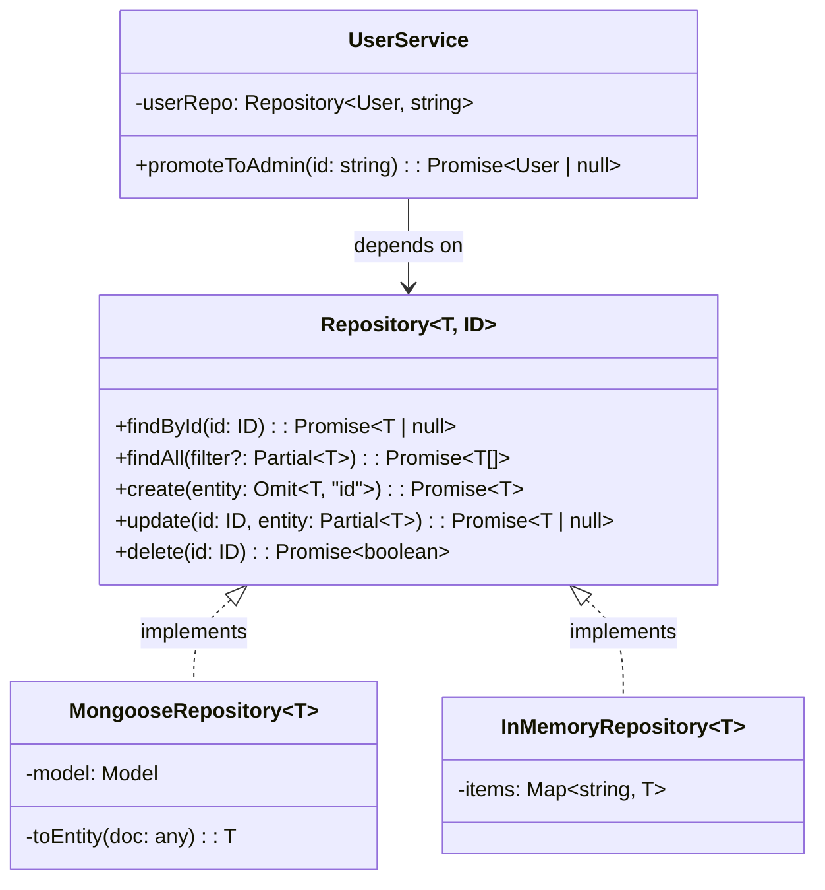

## Visión General

El [Repository Pattern](/patterns/repository-pattern/) media entre las capas de
dominio y mapeo de datos. Actúa como una colección en memoria de objetos de
dominio, abstrayendo los detalles de persistencia para que los servicios se
mantengan enfocados en la lógica de negocio.

Usé este patrón en proyectos donde cambiamos MongoDB por PostgreSQL a mitad del
proyecto. Como los servicios dependían de la interfaz `Repository<T, ID>`, no de
Mongoose directamente, el cambio tomó días en lugar de semanas. Los tests no
cambiaron nada.

Esta versión usa generics de TypeScript para que una sola interfaz pueda
describir repositorios de cualquier entidad y tipo de id.

## Cuándo Usar

- Estás planeando cambiar tecnologías de base de datos sin reescribir la lógica de negocio.
- Los tests unitarios necesitan ejecutarse sin base de datos real.
- Dos o más servicios comparten patrones de consulta similares.
- Las preocupaciones de persistencia siguen filtrándose en tu capa de servicios.

### Cuándo evitarlo

- Aplicaciones CRUD simples donde un estilo active-record del ORM es suficiente.
- Prototipos que no necesitan test doubles ni cambios de almacenamiento.

## Solución

Así es como encajan las piezas:



### Interfaz de repositorio

```typescript
interface Repository<T, ID> {
  findById(id: ID): Promise<T | null>;
  findAll(filter?: Partial<T>): Promise<T[]>;
  create(entity: Omit<T, "id">): Promise<T>;
  update(id: ID, entity: Partial<T>): Promise<T | null>;
  delete(id: ID): Promise<boolean>;
}
```

### Implementación con Mongoose

```typescript
import { Model } from "mongoose";

class MongooseRepository<T extends { id: string }> implements Repository<T, string> {
  constructor(private model: Model<any>) {}

  async findById(id: string): Promise<T | null> {
    const doc = await this.model.findById(id).lean();
    return doc ? this.toEntity(doc) : null;
  }

  async findAll(filter: Record<string, any> = {}): Promise<T[]> {
    const docs = await this.model.find(filter).lean();
    return docs.map((doc) => this.toEntity(doc));
  }

  async create(data: Omit<T, "id">): Promise<T> {
    const doc = await this.model.create(data);
    return this.toEntity(doc.toObject());
  }

  async update(id: string, data: Partial<T>): Promise<T | null> {
    const doc = await this.model.findByIdAndUpdate(id, data, { new: true }).lean();
    return doc ? this.toEntity(doc) : null;
  }

  async delete(id: string): Promise<boolean> {
    const result = await this.model.findByIdAndDelete(id);
    return !!result;
  }

  private toEntity(doc: any): T {
    const { _id, __v, ...rest } = doc;
    return { id: _id.toString(), ...rest } as T;
  }
}
```

### Implementación en memoria para tests

```typescript
class InMemoryRepository<T extends { id: string }> implements Repository<T, string> {
  private items: Map<string, T> = new Map();

  async findById(id: string): Promise<T | null> {
    return this.items.get(id) ?? null;
  }

  async findAll(filter?: Partial<T>): Promise<T[]> {
    const all = Array.from(this.items.values());
    if (!filter) return all;

    return all.filter((item) =>
      Object.entries(filter).every(([key, value]) => (item as any)[key] === value)
    );
  }

  async create(data: Omit<T, "id">): Promise<T> {
    const id = crypto.randomUUID();
    const item = { id, ...data } as T;
    this.items.set(id, item);
    return item;
  }

  async update(id: string, data: Partial<T>): Promise<T | null> {
    const existing = this.items.get(id);
    if (!existing) return null;

    const updated = { ...existing, ...data, id } as T;
    this.items.set(id, updated);
    return updated;
  }

  async delete(id: string): Promise<boolean> {
    return this.items.delete(id);
  }
}
```

### Entidad de dominio y servicio

```typescript
interface User {
  id: string;
  email: string;
  name: string;
  role: string;
}

class UserService {
  constructor(private userRepo: Repository<User, string>) {}

  async promoteToAdmin(userId: string): Promise<User | null> {
    const user = await this.userRepo.findById(userId);
    if (!user) throw new Error("Usuario no encontrado");
    return this.userRepo.update(userId, { role: "admin" });
  }
}
```

### Uso

```typescript
const userRepo = new MongooseRepository<User>(UserModel);
const userService = new UserService(userRepo);

// En tests
const testService = new UserService(new InMemoryRepository<User>());
```

## Explicación

La interfaz genérica `Repository<T, ID>` define el contrato. Las implementaciones
concretas manejan la persistencia, mientras que los servicios dependen solo de la
interfaz. Esta es la clave: tu capa de dominio nunca importa Mongoose, Prisma ni
ningún otro ORM. La capa de dominio solo ve la interfaz.

`MongooseRepository` mapea documentos de base de datos a entidades de dominio.
El método `toEntity` elimina los campos `_id` y `__v` de Mongoose y reemplaza
`_id` con un string `id` plano. Encontré que este paso de mapeo es donde la
mayoría de los equipos se saltean, y después se arrepienten cuando el servicio
empieza a depender de la forma del documento de Mongoose.

`InMemoryRepository` es lo que hace posible testear servicios sin base de datos.
Los tests corren rápido, no necesitan Docker, y son determinísticos. Corro el
suite completo de tests del servicio en menos de 2 segundos con este enfoque.

El parámetro `Repository<User, string>` en `UserService` hace la dependencia
explícita y reemplazable. Consultá
[Inyección de Dependencias](/patterns/dependency-injection-pattern/) para
estrategias de wiring.

### Trade-offs

El repository pattern agrega una capa de abstracción. Para una app CRUD simple
con una entidad y sin lógica de negocio, es overhead que no necesitás. Vi equipos
que añadieron repositorios "para flexibilidad futura" y después nunca cambiaron
la base de datos. Eso es abstracción prematura.

Por otro lado, si tenés reglas de negocio complejas, dos o más fuentes de datos,
o necesitás testear servicios de forma aislada, los repositorios se pagan solos
rápido. La pregunta clave es: ¿alguna vez vas a necesitar testear el servicio sin
la base de datos? Si sí, usá repositorios. Si no, active record es más simple.

La interfaz genérica tiene una desventaja: no puede expresar queries específicas
de una entidad. `findById` y `findAll` cubren lo básico, pero queries
personalizadas como "buscar usuarios por rol y fecha de último login" necesitan
una interfaz especializada o un specification pattern. Prefiero extender la
interfaz por aggregate cuando es necesario, en lugar de construir un query
builder genérico que pierde type safety.

## Variantes

| Variante | Propósito |
| --- | --- |
| Repositorio en memoria | Tests unitarios rápidos con Map como storage |
| Specification pattern | Componer objetos de consulta reutilizables |
| Unit of Work | Agrupar varias operaciones en una transacción |
| Separación lectura/escritura | Repositorios separados para queries y comandos en CQRS |

## Mejores Prácticas

- Devolver entidades de dominio, no documentos de base de datos. Vi bugs donde
  un servicio mutaba accidentalmente un documento de Mongoose y lo guardaba en
  la base de datos. Mapear a entidades previene esto.
- Mantener los repositorios enfocados en persistencia. Las reglas de negocio van
  en los servicios, no en los repositorios.
- Inyectar la interfaz del repositorio, no la implementación concreta. Si
  inyectás la clase concreta, perdiste el beneficio entero del patrón.
- Agregar paginación para `findAll` con muchos resultados. Una vez debugueé un
  OOM en producción por un repositorio que devolvía 500,000 filas sin paginar.
- Usar transacciones para operaciones multi-paso, pero manejarlas en el servicio,
  no en el repositorio. Ver [Unit of Work](/patterns/repository-pattern/) para
  el patrón.
- Manejar errores de conexión y constraints en el repositorio y traducirlos a
  excepciones de dominio. No dejes que `MongooseError` escape a tu capa de
  servicio.

## Errores Comunes

- Filtrar queries del ORM en los métodos del servicio. Veo este error en casi
  todos los codebases que reviso. Una vez que un servicio llama
  `Model.find().populate().lean()`, no podés cambiar el ORM sin reescribir el
  servicio.
- Devolver documentos crudos de base de datos en lugar de entidades mapeadas.
  Los documentos de Mongoose tienen métodos como `.save()` y `.populate()` que
  no pertenecen a la capa de dominio.
- Poner el manejo de transacciones dentro del repositorio en lugar del servicio.
  Las transacciones abarcan dos o más repositorios, así que pertenecen al
  servicio que los coordina.
- Crear repositorios tan genéricos que pierdan type safety. Si tu repositorio
  acepta `any` y devuelve `any`, derrotaste el propósito de TypeScript.
- No manejar errores de base de datos o exponer excepciones del driver. Envolvelos
  en excepciones de dominio para que el servicio no necesite conocer los códigos
  de error de MongoDB.
- Ignorar la paginación para conjuntos grandes. Siempre paginá `findAll` a menos
  que sepas que la colección es pequeña.
- Mezclar lógica de negocio con lógica de acceso a datos. Si tu repositorio tiene
  `if` sobre reglas de negocio, movelos al servicio.

## Testing Strategy

El mayor beneficio del repository pattern es la testeabilidad. Con
`InMemoryRepository`, los tests del servicio no necesitan base de datos, Docker
ni llamadas de red. Los tests corren en milisegundos y son determinísticos.

### Tests unitarios con InMemoryRepository

```typescript
import { describe, it, expect } from "vitest";

describe("UserService", () => {
  it("promotes a user to admin", async () => {
    const repo = new InMemoryRepository<User>();
    const user = await repo.create({ email: "test@example.com", name: "Test", role: "member" });
    const service = new UserService(repo);

    const updated = await service.promoteToAdmin(user.id);

    expect(updated?.role).toBe("admin");
  });

  it("throws when user not found", async () => {
    const repo = new InMemoryRepository<User>();
    const service = new UserService(repo);

    await expect(service.promoteToAdmin("nonexistent")).rejects.toThrow("Usuario no encontrado");
  });
});
```

### Tests de integración con MongooseRepository

Para tests de integración, uso una instancia real de MongoDB o un MongoDB en
memoria como `mongodb-memory-server`. Testeá el mapeo `toEntity`, la paginación
y el manejo de errores acá. Mantengo estos tests separados de los unitarios y
los corro solo en CI:

```typescript
import { MongoMemoryServer } from "mongodb-memory-server";
import mongoose from "mongoose";

describe("MongooseRepository integration", () => {
  let mongoServer: MongoMemoryServer;

  beforeAll(async () => {
    mongoServer = await MongoMemoryServer.create();
    await mongoose.connect(mongoServer.getUri());
  });

  afterAll(async () => {
    await mongoose.disconnect();
    await mongoServer.stop();
  });

  it("maps documents to entities", async () => {
    const repo = new MongooseRepository<User>(UserModel);
    const created = await repo.create({ email: "test@example.com", name: "Test", role: "member" });

    expect(created.id).toBeDefined();
    expect((created as any)._id).toBeUndefined();
  });
});
```

### Qué testear

- **Lógica del servicio**: usá `InMemoryRepository`, testeá reglas de negocio y
  casos borde. Estos tests deben ser rápidos y cubrir cada rama.
- **Mapeo del repositorio**: usá una base de datos real, verificá que `toEntity`
  elimine los campos del ORM correctamente.
- **Manejo de errores**: verificá que los errores de base de datos se traduzcan
  a excepciones de dominio.

## See Also

- [Martin Fowler: Repository Pattern](https://martinfowler.com/eaaCatalog/repository.html):
  la descripción original del patrón de Patterns of Enterprise Application
  Architecture.
- [TypeScript Generics Handbook](https://www.typescriptlang.org/docs/handbook/2/generics.html):
  documentación oficial sobre generics, la base de la interfaz type-safe
  `Repository<T, ID>`.
- [Domain-Driven Design: Aggregate Root](https://martinfowler.com/bliki/DDD_Aggregate.html):
  por qué los repositorios deben ser por aggregate root, no por entidad.
- [Mongoose Documentation](https://mongoosejs.com/docs/models.html): el ORM usado
  en los ejemplos de implementación concreta.
- [Repository Pattern](/patterns/repository-pattern/): la versión agnóstica del
  lenguaje de este patrón.
- [Active Record Pattern](/patterns/active-record-pattern/): el enfoque
  alternativo que mezcla acceso a datos y lógica de dominio.

## FAQ

### ¿Es el repository pattern excesivo para proyectos pequeños?

Para apps CRUD simples, active record suele ser suficiente. Usá repositorios
cuando necesitás testeabilidad, múltiples fuentes de datos o cambios de
almacenamiento. Consultá [Active Record Pattern](/patterns/active-record-pattern/)
para la alternativa.

### ¿En qué se diferencia de active record?

Active record mezcla acceso a datos y lógica de dominio. El repository pattern
los separa, haciendo la capa de dominio independiente de la persistencia.

### ¿Debería usar un repositorio por entidad o por aggregate root?

Usá un repositorio por aggregate root, no por entidad. Esto sigue los principios
de Domain-Driven Design y mantiene la consistencia dentro del aggregate.

### ¿Cómo testeo repositorios sin base de datos?

Creá una implementación en memoria de la interfaz del repositorio y usala en los
tests de los servicios. Esto evita setup de base de datos y hace los tests
determinísticos.

### ¿Cómo manejo la paginación?

Agregá parámetros `limit` y `offset` (o `page` y `size`) a `findAll`, y devolvé
un resultado paginado con metadata como el total.

### ¿Los repositorios deberían devolver DTOs o entidades de dominio?

Devolver entidades de dominio. Los DTOs son para respuestas de API. Mapealos desde las entidades en el
servicio o capa API, no en el repositorio.
