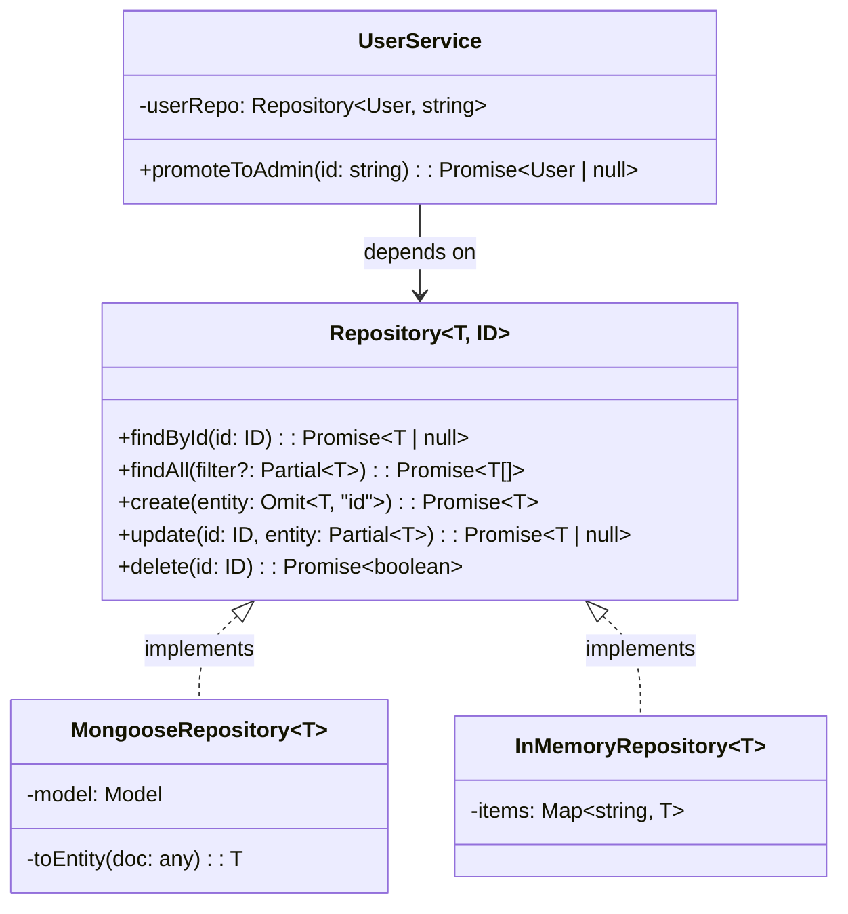

## Overview

The [Repository Pattern](/patterns/repository-pattern/) mediates between the
domain and data mapping layers. It acts like an in-memory collection of domain
objects, abstracting persistence details so services stay focused on business
logic.

I've used this pattern on projects where we swapped MongoDB for PostgreSQL mid-
project. Because services depended on the `Repository<T, ID>` interface, not on
Mongoose directly, the swap took days instead of weeks. The tests didn't change
at all.

This version uses TypeScript generics so a single interface can describe
repositories for any entity and id type.

## When to Use

- You're planning to swap database technologies without rewriting business logic.
- Unit tests need to run without a real database.
- Two or more services share similar query patterns.
- Persistence concerns keep leaking into your service layer.

### When to avoid

- Simple CRUD applications where an ORM active-record style is enough.
- Prototypes that don’t need test doubles or storage swaps.

## Solution

Here's how the pieces fit together:



### Repository interface

```typescript
interface Repository<T, ID> {
  findById(id: ID): Promise<T | null>;
  findAll(filter?: Partial<T>): Promise<T[]>;
  create(entity: Omit<T, "id">): Promise<T>;
  update(id: ID, entity: Partial<T>): Promise<T | null>;
  delete(id: ID): Promise<boolean>;
}
```

### Mongoose implementation

```typescript
import { Model } from "mongoose";

class MongooseRepository<T extends { id: string }> implements Repository<T, string> {
  constructor(private model: Model<any>) {}

  async findById(id: string): Promise<T | null> {
    const doc = await this.model.findById(id).lean();
    return doc ? this.toEntity(doc) : null;
  }

  async findAll(filter: Record<string, any> = {}): Promise<T[]> {
    const docs = await this.model.find(filter).lean();
    return docs.map((doc) => this.toEntity(doc));
  }

  async create(data: Omit<T, "id">): Promise<T> {
    const doc = await this.model.create(data);
    return this.toEntity(doc.toObject());
  }

  async update(id: string, data: Partial<T>): Promise<T | null> {
    const doc = await this.model.findByIdAndUpdate(id, data, { new: true }).lean();
    return doc ? this.toEntity(doc) : null;
  }

  async delete(id: string): Promise<boolean> {
    const result = await this.model.findByIdAndDelete(id);
    return !!result;
  }

  private toEntity(doc: any): T {
    const { _id, __v, ...rest } = doc;
    return { id: _id.toString(), ...rest } as T;
  }
}
```

### In-memory implementation for tests

```typescript
class InMemoryRepository<T extends { id: string }> implements Repository<T, string> {
  private items: Map<string, T> = new Map();

  async findById(id: string): Promise<T | null> {
    return this.items.get(id) ?? null;
  }

  async findAll(filter?: Partial<T>): Promise<T[]> {
    const all = Array.from(this.items.values());
    if (!filter) return all;

    return all.filter((item) =>
      Object.entries(filter).every(([key, value]) => (item as any)[key] === value)
    );
  }

  async create(data: Omit<T, "id">): Promise<T> {
    const id = crypto.randomUUID();
    const item = { id, ...data } as T;
    this.items.set(id, item);
    return item;
  }

  async update(id: string, data: Partial<T>): Promise<T | null> {
    const existing = this.items.get(id);
    if (!existing) return null;

    const updated = { ...existing, ...data, id } as T;
    this.items.set(id, updated);
    return updated;
  }

  async delete(id: string): Promise<boolean> {
    return this.items.delete(id);
  }
}
```

### Domain entity and service

```typescript
interface User {
  id: string;
  email: string;
  name: string;
  role: string;
}

class UserService {
  constructor(private userRepo: Repository<User, string>) {}

  async promoteToAdmin(userId: string): Promise<User | null> {
    const user = await this.userRepo.findById(userId);
    if (!user) throw new Error("User not found");
    return this.userRepo.update(userId, { role: "admin" });
  }
}
```

### Usage

```typescript
const userRepo = new MongooseRepository<User>(UserModel);
const userService = new UserService(userRepo);

// In tests
const testService = new UserService(new InMemoryRepository<User>());
```

## Explanation

The generic `Repository<T, ID>` interface defines the contract. Concrete
implementations handle persistence, while services depend only on the interface.
This is the core insight: your domain layer never imports Mongoose, Prisma, or
any other ORM. The domain layer only sees the interface.

`MongooseRepository` maps database documents to domain entities. The `toEntity`
method strips Mongoose's `_id` and `__v` fields and replaces `_id` with a plain
`id` string. I've found this mapping step is where most teams cut corners, then
regret it when the service starts depending on Mongoose's document shape.

`InMemoryRepository` is what makes service testing without a database possible.
Tests run fast, don't need Docker, and are deterministic. I run the full service
test suite in under 2 seconds with this approach.

The `Repository<User, string>` parameter on `UserService` makes the dependency
explicit and swappable. See
[Dependency Injection](/patterns/dependency-injection-pattern/) for wiring
strategies.

### Trade-offs

The repository pattern adds a layer of abstraction. For a simple CRUD app with
one entity and no business logic, that's overhead you don't need. I've seen
teams add repositories "for future flexibility" and then never swap the
database. That's premature abstraction.

On the other hand, if you've got complex business rules, two or more data
sources, or need to test services in isolation, repositories pay for themselves
quickly. The key question is: will you ever need to test the service without the
database? If yes, use repositories. If no, active record is simpler.

The generic interface has one downside: it can't express entity-specific queries.
`findById` and `findAll` cover basics, but custom queries like "find users by
role and last login date" need either a specialized interface or a specification
pattern. I prefer extending the interface per aggregate when needed, rather than
building a generic query builder that loses type safety.

## Variants

| Variant | Purpose |
| --- | --- |
| In-memory repository | Fast unit tests with Map-backed storage |
| Specification pattern | Compose reusable query objects |
| Unit of Work | Batch several operations in one transaction |
| Read/write split | Separate query and command repositories for CQRS |

## Best Practices

- Return domain entities, not database documents, from repository methods. I've
  seen bugs where a service accidentally mutated a Mongoose document and saved
  it to the database. Mapping to entities prevents this.
- Keep repositories focused on persistence; business rules belong in services.
- Inject the repository interface, not the concrete implementation. If you inject
  the concrete class, you've lost the whole point of the pattern.
- Add pagination for large `findAll` results. I once debugged a production OOM
  caused by a repository that returned 500,000 rows without pagination.
- Use transactions for multi-step operations, but manage them in the service, not
  the repository. See [Unit of Work](/patterns/repository-pattern/) for the
  pattern.
- Handle connection and constraint errors in the repository and translate them
  to domain exceptions. Don't let `MongooseError` escape into your service layer.

## Common Mistakes

- Leaking ORM queries into service methods. I see this mistake in almost every
  codebase I review. Once a service calls `Model.find().populate().lean()`, you
  can't swap the ORM without rewriting the service.
- Returning raw database documents instead of mapped entities. Mongoose
  documents have methods like `.save()` and `.populate()` that don't belong in
  the domain layer.
- Putting transaction management inside the repository instead of the service.
  Transactions span two or more repositories, so they belong in the service that
  coordinates them.
- Creating repositories that are so generic they lose type safety. If your
  repository accepts `any` and returns `any`, you've defeated the purpose of
  TypeScript.
- Not handling database errors or exposing driver-specific exceptions. Wrap them
  in domain exceptions so the service doesn't need to know about MongoDB error
  codes.
- Ignoring pagination for large result sets. Always paginate `findAll` unless
  you know the collection is small.
- Mixing business logic with data access logic. If your repository has `if`
  statements about business rules, move them to the service.

## Testing Strategy

The biggest win from the repository pattern is testability. With
`InMemoryRepository`, service tests don't need a database, Docker, or network
calls. Tests run in milliseconds and are deterministic.

### Unit tests with InMemoryRepository

```typescript
import { describe, it, expect } from "vitest";

describe("UserService", () => {
  it("promotes a user to admin", async () => {
    const repo = new InMemoryRepository<User>();
    const user = await repo.create({ email: "test@example.com", name: "Test", role: "member" });
    const service = new UserService(repo);

    const updated = await service.promoteToAdmin(user.id);

    expect(updated?.role).toBe("admin");
  });

  it("throws when user not found", async () => {
    const repo = new InMemoryRepository<User>();
    const service = new UserService(repo);

    await expect(service.promoteToAdmin("nonexistent")).rejects.toThrow("User not found");
  });
});
```

### Integration tests with MongooseRepository

For integration tests, I use a real MongoDB instance or an in-memory MongoDB
like `mongodb-memory-server`. Test the `toEntity` mapping, pagination, and error
handling here. I keep these tests separate from unit tests and run them in CI
only:

```typescript
import { MongoMemoryServer } from "mongodb-memory-server";
import mongoose from "mongoose";

describe("MongooseRepository integration", () => {
  let mongoServer: MongoMemoryServer;

  beforeAll(async () => {
    mongoServer = await MongoMemoryServer.create();
    await mongoose.connect(mongoServer.getUri());
  });

  afterAll(async () => {
    await mongoose.disconnect();
    await mongoServer.stop();
  });

  it("maps documents to entities", async () => {
    const repo = new MongooseRepository<User>(UserModel);
    const created = await repo.create({ email: "test@example.com", name: "Test", role: "member" });

    expect(created.id).toBeDefined();
    expect((created as any)._id).toBeUndefined();
  });
});
```

### What to test

- **Service logic**: use `InMemoryRepository`, test business rules and edge
  cases. These tests should be fast and cover every branch.
- **Repository mapping**: use a real database, test that `toEntity` strips ORM
  fields correctly.
- **Error handling**: test that database errors are translated to domain
  exceptions.

## See Also

- [Martin Fowler: Repository Pattern](https://martinfowler.com/eaaCatalog/repository.html):
  the original description of the pattern from Patterns of Enterprise Application
  Architecture.
- [TypeScript Generics Handbook](https://www.typescriptlang.org/docs/handbook/2/generics.html):
  official documentation on generics, the foundation of the type-safe
  `Repository<T, ID>` interface.
- [Domain-Driven Design: Aggregate Root](https://martinfowler.com/bliki/DDD_Aggregate.html):
  why repositories should be per aggregate root, not per entity.
- [Mongoose Documentation](https://mongoosejs.com/docs/models.html): the ORM used
  in the concrete implementation examples.
- [Repository Pattern](/patterns/repository-pattern/): the language-agnostic
  version of this pattern.
- [Active Record Pattern](/patterns/active-record-pattern/): the alternative
  approach that mixes data access and domain logic.

## FAQ

### Is the repository pattern overkill for small projects?

For simple CRUD apps, active record is often enough. Use repositories when you
need testability, several data sources, or storage swaps. See
[Active Record Pattern](/patterns/active-record-pattern/) for the alternative.

### How does this compare to active record?

Active record mixes data access and domain logic. The repository pattern
separates them, making the domain layer independent from persistence.

### Should I use one repository per entity or per aggregate root?

Use one repository per aggregate root, not per entity. This follows Domain-Driven
Design and keeps consistency within the aggregate.

### How do I test repositories without a database?

Create an in-memory implementation of the repository interface and use it in
service tests. This avoids database setup and makes tests deterministic.

### How do I handle pagination?

Add `limit` and `offset` (or `page` and `size`) parameters to `findAll`, and
return a paginated result with metadata such as total count.

### Should repositories return DTOs or domain entities?

Return domain entities from repositories. DTOs are for API responses and should
be mapped from entities in the service or API layer.
