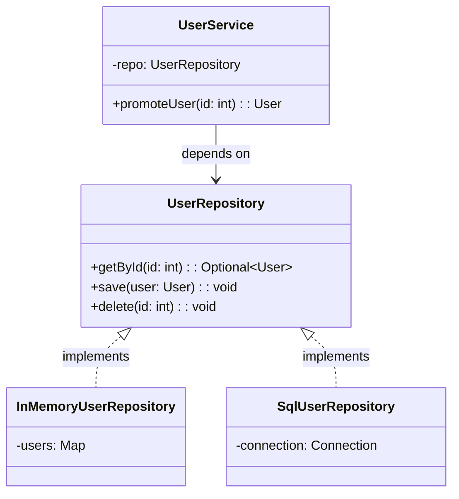

## Visión General

El Patrón Repository es un patrón de diseño arquitectural que media entre la
capa de dominio y las capas de mapeo de datos. Provee una interfaz similar a
una colección para acceder a objetos de dominio y abstrae los detalles de
almacenamiento y recuperación.

Usé este patrón en proyectos donde el equipo necesitaba cambiar MySQL por
PostgreSQL a mitad del proyecto. Como la lógica de negocio dependía de una
interfaz `UserRepository`, no de queries SQL crudas, el cambio tomó días en
vez de semanas. Los tests no cambiaron nada.

Es una base de Clean Architecture y Domain-Driven Design (DDD), y se usa en
frameworks como Spring Data JPA, Entity Framework y Django ORM.

## Cuándo Usar

- Estás desacoplando la lógica de negocio de la implementación de acceso a
  datos.
- Estás planeando intercambiar fuentes de datos (base de datos, API, caché,
  archivo) sin cambiar código de negocio.
- Necesitás capas de datos testeables que se mockeen fácil o cambien a stores
  en memoria.
- La lógica de acceso a datos está dispersa y necesita un único lugar.
- Querés aplicar caché, logging o gestión de transacciones de forma uniforme.

### Cuándo evitarlo

- Aplicaciones CRUD pequeñas con una sola fuente de datos y sin necesidad de
  test doubles.
- Prototipos donde la capa extra agrega más fricción de la que vale.

## Solución

Así es como encajan las piezas: la interfaz define el contrato, las
implementaciones concretas manejan el storage, y los servicios dependen solo
de la interfaz.



### Python

```python
from abc import ABC, abstractmethod
from typing import Optional

class User:
    def __init__(self, id: int, name: str):
        self.id = id
        self.name = name

class UserRepository(ABC):
    @abstractmethod
    def get_by_id(self, id: int) -> Optional[User]:
        pass

    @abstractmethod
    def save(self, user: User) -> None:
        pass

class InMemoryUserRepository(UserRepository):
    def __init__(self):
        self._users = {}

    def get_by_id(self, id: int) -> Optional[User]:
        return self._users.get(id)

    def save(self, user: User) -> None:
        self._users[user.id] = user

repo = InMemoryUserRepository()
repo.save(User(1, "Alice"))
print(repo.get_by_id(1).name)  # Alice
```

### JavaScript

```javascript
class User {
  constructor(id, name) {
    this.id = id;
    this.name = name;
  }
}

class UserRepository {
  getById(id) {
    throw new Error("Not implemented");
  }
  save(user) {
    throw new Error("Not implemented");
  }
}

class InMemoryUserRepository extends UserRepository {
  constructor() {
    super();
    this.users = new Map();
  }
  getById(id) {
    return this.users.get(id) ?? null;
  }
  save(user) {
    this.users.set(user.id, user);
  }
}

const repo = new InMemoryUserRepository();
repo.save(new User(1, "Alice"));
console.log(repo.getById(1).name); // Alice
```

### Java

```java
import java.util.HashMap;
import java.util.Map;
import java.util.Optional;

class User {
    int id;
    String name;
    User(int id, String name) { this.id = id; this.name = name; }
}

interface UserRepository {
    Optional<User> getById(int id);
    void save(User user);
}

class InMemoryUserRepository implements UserRepository {
    private final Map<Integer, User> users = new HashMap<>();

    public Optional<User> getById(int id) {
        return Optional.ofNullable(users.get(id));
    }

    public void save(User user) {
        users.put(user.id, user);
    }
}

UserRepository repo = new InMemoryUserRepository();
repo.save(new User(1, "Alice"));
System.out.println(repo.getById(1).map(u -> u.name).orElse("Unknown")); // Alice
```

## Explicación

El patrón separa el acceso a datos en dos capas:

- **Interfaz de Repository**: define qué operaciones están disponibles, como
  `find`, `save` y `delete`, sin exponer cómo se implementan.
- **Repository Concreto**: implementa la interfaz para un mecanismo de
  almacenamiento específico, como SQL, MongoDB, una REST API o un Map en
  memoria.

La lógica de negocio depende solo de la interfaz. Esto permite reemplazar la
implementación en memoria para tests y una implementación PostgreSQL o MongoDB
para producción sin tocar el código de negocio. Consultá
[Inyección de Dependencias](/patterns/dependency-injection-pattern/) para
estrategias comunes de wiring.

### Trade-offs

El repository pattern agrega una capa de abstracción. Para una app CRUD simple
con una entidad y sin lógica de negocio, es overhead que no necesitás. Vi
equipos que añadieron repositorios "para flexibilidad futura" y después nunca
cambiaron la base de datos. Eso es abstracción prematura.

Por otro lado, si tenés reglas de negocio complejas, dos o más fuentes de datos,
o necesitás testear servicios de forma aislada, los repositorios se pagan solos
rápido. La pregunta clave es: ¿alguna vez vas a necesitar testear el servicio sin
la base de datos? Si sí, usá repositorios. Si no, active record es más simple.

Una desventaja: los repositorios pueden ocultar costos de performance. Un
`findAll` se ve inocente pero puede cargar 100,000 filas. Una vez debugueé un
OOM en producción causado exactamente por esto. Siempre paginá `findAll` a menos
que sepas que la colección es chica.

### Aggregate roots

En Domain-Driven Design, los repositorios deben ser por aggregate root, no por
entidad. Un aggregate root es el punto de entrada a un cluster de objetos
relacionados. Por ejemplo, `OrderRepository` maneja `Order` y sus `OrderLine`
juntos. No necesitás un `OrderLineRepository` porque `OrderLine` siempre se
accede a través de su padre `Order`. Esto mantiene los límites de consistencia claros y evita que actualizaciones
parciales violen invariantes.

## Variantes

| Variante | Caso de uso | Trade-off |
| --- | --- | --- |
| [Generic Repository](/patterns/repository-pattern-typescript/) | CRUD para cualquier entidad con generics de TypeScript | Menos duplicación, pero menos margen para optimizar queries |
| Specification Pattern | Componer queries complejas con objetos reutilizables | Flexible, pero más difícil de optimizar a nivel de base de datos |
| Unit of Work | Agrupar varias operaciones en una sola transacción | Agrega complejidad, pero mantiene integridad de datos |

## Mejores Prácticas

- Devolver objetos de dominio, no filas crudas ni tipos específicos del ORM. Vi
  bugs donde un servicio mutaba accidentalmente una entidad del ORM y la
  guardaba en la base de datos. Devolver objetos planos previene esto.
- Usar interfaces para que los repositorios sean testeables e intercambiables.
  Si inyectás la clase concreta, perdiste todo el punto del patrón.
- Mantener los repositorios enfocados en acceso a datos; la lógica de negocio
  va en los servicios.
- Devolver `Optional` o tipos nullable para datos ausentes en lugar de lanzar
  excepciones. Lanzar excepciones por datos faltantes fuerza a los callers a
  usar try/catch para flujo normal.
- Agregar paginación en `findAll`. Una vez debugueé un OOM en producción por un
  repositorio que devolvía 500,000 filas sin paginar.
- Usar transacciones cuando dos o más operaciones del repositorio deban ser
  atómicas. Ver [Unit of Work](/patterns/repository-pattern-typescript/) para
  el patrón.

## Errores Comunes

- Filtrar detalles del ORM en los servicios devolviendo objetos específicos de
  base de datos. Veo este error en casi todos los codebases que reviso. Una vez
  que un servicio llama `Model.find().populate().lean()`, no podés cambiar el
  ORM sin reescribir el servicio.
- Meter lógica de negocio dentro de los repositorios. Si tu repositorio tiene
  `if` sobre reglas de negocio, esas reglas pertenecen al servicio.
- Crear repositorios dios que manejen tipos de entidades no relacionadas. Un
  repositorio por aggregate root, no uno para todo.
- Ignorar transacciones entre operaciones que deberían ser atómicas.
- Cargar más datos de los necesarios porque la abstracción oculta el costo.
  Siempre paginá `findAll` a menos que sepas que la colección es chica.

## Testing Strategy

El mayor beneficio del repository pattern es la testeabilidad. Con una
implementación en memoria, los tests del servicio no necesitan base de datos,
Docker ni llamadas de red. Los tests corren en milisegundos y son
determinísticos.

### Tests unitarios con repositorio en memoria

```python
import pytest
from InMemoryUserRepository import InMemoryUserRepository
from UserService import UserService

def test_promote_user():
    repo = InMemoryUserRepository()
    repo.save(User(1, "Alice", role="member"))
    service = UserService(repo)

    user = service.promote_user(1)

    assert user.role == "admin"

def test_promote_missing_user_raises():
    repo = InMemoryUserRepository()
    service = UserService(repo)

    with pytest.raises(ValueError, match="Usuario no encontrado"):
        service.promote_user(999)
```

### Tests de integración con base de datos real

Para tests de integración, levanto una base de datos real o un test container
como Testcontainers. Testeá el mapeo entre filas y objetos de dominio, la
paginación y el manejo de errores. Mantengo estos tests separados de los
unitarios y los corro solo en CI:

```python
import pytest
from SqlUserRepository import SqlUserRepository

@pytest.fixture
def repo(db_session):
    return SqlUserRepository(db_session)

def test_save_and_retrieve(repo):
    user = User(1, "Alice", role="member")
    repo.save(user)

    retrieved = repo.get_by_id(1)
    assert retrieved is not None
    assert retrieved.name == "Alice"
```

### Qué testear

- **Lógica del servicio**: usá repositorio en memoria, testeá reglas de negocio
  y casos borde. Estos tests deben ser rápidos y cubrir cada rama.
- **Mapeo del repositorio**: usá una base de datos real, verificá que las filas
  mapeen a objetos de dominio correctamente.
- **Manejo de errores**: verificá que los errores de base de datos se traduzcan
  a excepciones de dominio.

## See Also

- [Martin Fowler: Repository Pattern](https://martinfowler.com/eaaCatalog/repository.html):
  la descripción original de Patterns of Enterprise Application Architecture.
- [Spring Data JPA](https://docs.spring.io/spring-data/jpa/reference/):
  framework de Java que usa el repository pattern con query derivation.
- [Entity Framework](https://learn.microsoft.com/en-us/ef/):
  ORM de .NET con patrones repository y unit of work integrados.
- [Domain-Driven Design: Aggregate Root](https://martinfowler.com/bliki/DDD_Aggregate.html):
  por qué los repositorios deben ser por aggregate root, no por entidad.
- [Repository Pattern con Generics de TypeScript](/patterns/repository-pattern-typescript/):
  una implementación genérica type-safe de este patrón.
- [Active Record Pattern](/patterns/active-record-pattern/): el enfoque
  alternativo que mezcla acceso a datos y lógica de dominio.

## FAQ

### ¿Es Repository lo mismo que DAO?

Son similares, pero un DAO suele ser más de bajo nivel y cercano a las tablas.
Un Repository es de más alto nivel y trabaja con aggregates de dominio. En la
práctica los términos suelen usarse indistintamente.

### ¿Necesito Repository si uso un ORM?

Sí. Los ORM manejan el mapeo; los repositorios agregan una capa semántica que
hace explícita la intención del acceso a datos y lo hace testeable.

### ¿Puedo usar Repository con bases NoSQL?

Sí. El patrón no depende del storage. Podés tener `MongoUserRepository`,
`RedisUserRepository` y `PostgresUserRepository` implementando la misma
interfaz.

### ¿Es este patrón adecuado para proyectos pequeños?

Para proyectos pequeños con pocos componentes puede agregar complejidad
innecesaria. Empezá simple e introducí el patrón cuando sientas el problema que
resuelve.

### ¿Repository o DAO: cuál uso?

Usá Repository cuando pensás en términos de dominio (User, Order) y querés
abstraer el storage por completo. Usá DAO cuando mapeás directamente a tablas y
necesitás queries específicas. Repository es domain-centric; DAO es
 table-centric.
