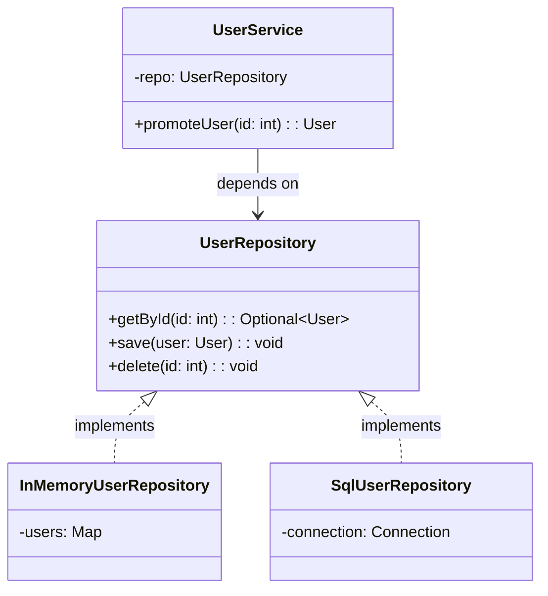

## Overview

The Repository Pattern is an architectural design pattern that mediates between
the domain and data mapping layers. It gives you a collection-like interface for
accessing domain objects and hides the details of data storage and retrieval.

I've used this pattern on projects where the team needed to swap MySQL for
PostgreSQL mid-project. Because business logic depended on a `UserRepository`
interface, not on raw SQL queries, the swap took days instead of weeks. The
tests didn't change at all.

It's a foundation of Clean Architecture and Domain-Driven Design (DDD), and is
used in frameworks such as Spring Data JPA, Entity Framework, and Django ORM.

## When to Use

- You're decoupling business logic from data access implementation.
- You're planning to swap data sources (database, API, cache, file) without
  changing business code.
- You need testable data layers that mock easily or swap to in-memory stores.
- Data access logic is scattered and needs a single home.
- You want caching, logging, or transaction management applied uniformly.

### When to avoid

- Small CRUD applications with a single data source and no test-doubling needs.
- Prototypes where the extra layer adds more friction than it's worth.

## Solution

Here's how the pieces fit together: the interface defines the contract,
concrete implementations handle storage, and services depend only on the
interface.



### Python

```python
from abc import ABC, abstractmethod
from typing import Optional

class User:
    def __init__(self, id: int, name: str):
        self.id = id
        self.name = name

class UserRepository(ABC):
    @abstractmethod
    def get_by_id(self, id: int) -> Optional[User]:
        pass

    @abstractmethod
    def save(self, user: User) -> None:
        pass

class InMemoryUserRepository(UserRepository):
    def __init__(self):
        self._users = {}

    def get_by_id(self, id: int) -> Optional[User]:
        return self._users.get(id)

    def save(self, user: User) -> None:
        self._users[user.id] = user

repo = InMemoryUserRepository()
repo.save(User(1, "Alice"))
print(repo.get_by_id(1).name)  # Alice
```

### JavaScript

```javascript
class User {
  constructor(id, name) {
    this.id = id;
    this.name = name;
  }
}

class UserRepository {
  getById(id) {
    throw new Error("Not implemented");
  }
  save(user) {
    throw new Error("Not implemented");
  }
}

class InMemoryUserRepository extends UserRepository {
  constructor() {
    super();
    this.users = new Map();
  }
  getById(id) {
    return this.users.get(id) ?? null;
  }
  save(user) {
    this.users.set(user.id, user);
  }
}

const repo = new InMemoryUserRepository();
repo.save(new User(1, "Alice"));
console.log(repo.getById(1).name); // Alice
```

### Java

```java
import java.util.HashMap;
import java.util.Map;
import java.util.Optional;

class User {
    int id;
    String name;
    User(int id, String name) { this.id = id; this.name = name; }
}

interface UserRepository {
    Optional<User> getById(int id);
    void save(User user);
}

class InMemoryUserRepository implements UserRepository {
    private final Map<Integer, User> users = new HashMap<>();

    public Optional<User> getById(int id) {
        return Optional.ofNullable(users.get(id));
    }

    public void save(User user) {
        users.put(user.id, user);
    }
}

UserRepository repo = new InMemoryUserRepository();
repo.save(new User(1, "Alice"));
System.out.println(repo.getById(1).map(u -> u.name).orElse("Unknown")); // Alice
```

## Explanation

The pattern splits data access into two layers:

- **Repository Interface**: defines what operations are available, such as
  `find`, `save`, and `delete`, without exposing how they're implemented.
- **Concrete Repository**: uses a specific storage mechanism, such as SQL,
  MongoDB, a REST API, or an in-memory Map, to implement the interface.

Business logic depends only on the interface. This lets you swap an in-memory
implementation for tests and a PostgreSQL or MongoDB implementation for
production without touching business code. See
[Dependency Injection](/patterns/dependency-injection-pattern/) for common
wiring strategies.

### Trade-offs

The repository pattern adds a layer of abstraction. For a simple CRUD app with
one entity and no business logic, that's overhead you don't need. I've seen
teams add repositories "for future flexibility" and then never swap the
database. That's premature abstraction.

On the other hand, if you've got complex business rules, two or more data
sources, or need to test services in isolation, repositories pay for themselves
quickly. The key question is: will you ever need to test the service without the
database? If yes, use repositories. If no, active record is simpler.

One downside: repositories can hide performance costs. A `findAll` call looks
innocent but might load 100,000 rows. I once debugged a production OOM caused by
exactly this. Always paginate `findAll` unless you know the collection is small.

### Aggregate roots

In Domain-Driven Design, repositories should be per aggregate root, not per
entity. An aggregate root is the entry point to a cluster of related objects.
For example, `OrderRepository` manages `Order` and its `OrderLine` items
together. You don't need an `OrderLineRepository` because `OrderLine` is always
accessed through its parent `Order`. This keeps consistency boundaries clear and stops partial updates from
violating invariants.

## Variants

| Variant | Use case | Trade-off |
| --- | --- | --- |
| [Generic Repository](/patterns/repository-pattern-typescript/) | CRUD for any entity with TypeScript generics | Less duplication, but less room for query optimization |
| Specification Pattern | Compose complex queries from reusable objects | Flexible, but harder to optimize at the database level |
| Unit of Work | Batch several operations into a single transaction | Adds complexity, but keeps data integrity |

## Best Practices

- Return domain objects, not raw rows or ORM-specific types. I've seen bugs
  where a service accidentally mutated an ORM entity and saved it to the
  database. Returning plain objects prevents this.
- Use interfaces so repositories are testable and swappable. If you inject the
  concrete class, you've lost the whole point of the pattern.
- Keep repositories focused on data access; business logic belongs in services.
- Return `Optional` or nullable types for missing data instead of throwing.
  Throwing on missing data forces callers to use try/catch for normal flow.
- Add pagination for `findAll` operations. I once debugged a production OOM
  caused by a repository that returned 500,000 rows without pagination.
- Use transactions when two or more repository operations must be atomic. See
  [Unit of Work](/patterns/repository-pattern-typescript/) for the pattern.

## Common Mistakes

- Leaking ORM details into services by returning database-specific objects. I
  see this mistake in almost every codebase I review. Once a service calls
  `Model.find().populate().lean()`, you can't swap the ORM without rewriting
  the service.
- Putting business logic inside repositories. If your repository has `if`
  statements about business rules, move them to the service.
- Creating god repositories that handle unrelated entity types. One repository
  per aggregate root, not one for everything.
- Ignoring transactions across several operations that should be atomic.
- Eager loading more data than needed because the abstraction hides the cost.
  Always paginate `findAll` unless you know the collection is small.

## Testing Strategy

The biggest win from the repository pattern is testability. With an in-memory
implementation, service tests don't need a database, Docker, or network calls.
Tests run in milliseconds and are deterministic.

### Unit tests with in-memory repository

```python
import pytest
from InMemoryUserRepository import InMemoryUserRepository
from UserService import UserService

def test_promote_user():
    repo = InMemoryUserRepository()
    repo.save(User(1, "Alice", role="member"))
    service = UserService(repo)

    user = service.promote_user(1)

    assert user.role == "admin"

def test_promote_missing_user_raises():
    repo = InMemoryUserRepository()
    service = UserService(repo)

    with pytest.raises(ValueError, match="User not found"):
        service.promote_user(999)
```

### Integration tests with real database

For integration tests, use a real database instance (or a test container like
Testcontainers). Test the mapping between rows and domain objects, pagination,
and error handling. I keep these tests separate from unit tests and run them in
CI only:

```python
import pytest
from SqlUserRepository import SqlUserRepository

@pytest.fixture
def repo(db_session):
    return SqlUserRepository(db_session)

def test_save_and_retrieve(repo):
    user = User(1, "Alice", role="member")
    repo.save(user)

    retrieved = repo.get_by_id(1)
    assert retrieved is not None
    assert retrieved.name == "Alice"
```

### What to test

- **Service logic**: use in-memory repository, test business rules and edge
  cases. These tests run fast and cover every branch.
- **Repository mapping**: use a real database, verify that rows map to domain
  objects correctly.
- **Error handling**: verify that database errors are translated to domain
  exceptions.

## See Also

- [Martin Fowler: Repository Pattern](https://martinfowler.com/eaaCatalog/repository.html):
  the original description from Patterns of Enterprise Application Architecture.
- [Spring Data JPA](https://docs.spring.io/spring-data/jpa/reference/):
  Java framework that uses the repository pattern with query derivation.
- [Entity Framework](https://learn.microsoft.com/en-us/ef/):
  .NET ORM with built-in repository and unit of work patterns.
- [Domain-Driven Design: Aggregate Root](https://martinfowler.com/bliki/DDD_Aggregate.html):
  why repositories should be per aggregate root, not per entity.
- [Repository Pattern with TypeScript Generics](/patterns/repository-pattern-typescript/):
  a type-safe generic implementation of this pattern.
- [Active Record Pattern](/patterns/active-record-pattern/): the alternative
  approach that mixes data access and domain logic.

## FAQ

### Is Repository the same as DAO?

Similar, but a DAO is usually lower-level and closer to tables. A Repository is
higher-level and works with domain aggregates. In practice the terms are often
used interchangeably.

### Do I still need Repository if I use an ORM?

Yes. ORMs handle mapping; repositories add a semantic layer that makes the
intent of data access explicit and testable.

### Can I use Repository with NoSQL databases?

Yes. The pattern is storage-agnostic. You can have `MongoUserRepository`,
`RedisUserRepository`, and `PostgresUserRepository` implementing the same
interface.

### Is this pattern suitable for small projects?

For small projects with few components it may add unnecessary complexity. Start
simple and introduce the pattern when you feel the pain it solves.

### Repository vs DAO: which do I use?

Use Repository when you think in domain terms (User, Order) and want to abstract
storage entirely. Use DAO when you map directly to tables and need specific
queries. Repository is domain-centric; DAO is table-centric.
