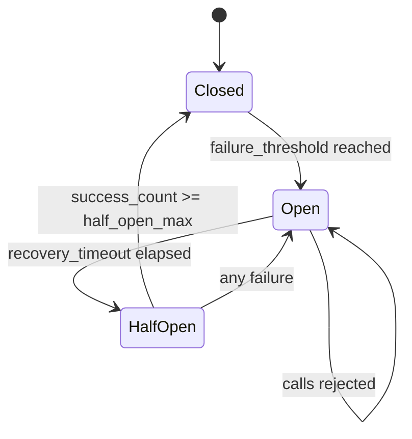

## Visión General

Un [circuit breaker](/patterns/circuit-breaker-pattern/) detiene llamadas a un
servicio que está fallando para prevenir fallas en cascada. Sin monitoring, no
podés ver qué breakers están abiertos, cuánto tiempo se quedan abiertos ni qué
tan seguido se disparan.

El patrón Circuit Breaker con Monitoring expone el estado del breaker (closed,
open, half-open), los conteos de fallas y los eventos de transición como métricas
de [Prometheus](https://prometheus.io/docs/introduction/overview/). Esto te
permite construir dashboards con estados en tiempo real, alertar cuando un breaker
permanece abierto demasiado tiempo y analizar patrones de recuperación.

Lo aprendí por las malas en una plataforma de pagos: teníamos circuit breakers en
cada servicio downstream, pero sin visibilidad de su estado. Cuando cayó un
proveedor de pagos, perdimos 20 minutos haciendo SSH a los servidores para revisar
logs de breakers. Después de ese incidente, agregamos métricas de Prometheus y un
dashboard de Grafana. En el siguiente incidente, vimos el breaker abierto en
segundos.

## Cuándo Usar

- Cualquier sistema que use circuit breakers y necesite visibilidad operativa.
- Microservicios con múltiples dependencias downstream protegidas por breakers.
- Entornos de producción donde necesitás alertar sobre breakers abiertos.
- Capacity planning y seguimiento de cuánto tiempo se mantienen los breakers
  abiertos.
- Respuesta a incidentes para identificar rápidamente una dependencia fallante.

### Cuándo evitarlo

- Aplicaciones que no usan circuit breakers: no hay estado para monitorear.
- Entornos de desarrollo donde podés observar el comportamiento directamente.
- Aplicaciones simples con una única dependencia downstream.
- Cuando la librería de circuit breaker ya exporta métricas.

## Solución

### Python circuit breaker con métricas de Prometheus

```python
import time
from enum import Enum
from prometheus_client import Gauge, Counter, Histogram, start_http_server

class CircuitState(Enum):
    CLOSED = "closed"
    OPEN = "open"
    HALF_OPEN = "half_open"

CIRCUIT_STATE = Gauge(
    "circuit_breaker_state",
    "Circuit breaker state (0=closed, 1=open, 2=half_open)",
    ["service", "endpoint"],
)

CIRCUIT_FAILURES = Counter(
    "circuit_breaker_failures_total",
    "Total failures that contributed to circuit breaker tripping",
    ["service", "endpoint"],
)

CIRCUIT_SUCCESSES = Counter(
    "circuit_breaker_successes_total",
    "Total successful calls through circuit breaker",
    ["service", "endpoint"],
)

CIRCUIT_REJECTED = Counter(
    "circuit_breaker_rejected_total",
    "Total calls rejected because circuit was open",
    ["service", "endpoint"],
)

CIRCUIT_STATE_TRANSITIONS = Counter(
    "circuit_breaker_state_transitions_total",
    "Circuit breaker state transitions",
    ["service", "endpoint", "from_state", "to_state"],
)

CIRCUIT_OPEN_DURATION = Histogram(
    "circuit_breaker_open_duration_seconds",
    "How long the circuit breaker stayed open",
    ["service", "endpoint"],
    buckets=[1, 5, 10, 30, 60, 120, 300, 600],
)

class MonitoredCircuitBreaker:
    def __init__(
        self,
        service_name,
        endpoint,
        failure_threshold=5,
        recovery_timeout=60,
        half_open_max_calls=3,
    ):
        self.service = service_name
        self.endpoint = endpoint
        self.failure_threshold = failure_threshold
        self.recovery_timeout = recovery_timeout
        self.half_open_max_calls = half_open_max_calls

        self._state = CircuitState.CLOSED
        self._failure_count = 0
        self._success_count = 0
        self._half_open_calls = 0
        self._last_failure_time = None
        self._opened_at = None

        self._update_state_metric()

    def _update_state_metric(self):
        state_map = {
            CircuitState.CLOSED: 0,
            CircuitState.OPEN: 1,
            CircuitState.HALF_OPEN: 2,
        }
        CIRCUIT_STATE.labels(
            service=self.service,
            endpoint=self.endpoint,
        ).set(state_map[self._state])

    def _transition(self, new_state):
        old_state = self._state
        if old_state == new_state:
            return

        CIRCUIT_STATE_TRANSITIONS.labels(
            service=self.service,
            endpoint=self.endpoint,
            from_state=old_state.value,
            to_state=new_state.value,
        ).inc()

        if old_state == CircuitState.OPEN and new_state == CircuitState.CLOSED:
            if self._opened_at:
                duration = time.time() - self._opened_at
                CIRCUIT_OPEN_DURATION.labels(
                    service=self.service,
                    endpoint=self.endpoint,
                ).observe(duration)

        self._state = new_state
        self._update_state_metric()

        if new_state == CircuitState.OPEN:
            self._opened_at = time.time()
        elif new_state == CircuitState.CLOSED:
            self._opened_at = None
            self._failure_count = 0
            self._success_count = 0

    def call(self, func, *args, **kwargs):
        if self._state == CircuitState.OPEN:
            if time.time() - self._last_failure_time > self.recovery_timeout:
                self._transition(CircuitState.HALF_OPEN)
                self._half_open_calls = 0
            else:
                CIRCUIT_REJECTED.labels(
                    service=self.service,
                    endpoint=self.endpoint,
                ).inc()
                raise CircuitBreakerOpenError(
                    f"Circuit breaker open for {self.service}/{self.endpoint}"
                )

        if self._state == CircuitState.HALF_OPEN:
            if self._half_open_calls >= self.half_open_max_calls:
                CIRCUIT_REJECTED.labels(
                    service=self.service,
                    endpoint=self.endpoint,
                ).inc()
                raise CircuitBreakerOpenError("Half-open call limit reached")

        try:
            result = func(*args, **kwargs)
            self._on_success()
            return result
        except Exception as e:
            self._on_failure()
            raise

    def _on_success(self):
        CIRCUIT_SUCCESSES.labels(
            service=self.service,
            endpoint=self.endpoint,
        ).inc()

        if self._state == CircuitState.HALF_OPEN:
            self._success_count += 1
            self._half_open_calls += 1
            if self._success_count >= self.half_open_max_calls:
                self._transition(CircuitState.CLOSED)
        elif self._state == CircuitState.CLOSED:
            self._failure_count = 0

    def _on_failure(self):
        CIRCUIT_FAILURES.labels(
            service=self.service,
            endpoint=self.endpoint,
        ).inc()

        self._last_failure_time = time.time()

        if self._state == CircuitState.HALF_OPEN:
            self._transition(CircuitState.OPEN)
        elif self._state == CircuitState.CLOSED:
            self._failure_count += 1
            if self._failure_count >= self.failure_threshold:
                self._transition(CircuitState.OPEN)

class CircuitBreakerOpenError(Exception):
    pass

start_http_server(9090)

payment_breaker = MonitoredCircuitBreaker(
    service="payment-service",
    endpoint="/api/charge",
    failure_threshold=5,
    recovery_timeout=60,
)

def charge_payment(order):
    return payment_breaker.call(payment_gateway.charge, order)
```

### Node.js con [opossum](https://www.npmjs.com/package/opossum) y Prometheus

```javascript
const CircuitBreaker = require("opossum");
const promClient = require("prom-client");

const register = new promClient.Registry();

const circuitState = new promClient.Gauge({
  name: "circuit_breaker_state",
  help: "Circuit breaker state (0=closed, 1=open, 2=half_open)",
  labelNames: ["service", "endpoint"],
  registers: [register],
});

const circuitFailures = new promClient.Counter({
  name: "circuit_breaker_failures_total",
  help: "Total failures that contributed to circuit breaker tripping",
  labelNames: ["service", "endpoint"],
  registers: [register],
});

const circuitRejected = new promClient.Counter({
  name: "circuit_breaker_rejected_total",
  help: "Total calls rejected because circuit was open",
  labelNames: ["service", "endpoint"],
  registers: [register],
});

const circuitTransitions = new promClient.Counter({
  name: "circuit_breaker_state_transitions_total",
  help: "Circuit breaker state transitions",
  labelNames: ["service", "endpoint", "from_state", "to_state"],
  registers: [register],
});

function createMonitoredBreaker(name, endpoint, fn, options = {}) {
  const breaker = new CircuitBreaker(fn, {
    timeout: options.timeout || 5000,
    errorThresholdPercentage: options.errorThreshold || 50,
    resetTimeout: options.resetTimeout || 30000,
    rollingCountTimeout: 60000,
    rollingCountBuckets: 10,
    name: `${name}/${endpoint}`,
  });

  const labels = { service: name, endpoint };
  const stateMap = { closed: 0, opened: 1, halfOpen: 2 };

  breaker.on("state", (from, to) => {
    circuitState.labels(labels).set(stateMap[to] ?? 0);
    circuitTransitions.labels({
      ...labels,
      from_state: from,
      to_state: to,
    }).inc();
  });

  breaker.on("failure", () => {
    circuitFailures.labels(labels).inc();
  });

  breaker.on("reject", () => {
    circuitRejected.labels(labels).inc();
  });

  circuitState.labels(labels).set(0);

  return breaker;
}

const paymentBreaker = createMonitoredBreaker(
  "payment-service",
  "/api/charge",
  async (order) => {
    const response = await fetch("https://payment-service/api/charge", {
      method: "POST",
      body: JSON.stringify(order),
    });
    if (!response.ok) throw new Error(`Payment failed: ${response.status}`);
    return response.json();
  },
  { timeout: 5000, errorThreshold: 50, resetTimeout: 30000 }
);

const express = require("express");
const app = express();

app.get("/metrics", async (req, res) => {
  res.set("Content-Type", register.contentType);
  res.end(await register.metrics());
});
```

### Java con [Resilience4j](https://resilience4j.readme.io/) y [Micrometer](https://micrometer.io/)

```java
import io.github.resilience4j.circuitbreaker.CircuitBreaker;
import io.github.resilience4j.circuitbreaker.CircuitBreakerConfig;
import io.github.resilience4j.circuitbreaker.CircuitBreakerRegistry;
import io.github.resilience4j.micrometer.tagged.TaggedCircuitBreakerMetrics;
import io.micrometer.core.instrument.MeterRegistry;
import io.micrometer.prometheus.PrometheusConfig;
import io.micrometer.prometheus.PrometheusMeterRegistry;
import java.time.Duration;

MeterRegistry meterRegistry = new PrometheusMeterRegistry(PrometheusConfig.DEFAULT);
CircuitBreakerRegistry registry = CircuitBreakerRegistry.ofDefaults();

TaggedCircuitBreakerMetrics.ofCircuitBreakerRegistry(registry)
    .bindTo(meterRegistry);

CircuitBreaker paymentBreaker = CircuitBreaker.of(
    "payment-service",
    CircuitBreakerConfig.custom()
        .failureRateThreshold(50)
        .waitDurationInOpenState(Duration.ofSeconds(30))
        .slidingWindowSize(10)
        .minimumNumberOfCalls(5)
        .build()
);

registry.addCircuitBreaker(paymentBreaker);

CircuitBreaker.decorateSupplier(paymentBreaker, () -> {
    return paymentClient.charge(order);
}).get();

// Métricas expuestas automáticamente:
// resilience4j_circuitbreaker_state{name="payment-service",state="closed"} 1
// resilience4j_circuitbreaker_calls_total{name="payment-service",kind="successful"} 42
// resilience4j_circuitbreaker_calls_total{name="payment-service",kind="failed"} 3
// resilience4j_circuitbreaker_calls_total{name="payment-service",kind="not_permitted"} 0
```

### Reglas de alerting de Prometheus

```yaml
groups:
  - name: circuit-breakers
    rules:
      - alert: CircuitBreakerOpen
        expr: circuit_breaker_state == 1
        for: 1m
        labels:
          severity: critical
        annotations:
          summary: "Circuit breaker open for {{ $labels.service }}/{{ $labels.endpoint }}"
          description: "The circuit breaker has been open for more than 1 minute."

      - alert: CircuitBreakerHighRejectionRate
        expr: rate(circuit_breaker_rejected_total[5m]) > 10
        for: 2m
        labels:
          severity: warning
        annotations:
          summary: "High rejection rate for {{ $labels.service }}"
          description: "Circuit breaker is rejecting more than 10 calls per second."

      - alert: CircuitBreakerFlapping
        expr: increase(circuit_breaker_state_transitions_total[10m]) > 10
        for: 5m
        labels:
          severity: warning
        annotations:
          summary: "Circuit breaker flapping for {{ $labels.service }}"
          description: "More than 10 state transitions in 10 minutes."

      - alert: CircuitBreakerTripped
        expr: increase(circuit_breaker_state_transitions_total{to_state="open"}[1m]) > 0
        labels:
          severity: info
        annotations:
          summary: "Circuit breaker tripped for {{ $labels.service }}/{{ $labels.endpoint }}"
```

### Queries de dashboard de Grafana

```text
# Estado actual de todos los circuit breakers
circuit_breaker_state

# Failure rate por servicio
sum(rate(circuit_breaker_failures_total[5m])) by (service)

# Rejection rate por servicio
sum(rate(circuit_breaker_rejected_total[5m])) by (service)

# Cuánto tiempo se mantuvieron abiertos (percentil 95)
histogram_quantile(0.95,
  rate(circuit_breaker_open_duration_seconds_bucket[1h]))

# Transiciones de estado a lo largo del tiempo
sum(rate(circuit_breaker_state_transitions_total[1h])) by (service, from_state, to_state)

# Success rate a través de los breakers
sum(rate(circuit_breaker_successes_total[5m])) by (service)
  /
  (sum(rate(circuit_breaker_successes_total[5m])) by (service)
   + sum(rate(circuit_breaker_failures_total[5m])) by (service))
```

### Logging estructurado para transiciones

```python
import structlog

logger = structlog.get_logger()

class MonitoredCircuitBreaker:
    # ... código anterior ...

    def _transition(self, new_state):
        old_state = self._state
        if old_state == new_state:
            return

        logger.warning(
            "circuit_breaker_state_transition",
            service=self.service,
            endpoint=self.endpoint,
            from_state=old_state.value,
            to_state=new_state.value,
            failure_count=self._failure_count,
        )

        if new_state == CircuitState.OPEN:
            logger.error(
                "circuit_breaker_opened",
                service=self.service,
                endpoint=self.endpoint,
                failure_count=self._failure_count,
                threshold=self.failure_threshold,
                recovery_timeout=self.recovery_timeout,
            )
        elif new_state == CircuitState.CLOSED:
            logger.info(
                "circuit_breaker_closed",
                service=self.service,
                endpoint=self.endpoint,
                open_duration=time.time() - self._opened_at if self._opened_at else 0,
            )

        # Actualizar métricas como antes
        CIRCUIT_STATE_TRANSITIONS.labels(
            service=self.service,
            endpoint=self.endpoint,
            from_state=old_state.value,
            to_state=new_state.value,
        ).inc()
```

## Variantes

### Bulkhead monitoring junto a circuit breakers

```javascript
const { Bulkhead } = require("opossum");

const bulkheadActiveCalls = new promClient.Gauge({
  name: "bulkhead_active_calls",
  help: "Currently active calls in bulkhead",
  labelNames: ["service"],
  registers: [register],
});

const bulkheadRejected = new promClient.Counter({
  name: "bulkhead_rejected_total",
  help: "Calls rejected by bulkhead",
  labelNames: ["service"],
  registers: [register],
});

function createMonitoredBulkhead(service, fn, maxConcurrent) {
  const bulkhead = new Bulkhead(fn, { maxConcurrent });

  bulkhead.on("execute", () => {
    bulkheadActiveCalls.labels({ service }).inc();
  });

  bulkhead.on("reject", () => {
    bulkheadRejected.labels({ service }).inc();
  });

  bulkhead.on("success", () => {
    bulkheadActiveCalls.labels({ service }).dec();
  });

  bulkhead.on("failure", () => {
    bulkheadActiveCalls.labels({ service }).dec();
  });

  return bulkhead;
}
```

### Dashboard de múltiples dependencias

```python
class DependencyMonitor:
    def __init__(self):
        self.breakers = {}

    def register(self, service, endpoint, failure_threshold=5, recovery_timeout=60):
        breaker = MonitoredCircuitBreaker(
            service_name=service,
            endpoint=endpoint,
            failure_threshold=failure_threshold,
            recovery_timeout=recovery_timeout,
        )
        self.breakers[f"{service}/{endpoint}"] = breaker
        return breaker

    def health_summary(self):
        return {
            key: breaker._state.value
            for key, breaker in self.breakers.items()
        }

monitor = DependencyMonitor()
monitor.register("payment-service", "/api/charge")
monitor.register("inventory-service", "/api/stock")
monitor.register("notification-service", "/api/email")
monitor.register("user-service", "/api/users")
```

## Explicación



Monitorear un circuit breaker significa emitir métricas para:

- **Estado**: un gauge mapeado a 0 (closed), 1 (open) o 2 (half-open).
- **Fallos y éxitos**: contadores que te permiten calcular las tasas de error.
- **Llamadas rechazadas**: contador que te dice cuándo el breaker descarta
  tráfico.
- **Transiciones de estado**: contador para detectar flapping.
- **Duración abierta**: histograma que te muestra cuánto tarda la recuperación.

Los logs complementan las métricas registrando por qué un breaker cambió de
estado. Usá labels determinísticos como `service` y `endpoint` en métricas, logs y
trazas. Esto facilita correlacionar una alerta de [Grafana](https://grafana.com/docs/grafana/latest/)
con los [logs estructurados](/patterns/structured-logging-pattern/) asociados.
Combiná esto con [health checks](/patterns/health-check-pattern/) para tener un
cuadro operativo completo.

## Mejores Prácticas

- Exponer el estado como gauge con valores numéricos para cada estado. Uso
  0, 1, 2 para closed, open, half-open porque es más fácil de grafiquear.
- Trackear las transiciones de estado por separado para detectar flapping. El
  gauge de estado solo no te dice si el breaker está oscilando.
- Alertar cuando un breaker permanece abierto más de un minuto. Vi equipos perder
  incidentes porque solo revisaban el gauge durante los incidentes.
- Loguear las transiciones con conteos de fallas y thresholds. Te lo vas a
  agradecer cuando debuguees un incidente a las 3am.
- Medir la duración abierta con un histograma para identificar problemas crónicos
  vs. transientes. Un breaker que siempre está abierto 30 segundos tiene un
  problema distinto a uno que flapea cada 2 segundos.
- Monitorear la tasa de rechazo, porque una alta tasa significa degradación
  aunque el servicio no esté caído.
- Usar labels consistentes `service` y `endpoint` en métricas, logs y trazas. Si
  hacés una sola cosa por la correlación, hacé esto.
- Configurar detección de flapping: más de diez transiciones en diez minutos suele
  indicar una dependencia inestable. Una vez tracé un breaker que flapeaba a un
  servicio downstream que se reiniciaba cada 30 segundos por un memory leak.

## Errores Comunes

- Trackear solo el gauge de estado e ignorar fallas, rechazos y duración. Vi
  esto dejar a equipos ciegos ante degradación.
- No alertar cuando un breaker está abierto, dejándolo abierto por horas. Un
  equipo con el que trabajé tuvo un breaker abierto 3 días antes de que alguien
  lo notara.
- No loguear las transiciones, dificultando entender por qué se abrió. Te
  quedás adivinando durante los incidentes.
- Ignorar el estado half-open, clave para entender los intentos de recuperación.
- No detectar flapping. Te perdés una dependencia inestable de vista.
- No ajustar el failure rate threshold a tus patrones de tráfico. Un threshold
  que funciona para 1000 req/s puede dispararse constantemente a 10 req/s.

## Estrategia de Testing

### Tests de transiciones de estado

Testeá que el breaker transicione correctamente entre estados. Encontré que
testear la lógica de transición separada de las métricas atrapa la mayoría de
los bugs.

```python
def test_closed_to_open_on_threshold():
    breaker = MonitoredCircuitBreaker("test", "/api", failure_threshold=3)
    for _ in range(3):
        try:
            breaker.call(lambda: (_ for _ in ()).throw(ValueError("fail")))
        except ValueError:
            pass
    assert breaker._state == CircuitState.OPEN

def test_open_to_half_open_after_timeout():
    breaker = MonitoredCircuitBreaker("test", "/api", failure_threshold=1, recovery_timeout=0)
    try:
        breaker.call(lambda: (_ for _ in ()).throw(ValueError("fail")))
    except ValueError:
        pass
    # Después de recovery_timeout (0s), la próxima llamada debería pasar a half-open
    import time; time.sleep(0.01)
    assert breaker._state == CircuitState.OPEN
    # Disparar half-open intentando una llamada
    breaker.call(lambda: "ok")
    assert breaker._state in (CircuitState.HALF_OPEN, CircuitState.CLOSED)
```

### Tests de emisión de métricas

Verificá que las métricas se emitan en cada transición. Usá las utilidades de
test de Prometheus para recolectar y assertar sobre los valores de métricas.

```python
from prometheus_client import CollectorRegistry, Gauge, Counter

def test_state_metric_updates_on_transition():
    registry = CollectorRegistry()
    state = Gauge("cb_state", "state", ["service"], registry=registry)
    breaker = MonitoredCircuitBreaker("svc", "/api", failure_threshold=1)
    # Forzar una falla para abrir el breaker
    try:
        breaker.call(lambda: (_ for _ in ()).throw(ValueError("boom")))
    except ValueError:
        pass
    # Assertar que el gauge de estado se actualizó
    samples = list(registry.collect())
    state_sample = [s for s in samples if s.name == "cb_state"]
    assert len(state_sample) > 0
```

### Tests de reglas de alerting

Testeá las reglas de alerting de Prometheus con promtool. Corro estos tests en
CI para atrapar expresiones de alerta rotas antes de que lleguen a producción.

```bash
promtool test rules test_alerts.yml
```

```yaml
# test_alerts.yml
rule_files:
  - alerts.yml
evaluation_interval: 1m
tests:
  - interval: 1m
    input_series:
      - series: 'circuit_breaker_state{service="payment",endpoint="/api/charge"}'
        values: '0 0 1 1 1'
    alert_rule_test:
      - eval_time: 3m
        alertname: CircuitBreakerOpen
        exp_alerts:
          - exp_labels:
              service: payment
              endpoint: /api/charge
            exp_annotations:
              summary: "Circuit breaker open for payment//api/charge"
```

## See Also

- [Documentación de Prometheus](https://prometheus.io/docs/introduction/overview/):
  docs oficiales de tipos de métricas, querying y alerting.
- [Resilience4j Circuit Breaker](https://resilience4j.readme.io/getting-started-3/usage):
  librería Java con métricas Micrometer integradas.
- [opossum (npm)](https://www.npmjs.com/package/opossum):
  circuit breaker para Node.js con hooks de eventos para métricas.
- [Ejemplos de dashboards de Grafana](https://grafana.com/grafana/dashboards/):
  dashboards de la comunidad para monitoring de circuit breakers.
- [Circuit Breaker Pattern](/patterns/circuit-breaker-pattern/):
  el patrón base sobre el que se construye este.
- [Metrics Aggregation Pattern](/patterns/metrics-aggregation-pattern/):
  agregación de métricas across servicios.

## FAQ

### ¿Por qué exponer el estado del circuit breaker como métricas?

Las métricas te permiten construir dashboards y alertas. Sin ellas, tendrías
que revisar manualmente cada servicio para responder "¿qué breakers están
abiertos ahora?" o "¿qué tan seguido se dispara el breaker de pagos?"

### ¿En qué debería alertar?

- Cualquier breaker abierto por más de 1 minuto: crítico.
- Tasa de rechazo mayor a 10 por segundo: advertencia.
- Más de 10 transiciones de estado en 10 minutos: flapping, advertencia.

### ¿En qué se diferencia de los health checks?

Los health checks reportan si tu servicio está vivo. Las métricas de circuit
breaker reportan si tus dependencias están saludables. Un servicio puede estar
vivo pero degradado porque un breaker downstream está abierto.

### ¿Debería usar una librería o construir mi propio breaker?

Usá una librería (opossum, Resilience4j, pybreaker) para la lógica del breaker y
agregá el monitoring. La mayoría expone hooks para métricas. Construir un breaker
desde cero es propenso a errores.

### ¿Qué es el flapping y por qué importa?

El flapping ocurre cuando un breaker abre y cierra rápidamente. Apunta a una
dependencia inestable que falla intermitentemente. Diagnosticar flapping suele
ser más difícil que diagnosticar un breaker consistentemente abierto.

### ¿Puedo usar esto con trazas?

Sí. Agregá las labels `service` y `endpoint` como tags de traza. Cuando una alerta
se dispare, podés saltar de la métrica a la traza para ver la llamada fallante.
