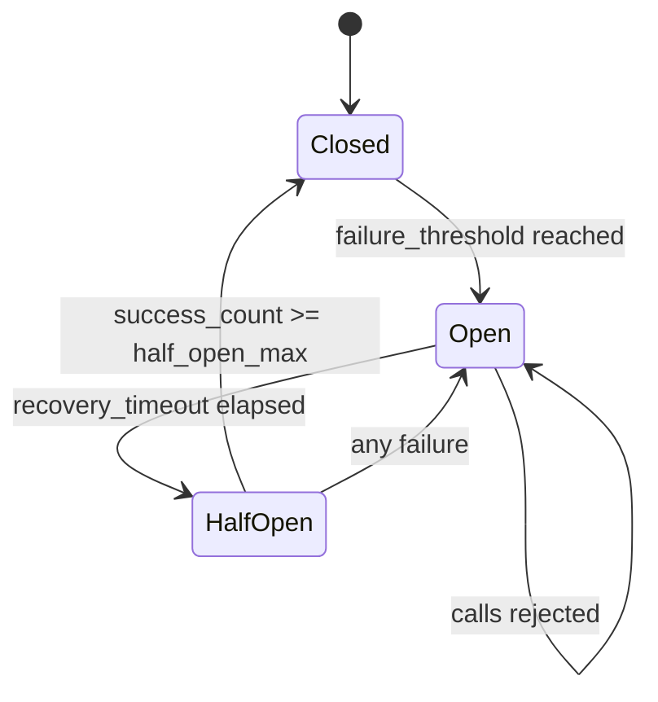

## Overview

A [circuit breaker](/patterns/circuit-breaker-pattern/) stops calls to a failing
service to prevent cascading failures. Without monitoring, you can't see which
breakers are open, how often they trip, or how long they stay open.

The Circuit Breaker with Monitoring pattern exposes breaker state (closed, open,
half-open), failure counts, and transition events as [Prometheus](https://prometheus.io/docs/introduction/overview/)
metrics. This gives you dashboards for real-time breaker states, alerts when breakers
stay open too long, and data to watch recovery patterns over time.

I learned this the hard way on a payments platform: we had circuit breakers on
every downstream service, but no visibility into their state. When a payment
outage hit, we spent 20 minutes SSH-ing into boxes to check breaker logs. After
that incident, we added Prometheus metrics and a Grafana dashboard. The next
outage, we saw the open breaker within seconds.

## When to Use

- Any system using circuit breakers that needs operational visibility.
- Microservices with several downstream dependencies protected by breakers.
- Production environments where you need alerts on open breakers.
- Capacity planning and tracking how often and how long breakers trip.
- Incident response to quickly identify a failing dependency.

### When to avoid

- Applications that don't use circuit breakers: there's no state to monitor.
- Development environments where you can observe behavior directly.
- Simple applications with a single downstream dependency.
- When your circuit breaker library already exports metrics.

## Solution

### Python circuit breaker with Prometheus metrics

```python
import time
from enum import Enum
from prometheus_client import Gauge, Counter, Histogram, start_http_server

class CircuitState(Enum):
    CLOSED = "closed"
    OPEN = "open"
    HALF_OPEN = "half_open"

CIRCUIT_STATE = Gauge(
    "circuit_breaker_state",
    "Circuit breaker state (0=closed, 1=open, 2=half_open)",
    ["service", "endpoint"],
)

CIRCUIT_FAILURES = Counter(
    "circuit_breaker_failures_total",
    "Total failures that contributed to circuit breaker tripping",
    ["service", "endpoint"],
)

CIRCUIT_SUCCESSES = Counter(
    "circuit_breaker_successes_total",
    "Total successful calls through circuit breaker",
    ["service", "endpoint"],
)

CIRCUIT_REJECTED = Counter(
    "circuit_breaker_rejected_total",
    "Total calls rejected because circuit was open",
    ["service", "endpoint"],
)

CIRCUIT_STATE_TRANSITIONS = Counter(
    "circuit_breaker_state_transitions_total",
    "Circuit breaker state transitions",
    ["service", "endpoint", "from_state", "to_state"],
)

CIRCUIT_OPEN_DURATION = Histogram(
    "circuit_breaker_open_duration_seconds",
    "How long the circuit breaker stayed open",
    ["service", "endpoint"],
    buckets=[1, 5, 10, 30, 60, 120, 300, 600],
)

class MonitoredCircuitBreaker:
    def __init__(
        self,
        service_name,
        endpoint,
        failure_threshold=5,
        recovery_timeout=60,
        half_open_max_calls=3,
    ):
        self.service = service_name
        self.endpoint = endpoint
        self.failure_threshold = failure_threshold
        self.recovery_timeout = recovery_timeout
        self.half_open_max_calls = half_open_max_calls

        self._state = CircuitState.CLOSED
        self._failure_count = 0
        self._success_count = 0
        self._half_open_calls = 0
        self._last_failure_time = None
        self._opened_at = None

        self._update_state_metric()

    def _update_state_metric(self):
        state_map = {
            CircuitState.CLOSED: 0,
            CircuitState.OPEN: 1,
            CircuitState.HALF_OPEN: 2,
        }
        CIRCUIT_STATE.labels(
            service=self.service,
            endpoint=self.endpoint,
        ).set(state_map[self._state])

    def _transition(self, new_state):
        old_state = self._state
        if old_state == new_state:
            return

        CIRCUIT_STATE_TRANSITIONS.labels(
            service=self.service,
            endpoint=self.endpoint,
            from_state=old_state.value,
            to_state=new_state.value,
        ).inc()

        if old_state == CircuitState.OPEN and new_state == CircuitState.CLOSED:
            if self._opened_at:
                duration = time.time() - self._opened_at
                CIRCUIT_OPEN_DURATION.labels(
                    service=self.service,
                    endpoint=self.endpoint,
                ).observe(duration)

        self._state = new_state
        self._update_state_metric()

        if new_state == CircuitState.OPEN:
            self._opened_at = time.time()
        elif new_state == CircuitState.CLOSED:
            self._opened_at = None
            self._failure_count = 0
            self._success_count = 0

    def call(self, func, *args, **kwargs):
        if self._state == CircuitState.OPEN:
            if time.time() - self._last_failure_time > self.recovery_timeout:
                self._transition(CircuitState.HALF_OPEN)
                self._half_open_calls = 0
            else:
                CIRCUIT_REJECTED.labels(
                    service=self.service,
                    endpoint=self.endpoint,
                ).inc()
                raise CircuitBreakerOpenError(
                    f"Circuit breaker open for {self.service}/{self.endpoint}"
                )

        if self._state == CircuitState.HALF_OPEN:
            if self._half_open_calls >= self.half_open_max_calls:
                CIRCUIT_REJECTED.labels(
                    service=self.service,
                    endpoint=self.endpoint,
                ).inc()
                raise CircuitBreakerOpenError("Half-open call limit reached")

        try:
            result = func(*args, **kwargs)
            self._on_success()
            return result
        except Exception as e:
            self._on_failure()
            raise

    def _on_success(self):
        CIRCUIT_SUCCESSES.labels(
            service=self.service,
            endpoint=self.endpoint,
        ).inc()

        if self._state == CircuitState.HALF_OPEN:
            self._success_count += 1
            self._half_open_calls += 1
            if self._success_count >= self.half_open_max_calls:
                self._transition(CircuitState.CLOSED)
        elif self._state == CircuitState.CLOSED:
            self._failure_count = 0

    def _on_failure(self):
        CIRCUIT_FAILURES.labels(
            service=self.service,
            endpoint=self.endpoint,
        ).inc()

        self._last_failure_time = time.time()

        if self._state == CircuitState.HALF_OPEN:
            self._transition(CircuitState.OPEN)
        elif self._state == CircuitState.CLOSED:
            self._failure_count += 1
            if self._failure_count >= self.failure_threshold:
                self._transition(CircuitState.OPEN)

class CircuitBreakerOpenError(Exception):
    pass

start_http_server(9090)

payment_breaker = MonitoredCircuitBreaker(
    service="payment-service",
    endpoint="/api/charge",
    failure_threshold=5,
    recovery_timeout=60,
)

def charge_payment(order):
    return payment_breaker.call(payment_gateway.charge, order)
```

### Node.js with [opossum](https://www.npmjs.com/package/opossum) and Prometheus

```javascript
const CircuitBreaker = require("opossum");
const promClient = require("prom-client");

const register = new promClient.Registry();

const circuitState = new promClient.Gauge({
  name: "circuit_breaker_state",
  help: "Circuit breaker state (0=closed, 1=open, 2=half_open)",
  labelNames: ["service", "endpoint"],
  registers: [register],
});

const circuitFailures = new promClient.Counter({
  name: "circuit_breaker_failures_total",
  help: "Total failures that contributed to circuit breaker tripping",
  labelNames: ["service", "endpoint"],
  registers: [register],
});

const circuitRejected = new promClient.Counter({
  name: "circuit_breaker_rejected_total",
  help: "Total calls rejected because circuit was open",
  labelNames: ["service", "endpoint"],
  registers: [register],
});

const circuitTransitions = new promClient.Counter({
  name: "circuit_breaker_state_transitions_total",
  help: "Circuit breaker state transitions",
  labelNames: ["service", "endpoint", "from_state", "to_state"],
  registers: [register],
});

function createMonitoredBreaker(name, endpoint, fn, options = {}) {
  const breaker = new CircuitBreaker(fn, {
    timeout: options.timeout || 5000,
    errorThresholdPercentage: options.errorThreshold || 50,
    resetTimeout: options.resetTimeout || 30000,
    rollingCountTimeout: 60000,
    rollingCountBuckets: 10,
    name: `${name}/${endpoint}`,
  });

  const labels = { service: name, endpoint };
  const stateMap = { closed: 0, opened: 1, halfOpen: 2 };

  breaker.on("state", (from, to) => {
    circuitState.labels(labels).set(stateMap[to] ?? 0);
    circuitTransitions.labels({
      ...labels,
      from_state: from,
      to_state: to,
    }).inc();
  });

  breaker.on("failure", () => {
    circuitFailures.labels(labels).inc();
  });

  breaker.on("reject", () => {
    circuitRejected.labels(labels).inc();
  });

  circuitState.labels(labels).set(0);

  return breaker;
}

const paymentBreaker = createMonitoredBreaker(
  "payment-service",
  "/api/charge",
  async (order) => {
    const response = await fetch("https://payment-service/api/charge", {
      method: "POST",
      body: JSON.stringify(order),
    });
    if (!response.ok) throw new Error(`Payment failed: ${response.status}`);
    return response.json();
  },
  { timeout: 5000, errorThreshold: 50, resetTimeout: 30000 }
);

const express = require("express");
const app = express();

app.get("/metrics", async (req, res) => {
  res.set("Content-Type", register.contentType);
  res.end(await register.metrics());
});
```

### Java with [Resilience4j](https://resilience4j.readme.io/) and [Micrometer](https://micrometer.io/)

```java
import io.github.resilience4j.circuitbreaker.CircuitBreaker;
import io.github.resilience4j.circuitbreaker.CircuitBreakerConfig;
import io.github.resilience4j.circuitbreaker.CircuitBreakerRegistry;
import io.github.resilience4j.micrometer.tagged.TaggedCircuitBreakerMetrics;
import io.micrometer.core.instrument.MeterRegistry;
import io.micrometer.prometheus.PrometheusConfig;
import io.micrometer.prometheus.PrometheusMeterRegistry;
import java.time.Duration;

MeterRegistry meterRegistry = new PrometheusMeterRegistry(PrometheusConfig.DEFAULT);
CircuitBreakerRegistry registry = CircuitBreakerRegistry.ofDefaults();

TaggedCircuitBreakerMetrics.ofCircuitBreakerRegistry(registry)
    .bindTo(meterRegistry);

CircuitBreaker paymentBreaker = CircuitBreaker.of(
    "payment-service",
    CircuitBreakerConfig.custom()
        .failureRateThreshold(50)
        .waitDurationInOpenState(Duration.ofSeconds(30))
        .slidingWindowSize(10)
        .minimumNumberOfCalls(5)
        .build()
);

registry.addCircuitBreaker(paymentBreaker);

CircuitBreaker.decorateSupplier(paymentBreaker, () -> {
    return paymentClient.charge(order);
}).get();

// Metrics automatically exposed:
// resilience4j_circuitbreaker_state{name="payment-service",state="closed"} 1
// resilience4j_circuitbreaker_calls_total{name="payment-service",kind="successful"} 42
// resilience4j_circuitbreaker_calls_total{name="payment-service",kind="failed"} 3
// resilience4j_circuitbreaker_calls_total{name="payment-service",kind="not_permitted"} 0
```

### Prometheus alerting rules

```yaml
groups:
  - name: circuit-breakers
    rules:
      - alert: CircuitBreakerOpen
        expr: circuit_breaker_state == 1
        for: 1m
        labels:
          severity: critical
        annotations:
          summary: "Circuit breaker open for {{ $labels.service }}/{{ $labels.endpoint }}"
          description: "The circuit breaker has been open for more than 1 minute."

      - alert: CircuitBreakerHighRejectionRate
        expr: rate(circuit_breaker_rejected_total[5m]) > 10
        for: 2m
        labels:
          severity: warning
        annotations:
          summary: "High rejection rate for {{ $labels.service }}"
          description: "Circuit breaker is rejecting more than 10 calls per second."

      - alert: CircuitBreakerFlapping
        expr: increase(circuit_breaker_state_transitions_total[10m]) > 10
        for: 5m
        labels:
          severity: warning
        annotations:
          summary: "Circuit breaker flapping for {{ $labels.service }}"
          description: "More than 10 state transitions in 10 minutes."

      - alert: CircuitBreakerTripped
        expr: increase(circuit_breaker_state_transitions_total{to_state="open"}[1m]) > 0
        labels:
          severity: info
        annotations:
          summary: "Circuit breaker tripped for {{ $labels.service }}/{{ $labels.endpoint }}"
```

### Grafana dashboard queries

```text
# Current state of all circuit breakers
circuit_breaker_state

# Failure rate by service
sum(rate(circuit_breaker_failures_total[5m])) by (service)

# Rejection rate by service
sum(rate(circuit_breaker_rejected_total[5m])) by (service)

# How long breakers stayed open (95th percentile)
histogram_quantile(0.95,
  rate(circuit_breaker_open_duration_seconds_bucket[1h]))

# State transitions over time
sum(rate(circuit_breaker_state_transitions_total[1h])) by (service, from_state, to_state)

# Success rate through breakers
sum(rate(circuit_breaker_successes_total[5m])) by (service)
  /
  (sum(rate(circuit_breaker_successes_total[5m])) by (service)
   + sum(rate(circuit_breaker_failures_total[5m])) by (service))
```

### Structured logging for state transitions

```python
import structlog

logger = structlog.get_logger()

class MonitoredCircuitBreaker:
    # ... previous code ...

    def _transition(self, new_state):
        old_state = self._state
        if old_state == new_state:
            return

        logger.warning(
            "circuit_breaker_state_transition",
            service=self.service,
            endpoint=self.endpoint,
            from_state=old_state.value,
            to_state=new_state.value,
            failure_count=self._failure_count,
        )

        if new_state == CircuitState.OPEN:
            logger.error(
                "circuit_breaker_opened",
                service=self.service,
                endpoint=self.endpoint,
                failure_count=self._failure_count,
                threshold=self.failure_threshold,
                recovery_timeout=self.recovery_timeout,
            )
        elif new_state == CircuitState.CLOSED:
            logger.info(
                "circuit_breaker_closed",
                service=self.service,
                endpoint=self.endpoint,
                open_duration=time.time() - self._opened_at if self._opened_at else 0,
            )

        # Update metrics as before
        CIRCUIT_STATE_TRANSITIONS.labels(
            service=self.service,
            endpoint=self.endpoint,
            from_state=old_state.value,
            to_state=new_state.value,
        ).inc()
```

## Variants

### Bulkhead monitoring alongside circuit breakers

```javascript
const { Bulkhead } = require("opossum");

const bulkheadActiveCalls = new promClient.Gauge({
  name: "bulkhead_active_calls",
  help: "Currently active calls in bulkhead",
  labelNames: ["service"],
  registers: [register],
});

const bulkheadRejected = new promClient.Counter({
  name: "bulkhead_rejected_total",
  help: "Calls rejected by bulkhead",
  labelNames: ["service"],
  registers: [register],
});

function createMonitoredBulkhead(service, fn, maxConcurrent) {
  const bulkhead = new Bulkhead(fn, { maxConcurrent });

  bulkhead.on("execute", () => {
    bulkheadActiveCalls.labels({ service }).inc();
  });

  bulkhead.on("reject", () => {
    bulkheadRejected.labels({ service }).inc();
  });

  bulkhead.on("success", () => {
    bulkheadActiveCalls.labels({ service }).dec();
  });

  bulkhead.on("failure", () => {
    bulkheadActiveCalls.labels({ service }).dec();
  });

  return bulkhead;
}
```

### Multi-dependency dashboard

```python
class DependencyMonitor:
    def __init__(self):
        self.breakers = {}

    def register(self, service, endpoint, failure_threshold=5, recovery_timeout=60):
        breaker = MonitoredCircuitBreaker(
            service_name=service,
            endpoint=endpoint,
            failure_threshold=failure_threshold,
            recovery_timeout=recovery_timeout,
        )
        self.breakers[f"{service}/{endpoint}"] = breaker
        return breaker

    def health_summary(self):
        return {
            key: breaker._state.value
            for key, breaker in self.breakers.items()
        }

monitor = DependencyMonitor()
monitor.register("payment-service", "/api/charge")
monitor.register("inventory-service", "/api/stock")
monitor.register("notification-service", "/api/email")
monitor.register("user-service", "/api/users")
```

## Explanation



Monitoring a circuit breaker means emitting metrics for:

- **State**: a gauge mapped to 0 (closed), 1 (open), or 2 (half-open).
- **Failures and successes**: counters so you can calculate error rates.
- **Rejected calls**: a counter that shows when the breaker drops traffic.
- **State transitions**: a counter to detect flapping.
- **Open duration**: a histogram tracking how long recovery takes.

Logs complement metrics by recording why a breaker changed state. Use
deterministic labels such as `service` and `endpoint` across metrics, logs, and
traces. This makes it easy to correlate a [Grafana](https://grafana.com/docs/grafana/latest/)
alert with the matching [structured logs](/patterns/structured-logging-pattern/).
Pair this with [health checks](/patterns/health-check-pattern/) for a complete
operational picture.

## Best Practices

- Expose state as a gauge with numeric values for each state. I use 0, 1, 2 for
  closed, open, half-open because it's easy to graph and alert on.
- Track state transitions separately to detect flapping. The state gauge alone
  won't tell you if the breaker is oscillating.
- Alert on breakers open for more than one minute. I've seen teams miss outages
  because they only checked the gauge during incidents.
- Log state transitions with failure counts and thresholds. Future you will
  appreciate this when debugging a 3am incident.
- Track open duration with a histogram to identify chronic versus transient
  issues. A breaker that's always open for 30 seconds has a different problem
  than one that flaps every 2 seconds.
- Monitor rejection rate, because high rejections mean degradation even if the
  service isn't fully down.
- Use consistent `service` and `endpoint` labels across metrics, logs, and
  traces. If you do one thing for correlation, do this.
- Set up flapping detection: more than ten transitions in ten minutes is usually
  an unstable dependency. I once tracked a flapping breaker to a downstream
  service that was restarting every 30 seconds due to a memory leak.

## Common Mistakes

- Tracking only the state gauge and ignoring failures, rejections, and open
  duration. I've seen this leave teams blind to degradation.
- Not alerting on the open state, letting breakers stay open for hours. One team
  I worked with had a breaker open for 3 days before anyone noticed.
- Not logging transitions, making it hard to understand why a breaker opened.
  You end up guessing during incidents.
- Ignoring the half-open state, which is key to understanding recovery attempts.
- No flapping detection, missing an unstable dependency.
- Not tuning the failure rate threshold for your traffic patterns. A threshold
  that works for 1000 req/s might trip constantly at 10 req/s.

## Testing Strategy

### State transition tests

Test that the breaker transitions correctly between states. I've found that
testing the transition logic separately from the metrics catches most bugs.

```python
def test_closed_to_open_on_threshold():
    breaker = MonitoredCircuitBreaker("test", "/api", failure_threshold=3)
    for _ in range(3):
        try:
            breaker.call(lambda: (_ for _ in ()).throw(ValueError("fail")))
        except ValueError:
            pass
    assert breaker._state == CircuitState.OPEN

def test_open_to_half_open_after_timeout():
    breaker = MonitoredCircuitBreaker("test", "/api", failure_threshold=1, recovery_timeout=0)
    try:
        breaker.call(lambda: (_ for _ in ()).throw(ValueError("fail")))
    except ValueError:
        pass
    # After recovery_timeout (0s), next call should transition to half-open
    import time; time.sleep(0.01)
    assert breaker._state == CircuitState.OPEN
    # Trigger half-open by attempting a call
    breaker.call(lambda: "ok")
    assert breaker._state in (CircuitState.HALF_OPEN, CircuitState.CLOSED)
```

### Metric emission tests

Verify that the breaker emits metrics on each transition. Use the Prometheus test
utilities to collect and assert on metric values.

```python
from prometheus_client import CollectorRegistry, Gauge, Counter

def test_state_metric_updates_on_transition():
    registry = CollectorRegistry()
    state = Gauge("cb_state", "state", ["service"], registry=registry)
    breaker = MonitoredCircuitBreaker("svc", "/api", failure_threshold=1)
    # Force failure to open the breaker
    try:
        breaker.call(lambda: (_ for _ in ()).throw(ValueError("boom")))
    except ValueError:
        pass
    # Assert the state gauge was updated
    samples = list(registry.collect())
    state_sample = [s for s in samples if s.name == "cb_state"]
    assert len(state_sample) > 0
```

### Alerting rule tests

Test Prometheus alerting rules with promtool. I run these in CI to catch
broken alert expressions before they reach production.

```bash
promtool test rules test_alerts.yml
```

```yaml
# test_alerts.yml
rule_files:
  - alerts.yml
evaluation_interval: 1m
tests:
  - interval: 1m
    input_series:
      - series: 'circuit_breaker_state{service="payment",endpoint="/api/charge"}'
        values: '0 0 1 1 1'
    alert_rule_test:
      - eval_time: 3m
        alertname: CircuitBreakerOpen
        exp_alerts:
          - exp_labels:
              service: payment
              endpoint: /api/charge
            exp_annotations:
              summary: "Circuit breaker open for payment//api/charge"
```

## See Also

- [Prometheus Documentation](https://prometheus.io/docs/introduction/overview/):
  official docs for metric types, querying, and alerting.
- [Resilience4j Circuit Breaker](https://resilience4j.readme.io/getting-started-3/usage):
  Java library with built-in Micrometer metrics.
- [opossum (npm)](https://www.npmjs.com/package/opossum):
  Node.js circuit breaker with event hooks for metrics.
- [Grafana Dashboard Examples](https://grafana.com/grafana/dashboards/):
  community dashboards for circuit breaker monitoring.
- [Circuit Breaker Pattern](/patterns/circuit-breaker-pattern/):
  the base pattern this builds on.
- [Metrics Aggregation Pattern](/patterns/metrics-aggregation-pattern/):
  aggregating metrics across services.

## FAQ

### Why expose circuit breaker state as metrics?

Metrics let you build dashboards and alerts. Without them, you'd have to
check each service by hand to answer questions like "which breakers are open
right now?" or "how often does the payment breaker trip?"

### What should I alert on?

- Any breaker open for more than 1 minute: critical.
- Rejection rate above 10 per second: warning.
- More than 10 state transitions in 10 minutes: flapping, warning.

### How is this different from health checks?

Health checks report whether your service is alive. Circuit breaker metrics
report whether your dependencies are healthy. A service can be alive but degraded
because a downstream breaker is open.

### Should I use a library or build my own?

Use a library (opossum, Resilience4j, pybreaker) for the breaker logic and add
monitoring on top. Most libraries expose hooks for metrics. Building a breaker
from scratch is error-prone.

### What is flapping and why does it matter?

Flapping is when a breaker rapidly opens and closes. It points to an unstable
dependency that intermittently fails. Diagnosing flapping is often harder than
diagnosing a consistently open breaker.

### Can I use this with traces?

Yes. Add `service` and `endpoint` labels as trace tags. When an alert fires, you
can jump from the metric to the trace to see the failing call.
