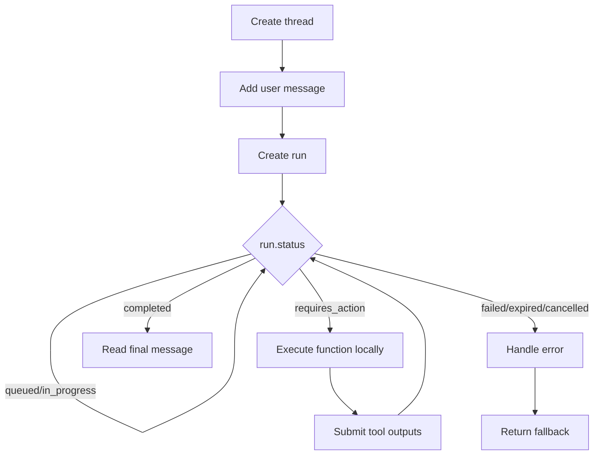

## Overview

I've built chatbots a few different ways, and the OpenAI Assistants API is the one I reach for when I don't want to write conversation memory, file retrieval, or the tool-execution loop myself. You define an assistant once, then create threads for each conversation and let the API handle message ordering, built-in tool calls, and function dispatch. It's not the cheapest option, but it saves me from building half a backend just to keep a chat log.

> **Deprecation notice:** OpenAI deprecated the Assistants API in August 2025. It will shut down on **26 August 2026**. OpenAI recommends the [Responses API](https://platform.openai.com/docs/api-reference/responses) or the [Agents SDK](https://platform.openai.com/docs/guides/agents-sdk) for new projects. Use this recipe to maintain existing integrations or to compare approaches; don't start new production chatbots on the Assistants API without a migration plan. Related recipes: [Generate Images Programmatically with AI Models](/recipes/image-generation/) and [Sentiment Analysis with Python and NLTK](/recipes/python-sentiment-analysis-nltk/). See also [LLM Fallback Pattern](/patterns/llm-fallback-pattern/).

## When to Use

I reach for the Assistants API when:

- I need a chatbot with persistent, multi-turn memory that survives across restarts. For a simpler, stateless alternative, I'd use [Prompt Engineering](/recipes/prompt-engineering/).
- I want built-in file search or code interpreter without wiring up a separate RAG pipeline. For a custom RAG setup, see [RAG Pipeline](/recipes/rag-pipeline/).
- I want the assistant to call functions in my backend to fetch data, book appointments, or trigger workflows. For more agent patterns, see [AI Agents Tool Use](/recipes/ai-agents-tool-use/).
- I'm already on the OpenAI ecosystem and can tolerate a managed, vendor-locked API with an explicit migration path.

I don't use it when:

- I need sub-second, low-latency responses. Assistants API runs are asynchronous and usually require polling or streaming.
- I want to avoid OpenAI lock-in. I'd look at [LangChain Agents](/recipes/ai-agents-tool-use/) or local model variants instead.
- I'm building a new project from mid-2025 onward. I'd prefer the [Responses API](https://platform.openai.com/docs/api-reference/responses).

## Solution

I'll build the same support bot in three languages below. The bot can search uploaded files and call a `get_order_status` function. I've used this exact pattern in a support tool for a small e-commerce client.

### Python

```python
import json
import time
from openai import OpenAI

client = OpenAI(api_key="YOUR_API_KEY")

assistant = client.beta.assistants.create(
    name="Support Bot",
    instructions="""You are a support agent. Answer questions from the user's knowledge base.
If you need order data, call get_order_status. Use only the data provided.""",
    model="gpt-4o-mini",
    tools=[
        {"type": "file_search"},
        {
            "type": "function",
            "function": {
                "name": "get_order_status",
                "description": "Get the status of a customer order",
                "parameters": {
                    "type": "object",
                    "properties": {
                        "order_id": {"type": "string"}
                    },
                    "required": ["order_id"]
                }
            }
        }
    ],
    tool_resources={
        "file_search": {"vector_store_ids": ["vs_..."]}
    }
)

thread = client.beta.threads.create()
client.beta.threads.messages.create(
    thread_id=thread.id,
    role="user",
    content="What is the status of order ORD-9981?"
)

run = client.beta.threads.runs.create(
    thread_id=thread.id,
    assistant_id=assistant.id
)

while run.status in ("queued", "in_progress", "requires_action"):
    time.sleep(1)
    run = client.beta.threads.runs.retrieve(
        thread_id=thread.id,
        run_id=run.id
    )

    if run.status == "requires_action":
        outputs = []
        for tool_call in run.required_action.submit_tool_outputs.tool_calls:
            if tool_call.function.name == "get_order_status":
                args = json.loads(tool_call.function.arguments)
                result = f"Order {args['order_id']} is shipped and arriving tomorrow."
                outputs.append({"tool_call_id": tool_call.id, "output": result})

        client.beta.threads.runs.submit_tool_outputs(
            thread_id=thread.id,
            run_id=run.id,
            tool_outputs=outputs
        )

messages = client.beta.threads.messages.list(
    thread_id=thread.id,
    order="desc",
    limit=1
)
print(messages.data[0].content[0].text.value)
```

### JavaScript

```javascript
import OpenAI from 'openai';

const client = new OpenAI({ apiKey: process.env.OPENAI_API_KEY });

async function runChatbot() {
  const assistant = await client.beta.assistants.create({
    name: 'Support Bot',
    instructions: 'You are a support agent. Answer from the knowledge base. If you need order data, call get_order_status.',
    model: 'gpt-4o-mini',
    tools: [
      { type: 'file_search' },
      {
        type: 'function',
        function: {
          name: 'get_order_status',
          description: 'Get the status of a customer order',
          parameters: {
            type: 'object',
            properties: { order_id: { type: 'string' } },
            required: ['order_id']
          }
        }
      }
    ],
    tool_resources: {
      file_search: { vector_store_ids: ['vs_...'] }
    }
  });

  const thread = await client.beta.threads.create();
  await client.beta.threads.messages.create(thread.id, {
    role: 'user',
    content: 'What is the status of order ORD-9981?'
  });

  let run = await client.beta.threads.runs.create(thread.id, {
    assistant_id: assistant.id
  });

  while (['queued', 'in_progress', 'requires_action'].includes(run.status)) {
    await new Promise(r => setTimeout(r, 1000));
    run = await client.beta.threads.runs.retrieve(run.id, { thread_id: thread.id });

    if (run.status === 'requires_action') {
      const outputs = run.required_action.submit_tool_outputs.tool_calls.map(tc => {
        if (tc.function.name === 'get_order_status') {
          const args = JSON.parse(tc.function.arguments);
          return {
            tool_call_id: tc.id,
            output: `Order ${args.order_id} is shipped and arriving tomorrow.`
          };
        }
        return { tool_call_id: tc.id, output: '{}' };
      });

      run = await client.beta.threads.runs.submitToolOutputs(run.id, {
        thread_id: thread.id,
        tool_outputs: outputs
      });
    }
  }

  const messages = await client.beta.threads.messages.list(thread.id, {
    limit: 1,
    order: 'desc'
  });
  console.log(messages.data[0].content[0].text.value);
}

runChatbot().catch(console.error);
```

### Java

```java
import com.openai.client.OpenAIClient;
import com.openai.client.okhttp.OpenAIOkHttpClient;
import com.openai.core.JsonValue;
import com.openai.models.FunctionDefinition;
import com.openai.models.FunctionParameters;
import com.openai.models.beta.assistants.AssistantCreateParams;
import com.openai.models.beta.assistants.FileSearchTool;
import com.openai.models.beta.assistants.FunctionTool;

public class SupportAssistant {
    public static void main(String[] args) {
        OpenAIClient client = OpenAIOkHttpClient.fromEnv();

        FunctionDefinition getOrderStatus = FunctionDefinition.builder()
            .name("get_order_status")
            .description("Get the status of a customer order")
            .parameters(FunctionParameters.builder()
                .putAllAdditionalProperties(Map.of(
                    "type", JsonValue.from("object"),
                    "properties", JsonValue.from(Map.of(
                        "order_id", Map.of("type", "string")
                    )),
                    "required", JsonValue.from(List.of("order_id"))
                ))
                .build())
            .build();

        AssistantCreateParams params = AssistantCreateParams.builder()
            .name("Support Bot")
            .instructions("You are a support agent. Answer from the knowledge base. " +
                          "If you need order data, call get_order_status.")
            .model("gpt-4o-mini")
            .addTool(FileSearchTool.builder().build())
            .addTool(FunctionTool.builder().function(getOrderStatus).build())
            .toolResources(AssistantCreateParams.ToolResources.builder()
                .fileSearch(AssistantCreateParams.ToolResources.FileSearch.builder()
                    .vectorStoreIds(List.of("vs_..."))
                    .build())
                .build())
            .build();

        client.beta().assistants().create(params);
        // Thread, message, run, and tool-output submission follow the same pattern
        // using ThreadCreateParams, MessageCreateParams, RunCreateParams, etc.
    }
}
```

## Explanation

The Assistants API hides three pieces of complexity I used to build by hand:

- **Assistant:** a persistent configuration of model, instructions, and tools. I create it once and reuse it for every conversation.
- **Thread:** a conversation container. OpenAI stores the message history, so I don't need a database for the chat log.
- **Run:** an execution pass. The model decides whether to reply directly, call a function, or invoke a built-in tool. My code executes the function and submits the result.

When `run.status` becomes `requires_action`, the run pauses until I submit the requested tool outputs. After I call `submit_tool_outputs` (Python) or `submitToolOutputs` (Node), the run resumes and the assistant produces a final message. The first time I hit this, I thought my code was broken. It wasn't — I just hadn't submitted the tool output yet.



### Trade-offs

- **Convenience vs. control:** Assistants manage state and tool calls for me, but I lose control over exact prompt construction and context-window usage.
- **Latency:** every run is asynchronous. I need polling or streaming, which adds round-trips compared to a single Chat Completions call.
- **Cost:** I pay for input/output tokens plus any tool usage. File search and code interpreter add overhead fast.
- **Lock-in and deprecation:** the API is OpenAI-specific and deprecated. For new projects, I'd evaluate the [Responses API](https://platform.openai.com/docs/api-reference/responses).

## Variants

| Technology | Approach | Notes |
|------------|----------|-------|
| OpenAI Assistants API | Stateful threads + built-in tools | Best for existing managed integrations; deprecated for new projects |
| OpenAI Chat Completions API | Stateless, manual history | Lower latency, more control, but you manage context and tools |
| OpenAI Responses API | Unified conversations and tool loop | OpenAI's recommended path for new agents |
| Azure OpenAI Assistants | Same API, enterprise compliance | Useful for private networking and regional data requirements |
| [LangChain Agents](/recipes/ai-agents-tool-use/) | Framework-level abstraction | Swap models, add custom tools, but more boilerplate |
| Functionary / Local LLMs | Self-hosted function calling | Privacy-first, no API costs, but needs GPU |

## What Works

1. I store thread IDs keyed by user in my own database so users can resume conversations.
2. I use `file_search` and `code_interpreter` through `tool_resources`, not the legacy top-level `file_ids`.
3. I validate and sanitize every function argument before executing it. Don't trust the model blindly.
4. I set strict `instructions` to constrain the assistant's tone, scope, and when to call functions.
5. I monitor token usage per run. File search and code interpreter add cost quickly — I learned this the expensive way.

## Common Mistakes

1. **Leaking thread IDs** — I treat them like session tokens and scope them to authenticated users.
2. **Ignoring `requires_action`** — runs hang forever if I don't submit tool outputs. Caught me once.
3. **Overusing file search** — attaching large vector stores increases latency and cost.
4. **Not handling run failures** — I check `run.status` for `failed`, `expired`, or `cancelled`.
5. **Assuming real-time responses** — runs are asynchronous. I need polling or streaming.

## Troubleshooting

- **The assistant doesn't call the function:** I tighten the function `description` and make sure the user's intent is clear in the `instructions`.
- **Run stays `in_progress` for too long:** I implement a timeout and a fallback message. Don't poll forever.
- **Model outputs are inconsistent:** I set `temperature` to 0 for deterministic tasks and pin a model version.
- **Prompt injection leaks context:** I keep user input separate from system `instructions` and validate tool arguments.
- **High token costs:** I cache search results, summarize long context, and use smaller models for simple tasks.
- **File search returns irrelevant chunks:** I tune chunk size, overlap, and metadata filters.

## Further Reading

- [OpenAI Assistants API docs](https://platform.openai.com/docs/api-reference/assistants) and [migration guide](https://platform.openai.com/docs/assistants/migration)
- [OpenAI Responses API reference](https://platform.openai.com/docs/api-reference/responses)
- [OpenAI Agents SDK guide](https://platform.openai.com/docs/guides/agents-sdk)
- [RAG Pipeline](/recipes/rag-pipeline/) for custom retrieval
- [AI Agents Tool Use](/recipes/ai-agents-tool-use/) for LangChain-style agents

## Production Notes

- **Pin a model version** such as `gpt-4o-2024-08-06` instead of model aliases. I've been bitten by silent behavior changes when OpenAI updates a model under the same alias.
- **Subscribe to OpenAI's changelog** to track Assistants API deprecation milestones and Responses API feature parity.
- **Deploy gradually** with canary or blue-green releases to catch regressions in tool calls.
- **Configure alerts** for error rate, p99 latency, and run failure rate before going live. I set these up before the first production deploy, not after.
- **Document the rollback** in your runbook and test it in staging at least once per quarter.
- **Review structured logs** with correlation IDs to trace a request from your backend through the OpenAI run. Saved me hours during a postmortem once.

## Key Takeaways

- The Assistants API removes the need to manage conversation state and built-in tool calls, but it's deprecated and has an explicit sunset date.
- Use `file_search`, `code_interpreter`, and `function` tools through the current v2 `tool_resources` structure.
- Validate every function argument, scope thread IDs to users, and always handle `requires_action`.
- For new chatbots in 2026, I'd evaluate the Responses API or the Agents SDK before committing to the Assistants API.

## FAQ

### What's the difference between Assistants and Chat Completions?

Assistants manage thread state, built-in tools such as `file_search` and `code_interpreter`, and the function-calling lifecycle. Chat Completions is stateless: I send the full message array every time, and I manage history, tool execution, and file handling myself.

### Can I use my own LLM with the Assistants API?

No. The Assistants API only works with OpenAI models. If I need a custom model, I use [LangChain agents](/recipes/ai-agents-tool-use/) or build a similar abstraction on top of Chat Completions with my own backend.

### What does it cost to run?

I pay for the model's input and output tokens, plus any tool usage. File search and code interpreter add cost per query or session. I always monitor usage in the OpenAI dashboard — it's easy to burn through tokens with file search if you're not paying attention.

### What's the best way to handle function call errors?

I catch the exception in my function and return a JSON object with `error` and `message` fields to the Assistants API through `submit_tool_outputs`. The assistant reads the error and can retry, ask the user for clarification, or try another approach. I sanitize the message to avoid leaking internal details, and I set a maximum retry count to prevent infinite loops.

### When should I stream responses from the Assistants API?

I pass `stream: true` when creating a run if I need incremental output. The API returns Server-Sent Events with `thread.run.step.delta` events containing incremental text. I parse the SSE stream and forward chunks to the client. I handle `thread.run.completed` to signal the end of the stream.

### What about rate limiting for my chatbot?

I track requests per user with a sliding window in Redis. I set limits based on my plan, return HTTP 429 with a `Retry-After` header when the limit is hit, and implement exponential backoff for OpenAI 429 responses. I queue traffic spikes for asynchronous processing when needed.

### Can I test an Assistants API integration without hitting the API?

Yes. I mock the OpenAI client with `vi.mock()` or `unittest.mock.patch`. I test function calling by returning predefined tool outputs and asserting the assistant receives them. For end-to-end tests, I use a separate assistant with a cheaper model such as `gpt-4o-mini`, and I record API responses with VCR.py or Polly.js to replay them in CI.

### What happens when a conversation exceeds the context window?

The Assistants API truncates older messages automatically. To preserve important context, I periodically summarize the conversation and store the summary. For knowledge-intensive chats, I store key facts in a vector store and retrieve them through `file_search` instead of relying on the full thread history.

### How do I keep tenants isolated with the Assistants API?

I create a separate assistant per tenant or include tenant context in the instructions. I scope thread IDs to tenants and validate that a user only accesses their own threads before processing. I never share file search vector stores across tenants — that's a data leak waiting to happen.

### What's my fallback when the OpenAI API is down?

I implement a circuit breaker that trips after a threshold of failures. When it's open, I return a cached response or a graceful "service temporarily unavailable" message. I queue user messages with BullMQ or Celery and process them when the API recovers. For critical paths, I configure a fallback model provider.

## Common Production Pitfalls

- Copying my example without adapting it to real data volumes and failure modes.
- Skipping load and error-injection tests before the first production deployment.
- Hard-coding values such as assistant ID or model version instead of using environment-specific config.
- Forgetting to add logging and monitoring around each step of the run lifecycle.
- Deploying without a rollback plan or a tested backup strategy.
- Assuming the minimal example will scale without adding retries, circuit breakers, or rate limiting.
- Not documenting which model version and tool configuration are used in production.
- Leaving the recipe unchanged when dependencies, scale, or deprecation timelines evolve.
