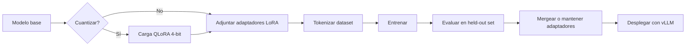

## Visión General

La mayoría de los equipos con los que hablo chocan contra la misma pared cuando usan LLMs para código. El [prompt
engineering](/recipes/prompt-engineering/) y [RAG](/recipes/semantic-search/) les alcanzan para la mayoría de los casos,
pero después el modelo sigue tropezando con librerías internas, convenciones de nombres o patrones de manejo de errores
que no están en internet. Ahí es donde yo recurría al fine-tuning.

El fine-tuning continúa el entrenamiento de un modelo pre-entrenado con un dataset más pequeño y curado, para que
aprenda los patrones específicos de tu empresa. Para código, eso suele significar las formas de tus APIs, DSLs internos
o la forma en que tu equipo nombra las cosas. LoRA y QLoRA hacen esto viable en una sola GPU actualizando solo una
fracción mínima de los pesos. Esta receta cubre el dataset, el loop de entrenamiento y algunos errores que cometí para
que vos no tengas que cometerlos.

## Cuándo Usar

Yo recurría al fine-tuning cuando:

- el [prompt engineering](/recipes/prompt-engineering/) funciona para los casos genéricos pero falla con nuestros
    patrones de API internos;
- [RAG](/recipes/semantic-search/) le da contexto al modelo, pero el código generado todavía parece venir de otro
    repositorio;
- tengo entre 500 y 10.000 ejemplos limpios y quiero dejar de escribir prompts a mano para cada caso borde;
- quiero servir un modelo más chico y específico de la tarea, más rápido y barato que el base.

Evito el full fine-tuning cuando:

- los ejemplos few-shot ya resuelven la tarea;
- tengo menos de 200 ejemplos, porque el modelo suele memorizarlos;
- la definición de la tarea cambia semanalmente, porque reentrenar se vuelve caro rápido.

## Solución

### Python

```python
from transformers import (
    AutoModelForCausalLM,
    AutoTokenizer,
    TrainingArguments,
    Trainer,
    DataCollatorForLanguageModeling
)
from peft import LoraConfig, get_peft_model, TaskType
from datasets import Dataset
import torch

# 1. Cargar modelo base y tokenizador
model_name = "codellama/CodeLlama-7b-hf"
model = AutoModelForCausalLM.from_pretrained(
    model_name,
    torch_dtype=torch.float16,
    device_map="auto"
)
tokenizer = AutoTokenizer.from_pretrained(model_name)
tokenizer.pad_token = tokenizer.eos_token

# 2. Preparar un dataset de ejemplo chico; reemplazá con tus ejemplos reales
raw_data = [
    {
        "text": (
            "### Task: Escribir una función Python que sume dos números\n"
            "### Response:\n"
            "def sumar(a, b):\n"
            "    return a + b\n\n"
            "print(sumar(3, 5))"
        )
    },
    {
        "text": (
            "### Task: Escribir una función Python que duplique un número\n"
            "### Response:\n"
            "def duplicar(x):\n"
            "    return x * 2\n\n"
            "print(duplicar(7))"
        )
    },
]
dataset = Dataset.from_list(raw_data)


def tokenize(sample):
    return tokenizer(
        sample["text"],
        truncation=True,
        max_length=512,
        padding="max_length"
    )


dataset = dataset.map(tokenize, batched=True)

# 3. Configurar LoRA
lora_config = LoraConfig(
    r=16,
    lora_alpha=32,
    target_modules=["q_proj", "v_proj"],
    lora_dropout=0.05,
    bias="none",
    task_type=TaskType.CAUSAL_LM
)
model = get_peft_model(model, lora_config)
model.print_trainable_parameters()

# 4. Entrenar
training_args = TrainingArguments(
    output_dir="./code-lora",
    num_train_epochs=3,
    per_device_train_batch_size=4,
    gradient_accumulation_steps=4,
    learning_rate=2e-4,
    logging_steps=10,
    save_strategy="epoch",
    fp16=True,
    optim="adamw_torch"
)

trainer = Trainer(
    model=model,
    args=training_args,
    train_dataset=dataset,
    data_collator=DataCollatorForLanguageModeling(tokenizer, mlm=False)
)
trainer.train()
model.save_pretrained("./code-lora-final")
```

Para correr esto, instalá las dependencias principales:

```bash
pip install transformers==4.48.0 peft==0.14.0 datasets==3.2.0
```

Para QLoRA, agregá `bitsandbytes==0.45.0` y `accelerate==1.3.0`.

### JavaScript

```javascript
// El fine-tuning de LLMs en JavaScript es poco común.
// Usá Transformers.js para inferencia de modelos fine-tuneados:
const { pipeline } = require('@xenova/transformers');

async function generateCode(prompt) {
  const generator = await pipeline(
    'text-generation',
    'Xenova/codegen-350M-mono'
  );
  const output = await generator(prompt, {
    max_new_tokens: 128,
    temperature: 0.2,
    do_sample: true,
  });
  return output[0].generated_text;
}

generateCode("function fibonacci(n) {").then(console.log);
```

### Java

```java
import ai.djl.huggingface.tokenizers.HuggingFaceTokenizer;
import ai.djl.repository.zoo.Criteria;
import ai.djl.inference.Predictor;

public class CodeGenerator {
    public static void main(String[] args) throws Exception {
        Criteria<String, String> criteria = Criteria.builder()
            .setTypes(String.class, String.class)
            .optModelUrls("file:///path/to/fine-tuned-model")
            .optEngine("PyTorch")
            .build();

        try (Predictor<String, String> predictor = criteria.newPredictor()) {
            String prompt = "public class HelloWorld {";
            String generated = predictor.predict(prompt);
            System.out.println(generated);
        }
    }
}
```

## Explicación

El fine-tuning actualiza los pesos de un modelo pre-entrenado para que mejore en una tarea estrecha. El full fine-
tuning, donde actualizás todos los miles de millones de parámetros, necesita un cluster de GPUs de gama alta. **LoRA**
(Low-Rank Adaptation) evita esto inyectando matrices pequeñas y entrenables de descomposición de rango en las capas de
atención, mientras congela el modelo base. Puede reducir los parámetros entrenables en un 99% o más manteniendo la mayor
parte de la calidad del full fine-tuning.

**QLoRA** va más allá cargando el modelo base en precisión cuantizada de 4 bits. Eso reduce el uso de VRAM
aproximadamente 3-4x comparado con 16 bits, así que podés hacer fine-tuning de un modelo de 7B parámetros en una sola
GPU de 24GB. La contra es la velocidad: los pesos de 4 bits necesitan dequantización en cada forward pass. Yo usaba
QLoRA para experimentos rápidos en una RTX 3090 y pasaba a LoRA de 16 bits en una A100 alquilada cuando necesitaba una
corrida de producción.

El loop de entrenamiento es simple sobre el papel:

1. Tokenizá los ejemplos de código en input IDs y attention masks.
2. Hacé un forward pass a través del modelo base congelado más los adaptadores LoRA.
3. Calculá la pérdida en la predicción del siguiente token.
4. Retropropagá solo a través de los parámetros LoRA.
5. Repetí por 1 a 5 epochs sobre unos pocos cientos a miles de ejemplos.

La parte que me llevó más tiempo dominar es el formato de los datos. Al modelo no le importan tus comentarios a menos
que estén dentro de un template consistente. Yo uso `### Task: ...\n### Response: ...` para cada ejemplo.

Este es el modelo mental que uso cuando armo esto:



Para QLoRA, reemplazá la carga del modelo con `BitsAndBytesConfig`:

```python
from transformers import BitsAndBytesConfig

bnb_config = BitsAndBytesConfig(
    load_in_4bit=True,
    bnb_4bit_compute_dtype=torch.float16
)
model = AutoModelForCausalLM.from_pretrained(
    model_name,
    quantization_config=bnb_config,
    device_map="auto"
)
```

### Elegir los hiperparámetros de LoRA

Dos números importan más que el resto: el rank (`r`) y `lora_alpha`. Yo empiezo con `r=16` y `alpha=32`, que es la
relación 2:1 habitual. Ranks más bajos entrenan más rápido y usan menos memoria, pero pueden underfitear en contextos
largos y estructurados. Ranks más altos ayudan ahí, aunque raramente subo de `r=64` porque las ganancias se estancan y
el checkpoint se hace más pesado.

| Situación | r | lora_alpha | Notas |
| --- | --- | --- | --- |
| Experimento rápido en dataset chico | 8 | 16 | Rápido, poca memoria, subajusta fácil |
| Punto de partida por defecto | 16 | 32 | Buen balance para la mayoría de las tareas de código |
| Prompts largos y estructurados | 32-64 | 64-128 | Más capacidad, más memoria y tiempo |
| Producción 7B en A100 | 16-32 | 32-64 | Estable y fácil de reproducir |

### Evaluar el modelo

Nunca me fío solo de la pérdida de entrenamiento. Reservo entre el 10% y el 20% de los datos y comparo el modelo fine-
tuneado contra el base con exact-match accuracy para completación de código, pass@k, o BLEU/ROUGE para lenguaje natural.
Después hago una revisión manual de 20 a 50 muestras. Las métricas automáticas pueden pasar por alto errores sutiles,
así que el chequeo manual es donde agarro al modelo cambiando un nombre de método o ignorando un caso borde.

### Costos y escala

| Enfoque | Setup | Costo (aprox.) | Notas |
| --- | --- | --- | --- |
| LoRA 7B en A100 | 1x A100 80GB | $10-$25/run | 2-6 horas para 10K ejemplos |
| QLoRA 7B en RTX 3090 | 1x GPU 24GB | $5-$15/run | Más lento, pero entra en GPUs de consumo |
| OpenAI fine-tuning | Solo API | Pago por token | Sin infraestructura, pero menos control |
| Inferencia (vLLM) | Self-hosted | ~$0.001/1K tokens | Más barato que API para alto volumen |

## Variantes

| Tecnología | Enfoque | Notas |
| --- | --- | --- |
| Full fine-tuning | Actualizar todos los parámetros | Mejor calidad, pero necesita 8+ A100s para modelos 7B |
| LoRA | Adaptadores de bajo rango | Elección por defecto; ~0.5% entrenables, calidad cercana al completo |
| QLoRA | LoRA cuantizada a 4 bits | Cabe 7B en 1x RTX 3090; entrenamiento ligeramente más lento |
| Prefix tuning | Entrenar embeddings de prompt | Método anterior; LoRA generalmente preferido |
| Adapter layers | Pequeñas capas bottleneck | Idea similar a LoRA; menos adoptado |
| [OpenAI fine-tuning](/recipes/chatbot-openai/) | Basado en API | Subir JSONL, sin infraestructura; pago por token |

Yo uso LoRA para casi todo y considero full fine-tuning solo cuando el presupuesto de cómputo es trivial y la barra de
calidad es extremadamente alta.

## Mejores Prácticas

- Yo solo hago fine-tuning cuando los ejemplos son de alta calidad. Quinientos ejemplos buenos suelen superar diez mil
    mediocres.
- Formateo cada ejemplo con el mismo template de prompt. Para código uso `### Task: ...\n### Response: ...`.
- Empiezo con LoRA rank 8 a 16 y escalo solo si la pérdida de validación deja de bajar.
- Mantengo el learning rate entre `1e-4` y `2e-4` con decaimiento coseno. Tasas más altas han colapsado modelos en mis
    corridas.
- Reservo entre el 10% y el 20% de los datos para validación. Sin eso no puedo saber cuándo empieza el overfitting.
- Mergeo los pesos de LoRA antes de la inferencia en producción con `model.merge_and_unload()` para reducir la
    latencia por token.
- Logueo a Weights & Biases o TensorBoard desde el inicio. Las curvas son la forma más rápida de detectar una corrida
    mala.

## Errores Comunes

- **Overfitting:** entrenar demasiado en datasets pequeños causa memorización literal. Yo uso early stopping.
- **Fuga de datos:** incluso variaciones menores de ejemplos de prueba en entrenamiento inflan las métricas. Yo
    deduplico rigurosamente.
- **Modelo base incorrecto:** no hagas fine-tuning de un modelo chat para código. Yo uso CodeLlama, StarCoder o
    DeepSeek-Coder.
- **Mismatch del tokenizador:** verifico tokens desconocidos antes de entrenar, especialmente con símbolos custom de
    DSLs internos.
- **Sin línea base de evaluación:** siempre comparo el modelo base con zero-shot prompting primero.
- **No shufflear los datos:** datasets ordenados hacen que el modelo aprenda el orden en lugar del contenido.
- **Demasiados epochs:** tres epochs suele ser suficiente para LoRA; más lleva a memorización.
- **Ignorar la contaminación:** mantengo un split estricto y rechazo ejemplos que sean paráfrasis de casos de test.

## Preguntas Frecuentes

### ¿Cuántos datos necesito?

Para generación de código, 500 a 2.000 ejemplos de alta calidad suelen bastar con LoRA. Más datos ayudan para dominios
más amplios, pero la calidad y el formato importan más que el volumen.

### ¿Puedo hacer fine-tuning sin GPU?

QLoRA en Google Colab con una T4 gratis funciona para modelos 7B con batch sizes muy pequeños. Para entrenamiento en
producción, alquilá una A100 o usá servicios como Lambda Labs, RunPod o Together AI.

### ¿Debería usar la API de fine-tuning de OpenAI?

Si necesitás calidad de modelo propietario y tenés presupuesto, sí. Consultá [Chatbot con OpenAI](/recipes/chatbot-
openai/) para enfoques basados en API. Para control de costos, privacidad o despliegue on-premise, usá modelos open
source con LoRA/QLoRA en tu propio hardware.

### ¿Cómo formateo mis datos de entrenamiento?

Usá un template de prompt consistente. Para generación de código, el formato `### Task: ...\n### Response: ...` funciona
bien. Cada ejemplo debería ser un solo string con la tarea y respuesta concatenadas. Mantené los ejemplos bajo 512
tokens, o aumentá `max_length` para ejemplos más largos y reducí el batch size.

### ¿Cómo sé si mi modelo fine-tuned es mejor?

Compará contra el modelo base en un conjunto de prueba separado. Medí exact-match accuracy para completación de código,
BLEU/ROUGE para lenguaje natural y pass@k para generación de código. También ejecutá evaluación humana en 20 a 50
muestras; las métricas automatizadas pueden perder diferencias sutiles de calidad.

### ¿Puedo hacer fine-tuning para múltiples lenguajes?

Sí, pero incluí tags de lenguaje en tus datos de entrenamiento, por ejemplo `### Language: Python\n### Task: ...`.
Mezclá ejemplos de diferentes lenguajes en el mismo dataset y usá un modelo base multilingüe como CodeLlama o DeepSeek-
Coder.

### ¿Cómo despliego un modelo fine-tuned?

Tres opciones:

1. Mergeá los pesos de LoRA en el modelo base y serví con vLLM o TGI.
2. Serví con adaptadores LoRA separadamente usando PEFT inference.
3. Subí a la API de fine-tuning de OpenAI para inference hospedado.

Para producción, yo uso vLLM con pesos mergeados para mejor throughput.

### ¿Cuál es la diferencia entre LoRA rank y alpha?

El rank (`r`) controla el tamaño de las matrices de update. Mayor rank significa más capacidad pero más parámetros a
entrenar. Alpha (`lora_alpha`) escala el update de LoRA; típicamente se setea a 2x el rank. Yo empiezo con `r=16,
alpha=32` y solo aumento el rank si el modelo subajusta después de 3 epochs.

## Ver También

Para las referencias oficiales, leé el [paper de LoRA](https://arxiv.org/abs/2106.09685), el [paper de
QLoRA](https://arxiv.org/abs/2305.14314), la [documentación de Hugging Face PEFT](https://huggingface.co/docs/peft), la
[documentación de fine-tuning de OpenAI](https://platform.openai.com/docs/guides/fine-tuning) y la [guía de experimentos
de Weights & Biases](https://docs.wandb.ai).
