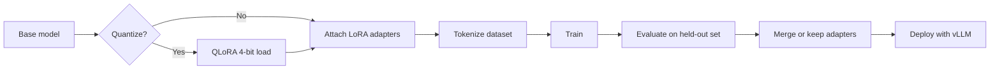

## Overview

Most teams I talk to hit the same wall with LLMs for code. Prompt engineering and [RAG](/recipes/semantic-search/) get
them most of the way, then the model keeps tripping on internal libraries, naming conventions, or error-handling
patterns that aren't on the public internet. That's the point where I reach for fine-tuning.

Fine-tuning continues training a pre-trained model on a smaller, curated dataset so it learns your company-specific
patterns. For code, that usually means your API shapes, internal DSLs, or the way your team names things. LoRA and QLoRA
make this practical on a single GPU by updating only a tiny fraction of the weights. This recipe covers the dataset, the
training loop, and a few mistakes I made so you don't have to.

## When to Use

I reach for fine-tuning when:

- the [prompt engineering](/recipes/prompt-engineering/) playbook works for generic cases but misses our internal API
    patterns;
- [RAG](/recipes/semantic-search/) gives the model context, but the generated code still looks like it came from a
    different codebase;
- I have 500 to 10,000 clean examples and want to stop hand-crafting prompts for every edge case;
- I want to serve a smaller, task-specific model that's faster and cheaper than the base.

I skip full fine-tuning when:

- few-shot examples already solve the task;
- I have fewer than 200 examples, because the model usually just memorizes them;
- the task definition changes weekly, because retraining gets expensive fast.

## Solution

### Python

```python
from transformers import (
    AutoModelForCausalLM,
    AutoTokenizer,
    TrainingArguments,
    Trainer,
    DataCollatorForLanguageModeling
)
from peft import LoraConfig, get_peft_model, TaskType
from datasets import Dataset
import torch

# 1. Load base model and tokenizer
model_name = "codellama/CodeLlama-7b-hf"
model = AutoModelForCausalLM.from_pretrained(
    model_name,
    torch_dtype=torch.float16,
    device_map="auto"
)
tokenizer = AutoTokenizer.from_pretrained(model_name)
tokenizer.pad_token = tokenizer.eos_token

# 2. Prepare a tiny example dataset; replace with your real examples
raw_data = [
    {
        "text": (
            "### Task: Write a Python function that adds two numbers\n"
            "### Response:\n"
            "def add(a, b):\n"
            "    return a + b\n\n"
            "print(add(3, 5))"
        )
    },
    {
        "text": (
            "### Task: Write a Python function that doubles a number\n"
            "### Response:\n"
            "def double(x):\n"
            "    return x * 2\n\n"
            "print(double(7))"
        )
    },
]
dataset = Dataset.from_list(raw_data)


def tokenize(sample):
    return tokenizer(
        sample["text"],
        truncation=True,
        max_length=512,
        padding="max_length"
    )


dataset = dataset.map(tokenize, batched=True)

# 3. Configure LoRA
lora_config = LoraConfig(
    r=16,
    lora_alpha=32,
    target_modules=["q_proj", "v_proj"],
    lora_dropout=0.05,
    bias="none",
    task_type=TaskType.CAUSAL_LM
)
model = get_peft_model(model, lora_config)
model.print_trainable_parameters()

# 4. Train
training_args = TrainingArguments(
    output_dir="./code-lora",
    num_train_epochs=3,
    per_device_train_batch_size=4,
    gradient_accumulation_steps=4,
    learning_rate=2e-4,
    logging_steps=10,
    save_strategy="epoch",
    fp16=True,
    optim="adamw_torch"
)

trainer = Trainer(
    model=model,
    args=training_args,
    train_dataset=dataset,
    data_collator=DataCollatorForLanguageModeling(tokenizer, mlm=False)
)
trainer.train()
model.save_pretrained("./code-lora-final")
```

To run this, install the core dependencies:

```bash
pip install transformers==4.48.0 peft==0.14.0 datasets==3.2.0
```

For QLoRA, add `bitsandbytes==0.45.0` and `accelerate==1.3.0`.

### JavaScript

```javascript
// JavaScript fine-tuning is uncommon for LLMs.
// Use Transformers.js for inference of fine-tuned models:
const { pipeline } = require('@xenova/transformers');

async function generateCode(prompt) {
  const generator = await pipeline(
    'text-generation',
    'Xenova/codegen-350M-mono'
  );
  const output = await generator(prompt, {
    max_new_tokens: 128,
    temperature: 0.2,
    do_sample: true,
  });
  return output[0].generated_text;
}

generateCode("function fibonacci(n) {").then(console.log);
```

### Java

```java
import ai.djl.huggingface.tokenizers.HuggingFaceTokenizer;
import ai.djl.repository.zoo.Criteria;
import ai.djl.inference.Predictor;

public class CodeGenerator {
    public static void main(String[] args) throws Exception {
        Criteria<String, String> criteria = Criteria.builder()
            .setTypes(String.class, String.class)
            .optModelUrls("file:///path/to/fine-tuned-model")
            .optEngine("PyTorch")
            .build();

        try (Predictor<String, String> predictor = criteria.newPredictor()) {
            String prompt = "public class HelloWorld {";
            String generated = predictor.predict(prompt);
            System.out.println(generated);
        }
    }
}
```

## Explanation

Fine-tuning keeps training a pre-trained model on your own examples. I do it when the generic model gets the shape right
but misses the patterns that are specific to our codebase. Full fine-tuning, where you update every parameter, is the
old way and needs a cluster of high-end GPUs. **LoRA** (Low-Rank Adaptation) gets around that by injecting small,
trainable matrices into attention layers while the rest of the model stays frozen. In my runs it often cuts trainable
parameters by 99% or more while keeping most of the quality.

**QLoRA** loads the base model in 4-bit precision. That usually cuts VRAM by 3-4x compared with 16-bit, so a 7B model
fits on a single 24GB GPU. The catch is training speed: 4-bit weights need dequantization on every forward pass. I run
QLoRA on my RTX 3090 for experiments and only switch to 16-bit LoRA on a rented A100 when I need a production run.

The training loop is simple on paper:

1. Tokenize the code examples into input IDs and attention masks.
2. Run a forward pass through the frozen base model plus the LoRA adapters.
3. Compute the loss on next-token prediction.
4. Backpropagate only through the LoRA parameters.
5. Repeat for 1 to 5 epochs over a few hundred to a few thousand examples.

The part that slowed me down the most was formatting the data consistently. The model doesn't even look at your comments
unless they're inside the same template as the rest of the example. For every item I use this pattern:

```text
### Task: {instruction}
### Response:
{your code here}
```

Here is the mental model I use when I wire this up:



For QLoRA, replace the model load with `BitsAndBytesConfig`:

```python
from transformers import BitsAndBytesConfig

bnb_config = BitsAndBytesConfig(
    load_in_4bit=True,
    bnb_4bit_compute_dtype=torch.float16
)
model = AutoModelForCausalLM.from_pretrained(
    model_name,
    quantization_config=bnb_config,
    device_map="auto"
)
```

### Picking LoRA hyperparameters

Two numbers matter most: rank (`r`) and `lora_alpha`. I picture `r` as the number of extra channels the model gets to
tweak. Higher `r` gives it more room to learn, but it also adds parameters and memory. I usually start with `r=16` and
`alpha=32` (the 2:1 ratio that most people use) and only push `r` past 64 when the validation loss is still flat after a
few runs.

| Situation | r | lora_alpha | Notes |
| --- | --- | --- | --- |
| Quick experiment on small dataset | 8 | 16 | Fast, low memory, underfits easily |
| Default starting point | 16 | 32 | Good balance for most code tasks |
| Long structured prompts | 32-64 | 64-128 | Better capacity, more memory and time |
| Production 7B on A100 | 16-32 | 32-64 | Stable and easy to reproduce |

### Evaluating the model

I never trust training loss alone. I hold out 10% to 20% of the data and compare the fine-tuned model against the base
with exact-match accuracy for code completion, pass@k, or BLEU/ROUGE for natural language. Then I do a manual review of
20 to 50 samples. Automated metrics can miss subtle bugs, so the manual check is where I catch the model swapping a
method name or ignoring an edge case.

### Costs and scale

| Approach | Setup | Cost (rough) | Notes |
| --- | --- | --- | --- |
| LoRA 7B on A100 | 1x A100 80GB | $10-$25/run | 2-6 hours for 10K examples |
| QLoRA 7B on RTX 3090 | 1x 24GB GPU | $5-$15/run | Slower, but fits consumer GPUs |
| OpenAI fine-tuning | API only | Pay per token | No infrastructure, but less control |
| Inference (vLLM) | Self-hosted | ~$0.001/1K tokens | Cheaper than API for high volume |

## Variants

| Technology | Approach | Notes |
| --- | --- | --- |
| Full fine-tuning | Update all parameters | Best quality, but needs 8+ A100s for 7B models |
| LoRA | Low-rank adapters | Default choice; ~0.5% trainable, near-full quality |
| QLoRA | 4-bit quantized LoRA | Fits 7B on 1x RTX 3090; slightly slower training |
| Prefix tuning | Train prompt embeddings | Older method; LoRA generally preferred |
| Adapter layers | Small bottleneck layers | Similar idea to LoRA; less widely adopted |
| [OpenAI fine-tuning](/recipes/chatbot-openai/) | API-based | Upload JSONL, no infrastructure; pay per token |

I use LoRA for almost everything and only consider full fine-tuning when the compute budget is trivial and the quality
bar is extremely high.

## Best Practices

- I only fine-tune when the examples are high quality. Five hundred great examples usually beat ten thousand mediocre
    ones.
- I format every example with the same prompt template. For code I use the pattern shown in the Explanation section: a
    task header followed by a response block.
- I start with LoRA rank 8 to 16 and scale up only if the validation loss stops dropping.
- I keep the learning rate between `1e-4` and `2e-4` with cosine decay. Higher rates have collapsed models in my runs.
- I hold out 10% to 20% of the data for validation. Without it, I can't tell when the model starts overfitting.
- I merge LoRA weights before production inference with `model.merge_and_unload()` to cut per-token latency.
- I log to Weights & Biases or TensorBoard from the start. I watch those curves because a sudden flatline or spike is
    usually the first sign something went wrong.

## Common Mistakes

- **Overfitting:** training too long on small datasets causes verbatim memorization. I use early stopping.
- **Data leakage:** even small variations of test examples in training inflate scores. I deduplicate rigorously.
- **Wrong base model:** don't fine-tune a chat model for code. I use CodeLlama, StarCoder, or DeepSeek-Coder.
- **Tokenizer mismatch:** I tokenize a few examples before training and look for `<unk>` tokens, especially around
    custom symbols from internal DSLs.
- **No evaluation baseline:** I always run the base model with a few zero-shot prompts before training, so I have a
    number to beat.
- **Not shuffling data:** sorted datasets let the model learn the order instead of the content.
- **Too many epochs:** three epochs is usually enough for LoRA; more leads to memorization.
- **Ignoring contamination:** I keep a strict split and reject examples that are paraphrases of test cases.

## FAQ

### How much data do I need?

For code generation, 500 to 2,000 high-quality examples often suffice with LoRA. More data helps for broader domains,
but quality and formatting matter more than volume.

### Can I fine-tune without a GPU?

QLoRA on Google Colab with a free T4 works for 7B models with very small batch sizes. For production training, rent an
A100 or use services like Lambda Labs, RunPod, or Together AI.

### Should I use OpenAI's fine-tuning API instead?

If you can pay for it and the model quality matters more than controlling the weights, yes. See [Chatbot with
OpenAI](/recipes/chatbot-openai/) for API-based approaches. For cost control, privacy, or on-premise deployment, I
prefer open-source models with LoRA/QLoRA on my own hardware.

### How do I format my training data?

Pick one prompt template and use it for every example. For code generation I put the task in a header and the code in a
response block, like this:

```text
### Task: {instruction}
### Response:
{your code here}
```

I turn each example into one string with the task and response glued together. Keep examples under 512 tokens, or
increase `max_length` for longer examples and reduce batch size.

### How do I know if my fine-tuned model is better?

Compare it against the base model on a held-out test set. Measure exact-match accuracy for code completion, BLEU/ROUGE
for natural language, and pass@k for code generation. I also read through 20 to 50 samples manually and check for wrong
method names or missed edge cases.

### Can I fine-tune for multiple languages?

Yes, but tag the language in your training data. I add a header like this before each example:

```text
### Language: Python
### Task: {instruction}
### Response:
{your code here}
```

Mix examples from different languages in the same dataset and use a multilingual base model like CodeLlama or DeepSeek-
Coder.

### How do I deploy a fine-tuned model?

Three options:

1. Merge the LoRA weights into the base model and serve it with vLLM or TGI.
2. Keep the adapters loaded on top of the base model and use the PEFT library for inference.
3. Upload to OpenAI's fine-tuning API for hosted inference.

For production I merge the adapters into the base model and serve it with vLLM. That gives the best throughput I have
measured.

### What is the difference between LoRA rank and alpha?

The `r` value sets how big the adapter matrices are. I picture it as the number of extra channels the model gets to
tweak. Higher `r` gives it more room to learn, but it also adds parameters and memory. `lora_alpha` scales how strongly
those adapters influence the final output; I usually set it to twice `r`. I start with `r=16, alpha=32` and only
increase `r` if the validation loss is still flat after 3 epochs.

## See Also

For the official references, read the [LoRA paper](https://arxiv.org/abs/2106.09685), the [QLoRA
paper](https://arxiv.org/abs/2305.14314), the [Hugging Face PEFT documentation](https://huggingface.co/docs/peft), the
[OpenAI fine-tuning documentation](https://platform.openai.com/docs/guides/fine-tuning), and the [Weights & Biases
experiment tracking guide](https://docs.wandb.ai).
