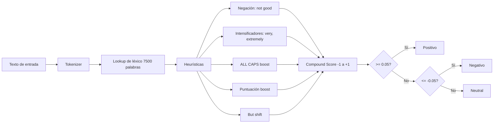

## Visión General

El análisis de sentimiento es, en esencia, decidir si un texto es positivo,
negativo o neutral. VADER de NLTK (Valence Aware Dictionary and sEntiment
Reasoner) es un modelo basado en reglas pensado para texto de redes sociales.
Maneja negación, intensificadores y emoticones sin necesidad de datos de
entrenamiento. Esta receta muestra cómo puntuar textos individuales, procesar un
CSV en lote, ajustar el léxico a tu dominio y trackear el sentimiento en el
tiempo.

## Cuándo Usar

Usa esta receta cuando necesites una puntación rápida de sentimiento para reviews
de clientes, posts de redes sociales, tickets de soporte u cualquier texto corto
en inglés. Es la opción adecuada cuando no tienes datos etiquetados y necesitas
una librería que funcione de inmediato.

- Clasifica reviews de clientes antes de enrutarlas a una cola de soporte.
- Trackea cómo cambia el sentimiento de marca en el tiempo con un dashboard. Consulta
  [Prompt Engineering](/recipes/prompt-engineering/) si después migras a un
  pipeline con modelos de lenguaje.
- Filtra tickets de soporte por urgencia o tono.

## Solución

### Instalar y configurar VADER

```bash
pip install nltk
```

```python
import nltk
nltk.download("vader_lexicon")

from nltk.sentiment.vader import SentimentIntensityAnalyzer

sia = SentimentIntensityAnalyzer()
```

### Puntuar un texto individual

```python
score = sia.polarity_scores("I love this product, it works great!")
print(score)
# {'neg': 0.0, 'neu': 0.536, 'pos': 0.464, 'compound': 0.6249}

score = sia.polarity_scores("Terrible experience, would not recommend.")
print(score)
# {'neg': 0.577, 'neu': 0.423, 'pos': 0.0, 'compound': -0.4767}
```

El score `compound` va de -1 (más negativo) a +1 (más positivo). Esa es la
métrica general que conviene usar para una sola etiqueta de sentimiento.

### Clasificar sentimiento

```python
def classify_sentiment(text):
    score = sia.polarity_scores(text)["compound"]
    if score >= 0.05:
        return "positive"
    elif score <= -0.05:
        return "negative"
    else:
        return "neutral"

texts = [
    "Great service and fast delivery!",
    "The package arrived broken.",
    "It was okay, nothing special.",
]

for text in texts:
    print(f"{classify_sentiment(text):10s} | {text}")
```

### Procesamiento en lote desde CSV

```python
import csv
from nltk.sentiment.vader import SentimentIntensityAnalyzer

sia = SentimentIntensityAnalyzer()

with open("reviews.csv", newline="") as infile, open("scored.csv", "w", newline="") as outfile:
    reader = csv.DictReader(infile)
    writer = csv.DictWriter(outfile, fieldnames=reader.fieldnames + ["sentiment", "compound"])
    writer.writeheader()

    for row in reader:
        score = sia.polarity_scores(row["review"])
        row["compound"] = score["compound"]
        row["sentiment"] = "positive" if score["compound"] >= 0.05 else "negative" if score["compound"] <= -0.05 else "neutral"
        writer.writerow(row)
```

### Manejar negación e intensificadores

```python
sia = SentimentIntensityAnalyzer()

print(sia.polarity_scores("The food was good"))
# compound: 0.4404

print(sia.polarity_scores("The food was not good"))
# compound: -0.4404

print(sia.polarity_scores("The food was very good"))
# compound: 0.4927

print(sia.polarity_scores("The food was EXTREMELY good"))
# compound: 0.5671
```

### Personalizar el léxico

```python
sia = SentimentIntensityAnalyzer()

# Agregar palabras específicas del dominio
new_words = {
    "buggy": -2.0,
    "crash": -3.0,
    "responsive": 2.0,
    "intuitive": 2.0,
}
sia.lexicon.update(new_words)

print(sia.polarity_scores("The app is buggy and crashes often"))
# Ahora puntúa más negativo con palabras custom
```

### Analizar sentimiento en el tiempo

```python
from nltk.sentiment.vader import SentimentIntensityAnalyzer
from datetime import datetime
import statistics

sia = SentimentIntensityAnalyzer()

posts = [
    {"date": "2026-01-01", "text": "Love the new update!"},
    {"date": "2026-01-02", "text": "Found a bug in the login flow."},
    {"date": "2026-01-03", "text": "Bug is fixed, great support!"},
]

daily_scores = {}
for post in posts:
    date = post["date"]
    score = sia.polarity_scores(post["text"])["compound"]
    daily_scores.setdefault(date, []).append(score)

for date, scores in sorted(daily_scores.items()):
    avg = statistics.mean(scores)
    print(f"{date}: avg={avg:.3f} ({len(scores)} posts)")
```

## Explicación

VADER usa un léxico de 7.500 palabras calificadas por anotadores humanos. Ese
léxico asigna a cada palabra un score de valencia de -4 (extremadamente negativo)
a +4 (extremadamente positivo). VADER luego combina esos scores con cinco
heurísticas que imitan cómo lee la gente el texto informal. Una exclamación al
final de una oración hace que VADER la lea como más intensa. El texto en
mayúsculas se percibe como más fuerte, así que el score se aleja más del neutral.
Palabras como "very" amplifican la valencia, mientras que "somewhat" la suaviza.

Una palabra como "not" invierte la polaridad, por eso "not good" puntúa negativo.
Y "but" desplaza el foco a la cláusula que viene después.

El diagrama de abajo muestra cómo VADER convierte texto crudo en una
clasificación de sentimiento. Me ha servido para explicarle a compañeros que
esperan una red neuronal y se sorprenden al ver que son solo reglas y lookups
de léxico.



El score `compound` es una suma normalizada y ponderada de todos los scores del
léxico en el texto. Como balancea el texto completo, suele ser la métrica
individual más útil para clasificar. Lo aprendí por las malas después de armar
un dashboard que trackeaba ratios `pos`/`neg` y producía tendencias confusas;
cuando cambié a `compound`, los datos se volvieron accionables de inmediato.

## Variantes

| Enfoque | Datos de Entrenamiento | Precisión | Usar Cuando |
| --- | --- | --- | --- |
| VADER | Ninguno (reglas) | Bueno para redes sociales | Setup rápido, sin datos de entrenamiento |
| TextBlob | Léxico integrado | Similar a VADER | API simple, basado en corpus |
| Transformer (HuggingFace) | Pre-entrenado | Alta | Sentimiento en producción a escala |
| Clasificador custom | Dataset etiquetado | Varía | Necesidades específicas de dominio |

Para una comparación más profunda de enfoques basados en transformers, consulta
[LLM Fine-Tuning](/recipes/llm-fine-tuning/).

## Cuándo No Usar

- **Detección de sarcasmo e ironía**: VADER puntúa significados literales, así
  que "oh great, another bug" puntúa positivo. Intenté usar VADER para un
  detector de sarcasmo en datos de Twitter y fue peor que inútil; clasificaba
  tweets sarcásticos como positivos de forma activa.
- **Texto multilingüe**: VADER es solo inglés. Si tu texto es español,
  portugués o mixto, usa [pysentimiento](https://github.com/pysentimiento/pysentimiento)
  o un transformer multilingüe como XLM-RoBERTa.
- **Documentos largos**: VADER promedia el sentimiento en todo el texto,
  perdiendo contexto local. Para cualquier cosa más larga que unos párrafos,
  puntúa párrafo por párrafo y agrega. Una vez corrí VADER sobre reviews
  completas de películas y los scores no tenían sentido; el scoring por
  párrafo lo arregló.
- **Jerga específica de dominio**: El léxico de VADER viene de redes sociales.
  Si tu dominio tiene vocabulario especializado (médico, legal, financiero),
  necesitas customizar el léxico pesadamente o entrenar un clasificador custom.
- **Análisis de sentimiento basado en aspectos**: VADER puntúa el texto
  completo, no aspectos individuales. Si necesitas "la comida fue buena pero
  el servicio lento", usa [PyABSA](https://github.com/yangheng95/PyABSA) o
  divide el texto por menciones de aspecto manualmente.

## Mejores Prácticas

- Para clasificar, usa el score `compound` porque contabiliza el texto completo,
  no palabras individuales. Cometí este error al principio y mis dashboards
  eran ruidosos hasta que cambié.
- La mayoría de proyectos empieza con +0.05 para positivo y -0.05 para negativo, y
  luego ajusta esos thresholds a la distribución real de sus datos. Sueleo
  samplear 200-300 textos, puntuarlos y elegir thresholds en los percentiles 10
  y 90.
- Actualiza el léxico con palabras de tu dominio, porque el léxico default de
  VADER viene de redes sociales. Una vez añadí "crash", "buggy" y "responsive"
  para un pipeline de app reviews y la accuracy subió notoriamente.
- VADER funciona mejor en textos cortos como oraciones o párrafos breves, así que
  para documentos largos debes puntúar párrafo por párrafo.
- No uses VADER para detectar sarcasmo, porque puntúa significados literales y no
  la intención implícita.
- Loguea el output completo de VADER (`pos`, `neg`, `neu`, `compound`) con el
  texto original para poder recalibrar thresholds más adelante. Siempre logueo
  a CSV para análisis fácil.

## Errores Comunes

- Usar ratios `pos` / `neg` en vez de `compound`. Como está normalizado, el
  compound es más confiable. Lo veo en casi todos los codebases que usan VADER
  por primera vez.
- No personalizar el léxico para tu dominio. Palabras como "sick" significan
  positivo en gaming, negativo en salud. Una vez vi un dashboard de healthcare
  que reportaba reviews "sick" como positivas porque nadie actualizó el léxico.
- Aplicar VADER a documentos largos. Promedia el sentimiento en todo el texto,
  perdiendo contexto local.
- Ignorar el score `neu`. Un ratio neutral alto significa que el texto es
  mayormente informativo, no opinado. Uso `neu` > 0.8 como filtro para
  contenido no opinado.
- Comparar scores de VADER entre diferentes idiomas. VADER es solo inglés, así
  que para español usa `pysentimiento` o un transformer multilingüe.
- Usar thresholds fijos para todos los dominios. Un threshold de 0.05 puede ser
  muy estricto para reviews de productos y muy leniente para artículos de
  noticias.
- Puntuar textos muy cortos (1-3 palabras). Suelen producir valores compound
  extremos que no son representativos. Filtro textos de menos de 4 palabras en
  mis pipelines.

## Preguntas Frecuentes

### ¿VADER soporta idiomas además del inglés?

No. VADER es solo inglés. Para español, usa `pysentimiento` (basado en BERT) o
un transformer multilingüe.

### ¿Qué tan preciso es VADER comparado con modelos de machine learning?

En la mayoría de benchmarks de redes sociales, VADER se sitúa alrededor de
0.70-0.80 F1. Transformers fine-tuned como RoBERTa llegan a 0.90+, por lo que
VADER es mejor para prototipado rápido o
cuando no puedes etiquetar datos de entrenamiento.

### ¿Puedo usar VADER para análisis de sentimiento basado en aspectos?

No directamente. VADER puntúa el texto completo. Si necesitas análisis basado en
aspectos (por ejemplo, "la comida fue buena pero el servicio lento"), divide el
texto por menciones de cada aspecto y puntúa cada segmento por separado, o usa un
modelo como
`pyabsa`.

### ¿Cómo manejo emojis?

VADER tiene soporte integrado para emojis. `:)` puntúa positivo, `:(` negativo.
Para emojis Unicode completos, usa la librería `emoji` para convertirlos a
 descripciones de texto antes de puntuar.

### ¿Cómo manejo sarcasmo e ironía?

VADER no puede detectar sarcasmo porque puntúa significados literales. Para
detección de sarcasmo, usa un modelo transformer fine-tuned en texto sarcástico,
o añade un paso de preprocesamiento que detecte marcadores de sarcasmo (por
ejemplo, "oh great", "just what I needed") y flipee el score.

### ¿Qué pasa con streaming en tiempo real?

VADER es rápido y no tiene un paso de inferencia de modelo, así que funciona bien
para streaming. Batea textos en grupos de 100-1.000 y procesalos con un pool de
workers para mantener el overhead de Python bajo. He corrido VADER sobre streams
de Kafka a ~5.000 mensajes/seg en un solo worker sin problemas.

## Puntos Clave

- Usa el score `compound` para clasificar; va de -1 a +1 y balancea el texto
  completo. Por defecto uso thresholds de ±0.05 y ajusto desde ahí.
- El léxico de VADER tiene 7.500 palabras de redes sociales. Customizalo con
  palabras de tu dominio o tu accuracy va a sufrir.
- VADER es solo inglés. Para español, usa `pysentimiento`; para multilingüe,
  usa XLM-RoBERTa.
- Puntúa documentos largos párrafo por párrafo. El scoring de documento completo
  promedia el sentimiento local y produce ruido.
- No uses VADER para sarcasmo, ironía o sentimiento basado en aspectos. Puntúa
  significados literales, no intención implícita.

## Ver También

- [Documentación de NLTK](https://www.nltk.org/): docs oficiales con
  referencia de la API de VADER y ejemplos.
- [Paper de VADER (Hutto & Gilbert, 2014)](https://ojs.aaai.org/index.php/ICWSM/article/view/14550):
  el paper original que explica el léxico y las cinco heurísticas.
- [pysentimiento](https://github.com/pysentimiento/pysentimiento): análisis
  de sentimiento para español y portugués, basado en BERT.
- [PyABSA](https://github.com/yangheng95/PyABSA): análisis de sentimiento
  basado en aspectos cuando necesitas scores por aspecto.
- [TextBlob](https://textblob.readthedocs.io/): API más simple, basado en
  corpus, accuracy similar a VADER.
- [HuggingFace transformers](https://huggingface.co/docs/transformers):
  sentimiento con transformers para producción a escala.
- [LLM Fine-Tuning](/recipes/llm-fine-tuning/): cuando VADER no alcanza y
  necesitas un transformer fine-tuned.
- [Prompt Engineering](/recipes/prompt-engineering/): para pipelines de
  sentimiento basados en LLMs.
