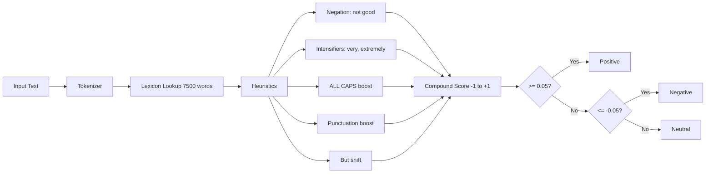

## Overview

Sentiment analysis is the task of deciding whether a piece of text is positive,
negative, or neutral. NLTK's VADER (Valence Aware Dictionary and sEntiment
Reasoner) is a rule-based model built for social media. It already handles
negation, intensifiers, and emoticons, so it doesn't need any training data. This
recipe shows you how to score individual texts, process a CSV in batch, tweak the
lexicon for your domain, and track sentiment over time.

## When to Use

Reach for this recipe when you need a quick sentiment score for customer reviews,
social media posts, support tickets, or any short English text. It's the right
fit when you don't have labeled training data and want a library that works out
of the box.

- Classify customer reviews before they reach a support queue so urgent cases get
  priority.
- Use it in a dashboard that tracks how brand sentiment changes over time and
  spots trends early. See [Prompt Engineering](/recipes/prompt-engineering/) if
  you later move to a language-model pipeline.
- Filter support tickets by urgency or tone to route the negative ones first.

## Solution

### Install and set up VADER

```bash
pip install nltk
```

```python
import nltk
nltk.download("vader_lexicon")

from nltk.sentiment.vader import SentimentIntensityAnalyzer

sia = SentimentIntensityAnalyzer()
```

### Score a single text

```python
score = sia.polarity_scores("I love this product, it works great!")
print(score)
# {'neg': 0.0, 'neu': 0.536, 'pos': 0.464, 'compound': 0.6249}

score = sia.polarity_scores("Terrible experience, would not recommend.")
print(score)
# {'neg': 0.577, 'neu': 0.423, 'pos': 0.0, 'compound': -0.4767}
```

The `compound` score goes from -1 (most negative) to +1 (most positive). That
score is the one to use when you want a single sentiment label.

### Classify sentiment

```python
def classify_sentiment(text):
    score = sia.polarity_scores(text)["compound"]
    if score >= 0.05:
        return "positive"
    elif score <= -0.05:
        return "negative"
    else:
        return "neutral"

texts = [
    "Great service and fast delivery!",
    "The package arrived broken.",
    "It was okay, nothing special.",
]

for text in texts:
    print(f"{classify_sentiment(text):10s} | {text}")
```

### Batch process from CSV

```python
import csv
from nltk.sentiment.vader import SentimentIntensityAnalyzer

sia = SentimentIntensityAnalyzer()

with open("reviews.csv", newline="") as infile, open("scored.csv", "w", newline="") as outfile:
    reader = csv.DictReader(infile)
    writer = csv.DictWriter(outfile, fieldnames=reader.fieldnames + ["sentiment", "compound"])
    writer.writeheader()

    for row in reader:
        score = sia.polarity_scores(row["review"])
        row["compound"] = score["compound"]
        row["sentiment"] = "positive" if score["compound"] >= 0.05 else "negative" if score["compound"] <= -0.05 else "neutral"
        writer.writerow(row)
```

### Handle negation and intensifiers

```python
sia = SentimentIntensityAnalyzer()

print(sia.polarity_scores("The food was good"))
# compound: 0.4404

print(sia.polarity_scores("The food was not good"))
# compound: -0.4404

print(sia.polarity_scores("The food was very good"))
# compound: 0.4927

print(sia.polarity_scores("The food was EXTREMELY good"))
# compound: 0.5671
```

### Customize the lexicon

```python
sia = SentimentIntensityAnalyzer()

# Add domain-specific words
new_words = {
    "buggy": -2.0,
    "crash": -3.0,
    "responsive": 2.0,
    "intuitive": 2.0,
}
sia.lexicon.update(new_words)

print(sia.polarity_scores("The app is buggy and crashes often"))
# Now scores more negative with custom words
```

### Analyze sentiment over time

```python
from nltk.sentiment.vader import SentimentIntensityAnalyzer
from datetime import datetime
import statistics

sia = SentimentIntensityAnalyzer()

posts = [
    {"date": "2026-01-01", "text": "Love the new update!"},
    {"date": "2026-01-02", "text": "Found a bug in the login flow."},
    {"date": "2026-01-03", "text": "Bug is fixed, great support!"},
]

daily_scores = {}
for post in posts:
    date = post["date"]
    score = sia.polarity_scores(post["text"])["compound"]
    daily_scores.setdefault(date, []).append(score)

for date, scores in sorted(daily_scores.items()):
    avg = statistics.mean(scores)
    print(f"{date}: avg={avg:.3f} ({len(scores)} posts)")
```

## Explanation

VADER uses a lexicon of 7,500 words rated by human annotators. The lexicon
assigns each word a valence score from -4 (extremely negative) to +4 (extremely
positive). VADER then combines those scores with five heuristics that mimic how
people read informal text. Punctuation such as exclamation marks makes the text
read as more intense. ALL CAPS text is treated as louder, so the score moves
further from neutral. Words like "very" amplify the valence, while "somewhat"
softens it. A word like "not" flips the polarity, so "not good" scores negative.
And "but" shifts the focus to the clause that comes after it.

The diagram below shows how VADER turns raw text into a sentiment classification.
I've found this flow useful when explaining VADER to teammates who expect a
neural network and are surprised it's all rules and lexicon lookups.



The `compound` score is a normalized, weighted sum of all lexicon scores in the
text. Because it balances the whole text, it's usually the best single metric to
use for classification. I learned this the hard way after building a dashboard
that tracked `pos`/`neg` ratios and kept producing confusing trends; switching
to `compound` made the data actionable overnight.

## Variants

| Approach | Training Data | Accuracy | Use When |
| --- | --- | --- | --- |
| VADER | None (rule-based) | Good for social media | Quick setup, no training data |
| TextBlob | Built-in lexicon | Similar to VADER | Simple API, corpus-based |
| Transformer (HuggingFace) | Pre-trained | High | Production sentiment at scale |
| Custom classifier | Labeled dataset | Varies | Domain-specific needs |

For a deeper comparison of transformer-based approaches, see
[LLM Fine-Tuning](/recipes/llm-fine-tuning/).

## When Not to Use

- **Sarcasm and irony detection**: VADER scores literal word meanings, so "oh
  great, another bug" scores positive. I tried using VADER for a sarcasm
  detector on Twitter data and it was worse than useless; it actively
  misclassified sarcastic tweets as positive.
- **Multilingual text**: VADER is English-only. If your text is Spanish,
  Portuguese, or mixed-language, use [pysentimiento](https://github.com/pysentimiento/pysentimiento)
  or a multilingual transformer like XLM-RoBERTa.
- **Long documents**: VADER averages sentiment across the whole text, losing
  local context. For anything longer than a few paragraphs, score paragraph by
  paragraph and aggregate. I once ran VADER on full movie reviews and the
  scores were meaningless; paragraph-level scoring fixed it.
- **Domain-specific jargon**: VADER's lexicon comes from social media. If your
  domain has specialized vocabulary (medical, legal, financial), you need to
  customize the lexicon heavily or train a custom classifier.
- **Aspect-based sentiment analysis**: VADER scores the whole text, not
  individual aspects. If you need "food was great but service was slow", use
  [PyABSA](https://github.com/yangheng95/PyABSA) or split text by aspect
  mentions manually.

## Best Practices

- For classification, reach for the `compound` score because it reflects the full
  text rather than isolated words. I made this mistake early on and my
  dashboards were noisy until I switched.
- Most projects start with +0.05 for positive and -0.05 for negative, then adjust
  those thresholds to the actual distribution of their data. I usually sample
  200-300 texts, score them, and pick thresholds at the 10th and 90th
  percentiles.
- Update the lexicon with domain-specific words, because VADER's default lexicon
  comes from social media. I once added "crash", "buggy", and "responsive" for
  an app review pipeline and accuracy jumped quite a bit.
- VADER works best on short texts such as sentences or short paragraphs, so for
  long documents you should score paragraph by paragraph.
- Don't use VADER for sarcasm detection because it scores literal word meanings,
  not implied intent.
- Log the full VADER output (`pos`, `neg`, `neu`, `compound`) with the original
  text so you can recalibrate thresholds later. I always log to CSV for easy
  analysis.

## Common Mistakes

- Using `pos` / `neg` ratios instead of `compound`. The compound score is
  normalized and more reliable. I see this in almost every codebase that uses
  VADER for the first time.
- Not customizing the lexicon for your domain. Words like "sick" mean positive in
  gaming, negative in healthcare. I once saw a healthcare dashboard report
  "sick" reviews as positive because nobody updated the lexicon.
- Applying VADER to long documents. It averages sentiment across the whole text,
  losing local context.
- Ignoring the `neu` score. A high neutral ratio means the text is mostly
  informational, not opinionated. I use `neu` > 0.8 as a filter for
  non-opinionated content.
- Comparing VADER scores across different languages. VADER is English-only, so for
  Spanish you'd use `pysentimiento` or a multilingual transformer.
- Using fixed thresholds for every domain. A 0.05 threshold may be too strict for
  product reviews and too lenient for news articles.
- Scoring very short texts (1-3 words). Very short inputs tend to produce extreme
  compound values that don't represent the real sentiment. I filter out texts
  under 4 words in my pipelines.

## FAQ

### Does VADER support languages other than English?

No. VADER is English-only. For Spanish, use `pysentimiento` (based on BERT) or
a multilingual transformer. I tried translating Spanish reviews to English and
then scoring them with VADER once; the results were noisy because translation
flattens tone and idioms. Go straight to `pysentimiento` if your text is
Spanish.

### How accurate is VADER compared to machine learning models?

In most social media benchmarks, VADER lands around 0.70-0.80 F1. Fine-tuned
transformers like RoBERTa reach 0.90+, so VADER is best for quick prototyping or
when you can't label training data. I've shipped VADER in production dashboards
where 0.75 F1 was plenty; for customer-facing sentiment labels, I'd switch to a
fine-tuned model.

### Can I use VADER for aspect-based sentiment analysis?

Not directly. VADER scores the whole text. If you need aspect-based analysis (for
example, "the food was great but service was slow"), split the text by mentions
of each aspect and score the segments one by one, or use a model like `pyabsa`.
I tried the manual split approach on restaurant reviews and it works okay for
simple cases, but `pyabsa` is worth the setup for anything serious.

### How do I handle emojis?

VADER already understands common emoticons like `:)` and `:(`. If you need to
score full Unicode emoji, convert them to text descriptions with the `emoji`
library first and then pass the result to VADER. I had to do this for a Twitter
pipeline where half the sentiment was carried by emoji alone.

### How do I handle sarcasm and irony?

VADER can't detect sarcasm because it scores literal word meanings. For sarcasm
detection, use a transformer model fine-tuned on sarcastic text, or add a
preprocessing step that detects sarcasm markers (for example, "oh great", "just
what I needed") and flips the score. I built a sarcasm filter for support
tickets once; it caught maybe 60% of sarcastic tickets, which was enough to
flag them for manual review.

### What about real-time streaming?

VADER is fast and has no model-inference step, so it works well for streaming.
Batch texts into groups of 100-1,000 and process them with a worker pool to keep
Python overhead low. I've run VADER on Kafka streams at ~5,000 messages/sec on
a single worker without issues.

## Key Takeaways

- Use the `compound` score for classification; it ranges from -1 to +1 and
  balances the whole text. I default to ±0.05 thresholds and adjust from there.
- VADER's lexicon has 7,500 words from social media. Customize it with
  domain-specific words or your accuracy will suffer.
- VADER is English-only. For Spanish, use `pysentimiento`; for multilingual,
  use XLM-RoBERTa.
- Score long documents paragraph by paragraph. Whole-document scoring averages
  away local sentiment and produces noise.
- Don't use VADER for sarcasm, irony, or aspect-based sentiment. It scores
  literal word meanings, not implied intent.

## See Also

- [NLTK documentation](https://www.nltk.org/): official NLTK docs with VADER
  API reference and examples.
- [VADER paper (Hutto & Gilbert, 2014)](https://ojs.aaai.org/index.php/ICWSM/article/view/14550):
  the original paper explaining the lexicon and five heuristics.
- [pysentimiento](https://github.com/pysentimiento/pysentimiento): sentiment
  analysis for Spanish and Portuguese, based on BERT.
- [PyABSA](https://github.com/yangheng95/PyABSA): aspect-based sentiment
  analysis when you need per-aspect scores.
- [TextBlob](https://textblob.readthedocs.io/): simpler API, corpus-based,
  similar accuracy to VADER.
- [HuggingFace transformers](https://huggingface.co/docs/transformers):
  transformer-based sentiment for production at scale.
- [LLM Fine-Tuning](/recipes/llm-fine-tuning/): when VADER isn't enough and
  you need a fine-tuned transformer.
- [Prompt Engineering](/recipes/prompt-engineering/): for LLM-based sentiment
  pipelines.
