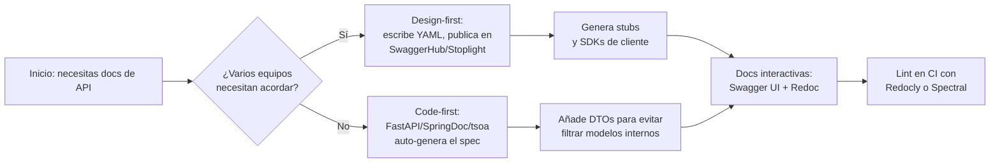

## Visión General

La mayoría de las documentaciones de API se pudren en READMEs, páginas de Confluence o hilos de Slack. Cada vez que publicas un cambio, esas páginas ya están desactualizadas. OpenAPI, la especificación que surgió de Swagger, te permite describir endpoints, esquemas, y errores en un solo archivo YAML o JSON. Ese mismo archivo puede impulsar documentación interactiva, SDKs de cliente, y tests de contrato.

Esta guía usa ejemplos en Python con FastAPI, JavaScript con Express y Java con SpringDoc, y repasa los trade-offs de cada uno. También compara Swagger UI y Redoc, y explica cómo evitar que el spec se pudra una vez está en producción. Recursos relacionados: [Implementar logging y audit trails de API](/recipes/api-logging-audit/), [Implementar Rate Limiting de APIs con Redis](/recipes/api-rate-limiting-redis/), [Paginacion por Cursor con PostgreSQL](/recipes/cursor-pagination-postgresql/) y [Construir notificaciones en tiempo real con WebSockets](/recipes/real-time-notifications/). Ver también [Server-Sent Events con Node.js y Express](/recipes/server-sent-events-node/).

## Cuándo Usar

Usa esta receta cuando necesites documentación interactiva que se mantenga sincronizada con el código, cuando quieras generar SDKs de cliente en varios lenguajes, cuando tu equipo construya contract-first, o cuando necesites validar solicitudes entrantes contra un esquema formal.

Omitela si la API es solo para uso interno y tú eres el único consumidor: un README corto probablemente basta. En cuanto un segundo equipo dependa de ella, un contrato escrito empieza a dar frutos.

## Solución

### Python

```python
from fastapi import FastAPI

app = FastAPI(title="Book API", version="1.0.0")

@app.get("/books/{book_id}", tags=["books"])
def get_book(book_id: int):
    """Retrieve a book by its ID."""
    return {"id": book_id, "title": "Clean Code"}

# FastAPI auto-generates /openapi.json and /docs (Swagger UI)
```

### JavaScript

```javascript
const express = require('express');
const swaggerUi = require('swagger-ui-express');
const YAML = require('yamljs');

const app = express();
const swaggerDocument = YAML.load('./openapi.yaml');

app.use('/api-docs', swaggerUi.serve, swaggerUi.setup(swaggerDocument));
app.listen(3000);
```

### Java

```java
import org.springframework.web.bind.annotation.*;

import io.swagger.v3.oas.annotations.Operation;
import io.swagger.v3.oas.annotations.responses.ApiResponse;

@RestController
@RequestMapping("/books")
public class BookController {

    @Operation(summary = "Get book by ID", description = "Returns a single book")
    @ApiResponse(responseCode = "200", description = "Found the book")
    @GetMapping("/{id}")
    public Book getBook(@PathVariable Long id) {
        return new Book(id, "Clean Code");
    }

    record Book(Long id, String title) {}
}
// springdoc-openapi auto-generates /v3/api-docs and /swagger-ui/index.html
```

## Explicación

Los equipos generan specs OpenAPI de dos maneras, y la elección correcta depende de quién sea el dueño del contrato.



Con **code-first**, un único equipo construye la API y deja que FastAPI, SpringDoc o tsoa generen `openapi.json` a partir de anotaciones o decoradores. El spec se mantiene cerca del código, pero puede filtrar modelos internos si no usas DTOs.

Suelo elegir design-first cuando los equipos de frontend, backend, y móvil necesitan ponerse de acuerdo en un contrato antes de escribir código. Entonces escribimos el YAML o JSON a mano, lo publicamos en SwaggerHub o Stoplight, y generamos stubs y clientes a partir de ese contrato. Ese contrato obliga a decidir de forma explícita campos, errores, y versionado. El riesgo es que, sin tests, el spec puede convertirse en una lista de deseos mientras el código hace otra cosa.

Una vez que existe el spec, impulsa documentación interactiva, un sitio de documentación limpio, y generadores de clientes. **Swagger UI** permite a los desarrolladores llamar endpoints desde el navegador. **Redoc** renderiza un sitio de tres paneles. Herramientas como `openapi-generator-cli` producen clientes tipados en TypeScript, Python, Java, y otros lenguajes.

## Variantes

| Herramienta | Lenguaje | Enfoque | Salida |
| --- | --- | --- | --- |
| FastAPI | Python | Code-first | /openapi.json + /docs auto-generados |
| Flask-RESTX | Python | Code-first | Swagger UI integrado |
| SpringDoc | Java | Code-first | /v3/api-docs + /swagger-ui.html |
| Express + swagger-ui | JavaScript | Design-first | Servir YAML pre-escrito |
| tsoa | TypeScript | Code-first | Generar spec desde decoradores |

## Lo que funciona

- **Fija la versión del spec a la versión de la API** en el campo `info.version`, y documenta deprecaciones con `deprecated: true` más un path de reemplazo.
- **Añade ejemplos** a los esquemas de solicitud y respuesta; son la forma más rápida de frenar preguntas de integración antes de que empiecen.
- **Agrupa operaciones con tags** como `users`, `orders` o `products` para que Swagger UI y Redoc muestren secciones colapsables.
- **Incluye respuestas de error reales**, no solo una respuesta `200` exitosa. Añade `400`, `401`, `404`, `409` y `5xx` con cuerpos problem-detail.
- **Valida el spec en CI** con `npx @redocly/cli lint` o `spectral`; un `$ref` roto o un `operationId` ausente romperá clientes generados sin avisar.

## Errores Comunes

Las herramientas code-first son útiles, pero solo ayudan si expones DTOs, no entidades de base de datos, en el spec. De lo contrario, el spec se desvía del código de formas difíciles de detectar.

Toda operación que requiera auth necesita una entrada `security` y un componente `securitySchemes` correspondiente. Olvidar cualquiera de los dos es una forma rápida de publicar un muro de autenticación sin documentar.

Los modelos internos deben mantenerse fuera de `components/schemas`. Usa DTOs dedicados para solicitud y respuesta.

Los campos nullable también sorprenden: OpenAPI 3.0 usa `nullable: true`, mientras que 3.1 usa `type: [string, null]`. Una vez elegido, valida contra un linter.

Por último, evita escribir URLs de servidor directamente en el spec; coloca variables en el array `servers`, como `{serverUrl}`, para que staging y producción puedan compartir el mismo spec.

## Solución de Problemas

Si Redoc o Swagger UI muestra una página en blanco, probablemente el spec esté malformado. Ejecuta el linter de Redocly para encontrar la línea y la regla exactas.

Si los clientes generados no compilan, busca valores `operationId` duplicados, palabras reservadas en nombres de esquema y valores `enum` que no sean identificadores válidos en el lenguaje destino.

Si el spec no coincide con el comportamiento desplegado, añade tests de contrato con Schemathesis o Pact en CI para que el desfase del spec rompa el build antes de llegar a los usuarios.

Si los ejemplos en Swagger UI se ven mal, asegúrate de que el campo `example` esté al nivel correcto del `schema`, y de que los ejemplos de arrays usen `items.example` en su lugar.

**Los specs grandes ralentizan la página de documentación**: divídelo con punteros `$ref` y empaquétalo con `redocly bundle` antes de mostrarlo.

## Lectura Adicional

- La [OpenAPI Specification (latest)](https://spec.openapis.org/oas/latest.html) es la referencia oficial para nombres de campos, tipos, y diferencias de versión.
- La documentación de [Redocly CLI](https://redocly.com/docs/cli) cubre la validación, empaquetado, y publicación de specs OpenAPI.
- La documentación de [FastAPI sobre OpenAPI](https://fastapi.tiangolo.com/reference/openapi/) explica cómo FastAPI genera `/openapi.json` y `/docs`.
- En Spring Boot, [Springdoc OpenAPI](https://springdoc.org/) cubre las anotaciones y las personalizaciones comunes.

## Notas de Producción

- **Versiona el spec en el control de código fuente** y etiqueta los releases con la misma versión que la API (`info.version` debe coincidir con la versión desplegada de la API).
- **Sirve la documentación desde un artefacto de build separado** o una ruta de CDN, de modo que actualizar el spec no requiera desplegar toda la aplicación de nuevo.
- **Valida el spec en CI** antes de publicar; un `$ref` roto o un `operationId` ausente romperá generadores de clientes y la salida de Redoc.
- **Monitorea los endpoints de documentación** (`/docs`, `/redoc`, `/openapi.json`) para detectar 4xx/5xx y latencia p99, especialmente después de actualizar el spec.

## Puntos Clave

- OpenAPI convierte un único archivo de spec en documentación interactiva, SDKs de cliente y tests de contrato, así que tu documentación se mantiene sincronizada con el código.
- Swagger UI es la mejor opción cuando los desarrolladores necesitan llamar endpoints desde el navegador; Redoc es mejor para una experiencia de lectura limpia y centrada en la documentación.
- FastAPI, Express, y SpringDoc pueden generar el spec automáticamente desde el código, pero los equipos con varios consumidores deberían considerar design-first con un registry compartido.
- Valida el spec en CI con `redocly lint` o `spectral` para detectar referencias rotas, `operationId`s ausentes y desfase de versiones antes de que lleguen a producción.

## Preguntas Frecuentes
### ¿Debería usar code-first o design-first?

Si la API es interna y solo la consume tu equipo, empieza con code-first. Herramientas como FastAPI, SpringDoc, o tsoa pueden derivar el spec de tus anotaciones, así que el contrato se mantiene cerca del código.

```python
@app.get("/books/{book_id}")
def get_book(book_id: int):
    ...
```

Si los equipos de frontend, móvil, backend o socios externos necesitan acordar el contrato primero, escribe el YAML de OpenAPI y publícalo en SwaggerHub o Stoplight antes de generar stubs.

```bash
openapi-generator-cli generate -i openapi.yaml -g python-fastapi
```

El riesgo de design-first es el desfase: el spec se convierte en una ilusión mientras el código hace otra cosa. Evítalo con tests de contrato (Schemathesis, Pact) en CI. El riesgo de code-first es filtrar modelos internos; evítalo retornando DTOs, no entidades de base de datos.
### ¿Cómo mantengo la documentación sincronizada con el código desplegado?

Genera el spec en CI desde el código, publícalo en un registry como SwaggerHub o Stoplight, y apunta la documentación desplegada a la última versión. En GitHub Actions.

```yaml
name: Generate OpenAPI Spec
on: push
jobs:
  spec:
    runs-on: ubuntu-latest
    steps:
      - uses: actions/checkout@v4
      - run: python -m app.main --export-openapi > openapi.json
      - run: npx @redocly/cli lint openapi.json
      - run: npx @redocly/cli build-docs openapi.json -o docs/
```

Ejecuta `npx @redocly/cli lint openapi.yaml` en cada PR para detectar violaciones de esquema, respuestas faltantes y referencias rotas. Publícalo como artefacto del build, despliega la documentación junto con la API y luego verifica la API contra el spec ejecutando el siguiente comando:

```bash
schemathesis run openapi.json --base-url http://localhost:8000
```
### ¿Cuál es la mejor forma de documentar autenticación y autorización en OpenAPI?

Describe la autenticación en `components/securitySchemes` y luego aplícala a cada operación. El ejemplo siguiente muestra un esquema Bearer JWT.

```yaml
components:
  securitySchemes:
    BearerAuth:
      type: http
      scheme: bearer
      bearerFormat: JWT
```

Para las API keys, usa `type: apiKey` e indica en qué header o query las esperas, como en el ejemplo siguiente.

```yaml
components:
  securitySchemes:
    ApiKeyAuth:
      type: apiKey
      in: header
      name: X-API-Key
```

OAuth2 requiere declarar el flujo y los scopes permitidos.

```yaml
components:
  securitySchemes:
    OAuth2:
      type: oauth2
      flows:
        authorizationCode:
          authorizationUrl: https://api.example.com/oauth/authorize
          tokenUrl: https://api.example.com/oauth/token
          scopes:
            read: Read access
            write: Write access
```

Una vez definidos los esquemas, añade la entrada `security` a nivel de operación.

```yaml
paths:
  /books:
    get:
      security:
        - BearerAuth: []
    post:
      security:
        - OAuth2: [write]
```

Para tokens JWT en OpenAPI 3.1, sigue usando `type: http` y `scheme: bearer`. El tipo `apiKey` todavía es válido, pero no encaja con bearer tokens, porque describe una clave de API personalizada en lugar de un esquema HTTP bearer.
### ¿Por qué importa el versionado en specs OpenAPI?

La versión del spec va en `info.version`; elige una estrategia de versionado que los clientes puedan descubrir fácilmente.

```yaml
info:
  title: Book API
  version: 2.1.0
```

Usa versionado semántico: major para cambios incompatibles, minor para endpoints nuevos y patch para correcciones. Si prefieres versionar por URL, incluye la versión en la URL del servidor.

```yaml
servers:
  - url: https://api.example.com/v2
```

El versionado por header se resuelve con un parámetro adicional.

```yaml
parameters:
  - name: X-API-Version
    in: header
    required: true
    schema:
      type: string
      default: "2"
```

Para marcar una operación como deprecada, añade `deprecated: true` y explica la alternativa en la descripción.

```yaml
paths:
  /books/{id}:
    get:
      deprecated: true
      description: Use /v2/books/{id} instead
```

Durante los períodos de migración, mantén ambas versiones del spec y deja que el cliente negocie la versión con el header `Accept`, por ejemplo enviando `Accept: application/vnd.api+json;version=2`.
### ¿Puedo convertir Swagger 2.0 a OpenAPI 3.0?

Sí. Puedes usar la CLI `swagger2openapi` o el conversor integrado de Swagger Editor. La mayoría de herramientas modernas maneja 3.0 de forma nativa. Ejecuta `npx swagger2openapi swagger.json -o openapi.json` y espera algunos cambios mecánicos. `host`, `basePath` y `schemes` se combinan en un array `servers`; `definitions` y `responses` se mueven a `components/schemas` y `components/responses`; y `securityDefinitions` pasa a ser `components/securitySchemes`. Los campos globales `produces` y `consumes` desaparecen; ahora cada operación declara su negociación de contenido en su propio bloque `content`. Después, valida el resultado con `npx @redocly/cli lint openapi.json`. Algunos casos extremos, como `type: file` pasando a `format: binary` y `collectionFormat` convirtiéndose en parámetros `style` y `explode`, aún requieren ajustes manuales.
### ¿Qué cambió entre OpenAPI 3.0 y 3.1?

OpenAPI 3.1 elimina el antiguo flag `nullable: true` y en su lugar usa `type: [string, null]`. Además, `exclusiveMinimum` y `exclusiveMaximum` pasan de ser booleanos a números que indican el límite excluido.

```yaml
minimum: 0
exclusiveMinimum: true
```

En 3.1, eso pasa a ser `exclusiveMinimum: 0`. Las subidas binarias cambian de `format: binary` a `contentEncoding: binary`, los webhooks obtienen un campo `webhooks` de nivel superior, y los identificadores de licencia usan SPDX. El campo `summary` dentro de `$ref` es opcional, y `paths` puede estar vacío para APIs que solo usen webhooks.

Antes de migrar, valida el spec con `redocly lint` y convierte con `npx @redocly/cli@latest convert openapi.yaml --to 3.1`. La mayoría de herramientas soportan 3.1, pero verifica tu generador y parser primero.
### ¿Qué pasa con las subidas y descargas de archivos en OpenAPI?

Para subidas de archivos en OpenAPI 3.0, usa `format: binary` en una propiedad de tipo string dentro del cuerpo de una petición `multipart/form-data`. Si necesitas varios archivos, cambia la propiedad a un array de cadenas binarias.

En OpenAPI 3.1, `format: binary` se convierte en `contentEncoding: binary`. Para descargas, la respuesta debería usar el content type `application/octet-stream`, lo que significa que también debes declarar un esquema de cadena binaria para el cuerpo de la respuesta. Las imágenes funcionan de la misma forma: declara el tipo de contenido, como `image/png`, y un esquema binario.

Para limitar el tamaño de subida, añade `maxLength` al campo binario e indica el límite en la descripción, por ejemplo `10485760` bytes para 10 MB.
### ¿Qué son los esquemas polimórficos y cómo funcionan en OpenAPI?

Los tipos polimórficos se modelan con las keywords `oneOf`, `anyOf` y `allOf`. El ejemplo siguiente es una unión discriminada.

```yaml
components:
  schemas:
    Pet:
      oneOf:
        - $ref: '#/components/schemas/Dog'
        - $ref: '#/components/schemas/Cat'
      discriminator:
        propertyName: type
        mapping:
          dog: '#/components/schemas/Dog'
          cat: '#/components/schemas/Cat'
```

Cada subtipo incluye el campo discriminador.

```yaml
Dog:
  type: object
  properties:
    type:
      type: string
      enum: [dog]
    breed:
      type: string
  required: [type, breed]
```

Para aceptar tipos mixtos, usa `anyOf` en lugar de herencia.

```yaml
PropertyValue:
  anyOf:
    - type: string
    - type: number
    - type: boolean
    - type: array
      items:
        $ref: '#/components/schemas/PropertyValue'
```

Cuando necesites heredar propiedades sin un discriminador, usa `allOf` para combinar los esquemas.

```yaml
Animal:
  allOf:
    - $ref: '#/components/schemas/BaseEntity'
    - type: object
      properties:
        species:
          type: string
```
### ¿Por qué usar RFC 7807 Problem Details para respuestas de error?

Para los errores RFC 7807, usa el media type `application/problem+json` y un schema `Problem` reutilizable.

```yaml
components:
  schemas:
    Problem:
      type: object
      properties:
        type:
          type: string
          format: uri
          default: about:blank
        title:
          type: string
        status:
          type: integer
        detail:
          type: string
        instance:
          type: string
          format: uri
```

Después referencia ese schema en las respuestas de error mediante `$ref` en cada endpoint.

```yaml
responses:
  '404':
    description: Book not found
    content:
      application/problem+json:
        schema:
          $ref: '#/components/schemas/Problem'
        examples:
          not_found:
            value:
              type: https://api.example.com/errors/not-found
              title: Book not found
              status: 404
              detail: Book with ID 42 not found
              instance: /books/42
```

Documenta los códigos de error comunes, como 400 para errores de validación, 401 para autenticación faltante, 403 para permisos insuficientes, 409 para conflictos, 422 para fallos semánticos y 429 para limitación de frecuencia.

### ¿Qué herramientas validan specs OpenAPI en CI?

Redocly y Spectral son los linters que más uso. Con Redocly puedes instalar el CLI globalmente (`npm install -g @redocly/cli`) y ejecutar `redocly lint openapi.yaml`. A continuación añade un archivo de reglas sencillo para reforzar tus convenciones.

```yaml
rules:
  operation-operationId-unique:
    severity: error
  operation-summary:
    severity: warn
    max_length: 50
```

Spectral funciona de forma similar: instálalo con `npm install -g @stoplight/spectral-cli`, extiende el ruleset OAS incorporado y personaliza las reglas que te importen. Luego añádelo a GitHub Actions.

```yaml
- name: Lint OpenAPI
  run: npx @redocly/cli lint openapi.yaml
```

Valida la estructura del spec: busca `operationId` faltante, destinos `$ref` no definidos, esquemas de respuesta faltantes y parámetros de path duplicados. Para corregir problemas comunes ejecuta `redocly lint --format=json openapi.yaml | jq '.problems[] | select(.ruleId == "operation-summary")'` para filtrar reglas específicas.
### ¿Cuándo debo deprecar una API y usar headers Sunset?

Marca las operaciones deprecadas con `deprecated: true` y añade el header `Sunset` con la fecha de eliminación.

```yaml
paths:
  /v1/books:
    get:
      deprecated: true
      description: Deprecated in favor of /v2/books. Will be removed on 2025-12-31.
```

También incluye el header `Deprecation` para advertir al cliente.

```yaml
responses:
  '200':
    headers:
      Deprecation:
        schema:
          type: string
          example: true
      Sunset:
        schema:
          type: string
          example: Wed, 31 Dec 2025 23:59:59 GMT
          description: Date when the endpoint will be removed
```

En la descripción de la operación añade el path de migración, por ejemplo: `description: Migrate to /v2/books which supports cursor-based pagination and additional filters.`. Para rastrear el uso de endpoints deprecados, registra las peticiones y notifica a los consumidores por email o webhook. También puedes usar el header `Link` para apuntar al reemplazo: `Link: </v2/books>; rel="successor-version"`.
### ¿Qué causa referencias circulares en esquemas OpenAPI?

Una referencia circular ocurre cuando un esquema apunta de vuelta a sí mismo. Basta con añadir una referencia al componente.

```yaml
components:
  schemas:
    Category:
      type: object
      properties:
        name:
          type: string
        subcategories:
          type: array
          items:
            $ref: '#/components/schemas/Category'
```

La mayoría de herramientas OpenAPI maneja referencias circulares correctamente. En generación de código, las referencias circulares producen tipos recursivos.

```yaml
class Category:
    name: str
    subcategories: List[Category]
```

Para estructuras profundamente anidadas, limita la profundidad de recursión con `x-max-depth: 5`. En serialización JSON, maneja las referencias circulares con `default=str` o codificadores personalizados. En Swagger UI, las referencias circulares pueden causar expansión infinita; usa `x-stoplight:readonly` para evitar la edición. Para validar, usa `jsonschema` con un `RefResolver` que maneje referencias circulares, como se muestra aquí: `resolver = jsonschema.RefResolver.from_schema(schema); jsonschema.validate(instance, schema, resolver=resolver)`.

## Ver También

- [API Versioning](/recipes/api-versioning/): estrategias para versionar APIs REST.
- [Call REST API](/recipes/call-rest-api/): consumir APIs REST desde código cliente.
- [GraphQL API](/recipes/graphql-api/): enfoque alternativo de API.
- [Handle CORS](/recipes/handle-cors/): configuración de cross-origin resource sharing.
- [Handle Errors](/recipes/handle-errors/): patrones estructurados de manejo de errores.

## Errores Comunes en Producción

- Dejar que el spec OpenAPI se desfase del API desplegado, de forma que la documentación, los clientes y los tests dejen de coincidir con la realidad.
- Exponer esquemas internos de base de datos en `components/schemas` en lugar de DTOs estables.
- Saltar el lint del spec en CI y publicar referencias `$ref` rotas o inválidas.
- Usar seguridad `apiKey` para tokens JWT tipo bearer en lugar de `http` con `scheme: bearer`.
- Olvidar versionar el spec junto con la API, o eliminar paths deprecados demasiado pronto.
- Exponer los endpoints `/docs` y `/redoc` generados en APIs internas sin control de acceso.
- Dar por sentado que un cliente generado funcionará sin verificar compatibilidad con tu versión de OpenAPI y extensiones.
