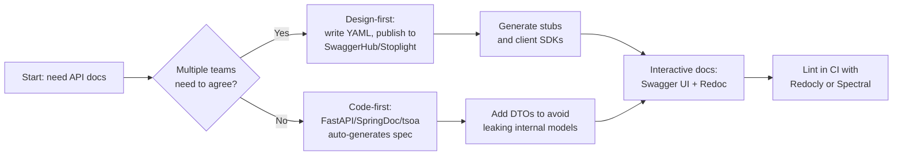

## Overview

Most API docs rot in READMEs, Confluence pages or Slack threads. The moment you ship a change, those pages are already out of date. OpenAPI, the spec that grew out of Swagger, lets you describe your endpoints, schemas, and errors in a single YAML or JSON file. That same file can drive interactive docs and client SDKs, plus test scaffolding.

This guide shows examples in Python with FastAPI, JavaScript with Express and Java with SpringDoc, and it walks through the trade-offs of each. It also compares Swagger UI and Redoc, and explains how to keep the spec from rotting once it's in production. Related recipes: [Implement API Logging and Audit Trails](/recipes/api-logging-audit/), [Implement API Rate Limiting with Redis](/recipes/api-rate-limiting-redis/), [Cursor-Based Pagination with PostgreSQL](/recipes/cursor-pagination-postgresql/), and [Build Real-Time Notifications with WebSockets](/recipes/real-time-notifications/). See also [Server-Sent Events with Node.js and Express](/recipes/server-sent-events-node/).

## When to Use

Use this recipe when the docs need to stay in sync with the code, when you want client SDKs in several languages, when the team is building contract-first, or when you want to validate incoming requests against a formal schema.

Skip it if the API is only for internal use and you're the only consumer; a short README probably covers it. Once a second team depends on it, a written contract starts paying off.

## Solution

### Python

```python
from fastapi import FastAPI

app = FastAPI(title="Book API", version="1.0.0")

@app.get("/books/{book_id}", tags=["books"])
def get_book(book_id: int):
    """Retrieve a book by its ID."""
    return {"id": book_id, "title": "Clean Code"}

# FastAPI auto-generates /openapi.json and /docs (Swagger UI)
```

### JavaScript

```javascript
const express = require('express');
const swaggerUi = require('swagger-ui-express');
const YAML = require('yamljs');

const app = express();
const swaggerDocument = YAML.load('./openapi.yaml');

app.use('/api-docs', swaggerUi.serve, swaggerUi.setup(swaggerDocument));
app.listen(3000);
```

### Java

```java
import org.springframework.web.bind.annotation.*;

import io.swagger.v3.oas.annotations.Operation;
import io.swagger.v3.oas.annotations.responses.ApiResponse;

@RestController
@RequestMapping("/books")
public class BookController {

    @Operation(summary = "Get book by ID", description = "Returns a single book")
    @ApiResponse(responseCode = "200", description = "Found the book")
    @GetMapping("/{id}")
    public Book getBook(@PathVariable Long id) {
        return new Book(id, "Clean Code");
    }

    record Book(Long id, String title) {}
}
// springdoc-openapi auto-generates /v3/api-docs and /swagger-ui/index.html
```

## Explanation

Teams produce OpenAPI specs in two ways, and the right choice depends on who owns the contract.



With code-first, a single team builds the API and lets FastAPI, SpringDoc or tsoa generate `openapi.json` from annotations or decorators. The spec stays close to the code, but it can leak internal models if you don't use DTOs.

I tend to choose design-first when the frontend, backend, and mobile teams all need to agree on a contract before anyone writes code. We then write the YAML or JSON by hand, publish it to SwaggerHub or Stoplight, and generate server stubs and clients from that contract. It forces explicit decisions about fields, errors, and versioning. The downside is that, without tests, the spec can become a wishlist while the code does something else.

Once the spec exists, it can drive interactive docs, a clean doc site, and client generators. **Swagger UI** lets developers call endpoints from the browser. **Redoc** renders a three-pane doc site. Tools like `openapi-generator-cli` produce typed clients in TypeScript, Python, Java, and other languages.

## Variants

| Tool | Language | Approach | Output |
| --- | --- | --- | --- |
| FastAPI | Python | Code-first | Auto-generated /openapi.json + /docs |
| Flask-RESTX | Python | Code-first | Built-in Swagger UI |
| SpringDoc | Java | Code-first | /v3/api-docs + /swagger-ui.html |
| Express + swagger-ui | JavaScript | Design-first | Serve pre-written YAML |
| tsoa | TypeScript | Code-first | Generate spec from decorators |

## What Works

- **Pin the spec version to the API version** in the `info.version` field, and document deprecations with `deprecated: true` plus a replacement path.
- **Add examples** to request and response schemas; they're the fastest way to stop integration questions before they start.
- **Group operations with tags** such as `users`, `orders`, or `products` so Swagger UI and Redoc render collapsible sections.
- **Document real error responses**, not just a successful 200. Include `400`, `401`, `404`, `409` and `5xx` with problem-detail bodies.
- **Validate the spec in CI** with `npx @redocly/cli lint` or `spectral`; a broken `$ref` or missing `operationId` will silently break client generators.

## Common Mistakes

Code-first tooling is great, but it only helps if you expose DTOs, not database entities, in the spec. Otherwise the spec drifts from the code in subtle ways.

Every operation that requires auth needs a security entry and a matching securitySchemes component. Forgetting either is a fast way to ship an undocumented auth wall.

Internal models should stay out of `components/schemas`. Use dedicated request and response DTOs instead.

Nullable fields also catch people out: OpenAPI 3.0 uses `nullable: true`, while 3.1 uses `type: [string, null]`. Once you've picked one, lint against it.

Finally, avoid hardcoding server URLs; put variables in the `servers` array using `{serverUrl}` so staging and production can share the same spec.


## Troubleshooting

If Redoc or Swagger UI shows a blank page, the spec is probably malformed. Run Redocly's linter to find the exact line and rule.

If generated clients don't compile, look for duplicate `operationId` values, reserved words in schema names and `enum` values that aren't valid identifiers in the target language.

If the spec doesn't match deployed behavior, add contract tests with Schemathesis or Pact in CI so spec drift breaks the build before it reaches users.

If examples in Swagger UI look wrong, make sure the `example` field sits next to the right `schema` level, and that array examples use `items.example` instead.

**Large specs slow down the docs page**: split it with `$ref` pointers and bundle it with `redocly bundle` before rendering.


## Further Reading

- The [OpenAPI Specification (latest)](https://spec.openapis.org/oas/latest.html) is the official reference for field names, types, and version differences.
- The [Redocly CLI documentation](https://redocly.com/docs/cli) covers linting, bundling, and publishing OpenAPI specs.
- The [FastAPI docs on OpenAPI](https://fastapi.tiangolo.com/reference/openapi/) explain how FastAPI generates `/openapi.json` and `/docs`.
- For Spring Boot, [Springdoc OpenAPI](https://springdoc.org/) covers the annotations and common customizations.

## Production Notes

- **Version the spec in source control** and tag releases with the same version as the API (`info.version` should match the deployed API version).
- **Serve docs from a separate build artifact** or a CDN path, so updating the spec doesn't require a full application deploy.
- **Lint the spec in CI** before publishing; a broken `$ref` or missing `operationId` will break client generators and Redoc rendering.
- **Monitor doc endpoints** (`/docs`, `/redoc`, `/openapi.json`) for 4xx/5xx and p99 latency, especially after spec updates.

## Key Takeaways

- OpenAPI turns a single spec file into interactive docs, client SDKs and contract tests, so your documentation stays in sync with your code.
- Swagger UI is best when developers need to call endpoints from the browser; Redoc is better for a clean, documentation-first reading experience.
- FastAPI, Express, and SpringDoc can generate the spec automatically from code, but teams with several consumers should consider design-first with a shared registry.
- Validate the spec in CI with `redocly lint` or `spectral` to catch broken references, missing `operationId`s and version drift before they reach production.

## FAQ
### Should I use code-first or design-first?

If the API is internal and only your team consumes it, start code-first. Tools like FastAPI, SpringDoc, or tsoa can derive the spec from your annotations, so the contract stays close to the code:

```python
@app.get("/books/{book_id}")
def get_book(book_id: int):
    ...
```

If frontend, mobile, backend or external partners need to agree on the contract first, write the OpenAPI YAML and publish it to SwaggerHub or Stoplight before generating stubs:

```bash
openapi-generator-cli generate -i openapi.yaml -g python-fastapi
```

Design-first risks drift: the spec turns into a wishlist while the code does something else. Stop that with contract tests (Schemathesis, Pact) in CI. Code-first risks leaking internal models; stop that by returning DTOs, not database entities.
### How do I keep documentation in sync with deployed code?

Generate the spec in CI from your code, publish it to a registry like SwaggerHub or Stoplight, and point the deployed docs at the latest version. In GitHub Actions:

```yaml
name: Generate OpenAPI Spec
on: push
jobs:
  spec:
    runs-on: ubuntu-latest
    steps:
      - uses: actions/checkout@v4
      - run: python -m app.main --export-openapi > openapi.json
      - run: npx @redocly/cli lint openapi.json
      - run: npx @redocly/cli build-docs openapi.json -o docs/
```
Lint the spec on every PR with `npx @redocly/cli lint openapi.yaml` to catch schema violations, missing responses and broken references. Publish it as a build artifact, deploy docs alongside the API, and then verify the API against the spec by running the command below.

```bash
schemathesis run openapi.json --base-url http://localhost:8000
```
### What is the best way to document authentication and authorization in OpenAPI?

Describe authentication under `components/securitySchemes` and then apply it to each operation. The first block shows a Bearer JWT scheme.

```yaml
components:
  securitySchemes:
    BearerAuth:
      type: http
      scheme: bearer
      bearerFormat: JWT
```

For API keys, use `type: apiKey` and tell clients which header to send.

```yaml
components:
  securitySchemes:
    ApiKeyAuth:
      type: apiKey
      in: header
      name: X-API-Key
```

OAuth2 needs the flow and scopes declared.

```yaml
components:
  securitySchemes:
    OAuth2:
      type: oauth2
      flows:
        authorizationCode:
          authorizationUrl: https://api.example.com/oauth/authorize
          tokenUrl: https://api.example.com/oauth/token
          scopes:
            read: Read access
            write: Write access
```

Once you define the schemes, apply them at the operation level.

```yaml
paths:
  /books:
    get:
      security:
        - BearerAuth: []
    post:
      security:
        - OAuth2: [write]
```

For JWT tokens in OpenAPI 3.1, stick with the HTTP bearer scheme. The `apiKey` type still works, but it doesn't fit bearer tokens, because it describes a custom API key rather than a bearer scheme.
### Why does versioning matter in OpenAPI specs?

Set the spec version in `info.version` and pick a versioning strategy that your clients can discover:

```yaml
info:
  title: Book API
  version: 2.1.0
```

Use semantic versioning: major for breaking changes, minor for new endpoints, patch for fixes. For URL-based versioning, put the version in the `servers` URL:

```yaml
servers:
  - url: https://api.example.com/v2
```

For header-based versioning, add an optional header parameter:

```yaml
parameters:
  - name: X-API-Version
    in: header
    required: true
    schema:
      type: string
      default: "2"
```
Document deprecations with `deprecated: true` on operations:

```yaml
paths:
  /books/{id}:
    get:
      deprecated: true
      description: Use /v2/books/{id} instead
```
Maintain both spec versions during migration periods and use `Accept` header content negotiation, for example `Accept: application/vnd.api+json;version=2`.
### Can I convert Swagger 2.0 to OpenAPI 3.0?

Yes. Use the `swagger2openapi` CLI or Swagger Editor's built-in converter. Most modern tooling handles 3.0 natively now. Run the conversion and expect a few mechanical changes:

```bash
npx swagger2openapi swagger.json -o openapi.json
```

The `host`, `basePath` and `schemes` fields collapse into a `servers` array; `definitions` and `responses` move to `components/schemas` and `components/responses`; and `securityDefinitions` becomes `components/securitySchemes`. The global `produces` and `consumes` fields go away; each operation now declares its own content negotiation. After that, lint the result with `npx @redocly/cli lint openapi.json`. For a couple of edge cases, the file type becomes format binary and collectionFormat becomes style and explode parameters, so you may need to adjust them manually.
### What changed between OpenAPI 3.0 and 3.1?

OpenAPI 3.1 drops the old `nullable: true` flag and instead uses `type: [string, null]`. It also rewrites `exclusiveMinimum` and `exclusiveMaximum` as numbers rather than booleans:

```yaml
minimum: 0
exclusiveMinimum: true
```

With 3.1, that turns into `exclusiveMinimum: 0`. Binary uploads switch from `format: binary` to `contentEncoding: binary`, webhooks get a top-level `webhooks` field, and license identifiers use SPDX. `summary` inside `$ref` is optional, and `paths` can even be empty for webhooks-only APIs.

Before migrating, lint the spec with `redocly lint` and convert with `npx @redocly/cli@latest convert openapi.yaml --to 3.1`. Most tools support 3.1 now, but double-check your generator and parser first.
### What happens with file uploads and downloads in OpenAPI?

For file uploads in OpenAPI 3.0, use the format binary on a string property inside a multipart/form-data request body. If you need several files, switch the property to an array of binary strings.

In OpenAPI 3.1, `format: binary` becomes `contentEncoding: binary`. For downloads, the response should use the application/octet-stream content type, which means you should also declare a binary string schema for the response body. Images work the same way: declare the content type, such as image/png, and a binary schema.

To cap upload size, add `maxLength` to the binary field and note the limit in the description, for example 10485760 bytes for 10MB.
### What are polymorphic schemas and how do they work in OpenAPI?

Polymorphic types can be modeled with the `oneOf`, `anyOf` and `allOf` keywords. For discriminated unions, use `oneOf` with a discriminator:

```yaml
components:
  schemas:
    Pet:
      oneOf:
        - $ref: '#/components/schemas/Dog'
        - $ref: '#/components/schemas/Cat'
      discriminator:
        propertyName: type
        mapping:
          dog: '#/components/schemas/Dog'
          cat: '#/components/schemas/Cat'
```
Define subtypes with the discriminator field:

```yaml
Dog:
  type: object
  properties:
    type:
      type: string
      enum: [dog]
    breed:
      type: string
  required: [type, breed]
```
For mixed types, use `anyOf`:

```yaml
PropertyValue:
  anyOf:
    - type: string
    - type: number
    - type: boolean
    - type: array
      items:
        $ref: '#/components/schemas/PropertyValue'
```
For composition without discrimination, use `allOf` to inherit properties:

```yaml
Animal:
  allOf:
    - $ref: '#/components/schemas/BaseEntity'
    - type: object
      properties:
        species:
          type: string
```
### Why use RFC 7807 Problem Details for error responses?

For RFC 7807 errors, use the `application/problem+json` media type and a reusable `Problem` schema:

```yaml
components:
  schemas:
    Problem:
      type: object
      properties:
        type:
          type: string
          format: uri
          default: about:blank
        title:
          type: string
        status:
          type: integer
        detail:
          type: string
        instance:
          type: string
          format: uri
```
Reference it in error responses:

```yaml
responses:
  '404':
    description: Book not found
    content:
      application/problem+json:
        schema:
          $ref: '#/components/schemas/Problem'
        examples:
          not_found:
            value:
              type: https://api.example.com/errors/not-found
              title: Book not found
              status: 404
              detail: Book with ID 42 not found
              instance: /books/42
```
Document common error codes: 400 for validation errors, 401 for missing auth, 403 for insufficient permissions, 409 for conflicts, 422 for semantic validation failures, 429 for rate limiting.
### Which tools validate OpenAPI specs in CI?

Redocly and Spectral are the two linters I reach for. With Redocly, install the CLI globally (`npm install -g @redocly/cli`), then run `redocly lint openapi.yaml`. Add a small ruleset file to enforce your own conventions:

```yaml
rules:
  operation-operationId-unique:
    severity: error
  operation-summary:
    severity: warn
    max_length: 50
```

Spectral works the same way: `npm install -g @stoplight/spectral-cli`, then extend the built-in OAS ruleset and override the ones that matter to you.
In GitHub Actions:

```yaml
- name: Lint OpenAPI
  run: npx @redocly/cli lint openapi.yaml
```
Validate spec structure: check for missing `operationId`, undefined `$ref` targets, missing response schemas, and duplicate path parameters. Auto-fix common issues by running `redocly lint --format=json openapi.yaml | jq '.problems[] | select(.ruleId == "operation-summary")'` to filter specific rules.
### When should I deprecate an API and use Sunset headers?

Mark operations with `deprecated: true` and use the `Sunset` header for the removal date:

```yaml
paths:
  /v1/books:
    get:
      deprecated: true
      description: Deprecated in favor of /v2/books. Will be removed on 2025-12-31.
```
Include the `Deprecation` header:

```yaml
responses:
  '200':
    headers:
      Deprecation:
        schema:
          type: string
          example: true
      Sunset:
        schema:
          type: string
          example: Wed, 31 Dec 2025 23:59:59 GMT
          description: Date when the endpoint will be removed
```
Document migration paths in the description, for example:
`description: Migrate to /v2/books which supports cursor-based pagination and additional filters.`

To track deprecation usage, log requests to deprecated endpoints and notify consumers via email or webhook. Use the Link header to point to the replacement:
`Link: </v2/books>; rel="successor-version"`
### What causes circular references in OpenAPI schemas?

A circular reference happens when a schema points back to itself. Just add a `$ref` to the component, as the example shows.

```yaml
components:
  schemas:
    Category:
      type: object
      properties:
        name:
          type: string
        subcategories:
          type: array
          items:
            $ref: '#/components/schemas/Category'
```
Most OpenAPI tools handle circular refs correctly. In code generation, circular refs produce recursive types:

```python
class Category:
    name: str
    subcategories: List[Category]
```
For deeply nested structures, limit recursion depth with `x-max-depth: 5`. In JSON serialization, handle circular refs with `default=str` or custom encoders. In Swagger UI, circular refs may cause infinite expansion, so use `x-stoplight:readonly` to prevent editing. For validation, use `jsonschema` with a `RefResolver` that handles circular refs, as shown here: `resolver = jsonschema.RefResolver.from_schema(schema); jsonschema.validate(instance, schema, resolver=resolver)`.

## See Also

- [API Versioning](/recipes/api-versioning/): strategies for versioning REST APIs
- [Call REST API](/recipes/call-rest-api/): consuming REST APIs from client code
- [GraphQL API](/recipes/graphql-api/): alternative API approach
- [Handle CORS](/recipes/handle-cors/): cross-origin resource sharing configuration
- [Handle Errors](/recipes/handle-errors/): structured error handling patterns

## Common Production Pitfalls

- Letting the OpenAPI spec drift from the deployed API so that docs, clients, and tests stop matching reality.
- Exposing internal database schemas directly in `components/schemas` instead of stable DTOs.
- Skipping spec linting in CI and publishing invalid or broken `$ref` references.
- Using `apiKey` security for bearer JWT tokens instead of `http` with `scheme: bearer`.
- Forgetting to version the spec alongside the API, or removing deprecated paths too aggressively.
- Exposing generated `/docs` and `/redoc` endpoints on internal APIs without access control.
- Assuming a generated client will work without checking compatibility with your OpenAPI version and extensions.
