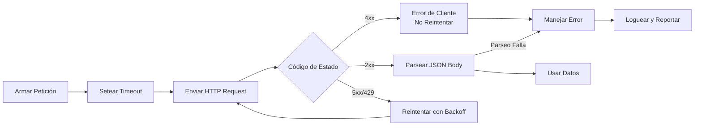

## Resumen

La mayoría de las aplicaciones se comunican con el exterior a través de APIs REST
sobre HTTP. Llamar a una API REST significa enviar una petición — normalmente `GET` o
`POST` — a una URL y manejar la respuesta, que suele ser JSON. El desafío es hacerlo
de forma segura: verificar códigos de estado, setear timeouts y parsear el body sin
que falle.

Una vez pasé dos horas debugueando un outage en producción que resultó ser un
parámetro `timeout` faltante. El servicio de pagos que llamábamos tuvo un deploy
defectuoso, empezó a colgarse en cada petición, y nuestros workers se acumularon
hasta que la cola se saturó y el sistema entero se detuvo. Un simple `timeout=10`
habría contenido el daño a unos pocos errores de retry en lugar de un outage total.

Esta receta recorre Python, JavaScript, Java y Go para que puedas elegir el cliente
adecuado para tu stack. Recursos relacionados: [Cómo documentar una API con OpenAPI, Swagger UI y Redoc](/recipes/api-documentation-openapi/).

## Cuándo Usar

- Para traer datos de una API interna o de terceros.
- Para enviar datos de formularios o eventos a un backend.
- Para integrar plataformas SaaS (pagos, email, analytics).
- Para construir un SDK o CLI que consuma un servicio HTTP.
- Para subir archivos o consultar el estado de un job.

## Cuándo NO Usar

- Comunicación bidireccional en tiempo real: usá
  [WebSockets](/es/recipes/websocket-server/) o
  [Server-Sent Events](/es/recipes/server-sent-events/) en su lugar.
- Streaming de payloads enormes: considerá un protocolo dedicado o URLs
  prefirmadas.

## Solución

### Python con `requests`

`requests` es el cliente HTTP más popular de Python. Pasá un `timeout` para que no se
congele, y usá `raise_for_status()` para convertir respuestas `4xx`/`5xx` en
excepciones. Consultá la
[documentación de requests](https://docs.python-requests.org/en/latest/) para la API completa.

```python
import requests

response = requests.get("https://api.example.com/users/1", timeout=10)
response.raise_for_status()

data = response.json()
print(data["name"])
```

### JavaScript con `fetch`

`fetch` viene incluido en navegadores modernos y Node.js 18+. Solo rechaza por errores
de red; las respuestas HTTP erróneas igual resuelven, así que hay que revisar
`response.ok` a mano. Ver la
[documentación de fetch en MDN](https://developer.mozilla.org/en-US/docs/Web/API/fetch).

```javascript
const response = await fetch("https://api.example.com/users/1");
if (!response.ok) {
  throw new Error(`HTTP ${response.status}`);
}

const data = await response.json();
console.log(data.name);
```

### Java con `HttpClient`

Java 11 trae `java.net.http.HttpClient`. Soporta requests síncronos y asíncronos, y
maneja HTTP/2 de forma transparente. Ver la
[documentación de HttpClient](https://docs.oracle.com/en/java/javase/11/api/java.net.http/java/net/http/HttpClient.html).

```java
import java.net.URI;
import java.net.http.*;

HttpClient client = HttpClient.newHttpClient();
HttpRequest request = HttpRequest.newBuilder()
    .uri(URI.create("https://api.example.com/users/1"))
    .GET()
    .build();

HttpResponse<String> response =
    client.send(request, HttpResponse.BodyHandlers.ofString());

if (response.statusCode() >= 400) {
    throw new RuntimeException("HTTP " + response.statusCode());
}

System.out.println(response.body());
```

### Go con `net/http`

La librería estándar de Go tiene un cliente HTTP listo para producción. Cerrá el body
para evitar fugas, y usá `context` para timeouts. Ver la
[documentación del paquete net/http](https://pkg.go.dev/net/http).

```go
package main

import (
    "context"
    "encoding/json"
    "fmt"
    "io"
    "net/http"
    "time"
)

func main() {
    ctx, cancel := context.WithTimeout(context.Background(), 10*time.Second)
    defer cancel()

    req, err := http.NewRequestWithContext(ctx, "GET", "https://api.example.com/users/1", nil)
    if err != nil {
        panic(err)
    }
    req.Header.Set("Accept", "application/json")

    resp, err := http.DefaultClient.Do(req)
    if err != nil {
        panic(err)
    }
    defer resp.Body.Close()

    if resp.StatusCode >= 400 {
        panic(fmt.Sprintf("HTTP %d", resp.StatusCode))
    }

    body, _ := io.ReadAll(resp.Body)
    var data map[string]interface{}
    json.Unmarshal(body, &data)
    fmt.Println(data["name"])
}
```

### POST con JSON y autenticación

```python
import requests

headers = {
    "Authorization": f"Bearer {api_key}",
    "Accept": "application/json",
    "Content-Type": "application/json",
}

payload = {"name": "Alice", "email": "alice@example.com"}

response = requests.post(
    "https://api.example.com/users",
    json=payload,
    headers=headers,
    timeout=10,
)
response.raise_for_status()
created = response.json()
print(f"Created user with ID: {created['id']}")
```

### JavaScript con timeout

```javascript
const controller = new AbortController();
const timeout = setTimeout(() => controller.abort(), 10000);

try {
  const response = await fetch("https://api.example.com/users/1", {
    signal: controller.signal,
    headers: { Accept: "application/json" },
  });
  if (!response.ok) throw new Error(`HTTP ${response.status}`);
  const data = await response.json();
  console.log(data.name);
} catch (err) {
  if (err.name === "AbortError") {
    console.error("Request timed out");
  } else {
    throw err;
  }
} finally {
  clearTimeout(timeout);
}
```

## Explicación

Cada ejemplo hace las mismas cuatro cosas:

1. Armar la petición (URL, método, headers, body).
2. Setear un timeout para que un servidor lento no bloquee el cliente para siempre.
3. Enviar la petición y verificar el código de estado HTTP.
4. Parsear el body como JSON y manejar errores de parseo.

`raise_for_status()` en Python y `response.ok` en JavaScript convierten errores HTTP
en excepciones. En Java y Go revisás el código de estado manualmente. Para más sobre
parseo, consultá [Parse JSON](/es/recipes/parse-json/).



### Códigos de estado y cuándo reintentar

No todos los errores merecen un retry. Los códigos `4xx` significan que *vos* hiciste
algo mal — URL incorrecta, auth faltante, payload inválido — así que reintentar no
ayuda. Los `5xx` significan que el *servidor* está teniendo problemas, y un retry con
backoff puede funcionar. La excepción es `429 Too Many Requests`: el servidor te está
diciendo que vayas más lento, así que respeta el header `Retry-After` e intentá de
nuevo. He visto equipos que reintentaban `401 Unauthorized` en bucle porque su token
había expirado, generando miles de peticiones fallidas contra su propio servidor de
auth en menos de un minuto.

### Los timeouts no son opcionales

Todos los clientes HTTP de esta receta soportan timeouts, pero ninguno los habilita
por defecto. Python `requests` espera indefinidamente si no pasás `timeout=`.
JavaScript `fetch` necesita un `AbortController`. El `HttpClient` de Java tiene un
timeout de conexión por defecto pero no de lectura salvo que lo setees. El cliente
`net/http` de Go usa el `context` que le pases. Siempre seteá tanto un timeout de
conexión (cuánto esperar para establecer la conexión TCP) como de lectura (cuánto
esperar por el body). Diez segundos es un punto de partida razonable para la mayoría
de las APIs; ajustá según tu SLA. Te lo digo por experiencia: el outage que mencioné
en el Resumen me costó dos horas de debug hasta que encontré que faltaba un simple
`timeout=10`.

### Connection pooling y reutilización del cliente

Crear un cliente HTTP nuevo por petición desperdicia conexiones TCP y suma latencia.
En Python, usá una `requests.Session` para reutilizar conexiones. En Go,
`http.Client` es seguro para uso concurrente — creá uno y reutilizalo. En Java,
`HttpClient` es thread-safe — compartí una instancia en toda tu app. En JavaScript, `fetch` gestiona
las conexiones a través del navegador o la capa undici de Node, pero podés usar un
`Agent` custom con `keepAlive: true` en Node.js. Consultá la
[documentación de sessions de requests](https://docs.python-requests.org/en/latest/user/advanced/#session-objects)
y la [documentación de net/http de Go](https://pkg.go.dev/net/http).

### Manejo de errores más allá de los códigos de estado

Un `200 OK` no garantiza que la respuesta sea JSON válido. Durante una caída, un
load balancer o CDN podría devolver una página HTML de error con status `200` — lo
he visto con Cloudflare y AWS ALB. Siempre envolvé el parseo `.json()` en un
try/catch y revisá el header `Content-Type` si no estás seguro. Para sistemas en
producción, logueá el body de la respuesta en errores de parseo — es la forma más
rápida de debuguear errores "unexpected token < in JSON" que solo pasan a las 3 AM.

## Variantes

|Lenguaje|Cliente|Soporte async|Notas|
|--------|-------|-------------|-----|
|Python|`requests` / `httpx`|`httpx` para async|`requests` es solo síncrono|
|JavaScript|`fetch` (nativo)|promesas nativas|revisar `response.ok`|
|Java|`HttpClient` (Java 11+)|`sendAsync`|sin dependencia extra|
|Go|`net/http` (nativo)|goroutines|cerrar el body|
|Rust|`reqwest`|runtime `tokio`|popular y ergonómico|
|C#|`HttpClient` (nativo)|`async/await`|reutilizar una instancia|

## Buenas Prácticas

- Siempre seteá un timeout para que una petición colgada no bloquee el worker. Ya te
  conté mi outage de dos horas — no seas el próximo.
- Verificá los códigos de estado explícitamente; no asumas un `2xx`.
- Reutilizá clientes o sesiones para aprovechar connection pooling y keep-alive.
- Mandá `Accept: application/json` cuando esperés JSON y
  `Content-Type: application/json` cuando mandés JSON.
- Leé las API keys de variables de entorno; nunca las commitees.
- Reintentá respuestas `429` y `5xx` con backoff exponencial; respetá los headers
  `Retry-After`.
- Envolveé el parseo con `.json()` en try/catch; el servidor puede devolver HTML
  durante una caída.
- Logueá el body de la respuesta en errores de parseo. Te lo vas a agradecer a las
  3 AM cuando un load balancer devuelve una página HTML de error con status `200` y
  tu parser crashea con "unexpected token <".
- Seteá un header `User-Agent` con el nombre de tu app y contacto. Los proveedores
  de API pueden identificar tu tráfico y avisarte antes de rate-limittear — me han
  llegado emails de advertencia de Stripe y GitHub solo por tener un `User-Agent`
  descriptivo.

## Errores Comunes

- **Olvidar `response.ok` en `fetch`**: un `404` resuelve la promesa, así que hay que
  revisar el estado a mano.
- **No setear timeout**: el default de muchos clientes es infinito, lo que puede
  agotar los workers.
- **Hardcodear credenciales**: mantené tokens fuera del código y de los logs.
- **Ignorar rate limits**: respetá `Retry-After` para que la API no te banee ni te limite.
- **No cerrar los response bodies** en Go y Java: eso fuga conexiones y puede agotar
  file descriptors.
- **Mandar datos sensibles en query parameters**: las URLs quedan en logs, así que
  usá headers o POST bodies.
- **Reintentar errores `4xx`**: he visto equipos que reintentaban `401 Unauthorized`
  en bucle porque su token había expirado. No se arregla solo — solo vas a generar
  miles de peticiones fallidas contra tu servidor de auth. Arreglá el token y
  después reintentá.

## Preguntas Frecuentes

### ¿`fetch` lanza error con un 404?

No. `fetch` solo rechaza por errores de red. Un `404` resuelve normalmente, así que
revisá `response.ok` o `response.status` antes de leer el body.

### ¿Necesito una librería externa para llamar APIs HTTP en Java?

No. Java 11 incluye `java.net.http.HttpClient`, que soporta requests síncronos y
asíncronos. Para versiones más viejas, usá Apache HttpClient u OkHttp.

### ¿Cómo envío JSON en un POST?

Seteá `Content-Type: application/json` y pasá el JSON serializado como body. En
Python usá el parámetro `json=` de `requests.post`; en JavaScript pasá el objeto con
`JSON.stringify()`.

### ¿Cómo cancelo una petición que tarda mucho?

Usá `AbortController` en JavaScript, el parámetro `timeout` en Python `requests` o
`HttpRequest.timeout()` en Java.

### ¿Uso GET o POST para búsquedas?

Usá GET para consultas idempotentes y cacheables cuando los parámetros entren en la
URL. Usá POST para payloads grandes, datos sensibles u operaciones no idempotentes.

### ¿Cómo manejo la paginación de una API?

Las APIs REST suelen usar offset/limit (`?page=2&limit=20`), cursor
(`?cursor=abc123`) o headers `Link`. Leé la documentación de la API, encontrá el
patrón e iterá hasta que no haya más páginas.

### ¿Qué códigos de estado debería reintentar?

Reintentá `429`, `500`, `502`, `503` y `504` con backoff exponencial. No reintentés
`400`, `401`, `403`, `404` o `422` — son errores del cliente que no se van a arreglar
solo repetir.

## Ver También

- [Documentación de Python requests](https://docs.python-requests.org/en/latest/) —
  referencia completa de la API de `requests`, incluyendo sessions, auth y streaming.
- [MDN: Usar Fetch](https://developer.mozilla.org/en-US/docs/Web/API/Fetch_API/Using_Fetch)
  — API fetch en navegador y Node.js, incluyendo streaming, abortar y credenciales.
- [Guía de Java HttpClient](https://docs.oracle.com/en/java/javase/11/api/java.net.http/java/net/http/HttpClient.html)
  — cliente HTTP/2 síncrono y asíncrono incluido en Java 11+.
- [Paquete net/http de Go](https://pkg.go.dev/net/http) — cliente y servidor HTTP
  listos para producción en la librería estándar de Go.
- [Parse JSON](/es/recipes/parse-json/) — cómo parsear, validar y manejar respuestas
  JSON de forma segura en múltiples lenguajes.
