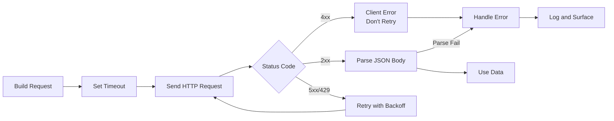

## Overview

Most apps talk to other services over HTTP at some point. A REST API call is just an
HTTP request — usually `GET` or `POST` — to a URL, plus the JSON response. The part
that tends to break is the safety layer: status codes, timeouts, and parsing the body
without crashing.

I once spent two hours debugging a production outage that turned out to be a missing
`timeout` parameter. The payment service we called had a bad deploy, started hanging
on every request, and our workers piled up until the queue backed up and the whole
system ground to a halt. A single `timeout=10` would have contained the damage to a
few retry errors instead of a full outage.

This recipe walks through Python, JavaScript, Java, and Go so you can pick the right
client for your stack. Related recipes: [How to Document an API with OpenAPI, Swagger UI and Redoc](/recipes/api-documentation-openapi/).

## When to Use

Reach for this recipe when you need an app to talk to another service over HTTP:

- Fetching data from a third-party or internal API.
- Sending form data or events to a backend service.
- Integrating with SaaS platforms — payments, email, analytics.
- Building a client SDK or CLI that calls an HTTP service.
- Uploading files or polling for job status.

## When NOT to Use

- Real-time bidirectional communication: use [WebSockets](/recipes/websocket-server/)
  or [Server-Sent Events](/recipes/server-sent-events/) instead.
- Streaming huge payloads: consider a dedicated file transfer protocol or presigned
  URLs.

## Solution

### Python with `requests`

`requests` is the standard HTTP client in Python. Pass a `timeout` so the call won't
hang, and use `raise_for_status()` to throw on `4xx`/`5xx`. See the
[requests docs](https://docs.python-requests.org/en/latest/) for the full API.

```python
import requests

response = requests.get("https://api.example.com/users/1", timeout=10)
response.raise_for_status()

data = response.json()
print(data["name"])
```

### JavaScript with `fetch`

`fetch` works in modern browsers and Node.js 18+. It only rejects on network errors;
HTTP error responses still resolve, so check `response.ok` yourself. See the
[MDN fetch docs](https://developer.mozilla.org/en-US/docs/Web/API/fetch) for details.

```javascript
const response = await fetch("https://api.example.com/users/1");
if (!response.ok) {
  throw new Error(`HTTP ${response.status}`);
}

const data = await response.json();
console.log(data.name);
```

### Java with `HttpClient`

Java 11 ships `java.net.http.HttpClient`. It supports both sync and async requests and
handles HTTP/2 transparently. See the
[HttpClient docs](https://docs.oracle.com/en/java/javase/11/api/java.net.http/java/net/http/HttpClient.html).

```java
import java.net.URI;
import java.net.http.*;

HttpClient client = HttpClient.newHttpClient();
HttpRequest request = HttpRequest.newBuilder()
    .uri(URI.create("https://api.example.com/users/1"))
    .GET()
    .build();

HttpResponse<String> response =
    client.send(request, HttpResponse.BodyHandlers.ofString());

if (response.statusCode() >= 400) {
    throw new RuntimeException("HTTP " + response.statusCode());
}

System.out.println(response.body());
```

### Go with `net/http`

Go's standard library has a production-ready HTTP client. Close the response body to
avoid leaks, and use `context` for timeouts. See the
[net/http package docs](https://pkg.go.dev/net/http).

```go
package main

import (
    "context"
    "encoding/json"
    "fmt"
    "io"
    "net/http"
    "time"
)

func main() {
    ctx, cancel := context.WithTimeout(context.Background(), 10*time.Second)
    defer cancel()

    req, err := http.NewRequestWithContext(ctx, "GET", "https://api.example.com/users/1", nil)
    if err != nil {
        panic(err)
    }
    req.Header.Set("Accept", "application/json")

    resp, err := http.DefaultClient.Do(req)
    if err != nil {
        panic(err)
    }
    defer resp.Body.Close()

    if resp.StatusCode >= 400 {
        panic(fmt.Sprintf("HTTP %d", resp.StatusCode))
    }

    body, _ := io.ReadAll(resp.Body)
    var data map[string]interface{}
    json.Unmarshal(body, &data)
    fmt.Println(data["name"])
}
```

### POST with JSON and authentication

```python
import requests

headers = {
    "Authorization": f"Bearer {api_key}",
    "Accept": "application/json",
    "Content-Type": "application/json",
}

payload = {"name": "Alice", "email": "alice@example.com"}

response = requests.post(
    "https://api.example.com/users",
    json=payload,
    headers=headers,
    timeout=10,
)
response.raise_for_status()
created = response.json()
print(f"Created user with ID: {created['id']}")
```

### JavaScript with a timeout

```javascript
const controller = new AbortController();
const timeout = setTimeout(() => controller.abort(), 10000);

try {
  const response = await fetch("https://api.example.com/users/1", {
    signal: controller.signal,
    headers: { Accept: "application/json" },
  });
  if (!response.ok) throw new Error(`HTTP ${response.status}`);
  const data = await response.json();
  console.log(data.name);
} catch (err) {
  if (err.name === "AbortError") {
    console.error("Request timed out");
  } else {
    throw err;
  }
} finally {
  clearTimeout(timeout);
}
```

## Explanation

Every example follows the same four steps:

1. Build the request (URL, method, headers, body).
2. Set a timeout so a slow or broken server can't block the client.
3. Send the request and check the status code.
4. Parse the body as JSON and handle parse errors.

`raise_for_status()` in Python and `response.ok` in JavaScript throw on HTTP errors.
Java and Go make you check the status code yourself. To turn JSON into typed data, see
[Parse JSON](/recipes/parse-json/).



### Status codes and when to retry

Not every error deserves a retry. `4xx` codes mean *you* did something wrong — bad
URL, missing auth, invalid payload — so retrying won't help. `5xx` codes mean the
*server* is struggling, and a retry with backoff might get through. The one exception
is `429 Too Many Requests`: the server is telling you to slow down, so respect the
`Retry-After` header and try again. I've seen teams retry `401 Unauthorized` in a
loop because their token expired, generating thousands of failed requests against
their own auth server in under a minute.

### Timeouts are not optional

Every HTTP client in this recipe supports timeouts, but none enable them by default.
Python `requests` waits forever if you don't pass `timeout=`. JavaScript `fetch` needs
an `AbortController`. Java's `HttpClient` has a default connect timeout but no read
timeout unless you set one. Go's `net/http` client uses whatever `context` you pass.
Always set both a connect timeout (how long to establish the TCP connection) and a
read timeout (how long to wait for the response body). Ten seconds is a reasonable
starting point for most APIs; adjust based on your SLA.

### Connection pooling and client reuse

Creating a new HTTP client per request wastes TCP connections and adds latency. In
Python, use a `requests.Session` to reuse connections. In Go, `http.Client` is safe
for concurrent use — create one and reuse it. In Java, `HttpClient` is thread-safe
— share one instance across your app. In JavaScript, `fetch` manages connections
through the browser or Node's undici layer, but you can use a custom `Agent` with
`keepAlive: true` in Node.js. See the [Python requests docs](https://docs.python-requests.org/en/latest/user/advanced/#session-objects)
for session usage and the [Go net/http docs](https://pkg.go.dev/net/http) for client
configuration.

### Error handling beyond status codes

A `200 OK` doesn't guarantee the response body is valid JSON. During an outage, a
load balancer or CDN might return an HTML error page with a `200` status — I've seen
this with Cloudflare and AWS ALB. Always wrap `.json()` parsing in a try/catch and
check the `Content-Type` header if you're unsure. For production systems, log the
response body on parse errors — it's the fastest way to debug "unexpected token < in
JSON" errors that only happen at 3 AM.

## Variants

|Language|Client|Async support|Notes|
|--------|------|-------------|-----|
|Python|`requests` / `httpx`|`httpx` for async|`requests` is sync-only|
|JavaScript|`fetch` (built-in)|native promises|check `response.ok`|
|Java|`HttpClient` (Java 11+)|`sendAsync`|no extra dependency|
|Go|`net/http` (built-in)|goroutines|close response body|
|Rust|`reqwest`|`tokio` runtime|popular, ergonomic|
|C#|`HttpClient` (built-in)|`async/await`|reuse single instance|

## Best Practices

- Set a timeout so a hung request can't block the worker forever.
- Check status codes explicitly; don't assume `2xx`.
- Reuse clients or sessions to benefit from connection pooling and keep-alive.
- Send `Accept: application/json` when you expect JSON and
  `Content-Type: application/json` when you send a JSON body.
- Read API keys from environment variables; never commit them.
- Retry `429` and `5xx` with exponential backoff and respect `Retry-After` headers.
- Wrap `.json()` parsing in a try/catch; a server may return HTML instead of JSON
  during an outage.
- Log the response body on parse errors. You'll thank yourself at 3 AM when a
  load balancer returns an HTML error page with a `200` status and your parser
  crashes with "unexpected token <".
- Set a `User-Agent` header with your app name and contact info. API providers can
  identify your traffic and reach out before rate-limiting — I've gotten warning
  emails from Stripe and GitHub just because we set a descriptive `User-Agent`.

## Common Mistakes

- **Forgetting `response.ok` in `fetch`**: a `404` still resolves the promise, so check
  the status manually.
- **No timeout**: the default in many clients is infinite, which can exhaust workers.
- **Hardcoding credentials**: keep tokens out of source code and logs.
- **Ignoring rate limits**: respect `Retry-After` so the API doesn't throttle or ban you.
- **Not closing response bodies** in Go and Java: this leaks connections and can
  exhaust file descriptors.
- **Sending sensitive data in query parameters**: URLs appear in logs, so put tokens in
  headers or POST bodies.
- **Retrying `4xx` errors**: I've seen teams retry `401 Unauthorized` in a loop
  because their token expired. It won't fix itself — you'll just generate thousands
  of failed requests against your auth server. Fix the token, then retry.

## FAQ

### Does `fetch` throw on a 404?

No. `fetch` only rejects on network failures. A `404` resolves normally, so check
`response.ok` or `response.status` before reading the body.

### Do I need an external library to call HTTP APIs in Java?

No. Java 11 ships with `java.net.http.HttpClient`, which supports sync and async
requests. For older Java versions, use Apache HttpClient or OkHttp.

### How do I send JSON in a POST request?

Set `Content-Type: application/json` and pass the serialized JSON as the body. In
Python, use `requests.post(url, json=payload)`; in JavaScript, pass a stringified
object.

### How do I cancel a long-running request?

Use `AbortController` in JavaScript, the `timeout` parameter in Python `requests`, or
`HttpRequest.timeout()` in Java.

### Should I use GET or POST for search queries?

Use GET for idempotent, cacheable lookups when the parameters fit in the URL. Use POST
for large payloads, sensitive data, or non-idempotent operations.

### How do I handle API pagination?

REST APIs usually use offset/limit (`?page=2&limit=20`), cursor-based
(`?cursor=abc123`), or `Link` headers. Check the API docs to find the pattern and loop
until no more pages come back.

### What status codes should I retry?

Retry `429`, `500`, `502`, `503`, and `504` with exponential backoff. Don't retry
`400`, `401`, `403`, `404`, or `422` — those are client errors that won't succeed on
retry.

## See Also

- [Python requests documentation](https://docs.python-requests.org/en/latest/) — the
  full API reference for the `requests` library, including sessions, auth, and
  streaming.
- [MDN: Using Fetch](https://developer.mozilla.org/en-US/docs/Web/API/Fetch_API/Using_Fetch)
  — browser and Node.js fetch API, including streaming, aborting, and credentials.
- [Java HttpClient guide](https://docs.oracle.com/en/java/javase/11/api/java.net.http/java/net/http/HttpClient.html)
  — sync and async HTTP/2 client shipped with Java 11+.
- [Go net/http package](https://pkg.go.dev/net/http) — production-ready HTTP client
  and server in Go's standard library.
- [Parse JSON](/recipes/parse-json/) — how to parse, validate, and handle JSON
  responses safely across languages.
