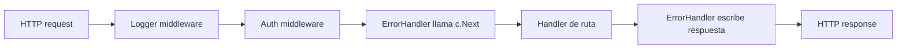

## Visión General

La mayoría de las APIs en Go empiezan como un par de `http.HandleFunc` y después
se convierten en un desastre silencioso: el mismo chequeo de auth copiado en
cada handler, respuestas de error que cambian en cada ruta y lógica de
middleware esparcida en cualquier lado. Gin te da una salida limpia: un router
rápido más una cadena de middleware que podés testear por separado.

En esta receta armo la configuración a la que recurro cuando necesito una API en
Go chica que se comporte como un servicio real: logging de requests, auth por
token, validación de JSON, errores estructurados y graceful shutdown. El código
está separado en archivos pequeños para que puedas meter las piezas en tu
propio proyecto, y hay un companion ejecutable en el repo
[stack-practices-resources](https://mathiaspaulenko.github.io/stack-practices-resources/)
si querés evitar el copiar y pegar.

## Cuándo Usar

- Usá Gin cuando querés un router rápido y middleware reusable, no un framework
  que lo haga todo. Yo lo usé para servicios internos y APIs públicas donde
  necesitaba baja latencia sin tanto ritual.
- Usalo cuando las preocupaciones transversales como logging, auth y métricas
deben correr antes de cada ruta en lugar de copiarse en cada handler.
- Es un buen fit cuando la API sirve a SPAs, clientes móviles u otros backends.
  Consultá [Llamar REST API](/recipes/call-rest-api/) para patrones de cliente.
- Evitalo si estás armando un solo `http.HandleFunc` detrás de un load balancer
  y no necesitás middleware. Para esos casos, `net/http` con un router mínimo
  alcanza y te deja la lista de dependencias más corta.

## Solución

### Setup básico del servidor

```go
// main.go
package main

import (
    "log"
    "net/http"

    "github.com/gin-gonic/gin"
    "example.com/go-rest-api-gin/handlers"
    "example.com/go-rest-api-gin/middleware"
    "example.com/go-rest-api-gin/server"
)

func main() {
    gin.SetMode(gin.ReleaseMode)

    r := gin.New()
    r.Use(middleware.Logger(), gin.Recovery(), middleware.ErrorHandler())

    api := r.Group("/api/v1")
    api.Use(middleware.AuthRequired())
    {
        api.GET("/users", handlers.ListUsers)
        api.GET("/users/:id", handlers.GetUser)
        api.POST("/users", handlers.CreateUser)
        api.GET("/health", handlers.Health)
    }

    if err := server.RunWithGracefulShutdown(r, ":8080"); err != nil {
        log.Fatalf("server shutdown: %s", err)
    }
}
```

### Middleware custom

```go
// middleware/logger.go
package middleware

import (
    "log"
    "time"

    "github.com/gin-gonic/gin"
)

func Logger() gin.HandlerFunc {
    return func(c *gin.Context) {
        start := time.Now()
        path := c.Request.URL.Path

        c.Next()

        latency := time.Since(start)
        status := c.Writer.Status()
        log.Printf("[%s] %s %d %v", c.Request.Method, path, status, latency)
    }
}
```

```go
// middleware/auth.go
package middleware

import (
    "net/http"

    "github.com/gin-gonic/gin"
)

func AuthRequired() gin.HandlerFunc {
    return func(c *gin.Context) {
        token := c.GetHeader("Authorization")
        if token == "" {
            c.AbortWithStatusJSON(http.StatusUnauthorized, gin.H{"error": "missing token"})
            return
        }
        c.Set("user", token)
        c.Next()
    }
}
```

### Validación de requests

```go
// handlers/user.go
package handlers

import (
    "net/http"

    "github.com/gin-gonic/gin"
    "example.com/go-rest-api-gin/middleware"
)

type CreateUserRequest struct {
    Name  string `json:"name" binding:"required,min=2,max=50"`
    Email string `json:"email" binding:"required,email"`
    Age   int    `json:"age" binding:"gte=0,lte=150"`
}

func ListUsers(c *gin.Context) {
    c.JSON(http.StatusOK, gin.H{"users": []string{"alice", "bob"}})
}

func GetUser(c *gin.Context) {
    id := c.Param("id")
    c.JSON(http.StatusOK, gin.H{"id": id})
}

func CreateUser(c *gin.Context) {
    var req CreateUserRequest
    if err := c.ShouldBindJSON(&req); err != nil {
        c.Error(&middleware.APIError{Code: "validation_failed", Message: err.Error(), Status: http.StatusBadRequest})
        return
    }

    // Reemplazá con tu lógica real de persistencia.
    user := gin.H{"id": 1, "name": req.Name, "email": req.Email, "age": req.Age}
    c.JSON(http.StatusCreated, user)
}

func Health(c *gin.Context) {
    c.JSON(http.StatusOK, gin.H{"status": "healthy"})
}
```

### Manejo estructurado de errores

```go
// middleware/error.go
package middleware

import (
    "net/http"

    "github.com/gin-gonic/gin"
)

type APIError struct {
    Code    string `json:"code"`
    Message string `json:"message"`
    Status  int    `json:"-"`
}

func (e *APIError) Error() string { return e.Message }

func ErrorHandler() gin.HandlerFunc {
    return func(c *gin.Context) {
        c.Next()

        if len(c.Errors) == 0 {
            return
        }

        err := c.Errors.Last().Err
        if apiErr, ok := err.(*APIError); ok {
            c.JSON(apiErr.Status, apiErr)
            return
        }
        c.JSON(http.StatusInternalServerError, gin.H{"error": "internal error"})
    }
}
```

Adjuntá errores al contexto con `c.Error(err)` en handlers o middleware. El error
handler corre después de `c.Next()` y escribe una respuesta consistente.

### Graceful shutdown

```go
// server/server.go
package server

import (
    "context"
    "log"
    "net/http"
    "os"
    "os/signal"
    "syscall"
    "time"

    "github.com/gin-gonic/gin"
)

func RunWithGracefulShutdown(router *gin.Engine, addr string) error {
    srv := &http.Server{
        Addr:    addr,
        Handler: router,
    }

    go func() {
        if err := srv.ListenAndServe(); err != nil && err != http.ErrServerClosed {
            log.Fatalf("listen: %s", err)
        }
    }()

    quit := make(chan os.Signal, 1)
    signal.Notify(quit, syscall.SIGINT, syscall.SIGTERM)
    <-quit

    ctx, cancel := context.WithTimeout(context.Background(), 5*time.Second)
    defer cancel()
    return srv.Shutdown(ctx)
}
```

## Explicación

Gin mantiene el procesamiento de requests rápido porque construye un árbol
radix para las rutas y reusa buffers para JSON. La verdadera ventaja, sin
embargo, es la cadena de middleware: cada request pasa por los handlers
registrados en orden, y cada uno decide si sigue con `c.Next()` o se frena con
`c.Abort()`.

Este es el ciclo de vida que tengo en mente cuando armo un servicio con Gin:



El paquete `binding` valida y llena una struct desde JSON. Te ahorra mucho
boilerplate de `json.Unmarshal`, pero solo chequea que la forma del input sea la
correcta. No te va a decir si un email ya está en uso o si un usuario supera una
cuota de negocio. Siempre agregá validación propia después del binding.

El error handler se sienta al final de la cadena. Cuando un handler o middleware
adjunta un error con `c.Error(err)`, Gin lo acumula en `c.Errors`. Después de
que el handler retorna, el middleware de errores revisa esa lista y escribe un
único JSON consistente. Esto evita llamar `c.JSON` dos veces y evita que los
clientes vean strings de error crudos de Go.

El graceful shutdown envuelve el `http.Server` de la librería estándar. Iniciá
el server en una goroutine, esperá `SIGINT` o `SIGTERM` y después das a los
requests en vuelo un presupuesto de tiempo para terminar. Yo suelo poner ese
presupuesto en cinco segundos; más que eso y el orquestador termina matando el
contenedor igual.

## Variantes

### Route groups con rate limiting

Usá esta variante cuando querés proteger un subconjunto de rutas o toda la API
contra un pico de tráfico. Para una sola instancia, mantené un limiter por IP de
cliente; para un despliegue distribuido, mové el estado a Redis y agregá un
header `Retry-After` en las respuestas `429`.

```go
import "golang.org/x/time/rate"

func RateLimiter(rps float64, burst int) gin.HandlerFunc {
    limiter := rate.NewLimiter(rate.Limit(rps), burst)
    return func(c *gin.Context) {
        if !limiter.Allow() {
            c.AbortWithStatusJSON(http.StatusTooManyRequests, gin.H{"error": "rate limit exceeded"})
            return
        }
        c.Next()
    }
}

api := r.Group("/api/v1")
api.Use(RateLimiter(10, 20))
```

Para una implementación distribuida consultá
[Rate Limiting with Redis](/recipes/api-rate-limiting-redis/).

### CORS

El snippet de abajo permite un origen conocido, los métodos HTTP comunes y
credentials. Yo suelo agregar `OPTIONS` y `PATCH` a `AllowMethods` para no tener
que volver más tarde cuando un frontend empiece a usarlos.

```go
import "github.com/gin-contrib/cors"

r.Use(cors.New(cors.Config{
    AllowOrigins:     []string{"https://yourdomain.com"},
    AllowMethods:     []string{"GET", "POST", "PUT", "PATCH", "DELETE", "OPTIONS"},
    AllowHeaders:     []string{"Origin", "Content-Type", "Authorization"},
    AllowCredentials: true,
    MaxAge:           12 * time.Hour,
}))
```

### Cuándo elegir `gin.New()` sobre `gin.Default()`

| Setup | Middleware incluido | Mejor para |
| --- | --- | --- |
| `gin.Default()` | Logger + Recovery | Prototipos, servicios pequeños |
| `gin.New()` | Ninguno | Servicios en producción con logging, manejo de errores y auth custom |

`gin.Default()` agrega el logger y recovery por defecto. Yo suelo recurrir a
`gin.New()` cuando quiero controlar el orden y elegir mi propio logger. Si
querés un prototipo rápido, `gin.Default()` está bien; acordate de que su logger
incorporado puede entrar en conflicto con el que agregués después.

## Mejores Prácticas

- En producción siempre llamo `gin.SetMode(gin.ReleaseMode)` para que Gin deje
de imprimir debug output y logs con colores a stdout.
- Uso `gin.New()` cuando quiero elegir el orden exacto de los middleware.
  `gin.Default()` está bien para prototipos, pero ya incluye un logger y
  recovery que pueden chocar con los custom.
- Para logging cambio el paquete `log` de la librería estándar por `zap` o
  `zerolog`. Los logs estructurados son mucho más fáciles de mandar a ELK,
  Datadog o CloudWatch.
- Mantené cada middleware enfocado. Yo escribo uno para logging, otro para
  auth, otro para errores. Mezclar responsabilidades hace los tests
  complicados.
- Devolvé errores tipados desde los servicios y dejá que el middleware de
  errores decida el formato JSON final.
- Cuando hagas load tests, mirá los percentiles p95 y p99, no el promedio. El
  promedio oculta los requests lentos que los usuarios sí notan.

## Errores Comunes

- Usar `gin.Default()` y después agregar middleware de logger o recovery custom.
  Los built-in siguen corriendo, así que podés loggear el mismo request dos
  veces o recuperar un panic que querías manejar vos.
- Olvidar `c.Next()` en el middleware, de modo que el handler nunca corre.
- Llamar `c.Abort()` sin escribir una respuesta, dejando al cliente colgado
  hasta que le de timeout.
- Mantener una conexión a base de datos dentro del context sin un pool de
  conexiones. El pool espera que le devuelvan la conexión mientras el request
  termina.
- Confiar solo en la validación del binding para reglas de negocio. Solo
  chequea la forma; no va a detectar duplicados, límites de cuota o chequeos de
  autorización.
- Devolver errores crudos de Go a los clientes en lugar de un objeto de error
  estructurado. El cliente no puede parsear `pq: duplicate key` o `sql: no
  rows`; sí puede parsear `{"code":"..."}`.

## Preguntas Frecuentes

### ¿Qué agrega Gin sobre el paquete estándar `net/http`?

Gin agrega routing, middleware, binding de requests y recuperación de panics con
mínimo overhead. Para APIs muy pequeñas, `net/http` con un router como `chi`
también es suficiente.

### ¿Puedo usar Gin con gRPC?

Sí. Podés correr servidores gRPC y HTTP lado a lado, o usar `grpc-gateway` para
exponer endpoints HTTP generados desde definiciones protobuf.

### ¿Cómo estructuro una aplicación Gin grande?

Agrupá rutas por dominio con `gin.RouterGroup`. Mantené archivos de rutas por
dominio (`routes/users.go`, `routes/orders.go`) y registrá todo en `main.go`.
Pasá las dependencias a los handlers a través de una struct en lugar de variables
globales, y usá repositorios basados en interfaces para que los handlers sean
fáciles de testear.

### ¿Cuándo uso `ShouldBindJSON` en lugar de `BindJSON`?

Usá `ShouldBindJSON` cuando querés manejar el error vos mismo. Devuelve un error
en lugar de escribir directamente una respuesta `400`, lo que te da control sobre
el formato JSON.

### ¿Cuál es la forma más limpia de manejar errores en Gin?

Definí un tipo de error pequeño con `code` y `message`, devolvelo desde los
servicios, adjuntalo con `c.Error()` y dejá que un middleware de errores escriba
el JSON final. Logueá el error original con un request ID para tracing.

### ¿Cómo testeo handlers de Gin sin levantar un server?

Usá `httptest.NewRecorder()` y `router.ServeHTTP` para llamar handlers sin
levantar un server. Creá un router con dependencias mockeadas y asertá sobre el
status code, body y headers.

### ¿Cómo implemento rate limiting para un sistema distribuido?

Usá un token bucket como `golang.org/x/time/rate` como middleware. Para una sola
instancia, un limiter por IP de cliente funciona. Para sistemas distribuidos,
usá un limiter respaldado en Redis e incluí un header `Retry-After` en las
respuestas `429`.

### ¿Por qué usar `gin.New()` en lugar de `gin.Default()`?

Usá `gin.New()` cuando querés controlar exactamente qué middleware corre y en qué
orden. `gin.Default()` está bien para prototipos rápidos porque ya incluye
middleware de logger y recovery.

### ¿Cómo uso Gin con OpenAPI/Swagger?

Usá `swaggo/swag` para generar docs OpenAPI desde anotaciones. Agregá comentarios
`@Summary`, `@Param` y `@Router` arriba de cada handler, ejecutá `swag init` y
serví la UI con `ginSwagger`. Mantené las anotaciones sincronizadas con las
signatures de los handlers.

### ¿Cómo aseguro rutas con JWT?

Extraé el token del header `Authorization: Bearer <token>`, validalo con una
librería JWT y guardá el user ID en el contexto con `c.Set()`. Devolvé `401`
cuando el token falta, es inválido o expiró.

### ¿Cuál es la diferencia entre `/health` y `/health/ready`?

`/health` es un liveness check liviano. `/health/ready` es un readiness check
que hace ping a bases de datos o servicios externos y devuelve `503` si alguna
dependencia está caída.

## Ver También

La [documentación de Gin](https://gin-gonic.com/docs/) es la referencia oficial.
El [paquete `net/http` de Go](https://pkg.go.dev/net/http) cubre los primitivos del server.
[golang.org/x/time/rate](https://pkg.go.dev/golang.org/x/time/rate) explica el rate limiting con token bucket.
Para agregados de Gin, consultá el [middleware CORS](https://github.com/gin-contrib/cors) y el
[generador OpenAPI Swaggo](https://github.com/swaggo/swag). Si querés exponer gRPC sobre HTTP, mirá
[gRPC-Gateway](https://github.com/grpc-ecosystem/grpc-gateway).
