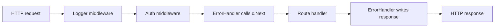

## Overview

Most Go APIs start as a few `http.HandleFunc` calls and then quietly turn into a
mess: the same auth check pasted into every handler, error responses that look
different on every route, and middleware logic that lives God-knows-where. Gin
gives you a clean way out: a fast router plus a middleware chain you can test in
isolation.

In this recipe I put together the setup I reach for when I need a small Go API
that behaves like a real service: request logging, token auth, JSON validation,
structured errors, and a graceful shutdown. The code is split into small files
so you can drop the pieces into your own project, and there's a runnable
companion project in the [stack-practices-resources](https://mathiaspaulenko.github.io/stack-practices-resources/)
repo if you want to skip the copy-paste.

## When to Use

- Reach for Gin when you want a fast router and reusable middleware, not a
  kitchen-sink framework. I have used it for internal services and public APIs
  where I need low latency without the ceremony.
- I also use Gin when the same concerns (logging, auth, metrics) need to run
  before every route. Copying them into each handler gets old fast.
- It fits well when the API serves SPAs, mobile clients, or other backends.
  See [Call REST API](/recipes/call-rest-api/) for client patterns.
- Skip Gin if you're building a single `http.HandleFunc` behind a load balancer
  and don't need middleware. For those cases, `net/http` with a minimal router
  is enough and keeps your dependency list shorter.

## Solution

### Basic server setup

```go
// main.go
package main

import (
    "log"
    "net/http"

    "github.com/gin-gonic/gin"
    "example.com/go-rest-api-gin/handlers"
    "example.com/go-rest-api-gin/middleware"
    "example.com/go-rest-api-gin/server"
)

func main() {
    gin.SetMode(gin.ReleaseMode)

    r := gin.New()
    r.Use(middleware.Logger(), gin.Recovery(), middleware.ErrorHandler())

    api := r.Group("/api/v1")
    api.Use(middleware.AuthRequired())
    {
        api.GET("/users", handlers.ListUsers)
        api.GET("/users/:id", handlers.GetUser)
        api.POST("/users", handlers.CreateUser)
        api.GET("/health", handlers.Health)
    }

    if err := server.RunWithGracefulShutdown(r, ":8080"); err != nil {
        log.Fatalf("server shutdown: %s", err)
    }
}
```

### Custom middleware

```go
// middleware/logger.go
package middleware

import (
    "log"
    "time"

    "github.com/gin-gonic/gin"
)

func Logger() gin.HandlerFunc {
    return func(c *gin.Context) {
        start := time.Now()
        path := c.Request.URL.Path

        c.Next()

        latency := time.Since(start)
        status := c.Writer.Status()
        log.Printf("[%s] %s %d %v", c.Request.Method, path, status, latency)
    }
}
```

```go
// middleware/auth.go
package middleware

import (
    "net/http"

    "github.com/gin-gonic/gin"
)

func AuthRequired() gin.HandlerFunc {
    return func(c *gin.Context) {
        token := c.GetHeader("Authorization")
        if token == "" {
            c.AbortWithStatusJSON(http.StatusUnauthorized, gin.H{"error": "missing token"})
            return
        }
        c.Set("user", token)
        c.Next()
    }
}
```

### Request validation

```go
// handlers/user.go
package handlers

import (
    "net/http"

    "github.com/gin-gonic/gin"
    "example.com/go-rest-api-gin/middleware"
)

type CreateUserRequest struct {
    Name  string `json:"name" binding:"required,min=2,max=50"`
    Email string `json:"email" binding:"required,email"`
    Age   int    `json:"age" binding:"gte=0,lte=150"`
}

func ListUsers(c *gin.Context) {
    c.JSON(http.StatusOK, gin.H{"users": []string{"alice", "bob"}})
}

func GetUser(c *gin.Context) {
    id := c.Param("id")
    c.JSON(http.StatusOK, gin.H{"id": id})
}

func CreateUser(c *gin.Context) {
    var req CreateUserRequest
    if err := c.ShouldBindJSON(&req); err != nil {
        c.Error(&middleware.APIError{Code: "validation_failed", Message: err.Error(), Status: http.StatusBadRequest})
        return
    }

    // Replace with actual persistence logic.
    user := gin.H{"id": 1, "name": req.Name, "email": req.Email, "age": req.Age}
    c.JSON(http.StatusCreated, user)
}

func Health(c *gin.Context) {
    c.JSON(http.StatusOK, gin.H{"status": "healthy"})
}
```

### Structured error handling

```go
// middleware/error.go
package middleware

import (
    "net/http"

    "github.com/gin-gonic/gin"
)

type APIError struct {
    Code    string `json:"code"`
    Message string `json:"message"`
    Status  int    `json:"-"`
}

func (e *APIError) Error() string { return e.Message }

func ErrorHandler() gin.HandlerFunc {
    return func(c *gin.Context) {
        c.Next()

        if len(c.Errors) == 0 {
            return
        }

        err := c.Errors.Last().Err
        if apiErr, ok := err.(*APIError); ok {
            c.JSON(apiErr.Status, apiErr)
            return
        }
        c.JSON(http.StatusInternalServerError, gin.H{"error": "internal error"})
    }
}
```

Attach errors to the context with `c.Error(err)` in handlers or middleware. The
error handler runs after `c.Next()` and writes a consistent response.

### Graceful shutdown

```go
// server/server.go
package server

import (
    "context"
    "net/http"
    "os"
    "os/signal"
    "syscall"
    "time"

    "github.com/gin-gonic/gin"
)

func RunWithGracefulShutdown(router *gin.Engine, addr string) error {
    srv := &http.Server{
        Addr:    addr,
        Handler: router,
    }

    go func() {
        if err := srv.ListenAndServe(); err != nil && err != http.ErrServerClosed {
            log.Fatalf("listen: %s", err)
        }
    }()

    quit := make(chan os.Signal, 1)
    signal.Notify(quit, syscall.SIGINT, syscall.SIGTERM)
    <-quit

    ctx, cancel := context.WithTimeout(context.Background(), 5*time.Second)
    defer cancel()
    return srv.Shutdown(ctx)
}
```

## Explanation

Gin keeps request processing fast because it builds a radix tree for routes and
reuses buffers for JSON. What I like most, though, is the middleware chain. Every request walks through
the registered handlers in order, and each one decides whether to keep going
with `c.Next()` or stop with `c.Abort()`.

Here is the lifecycle I keep in mind when I wire a Gin service:



The `binding` package validates and populates a struct from JSON. It saves a lot
of `json.Unmarshal` boilerplate, but only the shape of the input. It won't spot a
duplicate email or a quota violation for you. Those checks belong in your own
validation layer.

The error handler sits at the end of the chain and inspects `c.Errors` after the
handler returns. When a handler or middleware attaches an error with `c.Error(err)`,
Gin collects it in `c.Errors` and the error middleware writes one consistent JSON
body. This stops you from calling `c.JSON` twice and keeps clients from
seeing raw Go error strings.

Graceful shutdown is just the standard library `http.Server` wrapped around
`gin.Engine`. Start it in a goroutine, wait for `SIGINT` or `SIGTERM`, then give
in-flight requests a budget to finish. I usually set that budget to five seconds;
anything longer and the orchestrator will kill the container anyway.

## Variants

### Route groups with rate limiting

I add rate limiting when I want to protect a subset of routes or the whole API
from a sudden burst of traffic. For a single instance, keep a limiter per client
IP; for a distributed deployment, move the state to Redis and add a `Retry-After`
header on `429` responses.

```go
import "golang.org/x/time/rate"

func RateLimiter(rps float64, burst int) gin.HandlerFunc {
    limiter := rate.NewLimiter(rate.Limit(rps), burst)
    return func(c *gin.Context) {
        if !limiter.Allow() {
            c.AbortWithStatusJSON(http.StatusTooManyRequests, gin.H{"error": "rate limit exceeded"})
            return
        }
        c.Next()
    }
}

api := r.Group("/api/v1")
api.Use(RateLimiter(10, 20))
```

For a distributed implementation see [Rate Limiting with Redis](/recipes/api-rate-limiting-redis/).

### CORS

The snippet below allows a known origin, the common HTTP methods, and
credentials. I usually add `OPTIONS` and `PATCH` to `AllowMethods` so I don't
have to come back later when a frontend starts using them.

```go
import "github.com/gin-contrib/cors"

r.Use(cors.New(cors.Config{
    AllowOrigins:     []string{"https://yourdomain.com"},
    AllowMethods:     []string{"GET", "POST", "PUT", "PATCH", "DELETE", "OPTIONS"},
    AllowHeaders:     []string{"Origin", "Content-Type", "Authorization"},
    AllowCredentials: true,
    MaxAge:           12 * time.Hour,
}))
```

### When to pick `gin.New()` over `gin.Default()`

| Setup | Middleware included | Best for |
| --- | --- | --- |
| `gin.Default()` | Logger + Recovery | Prototypes, small services |
| `gin.New()` | None | Production services with custom logging, error handling, and auth |

`gin.Default()` attaches the default logger and recovery. I used to reach for
`gin.New()` whenever I wanted to control the order and choose my own logger.
For quick prototypes I use `gin.Default()`. The catch is that its built-in logger
often collides with the custom one I add later.

## Best Practices

- In production I always call `gin.SetMode(gin.ReleaseMode)` so Gin stops
  printing debug output and colored logs to stdout.
- I use `gin.New()` when I want to choose the exact middleware order;
  `gin.Default()` is fine for prototypes, but I avoid it in production because
  the built-in logger can step on my own.
- For logging I swap the standard library `log` package for `zap` or `zerolog`.
  Structured logs are much easier to ship to ELK, Datadog, or CloudWatch.
- I keep each middleware focused: one logs, one authenticates, one formats
  errors. Mixing responsibilities makes unit tests painful.
- Return typed errors from services and let the error middleware decide the JSON
  shape.
- When load testing, I look at p95 and p99 latency, not the average. The average
  is a vanity metric; it hides the slow requests users actually notice.

## Common Mistakes

- Using `gin.Default()` and then adding a custom logger or recovery middleware.
  The built-ins will still run, so you may log the same request twice or recover
  a panic you wanted to handle yourself.
- If you forget `c.Next()` in custom middleware, the handler never runs and the
  client gets an empty `200 OK`.
- Calling `c.Abort()` without writing a response leaves the client hanging until
  it times out.
- Holding a database connection inside the Gin context without a connection pool
  leaves the pool waiting for the connection while the request is already done.
- Trusting `binding` validation for business rules is risky. It only checks that
  the input has the right shape, so duplicates, quota limits, and authorization
  checks still belong in your own validation.
- Returning raw Go errors to clients is unhelpful. Strings like `pq: duplicate
  key` or `sql: no rows` mean nothing to a client; a structured `{"code":"..."}` is
  what they can handle.

## FAQ

### What does Gin add over the standard `net/http` package?

Gin adds routing, middleware, request binding, and panic recovery with minimal
overhead. For very small APIs, `net/http` with a router like `chi` is also
sufficient.

### Can I use Gin with gRPC?

Yes. You can run gRPC and HTTP servers side by side, or use `grpc-gateway` to
expose HTTP endpoints generated from protobuf definitions.

### How should I structure a large Gin application?

Group routes by domain with `gin.RouterGroup`. Keep route files per domain
(`routes/users.go`, `routes/orders.go`) and register them in `main.go`. Pass
dependencies through a struct to handlers instead of global variables, and use
interface-based repositories so handlers stay testable.

### When should I use `ShouldBindJSON` instead of `BindJSON`?

I use `ShouldBindJSON` when I want to handle the error myself. It gives back an
error value instead of forcing a `400` response, so the JSON format is up to me.

### What is the cleanest way to handle errors in Gin?

I define a small error type with `code` and `message`, return it from services,
attach it with `c.Error()`, and let an error middleware write the final JSON. I
also log the original error with a request ID for tracing.

### How do I test Gin handlers without starting a server?

I use `httptest.NewRecorder()` and `router.ServeHTTP` to call handlers without
starting a server. I create a router with mocked dependencies and assert on the
status code, body, and headers.

### How do I implement rate limiting for a distributed system?

When I need rate limiting, I use a token bucket such as `golang.org/x/time/rate`
as middleware. On a single instance, a per-client-IP limiter is usually enough.
When I scale out, I move the state to Redis and include a `Retry-After` header
on `429` responses.

### Why should I use `gin.New()` instead of `gin.Default()`?

I pick `gin.New()` when I need full control over which middleware runs and in
what order. `gin.Default()` is fine for quick prototypes because it already
includes logger and recovery middleware.

### How do I use Gin with OpenAPI/Swagger?

I generate OpenAPI docs with `swaggo/swag` from annotations. I add `@Summary`,
`@Param`, and `@Router` comments above handlers, run `swag init`, and serve the
UI with `ginSwagger`. Keeping the annotations in sync with the handler
signatures is the part people forget.

### How do I secure routes with JWT?

I extract the token from the `Authorization: Bearer <token>` header, validate it
with a JWT library, and store the user ID in the context with `c.Set()`. I return
`401` whenever the token is missing, invalid, or expired.

### What is the difference between `/health` and `/health/ready`?

`/health` is a lightweight liveness check. `/health/ready` is a readiness check
that pings databases or downstream services and returns `503` if any dependency
is down.

## See Also

For the official reference, read the [Gin documentation](https://gin-gonic.com/docs/).
The [Go `net/http` package](https://pkg.go.dev/net/http) covers the server primitives.
[golang.org/x/time/rate](https://pkg.go.dev/golang.org/x/time/rate) explains the token-bucket limiter.
For Gin add-ons, see the [CORS middleware](https://github.com/gin-contrib/cors) and the
[Swaggo OpenAPI generator](https://github.com/swaggo/swag). If you want to expose gRPC over HTTP, check
[gRPC-Gateway](https://github.com/grpc-ecosystem/grpc-gateway).
