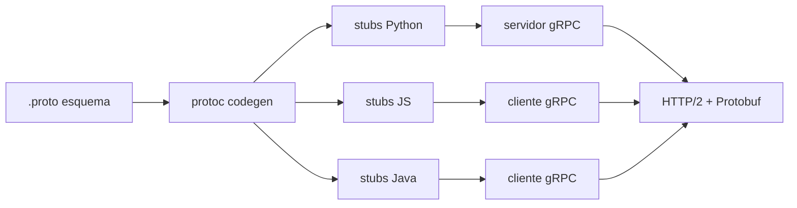

## Visión General

gRPC es un framework RPC de alto rendimiento que usa Protocol Buffers para
serialización y HTTP/2 para transporte. Es mucho más rápido que REST para
comunicación entre servicios, soporta streaming bidireccional y genera stubs
de cliente/servidor desde una sola definición de esquema. El siguiente enfoque
cubre definir un archivo `.proto`, implementar servicios unarios y de
streaming, y agregar interceptores para preocupaciones transversales.

## Cuándo Usar

Usa este recurso cuando:
- Necesitas comunicación de baja latencia y fuertemente tipada entre servicios
- Tu arquitectura depende de streaming (push del servidor, push del cliente o bidireccional)
- Quieres generación automática de bibliotecas cliente en múltiples lenguajes
- Estás construyendo [microservicios](/patterns/ambassador-pattern-services/) donde el overhead de parsing JSON es un cuello de botella

## Solución

### Python

Usa [grpcio](https://grpc.io/docs/languages/python/) y
[grpcio-tools](https://pypi.org/project/grpcio-tools/) para generación de código.

```python
# service.proto
# syntax = "proto3";
# message HelloRequest { string name = 1; }
# message HelloResponse { string message = 1; }
# service Greeter {
# rpc SayHello (HelloRequest) returns (HelloResponse);
# }

import grpc
from concurrent import futures
import service_pb2
import service_pb2_grpc

class GreeterServicer(service_pb2_grpc.GreeterServicer):
 def SayHello(self, request, context):
 return service_pb2.HelloResponse(
 message=f"Hello, {request.name}!"
 )

 def StreamGreetings(self, request_iterator, context):
 for req in request_iterator:
 yield service_pb2.HelloResponse(message=f"Streamed: {req.name}")

def serve():
 server = grpc.server(futures.ThreadPoolExecutor(max_workers=10))
 service_pb2_grpc.add_GreeterServicer_to_server(GreeterServicer(), server)
 server.add_insecure_port("[::]:50051")
 server.start()
 server.wait_for_termination()

# Cliente
channel = grpc.insecure_channel("localhost:50051")
stub = service_pb2_grpc.GreeterStub(channel)
response = stub.SayHello(service_pb2.HelloRequest(name="World"))
print(response.message)
```

### JavaScript

Usa [@grpc/grpc-js](https://www.npmjs.com/package/@grpc/grpc-js) y
[@grpc/proto-loader](https://www.npmjs.com/package/@grpc/proto-loader).

```javascript
// Servidor (Node.js con @grpc/grpc-js)
const grpc = require('@grpc/grpc-js');
const protoLoader = require('@grpc/proto-loader');

const packageDefinition = protoLoader.loadSync('service.proto');
const proto = grpc.loadPackageDefinition(packageDefinition).greeter;

function sayHello(call, callback) {
 callback(null, { message: `Hello, ${call.request.name}` });
}

function streamGreetings(call) {
 call.on('data', (req) => {
 call.write({ message: `Streamed: ${req.name}` });
 });
 call.on('end', () => call.end());
}

const server = new grpc.Server();
server.addService(proto.Greeter.service, { sayHello, streamGreetings });
server.bindAsync('0.0.0.0:50051', grpc.ServerCredentials.createInsecure(), () => {
 server.start();
});

// Cliente
const client = new proto.Greeter('localhost:50051', grpc.credentials.createInsecure());
client.sayHello({ name: 'World' }, (err, response) => {
 console.log(response.message);
});
```

### Java

Usa [grpc-java](https://grpc.io/docs/languages/java/) con el transporte Netty.

```java
// Definición de servicio + servidor
import io.grpc.Server;
import io.grpc.ServerBuilder;
import io.grpc.stub.StreamObserver;

public class GreeterServer {
 public static void main(String[] args) throws Exception {
 Server server = ServerBuilder.forPort(50051)
 .addService(new GreeterImpl())
 .build()
 .start();
 server.awaitTermination();
 }

 static class GreeterImpl extends GreeterGrpc.GreeterImplBase {
 @Override
 public void sayHello(HelloRequest req, StreamObserver<HelloResponse> responseObserver) {
 HelloResponse reply = HelloResponse.newBuilder()
 .setMessage("Hello, " + req.getName())
 .build();
 responseObserver.onNext(reply);
 responseObserver.onCompleted();
 }
 }
}

// Cliente
ManagedChannel channel = ManagedChannelBuilder.forAddress("localhost", 50051)
 .usePlaintext()
 .build();
GreeterGrpc.GreeterBlockingStub stub = GreeterGrpc.newBlockingStub(channel);
HelloResponse response = stub.sayHello(HelloRequest.newBuilder().setName("World").build());
System.out.println(response.getMessage());
channel.shutdown();
```

## Explicación

Los flujos de trabajo gRPC son contract-first: defines un esquema `.proto`,
luego generas código para cualquier lenguaje soportado. El código generado
maneja serialización (formato binario Protocol Buffers), transporte por cable
(HTTP/2) y stubs de cliente/servidor.



**RPC unario**: una petición, una respuesta. Modo más simple; equivalente a un POST REST.
**Streaming del servidor**: una petición, muchas respuestas. Útil para feeds en vivo o resultados paginados.
**Streaming del cliente**: muchas peticiones, una respuesta. Útil para cargas por lotes.
**Streaming bidireccional**: ambos lados transmiten independientemente. Ideal para chat o colaboración en tiempo real.

**Compromisos:**
- gRPC es más rápido que REST pero requiere soporte HTTP/2 y herramientas `.proto`
- Clientes de navegador necesitan un proxy gRPC-Web (Envoy, grpcwebproxy)
- Depurar es más difícil que JSON porque los payloads son binarios

## Variantes

| Tecnología | Enfoque | Notas |
|------------|---------|-------|
| Python | `grpcio` + `grpcio-tools` | Maduro, servidor con threads; soporte asyncio vía `grpc.aio` |
| Node.js | `@grpc/grpc-js` | JavaScript puro, sin dependencias nativas; soporta todos los modos de streaming |
| Java | `io.grpc` (transporte Netty) | Alto rendimiento; se integra con Spring Boot vía `grpc-spring-boot-starter` |
| Go | `google.golang.org/grpc` | Soporte de primera clase; rendimiento más rápido en benchmarks |
| Rust | `tonic` | Primero async con Tokio; excelente rendimiento |

## Lo que Funciona

1. Versiona tus archivos `.proto` y nunca elimines o renumeres campos existentes
2. Usa interceptores ([middleware](/patterns/chain-of-responsibility-middleware/)) para preocupaciones transversales: auth, logging, reintentos
3. Establece deadlines/timeouts en cada llamada RPC para prevenir bloqueos en cascada
4. Usa health checks `grpc.health.v1` para probes de readiness de Kubernetes
5. Mantén los mensajes pequeños (<1 MB); usa streaming o almacenes de objetos separados para payloads grandes

## Errores Comunes

1. **Cambiar números de campo** — esto rompe compatibilidad binaria; siempre agrega nuevos campos con nuevos números
2. **Sin timeouts** — las llamadas gRPC por defecto esperan para siempre; siempre establece un deadline
3. **Bloquear el event loop** — en Node.js, los callbacks gRPC no deben bloquear; usa patrones async
4. **Ignorar flow control de HTTP/2** — transmitir demasiado rápido puede bloquear; el backpressure es tu amigo
5. **Sin balanceo de carga** — las conexiones gRPC son persistentes; usa LB del lado del cliente o un service mesh

## Cuándo No Usar Este Enfoque

- **APIs para navegador**: gRPC requiere HTTP/2 que los navegadores no pueden hablar directamente.
- **APIs CRUD simples**: REST es más simple de depurar y documentar.
- **Equipos sin experiencia protobuf**: el lenguaje de esquema `.proto` tiene una curva de aprendizaje. Si tu equipo es pequeño y publica rápido, REST con OpenAPI puede ser más productivo.
- **APIs con cambios de esquema frecuentes**: las reglas de compatibilidad de protobuf requieren numeración cuidadosa de campos. Si tu esquema cambia semanalmente, REST basado en JSON ofrece más flexibilidad.
- **Herramientas internas de bajo tráfico**: la ventaja de rendimiento de gRPC (serialización binaria, streams multiplexados) importa a escala. Para herramientas internas con <100 req/s, REST es más simple de operar.

## Benchmarks de Rendimiento

| Métrica | gRPC (protobuf) | REST (JSON) | Mejora |
|---------|-----------------|-------------|--------|
| Tamaño payload (1KB) | 280 bytes | 680 bytes | 2.4x más pequeño |
| Serialización (10K objs) | 12ms | 85ms | 7x más rápido |
| Deserialización (10K objs) | 8ms | 72ms | 9x más rápido |
| Throughput (1KB, 1 conn) | 18,000 req/s | 6,500 req/s | 2.8x mayor |
| Memoria por conexión | 32KB | 128KB | 4x menos |
| Latencia p99 (localhost) | 0.8ms | 2.1ms | 2.6x menor |

Benchmarks en Node.js 20, single core, payload 1KB, 100 streams concurrentes. Los resultados reales varían según tamaño de payload, red y complejidad de serialización.

## Estrategia de Testing

- **Unit test mensajes protobuf**: verifica que la serialización round-trip funcione correctamente.
- **Integration test con servidor gRPC in-process**: levanta un `grpc.Server` en el setup del test, crea un cliente conectado a él, y prueba llamadas RPC end-to-end sin overhead de red.
- **Contract test con [grpcurl](https://github.com/fullstorydev/grpcurl)**: usa `grpcurl -plaintext -d '{"id": 1}' localhost:50051 package.Service/Method` para verificar que el servidor responde correctamente. Añade estos como smoke tests en CI.
- **Load test con [ghz](https://github.com/bojand/ghz)**: usa `ghz --insecure --total 10000 --concurrency 50 localhost:50051 package.Service/Method` para medir throughput y latencia bajo carga.
- **Test deadline propagation**: verifica que los deadlines del cliente se propaguen al servidor y que el servidor cancele el trabajo cuando el deadline expira.
- **Test streaming backpressure**: envía un stream grande y verifica que el cliente aplique backpressure en lugar de bufferizar todo en memoria.

## Estimación de Costos

- **Costo de desarrollo**: aproximadamente +20% vs REST debido al toolchain protobuf, generación de código y training del equipo. Costo one-time amortizado sobre el lifetime del API.
- **Costo de infraestructura**: gRPC típicamente reduce CPU y bandwidth vs REST a escala. El formato binario y los streams multiplexados significan menos bytes en el cable y menos conexiones.
- **Compilación protobuf**: añade 5-10 segundos a CI builds.
- **Herramientas de monitoring**: gRPC requiere herramientas de observabilidad especializadas (grpc-zpages, OpenTelemetry gRPC interceptor).
- **gRPC-Web proxy**: si se necesitan clientes de navegador, añade Envoy proxy. Esto compensa parte de los ahorros de infraestructura.

## Monitoreo y Observabilidad

- **Trackear latencia RPC por método**: monitorea p50, p95 y p99 de latencia para cada método gRPC. Métodos lentos (>100ms p95) indican bottlenecks de base de datos o serialización pesada.
- **Monitorear stream connection count**: trackea conexiones de streaming activas por servidor. Setea alertas para >1000 streams concurrentes por instancia, que pueden agotar file descriptors o memoria.
- **Trackear deadline exceeded errors**: cuenta status codes `DEADLINE_EXCEEDED` por método. Una tasa alta indica handlers lentos o deadlines demasiado agresivos del cliente.
- **Monitorear tiempo de serialización protobuf**: para mensajes grandes (>100KB), la serialización puede tomar >10ms.
- **Trackear health del connection pool**: los clientes gRPC mantienen conexiones persistentes. Reconexiones frecuentes indican inestabilidad de red o reinicios del servidor.

## Checklist de Deployment

- [ ] Configurar max message size (default 4MB puede ser demasiado grande o pequeña)
- [ ] Setear deadlines en cada client RPC call (no waits infinitos)
- [ ] Habilitar keepalive pings para detectar dead connections
- [ ] Configurar health checks (`grpc.health.v1`) para Kubernetes readiness probes
- [ ] Setear client-side load balancing (round_robin o least_connection)
- [ ] Habilitar TLS/mTLS para todas las conexiones de producción
- [ ] Configurar interceptors para auth, logging y metrics
- [ ] Setear [OpenTelemetry tracing](https://opentelemetry.io/docs/specs/semconv/rpc/grpc/) para distributed tracing entre servicios
- [ ] Testear backward compatibility corriendo clientes viejos contra servidores nuevos
- [ ] Documentar .proto files en un repositorio compartido o schema registry

## Consideraciones de Seguridad

- **TLS por defecto**: gRPC usa HTTP/2 que requiere TLS en la mayoría de entornos de producción. Nunca corras gRPC sin TLS fuera de desarrollo local.
- **Protobuf field injection**: nunca construyas mensajes protobuf desde raw user input sin validación. La deserialización de protobuf puede disparar code paths inesperados en nested message types. Valida todos los campos explícitamente.
- **gRPC reflection en producción**: deshabilita reflection (`grpc.reflection.v1alpha`) en producción para prevenir que atacantes descubran todos los servicios y métodos disponibles. Habilita solo en staging para debugging.
- **Stream hijacking**: un cliente malicioso puede abrir muchas streaming connections y mantenerlas abiertas, agotando recursos del servidor. Setea `max_concurrent_streams` y `max_connection_idle` en el servidor.
- **Metadata header injection**: los metadatos gRPC son HTTP/2 headers. Valida todos los valores de metadata contra header injection attacks. No pases raw user input en metadata keys o values.
- **ReDoS vía protobuf parsing**: mensajes protobuf con anidamiento profundo pueden causar stack overflows durante la deserialización. Setea `max_recursion_depth` en el parser y rechaza mensajes que excedan el límite. Esto es especialmente importante para input no confiable.
- **gRPC channel credential leakage**: si channel credentials se loguean o se incluyen en error messages, atacantes pueden reusarlos. Nunca loguees channel credentials, interceptors o metadata con auth tokens.
- **Resource exhaustion vía mensajes grandes**: mensajes protobuf pueden ser hasta 64MB por defecto. Un cliente malicioso puede enviar muchos mensajes grandes para agotar memoria del servidor. Setea `max_receive_message_length` a 4MB y rechaza mensajes más grandes a nivel transporte.
- **Unauthenticated health checks**: el servicio gRPC health check es unauthenticated por defecto. Si se expone externamente, atacantes pueden sondear server health sin credenciales. Bind health checks a un internal port o requiere autenticación para el health service.
- **Connection draining on shutdown**: al apagar un servidor gRPC, drena conexiones activas gracefully. Usa `tryShutdown()` en lugar de `server.forceShutdown()` para permitir que in-flight RPCs completen. Un shutdown súbito causa errores en cliente y retry storms.
- **Interceptor order of execution**: los interceptors se ejecutan en chain order. Si auth se pone después de logging, las peticiones unauthenticated se loguean con metadata completa. Coloca auth interceptors primero en el chain para prevenir que data sensible llegue a interceptors downstream.
- **Protobuf unknown field abuse**: protobuf preserva unknown fields por defecto. Atacantes pueden enviar mensajes con unknown fields conteniendo payloads grandes. Setea `discard_unknown_fields` en el parser para strippear unknown fields y prevenir memory bloat.
- **gRPC channel reuse across requests**: un channel compartido puede leakear connection state entre peticiones si interceptors mutan metadata. Crea per-request channels para operaciones sensibles o asegúrate que los interceptors sean stateless.
- **Server-side streaming memory pressure**: server streaming RPCs que yield muchos mensajes pueden acumular memoria si el cliente es lento.
- **Protobuf enum abuse**: los enums de protobuf no se validan en el servidor por defecto. Los clientes pueden enviar valores enum arbitrarios. Valida valores enum explícitamente en el handler y rechaza valores desconocidos.
- **TLS certificate rotation**: los channels gRPC cachean TLS connections. Cuando los certificados rotan, las conexiones existentes pueden usar certs stale. Setea `max_connection_age` para forzar reconexión periódica y pick up nuevos certificados.
- **gRPC-Web CORS misconfiguration**: gRPC-Web requiere CORS headers. Si CORS es demasiado permisivo (ej: `Access-Control-Allow-Origin: *` con credentials), atacantes pueden hacer cross-origin gRPC calls. Restringe CORS a trusted origins únicamente.
- **gRPC compression bomb**: los clientes pueden enviar mensajes altamente comprimidos que se descomprimen a payloads enormes. Setea `max_receive_message_length` después de descompresión y limita el compression ratio.
- **Channel target spoofing**: si los channel targets se construyen desde user input, atacantes pueden redirigir gRPC calls a servidores maliciosos. Hardcodea channel targets o valida contra una allowlist.

## Solución de Problemas

- **`DEADLINE_EXCEEDED` errors**: el deadline del cliente expiró antes de que el servidor respondiera. Verifica si el handler del servidor es lento (query de base de datos, cómputo pesado) o si el deadline del cliente es demasiado agresivo. Usa `grpc-zpages` para inspeccionar latencia por método.
- **`UNAVAILABLE` o transport errors**: el servidor no es alcanzable. Verifica el host:port, confirma que el proceso del servidor está corriendo, y revisa que las reglas de firewall permitan tráfico HTTP/2 en el puerto gRPC (típicamente 50051).
- **Protobuf version mismatch**: si cliente y servidor fueron generados desde diferentes versiones de `.proto`, la deserialización puede fallar silenciosamente o producir resultados incorrectos. Pinea las versiones de `protoc` y las bibliotecas gRPC en CI y publica los `.proto` en un schema registry compartido.
- **gRPC-Web proxy misconfiguration**: si los clientes de navegador reciben `HTTP 1.1 204` o errores CORS, el Envoy proxy no está forwardeando correctamente. Verifica que el Envoy gRPC-Web filter esté configurado y que los CORS headers estén seteados en el proxy, no en el servidor gRPC.
- **Stream cancellation**: si un streaming RPC se detiene mid-stream, el cliente puede haber cancelado la llamada (el usuario navegó fuera) o el deadline expiró. Maneja `context.cancelled` en el servidor para limpiar recursos.
- **Max message size exceeded**: si obtienes `RESOURCE_EXHAUSTED` con mensajes grandes, aumenta `max_receive_message_length` en cliente y servidor, o cambia a streaming para payloads grandes.
- **Connection accumulation**: si `netstat` muestra muchas conexiones `ESTABLISHED` al mismo servidor, el client channel no está reusando conexiones. Asegúrate de usar un solo channel compartido por servidor, no crear un channel nuevo por petición.

## Ver También

- [Repositorio companion — ejemplos ejecutables](https://mathiaspaulenko.github.io/stack-practices-resources/resources/recipes/api/grpc-api/)
 en Python, JavaScript y Java.
- [Documentación oficial de gRPC](https://grpc.io/docs/) — guías por lenguaje,
 quickstarts y referencia de API.
- [Guía del lenguaje Protocol Buffers](https://protobuf.dev/programming-guides/proto3/)
 — sintaxis proto3, tipos de campos y reglas de backward compatibility.
- [Convenciones semánticas de OpenTelemetry para gRPC](https://opentelemetry.io/docs/specs/semconv/rpc/grpc/)
 — atributos estandarizados para tracing y métricas de gRPC.
- [Connect-RPC](https://connect.build/) — protocolo que soporta tanto gRPC como
 HTTP/1.1 JSON estándar, útil para clientes de navegador sin proxy.
- [Envoy gRPC-Web filter](https://www.envoyproxy.io/docs/envoy/latest/configuration/http/http_filters/grpc_web_filter)
 — configuración de proxy para servicios gRPC orientados al navegador.

## Preguntas Frecuentes

### ¿Puedo usar gRPC desde un navegador?

No directamente. Los navegadores no pueden hablar HTTP/2 gRPC en crudo. Usa gRPC-Web con un proxy (Envoy) o cambia a Connect-RPC, que soporta tanto gRPC como HTTP/1.1 JSON estándar.

### ¿Debería reemplazar todas mis APIs REST con gRPC?

No. gRPC sobresale en microservicios internos. Para APIs públicas y clientes de navegador, [REST](/recipes/call-rest-api/) o [GraphQL](/recipes/graphql-api/) suelen ser mejores opciones debido a herramientas más amplias y depuración más fácil.

### ¿Cómo manejo autenticación?

Los metadatos gRPC (headers) transportan tokens. Adjunta un interceptor en el cliente para inyectar metadatos `authorization`, y en el servidor para validarlos. Consulta [Checklist de Seguridad de APIs](/guides/api-security-checklist-guide/) para patrones de autenticación. Los patrones estándar de JWT o API key funcionan sin cambios.
