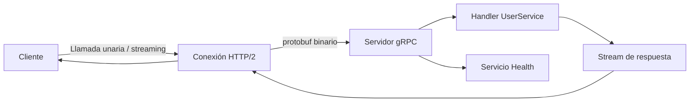

## Overview

Recurre a gRPC cuando el overhead de JSON se convierte en el cuello de botella. REST con JSON es fácil de debuggear, pero cada request paga un payload de texto, un parser y un handshake HTTP/1.1. gRPC mueve el contrato a un archivo `.proto`, lo compila en clases tipadas de TypeScript y envía mensajes binarios por una única conexión HTTP/2. El resultado es menor latencia, menos ancho de banda y streaming incluido desde el inicio.

Esta receta muestra cómo definir un servicio en Protocol Buffers, generar código de servidor y cliente para Node.js e implementar una configuración lista para producción que cubre llamadas unarias, server streaming, client streaming, streaming bidireccional, health checks, propagación de metadata, deadlines y TLS. Mantengo el ejemplo enfocado en `@grpc/grpc-js` porque es el runtime que StackPractices usa para gRPC en Node.js en producción.

## When to Use

- Mis servicios envían tráfico de alto volumen entre [microservicios](/patterns/ambassador-pattern-services/) internos. Si todavía estás eligiendo un protocolo, leé primero [REST API Design](/recipes/rest-api-design/).
- Quiero contratos fuertemente tipados y no quiero mantener stubs de cliente y servidor a mano.
- Necesito stremear logs, eventos, fragmentos de archivos o mensajes de chat con backpressure manejado por HTTP/2.
- Estoy corriendo [gRPC APIs](/recipes/grpc-api/) detrás de un gateway o service mesh y necesito un contrato consistente.
- Mis load balancers y orquestadores necesitan un endpoint de health estándar antes de rutear tráfico al pod.

### When to avoid

- La API es pública y debe ser llamada directamente desde navegadores. Usá gRPC-Web o un gateway REST en su lugar.
- Necesito payloads legibles para debuggear o compartir con terceros. JSON sobre HTTP sigue siendo el default más seguro ahí.
- Mi stack no tiene buen tooling de gRPC en el lenguaje que necesito; generar TypeScript desde un `.proto` no sirve si el otro servicio no tiene soporte de protobuf.

## Solution

### 1. Configuración del proyecto

Un proyecto gRPC TypeScript funcional necesita el compilador de protobuf, el runtime de gRPC para Node.js, el generador de TypeScript y un helper pequeño para health checks. Guardo el proyecto completo en el [repositorio stack-practices-resources](https://github.com/MathiasPaulenko/stack-practices-resources/tree/main/resources/recipes/api/grpc-services-typescript), pero el `package.json` que necesitás está acá:

```json
// package.json
{
  "name": "grpc-typescript-services",
  "version": "1.0.0",
  "scripts": {
    "proto:generate": "grpc_tools_node_protoc --js_out=import_style=commonjs,binary:./generated --grpc_out=grpc_js:./generated --ts_out=grpc_js:./generated --proto_path=./proto ./proto/*.proto",
    "build": "tsc",
    "start:server": "ts-node src/server.ts",
    "start:client": "ts-node src/client.ts"
  },
  "dependencies": {
    "@grpc/grpc-js": "^1.12.0",
    "grpc-health-check": "^2.0.1"
  },
  "devDependencies": {
    "@types/node": "^20.0.0",
    "grpc-tools": "^1.12.0",
    "ts-node": "^10.9.0",
    "ts-protoc-gen": "^0.15.0",
    "typescript": "^5.4.0"
  }
}
```

Y un `tsconfig.json` mínimo:

```json
// tsconfig.json
{
  "compilerOptions": {
    "target": "ES2022",
    "module": "commonjs",
    "outDir": "./dist",
    "rootDir": "./src",
    "strict": true,
    "esModuleInterop": true,
    "skipLibCheck": true,
    "forceConsistentCasingInFileNames": true,
    "resolveJsonModule": true
  },
  "include": ["src/**/*", "generated/**/*"]
}
```

### 2. Definición de Protocol Buffers

Mantengo el `.proto` simple y versionado desde el inicio. El mismo archivo alimenta al servidor, al cliente y a cualquier otro lenguaje después.

```protobuf
// proto/user.proto
syntax = "proto3";

package users;

service UserService {
  rpc GetUser (GetUserRequest) returns (User);
  rpc ListUsers (ListUsersRequest) returns (stream User);
  rpc CreateUsers (stream CreateUserRequest) returns (UserList);
  rpc Chat (stream ChatMessage) returns (stream ChatMessage);
}

message GetUserRequest {
  string id = 1;
}

message User {
  string id = 1;
  string name = 2;
  string email = 3;
}

message ListUsersRequest {
  int32 page = 1;
  int32 page_size = 2;
}

message CreateUserRequest {
  string name = 1;
  string email = 2;
}

message UserList {
  repeated User users = 1;
}

message ChatMessage {
  string user_id = 1;
  string content = 2;
  int64 timestamp = 3;
}
```

Corré `npm install` y `npm run proto:generate` para crear los stubs tipados de servidor y cliente bajo `generated/`.

### 3. Implementación del servidor

El servidor agrega los cuatro tipos de llamada gRPC y expone un endpoint de health estándar. En mis proyectos separo la lógica de los handlers del código de bootstrap, así puedo testear los mismos handlers a través del in-process channel.

```typescript
// src/server.ts
import * as fs from 'fs';
import * as path from 'path';
import * as grpc from '@grpc/grpc-js';
import { HealthImplementation } from 'grpc-health-check';
import { UserServiceService, IUserServiceServer } from './generated/user_grpc_pb';
import { GetUserRequest, User, ListUsersRequest, CreateUserRequest, UserList, ChatMessage } from './generated/user_pb';

const server = new grpc.Server();

const userService: IUserServiceServer = {
  getUser: (call, callback) => {
    const user = new User();
    user.setId(call.request.getId());
    user.setName('Alice');
    user.setEmail('alice@stackpractices.local');
    callback(null, user);
  },

  listUsers: (call) => {
    for (let i = 1; i <= 3; i++) {
      const user = new User();
      user.setId(String(i));
      user.setName(`User ${i}`);
      call.write(user);
    }
    call.end();
  },

  createUsers: (call, callback) => {
    const users: User[] = [];
    call.on('data', (req: CreateUserRequest) => {
      const user = new User();
      user.setId(String(users.length + 1));
      user.setName(req.getName());
      user.setEmail(req.getEmail());
      users.push(user);
    });
    call.on('end', () => {
      const list = new UserList();
      list.setUsersList(users);
      callback(null, list);
    });
  },

  chat: (call) => {
    call.on('data', (msg: ChatMessage) => {
      const reply = new ChatMessage();
      reply.setUserId('server');
      reply.setContent(`Echo: ${msg.getContent()}`);
      reply.setTimestamp(Date.now());
      call.write(reply);
    });
    call.on('end', () => call.end());
  },
};

server.addService(UserServiceService, userService);

// gRPC Health Checking Protocol
const healthImpl = new HealthImplementation({
  'users.UserService': grpc.status.SERVING,
  '': grpc.status.SERVING,
});
healthImpl.addToServer(server);

const useTls = process.env.GRPC_TLS === 'true';
const bindAddress = '0.0.0.0:50051';

const credentials = useTls
  ? grpc.ServerCredentials.createSsl(
      fs.readFileSync(path.join(__dirname, '../certs/ca-cert.pem')),
      [{
        private_key: fs.readFileSync(path.join(__dirname, '../certs/server-key.pem')),
        cert_chain: fs.readFileSync(path.join(__dirname, '../certs/server-cert.pem')),
      }],
      false
    )
  : grpc.ServerCredentials.createInsecure();

server.bindAsync(bindAddress, credentials, (err) => {
  if (err) throw err;
  server.start();
  console.log(`gRPC server running on ${bindAddress} (${useTls ? 'TLS' : 'insecure'})`);
});
```

### 4. Implementación del cliente

El cliente usa un interceptor para adjuntar un bearer token, setea deadlines en cada llamada y muestra los cuatro patrones de streaming.

```typescript
// src/client.ts
import * as fs from 'fs';
import * as path from 'path';
import * as grpc from '@grpc/grpc-js';
import { UserServiceClient } from './generated/user_grpc_pb';
import { GetUserRequest, ListUsersRequest, CreateUserRequest, ChatMessage } from './generated/user_pb';

function authInterceptor(options: grpc.InterceptorOptions, nextCall: grpc.NextCall): grpc.InterceptingCall {
  const requester = new grpc.RequesterBuilder()
    .withStart((metadata, _listener, next) => {
      metadata.add('authorization', `Bearer ${process.env.API_TOKEN || 'dev-token-123'}`);
      next(metadata, _listener);
    })
    .build();
  return new grpc.InterceptingCall(nextCall(options), requester);
}

const useTls = process.env.GRPC_TLS === 'true';
const clientCredentials = useTls
  ? grpc.credentials.createSsl(fs.readFileSync(path.join(__dirname, '../certs/ca-cert.pem')))
  : grpc.credentials.createInsecure();

const client = new UserServiceClient('localhost:50051', clientCredentials, {
  interceptors: [authInterceptor],
});

const deadline = Date.now() + 5000;

// Llamada unaria
function getUser(id: string): Promise<unknown> {
  const request = new GetUserRequest();
  request.setId(id);
  return new Promise((resolve, reject) => {
    client.getUser(request, { deadline }, (err, response) => {
      if (err) reject(err);
      else resolve(response);
    });
  });
}

// Server streaming
function listUsers(): Promise<unknown[]> {
  return new Promise((resolve) => {
    const users: unknown[] = [];
    const stream = client.listUsers(new ListUsersRequest(), { deadline });
    stream.on('data', (user) => users.push(user));
    stream.on('end', () => resolve(users));
  });
}

// Client streaming
function createUsers(names: string[]): Promise<unknown> {
  return new Promise((resolve, reject) => {
    const stream = client.createUsers((err, list) => {
      if (err) reject(err);
      else resolve(list);
    });
    names.forEach((name) => {
      const req = new CreateUserRequest();
      req.setName(name);
      stream.write(req);
    });
    stream.end();
  });
}

// Streaming bidireccional
function chat() {
  const stream = client.chat();
  stream.on('data', (msg: ChatMessage) => console.log(msg.getContent()));
  const message = new ChatMessage();
  message.setUserId('client');
  message.setContent('Hello');
  message.setTimestamp(Date.now());
  stream.write(message);
}

(async () => {
  console.log(await getUser('1'));
  console.log(await listUsers());
  console.log(await createUsers(['Bob', 'Carol']));
  chat();
})();
```

### 5. Cliente de health check

Un cliente de health check separado es lo que usan los load balancers y los probes de Kubernetes. Lo mantengo en su propio archivo para poder correrlo sin el cliente de negocio.

```typescript
// src/health-client.ts
import * as grpc from '@grpc/grpc-js';
import { service as healthServiceDefinition } from 'grpc-health-check';

const HealthClient = grpc.makeClientConstructor(
  healthServiceDefinition as any,
  'grpc.health.v1.Health'
);

const client = new (HealthClient as any)('localhost:50051', grpc.credentials.createInsecure());

client.check({ service: 'users.UserService' }, (err: any, response: any) => {
  if (err) {
    console.error('Health check failed:', err.message);
    process.exit(1);
  }
  console.log('Health status:', response.status);
});
```

### 6. Generar certificados TLS localmente

Para pruebas locales, un certificado self-signed alcanza. No comitees estos archivos; generalos a demanda.

```bash
mkdir -p certs
openssl req -x509 -newkey rsa:4096 -keyout certs/server-key.pem -out certs/server-cert.pem -days 365 -nodes -subj "/CN=localhost"
openssl req -x509 -newkey rsa:4096 -keyout certs/ca-key.pem -out certs/ca-cert.pem -days 365 -nodes -subj "/CN=My Local CA"
```

En producción, usá certificados emitidos por una CA interna o un servicio administrado.

## Explanation

- Las **llamadas unarias** envían un request y esperan un response. Se mapean limpiamente a una API request/response tradicional y son el punto de partida más fácil.
- El **server streaming** empieza con un request; el servidor sigue enviando mensajes. El cliente lee hasta que el servidor cierra el stream con `end()`. Lo uso para logs y feeds de eventos donde el consumidor quiere leer a su propio ritmo.
- El **client streaming** envía muchos mensajes desde el cliente; el servidor responde una vez que termina el stream. Usalo para uploads o inserts en batch que de otro modo necesitarían un round trip por ítem.
- El **streaming bidireccional** permite que cliente y servidor escriban y lean al mismo tiempo. Sirve para chat, juegos en tiempo real o pipelines de eventos donde ambos lados necesitan un canal persistente de medio dúplex.
- **HTTP/2** transporta todo esto sobre una única conexión TCP, así las llamadas concurrentes comparten el mismo overhead y el servidor puede pushear streams de forma independiente.
- Los **health checks** a través del gRPC Health Checking Protocol le dan a Kubernetes, load balancers y sidecars de mesh un endpoint estándar sin filtrar lógica de negocio. El paquete `grpc-health-check` agrega el servicio `grpc.health.v1.Health` a un servidor Node.js.
- La **generación de código** elimina el parsing de JSON a mano. El archivo `.proto` es la fuente de verdad; las clases de TypeScript se mantienen sincronizadas automáticamente. Los regenero en CI con `npm run proto:generate` y corro `buf breaking` contra el `.proto` anterior para detectar cambios incompatibles.



## Variants

Cada tipo de llamada se ajusta a una forma distinta de trabajo. También agrego la variante operativa principal: si la conexión está protegida con TLS o es insegura.

| Tipo de llamada | Caso de uso | API clave | Overhead |
| --- | --- | --- | --- |
| Unaria | Request/response simple | `client.getUser(req, callback)` | Un stream HTTP/2 |
| Server streaming | Logs, eventos, resultados de búsqueda | `stream.on('data', ...)` | Un stream, muchos payloads |
| Client streaming | Subida de archivos, inserts en batch | `stream.write(req)` luego `stream.end()` | Un stream, muchos payloads |
| Streaming bidireccional | Chat, colaboración en tiempo real | `call.on('data')` y `call.write()` | Stream compartido, backpressure en ambos lados |
| Insegura | Solo desarrollo local | `grpc.credentials.createInsecure()` | Sin handshake TLS |
| TLS | Producción inter-servicio | `grpc.credentials.createSsl(rootCert)` | Handshake TLS una vez por subchannel |

## Best Practices

- Usá TLS para gRPC inter-servicio en producción. `createInsecure()` es solo para desarrollo local.
- Seteá un deadline absoluto en cada llamada. Propagalo a través de metadata así los servicios downstream no pierden tiempo con trabajo expirado.
- Guardá el archivo `.proto` en un repositorio o paquete compartido para que clientes y servidores generen siempre desde el mismo contrato.
- Usá `reserved` para campos removidos y evitá reusar viejos field numbers.
- Implementá el [gRPC Health Checking Protocol](https://github.com/grpc/grpc/blob/master/doc/health-checking.md) así los probes de orquestación pueden verificar liveness y readiness.
- Corré `buf breaking` en CI para detectar cambios incompatibles del `.proto` antes de mergear.
- Reusá el mismo cliente. Crear un cliente nuevo por request mata el HTTP/2 connection reuse y agrega tiempo de setup.
- Versioná los paquetes `.proto` con `users.v2` para cambios breaking en lugar de reusar viejos field numbers.

## Common Mistakes

- Cambiar un field number o tipo en un `.proto` después de que salió. Eso rompe la compatibilidad de wire para clientes existentes y puede causar errores silenciosos de deserialización.
- Olvidar manejar los eventos `error`, `end` y `cancelled` en streams. Una conexión caída puede crashear el proceso o filtrar memoria.
- Llamar a gRPC directamente desde un navegador. Los navegadores no pueden leer los trailers de HTTP/2 de gRPC, así que usá gRPC-Web o un gateway REST.
- Crear un cliente nuevo por request. Reusá el mismo cliente así HTTP/2 lleva varias llamadas a la vez y el costo de setup se mantiene bajo.
- Devolver excepciones planas desde los handlers. Convertilas siempre a [códigos de estado gRPC](https://grpc.github.io/grpc/core/md_doc_statuscodes.html) para que los clientes reaccionen de forma consistente.

## FAQ

### ¿En qué se diferencia de REST?

REST envía JSON sobre HTTP/1.1 y es fácil de inspeccionar. gRPC usa protobuf binario sobre HTTP/2, que es más chico, más rápido de parsear y soporta streaming de fábrica. Para una API pública, REST sigue siendo el default más seguro.

### ¿Pueden los navegadores llamar gRPC directamente?

No. Los navegadores no pueden leer los trailers de HTTP/2 de gRPC. Usá gRPC-Web con Envoy o agregá un gateway REST con `grpc-gateway` para clientes de navegador.

### ¿Cómo manejo errores y códigos de estado?

Devolvé un código de estado gRPC como `NOT_FOUND`, `INVALID_ARGUMENT` o `UNAVAILABLE`. No tires excepciones crudas; envolvelas en un estado gRPC antes de mandar el callback. La [lista oficial de códigos de estado](https://grpc.github.io/grpc/core/md_doc_statuscodes.html) es la referencia canónica.

### ¿Cómo implemento deadlines y timeouts?

Seteá un deadline absoluto en el cliente: `client.getUser(req, { deadline: Date.now() + 5000 }, callback)`. Propagalo a través de metadata y controlalo en el servidor. Cancelá el trabajo de larga duración antes de que el deadline se agote.

### ¿Cómo versiono esquemas de protobuf?

Una vez que un field number está en uso, no lo toques. Agregá nuevos campos con el próximo número disponible. Marcá los campos removidos con `reserved` para que los viejos números no se puedan reusar. Para cambios breaking, creá un paquete o servicio nuevo, como `users.v2`.

### ¿Cómo testeo servicios gRPC?

Usá el in-process channel de `@grpc/grpc-js` para llamar handlers sin un socket TCP real. Para tests de integración, levantá el servidor en un puerto random y usá un cliente real. Para verificaciones manuales, `grpcurl` es la forma más rápida de enviar un request.

### ¿Cómo agrego health checks a un servidor gRPC existente?

Instalá `grpc-health-check`, creá un `HealthImplementation` con el `ServingStatus` de cada servicio y llamá `healthImpl.addToServer(server)`. Kubernetes o un load balancer pueden entonces llamar al RPC estándar `grpc.health.v1.Health/Check`.

### ¿Cómo aseguro gRPC entre microservicios?

Obtené o generá certificados para el servidor y la CA, luego usá `grpc.ServerCredentials.createSsl` en el servidor y `grpc.credentials.createSsl` en el cliente. En desarrollo, certificados self-signed están bien; en producción, usá una CA interna o un servicio de certificados administrado.

## See Also

- [Documentación de gRPC Node.js](https://grpc.io/docs/languages/node/)
- [Guía del lenguaje Protocol Buffers](https://protobuf.dev/programming-guides/proto3/)
- [gRPC Health Checking Protocol](https://github.com/grpc/grpc/blob/master/doc/health-checking.md)
- [Detección de cambios breaking de Buf](https://buf.build/docs/breaking/overview/)
- [grpcurl en GitHub](https://github.com/fullstorydev/grpcurl)
- [Referencia de códigos de estado gRPC](https://grpc.github.io/grpc/core/md_doc_statuscodes.html)
- Internos: [gRPC API overview](/recipes/grpc-api/) y [REST API Design](/recipes/rest-api-design/)
