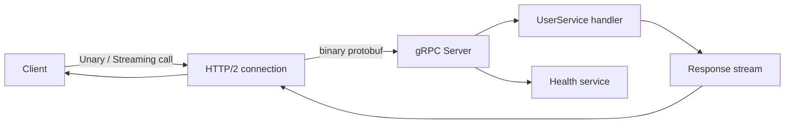

## Overview

I reach for gRPC when JSON overhead becomes the bottleneck. REST with JSON is easy to debug, but every request pays for a text payload, a parser, and a fresh HTTP/1.1 handshake. gRPC moves the contract into a `.proto` file, compiles it into typed TypeScript classes, and ships binary messages over a single HTTP/2 connection. The result is lower latency, less bandwidth, and streaming built in from the start.

This recipe shows how to define a service in Protocol Buffers, generate server and client code for Node.js, and implement a production-ready setup that covers unary, server streaming, client streaming, bidirectional streaming, health checks, metadata propagation, deadlines and TLS. I've kept the example focused on `@grpc/grpc-js` because it's the runtime StackPractices uses for Node.js gRPC in production.

## When to Use

- I reach for gRPC once my services start moving high-volume traffic between internal [microservices](/patterns/ambassador-pattern-services/), because that's where the binary payload pays off. If you're still choosing a protocol, read [REST API Design](/recipes/rest-api-design/) first.
- I want typed contracts and I don't want to maintain client and server stubs by hand.
- I need to stream logs, events, file chunks or chat messages with backpressure handled by HTTP/2.
- I'm running [gRPC APIs](/recipes/grpc-api/) behind a gateway or service mesh and need a consistent contract.
- My load balancers and orchestrators need a standard health endpoint before routing traffic to the pod.

### When to avoid

- When the API is public and the caller is a browser, gRPC isn't the right entry point; I route that to gRPC-Web or a REST gateway instead.
- I need human-readable payloads for debugging or sharing with third parties. JSON over HTTP remains the safer default there.
- My stack lacks good gRPC tooling in the language I need; generating TypeScript from a `.proto` isn't useful if the other service has no protobuf support.

## Solution

### 1. Project setup

A working gRPC TypeScript project needs the protobuf compiler, the gRPC Node.js runtime, the TypeScript generator and a small helper for health checks. My `package.json` looks like this:

```json
// package.json
{
  "name": "grpc-typescript-services",
  "version": "1.0.0",
  "scripts": {
    "proto:generate": "grpc_tools_node_protoc --js_out=import_style=commonjs,binary:./generated --grpc_out=grpc_js:./generated --ts_out=grpc_js:./generated --proto_path=./proto ./proto/*.proto",
    "build": "tsc",
    "start:server": "ts-node src/server.ts",
    "start:client": "ts-node src/client.ts"
  },
  "dependencies": {
    "@grpc/grpc-js": "^1.12.0",
    "grpc-health-check": "^2.0.1"
  },
  "devDependencies": {
    "@types/node": "^20.0.0",
    "grpc-tools": "^1.12.0",
    "ts-node": "^10.9.0",
    "ts-protoc-gen": "^0.15.0",
    "typescript": "^5.4.0"
  }
}
```

And a minimal `tsconfig.json`:

```json
// tsconfig.json
{
  "compilerOptions": {
    "target": "ES2022",
    "module": "commonjs",
    "outDir": "./dist",
    "rootDir": "./src",
    "strict": true,
    "esModuleInterop": true,
    "skipLibCheck": true,
    "forceConsistentCasingInFileNames": true,
    "resolveJsonModule": true
  },
  "include": ["src/**/*", "generated/**/*"]
}
```

### 2. Protocol Buffer definition

I keep the `.proto` simple and versioned from the start. That same `.proto` file is the source of truth for the server, the client and any other language I add later, so I never drift out of sync.

```protobuf
// proto/user.proto
syntax = "proto3";

package users;

service UserService {
  rpc GetUser (GetUserRequest) returns (User);
  rpc ListUsers (ListUsersRequest) returns (stream User);
  rpc CreateUsers (stream CreateUserRequest) returns (UserList);
  rpc Chat (stream ChatMessage) returns (stream ChatMessage);
}

message GetUserRequest {
  string id = 1;
}

message User {
  string id = 1;
  string name = 2;
  string email = 3;
}

message ListUsersRequest {
  int32 page = 1;
  int32 page_size = 2;
}

message CreateUserRequest {
  string name = 1;
  string email = 2;
}

message UserList {
  repeated User users = 1;
}

message ChatMessage {
  string user_id = 1;
  string content = 2;
  int64 timestamp = 3;
}
```

Run `npm install` and `npm run proto:generate` to create the typed server and client stubs under `generated/`.

### 3. Server implementation

The server adds all four gRPC call types and exposes a standard health endpoint. In my projects I separate the handler logic from the bootstrap code so the same handlers can be tested through the in-process channel.

```typescript
// src/server.ts
import * as fs from 'fs';
import * as path from 'path';
import * as grpc from '@grpc/grpc-js';
import { HealthImplementation } from 'grpc-health-check';
import { UserServiceService, IUserServiceServer } from './generated/user_grpc_pb';
import { GetUserRequest, User, ListUsersRequest, CreateUserRequest, UserList, ChatMessage } from './generated/user_pb';

const server = new grpc.Server();

const userService: IUserServiceServer = {
  getUser: (call, callback) => {
    const user = new User();
    user.setId(call.request.getId());
    user.setName('Alice');
    user.setEmail('alice@stackpractices.local');
    callback(null, user);
  },

  listUsers: (call) => {
    for (let i = 1; i <= 3; i++) {
      const user = new User();
      user.setId(String(i));
      user.setName(`User ${i}`);
      call.write(user);
    }
    call.end();
  },

  createUsers: (call, callback) => {
    const users: User[] = [];
    call.on('data', (req: CreateUserRequest) => {
      const user = new User();
      user.setId(String(users.length + 1));
      user.setName(req.getName());
      user.setEmail(req.getEmail());
      users.push(user);
    });
    call.on('end', () => {
      const list = new UserList();
      list.setUsersList(users);
      callback(null, list);
    });
  },

  chat: (call) => {
    call.on('data', (msg: ChatMessage) => {
      const reply = new ChatMessage();
      reply.setUserId('server');
      reply.setContent(`Echo: ${msg.getContent()}`);
      reply.setTimestamp(Date.now());
      call.write(reply);
    });
    call.on('end', () => call.end());
  },
};

server.addService(UserServiceService, userService);

// gRPC Health Checking Protocol
const healthImpl = new HealthImplementation({
  'users.UserService': grpc.status.SERVING,
  '': grpc.status.SERVING,
});
healthImpl.addToServer(server);

const useTls = process.env.GRPC_TLS === 'true';
const bindAddress = '0.0.0.0:50051';

const credentials = useTls
  ? grpc.ServerCredentials.createSsl(
      fs.readFileSync(path.join(__dirname, '../certs/ca-cert.pem')),
      [{
        private_key: fs.readFileSync(path.join(__dirname, '../certs/server-key.pem')),
        cert_chain: fs.readFileSync(path.join(__dirname, '../certs/server-cert.pem')),
      }],
      false
    )
  : grpc.ServerCredentials.createInsecure();

server.bindAsync(bindAddress, credentials, (err) => {
  if (err) throw err;
  server.start();
  console.log(`gRPC server running on ${bindAddress} (${useTls ? 'TLS' : 'insecure'})`);
});
```

### 4. Client implementation

The client uses an interceptor to attach a bearer token, sets deadlines on every call and shows all four streaming patterns.

```typescript
// src/client.ts
import * as fs from 'fs';
import * as path from 'path';
import * as grpc from '@grpc/grpc-js';
import { UserServiceClient } from './generated/user_grpc_pb';
import { GetUserRequest, ListUsersRequest, CreateUserRequest, ChatMessage } from './generated/user_pb';

function authInterceptor(options: grpc.InterceptorOptions, nextCall: grpc.NextCall): grpc.InterceptingCall {
  const requester = new grpc.RequesterBuilder()
    .withStart((metadata, _listener, next) => {
      metadata.add('authorization', `Bearer ${process.env.API_TOKEN || 'dev-token-123'}`);
      next(metadata, _listener);
    })
    .build();
  return new grpc.InterceptingCall(nextCall(options), requester);
}

const useTls = process.env.GRPC_TLS === 'true';
const clientCredentials = useTls
  ? grpc.credentials.createSsl(fs.readFileSync(path.join(__dirname, '../certs/ca-cert.pem')))
  : grpc.credentials.createInsecure();

const client = new UserServiceClient('localhost:50051', clientCredentials, {
  interceptors: [authInterceptor],
});

const deadline = Date.now() + 5000;

// Unary call
function getUser(id: string): Promise<unknown> {
  const request = new GetUserRequest();
  request.setId(id);
  return new Promise((resolve, reject) => {
    client.getUser(request, { deadline }, (err, response) => {
      if (err) reject(err);
      else resolve(response);
    });
  });
}

// Server streaming
function listUsers(): Promise<unknown[]> {
  return new Promise((resolve) => {
    const users: unknown[] = [];
    const stream = client.listUsers(new ListUsersRequest(), { deadline });
    stream.on('data', (user) => users.push(user));
    stream.on('end', () => resolve(users));
  });
}

// Client streaming
function createUsers(names: string[]): Promise<unknown> {
  return new Promise((resolve, reject) => {
    const stream = client.createUsers((err, list) => {
      if (err) reject(err);
      else resolve(list);
    });
    names.forEach((name) => {
      const req = new CreateUserRequest();
      req.setName(name);
      stream.write(req);
    });
    stream.end();
  });
}

// Bidirectional streaming
function chat() {
  const stream = client.chat();
  stream.on('data', (msg: ChatMessage) => console.log(msg.getContent()));
  const message = new ChatMessage();
  message.setUserId('client');
  message.setContent('Hello');
  message.setTimestamp(Date.now());
  stream.write(message);
}

(async () => {
  console.log(await getUser('1'));
  console.log(await listUsers());
  console.log(await createUsers(['Bob', 'Carol']));
  chat();
})();
```

### 5. Health-check client

A separate health-check client is what load balancers and Kubernetes probes use. I keep it in its own file so the probe can run without dragging in the business client.

```typescript
// src/health-client.ts
import * as grpc from '@grpc/grpc-js';
import { service as healthServiceDefinition } from 'grpc-health-check';

const HealthClient = grpc.makeClientConstructor(
  healthServiceDefinition as any,
  'grpc.health.v1.Health'
);

const client = new (HealthClient as any)('localhost:50051', grpc.credentials.createInsecure());

client.check({ service: 'users.UserService' }, (err: any, response: any) => {
  if (err) {
    console.error('Health check failed:', err.message);
    process.exit(1);
  }
  console.log('Health status:', response.status);
});
```

### 6. Generating TLS certificates locally

For local testing, a self-signed certificate is plenty; it saves me from provisioning a real CA. Don't commit these files; generate them on demand.

```bash
mkdir -p certs
openssl req -x509 -newkey rsa:4096 -keyout certs/server-key.pem -out certs/server-cert.pem -days 365 -nodes -subj "/CN=localhost"
openssl req -x509 -newkey rsa:4096 -keyout certs/ca-key.pem -out certs/ca-cert.pem -days 365 -nodes -subj "/CN=My Local CA"
```

In production, I get certificates from an internal CA or a managed service I trust, then I never have to think about self-signed certs again.

## Explanation

- **Unary calls** send one request and wait for one response, just like a normal REST call. They map cleanly to a request/response API, so they're the easiest place to start.
- **Server streaming** starts with one request; the server then keeps sending messages. I read until the server closes the stream with `end()`. I use this for logs and event feeds where I want to read at my own pace.
- **Client streaming** sends many messages from the client; the server responds once after the stream ends. Use it for uploads or batch inserts that would otherwise need one round trip per item.
- **Bidirectional streaming** opens one stream where the client and the server can both write and read whenever they've got data. It works well for chat, real-time games or event pipelines where both sides need a persistent half-duplex channel.
- **HTTP/2** carries all of this over a single TCP connection, so concurrent calls share the same overhead and the server can push streams independently.
- **Health checks** through the gRPC Health Checking Protocol give Kubernetes, load balancers and mesh sidecars a standard endpoint without leaking business logic. I use `grpc-health-check` to attach the standard `grpc.health.v1.Health` service to the Node.js server, which makes probes trivial.
- **Code generation** removes hand-written JSON parsing. The `.proto` file is the source of truth; the TypeScript classes stay in sync automatically. I regenerate them in CI with `npm run proto:generate` and run `buf breaking` against the previous `.proto` to catch wire-incompatible changes.



## Variants

Each call type fits a different shape of work, so I also add the operational variant I care about most: whether the connection is TLS-protected or insecure.

| Call type | Use case | Key API | Overhead |
| --- | --- | --- | --- |
| Unary | Single request/response | `client.getUser(req, callback)` | One HTTP/2 stream |
| Server streaming | Logs, events, search results | `stream.on('data', ...)` | One stream, many payloads |
| Client streaming | File uploads, batch inserts | `stream.write(req)` then `stream.end()` | One stream, many payloads |
| Bidirectional streaming | Chat, real-time collaboration | `call.on('data')` and `call.write()` | Shared stream, backpressure on both sides |
| Insecure | Local development only | `grpc.credentials.createInsecure()` | No TLS handshake |
| TLS | Production inter-service | `grpc.credentials.createSsl(rootCert)` | TLS handshake once per subchannel |

## Best Practices

- Use TLS for inter-service gRPC in production. Only call `createInsecure()` on my own laptop; never in a cluster.
- Set an absolute deadline on every call. Propagate it through metadata so downstream services don't waste time on expired work.
- Keep the `.proto` file in a shared repository or package so clients and servers always generate from the same contract.
- Use `reserved` for removed fields so old field numbers aren't accidentally reused.
- Add the [gRPC Health Checking Protocol](https://github.com/grpc/grpc/blob/master/doc/health-checking.md) so orchestration tools can run liveness and readiness probes.
- Run `buf breaking` in CI to catch wire-incompatible `.proto` changes before they merge.
- Reuse the same client. I used to create a fresh client for every request and couldn't figure out why latency was high until I saw that it kills HTTP/2 connection reuse and adds setup time.
- Version `.proto` packages with `users.v2` for breaking changes rather than reusing old field numbers.

## Common Mistakes

- Changing a field number or type in a `.proto` file after it's shipped. That breaks wire compatibility for existing clients and can cause silent deserialization errors.
- Forgetting to handle `error`, `end` and `cancelled` events on streams. I have seen a dropped connection crash the process because I forgot to handle those events, or slowly leak memory.
- Calling gRPC straight from a browser. Browsers can't read HTTP/2 trailers, so use gRPC-Web or a REST gateway instead.
- Spinning up a brand-new client for each request. Reuse the same client so HTTP/2 carries several calls at once and keeps connection setup cost low.
- Returning plain exceptions from handlers. Always convert them to [gRPC status codes](https://grpc.github.io/grpc/core/md_doc_statuscodes.html) so clients can react consistently.

## FAQ

### How is this different from REST?

REST still sends JSON over HTTP/1.1, which I find easier to inspect than binary protobuf. gRPC uses protobuf over HTTP/2, which is smaller, faster to parse and supports streaming out of the box. For a public API, I still default to REST.

### Can browsers call gRPC directly?

No. Browsers can't read gRPC's HTTP/2 trailers, so I keep them away from the gRPC surface and use gRPC-Web with Envoy or a REST gateway with `grpc-gateway` for browser clients.

### How do I handle errors and status codes?

Return a gRPC status code such as `NOT_FOUND`, `INVALID_ARGUMENT` or `UNAVAILABLE`. Don't throw raw exceptions; wrap them in a gRPC status before sending the callback. The [official status code list](https://grpc.github.io/grpc/core/md_doc_statuscodes.html) is the canonical reference.

### How do I implement deadlines and timeouts?

Set an absolute deadline on the client: `client.getUser(req, { deadline: Date.now() + 5000 }, callback)`. Propagate it through metadata and check it on the server. I cancel long-running work before the deadline expires so the server doesn't sit on useless work.

### How do I version protobuf schemas?

Once a field number is in use, leave it alone. When I need a new field, I grab the next free number in the message. Mark removed fields with `reserved` so old numbers can't be reused. For breaking changes, create a new package or service, such as `users.v2`.

### How do I test gRPC services?

Use the in-process channel from `@grpc/grpc-js` to call handlers without a real TCP socket. For integration tests, I start the server on a free port and hit it with a real client. For manual checks, `grpcurl` is the fastest way to fire a request.

### How do I add health checks to an existing gRPC server?

Install `grpc-health-check`, create a `HealthImplementation` with the `ServingStatus` of each service, and call `healthImpl.addToServer(server)`. Kubernetes or a load balancer can then call the standard `grpc.health.v1.Health/Check` RPC.

### How do I secure gRPC between microservices?

Get or generate certificates for the server and the CA, then use `grpc.ServerCredentials.createSsl` on the server and `grpc.credentials.createSsl` on the client. In development, I am fine with self-signed certificates; they save me from provisioning a real CA. In production, I get certificates from an internal CA or a managed service I trust, then I don't have to think about self-signed certs again.

## See Also

- [gRPC Node.js documentation](https://grpc.io/docs/languages/node/)
- [Protocol Buffers language guide](https://protobuf.dev/programming-guides/proto3/)
- [gRPC Health Checking Protocol](https://github.com/grpc/grpc/blob/master/doc/health-checking.md)
- [Buf breaking change detection](https://buf.build/docs/breaking/overview/)
- [grpcurl on GitHub](https://github.com/fullstorydev/grpcurl)
- [gRPC status codes reference](https://grpc.github.io/grpc/core/md_doc_statuscodes.html)
- Internal: [gRPC API overview](/recipes/grpc-api/) and [REST API Design](/recipes/rest-api-design/)
