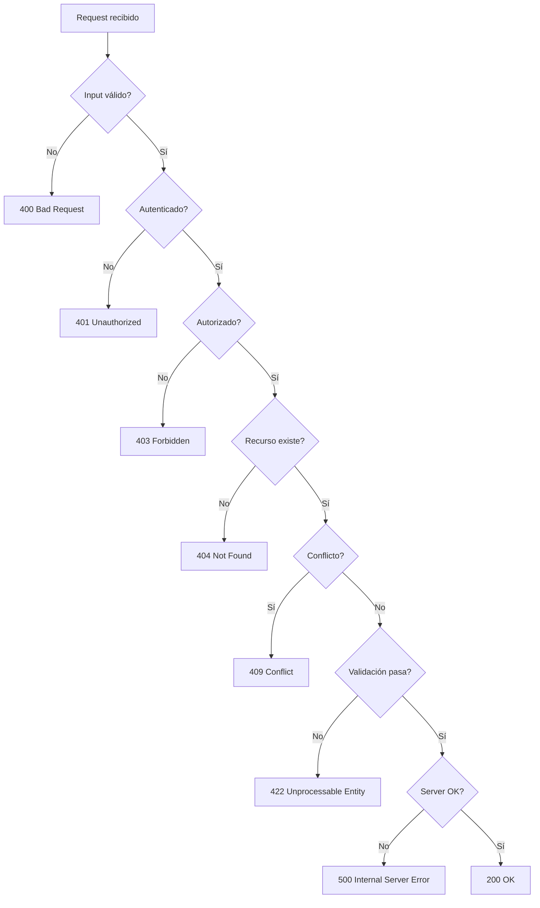

## Visión General

Un buen manejo de errores es lo que hace que una API sea confiable. Una
respuesta de error bien diseñada le dice al cliente qué salió mal, qué hacer al
respecto y cómo evitarlo la próxima vez, sin filtrar detalles internos. Esta
receta cubre RFC 7807 Problem Details, códigos de estado HTTP, content
negotiation con `application/problem+json` e implementaciones idiomáticas en
Python, JavaScript y Java.

RFC 7807 define un formato JSON estándar para respuestas de error de modo que
los clientes puedan parsear errores de forma predecible entre endpoints y
servicios. El sucesor RFC 9457 añade campos opcionales como `instance` y
aclara la semántica de extensiones, pero RFC 7807 sigue siendo el baseline
ampliamente desplegado. Vas a encontrar ambos referenciados en producción.

## Cuándo Usar

- Construís o refactorizás una API REST de la que dependan clientes.
- Querés estandarizar respuestas de error entre varios servicios backend.
- Documentás modos de falla para consumidores de la API.
- Diseñás middleware de manejo de errores o mapeadores de excepciones.

### Cuándo evitarlo

- La API tiene pocos endpoints y sin lógica compleja. Un shape liviano
 `{ "error": "message" }` alcanza.
- La API ya usa un formato de error estable del que dependen los clientes.
 Migrar a RFC 7807 rompe compatibilidad y fuerza a cada cliente a actualizar.
- La latencia es crítica. La validación extra y el formateo de respuesta agregan
 overhead, aunque suele ser despreciable comparado con llamadas a base de datos.

## Solución

### Python (FastAPI)

```python
from fastapi import FastAPI, HTTPException, Request
from fastapi.responses import JSONResponse
from pydantic import BaseModel

app = FastAPI()

class ProblemDetail(BaseModel):
 type: str = "about:blank"
 title: str
 status: int
 detail: str
 instance: str | None = None

@app.exception_handler(ValueError)
async def value_error_handler(request: Request, exc: ValueError):
 return JSONResponse(
 status_code=400,
 content={
 "type": "https://api.example.com/errors/invalid-input",
 "title": "Invalid Input",
 "detail": str(exc),
 "status": 400,
 "instance": str(request.url),
 },
 media_type="application/problem+json",
 )

@app.get("/users/{user_id}")
async def get_user(user_id: int):
 if user_id <= 0:
 raise HTTPException(
 status_code=404,
 detail={
 "type": "https://api.example.com/errors/not-found",
 "title": "User Not Found",
 "detail": f"No user with id {user_id}",
 "status": 404,
 },
 )
 return {"id": user_id, "name": "Ada"}
```

El `HTTPException` de FastAPI acepta un dict en `detail`, lo que te permite
embeber el shape completo de Problem Details. El handler custom para
`ValueError` setea el `media_type` a `application/problem+json` para que los
clientes puedan hacer content negotiation correctamente.

### JavaScript (Express)

```javascript
const express = require('express');
const app = express();

function problemResponse(type, title, detail, status, instance) {
 const body = { type, title, detail, status };
 if (instance) body.instance = instance;
 return body;
}

app.get('/users/:userId', (req, res, next) => {
 const userId = parseInt(req.params.userId, 10);
 if (Number.isNaN(userId) || userId <= 0) {
 return res.status(404)
 .set('Content-Type', 'application/problem+json')
 .json(problemResponse(
 'https://api.example.com/errors/not-found',
 'User Not Found',
 `No user with id ${req.params.userId}`,
 404,
 req.originalUrl
 ));
 }
 res.json({ id: userId, name: 'Ada' });
});

// Global error handler (must be last)
app.use((err, req, res, next) => {
 console.error(err);
 const status = err.status || 500;
 res.status(status)
 .set('Content-Type', 'application/problem+json')
 .json(problemResponse(
 'https://api.example.com/errors/server-error',
 'Internal Server Error',
 process.env.NODE_ENV === 'production' ? 'Something went wrong.' : err.message,
 status,
 req.originalUrl
 ));
});
```

El handler global atrapa todo lo que `next(err)` le pase. Setear
`Content-Type: application/problem+json` le dice a los clientes que esto es una
respuesta Problem Details, no un error JSON genérico.

### Java (Spring Boot)

```java
import org.springframework.http.*;
import org.springframework.web.bind.annotation.*;
import org.springframework.web.server.ResponseStatusException;
import java.net.URI;
import java.util.Map;

@RestController
public class UserController {

 @GetMapping("/users/{userId}")
 public Map<String, Object> getUser(@PathVariable Long userId) {
 if (userId <= 0) {
 throw new ResponseStatusException(
 HttpStatus.NOT_FOUND,
 "No user with id " + userId
 );
 }
 return Map.of("id", userId, "name", "Ada");
 }
}

@ControllerAdvice
public class GlobalExceptionHandler {

 @ExceptionHandler(ResponseStatusException.class)
 public ResponseEntity<Map<String, Object>> handle(ResponseStatusException ex, WebRequest request) {
 var body = Map.of(
 "type", URI.create("https://api.example.com/errors/not-found"),
 "title", ex.getReason(),
 "detail", ex.getReason(),
 "status", ex.getStatusCode().value(),
 "instance", request.getDescription(false).replace("uri=", "")
 );
 return ResponseEntity.status(ex.getStatusCode())
 .contentType(MediaType.valueOf("application/problem+json"))
 .body(body);
 }
}
```

El `@ControllerAdvice` de Spring centraliza el manejo de excepciones entre
todos los controllers. La llamada `MediaType.valueOf` con el content type
`application/problem+json` hace que la respuesta lleve el content type correcto.

## Explicación

### Campos de RFC 7807

RFC 7807 define cinco campos, todos opcionales excepto `type`:

| Campo | Propósito | Ejemplo |
| --- | --- | --- |
| `type` | URI que identifica el tipo de problema | `https://api.example.com/errors/not-found` |
| `title` | Resumen corto legible por humanos | `User Not Found` |
| `status` | Código de estado HTTP (redundante pero útil) | `404` |
| `detail` | Explicación legible específica de esta ocurrencia | `No user with id 42` |
| `instance` | URI que identifica la ocurrencia específica | `/users/42` |

El campo `type` es el más importante. Debería resolver a una página de
documentación que describa el error, para que los clientes puedan buscar qué
significa sin parsear el string `detail`. Usá `about:blank` cuando el tipo de
problema es genérico y el código de estado HTTP alcanza.

### Campos de extensión

RFC 7807 permite campos de extensión más allá de los cinco estándar. El más
común es `errors` o `invalid-params` para errores de validación que reportan
varios campos a la vez:

```json
{
 "type": "https://api.example.com/errors/validation",
 "title": "Validation Failed",
 "status": 422,
 "errors": [
 { "field": "email", "message": "must be a valid email" },
 { "field": "age", "message": "must be between 18 and 120" }
 ]
}
```

FastAPI y Spring Boot generan este shape automáticamente cuando usás su
validación integrada. Si lo construís manualmente, mantené la estructura del
array consistente entre todos los endpoints de validación.

### Content negotiation

Siempre seteá `Content-Type: application/problem+json` en respuestas de error.
Este media type lo define RFC 7807 y permite a los clientes distinguir Problem
Details de errores JSON genéricos. Sin esto, los clientes tienen que adivinar
basándose en el body, lo que se rompe cuando cambiás de formato.

### Mapeo de códigos de estado HTTP

Nunca devuelvas 200 OK para un request fallido. El código de estado lleva el
significado semántico en el que confían caches, proxies y herramientas de
monitoreo:



Usá 400 para input malformado (JSON inválido, campos requeridos faltantes). Usá
422 para input semánticamente válido que falla reglas de negocio (enviar a un
país no soportado). Usá 409 para conflictos de estado (email duplicado en una
unique constraint). Usá 502/503 para fallas de servicios downstream y 504 para
timeouts.

### Handlers globales

Los handlers globales centralizan la serialización para que los route handlers
se enfoquen en la lógica de negocio. También evitan que stack traces y detalles
SQL lleguen a los clientes en producción. En FastAPI, registrá handlers con
`@app.exception_handler`. En Express, agregá un error-handling middleware
(cuatro argumentos) como último `app.use`. En Spring Boot, usá
`@ControllerAdvice` con métodos `@ExceptionHandler`.

## Variantes

Todas las variantes devuelven `Content-Type: application/problem+json` en errores.

| Lenguaje | Framework | Patrón de handler | Errores tipados |
| --- | --- | --- | --- |
| Python | FastAPI | `@app.exception_handler` | `HTTPException` |
| Python | Django REST | `exception_handler` setting | Subclases de `APIException` |
| JavaScript | Express | Middleware de error | Clase `AppError` custom |
| JavaScript | NestJS | Exception filters `@Catch()` | `HttpException` |
| Java | Spring Boot | `@ControllerAdvice` | `ResponseStatusException` |
| Java | JAX-RS | `ExceptionMapper<T>` | `WebApplicationException` |
| Go | net/http | `http.HandlerFunc` + recover | Struct `AppError` custom |

## Lo que Funciona

- Usá el código de estado correcto: 400 para errores del cliente, 401/403 para
 auth, 404 para recursos faltantes, 409 para conflictos, 422 para validación,
 500 para bugs del servidor. Consultá [input
 validation](/recipes/input-validation/) para patrones de validación de
 requests que previenen 400s.
- Incluí un correlation ID en las respuestas de error y logs para que soporte
 pueda tracear requests entre servicios. Ver [logging y auditoría de
 API](/recipes/api-logging-audit/) para patrones de logging estructurado.
- Mantené mensajes útiles. "El nombre debe tener entre 2 y 50 caracteres" es
 mejor que "Validation failed."
- Nunca expongas stack traces, SQL o paths internos en producción.
- Seteá `Cache-Control: no-store` en todas las respuestas de error para que
 CDNs y browsers no cacheen fallas.
- Documentá cada 4xx y 5xx que un endpoint puede devolver en tu spec OpenAPI.
 Ver [documentación de API con
 OpenAPI](/recipes/api-documentation-openapi/) para documentación de errores
 spec-driven.
- Versioná tu formato de error junto con tu API. Ver [versionado de
 API](/recipes/api-versioning/) para estrategias que mantienen los shapes de
 error estables entre breaking changes.

## Errores Comunes

- Devolver 200 OK con un body de error. Rompe cache, logging y monitoreo porque
 proxies y CDNs tratan 200 como éxito.
- Exponer internals como stack traces o SQL a los clientes. Esto filtra
 detalles de arquitectura que atacantes pueden usar.
- Usar shapes inconsistentes entre endpoints. Uno devuelve `{ "error": "msg" }`,
 otro `{ "message": "msg", "code": 123 }`. Los clientes terminan escribiendo
 casos especiales para cada endpoint.
- Devolver 500 por un recurso faltante (debería ser 404) o 403 por un request no
 autenticado (debería ser 401). Los códigos de estado tienen significado
 semántico.
- Tragar excepciones. Atrapar todo y devolver 500 genérico oculta bugs.
- Devolver errores distintos para "user not found" y "wrong password". Eso
 permite enumerar cuentas válidas. Devolvé el mismo mensaje genérico
 "credenciales inválidas" para ambos.

## Estrategia de Testing

El manejo de errores necesita contract tests, no solo unit tests. Escribí tests
que verifiquen que cada endpoint devuelva el código de estado correcto y el
shape de error para cada escenario de falla.

### Python (pytest)

```python
import pytest
from fastapi.testclient import TestClient
from main import app

client = TestClient(app)

def test_get_user_not_found():
 response = client.get("/users/-1")
 assert response.status_code == 404
 assert response.headers["content-type"] == "application/problem+json"
 body = response.json()
 assert body["type"] == "https://api.example.com/errors/not-found"
 assert body["title"] == "User Not Found"
 assert "detail" in body
 assert body["status"] == 404

def test_invalid_input_returns_400():
 response = client.get("/users/abc")
 assert response.status_code == 422
 body = response.json()
 assert "errors" in body or "detail" in body
```

### JavaScript (Jest + supertest)

```javascript
const request = require('supertest');
const app = require('../app');

describe('Error handling', () => {
 it('returns Problem Details for 404', async () => {
 const res = await request(app).get('/users/-1');
 expect(res.status).toBe(404);
 expect(res.headers['content-type']).toMatch(/application\/problem\+json/);
 expect(res.body.type).toBe('https://api.example.com/errors/not-found');
 expect(res.body.title).toBe('User Not Found');
 });

 it('returns 500 for unhandled errors', async () => {
 const res = await request(app).get('/crash');
 expect(res.status).toBe(500);
 expect(res.body.status).toBe(500);
 });
});
```

Testeá cada código de estado que tu API puede devolver: 400, 401, 403, 404,
409, 422, 500. Verificá el header `Content-Type`, la presencia de campos
requeridos (`type`, `title`, `status`, `detail`), y que no se filtre ningún
stack trace en modo producción.

## Consideraciones de Seguridad

Las respuestas de error son una fuente común de leakage de información. Tratá
cada body de error como si un atacante lo va a leer.

- **Nunca expongas stack traces en producción.** Devolvé un mensaje genérico
 para errores 500 y logueá el trace completo del lado del servidor. FastAPI,
 Express y Spring Boot tienen masking basado en environment.
- **No reveles arquitectura interna.** Mensajes como "connection refused to
 postgres://10.0.0.5:5432" le dicen al atacante el host de tu base de datos.
 Mapeá errores de infraestructura a 500s genéricos.
- **Evitá user enumeration.** Devolvé el mismo error para "user not found" y
 "wrong password" en endpoints de login. Variedades en response times también
 filtran información, así que mantené ambos paths igual de costosos.
- **Sanitizá input del usuario en mensajes de error.** Si devolvés el input del
 usuario en un campo `detail`, hay riesgo de XSS si un cliente lo renderiza sin
 escaping. Usá allowlists para qué campos aparecen en respuestas de error.
- **Seteá `Cache-Control: no-store`** en todas las respuestas de error. Cachear
 un 500 significa que el próximo request puede recibir un error stale incluso
 después de que el server se recupere.
- **Logueá errores con correlation IDs** pero no los incluyas en el body de la
 respuesta salvo que tengas un workflow de soporte que los use de forma segura.

## Monitoreo y Observabilidad

El manejo de errores y la observabilidad están fuertemente acoplados. Cada
respuesta de error debería generar una entrada de log, y las tasas de error
deberían disparar alertas.

- **Correlation IDs**: Generá un UUID por request, incluyelo en el campo
 `instance` de la respuesta de error o en un header custom, y loguealo con cada
 error. Esto permite a soporte tracear una falla específica entre servicios.
- **Dashboards de error rate**: Trackeá tasas de 4xx y 5xx por separado. Un
 pico de 4xx suele significar un bug del cliente o un cambio de API. Un pico de
 5xx significa que tu server está fallando.
- **Alerting**: Alertá sobre tasa de 5xx por encima del baseline, no sobre 500s
 individuales. Un 500 aislado es normal; una tasa sostenida es un incidente.
- **Logging estructurado**: Logueá errores como JSON con campos `status`,
 `type`, `endpoint`, `correlation_id` y `stack_trace`. Esto los hace
 queryables en herramientas como Elasticsearch, Loki o CloudWatch.
- **Distributed tracing**: Propagate el correlation ID a través de los límites
 del servicio para que puedas tracear un solo request a través de múltiples
 hops. Ver [logging y auditoría de API](/recipes/api-logging-audit/) para
 patrones de implementación.

## Consideraciones de Performance

El manejo de errores agrega overhead, pero suele ser despreciable comparado con
llamadas a base de datos o APIs externas.

- **Evitá logging síncrono en el hot path.** Usá logging async (`QueueHandler`
 de Python, `pino` de Node, `AsyncAppender` de Java) para que las respuestas de
 error no se bloqueen por I/O de disco.
- **Generación de correlation ID** debería usar UUIDv4 o ULID, no contadores
 secuenciales. UUIDv4 es rápido y libre de colisiones; ULID es sortable si
 necesitás IDs ordenados por tiempo.
- **No valides el shape del error en cada respuesta.** Confiá en tu handler para
 producir el shape correcto. Validá en tests, no en producción.
- **Mantené las respuestas de error chicas.** Un objeto Problem Details con
 cinco campos pesa menos de 500 bytes. No embebas context objects grandes ni
 bodies completos del request.

## Solución de Problemas

- **Clientes reciben `text/plain` en vez de `application/problem+json`**:
 Verificá que tu framework setee el content type antes de la serialización. En
 Express, llamá `.set('Content-Type', ...)` antes de `.json()`. En Spring Boot,
 usá `ResponseEntity.contentType()`.
- **FastAPI devuelve el formato default en vez de Problem Details**: Necesitás
 un exception handler custom registrado con `@app.exception_handler`. El
 handler default de `HTTPException` no setea `application/problem+json`.
- **Spring Boot `@ControllerAdvice` no atrapa excepciones**: Asegurate de que la
 clase advice esté en un package que Spring escanee, y que la anotación
 `@ExceptionHandler` especifique el tipo correcto de excepción.
- **CDN cachea respuestas de error**: Agregá `Cache-Control: no-store` a cada
 respuesta de error. Algunos CDNs cachean 4xx por defecto, lo que significa que
 los usuarios ven errores stale después de que el issue se resuelve.
- **Correlation ID faltante en logs**: Generá el ID en middleware antes de que
 el route handler se ejecute, y attachalo al request context para que el error
 handler pueda acceder.

## Ver También

- [RFC 7807 — Problem Details for HTTP APIs](https://datatracker.ietf.org/doc/html/rfc7807)
- [RFC 9457 — Problem Details for HTTP APIs (sucesor)](https://www.rfc-editor.org/rfc/rfc9457)
- [MDN — HTTP response status codes](https://developer.mozilla.org/en-US/docs/Web/HTTP/Status)
- [FastAPI — Handling Errors](https://fastapi.tiangolo.com/tutorial/handling-errors/)
- [Spring Boot — Error Handling](https://docs.spring.io/spring-framework/reference/web/webmvc/mvc-ann-rest-exceptions.html)
- [OpenAPI — Error Responses](https://spec.openapis.org/oas/v3.1.0#error-responses)
- [Código companion — ejemplos ejecutables en Python, JavaScript y Java](https://mathiaspaulenko.github.io/stack-practices-resources/resources/recipes/api/handle-errors/)

## FAQ

### ¿Debería usar RFC 7807 o un formato custom más simple?

Usá RFC 7807 para APIs públicas y microservicios donde los clientes se
benefician de un shape de error predecible. Para tools internos con clientes
confiables, un objeto `{ "error", "message" }` consistente es suficiente si es
igual en todos los endpoints.

### ¿Por qué RFC 7807 incluye un campo `status` si el código HTTP ya lo transmite?

El campo `status` existe porque los clientes a veces procesan bodies de error
sin acceso al código de estado HTTP, como cuando los errores se loguean,
forwardean o guardan en una queue. Es redundante para respuestas HTTP directas
pero útil en contextos asíncronos o proxied.

### ¿Puedo extender Problem Details con campos custom?

Sí. RFC 7807 permite explícitamente miembros de extensión. Extensiones comunes
incluyen `errors` (array de errores de validación por campo), `trace_id`
(correlation ID para debugging) y `retry_after` (segundos a esperar antes de
reintentar). Mantené los nombres de extensión en lowercase con `_` como separador para
evitar colisiones con futuras adiciones del RFC.

### ¿Cuál es la diferencia entre 400 y 422?

Usá 400 Bad Request cuando el input es estructuralmente inválido (JSON
malformado, campo requerido faltante). Usá 422 Unprocessable Entity cuando el
input es estructuralmente válido pero falla reglas de negocio (enviar a un país
no soportado, agendar una reunión en el pasado). 400 significa "no puedo parsear
esto"; 422 significa "lo parseé pero no lo acepto."

### ¿Cómo evito que las respuestas de error filtren datos sensibles?

En producción devolvé un mensaje genérico para errores 500 y logueá el stack
completo del lado del servidor. Usá un allowlist de campos que aparecen en
respuestas de error y evitá incluir input del usuario directamente. Seteá
`Cache-Control: no-store` para que no se cacheen errores. Testeá con settings
de producción para detectar leaks antes del deploy.

### ¿Cómo manejo errores entre microservicios?

Propagate el mismo correlation ID y formato de error a través de los límites del
servicio. Devolvé 502 Bad Gateway para fallas downstream, 503 Service
Unavailable cuando una dependencia está caída, y 504 Gateway Timeout cuando un
call downstream hace timeout. Nunca reenvíes detalles internos de errores
downstream al cliente, mapealos a respuestas 502/503 genéricas.
