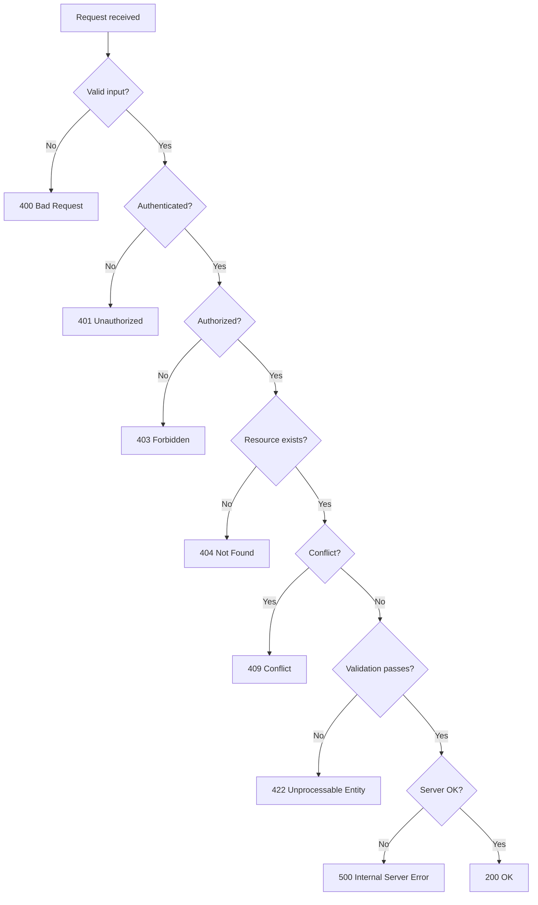

## Overview

Good error handling is what makes an API reliable. A well-designed error
response tells the client what went wrong, what to do about it, and how to avoid
it next time, without leaking internal details. This recipe covers RFC 7807
Problem Details, HTTP status codes, content negotiation with
`application/problem+json`, and idiomatic implementations in Python, JavaScript,
and Java.

RFC 7807 defines a standard JSON shape for error responses so clients can parse
errors predictably across endpoints and services. The successor RFC 9457 adds
optional fields like `instance` and clarifies extension semantics, but RFC 7807
remains the widely deployed baseline. You'll see both referenced in the wild.

## When to Use

- You're building or refactoring a REST API that clients depend on.
- You want to standardize error responses across several backend services.
- You're documenting failure modes for API consumers.
- You're designing error-handling middleware or exception mappers.

### When to avoid

- The API has only a few endpoints with no complex business logic. A lightweight
 `{ "error": "message" }` shape is enough.
- The API already uses a stable, client-dependent error format. Migrating to RFC
 7807 breaks compatibility and forces every client to update.
- Latency is extremely tight. Extra validation and response formatting add
 overhead, though it's usually negligible compared to database calls.

## Solution

### Python (FastAPI)

```python
from fastapi import FastAPI, HTTPException, Request
from fastapi.responses import JSONResponse
from pydantic import BaseModel

app = FastAPI()

class ProblemDetail(BaseModel):
 type: str = "about:blank"
 title: str
 status: int
 detail: str
 instance: str | None = None

@app.exception_handler(ValueError)
async def value_error_handler(request: Request, exc: ValueError):
 return JSONResponse(
 status_code=400,
 content={
 "type": "https://api.example.com/errors/invalid-input",
 "title": "Invalid Input",
 "detail": str(exc),
 "status": 400,
 "instance": str(request.url),
 },
 media_type="application/problem+json",
 )

@app.get("/users/{user_id}")
async def get_user(user_id: int):
 if user_id <= 0:
 raise HTTPException(
 status_code=404,
 detail={
 "type": "https://api.example.com/errors/not-found",
 "title": "User Not Found",
 "detail": f"No user with id {user_id}",
 "status": 404,
 },
 )
 return {"id": user_id, "name": "Ada"}
```

FastAPI's `HTTPException` accepts a dict in `detail`, which lets you embed the
full Problem Details shape. The custom handler for `ValueError` sets the
`media_type` to `application/problem+json` so clients can content-negotiate
correctly.

### JavaScript (Express)

```javascript
const express = require('express');
const app = express();

function problemResponse(type, title, detail, status, instance) {
 const body = { type, title, detail, status };
 if (instance) body.instance = instance;
 return body;
}

app.get('/users/:userId', (req, res, next) => {
 const userId = parseInt(req.params.userId, 10);
 if (Number.isNaN(userId) || userId <= 0) {
 return res.status(404)
 .set('Content-Type', 'application/problem+json')
 .json(problemResponse(
 'https://api.example.com/errors/not-found',
 'User Not Found',
 `No user with id ${req.params.userId}`,
 404,
 req.originalUrl
 ));
 }
 res.json({ id: userId, name: 'Ada' });
});

// Global error handler (must be last)
app.use((err, req, res, next) => {
 console.error(err);
 const status = err.status || 500;
 res.status(status)
 .set('Content-Type', 'application/problem+json')
 .json(problemResponse(
 'https://api.example.com/errors/server-error',
 'Internal Server Error',
 process.env.NODE_ENV === 'production' ? 'Something went wrong.' : err.message,
 status,
 req.originalUrl
 ));
});
```

The global handler catches anything `next(err)` passes to it. Setting
`Content-Type: application/problem+json` tells clients this is a Problem Details
response, not a generic JSON error.

### Java (Spring Boot)

```java
import org.springframework.http.*;
import org.springframework.web.bind.annotation.*;
import org.springframework.web.server.ResponseStatusException;
import java.net.URI;
import java.util.Map;

@RestController
public class UserController {

 @GetMapping("/users/{userId}")
 public Map<String, Object> getUser(@PathVariable Long userId) {
 if (userId <= 0) {
 throw new ResponseStatusException(
 HttpStatus.NOT_FOUND,
 "No user with id " + userId
 );
 }
 return Map.of("id", userId, "name", "Ada");
 }
}

@ControllerAdvice
public class GlobalExceptionHandler {

 @ExceptionHandler(ResponseStatusException.class)
 public ResponseEntity<Map<String, Object>> handle(ResponseStatusException ex, WebRequest request) {
 var body = Map.of(
 "type", URI.create("https://api.example.com/errors/not-found"),
 "title", ex.getReason(),
 "detail", ex.getReason(),
 "status", ex.getStatusCode().value(),
 "instance", request.getDescription(false).replace("uri=", "")
 );
 return ResponseEntity.status(ex.getStatusCode())
 .contentType(MediaType.valueOf("application/problem+json"))
 .body(body);
 }
}
```

Spring's `@ControllerAdvice` centralizes exception handling across all
controllers. The `MediaType.valueOf` call with the `application/problem+json`
content type makes the response carry the right content type.

## Explanation

### RFC 7807 fields

RFC 7807 defines five fields, all optional except `type`:

| Field | Purpose | Example |
| --- | --- | --- |
| `type` | URI identifying the problem type | `https://api.example.com/errors/not-found` |
| `title` | Short human-readable summary | `User Not Found` |
| `status` | HTTP status code (redundant but useful) | `404` |
| `detail` | Human-readable explanation specific to this occurrence | `No user with id 42` |
| `instance` | URI identifying the specific occurrence | `/users/42` |

The `type` field is the most important. It should resolve to a documentation
page describing the error, so clients can look up what it means without parsing
the `detail` string. Use `about:blank` when the problem type is generic and the
HTTP status code is enough.

### Extension fields

RFC 7807 allows extension fields beyond the standard five. The most common is
`errors` or `invalid-params` for validation errors that report several fields at once:

```json
{
 "type": "https://api.example.com/errors/validation",
 "title": "Validation Failed",
 "status": 422,
 "errors": [
 { "field": "email", "message": "must be a valid email" },
 { "field": "age", "message": "must be between 18 and 120" }
 ]
}
```

FastAPI and Spring Boot generate this shape automatically when you use their
built-in validation. If you're building it manually, keep the array structure
consistent across all validation endpoints.

### Content negotiation

Always set `Content-Type: application/problem+json` on error responses. This
media type is defined by RFC 7807 and lets clients distinguish Problem Details
from generic JSON errors. Without it, clients have to guess based on the body
shape, which breaks when you change formats.

### HTTP status code mapping

Never return 200 OK for a failed request. The status code carries the semantic
meaning that caches, proxies, and monitoring tools rely on:



Use 400 for malformed input (bad JSON, missing required fields). Use 422 for
semantically valid input that fails business rules (shipping to an unsupported
country). Use 409 for state conflicts (duplicate email on a unique constraint).
Use 502/503 for downstream service failures and 504 for timeouts.

### Global error handlers

Global error handlers centralize serialization so route handlers stay focused
on business logic. They also prevent stack traces and SQL details from leaking
to clients in production. In FastAPI, register handlers with
`@app.exception_handler`. In Express, add an error-handling middleware (four
arguments) as the last `app.use`. In Spring Boot, use `@ControllerAdvice` with
`@ExceptionHandler` methods.

## Variants

All variants return `Content-Type: application/problem+json` on errors.

| Language | Framework | Handler pattern | Typed errors |
| --- | --- | --- | --- |
| Python | FastAPI | `@app.exception_handler` | `HTTPException` |
| Python | Django REST | `exception_handler` setting | `APIException` subclasses |
| JavaScript | Express | Error-handling middleware | Custom `AppError` class |
| JavaScript | NestJS | `@Catch()` exception filters | `HttpException` |
| Java | Spring Boot | `@ControllerAdvice` | `ResponseStatusException` |
| Java | JAX-RS | `ExceptionMapper<T>` | `WebApplicationException` |
| Go | net/http | `http.HandlerFunc` + recover | Custom `AppError` struct |

## What Works

- Use the right HTTP status. 400 for client mistakes, 401/403 for auth, 404 for
 missing resources, 409 for conflicts, 422 for validation failures, 500 for
 server bugs. See [input validation](/recipes/input-validation/) for request
 validation patterns that prevent 400s.
- Include a correlation ID in error responses and logs so support can trace
 requests across services. See [API logging and
 audit](/recipes/api-logging-audit/) for structured logging patterns.
- Keep messages useful. "User name must be between 2 and 50 characters" beats
 "Validation failed."
- Never expose stack traces, SQL, or internal paths in production.
- Set `Cache-Control: no-store` on all error responses so CDNs and browsers
 don't cache failures.
- Document every 4xx and 5xx an endpoint can return in your OpenAPI spec. See
 [API documentation with OpenAPI](/recipes/api-documentation-openapi/) for
 spec-driven error documentation.
- Version your error format alongside your API. See [API
 versioning](/recipes/api-versioning/) for strategies that keep error shapes
 stable across breaking changes.

## Common Mistakes

- Returning 200 OK with an error body. It breaks caching, logging, and
 monitoring because proxies and CDNs treat 200 as success.
- Exposing internals like stack traces or SQL details to clients. This leaks
 architecture details that attackers can use.
- Using inconsistent shapes between endpoints. One returns `{ "error": "msg" }`,
 another `{ "message": "msg", "code": 123 }`. Clients end up writing special
 cases for every endpoint.
- Returning 500 for a missing resource (should be 404) or 403 for an
 unauthenticated request (should be 401). Status codes have semantic meaning.
- Swallowing exceptions. Catching everything and returning a generic 500 hides
 bugs you should fix.
- Returning different errors for "user not found" and "wrong password". This
 lets attackers enumerate valid accounts. Return the same generic
 "invalid credentials" message for both.

## Testing Strategy

Error handling needs contract tests, not just unit tests. Write tests that
verify every endpoint returns the correct status code and error shape for each
failure scenario.

### Python (pytest)

```python
import pytest
from fastapi.testclient import TestClient
from main import app

client = TestClient(app)

def test_get_user_not_found():
 response = client.get("/users/-1")
 assert response.status_code == 404
 assert response.headers["content-type"] == "application/problem+json"
 body = response.json()
 assert body["type"] == "https://api.example.com/errors/not-found"
 assert body["title"] == "User Not Found"
 assert "detail" in body
 assert body["status"] == 404

def test_invalid_input_returns_400():
 response = client.get("/users/abc")
 assert response.status_code == 422
 body = response.json()
 assert "errors" in body or "detail" in body
```

### JavaScript (Jest + supertest)

```javascript
const request = require('supertest');
const app = require('../app');

describe('Error handling', () => {
 it('returns Problem Details for 404', async () => {
 const res = await request(app).get('/users/-1');
 expect(res.status).toBe(404);
 expect(res.headers['content-type']).toMatch(/application\/problem\+json/);
 expect(res.body.type).toBe('https://api.example.com/errors/not-found');
 expect(res.body.title).toBe('User Not Found');
 });

 it('returns 500 for unhandled errors', async () => {
 const res = await request(app).get('/crash');
 expect(res.status).toBe(500);
 expect(res.body.status).toBe(500);
 });
});
```

Test every status code your API can return: 400, 401, 403, 404, 409, 422, 500.
Verify the `Content-Type` header, the presence of required fields (`type`,
`title`, `status`, `detail`), and that no stack trace leaks in production mode.

## Security Considerations

Error responses are a common source of information leakage. Treat every error
body as if an attacker will read it.

- **Never expose stack traces in production.** Return a generic message for 500
 errors and log the full trace server-side. FastAPI, Express, and Spring Boot
 all have environment-based masking.
- **Don't reveal internal architecture.** Error messages like "connection
 refused to postgres://10.0.0.5:5432" tell attackers your database host. Map
 infrastructure errors to generic 500s.
- **Avoid user enumeration.** Return the same error for "user not found" and
 "wrong password" on login endpoints. Varying response times also leak
 information, so keep both paths equally expensive.
- **Sanitize user input in error messages.** If you echo back the user's input
 in a `detail` field, you risk XSS if a client renders it without escaping.
 Use allowlists for which fields appear in error responses.
- **Set `Cache-Control: no-store`** on all error responses. Caching a 500
 response means the next request might get a stale error even after the server
 recovers.
- **Log errors with correlation IDs** but don't include them in the response
 body unless you've a support workflow that uses them safely.

## Monitoring and Observability

Error handling and observability are tightly coupled. Every error response
should generate a log entry, and error rates should trigger alerts.

- **Correlation IDs**: Generate a UUID per request, include it in the error
 response `instance` field or a custom header, and log it with every error.
 This lets support trace a specific failure across services.
- **Error rate dashboards**: Track 4xx and 5xx rates separately. A spike in 4xx
 usually means a client bug or API change. A spike in 5xx means your server is
 failing.
- **Alerting**: Alert on 5xx rate above baseline, not on individual 500s. A
 single 500 is normal; a sustained rate is an incident.
- **Structured logging**: Log errors as JSON with `status`, `type`, `endpoint`,
 `correlation_id`, and `stack_trace` fields. This makes them queryable in
 tools like Elasticsearch, Loki, or CloudWatch.
- **Distributed tracing**: Propagate the correlation ID across service
 boundaries so you can trace a single request through several hops. See
 [API logging and audit](/recipes/api-logging-audit/) for implementation
 patterns.

## Performance Considerations

Error handling adds overhead, but it's usually negligible compared to database
calls or external API requests.

- **Avoid synchronous logging in the hot path.** Use async logging (Python's
 `logging.handlers.QueueHandler`, Node's `pino`, Java's `AsyncAppender`) so
 error responses aren't blocked by disk I/O.
- **Correlation ID generation** should use UUIDv4 or ULID, not sequential
 counters. UUIDv4 is fast and collision-proof; ULID is sortable if you need
 time-ordered IDs.
- **Don't validate the error shape on every response.** Trust your handler to
 produce the right shape. Validate in tests, not in production.
- **Keep error responses small.** A Problem Details object with five fields is
 under 500 bytes. Don't embed large context objects or full request bodies.

## Troubleshooting

- **Clients receive `text/plain` instead of `application/problem+json`**: Check
 that your framework sets the content type before serialization. In Express,
 call `.set('Content-Type', ...)` before `.json()`. In Spring Boot, use
 `ResponseEntity.contentType()`.
- **FastAPI returns default error format instead of Problem Details**: You need
 a custom exception handler registered with `@app.exception_handler`. The
 default `HTTPException` handler doesn't set `application/problem+json`.
- **Spring Boot `@ControllerAdvice` not catching exceptions**: Make sure the
 advice class is in a package that Spring scans, and that the
 `@ExceptionHandler` annotation specifies the right exception type.
- **Error responses are cached by CDN**: Add `Cache-Control: no-store` to every
 error response. Some CDNs cache 4xx responses by default, which means users
 see stale errors after the issue is fixed.
- **Correlation ID missing in logs**: Generate the ID in middleware before the
 route handler runs, and attach it to the request context so the error handler
 can access it.

## See Also

- [RFC 7807 — Problem Details for HTTP APIs](https://datatracker.ietf.org/doc/html/rfc7807)
- [RFC 9457 — Problem Details for HTTP APIs (successor)](https://www.rfc-editor.org/rfc/rfc9457)
- [MDN — HTTP response status codes](https://developer.mozilla.org/en-US/docs/Web/HTTP/Status)
- [FastAPI — Handling Errors](https://fastapi.tiangolo.com/tutorial/handling-errors/)
- [Spring Boot — Error Handling](https://docs.spring.io/spring-framework/reference/web/webmvc/mvc-ann-rest-exceptions.html)
- [OpenAPI — Error Responses](https://spec.openapis.org/oas/v3.1.0#error-responses)
- [Companion code — runnable examples in Python, JavaScript, and Java](https://mathiaspaulenko.github.io/stack-practices-resources/resources/recipes/api/handle-errors/)

## FAQ

### Should I use RFC 7807 or a simpler custom format?

Use RFC 7807 for public APIs and microservices where clients benefit from a
predictable error shape. For internal tools with trusted clients, a simple
`{ "error", "message" }` object is fine if it's consistent across all endpoints.

### Why does RFC 7807 include a `status` field when the HTTP status code already conveys it?

The `status` field exists because clients sometimes process error bodies without
access to the HTTP status code, like when errors are logged, forwarded, or
stored in a queue. It's redundant for direct HTTP responses but useful in
asynchronous or proxied contexts.

### Can I extend Problem Details with custom fields?

Yes. RFC 7807 explicitly allows extension members. Common extensions include
`errors` (array of field-level validation errors), `trace_id` (correlation ID
for debugging), and `retry_after` (seconds to wait before retrying). Keep
extension names lowercase with `_` separators to avoid collisions with future RFC
additions.

### What's the difference between 400 and 422?

Use 400 Bad Request when the input is structurally invalid (malformed JSON,
missing required field). Use 422 Unprocessable Entity when the input is
structurally valid but fails business rules (shipping to an unsupported
country, scheduling a meeting in the past). 400 means "I can't parse this";
422 means "I parsed it but I won't accept it."

### How do I prevent error responses from leaking sensitive data?

In production, return a generic message for 500 errors and log the full stack
trace server-side. Use an allowlist for fields that appear in error responses
and avoid including user input directly. Set `Cache-Control: no-store` so
errors aren't cached. Test with production-like settings to catch leaks before
deployment.

### How do I handle errors across microservices?

Propagate the same correlation ID and error format across service boundaries.
Return 502 Bad Gateway for downstream failures, 503 Service Unavailable when a
dependency is down, and 504 Gateway Timeout when a downstream call times out.
Never forward internal downstream error details to the client, map them to
generic 502/503 responses instead.
