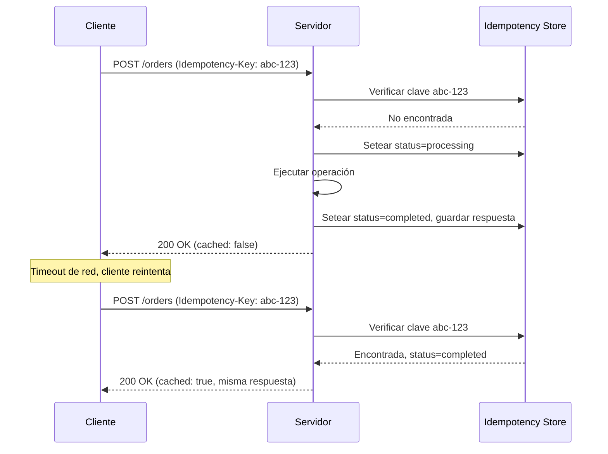

## Visión General

Una vez vi un sistema de pagos cobrarle a un cliente tres veces por el mismo
pedido. El cliente reintentó después de un timeout, el servidor procesó cada
reintento, y nadie se dio cuenta hasta que el cliente se quejó. Ese es el
problema que resuelve la idempotencia.

La idempotencia garantiza que hacer el mismo request a una API varias veces
produzca el mismo resultado que hacerlo una vez, sin efectos secundarios
duplicados. En sistemas distribuidos donde las redes fallan, los timeouts ocurren y los
clientes reintentan, esto importa más de lo que crees.

Esta receta cubre cómo construir endpoints idempotentes con idempotency keys,
restricciones de clave natural y verificaciones de estado. Incluyo ejemplos
funcionales en Python (FastAPI), JavaScript (Express) y Java (Spring Boot) para
que los copies directamente.

## Cuándo Usar

- Construir APIs de pagos o pedidos donde deben evitarse cargos duplicados.
  Consultá el [Checklist de Seguridad de APIs](/es/guides/api-security-checklist-guide/)
  para patrones seguros de pagos.
- Diseñar APIs consumidas por apps móviles con conectividad poco confiable.
  Consultá [Llamar REST API](/es/recipes/call-rest-api/) para patrones de retry
  en cliente.
- Implementar lógica de retry donde el mismo request puede enviarse varias veces.
- Crear receptores de webhooks que pueden entregar el mismo evento más de una
  vez.
- Implementar lógica de retry donde el mismo request puede enviarse varias veces.
- Crear receptores de webhooks que pueden entregar el mismo evento más de una
  vez.

### Cuándo evitarlo

- Los endpoints de solo lectura (`GET`, `HEAD`, `OPTIONS`) ya son idempotentes por
  la especificación HTTP: no necesitan manejo extra.
- Operaciones sin efectos secundarios o sin riesgo de retry rara vez justifican
  el almacenamiento y la lógica adicional.

## Solución

### Python (FastAPI)

```python
from fastapi import FastAPI, Header, HTTPException
from pydantic import BaseModel
import uuid
import time
from typing import Optional

app = FastAPI()

idempotency_store = {}
IDEMPOTENCY_TTL = 86400  # 24 horas

class CreateOrderRequest(BaseModel):
    customer_id: str
    amount: float
    currency: str = "USD"

@app.post("/orders")
def create_order(
    request: CreateOrderRequest,
    idempotency_key: Optional[str] = Header(None)
):
    if not idempotency_key:
        raise HTTPException(status_code=400, detail="Idempotency-Key header required")

    try:
        uuid.UUID(idempotency_key)
    except ValueError:
        raise HTTPException(status_code=400, detail="Invalid Idempotency-Key format")

    now = time.time()

    expired = [k for k, v in idempotency_store.items() if now - v["timestamp"] > IDEMPOTENCY_TTL]
    for k in expired:
        del idempotency_store[k]

    if idempotency_key in idempotency_store:
        stored = idempotency_store[idempotency_key]
        if stored["status"] == "completed":
            return {
                "id": stored["order_id"],
                "status": "completed",
                "cached": True
            }
        elif stored["status"] == "processing":
            raise HTTPException(status_code=409, detail="Request already in progress")

    idempotency_store[idempotency_key] = {
        "status": "processing",
        "timestamp": now,
        "order_id": None
    }

    try:
        order_id = str(uuid.uuid4())
        # ... guardar en base de datos ...

        idempotency_store[idempotency_key] = {
            "status": "completed",
            "timestamp": now,
            "order_id": order_id
        }

        return {"id": order_id, "status": "completed", "cached": False}
    except Exception:
        del idempotency_store[idempotency_key]
        raise
```

### JavaScript (Express)

```javascript
import express from "express";
import { v4 as uuidv4, validate as validateUuid } from "uuid";

const app = express();
app.use(express.json());

const idempotencyStore = new Map();
const IDEMPOTENCY_TTL = 86400 * 1000; // 24 horas

function isExpired(timestamp) {
  return Date.now() - timestamp > IDEMPOTENCY_TTL;
}

app.post("/orders", (req, res) => {
  const idempotencyKey = req.headers["idempotency-key"];

  if (!idempotencyKey) {
    return res.status(400).json({ error: "Idempotency-Key header required" });
  }
  if (!validateUuid(idempotencyKey)) {
    return res.status(400).json({ error: "Invalid Idempotency-Key format" });
  }

  for (const [key, entry] of idempotencyStore) {
    if (isExpired(entry.timestamp)) {
      idempotencyStore.delete(key);
    }
  }

  const existing = idempotencyStore.get(idempotencyKey);

  if (existing) {
    if (existing.status === "completed") {
      return res.json({
        id: existing.orderId,
        status: "completed",
        cached: true
      });
    }
    if (existing.status === "processing") {
      return res.status(409).json({ error: "Request already in progress" });
    }
  }

  idempotencyStore.set(idempotencyKey, {
    status: "processing",
    timestamp: Date.now(),
    orderId: null
  });

  try {
    const orderId = uuidv4();
    // ... guardar en base de datos ...

    idempotencyStore.set(idempotencyKey, {
      status: "completed",
      timestamp: Date.now(),
      orderId
    });

    res.json({ id: orderId, status: "completed", cached: false });
  } catch (err) {
    idempotencyStore.delete(idempotencyKey);
    throw err;
  }
});
```

### Java (Spring Boot)

```java
import org.springframework.http.HttpStatus;
import org.springframework.web.bind.annotation.*;
import org.springframework.web.server.ResponseStatusException;
import java.util.UUID;
import java.util.concurrent.ConcurrentHashMap;

@RestController
@RequestMapping("/orders")
public class OrderController {

  private final ConcurrentHashMap<String, IdempotencyRecord> store = new ConcurrentHashMap<>();
  private static final long IDEMPOTENCY_TTL_MS = 86400_000; // 24 horas

  record CreateOrderRequest(String customerId, double amount, String currency) {}
  record OrderResponse(UUID id, String status, boolean cached) {}
  record IdempotencyRecord(String status, long timestamp, UUID orderId) {}

  @PostMapping
  public OrderResponse createOrder(
      @RequestBody CreateOrderRequest request,
      @RequestHeader("Idempotency-Key") String idempotencyKey) {

    UUID key;
    try {
      key = UUID.fromString(idempotencyKey);
    } catch (IllegalArgumentException e) {
      throw new ResponseStatusException(HttpStatus.BAD_REQUEST, "Invalid Idempotency-Key format");
    }

    String keyStr = key.toString();
    long now = System.currentTimeMillis();

    store.entrySet().removeIf(entry -> now - entry.getValue().timestamp() > IDEMPOTENCY_TTL_MS);

    IdempotencyRecord existing = store.get(keyStr);
    if (existing != null) {
      if ("completed".equals(existing.status())) {
        return new OrderResponse(existing.orderId(), "completed", true);
      }
      if ("processing".equals(existing.status())) {
        throw new ResponseStatusException(HttpStatus.CONFLICT, "Request already in progress");
      }
    }

    store.put(keyStr, new IdempotencyRecord("processing", now, null));

    try {
      UUID orderId = UUID.randomUUID();
      // ... guardar en base de datos ...

      store.put(keyStr, new IdempotencyRecord("completed", now, orderId));
      return new OrderResponse(orderId, "completed", false);
    } catch (Exception e) {
      store.remove(keyStr);
      throw e;
    }
  }
}
```

## Explicación



Una **idempotency key** es un identificador generado por el cliente y enviado en
el header `Idempotency-Key`. El servidor lo verifica para detectar requests
duplicados y devolver la respuesta cacheada en lugar de ejecutar la operación
nuevamente.

El estado **processing** detiene dos requests concurrentes antes de que ejecuten
la misma operación dos veces. Cuando un segundo request llega mientras el primero
aún corre, el servidor devuelve `409 Conflict`. Lo aprendí por las malas: sin el
estado processing, un retry puede colarse entre la verificación de la clave y la
operación, causando el duplicado exacto que intentabas prevenir.

La **limpieza TTL** es necesaria porque los stores de idempotencia crecen sin
límite. Usá [Redis](https://redis.io/docs/manual/keyspace-notifications/) con
TTL o programá limpieza periódica. Un TTL de 24 horas es común para operaciones
financieras. La [documentación de Stripe](https://stripe.com/docs/api/idempotent_requests)
recomienda 24 horas para operaciones de pago.

El **manejo de errores** debe remover el marcador `processing` ante una falla
para que el cliente pueda reintentar. Consultá
[Manejo de Errores](/es/recipes/handle-errors/) para patrones de retry. De lo
contrario, la clave queda bloqueada.

La **idempotencia natural** con `PUT /orders/{id}` sigue la semántica HTTP:
actualizaciones repetidas con el mismo body dejan el recurso en el mismo estado.
Consultá [Llamar REST API](/es/recipes/call-rest-api/) para semántica de métodos
HTTP.

## Variantes

| Estrategia | Implementación | Ideal para |
| --- | --- | --- |
| Idempotency key header | UUID en header `Idempotency-Key` | Endpoints POST creando recursos |
| Restricción de clave natural | Constraint único de base de datos sobre clave de negocio | Operaciones UPSERT, registro de usuario |
| Verificación de state machine | Verificar estado actual antes de transición | Motores de workflow, procesamiento de pagos |
| ETag / If-Match | Requests condicionales con versión | Concurrencia optimista, updates |

## Mejores Prácticas

- Requerir idempotency keys en endpoints POST/PUT/PATCH que cambian estado. Lo
  hago obligatorio para cada endpoint que crea o transfiere dinero, después del
  incidente del triple cobro que mencioné antes.
- Usar UUID v4 para las claves. No uses enteros autoincrementales ni timestamps:
  colisionan entre clientes y rompen el propósito.
- Almacenar la respuesta completa, no solo un flag de estado, para que los
  duplicados devuelvan datos idénticos.
- Setear un TTL que coincida con la ventana de retry y documentarlo. Veinticuatro
  horas funciona para pagos; menos para operaciones menos críticas.
- Hacer que `DELETE /resources/{id}` devuelva `204` o `404`. Ambos significan que
  el recurso ya no existe, que es lo que el cliente necesita.
- Validar el formato de la clave y rechazar claves ausentes o malformadas con
  `400 Bad Request`. No aceptes strings arbitrarios: un UUID v4 mantiene el store
  limpio.

## Errores Comunes

- Verificar la idempotency key sin bloqueo atómico. Vi esto causar cobros
  duplicados en producción: dos requests paralelos pasan ambos la verificación
  antes de que cualquiera escriba el marcador processing. Usá un constraint único
  de base de datos o `SETNX` en Redis.
- Setear TTL infinito, eventualmente agotando el almacenamiento y degradando
  performance.
- Devolver respuestas diferentes para la misma idempotency key, rompiendo el
  contrato.
- Usar idempotency keys en requests GET, que ya son idempotentes.
- No remover el marcador `processing` ante falla, bloqueando retries
  permanentemente.

## Testing Strategy

Testeá la idempotencia con tres escenarios: requests duplicados, requests
concurrentes, y expiración de TTL. Cada uno atrapa una clase de bug distinta.

**Requests duplicados**: enviá el mismo request dos veces con la misma clave. El
segundo llamado debe devolver la respuesta cacheada con `cached: true`. Si
ejecuta la operación nuevamente, tu verificación de clave está rota.

**Requests concurrentes**: dispará dos requests simultáneos con la misma clave.
Uno debe exitosar, el otro debe recibir `409 Conflict`. Usá un test que lanze
threads paralelos o async tasks. Atrapé race conditions de esta forma que solo
aparecen bajo carga.

**Expiración de TTL**: seteá un TTL corto en tests (1 segundo), esperá, y
enviá la misma clave. El store debe tratarlo como un request nuevo. Esto atrapa
bugs donde la limpieza nunca corre o la comparación de TTL está mal.

```python
import pytest
from concurrent.futures import ThreadPoolExecutor

def test_duplicate_returns_cached(client):
    headers = {"Idempotency-Key": "550e8400-e29b-41d4-a716-446655440000"}
    r1 = client.post("/orders", json={"customer_id": "c1", "amount": 10}, headers=headers)
    r2 = client.post("/orders", json={"customer_id": "c1", "amount": 10}, headers=headers)
    assert r1.json()["cached"] is False
    assert r2.json()["cached"] is True
    assert r1.json()["id"] == r2.json()["id"]

def test_concurrent_one_wins_other_gets_409(client):
    headers = {"Idempotency-Key": "550e8400-e29b-41d4-a716-446655440001"}
    with ThreadPoolExecutor(max_workers=2) as pool:
        futures = [
            pool.submit(client.post, "/orders",
                        json={"customer_id": "c1", "amount": 10}, headers=headers)
            for _ in range(2)
        ]
        statuses = sorted(f.status_code for f in futures)
    assert statuses == [200, 409]

def test_expired_key_allows_new_request(client):
    headers = {"Idempotency-Key": "550e8400-e29b-41d4-a716-446655440002"}
    client.post("/orders", json={"customer_id": "c1", "amount": 10}, headers=headers)
    # Wait for TTL to expire (set TTL=1 in test config)
    import time; time.sleep(1.1)
    r = client.post("/orders", json={"customer_id": "c1", "amount": 10}, headers=headers)
    assert r.json()["cached"] is False
```

## See Also

- [Stripe Idempotent Requests](https://stripe.com/docs/api/idempotent_requests):
  implementación production-grade de idempotency keys en una API de pagos.
- [RFC 7231: Semántica HTTP](https://datatracker.ietf.org/doc/html/rfc7231#section-4.2.2):
  definiciones oficiales de safety e idempotency de métodos HTTP.
- [AWS API Gateway Idempotency](https://docs.aws.amazon.com/apigateway/latest/developerguide/api-gateway-idempotency.html):
  soporte managed de idempotency para APIs de AWS.
- [IETF Idempotency-Key Header Draft](https://datatracker.ietf.org/doc/draft-ietf-httpapi-idempotency-key-header/):
  propuesta de estándar para el header `Idempotency-Key`.
- [Llamar REST API](/es/recipes/call-rest-api/): patrones de retry en cliente
  que complementan la idempotencia del servidor.
- [Rate Limiting](/es/recipes/rate-limiting/): complementa la idempotencia para
  protección de APIs.

## Preguntas Frecuentes

### ¿Cuáles métodos HTTP son naturalmente idempotentes?

GET, HEAD, PUT, DELETE y OPTIONS son todos idempotentes por spec HTTP. POST es
la excepción principal: POSTs repetidos suelen crear múltiples recursos. PATCH
depende de la semántica del patch.

### ¿Cómo debería generar el cliente las idempotency keys?

Generá un UUID v4 antes del primer intento y reusá la misma clave para cada
reintento de la misma operación lógica. Nunca reusés una clave entre operaciones
diferentes, aunque parezcan similares.

### ¿Puedo implementar idempotencia sin un store dedicado?

Sí, con constraints de base de datos. Una tabla `payments` con un constraint
único sobre `(idempotency_key, merchant_id)` previene duplicados atómicamente.
Funciona cuando la clave mapea directamente a un registro. Para operaciones
multi-paso, un store dedicado es más claro.

### ¿Cómo se relaciona con rate limiting?

La idempotencia evita efectos secundarios duplicados. El rate limiting evita
muchos requests. Se complementan. Consultá [Rate Limiting](/es/recipes/rate-limiting/)
para límites de cliente y servidor.
